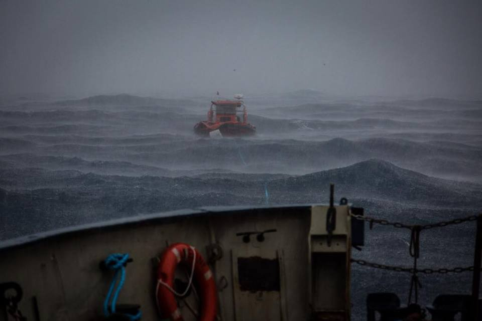
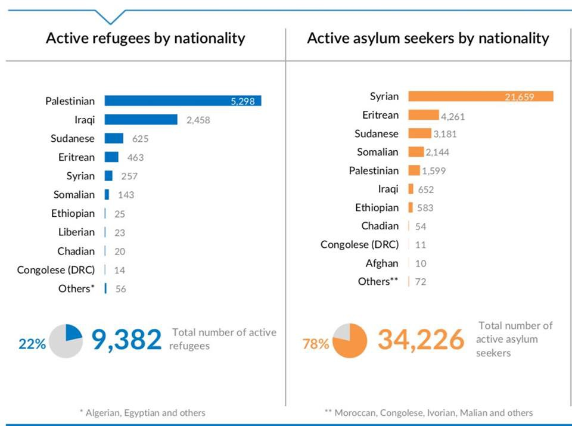
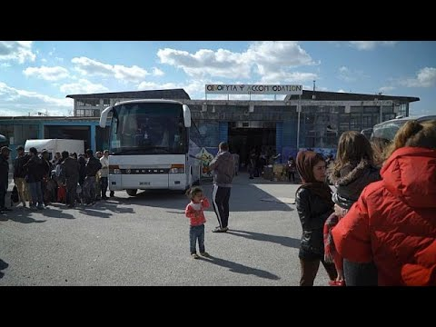
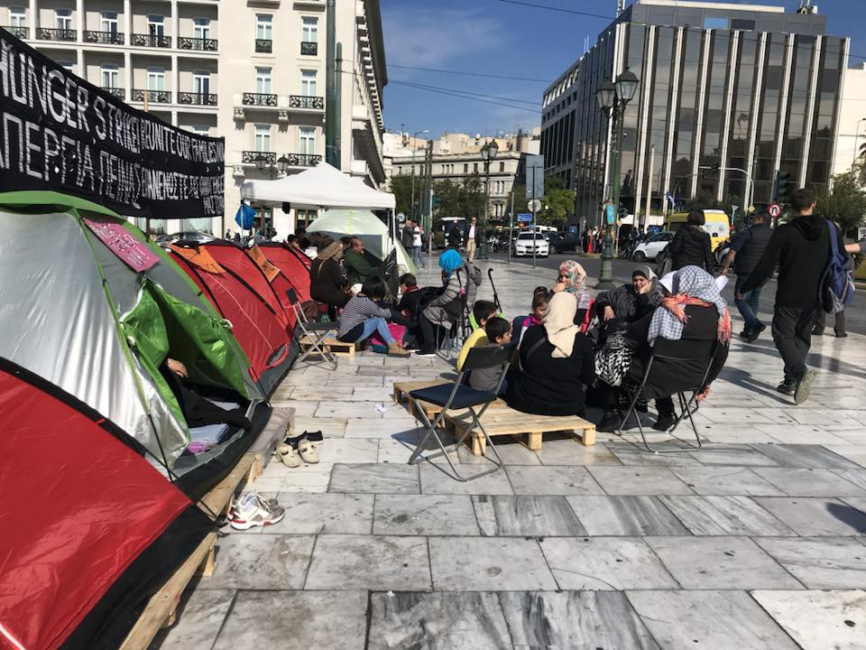

### AYS Daily Digest 03/11/17: One of the busiest days for rescues in recent months

_UK scheme helping 1000 carers announced / Six rescue operations carried out today, 700 rescued / 2000\+ people have been rescued this week / boat sunk off coast of Kalymnos island / Oinofyta camp closes / Day 3 of hunger strike in Athens and more_

Photo: Javi Julio
#### FEATURE

Six rescue operations were carried out today, making it [one of the busiest days for rescues in recent months](http://www.middleeasteye.net/news/hundreds-migrants-rescued-mediterranean-23-found-dead-816931175) \. The bodies of 23 migrants were recovered after a boat heading for Italy sank in the central Mediterranean\. Some 64 people on the boat, who ended up in the water, were saved by a EUNavForMed ship belonging to the EU’s Operation Sophia\. The bodies and the survivors are being taken to a port in Sicily, ANSA [reports](http://www.ansa.it/english/news/politics/2017/11/03/23-dead-in-migrant-boat-wreck-2_1f4beaca-c878-492a-95f9-dfa9936f9554.html) \. 700 people are reported to have been rescued\. Another rubber boat sank with 120 people missing\.

“The Italian Coast Guard ship Diciotti was heading for the southern port of Reggio Calabria with 764 rescued migrants on board, the ANSA news agency said in a report confirmed by the coast guard spokesman” MEE [writes](http://www.middleeasteye.net/news/hundreds-migrants-rescued-mediterranean-23-found-dead-816931175) \.

Salvamento Meritimo [wrote](https://twitter.com/salvamentogob/status/926440036073172995) a chilling reminder\. The number of people rescued at sea in the period January\-October was 357 in 2016 compared to 824 in 2017\. The total number of those rescued at sea between January\-October in all Spain was 13,544 people versus 5,384 in the same period in 2016\.
#### 2000\+ people have been rescued [this week](https://twitter.com/sarwatchmed/status/926470649815752706) \.
#### LIBYA

UNHCR published stats on refugees in Libya\. The numbers show there are 34,226 refugees, the majority of which are Syrian\. It is worth noting that these are just the UNHCR numbers for camps, yet there are many more in unofficial camps or worse\.

#### TURKEY

Some of Europe’s biggest stores are failing to stem the abuse of Syrian refugees who work in the Turkish factories that supply their clothes, a business pressure group said today, Reuters [reports](https://www.reuters.com/article/us-europe-turkey-refugees-retail/european-chains-profit-on-back-of-syrian-refugees-in-turkish-factories-watchdog-idUSKBN1D300C) \.

About 650,000 Syrian refugees are estimated to be working in Turkey, many in the garment industry, yet most lack work permits, leaving them at greater risk of abuse, the BHRRC said\. A Reuters investigation last year found evidence of Syrian refugee children in Turkey working in clothes factories in illegal conditions\.
#### GREECE

A wooden boat with refugees is [reported](https://www.thenationalherald.com/180435/greece-1-dead-several-missing-boat-migrants-sinks/) to have sunk off the coast of Kalymnos island in Greece\. At least three people drowned while 15 people, among them children, were saved\. There were probably 24 people on board, but the rest are missing\. The SAR operation is still ongoing\. Survivors were transferred to Kalymnos at 05:30, among them a 10\-year\-old boy whose mother passed away at sea\.
#### Oinofyta camp closes

Around 230 refugees had to leave the temporary camp where they were residing, an hour’s drive north of Athens, with the order to be moved to other camps\. The majority of the refugees who have resided in the Oinofyta camp in recent months are of Afghan origin, the rest are from Iran and Pakistan, NoBorders [write](https://www.facebook.com/nobordersnetwork/posts/1554000968001123?hc_location=ufi) \. Not all refugees have been given shelter in other camps, they added\.

“I do not know why they close the field when it is ready to face the winter and can accommodate around 600 refugees who will need shelter for the winter season,” volunteer Amy Anderson says in the video\. “Many wonder why a camp closes when thousands of refugees remain trapped in the Aegean islands\. The government argues that only some of them can be transferred to the continent, as is the case of minors and vulnerable men and women,” concludes the Euronews correspondent in the area\.

#### Athens — day 3 of hunger strike

The strikers in front of the parliament at Syntagma square [demanding faster family reunification](ays-daily-digest-01-11-17-hunger-strike-take-us-to-our-families-f91142e70ff0) are still determined to send their message to the government\(s\) \. They are staying outdoors in pop up tents and in the cold, trying to put pressure on the asylum services to speed up the extremely slow process and give them a long\-awaited solution\.

A male refugee from Syria, Amr Isa, said he was staying alone in Greece, separated from his family\. “My wife and my daughter are in Germany but I’m stuck here,” said Isa\. “I could not go because I only had money for two people\. We’ve been making requests to go to Germany for some months now and I know that my request has been accepted but for some reason, I’m still here — so I’ll stay here and hunger strike until they give us answers”, InfoMigrants report [s](http://www.infomigrants.net/en/post/5909/we-ll-stay-until-we-get-answers-migrants-on-hunger-strike-in-greece) \.

See the list of immediate needs [here](https://www.facebook.com/hungerstrike4familyreunification/posts/761648660707548?hc_location=ufi) \.

](assets/8e91afa50000/1*8EJ5VPh_AdIX-QLKZplspA.jpeg)

Photos: [Ruhi Loren](https://www.facebook.com/ruhi.akhtar.7)

Refugees in Mytilini have been on hunger strike for 16 days now\. Read more about the camp in our special report [here](ays-special-out-of-mytilini-adc59331de2d) \.

■■■■■■■■■■■■■■ 
> **[Arash Hampay](https://twitter.com/ahampay) @ Twitter Says:** 

> > Days 16
#Demonstration 
#mytilini #refugeesgr #refugee #hungerstrike #Greece https://t.co/yaEFjRgLku 

> **Tweeted at [2017-11-03 09:07:33](https://twitter.com/ahampay/status/926375282319257600).** 

■■■■■■■■■■■■■■ 

#### Arrivals

Two boats landed on Chios late last night carrying 62 \(32 men, 12 women, 18 children\) and 65 people \(24 men, 14 women, 27 children\) \. The situation is the same on Lesvos: two boats arrived carrying 128 people — Lesvos west, Gavathas, 62 people and Lesvos south, 66 people\. A third boat was picked up off the north coast near Eftalou and taken to Skala sykaminia, with 49 people on board\.
#### FRANCE

A scheme for helping 1,000 carers has been announced as the government prepares to hear the ruling in the court case regarding the end of the Dubs scheme, Guardian [reports](https://amp.theguardian.com/uk-news/2017/nov/01/foster-carers-housing-lone-child-refugees-to-receive-specialist-training) \. Only 200 refugee children have been brought to the UK under the scheme, while a further 280 places offered by councils around the UK are currently unfilled, they [reported](https://www.theguardian.com/world/2017/oct/23/children-needing-asylum-in-uk-not-being-helped-by-dubs-scheme) earlier\. Around 200 migrant children waiting to travel to the UK [are currently sleeping rough](https://www.theguardian.com/uk-news/2017/aug/10/teargas-cold-no-toilets-plight-of-refugees-back-in-calais-revealed) in Calais and nearby port towns\.

A new centre near Calais to enable the proper processing of unaccompanied child refugees has been opened this week where children will be able to claim asylum safely and legally\. The centre is a temporary solution designed to accommodate young people hoping to be reunited with family in the UK and those eligible to come to the UK under the Dubs scheme\. It appears that children with no family in the UK will also be able to be assessed at this new centre\.

Yet as anyone who has recently volunteered in Calais will know, the number of under 18s sleeping rough in dreadful danger far outstrips the 20 places available, [Calais Action](https://www.facebook.com/calaisaction/) commented\.

“The development of a centre near Calais is welcome, but it must be permanent and provide legal support to children trying to access safe and legal routes to Britain\.”

> “We must put an end to desperate children jumping on lorries, risking their lives and others as they seek to reach their loved ones — as is their legal right” Ald Dubs [said](https://amp.theguardian.com/uk-news/2017/nov/01/foster-carers-housing-lone-child-refugees-to-receive-specialist-training) \. 

We wrote about the judicial review of the management by the Home Office and the Court of Justice ruling against it [yesterday](ays-daily-digest-02-11-2017-let-the-children-in-876a7fc98e43) \. You can watch Thursday’s debate in Parliament on Calais and unaccompanied minors in Europe [here](http://safepassage.org.uk/news_posts/parliament-debate-on-calais-and-unaccompanied-minors-in-europe/) \.

The Refugee Women’s Centre announced that they will be working “under the umbrella” of [Help Refugees](https://www.facebook.com/HelpRefugeesUK/?fref=mentions) from now on\. There is now a dedicated fundraising page for the RWC [here](https://mydonate.bt.com/ev…/dunkirkrefugeewomencentre/450804) , see how you can help their efforts on the ground\.

> **_We strive to echo correct news from the ground through collaboration and fairness, so let us know if something you read here isn’t right\._** 

> **_If there’s anything you want to share, contact us on Facebook or write to: areyousyrious@gmail\.com\._** 

_Converted [Medium Post](https://areyousyrious.medium.com/ays-daily-digest-03-11-17-one-of-the-busiest-days-for-rescues-in-recent-months-8e91afa50000) by [ZMediumToMarkdown](https://github.com/ZhgChgLi/ZMediumToMarkdown)._
