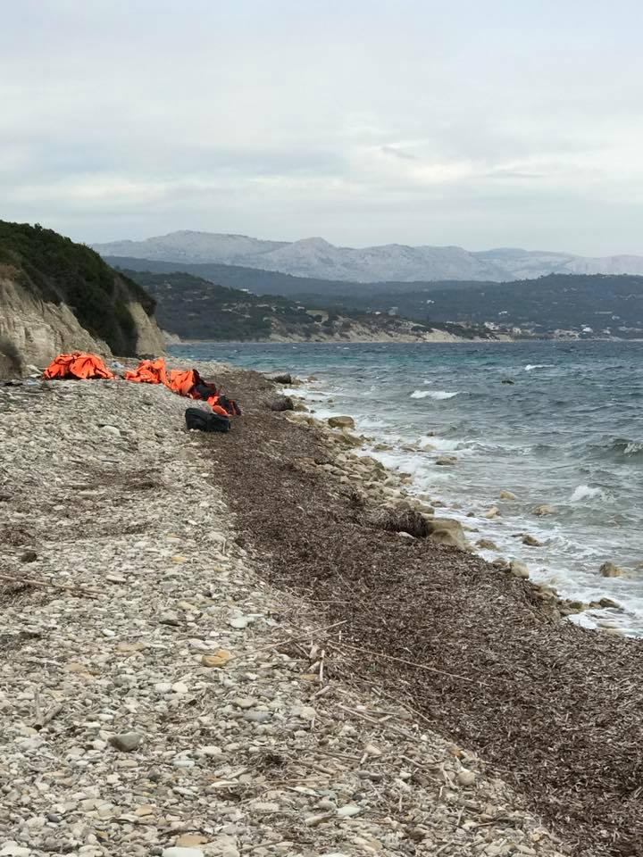
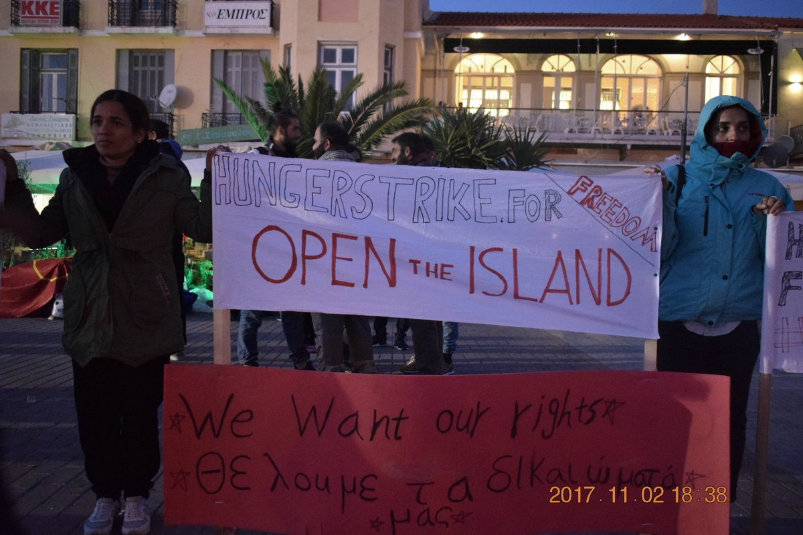
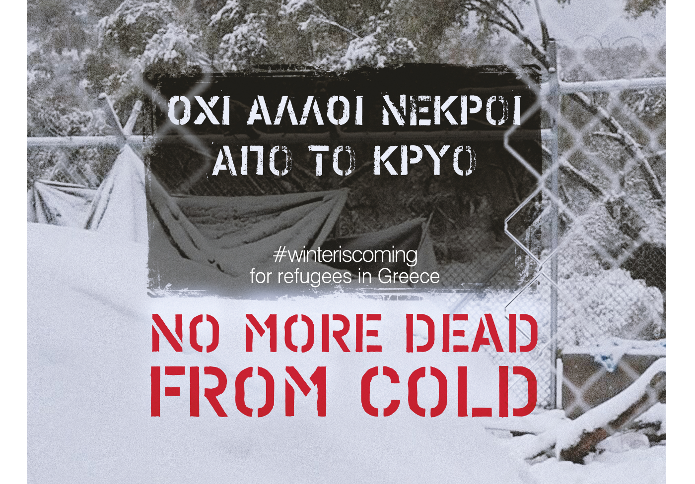
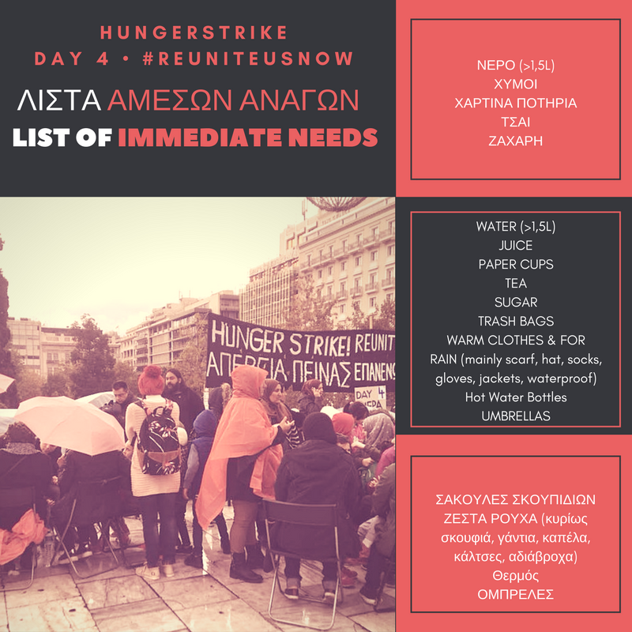
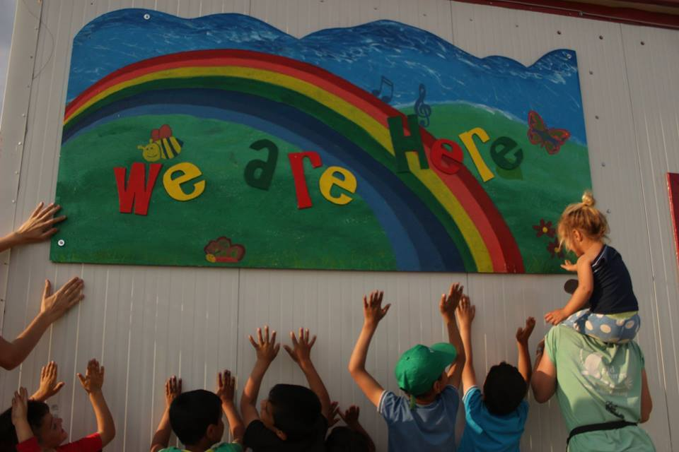
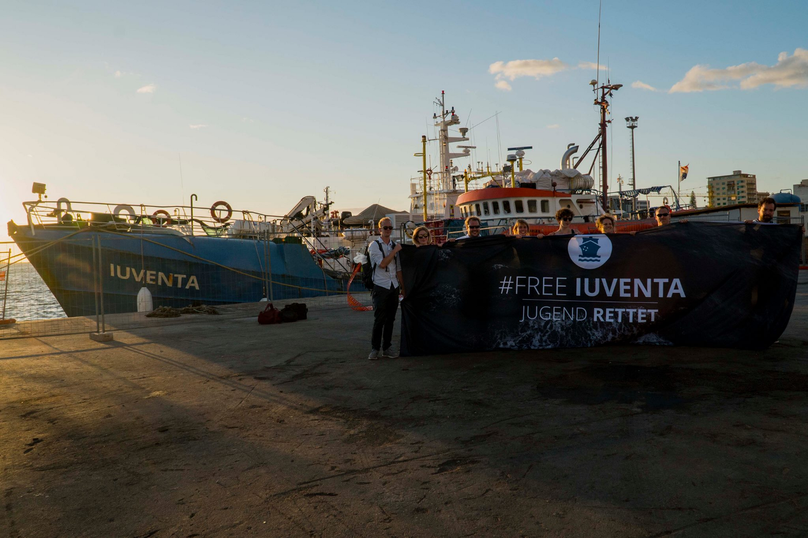

### AYS Daily Digest 04/11/17: Borders Destroy Families

_Protests continue on Lesvos and in Athens\. Volunteers needed all over Greece\. More than 2,560 refugees rescued over past four days\._

](assets/ee39667e4dc8/1*eCkeG1RTpmaS1SwSnx0Hyw.png)

Photo by [Open Borders](https://www.facebook.com/openeuborders/)
#### Greece
### Boat arrivals

Two boats with 49 and 36 people each arrived on the North coast of Lesvos and one boat with 59 people arrived on the South coast\.

Two boats with 62 people each arrived on Chios\.

The Chios Eastern Shore Response Team has been extremely busy over the last couple of days by meeting arriving boats, providing refugees with new clothes and cleaning up the beaches\. The group is currently looking for new volunteers\.

Photo by Kayra Martinez

Refugee Support Aegean adds that the temperature on Chios is now below 10 degrees at night and that there is no space for newcomers at the Vial hotspot\. [KeepTalkingGreece](http://www.keeptalkinggreece.com/) also warns of dropping temperatures all over Greece and Refugee Rescue says hypothermia is now becoming a constant danger\.

](assets/ee39667e4dc8/1*vy6-a9dWk-misG6NLjCZDg.png)

Photo by [Refugee Rescue](https://www.facebook.com/RefugeeRescueUK/)
### Hunger strike on Lesvos and in Athens

Today marks the 17th day of the occupation of Sapfous square on Lesvos and the 11th day of the hunger strike calling for transfers to the mainland in response to living conditions in Moria\.

Photo by Arash Hampay

Over 40 solidarity groups and organisations active on the Greek islands and mainland have called for urgent action from authorities to prevent more refugees from dying in the cold as winter sets in once again\. Six people who were seeking refuge and protection in Europe died in Moria last winter\. [Human Rights Watch](https://www.hrw.org/news/2017/10/23/greece-asylum-seekers-abysmal-conditions-islands) says that Greek islands have become places of indefinite confinement and that thousands of refugees are trapped in deplorable and volatile conditions\.

Today, Lesvos Lgbtiq\+ Refugee Solidarity also called for the transfer of LGBTQI\+ refugees to the mainland, arguing they are especially at risk in Moria as they face threats of homophobic and transphobic violence\.

The hunger strike at Syndagma Square, Athens, by seven women and seven men calling for a rapid reunification with their families in Germany, has entered its 4th day\. The group says many families have already been waiting for more than 18 months under deplorable conditions and calls on the Greek and German government to respect the legal limit of six months to reunify families from the date of acceptance\.

### Volunteers needed

The We Are Here Community Centre is in need of people to come and join their team of volunteers in the Nea Kavala refugee camp, Northern Greece\. We Are Here runs a range of educational and recreational activities for adults and children — English classes, sports, arts and crafts, a library, a women’s space, cooking, dance, and music\.

The Pampiraiki group also needs volunteers to sort and distribute donations
at the Elliniko Warehouse from Tuesday to Friday from 11am to 5pm\.
Both short\-term and long\-term volunteers are welcome — email pampiraiki@gmail\.com for more information\. For other volunteer needs, check out [GreeceVol](http://www.greecevol.info/task.list.php) \.
### More than 2,560 refugees rescued over past four days

Photo by Jugend Rettet

Jugend Rettet says it expects a decision over its appeal against the confiscation of its ship Iuventa to be announced at the earliest in December\. It says that “more than 3 months have passed since the seizure and there are still neither individual cases nor specific accusations against the organization or individuals”\. This seizure prevents Jugend Rettet from participating in search and rescue operations in the Mediterranean\. Meanwhile, the IOM says over 2,560 refugees were rescued over the past four days, while 34 bodies were recovered\.

> **_We strive to echo correct news from the ground through collaboration and fairness, so let us know if something you read here isn’t right\._** 

> **_If there’s anything you want to share, contact us on Facebook or write to: areyousyrious@gmail\.com\._** 

_Converted [Medium Post](https://areyousyrious.medium.com/ays-daily-digest-04-11-17-borders-destroy-families-ee39667e4dc8) by [ZMediumToMarkdown](https://github.com/ZhgChgLi/ZMediumToMarkdown)._
