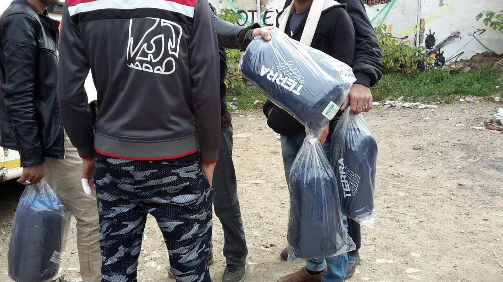
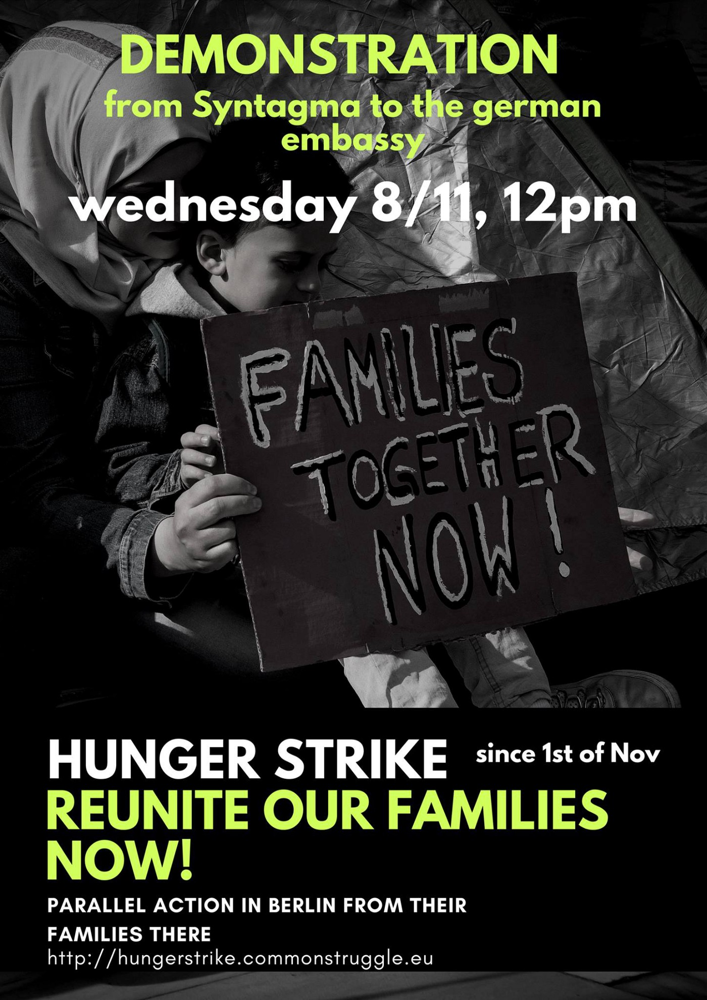
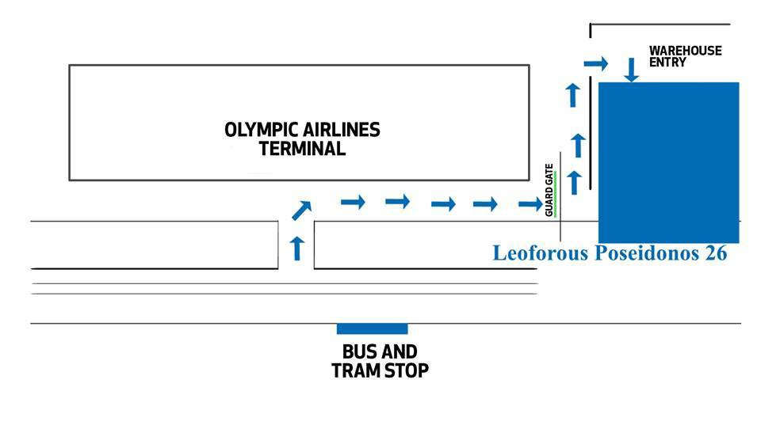

### AYS Daily Digest 05/11/17: 26 women found dead aboard a vessel upon arrival in Italy

■■■■■■■■■■■■■■ 
> **[MSF Sea](https://twitter.com/MSF_Sea) @ Twitter Says:** 

> > Today the bodies of 26 women who died at sea, were disembarked in Salerno by a EUNAVFORMED boat. The #Mediterranean continues to kill. https://t.co/WUNvotPyt1 

> **Tweeted at [2017-11-05 11:07:35](https://twitter.com/msf_sea/status/927130266073796608).** 

■■■■■■■■■■■■■■ 

The Spanish ship Cantabria helped bring to shore more than 400 refugees who were on a vessel heading to Cantabria\. Among them were the bodies of 26 women who had died along the way\. 23 of them were on one boat and the other 3 on another one\. The victims [might have drowned](https://l.facebook.com/l.php?u=http%3A%2F%2Fwww.ansa.it%2Fcampania%2Fnotizie%2F2017%2F11%2F05%2Fmigranti-sbarca-nave-a-salerno-a-bordo-26-donne-morte_ec02744f-44fd-49cb-a560-8a0817c85c93.html&h=ATNrYgSpW6wdfdxfNmmQo6AVEgFMOKV-3z9yaZxWPmriV0Vd1AWM1a0feSgQCJlnmAMWeCGhJinqMwbn1WLMixnLYgXAUm4NfvU4CJObVV9rRdknNieUu57lBx-nwttLO_IV1fSpZFMFmXUKeqZX51GIVal8y8UVUUgwpr5AQHCoAqznRyJr_ZU5qmX8ixLlXVsBv4qF32nVpw4tgsSplpw1YjLe5ONd8wPqk6_5PpunG558zcVnVDobRqvrWXf-SaywvORCxlse9w-YM8F6urWVWAEr) , but the authorities think its early to state this\. According to the prefect, the women are allegedly Nigerian, they were on board of the dinghies with some other men and ended up as victims of a drowning\.
The autopsy will reveal the cause of death and if they have been subject to violence\.

](assets/9189ba55cb8f/1*QO-yGWUgOFR-jKhgTp8Sig.png)

A SAR mission, Photo: [**Sea\-Watch**](https://www.facebook.com/seawatchprojekt/)
#### SYRIA

At least 75 people have been killed — many of them women and children — and 140 more have been injured in the car bomb attack perpetrated on Saturday by the Islamic State against displaced people in the Syrian region of Deir Ezzor, according to the report published by the [Syrian Observatory for Human Rights](http://www.syriahr.com/en/?p=77909) \.

> “The number of victims whose death has been confirmed so far by the OSDH has increased to 75, including dozens of children and women\.” 

In the province of Idlib the death of tens of children, young men and women have been reported due to the explosion of undetonated mines, shells and bombs\. These bombs are the remnants of the shelling of the regime and the military operation and the remnants of warplanes bombardment on areas in the province\.
#### TURKEY

Friday afternoon while travelling in a fishing boat south of the Dardanelles in western Turkey, the coast guard reported picking up a boat full of refugees\. The passengers included 110 Syrians, and the remaining 179 refugees were Pakistani, Afghan, Indian, Sri Lankan, Somali and Iranian nationals\. Seven Turkish and two Belarusian nationals who are thought to be migrant smugglers also were on board\.
#### GREECE
### Lesvos

Sappho square: it is day 18 of the protest, and day 10 of the hunger strike for men and the 5th day of the hunger strike for the women who recently joined, among whom there are minors\. There has been no response from authorities on the island as of yet\.

](assets/9189ba55cb8f/1*m_arS8lwhVaXtHHjjSD9rg.jpeg)

Photo: [**Arash Hampay**](https://www.facebook.com/arashampay)

Today, some of the protestors needed medical attention again\.

](assets/9189ba55cb8f/1*zujz_i1BY9ffiKnr90Pxtw.jpeg)

Photo: [Ruhi Loren](https://www.facebook.com/ruhi.akhtar.7)

[Lighthouse Relief](https://www.facebook.com/lighthouserelief/?hc_ref=ARSZBWPN9dVh1J3bTs5J6CbqieKegyzYh6qZEUCYdyVeu1FeEJT0lk-wY29JPXjYFSU&fref=nf) urgently needs volunteers to support their emergency response operations in Lesvos, beginning in mid\-December through the end of January\. Volunteers must be able to commit a minimum of three weeks and be in good physical shape\. For more information and to apply, visit: [https://www\.lighthouserelief\.org/volunteer/](https://www.lighthouserelief.org/volunteer/)
### Thessaloniki

Starting from last Monday and until they run out of stock, sleeping bags, blankets and tents are available in Blue Refugee Centre in Ioanni Kolleti, 25D\.

The teams of Docmobile are already preparing for hard winter weeks\. The nights are already extremely cold for this season\. Currently, they are especially looking after Patras, but are also maintaining their work in the Thessaloniki area\.

](assets/9189ba55cb8f/1*vcn5EMonEgKn5wbjeVZsyw.jpeg)

Photos: [**DocMobile — Medical Help e\.V\.**](https://www.facebook.com/docmobile.org/)
### Athens

Mater Filia is a daycare centre for kids under 5\. They take babies and toddlers from 3 months old\. Their space is open from Monday\-Friday \(7 am\- 6pm\) \. Groups vary from about 15–20 kids\. Main languages are English and some Greek\. They require 5 euro contribution per day to help cover costs such as rent/food/snacks etc

If any families are looking for daycare whilst parents go out to work, please contact Mater Filia through their Facebook group\.

If there are any groups that can help Mater Filia with providing donations such as food/snacks for the kids or other items for activities, please get in touch with them directly through the Facebook group\. If you can help to cover their rent, that would be even better as they are providing a vital service for parents who need childcare\. It has no government funding\.
#### Support the families striking

The struggle of the 7 women and 7 men on hunger strike goes on despite the cold and the rain until they manage to reunite with their families\. For the refugees currently on a [hunger strike](https://l.facebook.com/l.php?u=http%3A%2F%2Fwww.euronews.com%2F2017%2F11%2F02%2Frefugees-go-on-hunger-strike-in-athens-asking-to-be-reunited-with-their-families&h=ATOpfhNWQbf15q0oCiU8HFXyNbqSIRvRCe7C-eP-tvq8AKImVVynH44AeNvREWFU2NbxaZyVR4Mlo051cflgHtHIJWtflpQgtErzqCqkW18EMgPwf8KoFzeAX1LKNEYDFYVrEJES7lDWPZbZNraonL19rUMzmsv996f_0xRg0t8nD97gS-Onsui10YU9TcZjqyGMJkHo8JzdHS91s5mxmltBrjFBkE8aBjOEB98vFyAxvYVnTwxLbh13U3PyePU4Qa3iUijQSaB7u0qUs7uC) , volunteers are asking for doctors who could offer advice and help during the strike\.

A protest will be held on Wednesday, November 8 at noon\.

Event — Athens: 
[https://www\.facebook\.com/events/1852239798421241/](https://www.facebook.com/events/1852239798421241/?acontext=%7B%22source%22%3A3%2C%22source_newsfeed_story_type%22%3A%22regular%22%2C%22action_history%22%3A%22%5B%7B%5C%22surface%5C%22%3A%5C%22newsfeed%5C%22%2C%5C%22mechanism%5C%22%3A%5C%22feed_story%5C%22%2C%5C%22extra_data%5C%22%3A%5B%5D%7D%5D%22%2C%22has_source%22%3Atrue%7D&source=3&source_newsfeed_story_type=regular&action_history=%5B%7B%22surface%22%3A%22newsfeed%22%2C%22mechanism%22%3A%22feed_story%22%2C%22extra_data%22%3A%5B%5D%7D%5D&has_source=1&fref=mentions)

Event — Berlin: 
GERMAN, ARABIC, KURDISH, FARSI, ENGLISH TEXT
[https://www\.facebook\.com/events/1485938148127106/](https://www.facebook.com/events/1485938148127106/?acontext=%7B%22source%22%3A3%2C%22source_newsfeed_story_type%22%3A%22regular%22%2C%22action_history%22%3A%22%5B%7B%5C%22surface%5C%22%3A%5C%22newsfeed%5C%22%2C%5C%22mechanism%5C%22%3A%5C%22feed_story%5C%22%2C%5C%22extra_data%5C%22%3A%5B%5D%7D%5D%22%2C%22has_source%22%3Atrue%7D&source=3&source_newsfeed_story_type=regular&action_history=%5B%7B%22surface%22%3A%22newsfeed%22%2C%22mechanism%22%3A%22feed_story%22%2C%22extra_data%22%3A%5B%5D%7D%5D&has_source=1&fref=mentions)

Learn more: 
[Απεργία Πείνας Προσφύγων/Hunger Strike: “Reunite us with our families now”](https://www.facebook.com/hungerstrike4familyreunification/?fref=mentions)

**](assets/9189ba55cb8f/1*IBJ9Lz9Vzin-6QSZyIsMCQ.jpeg)

Photo: **[NoBorders](https://www.facebook.com/nobordersnetwork/?hc_ref=ARQqFy7PIQb4Tn7-JVZ5fNgoZpyRCPHnIs8PiNkI1FE9paJPJEPsrqqof-1eqFiBqW0)**
#### A large tent is needed for educational and social activities in Lavrio camp\.

“We are looking for a large tent to fit 40–50 people or of 15–20 metres for Lavrio 2 Refugee camp\. We are not allowed to build any structures here but we can put up a tent\. 
It’s 00:26 and I just returned from camp\. Winter is here and it is really really cold\. 
All the containers are too small for activities for a big number of people & also one container is a family home\. We’ve been doing movie nights and children’s activities outside\. Ad hoc educations sessions are also held outside\. Tonight we had to take movie night into a container due to the weather and it meant only a handful of people could participate\. It really is cold and it rained\!

People are constrained to their small containers and can’t even interact with each other leading to increasing isolation which was already a problem as Lavrio 2 is so far away from Athens with poor transportation\. We all know what the effects of low morale can be on people already effected by war and conflict in their home countries and on a journey for refuge\.”

](assets/9189ba55cb8f/1*nvSN2zrFJx7hrDgwVGofjg.jpeg)

Photo: [Ruhi Loren](https://www.facebook.com/ruhi.akhtar.7)
### Volunteering

[Northern Greece Volunteers](https://www.facebook.com/northerngreecevolunteers/?hc_ref=ARSQon9KOnnSQywYnxQvKVqAY8y5rLQb7aR46rs55mlQ83CXUfn_35Jv7cQmev-fQQo&fref=nf) need all kinds of VOLUNTEERS — teachers, doctors, translators & more\. Visit our website to find out more — [https://goo\.gl/J9S12u](https://goo.gl/J9S12u)

#### Volunteers are welcome to join the team at the Elliniko warehouse

> Dear international volunteers, you may volunteer at the Pampiraiki Warehouse in Elliniko \(old Athens airport\), where you will meet volunteers from various countries and get the opportunity to distribute humanitarian aid to refugee camps, shelters, squats, daycenters, flats etc\.
 

>  It is a good way to start your volunteering in Athens and get acquainted with volunteers and refugees\. We prefer regular volunteering, but we welcome all volunteers, even for a few days/hours\.
 

> We are open **Tue\-Fri 11–5** and you can get to the Elliniko warehouse in 20 mins from Syntagma \(Athens central square\) by buses A2 and B2 \(bus stop ELLINIKO\) \. 5 mins walk from the bus stop to our warehouse \(see plan\) \. 

#### MALTA

■■■■■■■■■■■■■■ 
> **[Open Arms](https://twitter.com/openarms_fund) @ Twitter Says:** 

> > El parto de Elsa Maleke entrañaba mucho riesgo y hemos logrado evacuación de madrugada a hospital #Malta en difíciles condiciones del mar https://t.co/resqvC4DNN 

> **Tweeted at [2017-11-05 13:16:53](https://twitter.com/openarms_fund/status/927162805144481792).** 

■■■■■■■■■■■■■■ 

#### ITALY
### Intercepted and turned back

Packed into a single rubber boat, 150 people were intercepted off the coast between the towns of Al Khoms and Garabulli, after travelling through the night towards Italy\.

Most of those people were from West African countries: Mali, Guinea, and Nigeria, and some were from Bangladesh, according to the [media](http://news.trust.org/item/20171104231336-88akm/) outlets\.

■■■■■■■■■■■■■■ 
> **[MISSION LIFELINE](https://twitter.com/SEENOTRETTUNG) @ Twitter Says:** 

> > How does it look? It looks like @[UNHCRLibya](https://twitter.com/UNHCRLibya) and @[IOM_Libya](https://twitter.com/IOM_Libya) are part of the kidnapping! It's a shame! Foto: [twitter.com/reuters/status…](https://twitter.com/reuters/status/926957248852750336) https://t.co/uecClCtk5F 

> **Tweeted at [2017-11-05 20:05:52](https://twitter.com/seenotrettung/status/927265729304584193).** 

■■■■■■■■■■■■■■ 

Last morning in Taranto, 324 people of several nationalities [arrived](https://l.facebook.com/l.php?u=http%3A%2F%2Fcorrieredelmezzogiorno.corriere.it%2Fbari%2Fcronaca%2F17_novembre_04%2Fmigranti-324-sbarcano-taranto-salvati-una-nave-tedesca-c0c8dcce-c184-11e7-a698-c9fb6b0737c8.shtml&h=ATPhHhuSTC0ZqEvpWBfoiCuyTFsc1mOCCGffIirc5fqTmfYCL0wFEoq0Ylr_KtrqDMPctBGQvkQSVqW6cfhhfAJYys4ksQCQigGBzVTduUR1DadimlM_wFZS3mE_YrjGgk_kUfewHdpIFXIP_16-h0T0e_Zu3Tx0NUy4Q45rDu3S0Tx9f8GN0xB7sZ_56WaPAlyeIeb86UGnisgC5FVaEzeMkvpgdCzTyRsB7BR5509m5JDF266m4h_ebBwfidWD) by boat, after having been rescued by German ship Mecklenburg\- Vorpommern\. On board there were also 32 unaccompanied children, they are to be hosted by the territorial educational structures, according to the [Italian sources](https://l.facebook.com/l.php?u=http%3A%2F%2Fcorrieredelmezzogiorno.corriere.it%2Fbari%2Fcronaca%2F17_novembre_04%2Fmigranti-324-sbarcano-taranto-salvati-una-nave-tedesca-c0c8dcce-c184-11e7-a698-c9fb6b0737c8.shtml&h=ATPi9MO9LtFl4n8cSX0QtbHiqQhGoq0OE5EBoR5W3lh2wm7Krrkjgkth0hn_FqYJm6hsRfXx_Aeucr53NMGvymHNcXaryRtetSWcxmmiMHjNwcAqk_5ankrwkQcHBVutvX7t30mWbmjw--PfuWg6Pfkbra2ozxmVZsJ4MT3oZv4n7XRVrLbt_xID3zHtkB11XeKlRzHTCRkyjuo188_wyWFJ8quLHeOXHqWm6bM0IP8rxY3AKynTewtptwXAzZTp) \.
#### FRANCE
### Police restrictions

“The increased police presence in Dunkirk has brought with it much anxiety, uncertainty and even a restriction of certain key items\. Ourselves and other organisations such as [Dunkirk / Dunkerque Refugee Women’s Centre](https://www.facebook.com/refugeewomenscentre/?fref=mentions) and [Care4calais](https://www.facebook.com/pages/Care4calais/1726727180917033?fref=mentions) have been refused entry to the camp now on various occasions with necessities such as blankets, tarpaulins and even our generator,” [Mobile Refugee Support](https://www.facebook.com/MobileRefugeeSupport/?hc_ref=ARQ6jNB1vMrnL61ai4tf0yDRv05DJ91jGJhgAvcm7HKVIZVNIAmsoo-7wj4c5vgmxBI&fref=nf) team reports\.

![“There are over 700 refugees in Calais now, and they all need warm coats, waterproof shoes, sleeping bags, shelter from the rain and so much more\. We don’t have anywhere near enough\. And it’s days like this, when it rains and the temperature drops that you really feel it\. There is nothing worse than saying “next time” and not knowing when that will be\. The media attention may have gone, but please don’t forget the refugees in Calais\. They need winter clothes and shoes, sleeping bags and tents\. Dry socks, hats and gloves\.” — [**Care4Calais**](https://www.facebook.com/care4calais/)](assets/9189ba55cb8f/1*8czLyGhxx6TcGHoTJx4yvA.jpeg)

“There are over 700 refugees in Calais now, and they all need warm coats, waterproof shoes, sleeping bags, shelter from the rain and so much more\. We don’t have anywhere near enough\. And it’s days like this, when it rains and the temperature drops that you really feel it\. There is nothing worse than saying “next time” and not knowing when that will be\. The media attention may have gone, but please don’t forget the refugees in Calais\. They need winter clothes and shoes, sleeping bags and tents\. Dry socks, hats and gloves\.” — [**Care4Calais**](https://www.facebook.com/care4calais/)

**_We strive to echo correct news from the ground through collaboration and fairness\._**

**_Every effort has been made to credit organizations and individuals with regard to the supply of information, video, and photo material \(in cases where the source wanted to be accredited\) \. Please notify us regarding corrections\._**

**_If there’s anything you want to share or comment, contact us through Facebook or write to: areyousyrious@gmail\.com_**

_Converted [Medium Post](https://areyousyrious.medium.com/ays-daily-digest-05-11-17-26-dead-women-on-board-a-vessel-that-arrived-to-italy-9189ba55cb8f) by [ZMediumToMarkdown](https://github.com/ZhgChgLi/ZMediumToMarkdown)._
