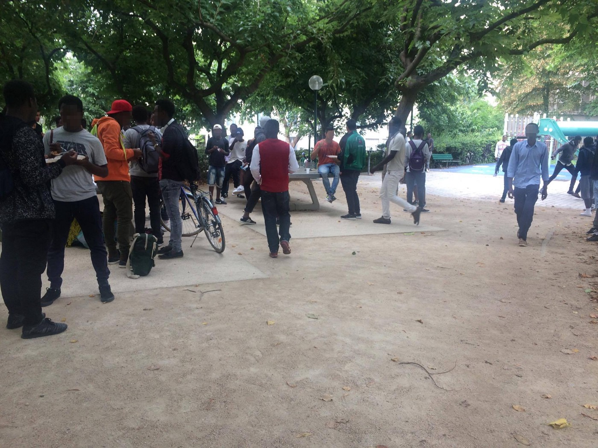
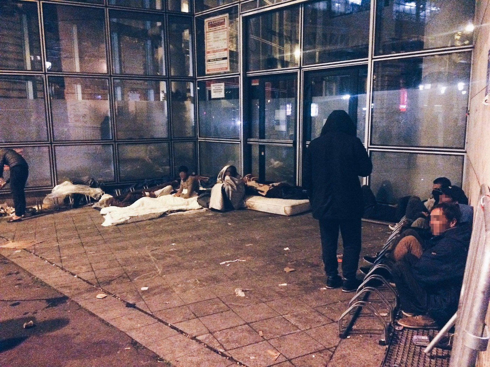
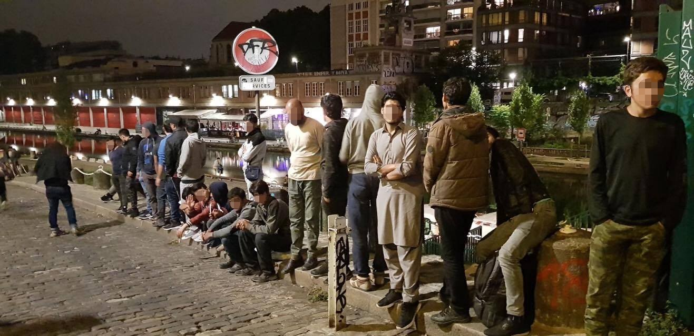
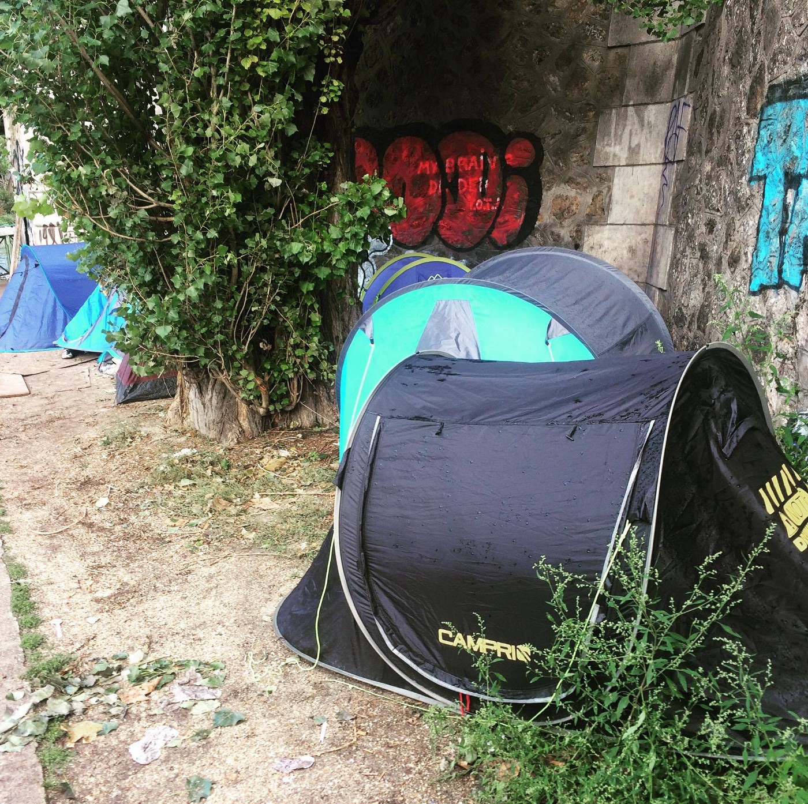

### AYS SPECIAL FROM PARIS \(part 1\): Child refugees rely on volunteers for shelter

](assets/1651ce6e04d2/0*5tvCJ5oBIQcXCTej.)

Photos of refugees sleeping in the streets of Europe\. By the [Phone Credit for Refugees Displaced People Group](https://www.facebook.com/photo.php?fbid=10159031582760374&set=g.1709109339334305&type=1&theater)

Dozens of unaccompanied minors are currently sleeping rough in the French capital, facing bureaucratic hurdles to be recognized as a child but also unable to use social services reserved to adults\.

Many of them did not even plan to leave for Europe according to the [REACH initiative](http://www.reach-initiative.org/greece-and-italy-refugee-and-migrant-children-face-challenges-in-achieving-their-objectives-and-lose-out-on-education-once-in-europe) , instead hoping to stay in northern Africa and Libya in particular, not knowing that it would transform into the “most traumatizing stage of their journey”\.

Their struggles however do not end after arrival to France\. Volunteers often have to fill the gaps left by local authorities, providing shelter and social support to children who would otherwise be at the mercy of human traffickers and other dangers — in its January report the [Refugee Rights Data Project](http://refugeerights.org.uk/wp-content/uploads/2017/02/RRDP_LifeOnTheStreets.pdf) said that 20 percent of them have experienced police violence during their stay in the city\. This experience of course leaves psychological scars as well\.

Catherine, of local association Paris d’Exil, says that they endured the journey with the hope that their lives would be transformed once they arrive in Europe, but are then traumatized by the cold and violent welcome they actually face on the continent\.

Many people have nowhere to go in Paris\. Credits: Danika Jurisic
### A grassroots network of hosts

To respond to this situation, Paris d’Exil has built up a network of hosts that was able to shelter around 100 teenagers in July, including around ten girls who would otherwise be sleeping outside\. Another 70 were on a waiting list, since hosts are often available for only a few days, meaning that several of them are necessary to host one child — the association’s main goal being to guarantee that none of them will have to return to the streets until they are completely taken in charge by the state\.

Currently Paris d’Exil says it hosts only 50 minors and knows of 233 children sleeping in the streets — many more are probably outside, invisible to associations and support\.

Not only adults, but also unaccompanied minors are sleeping rough\. Credits: Danika Jurisic

Most volunteers insist that it shouldn’t be their role to shelter them and that they would rather see these unaccompanied minors be under the responsibility of state authorities, as is their right by law — “we would rather not exist”, Valérie, who is responsible for matching minors with hosts, told AYS\.

She added that their action nevertheless remains necessary, as unaccompanied minors have a difficult time being recognized as such and are often unable to at least receive temporary shelter while their situation is being evaluated\.
### Questionable evaluation of minors

Normally, unaccompanied minors should go to the DEMIE, managed by the Red Cross, and get a bed in a hotel or shelter while waiting for an evaluation of their situation at the same institution\.

However, ADJIE, a collective of NGOs supporting and defending minors, [says that most minors face a “pre\-interview” of 15–20 minutes](http://www.infomie.net/spip.php?article3651&lang=fr) to determine their age, after which their demand for at least temporary shelter is denied\. It says it received 52 minors who were rejected the day of their presentation to the DEMIE between September 2016 and January 2017, despite 32 of them having identity papers proving they are underage\.

ADJIE says that some “privileged” teenagers get the chance to be interviewed around one month later, but often do not have access to housing during that time\. A Red Cross educator also denounced the situation, giving the example of a seemingly 14 year old boy leaving the DEMIE without anywhere to sleep\.

After their evaluation, around 80 percent of minors are not recognised as such and are denied protection by social services\. The DEMIE often uses absurd justifications to deny that refugees are underage\.

Many underage people do not receive a shelter\. Credits: Danika Jurisic

One of these cases was denounced by Delphine Schilton, a psychoanalyst volunteering for the “Collectif de soutien aux exilés” \(CPSE\) \. In her [Op\-Ed for Le Point](http://www.lepoint.fr/societe/refugies-l-etat-jette-a-la-rue-des-centaines-d-enfants-27-06-2017-2138619_23.php) , she told the story of 16\-year old Mohammad, who left Guinea after the murder of his parents and arrived in France after facing torture and kidnapping in Mali and Libya\. Once in Paris, he went to the DEMIE but was considered to be an adult by the institution, under the pretext that he disposes of “great autonomy” and does not have the necessary documents to prove his identity\.

Delphine Schilton of course pointed out that being “autonomous” is not enough to prove someone’s age and that those who are not autonomous enough for the journey, have already died in the desert or at sea\. Besides that, Mohammad’s kidnappers in Mali took his papers away\. Should he really have asked them to give him back his papers before managing to escape?

One Red Cross educator says that around 50 percent of minors who are not recognized as such, and appeal the decision with the help of the ADJIE, are finally taken in charge by the state, clearly showing that the evaluation of minors is not working\. The issue is that they are not sheltered during the appeal process, meaning that they could face even more time in the streets\. It’s during that time in particular, that they are hosted by volunteers, as they find themselves in a “legal no\-man’s land” according to Valérie, neither considered as minors nor as adults\.

A makeshift camp in Paris\. Credits: Danika Jurisic
### A petition to improve the evaluation of minors

Paris d’Exil has recognized that this situation cannot continue much longer, with volunteer Valérie noting that they were able to host almost everyone a year ago and that this has become mission impossible today\. The association has therefore decided to focus not only on field work but also on advocacy, to ensure that public authorities take their share of responsibility\.

Aubépine, another member of the association, says that advocacy has become essential, since they do not want to be simply a charity but hope to fundamentally change the situation\.

To do so, Paris d’Exil created the first [e\-petition](https://www.parisdexil.org/pour-que-paris-protege) that was successfully presented to the city of Paris, using a mechanism created by the city itself, allowing the petition to be discussed during the Paris Council after a signature by 5,000 residents\. The petition was debated by the city council beginning of July and called on Paris to improve both the evaluation of minors and to host minors while their situation is being evaluated\. In particular, it called on authorities to assume a ‘presumption of minority’, meaning that it is the state’s responsibility to prove that these refugees are adults, rather than forcing the minors to prove their age\.

The City Council seemed overtly receptive, recognizing the urgency of the situation\. However, as is so often the case, Councillors mostly shifted the blame on the state, with Mayor Anne Hidalgo arguing that the “municipal level \(…\) cannot face this humanitarian challenge alone, in particular regarding the evaluation of minors and the protection of those who are considered to be adults”\. She insisted that Paris is overwhelmed and that the state “now has to take over”\.

Volunteers seemed mostly to agree with this point, noting that the state has certainly not done enough\. Aubépine for example pointed out that other countries like Germany and Sweden have received far more refugees and that nobody is sleeping in the streets in those countries\.

There was however also a feeling of resignation among volunteers after the debate\. The Council’s overall rhetoric seemed to show that the state and the city will continue to blame each other, allowing the situation to deteriorate\.

In the meantime, associations and volunteers will have to continue filling the holes, hosting the most vulnerable when possible, and simply giving a blanket and some moral support to others\.

> **_We strive to echo correct news from the ground through collaboration and fairness, so let us know if something you read here isn’t right\._** 

> **_If there’s anything you want to share, contact us on Facebook or write to: areyousyrious@gmail\.com\._** 

_Converted [Medium Post](https://medium.com/are-you-syrious/ays-special-from-paris-part-1-child-refugees-rely-on-volunteers-for-shelter-1651ce6e04d2) by [ZMediumToMarkdown](https://github.com/ZhgChgLi/ZMediumToMarkdown)._
