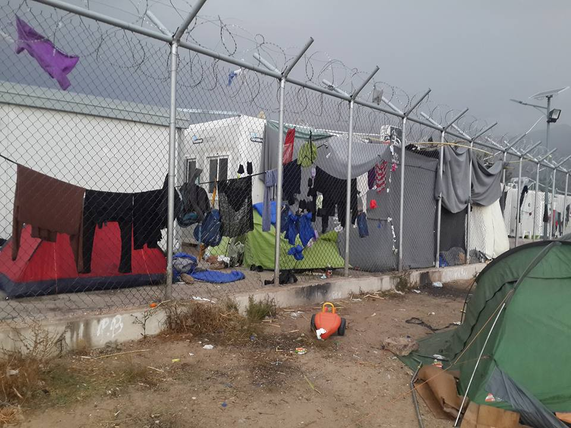

### **Open Letter to the European Commission from Chios**

EU Commission must take responsibility for inhumanity of Greek hotspots

](assets/40fb64bde0bf/1*9yKEsPDsAR42-AbdBsysLg.jpeg)

Chios\. Photo by [**Chios Eastern Shore Response Team**](https://www.facebook.com/groups/421759534684819/)

We, the undersigned voluntary organisations, have been providing humanitarian aid on the Greek island of Chios for more than two years\. We are writing to express our deepest concerns with regard to the situation of refugees on the island\. Whilst the inhumane conditions on Chios for refugees is not a new issue, the situation has reached tipping point in recent weeks with an increase in arrivals, the withdrawal of most NGOs, and the closure of Souda camp in the city, which has left the EU hotspot Vial as the sole facility that accommodates refugees on the island\.

In particular, we would like to draw your attention to the following issues:
- **Lack of accommodation** : There are currently more than 1800 people in Vial, which by far exceeds the official capacity of the camp\. The camp [fails to provide](https://www.youtube.com/watch?v=oh0jDwbRT0U&feature=youtu.be) dignified shelter and sanitation, and cover even the most basic human needs\. More than 20 UNHCR tents have been set up in a nearby field to provide some form of rudimentary shelter to hundreds of recently arrived, traumatised refugees — including many children, pregnant women, and people suffering various health problems\. All tents are currently over capacity, with 9 to 12 people in each\. Conditions are atrocious — there is no electricity, no toilets, no sanitation, no running water\. Toxic waste water from nearby chemical toilets, which are no longer functioning, flows next to the tents, causing serious public health risks\. Basic items such as blankets and clothes are provided only by independent groups of volunteers who are already overstretched to capacity\. Some refugees have been offered no shelter at all, forced to resort to constructing their own makeshift shelters in the mud, made of blankets and discarded tarpaulin\.
- Only in the last two weeks, more than 600 people, including many children and other vulnerable persons, have arrived and local authorities have failed to offer an adequate solution for sheltering them\. In scenes not seen since the first days following the implementation of the EU\-Turkey deal in March 2016, dozens have spent the night outside on the concrete floor at the main port of Chios due to a lack of accommodation\.

Vial, October 2017\. Photo by Abdullah Ali Darwish\.
- **Lack of medical care** : there continues to be a lack of medical support for the population residing in Vial\. During the day, there are currently only two doctors available for the entire camp population\. Between 5–9pm there is only one nurse onsite\. There is no medical staff operating beyond 9pm inside the camp and medical emergencies rest on the response of the understaffed and underfunded hospital that only has one ambulance\.
- **Inadequate provision of food** : we are receiving complaints daily from children and adults that the queuing time for the food distribution in Vial can take up to three hours\. Moreover, due to the lack of planning there are often not enough portions for all\. This is particularly concerning, as vulnerable persons, such as unaccompanied minors, are potentially not receiving food during the day\.
- **Delay of asylum procedure:** due to the high number of arrivals, refugees who arrive on Chios often wait more than two months for their interview with the Greek Asylum Service or the European Asylum Support Office \(EASO\) \. This is alarming given the inhumane conditions the refugees are staying in\.

The situation on Chios is critical and, with weather rapidly conditions deteriorating and severe rain forecast this week, demands an immediate response from local, national and European authorities\. We hereby add our voice to a [recent call by more than 100 grassroots civil society organisations](https://opentheislands.wordpress.com/statement/) and leading [international NGOs](https://www.hrw.org/news/2017/10/23/joint-letter-prime-minister-tsipras-re-deteriorating-conditions-asylum-seekers) to promptly **close the hotspots** and **decongest the islands** by ending restrictions on the freedom of movement of asylum\-seekers arriving on the Greek islands and provide them with **adequate reception on the mainland** outside of detention facilities\.

Vial, October 2017\. Photo by Abdullah Ali Darwish\.

We are not willing to tolerate the sight of thousands of refugees freezing in tents along the EU’s borders\. While acknowledging that the Greek government bears primary responsibility for guaranteeing the fundamental rights of refugees, we would like to draw your attention to the **European Union’s positive and supervisory obligations under EU law** and ask:
- How long will it take for the European Commission to assume its **shared responsibility for the inhumane and degrading conditions in the hotspots** , established and funded by the EU, in the Aegean Sea?
- How long will the European Commission continue to hail the ‘success’ of the **EU\-Turkey deal** in spite of the widely documented **fundamental rights violations** of the thousands of refugees trapped on these islands that we witness daily?
- What **concrete and immediate actions** will the European Commission undertake to guarantee the **protection of fundamental rights** of refugees in these hotspots?

We look forward to your reply and to see prompt and adequate action taken to relieve the suffering on Chios and the other affected Greek islands\.

Yours sincerely,

[**Action from Switzerland**](https://actionfromswitzerland.ch/)

[**Be Aware And Share \(BAAS\)**](https://www.baas-schweiz.ch/?lang=en)

[**Chios Eastern Shore Response Team**](https://www.facebook.com/groups/421759534684819/)

[**Chios Solidarity**](https://www.facebook.com/chiossolidarity/)

[**ChooseHumanity**](http://choosehumanity.ch/)

[**FEOX Rescue Team**](https://www.facebook.com/FEOX-rescue-team-1584119558539350/)

[**Humans for Humans**](https://www.imagineprojectgreece.com/)

[**People’s Street Kitchen of Chios**](https://www.facebook.com/Chios.Street.Kitchen/)

[**RefuComm**](http://refucomm.com/)

[**Refugee Law Clinic Abroad e\.V\.**](https://refugeelawclinicsabroad.org/)

[**The Hero Centre**](https://www.herocentre.org/)

[**Salvamento Marítimo Humanitario \(SMH\)**](http://www.smh.eus/index.php/en/about-us/)

[**Donate4Refugees**](https://www.donate4refugees.org.uk/)

_\*This letter has been sent to Matthias Ruete, the **Director\-General of the Directorate\-General for Migration and Home Affairs \(DG Home\)** , Simon Mordue, **Deputy Director\-General for Migration \(DG HOME\)** , Laurent Muschel, **Director for Migration and Asylum \(DG HOME\)** , Monique Pariat, **Director\-General of DG ECHO** , Jean\-Louis De Brouwer, **Director for ECHO emergency assistance in Greece** , Tiina Astola, **Director General, Directorate\-General for Justice and Consumers \(DG JUSTICE\)** , Emmanuel Crabit, **Director Fundamental Rights \(DG JUSTICE\),** as well as the directors of **FRONTEX** , **EASO** , the **EU Fundamental Rights Agency** , and the **EU Ombudsman\.**_

\* \* Contact us with any press inquiries: [chiosmediateam@gmail\.com](mailto:chiosmediateam@gmail.com)

_Converted [Medium Post](https://areyousyrious.medium.com/open-letter-to-the-european-commission-from-chios-40fb64bde0bf) by [ZMediumToMarkdown](https://github.com/ZhgChgLi/ZMediumToMarkdown)._
