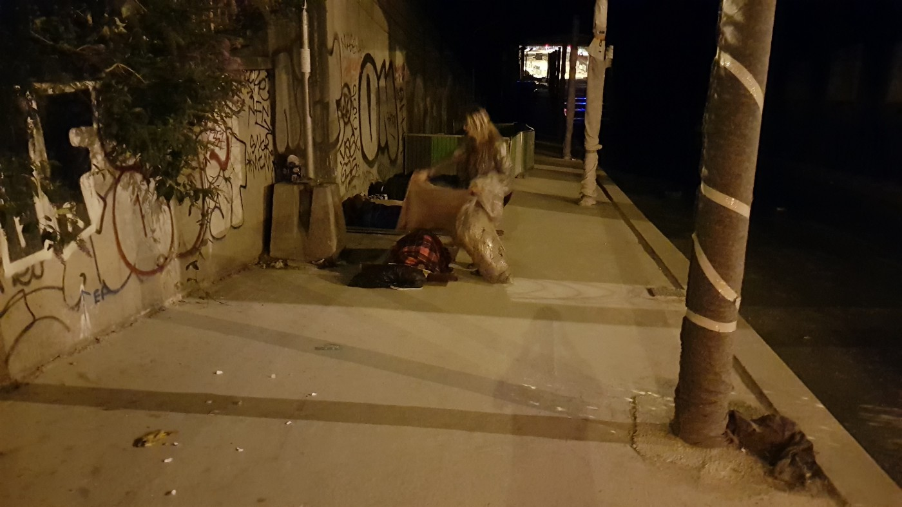
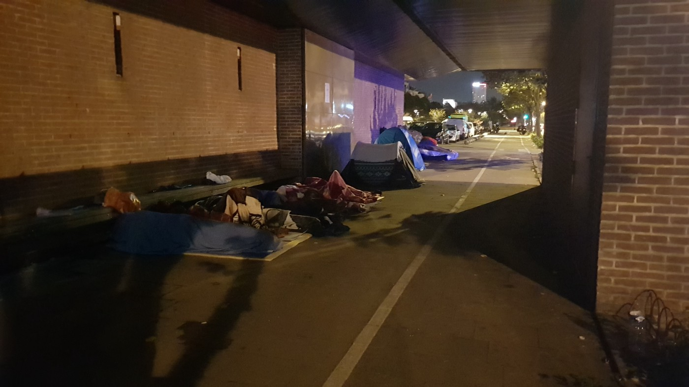

### AYS SPECIAL FROM PARIS \(part 2\): The never ending cycle

_The situation in Paris has worsened since the last major eviction of the streets of Porte de la Chapelle on 18th August 2017, when about 2500 people were taken to reception centers\. However, after just couple of weeks, volunteers are estimating that there is around 1500 to 2000 people sleeping rough in France’s capital\._

Blankets or one of the most needed items in Paris\. Credits: AYS

Volunteers on the ground keep running out of donations, especially blankets are requested every few days\. The different teams operating onsite tried to intensify their collaboration, to meet the needs faster and use the resources more effectively\. Nevertheless, they are struggling to even meet the basic needs of the homeless people sleeping rough in Paris\.

Recently Utopia56, one of the ground teams, stopped distributing aid to single men, because they are desperately over their capacity\. “They are so utterly stretched when it comes to minors and families, they simply don’t have the resources to deal with any single men,” volunteers from Paris Refugee Ground Support report\.

■■■■■■■■■■■■■■ 
> **[Full Measure News](https://twitter.com/FullMeasureNews) @ Twitter Says:** 

> > Europe’s refugee crisis hasn’t gone away. In Paris, an activist says, “in this area, we are not a human rights country” Sunday @FullMeasure. https://t.co/SIhNTHM8Ij 

> **Tweeted at [2017-09-15 22:15:20](https://twitter.com/fullmeasurenews/status/908816528606420992).** 

■■■■■■■■■■■■■■ 

But even families and minors are faced with extreme dificulties\. In the camp at Porte de la Chapelle, called the ‘bubble’, they hardly receive any supplies\. This includes basic needs such as food and clothes\. But most important: shelter\. “They are desperately trying to find accommodation for them\. That just isn’t there,” a volunteer onsite told AYS\.

The groups that are suffering the most in these circumstances are minors and families\. But even if volunteers would like to support them better, they are just not well enough equipped\. And the government does not seem to fill the gaps it has created, and that have been ignored over the last months\. Authorities looked away, letting this urban human crisis in one of the most developed countries in the world, emerge\. Volunteers, who are familiar with single cases, also complain about slow processes of the asylum procedure and a lack of help support for them\.

Volunteers cover more than 30 spots, where people sleep\. Credits: AYS

Ignoring something does not mean to not know or to not be aware of a situation\. It’s not only because of the fact, that more than 30 evictions have happened in Paris in just the last two years\. Much more police and authorities are becoming more repressive the last weeks: During the last months, the use of tear gas/pepper spray or practices of harassing people and taking their belongings have been reported increasingly\. Usually this happened shortly before evictions happened\. Nowadays these methods seem to be used by the executive almost on daily basis\. Volunteers on the ground assume, that the intention of this measures is, to make the people hide and not raise public awareness\. Newer stories further say, that they gather the people and force them to go into the camps\. For some this means, that the now face Dublin deportations to other European countries\. When sent back, from there they may be deported to their country of origin\.

Not being able to provide basic aid even to vulnerable groups and an increase of violence changed the situation for volunteers and refugees massively\. One consequence was Utopia56’s [decision](http://www.utopia56.com/en/actualite/utopia-56-is-leaving-the-paris-humanitarian-center) to resign from their activities inside the camp by the end of October\. “The administrative treatment of the refugees at the centre is anything but humanitarian and devalues the refugees\. What’s more, the police have recently launched a manhunt against the refugees”, they stated and announced, to shift their focus on the streets\. Utopia declared the administrative procedure inside the ‘bubble’ as trap for asylum seekers, depriving them from their rights of applying for international protection\. “Often, they believe that they have submitted their asylum application whereas in actuality they haven’t\. They then end up in a deportation procedure: entering the centre put them at a disadvantage\!”

At night people are not only gathering around the ‘bubble’ anymore, but across the city\. Due to the lack of capacity for accommodation places, they are trying to find abandoned places or rest under bridges to be at least a bit protected from the rough weather\. Even women with toddlers have to face these circumstances\. Volunteers try to help them to find at least some safe places — in this unsafe situation\. Safe also means safe from the police, numerous incidents of crack downs and even the use of pepper spray have been reported\. “The next night they help them pitch the tents in a completely different spot so that the police cannot get them, and on and on and on they are moved out of the clutches of the police\.”

After almost only reacting with evictions, the prefecture wants to open new reception centers in Ile de France, the region around Paris, in the beginning of October\. According to [Le Monde](http://www.lemonde.fr/immigration-et-diversite/article/2017/09/25/l-etat-va-ouvrir-des-centres-de-pre-accueil-pour-les-migrants-en-ile-de-france_5191284_1654200.html) each is meant have a capacity of 200–250 people\. But it has not been announced yet, how many centers will be opened\. And even the ones, who have a shelter, are not assured to keep it\. Unaccompanied minors, families, pregnant women — there have been several incidents recently, that even vulnerable people got kicked out of their former accommodation without anywhere to go\.

Volunteers on the ground unanimously state, that the situation is worse compared to the last months\. Bearing in mind the upcoming autumn and winter season, they fear even worse conditions for the people sleeping rough\. For that they are requesting:
- Blankets
- Tents
- Sleeping bags
- Shots
- Food
- Winter clothes
- Volunteers
- Funds

In the following list you can find contacts to credible volunteers, NGOs, fundraisers and network groups\. This list is not complete by now\. If you are working on the ground and want to be added, please get in touch with us:

**Paris Refugee Ground Support** 
[https://www\.facebook\.com/PRGS\.team/](https://www.facebook.com/PRGS.team/)

[https://www\.gofundme\.com/4dwnptc](https://www.gofundme.com/4dwnptc)

**Danika Jurisic**

[https://www\.facebook\.com/profile\.php?id=100009499466124](https://www.facebook.com/profile.php?id=100009499466124)

[https://www\.gofundme\.com/ParisWinterRefugeeCamps](https://www.gofundme.com/ParisWinterRefugeeCamps)

**Utopia56**

[http://www\.utopia56\.com/en](http://www.utopia56.com/en)

[https://www\.facebook\.com/asso\.utopia56/?ref=br\_rs](https://www.facebook.com/asso.utopia56/?ref=br_rs)

[https://www\.facebook\.com/groups/172900819749383/?ref=br\_rs](https://www.facebook.com/groups/172900819749383/?ref=br_rs)

**People to people solidarity**

[https://www\.facebook\.com/groups/P2PParis/](https://www.facebook.com/groups/P2PParis/)

**Rastplatz**

[https://www\.facebook\.com/rastplatz/](https://www.facebook.com/rastplatz/)

**Solidarithé**

[https://www\.facebook\.com/solidarithe](https://www.facebook.com/solidarithe)

> **_We strive to echo correct news from the ground through collaboration and fairness, so let us know if something you read here isn’t right\._** 

> **_If there’s anything you want to share, contact us on Facebook or write to: areyousyrious@gmail\.com\._** 

Written by Niklas G\.

_Converted [Medium Post](https://medium.com/are-you-syrious/ays-special-from-paris-part-2-the-never-ending-cycle-e568a1f59119) by [ZMediumToMarkdown](https://github.com/ZhgChgLi/ZMediumToMarkdown)._
