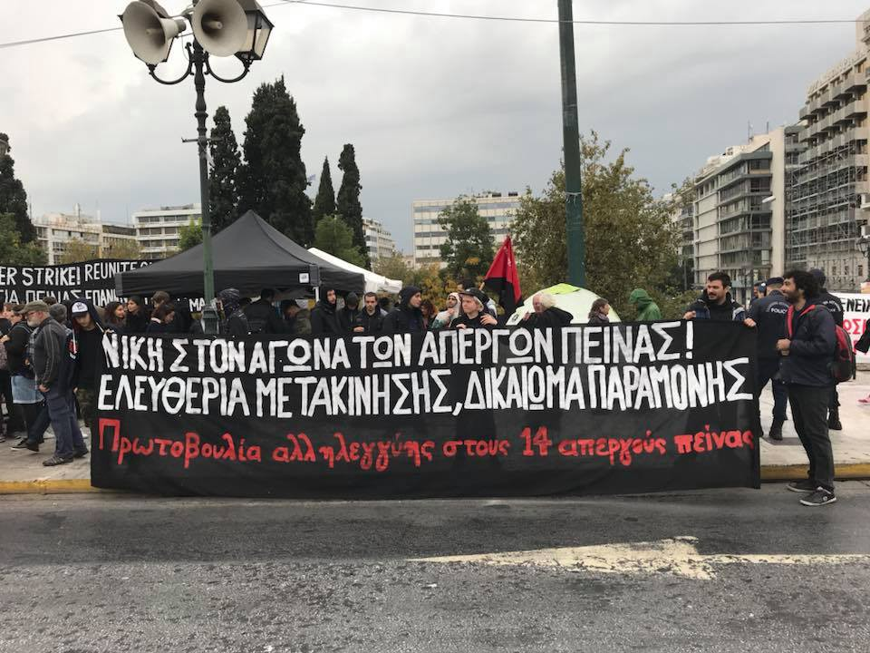

### AYS Daily Digest 08/11/17: Refugee families vs\. policies
#### Protest in Athens / Horrible state of the island camps / Syrians in Germany filing complaint against Assad / Winter seriously threatens refugees accross France / Fights for refugee minors family relocation to the UK / Unaccompanied minors wander the streets in Spain / volunteer calls, aid needs, other news and more

](assets/a707aa113250/1*Moo7AZSSL8oBO6Uq2iVABA.jpeg)

Photo: [Enough is Enough](https://www.facebook.com/enough14/)
#### FEATURE — Photo story of the day

Protesting in front of the Germany Embassy in Athens, the families who have been waiting to be reunited with their family members in Germany — some of whom have been on a hunger strike — expressed their desperation and clear idea on whose responsibility it is\. Reportedly, the Embassy today denied entrance to women refugees as representatives during today’s protest, demanding their legal rights for family reunification\.

In March, in allignment with the Greek officials, Germany capped the number of refugees eligible for family reunification, which gives their asylum applications priority if a family member is already in the country of application, to 70 people per month \(from the previous 300\) \. After three weeks of pressure by activist and solidarity groups, the Greek authorities announced that an additional 40 vulnerable people will be allowed to move to Germany\. On August 2 around 100 refugees, many of whom were women and children, marched from the Parliament to the Embassy protesting delays in the Family Reunification Procedures\.

However, later on, the German court ruled that the right to Dublin\-defined family reunification during the defined 6 months period must be respected\. The conclusion was that the number of 70 people per month who are accepted to enter Germany from Greece on the basis of Family Reunification is a result of a bilateral agreement and is not aligned with any EU legislative\. On September 19 some of the families affected by the slow process protested in front of the Embassy and today once more, those on a hunger strike, together with other refugees, families and supporters marched through the city of Athens demanding their rights be respected\.

On several occasions, we wrote about this problem and how some of the families are affected by it\. \(See our specials [Syrian Princess Trapped in Greece](ays-special-syrian-princess-trapped-in-greece-81944118a9b0) , [Slow reunification process leaves families separated for a long time](slow-reunification-process-leaves-family-separated-for-a-long-time-185e5835e73d) or [Meet Mohammed, one father struggling to reunite his family](ays-special-meet-mohammed-one-father-struggling-to-reunite-his-family-863de6885f40) \)

■■■■■■■■■■■■■■ 
> **[Nikolas Georgiou](https://twitter.com/mpodil) @ Twitter Says:** 

> > #Refugees protest at the embassy of #Germany demanding their legal rights, family reunification #fortresseurope #refugeesgr https://t.co/Plr2D8hxcS 

> **Tweeted at [2017-11-08 13:28:50](https://twitter.com/mpodil/status/928252977902649349).** 

■■■■■■■■■■■■■■ 

[Refugees hunger strikers in Athens](https://enoughisenough14.org/2017/11/01/statement-refugeesgr-now-also-hunger-strike-at-syntagma-in-athens/) have protested for the right of family reunification in front of the German Embassy\.

The family members of some of those who marched in the streets of Athens have expressed their support from German cities\.

](assets/a707aa113250/1*t_zWy6W79AlygUXhqcg5pQ.jpeg)

Photos: [**Rando Wagner**](https://www.facebook.com/rando.wagner?fref=gs&hc_ref=ARScTxP49CozG90sNWNJCAup0NfYDrbhxXDD69vDQinTFv0n-2ihN80Z_TEPfrWJOJ4&hc_location=group)

](assets/a707aa113250/1*Y1iZ_hCFwdwRQV9DefwZtw.jpeg)

Photos: [**Απεργία Πείνας Προσφύγων/Hunger Strike: “Reunite us with our families now”**](https://www.facebook.com/hungerstrike4familyreunification/)

](assets/a707aa113250/1*Bdp5gID0-Sk7JmrCrdTQwQ.jpeg)

Photo: [**Enough is Enough**](https://www.facebook.com/enough14/)
#### TURKEY
### Volunteers wanted

“ [Imece Inisiyatifi Cesme](https://www.facebook.com/imeceinisiyatifi) is looking for volunteers as of now\. Preferably long term volunteers, but any time frame down to 1–2 weeks is accepted, too\. Accommodation and catering are supplied for 5 € per night\. 
Imece Inisiyatifi has several projects going on: as the only NGO with a license to work in the many inofficial camps in the area, Imece undertakes a mobile education project right in the inofficial camps; redistributes baby and hygiene supplies to refugees in camps which are otherwise not receiving any help; and is building up a recreation and education village for refugee women and children\. Very different fields you could be part of\.

We are searching for volunteers for
\- building, carpenting, technicians
\- \(ecological\) agriculture
\- kindergarten teaching/ child care

If you are interested in volunteering, please send a pm to the page [https://www\.facebook\.com/imeceinisiyatifi/and](https://www.facebook.com/imeceinisiyatifi/and) you will receive further information from the team\. Thank you\!”
#### SEA

154,609 migrants and refugees have reached Europe by sea since the beginning of this year, and a total of **2,965 have lost their lives** during the Mediterranean crossing, IOM says —

> It is one of the most difficult weeks that the rescue teams have experienced in the central Mediterranean over the last four months 

At this point, all the stakeholders in SAR missions in the Mediterranean [seem to agree](https://twitter.com/seawatchcrew/status/928281315337756674) that new and better policies need to be installed as soon as possible, in order to stop the deadly crossings, horrible treatment of people in Libya and to ensure safe passages\.

■■■■■■■■■■■■■■ 
> **[MSF Sea](https://twitter.com/MSF_Sea) @ Twitter Says:** 

> > 2/2 #EU policies are trapping people in #Libya &amp; the #Mediterranean continues to be a deadly route. EU must implement safe &amp; legal channels https://t.co/BUPbAHLhh8 

> **Tweeted at [2017-11-08 08:37:53](https://twitter.com/msf_sea/status/928179758315331584).** 

■■■■■■■■■■■■■■ 

In recent months, there have been many cases of more or less [direct attacks by the Libyan coast guard](https://l.facebook.com/l.php?u=https%3A%2F%2Fsiciliamigranti.blogspot.com%2F2017%2F11%2Fborderline-sicilia-bordo-della-sea.html&h=ATM7-7U_MTPFz9SGdj1Uaj0SN4CnV6TUq3d77JKkf2e53wmkFC6zeYllGfJvintpsGxJhBn3syH_PzU5snRu6DbAuqqdEmckeOG7bd18OuOGudBXYngghXa2qcp_9p42AZ2ZV0IAgrNHW54K3a-jA0Oy4Y73bEGnLWv10MFkMefZkf4xWg6eON-W67mAgvzi_306LD0HQVpfAkL-cTJ6QEZSMMLSfzqi8LdJDR158_c6OJwbIKhq9dOvCYUSdWuy) against the few NGO vessels remaining in the Mediterranean\.

“The ship is always driving and therefore someone should listen to any communication, especially on [channel 16](https://youtu.be/p4LU5-NoHVw) \. If the captain of the LYCG\-vessel does not know what Channel 16 is, then they certainly has nothing to do in international water\.” — The Sea Watch

](assets/a707aa113250/1*ZHHejNjavNtZxVdWSybAcQ.jpeg)

Photo: [**Jugend Rettet e\.V\.**](https://www.facebook.com/JugendRettet/)

Regarding the death of the [26 young women we had reported about](ays-daily-digest-05-11-17-26-dead-women-on-board-a-vessel-that-arrived-to-italy-9189ba55cb8f) , it seems there is more to the tragic event\. \.

■■■■■■■■■■■■■■ 
> **[Flavio Di Giacomo](https://twitter.com/fladig) @ Twitter Says:** 

> > According to info gathered so far, about 50 migrants went missing at sea in the same incident. [twitter.com/UNmigration/st…](https://twitter.com/UNmigration/status/927860461688770561) 

> **Tweeted at [2017-11-08 21:15:10](https://twitter.com/fladig/status/928370334117613568).** 

■■■■■■■■■■■■■■ 

#### GREECE
#### Arrivals

Yesterday late in the evening a sailing boat with 15 people on board was intercepted by the Hellenic Coast Guard off the coast of Symni\.

Two boats arrived to **Samos** : the first one carrying 39 people: 15 men, 10 women and 14 children, while the second boat arrived with 28 people on board: 9 men, 9 women and 10 children\.

3 boats landed on **Lesvos** \. The two boats that arrived on the south coast carried 28 and 63 people on board, while the boat that reached the north coast had 36 passengers\.

In the early hours of the morning 62 people landed on **Chios** : 20 men, 15 women and 27 children\. CESRT team assisted the newly arrived\.

 i](assets/a707aa113250/1*VFEK37iEHkF7FdaacJk63A.jpeg)

Photos: [Pothiti Kitromilid](https://www.facebook.com/pothiti.kitromilidi) i
### Horrible conditions on the islands continue

■■■■■■■■■■■■■■ 
> **[Lesvos Solidarity](https://twitter.com/Lesvosolidarity) @ Twitter Says:** 

> > Open letter from #chios groups: "Whilst the inhumane conds on #chios are not new, the situation has reached tipping point" #opentheislands [twitter.com/jmasautonell/s…](https://twitter.com/jmasautonell/status/927994552266391558) 

> **Tweeted at [2017-11-08 07:39:35](https://twitter.com/lesvosolidarity/status/928165086073630721).** 

■■■■■■■■■■■■■■ 

#### Lesvos protest

Vice mayor came with the police this morning, to evict the people on a hunger strike and those protesting with them from the square\.

#### Moria camp

 **\)**](assets/a707aa113250/1*XXhBJAJxlU2BhFWhjoBZ8g.jpeg)

Horrible images from the camp \(Photos by [**Philippa Kempson**](https://www.facebook.com/philippa.kempson.1) **\)**

#### Samos

“With the cold winter months ahead and still many families in tents and unheated accommodation, wool and needles are highly popular among our women at Alpha\! They knit beautiful socks, blankets, beanies and clothes to keep themselves and their loved ones warm\.

Please help us to distribute wool regularly to our women by sending material or supporting us to buy wool locally\. 
Find out how on [www\.samosvolunteers\.org/donations](https://l.facebook.com/l.php?u=http%3A%2F%2Fwww.samosvolunteers.org%2Fdonations&h=ATM8erGEiqK-GDoruL9azCEfRKT19wMatfdelAM-n4k9NmHUj6CX8QhDLitS0LjGKSj8-Jo6_ixMZrr32BuU7i1xHwG7Wsi9CDHH0zuuzYFGsgdxvKgxwVJumdLlg1C5Zn_g5xXp_Ec4XMZcPBEseZQVP7WMhhHyYP6yZmXP_yv6HfAD-1elX6kgv_NU_GcsQDvelpVhGuZxmNHQ5QlXtDRQi9Acq0ZX2ro2XTWTmCMtRSh5GG4w0I7fOg6-K_gy5lumcFi2qTuPNL-C4gARaF2NN4LyxjMTATVVNtyo5Hht) or drop us a message\!”
### Getting a Greek Tax Number

[Mobile Info Team for refugees in Greece — الفريق المتنقل لمعلومات اللاجئين](https://www.facebook.com/mobileinfoteam/?hc_ref=ARRdchwrqwVQ1qrREj4_wxKs3NRjiXY5HlQFfwTAOeIZtyiK35gAli2sD9a8hpzfeYw&fref=nf) team provides indispensible information for refugees and asylum seekers in Greece\. Here is their new update:
**“** To get the possibility to work, you need a Greek tax number \(ΑΦΜ\) and a Greek social security number \(AMKA\) \. Especially to get an AMKA can be very challenging\.
The place where you have to apply for an AMKA is called Citizen’s Service Center \(ΚΕΠ\) \. In the ΚΕΠ at Syntagma Square in Athens, every Monday, Wednesday and Friday from 9am to 5pm integration officers of the NGO Care are present in order to assist asylum seekers and recognized refugees to get an AMKA or any other document which is issued by the Citizen’s Service Center \(ΚΕΠ\) \. They can also help you to communicate with the ΚΕΠ employees and translate for you to Arabic, Farsi, English or French\. So if you need help with getting an AMKA or if you are unable to speak with the staff of the ΚΕΠ because you don’t speak Greek, you can find assistance every Monday, Wednesday and Friday between 9am and 5pm in the Citizen’s Service Center at Syntagma Square\.”
Google Maps link to the ΚΕΠ: [https://goo\.gl/maps/aK2snyCoioH2](https://goo.gl/maps/aK2snyCoioH2)
### Volunteers wanted

> We are looking for two lovely Children’s Activities Coordinators for a new project, to start immediately\. The Coordinators will be responsible for planning and delivering a broad programme of activities to children living in a camp in Greece\.
 

> The residents are Yazidi refugees, mainly from Sinjar in Iraq\.
 

>  There are 145 children currently living in the camp desperately needing access to education, recreation and psychosocial support\.
 

>  We are particularly keen to hear from Early Years professionals, teachers, psychologists, play/art therapists, occupational therapists for the Project Coordinator role\. A basic level of German/Arabic/Kurmanji would be an advantage\. Volunteers should ideally commit to a minimum of 1 month and have experience working with vulnerable children\. Please contact us to find out more [https://refugeechildrenscentres\.org/contact\-us\.html](https://refugeechildrenscentres.org/contact-us.html) \. 

### South Korea supporting Greek refugee efforts

South Korea’s solidarity with Greece is also proving this year, offering $800,000 to provide shelter and care to refugees living in our country\.

As the Korean Embassy in Greece announced, $800,000 will be paid through the United Nations High Commissioner for Refugees and will be used exclusively for refugees residing in the Greek territory\.

Their Government offered Greece exactly the same amount in 2016 and $1\.5 million in 2015\.
#### BULGARIA
### Refugees aim to set up media platform to change minds

Together with some Bulgarian activists, several refugees have organized a gathering which brought together programmers, entrepreneurs, designers and refugees, to develop innovative solutions that could help asylum seekers cope with their new life in Bulgaria\.

“The idea that won most support from the participating refugees was setting up True News — a web platform to counter the negative narratives about refugees in the media and provide reliable information about the real situation in their home countries\.”

At the moment the team, led by two Bulgarian developers and assisted by a group of Afghan refugees, has already developed a prototype for a video\-sharing platform, which can be used to share clips on experiences, opinions and news among refugees and their network, BI [reports](http://www.balkaninsight.com/en/article/refugees-seek-media-platform-to-change-bulgarian-minds-11-05-2017) \.
#### SERBIA
### [**NorthStar**](https://www.facebook.com/NorthStarSerbia/?ref=gs&hc_ref=ARSn3OklziRAgQIVn6U7L4tmbDaKtxVM_026IRFC7alWEqBL4cQ0ci185VLCzmHa0C0&fref=gs&hc_location=group) **is looking for help**

“In the center of Belgrade, NorthStar and Refugee Aid Serbia co\-run an education and recreational center for Belgrade based migrants, we are looking for Math teacher volunteers to start ASAP — teaching will occur MWF and levels range from beginner to advanced\.
Please email theworkshop@northstarserbia\.org if you are interested in working with us\! ”
#### HUNGARY

A Russian citizen was arrested for human smuggling when his truck, that was used to transport refugees illegally to Austria, had a traffic accident in Hungary, close to Budapest\. The media [reports](https://kurier.at/chronik/oesterreich/schlepper-unfall-in-ungarn-pkw-aus-wien/296.532.765) say that one of the refugees was badly hurt and was admitted to the hospital, while the others were deported back to Serbia\.
#### GERMANY
### Syrians filing a complaint against Assad

In order to help ensure that the German authorities issue arrest warrants for the people responsible, 13 Syrian men and women named 17 suspects they considered “most responsible for Assad’s brutal policies of repression”\. They are **accusing President Bashar al\-Assad’s regime of war crimes and crimes against humanity\.**

The complaint seeking arrest warrants was filed under the principle of universal jurisdiction, which allows German courts to handle cases where neither the victims nor the perpetrators are German citizens, the media [say](https://www.thelocal.de/20171108/syrians-in-germany-file-war-crime-cases-against-assad-regime) \.

> In an earlier case in Germany last March, seven Syrian torture survivors backed by the same initiative filed a complaint seeking international arrest warrants against six Syrian secret service officials\. 
 

> According to witness testimony, the prisoners were beaten with pipes, sticks and meat hooks on chains, given electric shocks, burnt with cleaning chemicals and stabbed with pencils\. 

#### ITALY
### Slow relocation

Figures from recent days show a reversal, perhaps only temporary, of the downward trend in arrivals to Italy in recent months from Libya\. However, relocation and the solidarity of the EU member states towards Italy has also been dropping\. Out of 39\.600 originally foreseen to be relocated from Italy, until November 3, only 10\.243 have been relocated\.
 “In this final phase, it is crucial that Member States accelerate relocations and provide enough pledges to relocate all eligible applicants, including those who are likely to arrive until 26 September\. In any case, Member States’ legal obligation to relocate will not cease after September: the Council Decisions on relocation apply to all persons arriving in Greece or Italy until 26 September 2017 and eligible applicants must be relocated within a reasonable timeframe thereafter\.” — [EC](http://1 http://europa.eu/rapid/press-release_IP-17-2104_en.htm)
### Threats for the mayor of Ventimiglia?

The mayor of Ventimiglia, a city in northern Italy, has received letters containing death threats against him and his family and books linked to Nazi Fascism, [InfoMigrants](https://www.facebook.com/InfoMigrants/?hc_ref=ARRclj7aAC1a_mAmUXMcI0UAEElMDZ-0b5Perqy9pDNTM_NQZMdElhg_avlzxkSuur4&fref=nf) [reports](http://www.infomigrants.net/en/post/5973/italy-mayor-receives-death-threats-over-migrant-policy) \. The incidents are being seen as a reaction to his migration management policies in the border city\.
#### SPAIN

Catalonia is dealing with an emergency situation due to a large number of unaccompanied migrant minors arriving in Barcelona without papers\.
Because of the lack of adequate housing facilities, migrants are [reportedly](https://l.facebook.com/l.php?u=http%3A%2F%2Fwww.infomigrants.net%2Fen%2Fpost%2F5978%2Fcatalonia-emergency-for-mass-arrival-of-migrant-minors&h=ATPostRNQCJz4DfRD09bgeYpbH5hmUUfOPlU4ECqsqNLeUSc_UKEMnT73HUmDyrMJNL05Kr2iGx4haI-K_YXzlf7Be7Ldad--Vk6I1RkyKnkr53KMHM9ob9YC8JtyIIl78yEf4aHU2CgyidJBlyjEC1RgQoVdLsRi0-8WU8pDIp0tRh4Grua-d0l7RSbdVTQ5GEf5SvBvz488hNKQPFy9dwSnkbQZSQE7JxcdpZSkBS6RHFtgd3-tYPop2Qr3xr3moKNcO0lo1sf-jXjptWxJ_kKOQ) forced to sleep in judicial offices, including the State attorney’s juvenile office\.
#### FRANCE
### Calais

> Last night I had a call with a new French group set up to help around 200 refugees sleeping rough in a port town near to Caen\. This week we sent them another van full of sleeping bags and tents\. 

> This group formed to provide the refugees there with food twice a week\. They were shocked to find people in their home town sleeping rough outside in this cold, wet weather\. 

> However they are now facing opposition from some of their neighbours\. The local mayor has suggested that, by providing the food, they have encouraged more people to arrive\. As numbers are increasing they are worried he might be right and are unsure what to do\. — [**Care4Calais**](https://www.facebook.com/care4calais/?hc_ref=ARQ5Blc_DF36iVHJ_qsnqnXhDa41uWei73VV-qGfahY3mBGf4bRSHeaoxcNR31BP0BE) 

#### [**France and Beyond Refugee Aid Hub 82**](https://www.facebook.com/France-and-Beyond-Refugee-Aid-Hub-82-1291357100894704/?hc_ref=ARSXknnWgILkwytiqV93P6LB5o9LwUZwMbV0kb9kB6Pn2XUY0dR8BmGQXRSVc4hDK-k&fref=nf) **team also needs help**

As the winter approaches, all volunteers and organizations have been asking for more assistance and help, as well as more people to join their efforts in trying to make the terrible journey to safety as safe as possible\. 
They have a great need for blankets, ponchos, sleeping bags, sport shoes in size 40–43, socks of the same size, underwear for men size S and M, pullovers, tents, …

> L’hiver est arrivé et il fait froid\! \! Il y a urgence pour les pour les réfugiés à Calais, nous avons grand besoin des choses suivantes \(nous assurerons leur acheminement début décembre\): 
 

> Couvertures de survie, ponchos
 

> Couvertures et sacs de couchage
 

> Chaussures de sport ou de marche tailles 40–43
 

> Chaussettes tailles 40–43
 

> Sous\-vêtements pour homme neufs tailles S et M
 

> Téléphones débloqués avec chargeur
 

> Manteaux et vestes, waterproof ou non \(S et M\)
 

> Tentes, bâches\.
 

> SVP nous apporter seulement des choses sur cette liste, nous n’avons plus de place pour autre chose à présent\. 

### Snow threatens homeless refugees

Volunteers in the Dunkirk area report snow, at the same time reminding it’s the first snow in the last couple of years in that area\.
Always growing number of refugees in the area is under agreat risk of frost, snow and cold sleeping rough in the surrounding areas\.

> Above all else do NOT ignore and assume it’s not your problem
 

> It’s everyone’s problem
 

> It’s humanities problem
 

> Men, women and children will die not least in ‘camps’ and forests this year 

> Lobby your councillors / politicians to change their policies on a national level 

> This is not acceptable — [Sarah Berry](https://www.facebook.com/sarah.berry.908?fref=gs&hc_ref=ARTIobwQIFNmD3L4BPQamqztZ0A_-cork3ZU1UqiOKoqxnXICOIQFkE_34o67JER3f4&hc_location=group) , volunteer 

The temperatures drop and the nights are getting colder\. In Metz, France, there are currently 700 to 800 people living in a poorly structured refugee camp\. The camp, placed on a former parking lot, consists of tents which were built upon wooden pallets\. Since the situation has drastically worsened within the past few weeks, the NGOs [Verein FAIR\.](https://www.facebook.com/VereinFAIR/?fref=mentions) , [KUNE](https://www.facebook.com/kuneaid/?fref=mentions) , [Open Borders Caravan Bern](https://www.facebook.com/openborderscaravanbern/?fref=mentions) , Stand up for Refugees, [Everyday, just a smile](https://www.facebook.com/everydayjustasmile/?fref=mentions) and [Be Aware And Share — BAAS](https://www.facebook.com/beawareandshare.baas/?fref=mentions) travelled to Metz to distribute more than 60 boxes of clothes and hygiene products in order to help to improve the situation\.
### More ‘Dubs refugee minors’ leaving to UK

The [Calais Action](https://www.facebook.com/calaisaction/?ref=gs&hc_ref=ARQJBpSafyijUDWGj79pPY534HvwWqeJqx4reqrjVOTXFORKPjcMFA5GSzVqt0v8_-A&fref=gs&hc_location=group) team brings good news:

> Delighted to hear that MORE Dubs refugee children have arrived in the UK over the last few days\! Actors on the ground in Calais estimate as many as 20 minors may have been transferred to the UK under the Dubs scheme, although official figures are not yet forthcoming\. 

> This is all due to YOUR help in keeping the issue in the spotlight by writing to your MP and attending rallies such as the action outside Parliament on the 24th October\. THANK YOU for all your hard work and dedication\! 

> At the debate on Calais and child refugees last week the Immigration Minister confirmed that the Dubs scheme was not ‘closed’ — in that 280 places would still be filled from the original calculation of 480\. We urge the Government to fill those places as quickly and speedily as possible to avoid the psychological and physical suffering of those most vulnerable\. 

> Human rights campaigning is a long road full of pitfalls and setbacks, so every little gain deserves to be celebrated\. Well done to everyone who has written and shouted about this issue, even when the world seems deaf\. You are standing on the right side of history\! 

#### EU
### End child immigration detention

On the occasion of the 11th EU Forum on the rights of the child held in Brussels, a number of organizations from around the world working with children and refugees have signed a [joint statement](http://destination-unknown.org/wp-content/uploads/JointStatement_Child_Immigration_Detention_FINAL.pdf) , a letter calling upon EU governments to take immediate steps towards ending child immigration detention, ensuring alternatives to detention are accessible and available\.
#### UK
#### Press release: British government refuses to grant unaccompanied refugee children right to family reunification

> “The British government’s refusal to grant children, who have been granted asylum in Britain, the right to reunite with their families, is in explicit conflict with the child’s best interests guaranteed by international law,” said Sarah Pritchett, a spokeswoman for the Euro\-Mediterranean Human Rights Monitor\. 

> “Britain is almost the only country in the European Union that does not grant refugee children this right, despite signing the Convention on the Rights of the Child, which provides the right of the children to live with their families in stability and security\. 

> We, therefore, call upon the British authorities to take into account the best interests of the child before making decisions and grant unaccompanied refugee children the right to live in safety with their family members; we hope that the House of Commons approves the draft resolution to ensure this right when it is discussed next year,” added Pritchett\. 

> The British asylum law does not contain any articles that allows refugee children, \(under the age of 18\) who have been granted residence in Britain, to be reunited with their families in any way\. The law also states strict conditions for the reunification of adult refugees with their families\. 

> The House Affairs Committee of the British Parliament has called on local authorities to amend these unfair laws, and MP Angus McNeill \(on behalf of a group of MPs\) presented a bill \(a draft law\) that would ease the strict conditions in Britain’s reunification law, including allowing refugee children to be reunited with their families\. The bill will be discussed on March 8 of next year\. — [_Euro\-Mediterranean Human Rights Monitor_](https://www.facebook.com/EuroMedHR/?ref=gs&hc_ref=ARTh-WaWwzG0kabE5YVxUPnWQ4ydNfolQlh4Jb85i8mqCHR-HWTCi6fk-nYkX-pL1lo&fref=gs&hc_location=group) 

**_We strive to echo correct news from the ground through collaboration and fairness\._**

**_Every effort has been made to credit organizations and individuals with regard to the supply of information, video, and photo material \(in cases where the source wanted to be accredited\) \. Please notify us regarding corrections\._**

**_If there’s anything you want to share or comment, contact us through Facebook or write to: areyousyrious@gmail\.com_**

_Converted [Medium Post](https://areyousyrious.medium.com/ays-daily-digest-08-11-17-refugee-families-vs-policies-a707aa113250) by [ZMediumToMarkdown](https://github.com/ZhgChgLi/ZMediumToMarkdown)._
