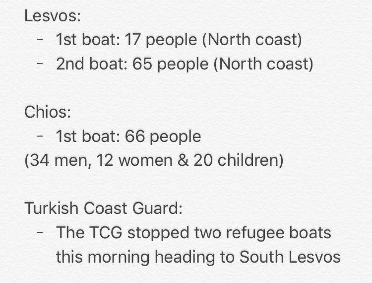
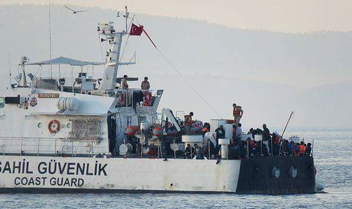
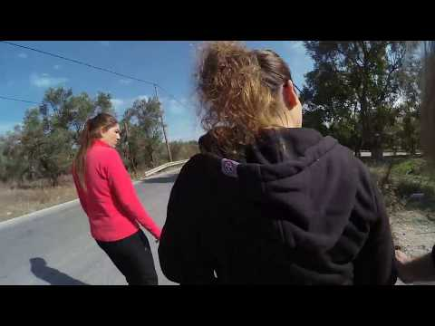
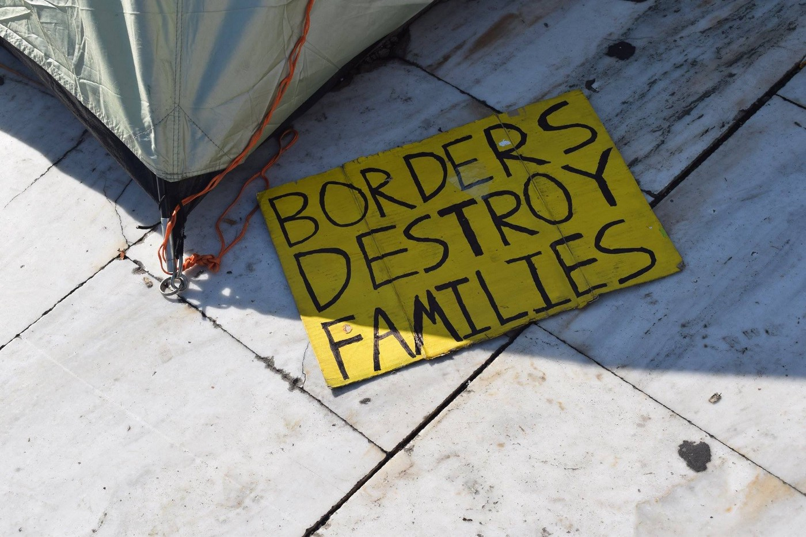
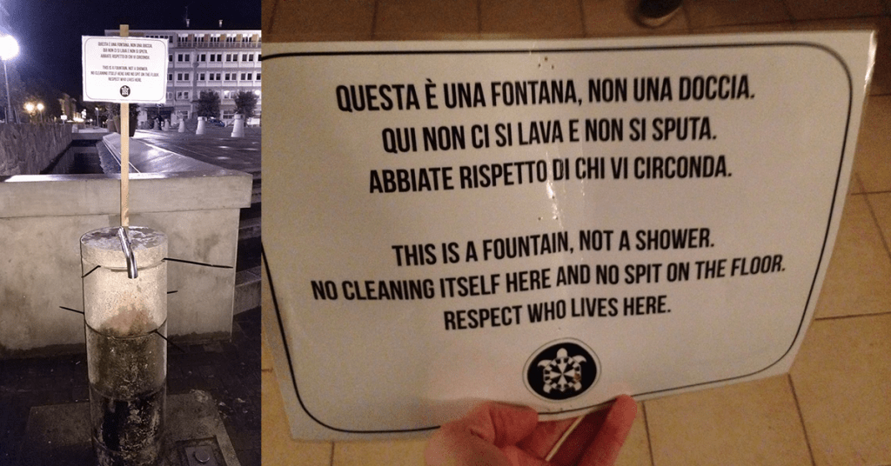

### DAILY DIGEST 10\.11\.2017: Volunteers targeted by police in Italy

_More arrivals, including people of Turkish nationality, to Greece // Help needed on islands // 70 percent of people who arrived in Italy from Libya were victims of human trafficking // Smugglers ask 8000 euro from Iraq to Serbia // New report about the police violence in France_

 \.](assets/4b9c97258dad/1*lLS8Ix6d4a33Hj5NQ83ZVg.jpeg)

Photo by [Baobab](https://www.facebook.com/BaobabExperience/) \.
### **Feature**

Volunteers in Ventimiglia area report police abuse, again\.

The [Kesha Niya](https://www.facebook.com/KeshaNiyaProject/?ref=gs&hc_ref=ARQm5y-x5PpR2XKjT6qYQn2r45ZdpmZIQZhJETYiW5-60GxNt8vI8nXyt960jgqF1kA&fref=gs&hc_location=group) group reports on their FB that _“the Italian police seem to have begun resorting to more unashamed methods of repression”_ \.

_“After a nice distribution with a relaxed atmosphere on November 2nd, police went beyond their usual thorough document checks and arrested a member of Kesha Niya without any charge\. Denying him access to a lawyer or a translator, they attempted to give him a three\-year ban from the Ventimiglia area; an obvious effort to discourage us, which was just as obviously going to fail anyway\.”_

 \.](assets/4b9c97258dad/1*TE9GL5BE7kzWp5bCAXwWGg.jpeg)

Ilustration by [Mas Hab](https://www.facebook.com/mashabcomix/) \.

The group is already in contact with legal representation\. Visit their [FB](https://www.facebook.com/KeshaNiyaProject/?ref=gs&hc_ref=ARQm5y-x5PpR2XKjT6qYQn2r45ZdpmZIQZhJETYiW5-60GxNt8vI8nXyt960jgqF1kA&fref=gs&hc_location=group) to see how can you help them\.

The same group reported several times in the past on police violence against migrants in this area, but also against volunteers\. Groups in this area are helping hundreds of people who are trying to continue their journey toward northern Europe\.

Meanwhile, the Italian government issued some data on people who arrived this year to the country\.

Among those who arrived, the biggest number was people from sub\-Saharan African countries, including Nigeria, Gambia, Ghana, Ivory Coast, but also Bangladesh, Afghanistan, Pakistan, etc\.

A recent study by Rome Link Campus University and the War and Peace Studies Center showed that **70 percent of people who arrived in Italy from Libya have been victims of human trafficking** \. People who depart from Libya leave from the coastal area between Sabratha and Mutrud, west of Tripoli\. According to this research, along this stretch of coastline, there are 86 main departure points and a criminal group that supplied African migrants and forced them into prostitution in the EU\.
### Greece

Like every day over the last couple of months, people keep coming over the sea and land to Europe\. Yesterday morning, **15 people — including 5 children** — arrived on Rhodes\. Volunteers on the island need warm clothes and jackets for people who are arriving\. If you can help, please get in touch with [Oasis Rhodes Solidarity Group](https://www.facebook.com/groups/OasisRhodes/permalink/1828016300823467/) \.

It was busy on Chios again, with one boat arriving in the morning carrying 66 people — **34 men, 12 women, and 20 children** \. Also yesterday, **12 people of Turkish nationality** arrived on Chios and all of them were sent to the overcrowded Vial camp\.

By Erik Gerharson\.

The [Refugee Rescue / ‘Mo Chara’](https://www.facebook.com/RefugeeRescueUK/) group reports on another incident involving Turkish coastguards\.

_“Several arrivals reported that their dinghy — originally carrying 37 people — was intercepted by the Turkish coast guard in Greek waters\. It is alleged that a Turkish official fired multiple gunshots into the air before retreating, and then returned to fire shots into the water close to the dinghy while ramming the boat with their vessel on a number of occasions\._

_According to reports by the arrivals, when the Hellenic coast guard vessel arrived at the scene, Turkish authorities were asked to stop firing and those in the boat were reassured that they were now safely in Greek waters\. 17 people jumped from their dinghy into the water and swam to the Hellenic coast guard vessel for safety, reporting the Turkish coast guard aggressively attempted to pull people from the water\. Those that were not able to swim from the dinghy to the Hellenic coast guard — mainly women, children and the elderly — were loaded into the Turkish coast guard vessel and taken back to Turkey\. Arrivals to Skala report that families were separated as part of this interception\! \! This breaks several international maritime and human rights laws\.”_

Photo: Stock photo of Turkish Coastguard

The situation in Moria is not getting better and there is hardly any serious effort from any side to decongest this and other islands\. It is getting colder every day and living conditions are almost unbearable\. Erik Kempson, the activist at Lesvos, filmed inside Moria showing images that are painful to see\.

Living conditions forced the group of people to start the hunger strike on Lesvos that continues for the 23rd day\.

According to the official figures, some **15,200 people are currently living in reception centers on Lesvos, Chios, Samos, Kos, and Leros** \. Most of them, **8,171, are on Lesvos** where around 1,500 people, including children, are sleeping in tents set up around the Moria center\.

[NoBorderKitchen Lesvos](https://www.facebook.com/NBKLesvos/?hc_ref=ARQgbwgqOMO4-0yOJxRwL1-2WOPqI6SkDuh0O2shGGGzYdshyRNUxMFSqU6pjuBJNSk&fref=nf) needs your support\!

_“We are an anti\-hierarchical, self\-organized group of activists, with and without papers, from all over the world, with the shared aim of overcoming the borders and restrictions that impede freedom of movement\. As well as providing food in order to support the autonomy of those living outside of the state\-run camps, we do other political work to resist the border regime, and fight together for a world where we are all recognized equally as humans\.”_

In order to continue their very important work, that includes providing basic food, they need money\. Every day they support around 300 people with food boxes\. Additionally, they provide around 80 meals a day\. 
 
If you can help, contact them via [noborderkitchen@riseup\.net](mailto:noborderkitchen@riseup.net) or on [Facebook](https://www.facebook.com/NBKLesvos/?hc_ref=ARQgbwgqOMO4-0yOJxRwL1-2WOPqI6SkDuh0O2shGGGzYdshyRNUxMFSqU6pjuBJNSk&fref=nf) \.

[Humans 4 Humanity](https://www.facebook.com/Humans4HumanityOrg/?fref=mentions) also need help in order to continue their work\. They need men’s underwear, shampoo, shower gel, milk, soap, tinned sweet corn, flour, sanitary towels, and multivitamins\. They also aim at providing Maggi stock cubes\.

You can donate using the methods below\.
Go PayPal\.com and use the email [bluedoorglobal@gmail\.com](mailto:bluedoorglobal@gmail.com) and the friends and family option
through [Launch Good](https://www.launchgood.com/project/house_of_humanity_20__humanitarian_aid__psycosocial_therapy_center_for_refugees_in_lesvos_greece#!/) 
or if you don’t have PayPal you can simply use your card at
[https://www\.paypal\.me/bluedoorglobal](https://www.paypal.me/bluedoorglobal) 
Or make a bank transfer at
Humans 4 Humanity Inc 
Bank of America 
New York, NY
SWIFT CODE: BOFAUS3N
ACH ROUTING NUMBER: 072000805
ACCT NUMBER: 3750 1635 2587

Last week we reported on the boy from Afghanistan who was a target of a racist attack\. This week the media in Greece report on the alleged group of neo\-Nazis, a faction of the Golden Dawn party, who are recruiting “anti\-migrant hit squads”\. Apparently the group name is Crypteia, after a vigilante band of ancient Spartans who terrorized slaves\. They claimed responsibility for an attack on the home of an 11\-year\-old Afghan boy and his family\.

It finally looks like some politicians in Europe are becoming aware that the winter is coming, and that somebody has to do something to help the people\. The Progressive Alliance of Socialists and Democrats \(S&D\) Group in the European Parliament, [urged the European Council and the European Commission to work with Greece](http://greece.greekreporter.com/2017/11/09/eu-parliamentarians-warn-refugees-may-die-on-greek-islands/) to prevent a humanitarian crisis this winter\. Unfortunately, in their appeal, they remain ignorant about the situation in other EU countries where hundreds are living in desperate conditions\.

Nevertheless, in their appeal they stated, among other things, that the EU governments _“need to immediately stop sending back refugees to Greece under the Dublin mechanism; which is creating further strain on the Greek asylum system\. If we do not act and refugees die from the cold, as they did last year, then their blood will be on our hands\.”_

Photo: Art Against\.

An interesting initiative in Athens invites everybody — locals, refugees, and migrants — for free yoga classes\. The project offers a series of Yoga classes for beginners _“in order to contribute to integration in Greece by bringing together refugees and host community members and enhance the psychosocial and physical well\-being of the participants\.”_

For more info [see their website](http://www.elix.org.gr/.../1469-yoga-4-beginners-call...) \.
### Italy

Very disturbing info from the area of Gorizia where local authorities posted a notice forbidding people to use a fountain in the city\.

Unfortunately, this fountain was the only place people could use to clean themselves since nobody provided accommodation or place for showers for hundreds of people in this area\. According to the local volunteers, shop owners complained about the people using fountains\. Instead of helping, like many in Belgium or even Paris are doing by opening their homes for people, in this small city they decided to forbid using the fountain\.

Help is needed in Como \(Rebbio\) \. The group [Como Senca Frontiere](https://www.facebook.com/comosenzafrontiere/posts/801676363327759) issued a call for Italian teachers\. Italian classes are held in the afternoons and evenings, three times a week\. If you can help, get in touch by email [scuoladirebbio@gmail\.com](mailto:scuoladirebbio@gmail.com)
### Serbia

This week police in Serbia arrested several members of an alleged smuggling group\. According to l [ocal media sources](http://www.politika.rs/sr/clanak/392171/Beogradani-i-Pakistanci-uhapseni-zbog-krijumcarenja-108-migranata) , eight people were arrested under suspicion that they helped about 100 people to cross the border toward Hungary\. The prosecution believes that the group took 600 Euro per person\.

The people arrested are citizens of Serbia and Pakistan\.

According to the UNHCR, people from Iraq who are trying to cross Turkey, Bulgaria, and Serbia, have to pay up to 8000 euro per person\. Apparently smugglers are using a social network to get in touch and organize the trip\. Smugglers advertise their services, promising that they can bring people safely over the borders to northern Europe\.
### Germany

One of the [leading daily newspapers](http://www.tagesspiegel.de/.../die-liste.../20558658.html) in this country published names of **33,293 persons who died from 1993 until today while trying to reach Europe** over the sea\. Thousands more died without being identified\. Most of them were running from poverty and wars\.

Among those who lost their lives were people from Syria, the country where the war has been raging for years now\. Nevertheless, the ultra\-right party Alternative for Germany \(AfD\) called for the repatriation of half a million Syrian refugees who are living in Germany\. This party believes that the war is nearly over, pointing to the last week Syria’s army declaration of victory over Islamic State\.

The AfD, unfortunately, won enough support in this country to become part of Germany’s lower house of parliament, the Bundestag\. Their proposal will probably not get enough support, but their ideas will be spread and could raise negative emotions toward Syrians in Germany\.

Some **156,000 people have applied for asylum in Germany this year** , and more than 25 percent of them are from Syria, according to data from the Federal Interior Ministry\.
### France

While temperatures are getting lower, volunteers all over France are trying to meet the needs of all the people who are forced to stay out in the open\. The situation continues to be very bad in Paris and Calais\.

](assets/4b9c97258dad/1*CgnAHiqRMttpmmmhUqKQHA.jpeg)

Streets of Paris\. Photo by [**Heather Young**](https://www.facebook.com/heather.young.94009841?fref=gs&hc_location=group_dialog)

[Care4Calais](http://www.care4calais.org/donate) groups issued another report about the general situation stating that with the rain season, many people are left to sleep out in the cold with wet clothes\.

_“There are over 700 refugees in Calais now, and they all need warm coats, waterproof shoes, sleeping bags, shelter from the rain and so much more\. We don’t have anywhere near enough\. And it’s days like that, when it rains and the temperature drops that you really feel it\. There is nothing worse than saying “next time” and not knowing when that will be\.”_

The same group recently visited **Ouistreham, where 200 refugees, mainly from Sudan and including many minors, are sleeping rough** in a patch of trees at the side of a farmers field\. The place is a small port town four to five hours drive west of Calais\. The group is also helping people **in Dunkerque where about 200 people are living\.**

Meanwhile, police continue harassing people while tearing down makeshift shelters, cutting up the tarpaulin, taking away sleeping bags from people, but also using tear gas and force to disperse them\.

_“The state continues to destroy people’s makeshift shelters without offering real solutions for those living here\. This means we must continue to distribute aid and keep people safe\. Please help us help refugees in Northern France by donating today: [http://bit\.ly/northernfrance](http://bit.ly/northernfrance) "_

> **_We strive to echo correct news from the ground through collaboration and fairness\._** 

> **_If there’s anything you want to share or comment, contact us through Facebook or write to: areyousyrious@gmail\.com_** 

_Converted [Medium Post](https://areyousyrious.medium.com/daily-digest-10-11-2017-volunteers-targeted-by-police-in-italy-4b9c97258dad) by [ZMediumToMarkdown](https://github.com/ZhgChgLi/ZMediumToMarkdown)._
