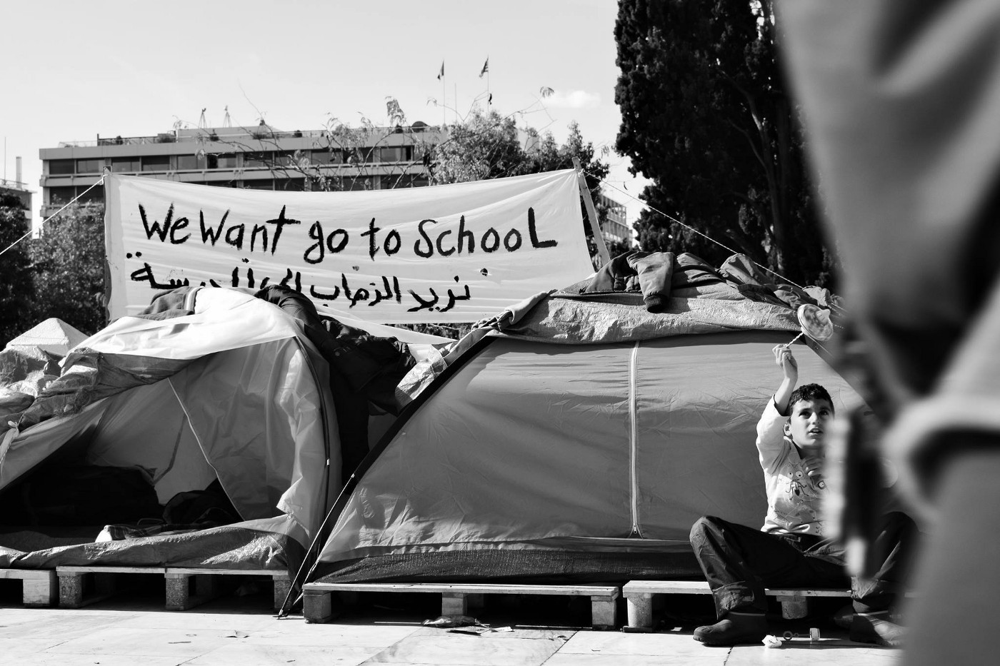
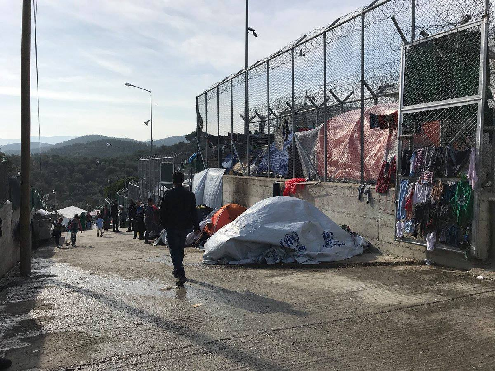
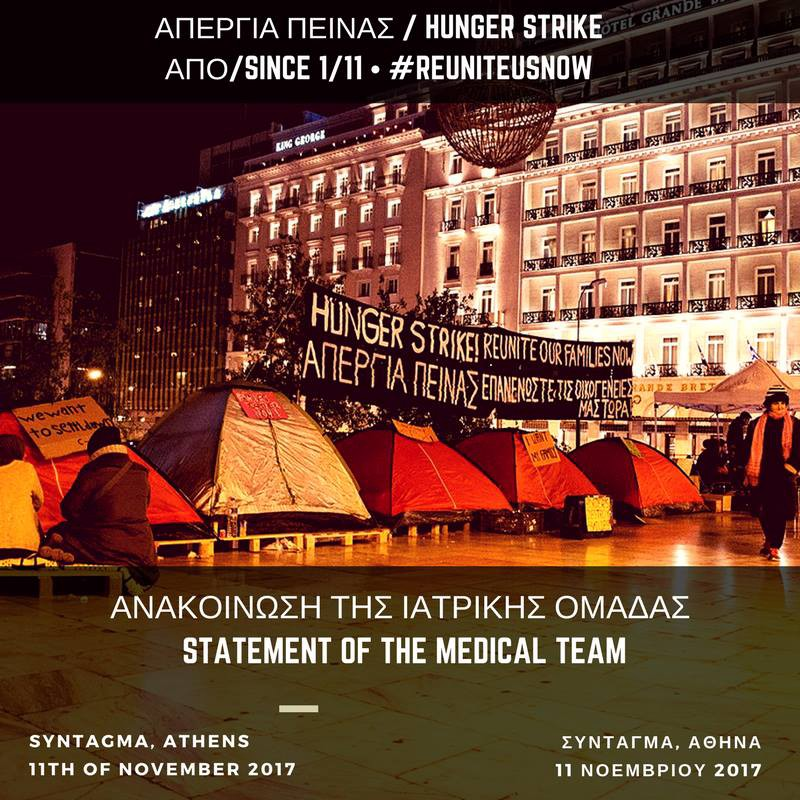
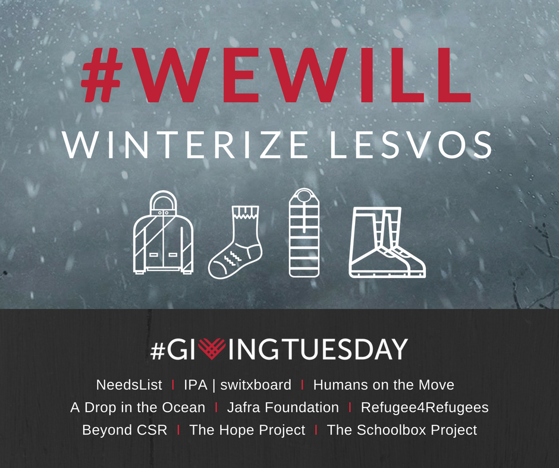
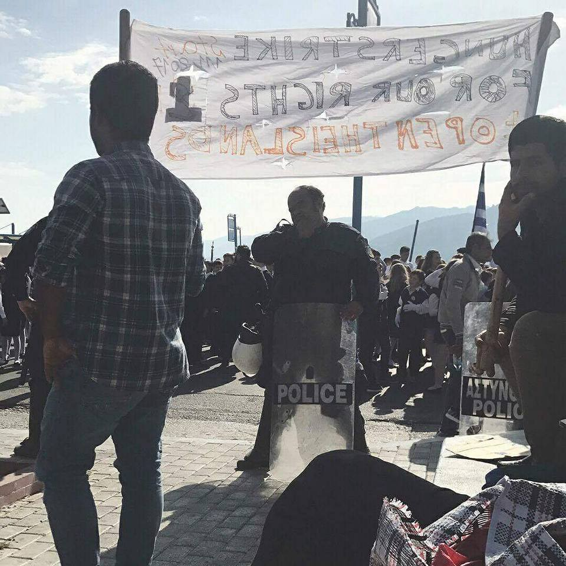
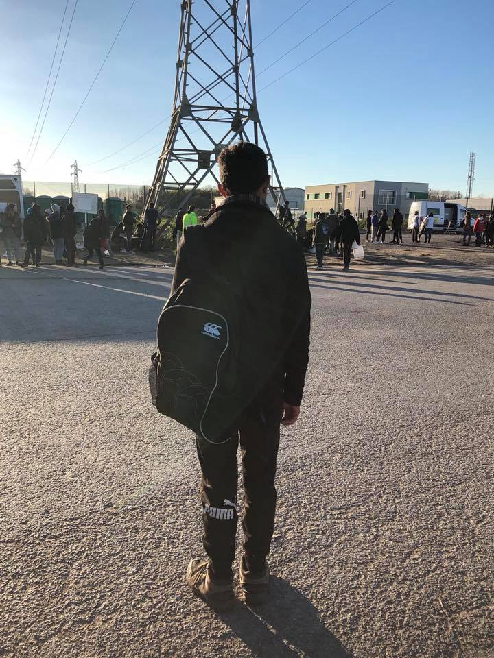

### \#AYS DAILY DIGEST 11/11/2017: Childhood taken away by fortress Europe

_A wall runs through the sea built on the bodies of 14,000 people // Medical teams are warning about the weakness of people who are on hunger strike in Athens // Investigation into death of 26 girls found near Italy // 251 saved near Spain_

Photo Arash Hampay\.
### Feature

Between Friday and Saturday, the dead bodies of three children who tried to reach Europe washed up on the northern shore of Lesvos\.

> The first was found on Friday, reportedly a boy aged between 12 and 13, near Madamodos\. 

> The next day the body of a girl of the same age was found in the same area\. 

> A third body was found a few hours later\. 

This is the last in countless numbers of tragedies that are a direct consequence of the migration policies of the European Union\.

Greek [newspapers](https://www.lesvosnews.gr/28274/thriler-me-ptomata-pedion-pou-xevrazi-i-thalassa-sti-lesvo-neo-ptoma-tora-den-echi-dilothi-kamia-exafanisi/) \( [2](http://www.ekathimerini.com/223177/article/ekathimerini/news/bodies-of-3-children-found-on-lesvos-coast--baffle-authorities) , [3](http://www.keeptalkinggreece.com/2017/11/11/refugee-children-washed-ashore-lesvos/#.WgbcNu8nT2w.facebook) \) write about mysteries, puzzles to be solved, and the baffled authorities\. Only one day after the EU Commissioner for migration, [Avramopoulos, hailed the EU\-Turkey deal](http://www.ekathimerini.com/223157/article/ekathimerini/news/as-islands-remain-under-pressure-minister-seeks-to-reassure) as a great success and an example of the relations between the Union and the countries of the Eastern and Southern Mediterranean, the three bodies that washed ashore represent most clearly the essence of this deal\. No mystery in that\.

■■■■■■■■■■■■■■ 
> **[Marianna Karakoulaki](https://twitter.com/Faloulah) @ Twitter Says:** 

> > Yesterday the EU's migration commissioner @[Avramopoulos](https://twitter.com/Avramopoulos) was praising the #EUTurkeyDeal. The past 3 days 3 dead #refugeesGR were found drowned in Lesvos. Please keep telling us how this deal is a good development

(picture by Lesvos News) https://t.co/w4IN8Yd0gT 

> **Tweeted at [2017-11-11 10:56:47](https://twitter.com/faloulah/status/929301877363302401).** 

■■■■■■■■■■■■■■ 

Over the same days, refugees have reported illegal attacks on a refugee boat by the Turkish coastguard outside their territorial waters\.

Refugee Rescue reports that shots were fired last night at a refugee dinghy in Greek waters:

■■■■■■■■■■■■■■ 
> **[Refugee Rescue](https://twitter.com/_refugeerescue) @ Twitter Says:** 

> > Yesterday 3.47am, Refugee Rescue boat ‘Mo Chara’ received a request by the Hellenic coastguard to assist in transitioning 17 very distressed and hypothermic people to port (1/2) 

> **Tweeted at [2017-11-11 12:32:49](https://twitter.com/refugeerescueuk/status/929326043781058561).** 

■■■■■■■■■■■■■■ 

■■■■■■■■■■■■■■ 
> **[Refugee Rescue](https://twitter.com/_refugeerescue) @ Twitter Says:** 

> > Several arrivals reported that their dinghy – originally carrying 37 people – was intercepted by the Turkish coast guard in Greek waters. Allegedly shots were fired and 17 jumped into the water and swam towards the Hellenic Coast Guard (2/2) 

> **Tweeted at [2017-11-11 12:34:13](https://twitter.com/refugeerescueuk/status/929326397012758528).** 

■■■■■■■■■■■■■■ 

The increasing numbers of “incidents” and attacks upon refugees and solidarity activists in the waters of the Mediterranean are no longer surprising\. The externalization of borders to unsafe countries is part of the deterrence policy of the Union\.
#### A wall runs through the sea, built on the bodies of at least 14,000 people who have died in the Mediterranean since 2014\.
### Greece

In the last 48 hours, four boats arrived at Lesvos carrying over 180 people on board\. All of them will be forced to live on this island endlessly, in conditions that defy description, with no freedom of movement or speech\.

 \.](assets/f0e5b8c3fcd1/1*5GkAEMNmk1PPF4Y3_lAZRA.jpeg)

Moria camp, Lesvos\. Photo by [Open Borders](https://www.facebook.com/openeuborders/) \.

A group of people is still on strike at the main square in Mytiline for the 24th day\. They are demanding better living conditions and a faster procedure that will allow people to leave the island\.

At the same time, one boat carrying 69 people—29 men, 13 women, 27 children—arrived at Chios\.

According to official data, over 10,000 new registrations have been recorded on Lesvos and over 5,000 on Samos so far this year\. Almost 25,000 people arrived this year in Greece\.

Today is the 11th day since the hunger strike began in Athens\. The m [edical team with the people on Syntagma Square issued a warning](https://www.facebook.com/hungerstrike4familyreunification/posts/770869499785464) saying that the health situation of the strikers is gradually deteriorating\. The situation became even worse when a number of people started refusing even water\.

The doctors are calling on the governments to hear the demands of the people in Greece and do something\. So far no response from the Greek or Germany governments\.

The strikers are demanding a faster process for reunification with their families in Germany\.

Reunification and the relocation program are still very slow\. During October, 841 people were relocated to other EU member states; 356 to Germany, 231 to France, and 94 to Switzerland\. Over the same period, 402 people returned to their home country for various reasons, some of them because they could no longer bear to live in the limbo to which they have been consigned\. Amongst them, 162 were from Pakistan, 39 from Algeria, 49 from Georgia, 12 from Bangladesh, and 36 from Iraq\.

Help is needed for people on Lesvos\. [A group of NGOs](https://needslist.co/lesvos.) and grass\-roots initiatives are collecting basic items to distribute\. At the moment, the most needed are sleeping bags\.

After the borders were closed, a number of organizations issued reports and a warning that the conditions under which people are living in Greece, especially on the islands, violate basic human rights\. However, those responsible are not reading these warnings and they are thereby putting people in life danger\.

A court decision has even been issued declaring that some of the measures undertaken by the Greek government are against the law\. [The last one is from the Administrative Court of Mytilene](https://www.ecre.org/greece-court-curtails-detention-in.../) which issued three decisions in October, finding that the detention of people who complained was unlawful “on insufficiently justified grounds in two cases and on erroneous grounds in a third case”\.

The decisions are related to applications raised by three Syrians who were detained on Lesvos prior to their removal to Turkey\.

Any day now, Camp Derveni should be closed, as announced earlier\. People are already being moved to apartments or permanent sites\. However, some of the volunteers from the camps are claiming that single men are placed at the bottom of the list for suitable accommodations\. The second issue raised is what will happen to undocumented people at the camp whose fate is now uncertain\.

Currently, there are over 200 people in this camp\.

\#opentheislands
### Italy

After the boat with [26 bodies of girls and women](ays-daily-digest-05-11-17-26-dead-women-on-board-a-vessel-that-arrived-to-italy-9189ba55cb8f) was found several days ago, the Italian government initiated an investigation into the possibility of human trafficking\. According to media sources, there are suspicions that the girls had been sexually abused and tortured\.
### Spain

Spanish maritime safety authorities saved 251 people from five improvised vessels in the Alboran Sea\.

So far this year, 15,585 people have arrived in Spain\.
### France

By Care4Calais\.

_“This is Sami from Afghanistan, 13 years old and currently sleeping outside on a patch of scrubland in Calais\. He could tell I was shocked to hear this so he said: ‘Its not so bad — in Serbia I had head lice and body lice\. The police don’t just hit you like they do here, they put you on the floor and kick you\. And here there is food\.’ He was trying to cheer me up, but he didn’t\. He has no shelter from the cold and rain, no comfort and no protection\. And yet he’s telling me it has been worse?_

_He’s only a small child, even for his age\. Sami left Afghanistan when he was 12\. It took him eleven months to travel to Calais on his own\._

_He said he only talks to his mother occasionally\. He said he tells her everything is fine and he is ok because he doesn’t want her to worry\. Then he looked and me and said quietly ‘but it’s not’\._

_I asked him what he hopes for\. He said his greatest wish is to go to the UK and go to school\. He didn’t go to school in Afghanistan\._

_I’d given him a bivvy bag \(a waterproof sleeping bag\) when I first met him the day before\. I asked him if he had tried it\. He said no, he had hidden it well but hadn’t tried it yet\. He had been out the night before trying to get onto a lorry and had been to Belgium and back\. But that was 24 hours ago? Yes, he said, he had not slept in the last 24 hours\.”_

To volunteer or donate go to [www\.care4calais\.org](http://www.care4calais.org)
### Denmark

A [seminar will be held from the 11th to the 27th of October](https://www.facebook.com/events/141955466528749??ti=ia) , to discuss the situation in Kærshovedgård camp\.

“One of the central demands was a definitive closure of the deportation camp\. The hunger strike has now ended but the struggle to close Kærshovedgård continues\. Making stronger alliances is an important step in order to make this possible\!

This is why we, activists from Kærshovedgård, along with activists outside the camp, invite friends and allies to a small seminar, where we will talk about the camp, and where you can learn more about the fight and how you can support it\.”

> **_We strive to echo correct news from the ground through collaboration and fairness\._** 

> **_If there’s anything you want to share or comment, contact us through Facebook or write to: areyousyrious@gmail\.com_** 

_Converted [Medium Post](https://areyousyrious.medium.com/ays-daily-digest-11-11-2017-childhood-taken-away-by-fortress-europe-f0e5b8c3fcd1) by [ZMediumToMarkdown](https://github.com/ZhgChgLi/ZMediumToMarkdown)._
