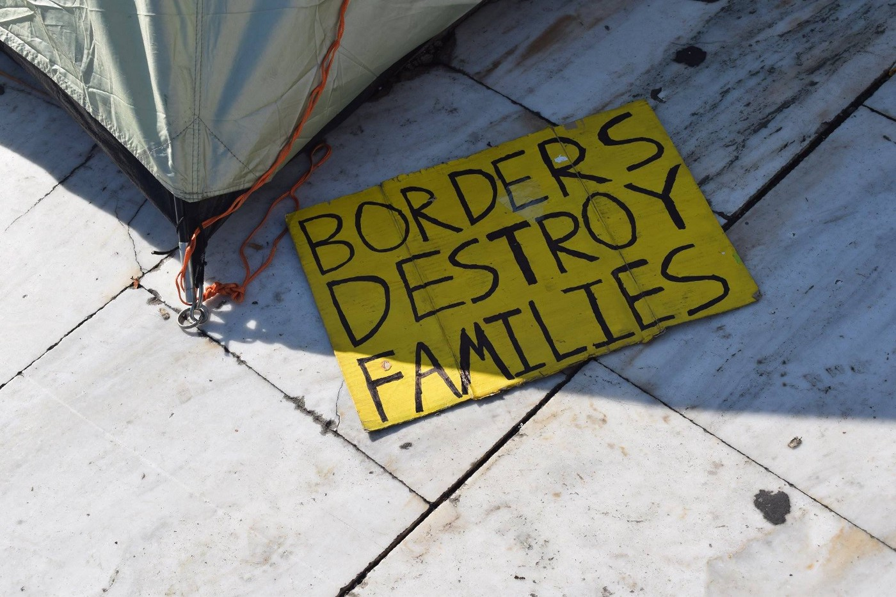

### AYS Daily Digest 12\.11\.17: No, the Greek border will not be opened\. Do not inspire false hope in refugees\!

#### Feature

Desperate people are often very excited to hear some good news, and sometimes this desire spills over into gullibility\.

Rumors are once again being circulated that the Greek border will be opened soon, prompting some to make the journey to be among those lucky enough to get through\. The call is spread over the FB and people are invited to come to Thessaloniki on November 15th, and start walking toward the Macedonian border\.

Unfortunately, as has been the case every other time that such rumors have spread, there is no truth to this wishful thinking\. The border is closed and will remain closed in the foreseeable future, and a mass pilgrimage to the north will only result in injuries for the refugees\. A previous attempt to march north ended in tragedy, with two refugees drowning and many more being hurt\. Be an active voice against misinformation, save lives\!
#### Syria
### Warplanes drop phosphorous over Senjar

The village of Senjar in Idlib province was attacked using phosphorus\. It is unclear if there were casualties among civilians\.

#### Greece

> Bad weather expected from during the week of November 13, travel across the sea during this time is strongly discouraged\! \! \! 

### Turkish Coastguard attacks refugee boat

A video shot on November 10 shows the Turkish coastguard’s shocking disregard for human life as they harass and allegedly fire shots at a refugee boat\. Once a Greek coastguard boat appeared, 17 refugees jumped off the boat and swam towards the Greeks\. The remaining people who were unable to swim were returned to Turkey\.

### Police arrest hunger striker

The man in question is Hesam Shaeri Hesari, and he was arrested two nights ago in Mytilene\. He is currently in Moria pending deportation\. Hesam has said that if he were deported, he would set himself on fire\. A refugee from Iran, Hesam claims to be persecuted for religious reasons, and a return to Iran would prove dangerous to his life\. There will be a demonstration against this injustice on November 14 outside of Moria camp\.
### Acharnon 22 squat is a safe space for pregnant woman and young mothers

Acharnon 22 is currently serving as a space for 100 women from different nationalities, in particular those who are pregnant or with young children\. Please support their efforts if you have the capacity\!

### One Happy Family center seeking donations to buy medical supplies\!

The Hope Project is in the process of increasing accessibility to medical services for refugees\. They are currently hoping to equip two rooms for surgeries and a dentist’s room\. If you can help them to secure medical equipment, or would like to make a donation to buy such equipment, please send them a message through Facebook\.

### Team Humanity raises funds to winter\-proof Lesvos\!

The winter has not even begun yet and nighttime temperatures continue to drop to new lows\. Children have already died from exposure, and many more are at risk\. Please help Team Humanity to provide relief for these poor children and their families by donating to Paypal through Info@teamhumanity\.eu, through MobilePay number 71701069, or through their [fundraiser](https://www.launchgood.com/project/refugges_are_freezing_to_death?_escaped_fragment_=/#!/) \.

### North Greece Volunteers is still looking for help\!

If you have some free time and the means to get to Greece, please consider volunteering with the lovely people at North Greece Volunteers\. Please visit [their website](http://www.northerngreecevolunteers.com/) for more information\.
### Flying Seagull Project to come to Chios

The Flying Seagull Project will be on Chios from the 15th to the 19th\. The clown troupe is well\-known for their efforts to bring a smile to the faces of children who are very often traumatized by sights of war\. If you would like to arrange for a performance at your location, please send an email to isobelwolff@gmail\.com\.
### Numbers

97 arrivals on Lesvos in the morning\.
#### Austria
### Rally against far\-right extremism to take place on Wednesday

In Ballhaus Square in Vienna, SOS Mitmensch plans to hold a demonstration against the rising tide of xenophobic far\-right wing ideology in Austria\. The demonstration is set to begin at 6:30PM and participants are asked to bring with them blinkers, bicycle lights, phones with functional flashlights, and other portable light sources with them\. The plan is to create a human chain around the government district in Vienna to symbolically keep the far\-right away from power\.
#### Poland
### Fascist manifestations in Poland frighten onlookers

Brave people, led by group of woman, tried to stop fascist marching in Warsaw to celebrate Independence Day\.

Tens of thousands of far\-right wing activists and their supporters gathered in Warsaw, bearing torches and calling for an ethnically homogeneous Europe with “clean blood,” free of Muslims and Jews\. Even more disturbingly, there were signs at the march calling for a “Muslim Holocaust”\.

The police estimate that around 60,000 demonstrators took part in the march\. The march was organized by a group calling itself the National Radical Camp\. It is worth noting that there existed a fascist movement in Poland by the same name in the 1930s\. [According to the WSJ](https://www.wsj.com/articles/polish-nationalist-youth-march-draws-thousands-in-capital-1510429006) , even though many in the Warsaw municipal government were uncomfortable with the march and what the organizers stood for, they had no choice but to approve the gathering as it constitutes a “ celebration of Polish history\.” A counter demonstration took place against the normalization of fascism in Polish society, but their numbers were dwarfed by the demonstration, a worrying sign of the times\.
#### Italy
### Refugee Crisis Database reports on deaths in the last 3 weeks

[The Italy Refugee Crisis Database](https://www.facebook.com/groups/1834254390190027/?hc_location=ufi) compiles a list of those refugees who lost their lives in recent periods, a task that would otherwise prove extremely difficult\. Over the last 3 weeks, they have reported on the following incidents of death\.

> _— 26 women arrived dead in Salerno port on November 5th_ 
 

> _— 8 people arrived dead in Reggio Calabria port on November 4th_ 
 

> _— an Indian man, Karnail Singh, was found on the stairs in Pordenone on November 9th_ 
 

> _— a Tunisian man, Naser Matir, was found in a square in Palermo on November 9th_ 
 

> _— an Iraqi\-Kurd man was found along the A23 Tarvisio\-Palmanova highway between October 30th and 31st_ 
 

> _— a Ghanaian man was found in his tent in Cerignola’s countryside on October 23rd_ 

#### Malta
### Corpse of refugee found on Malta

[Maydayterraneao reported](https://www.facebook.com/MAYDAYTERRANEO/photos/a.138427050039725.1073741828.131671990715231/191201538095609/?type=3&ifg=1) on their Facebook page that they found a dead body of a drowned refugee off the coast of Malta\.
#### Mediterranean
### Rescues

Salvamento Maritimo reports that the plane Sasemar 101 rescued 35 people after more than 24 hours at sea\.

> **_We strive to echo correct news from the ground through collaboration and fairness\._** 

> **_If there’s anything you want to share or comment, contact us through Facebook or write to: areyousyrious@gmail\.com_** 

_Converted [Medium Post](https://areyousyrious.medium.com/ays-daily-digest-12-11-17-71331c34a877) by [ZMediumToMarkdown](https://github.com/ZhgChgLi/ZMediumToMarkdown)._
