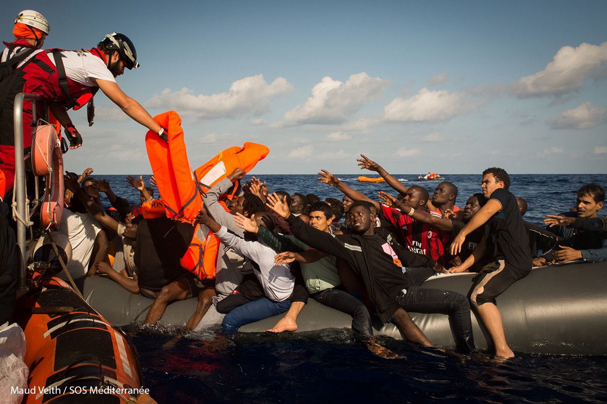
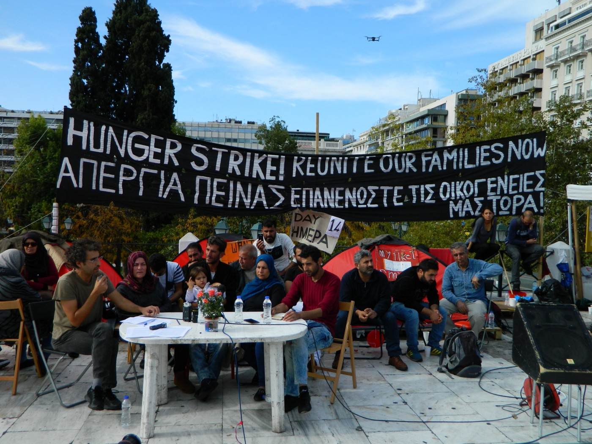
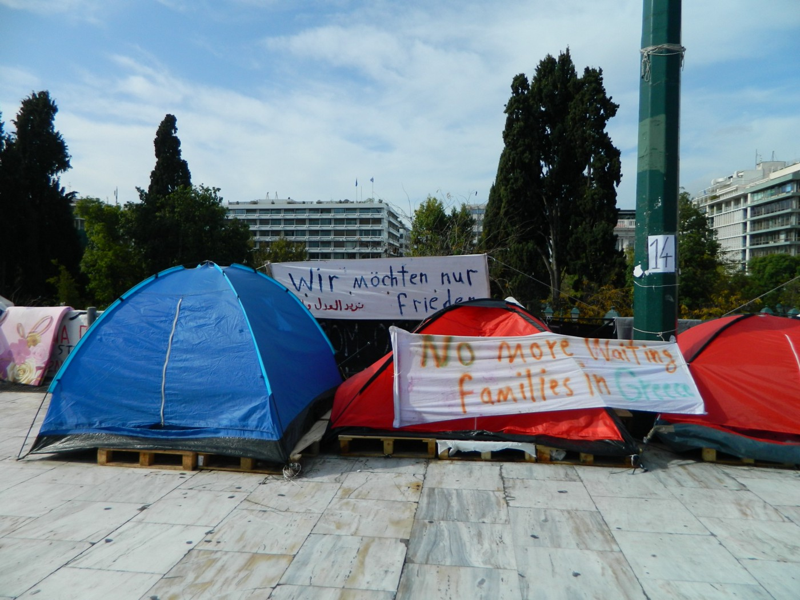
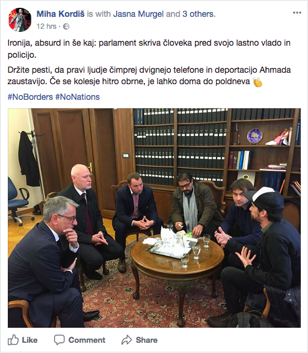
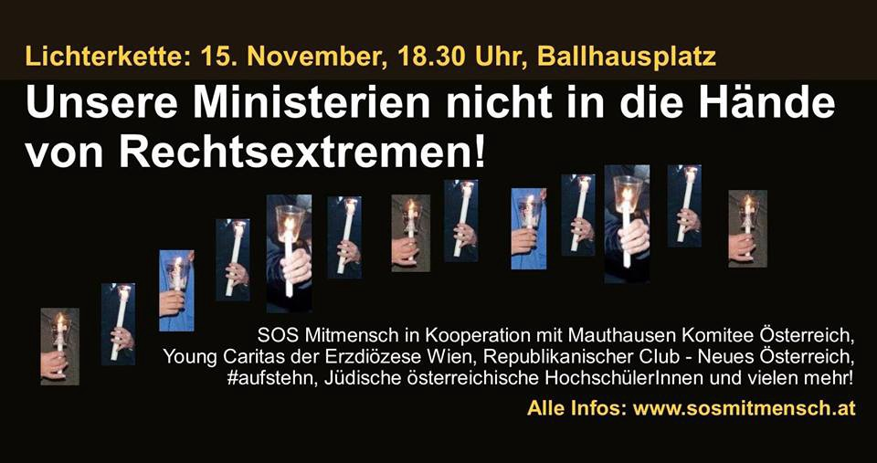

### AYS DAILY DIGEST 14/11/2017: “The suffering of migrants detained in Libya is an outrage to the conscience of humanity\.”

_Video proof of crimes against migrants in Libya, another one // UN condemns the EU policy towards Libya // Refugees ended the hunger strike outside of the Greek parliament in Athens // 5\-year\-old child found in hypothermia state in Bolzano // And more from Serbia, Slovenia, Austria, Denmark…_

SOS Mediterranee\. Rescue of people who came across the sea from Libya to Italy\. Photo by Maud Veith\.
### Libya

Months after the media and different groups and organizations reported extensively on unprecedented crimes against migrants in Libya, the UN human rights chief Zeid Ra’ad Al Hussein called the European Union’s policy of helping the Libyan authorities “inhuman”\.

The EU, as he said, helps the government in Libya to “intercept migrants in the Mediterranean and return them to “horrific” prisons in Libya”\.

_“The suffering of migrants detained in Libya is an outrage to the conscience of humanity,”_ Zeid Ra’ad Al Hussein said in a statement\.

This statement came almost at the same time when [CNN broadcasted an amateur video](http://edition.cnn.com/2017/11/14/africa/libya-migrant-auctions/index.html) they obtained unidentified showing men being sold for $400\.

This spring, UN agency [IOM issued a report](https://www.iom.int/news/iom-learns-slave-market-conditions-endangering-migrants-north-africa) about slave market in this country\.

Just a day before the video was shown, European and African ministers met in Bern, Switzerland, to praise each other on successes achieved during this year in stopping migration\. With great joy, they noticed that the number of arrivals to EU this year is 30 percent less than last year\.

But, there is nothing to be proud of in the way how this was achived\.

[")](http://www.youtube.com/watch?v=HpAQGyp6IcY)

Ministers agreed to _“work closely with Libyan authorities to ensure detained migrants and refugees were held with respect for human rights and humanitarian standards, and promised to secure priority release from detention for vulnerable people such as children and victims of torture\.”_

They also pledged _“to create economic alternatives to smuggling, including pilot projects for pathways for Africans to reach Europe legally, such as scholarships and apprenticeships\.”_

Nevertheless, they ignored information about dead children and women at the shores of EU member states, as well as all the available information on the slave trade in Libya\.

_Additionally, it is hard to understand what does mean that “detained migrants and refugees” have to “held with respect for human rights and humanitarian standards”\. Does this mean that it is in accordance with human rights and humanitarian standards to detain migrants and refugees?_

Libyan route became very busy after the EU reached the agreement with Turkey which resulted in the closure of borders and the main route via Greece\.

We’ve been reporting about the situation in Libya many times\. And we did not notice any significant improvement achived\.

now, after the video of trading in the human being is out, it would be interesting to hear EU bureaucrats defending the Italy\-Libya deal\.
### Greece

According to the UNHCR data, there are 46,462 registered refugees and migrants in Greece\. \(Until recently the number was over 60\.000\) \.

Out of that number, over 14,000 arrived since August\. Only in November, so far, more than 1,500 people entered Greece by sea\.

On the mainland, life for some asylum seekers is better than on the islands, but many are living in not suitable accommodation, and unaccounted number are homeless, including many minors\.

Thousands are still waiting to be reunited with their families in EU, including Germany\. But the process is extremely slow\. Group of those who are waiting for family reunification, ended hunger strike in Athens after 14 days\.

_“Today we stop the hunger strike before our health will get into critical conditions and before transfers to hospital start,”_ with this words 14 refugees ended the hunger strike outside of the Greek parliament\.

 **\.**](assets/72b563a9ec4/1*D9S2Md1vMXowEPrzmWOjCg.jpeg)

Photo by [**Katja Lihtenvalner**](https://www.facebook.com/katja.lihtenvalner?hc_ref=ARQxPZyRTxajF0U8PVH_JwjPgSRIhBP_0b9SN0J9Oa4d22QiTSyBzEA0v_NNcevYbAA&fref=nf) **\.**

_“We have responsibilities towards our children and towards families that are in agonies waiting for us in Germany,”_ they explained\. _“The silence was broken and, with it, the illusion that was persistently cultivated that the refugee situation has been “normalized” and the living conditions “improved\.”_ Hunger strikers also stressed that their protests made the German ministry of the Interior and the Greek ministry of Migration to take a stance on the issue\.

 **\.**](assets/72b563a9ec4/1*Hur5H7_WFsrwyY-LwYO6Kg.jpeg)

Photo by [**Katja Lihtenvalner**](https://www.facebook.com/katja.lihtenvalner?hc_ref=ARQxPZyRTxajF0U8PVH_JwjPgSRIhBP_0b9SN0J9Oa4d22QiTSyBzEA0v_NNcevYbAA&fref=nf) **\.**

At the press conference held opposite from the Greek parliament, protesters expressed gratitude to supporters, but also exposed the positive role of the media: _“In these two weeks tens of articles and reports were published in international, German and Greek media, many of which criticised the political game that is played behind the backs of refugee families\.”_

Meanwhile, protest in Mytilini, Lesvos, cotinues\. Arash Hampay reports:

“We, the protesters and hunger strikers, who are rallying in Mytilini center square during 27 days, have led to Moria camp this afternoon claiming the freedom of refugees from the camp and also from the island\. We claimed also the freedom of Hesam Shaeri Hessari who is arrested by Police a few days ago and is threaten to be deported to Iran\. Fortunately the refugees in the camp received us warmly\. We have protested in front of the camp shouting our demands and then we’ve agreed unanimously to make our action tomorrow \(Wednesday\): we will lead to Mytilini center square at 4 p\.m\. and will rest there until they open the islands and free the refugees\.”

Police on Lesvos was on strike today, too\.

Last week two detainees escaped from section B in Moria \(the prison\) — and due to that, some police officers were arrested\. Demonstration by police was against the arrest of the police officers on duty\.
### Cyprus

This year, 1,028 people arrived in Cyprus, which is almost three times more than in 2016, when 345 people were registered, IOM recored\.
### Italy

The railway police in Bolzano, Italy, found a 5\-year\-old child in a state of hypothermia crouched under a train wagon, [local media reports](http://www.ildolomiti.it/cronaca/2017/bambino-straniero-trovato-in-ipotermia-lungo-i-binari-profughi-stipati-su-treni-merci) \. The child was taken to the hospital, and when he woke up he said his name is Anthony and that he is coming from Sierra Leone\. The parents have not been found, yet\.

Police are certain that the child was moving with migrants on the route to Brennero\.

Another child, with men, women, and a pregnant woman, have been found on a cargo train, inside cases under some trucks, heading towards Austria\. The police of Bolzano and Como have arrested two smugglers, a 29\-year\-old Egyptian and a 30\-year\-old Iraqi\. The police have documented seven trips in few days, involving 50 people\. The people were collected at Milan Lambrate train station, loaded on a regional train to Colle Isarco \(the one before Brennero\), then people would have had to walk in the night, crossing the railway tunnel Fleres, reaching the border checkpoint\. They had to pay 150 euro for this trip\.

At that point, the smugglers were picking up and hiding people in an abandoned shack close to the railways, waiting to hop on the cargo trains parked at Brennero station\. Once found the right train and loaded the migrants on the wagons, exposing them to high risk\.
### Spain

According to IOM, total sea arrivals this year reached 16,000, including 418 during the past weekend\.The main ports of arrivals were Almeria, Tarifa, Malaga, Motril, Barbate and Algeciras\.
### Serbia

A number of new arrivals in Serbia is increasing every day\. [According to the last week data obtained by UNHCR](https://data2.unhcr.org/en/documents/download/60693) , in October 1,017 new arrivals were registered, among them 69 unaccompanied minors\. Only during the week from 6th to 12 November, 99 people were registered, and 34 percent of them were children\. Most of the people arrived now to Serbia are from Iraq, Pakistan, and Afghanistan\. Over a half arrived via Turkey and Bulgaria, while others through Greece and Macedonia\.

Currently, there is 4,262 in government facilities, and several hundred living in abandoned houses or in the forests close to the EU borders\.

### Slovenia

Planned deportation to Croatia of a 45\-year\-old Syrian refugee Ahmad Shamieh planned for today morning was prevented by a group of supporters and help of a two MP’s\. In order to prevent Shamieh deportation two MP’s took Shamieh into the offices of the parliament in capital Ljubljana\.
 
_“Attitude of some MP’s was ‘inadmissible and inadequate’,“_ the pre\-minister Cerar said soon afterward\. He also announced that government will consider the possibility of issuing a temporary residence permit for Shamieh at one of the forthcoming sessions\.

Photo from the Facebook page of one of the two MP’s; Miha Kordiš, who helped Shamieh to find a shelter in the parliament\.

Shamieh is for now staying in Slovenia, where he used to live for last 20 months\. His wife and three daughters are staying in Damascus\.
 
Over 3\.000 citizens signed a petition protesting his deportation\.
### Austria

It is always time to say no to fascism\.

Tomorrow join the protest in Vienna\. [Protesters](http://www.facebook.com/events/153914888677377/ www.sosmitmensch.at) will form a chain around the government district\. They will meet at 18:30 at Ballhaus Square, 1010 Vienna\. If you are planning to come, bring blinkers, bicycle lights, phone lights\.

> “With our chain, we send a signal to the people of Austria: it is our responsibility to defend all the beginnings in the direction of increase for far\-right and neo\-Nazi close circles\. With our chain, we also show that it is important to act and to raise the voice for our democracy, for the protection of human rights and for the strengthening of solidarity… In order for our chain to succeed, it needs a broad participation\. Every single person who participates is a crucial link in our chain\!” 

### The Netherlands

The residents of the [Wij Zijn Hier](https://www.facebook.com/freefighters/posts/1525538200866965) \(We Are Here\) group, living in the Neinoord 2 squat, have received an eviction letter\. The building they live in has to be vacated by Friday morning 09:00\.

The We Are Here group are not leaving the building, this is why they call for a solidarity demo\. All in solidarity with We Are Here Are called to come to the squat Friday morning from half past nine in the morning, in order to peacefully resist the eviction\.

The group is calling for solidarity and to show that people do not accept the human degrading policy of Bad Bed &Brood in which the refugees only get a place to sleep, take a shower and eat and are left to wonder the streets during the day\.
### Denmark

[The Danish Demining Group’s \(DDG\)](http://danishdemininggroup.dk/news/returning-afghans-face-increased-risk-from-mines-explosive-remnants-of-war) issued a statement saying that there is an increased risk of harm from mines and explosive remnants of war \(ERW\) in Afghanistan\.

They noticed that a massive influx of returnees to the country is noticeable this year primarily from Pakistan as a result of “a deteriorating protection environment”, they claim\.

_“According to the Directorate of Mine Action Coordination, the first eight months of 2017 saw a staggering 1,384 civilian casualties\. Returnees are relatively more at risk of injury or death than other civilian populations, as they are not familiar with ongoing conflict patterns or safe behavior\. As a result, they require targeted risk education,”_ they wrote in a statement\.

In their statement, DDG writes about how good their program of education is while avoiding mentioned the EU and people who are forcefully deported back to Afghanistan\. Some of them from Denmark\.
### France

[Care4Calais](http://www.care4calais.org) issued another [warning](https://www.facebook.com/care4calais/posts/1726348777398072) today stating that in the area close to what once was the Jungle, there are around 700 people living in the woods\.

_“They endure systematic police brutality, some reported by newspapers but most far too common to make daily news interesting\. They are unprepared for the rapidly dropping temperatures — they will only survive this winter if we help them\.”_

Please, help if you can\. They desperately need more winter jackets, gloves, hats, waterproof walking boots and thermal underwear\.

[Free online legal help in France](http://www.ref-asso.org/integration/) \.

Hundreds of migrants go through asylum procedures in prefectures and courts every day often encountering difficulties\. they don’t speak the good French language, they don’t know about asylum procedure and Dublin regulations\. Normally the prefecture gives them documents about the asylum but some migrants simply can’t understand\. And for that reason, We REF want to help and do our part by offering Online legal Aid assistance whereby you can talk to our volunteer Lawyers and Jurists on a Live Video Session\. After that, you will meet our lawyers in person if you have a case\.
### UK

An interesting initiative in London\.

“We are still registering people who would like to befriend an asylum seeker or refugee in London but as most live in the outer zones, we’d especially love to hear from you if you live in zones 3–6\.

To register or learn more, go [here](https://www.hostnation.org.uk/befriend/) \.

> **_We strive to echo correct news from the ground through collaboration and fairness\._** 

> **_If there’s anything you want to share or comment, contact us through Facebook or write to: areyousyrious@gmail\.com_** 

_Converted [Medium Post](https://areyousyrious.medium.com/ays-daily-digest-14-11-2017-the-suffering-of-migrants-detained-in-libya-is-an-outrage-to-the-72b563a9ec4) by [ZMediumToMarkdown](https://github.com/ZhgChgLi/ZMediumToMarkdown)._
