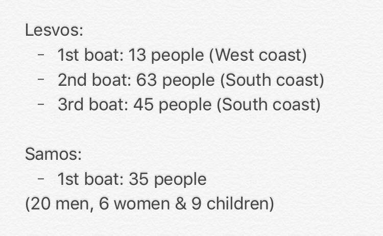

### **AYS Daily Digest 15/11/2017 2 Years of EU “achievements”**

Refugees from Cona reception centre in march to Venice /// Attempted march to the Macedonian Border from Thessaloniki /// Journalist falsely accused of smuggling on the Greek/Turkish border /// Resistance against eviction in the Netherlands

 — [\#noborders](https://web.facebook.com/hashtag/noborders)](assets/4833322e7505/1*rsX-w_h74AOCC2y-eTrfIA.jpeg)

Soon The Free way to Europe By Marian Kamensky \(Art Against\)
[\#openeuborders](https://web.facebook.com/hashtag/openeuborders) — [\#noborders](https://web.facebook.com/hashtag/noborders)

**Feature: 2 Years of EU “achievements”**

A week after two dead children washed up on the beaches of Lesvos, the European Commission has published a [press release](http://europa.eu/rapid/press-release_IP-17-4484_en.htm) listing its perceived achievements in the last two years\. This is part of the run\-up to the European Council in December, one of the main bodies involved in negotiating between EU and non\-EU countries and international organisations\.

They state that ‘irregular crossings’ into Europe have dropped by 63% in 2017 due to “ _collective efforts to protect the EU’s external borders, cooperate with partner countries to tackle the root causes of irregular migration, improve the protection of migrants and win the fight against smugglers\.”_

From the ground we can tell you what this looks like — Turkish and Libyan Coastguards firing on refugee boats, the rape, torture and slavery of people seeking sanctuary trapped in Libya, the death of children from cold weather on Greek islands, the [false imprisonment of a Dutch journalist](http://harekact.bordermonitoring.eu/2017/11/15/greece-releases-dutch-reporter-taken-for-smuggler/) accused of people smuggling by Greek police, even though he had ID and Press Cards, because he had brown skin\.

First Vice\-President Frans Timmermans is said to have stated that: _“Since 2015, we have made real progress through our joint work to manage migration better in a comprehensive way\.”_

A large part of Timmermans job is ensuring that the [EU Charter of Fundamental Rights](http://ec.europa.eu/justice/fundamental-rights/charter/index_en.htm) is adhered to\. The Charter describes the EU as a haven for Human Rights:

> Conscious of its spiritual and moral heritage, the Union is founded on the indivisible, universal values of human dignity, freedom, equality and solidarity; it is based on the principles of democracy and the rule of law\. It places the individual at the heart of its activities, by establishing the citizenship of the Union and by creating an area of freedom, security and justice\. 

Under the heading ‘Addressing Root Causes and Saving Lives’ the report states that as part of the €3 billion deal to support refugees in Turkey “ _one million of the most vulnerable Syrian refugees now receive monthly electronic cash transfers\.”_ Yet it is well documented that of the approximately 3\.5 million refugees in Turkey many are forced into low paid labour including [children as young as 7 exploited in garment factories](https://business-humanrights.org/en/an-estimated-250000-syrian-refugees-working-in-turkey-vulnerable-to-exploitation) \. They continue to say that “ _the EU Trust Fund for Africa is increasing stability and resilience by supporting economic development and migration management in countries facing crises of different natures and emergency situations\.”_ While [local media reports](https://www.africanindy.com/news/dozens-of-tortured-bodies-discovered-in-libya-11993286) that 28 bodies showing signs of torture have been discovered in a mass grave in Libya due to the ongoing civil war\.

The situation in Libya for refugees was condemned yesterday by UN monitors who visited detention facilities and said they found _“ [thousands of emaciated and traumatized men, women and children piled on top of each other”\.](http://www.bbc.com/news/world-africa-41983063)_

While the EU commission states that _“medical help and assistance is being delivered to migrants, including in detention centres,”_ the UN calls their support of Libya in returning people to detention ‘Inhuman\.’

The report clearly states that more returns and deportations must take place\.

> With return rates at EU level remaining unsatisfactory, this is an area which requires the commitment of all to ensure concrete progress is made\. \[…\] The EU should also continue collectively exploring the mobilisation of all incentives and leverages to achieve progress on return, as endorsed by the European Council\. 

Even though there have been countless situations were this has endangered lives, such as the [return of Afghan asylum seekers from Denmark](http://www.independent.co.uk/news/world/europe/afghanistan-police-beat-asylum-seekers-danish-officers-deportation-flight-kabul-refugee-returns-safe-a7739176.html) who were then beaten by police in the airport\.

**General**
#### **Right to Work and Right to Travel: Rumors and Facts**

The [Athens Volunteers Information and Co\-ordination Group](https://web.facebook.com/groups/AthensVolunteersInformation/?ref=group_header) have collected information on recent rumours spreading across the local refugee community\.

**Refugees who have asylum in Europe CAN ONLY WORK IN THEIR HOST COUNTRY**

Over the last weeks, there have been rumours that refugees can work in countries other than the one that they have been given asylum protection in\. In particular, the rumours suggest that people can travel on their 90 day travel documents and work in either Germany or the UK\. This rumour is not true\. Refugees who have asylum in Europe can only work in their host country, nowhere else\. The timing of such rights in the host country can differ depending on the laws of each country\. Refugees who have been given asylum in one country do not have the same rights to work in other EU countries as EU citizens\.

Non EU citizens need to apply for a Working Schengen Visa and get a residence permit before entering the Schengen territories for work purposes\. Only citizens of USA, Australia, Canada, Israel, Japan, New Zealand, Switzerland, as well as EU citizens can apply for their residence permit after entering the Schengen territory without a visa\.

Read more: [https://www\.schengenvisainfo\.com/working\-schengen\-visa/](https://www.schengenvisainfo.com/working-schengen-visa/)

If anyone is suggesting that it is possible to work in countries \(which are not the host country\) then this is incorrect and most likely it is illegal\. Please note that these are common rumours that traffickers and smugglers use when they intend to use refugees for prostitution or slave trades\. Therefore single women/girls and young men/boys need to be extra vigilant\.

**Refugees rights to move in EU countries \(apart from the 90 days travel\)**

People granted refugee status in an EU country can get the right to move to most other EU countries if they’ve been living here “legally and continuously” for five years\. But there are exceptions: the UK has chosen not to be covered by this law\. So refugees in an EU country like Germany would need to become citizens of that country in order to benefit from free movement rights and travel to the UK\.

Read more: [https://fullfact\.org/immigration/asylum\-seekers\-uk\-and\-europe/](https://fullfact.org/immigration/asylum-seekers-uk-and-europe/)

The length of time to acquire citizenship varies across the EU\. For example, refugees are entitled to citizenship after eight years in Germany\. Refugees can apply for citizenship after five years in Italy and four years in Sweden, according to the European Union Democracy Observatory, but the outcome of the application depends on income and other factors and it is at the discretion of governments\.

**Sea**

**Humanitarian Pilots Initiative needs supporting**

■■■■■■■■■■■■■■ 
> **[Alarm Phone](https://twitter.com/alarm_phone) @ Twitter Says:** 

> > Running an aircraft that helps spotting travelers in distress at sea is not an easy task and definitely not a cheap one. Humanitarian Pilots Initiative - HPI can use our help to continue the great work they do. If you wish to support their efforts, donate: [donate.hpi.swiss/?de](https://donate.hpi.swiss/?de) https://t.co/pSjObz68EQ 

> **Tweeted at [2017-11-15 16:05:41](https://twitter.com/alarm_phone/status/930829165183557632).** 

■■■■■■■■■■■■■■ 

**Greece**

After the tragic flooding that caused 15 deaths in Mandra, Attica today, more severe weather [is expected](http://www.severe-weather.eu/mcd/torrential-rainfall-greece-nov15-19-2017/) over the next few days\. Torrential rainfalls are expected from today until Sunday\. Precipitations are likely to reach 50\+ mm over widespread areas and locally 100–400\+ mm\. Major flooding is expected\.

**Greek Islands**
#### Arrivals

Image by Eric Gerhardsson

[Boat report — Lesvos](https://web.facebook.com/boatreportlesvos/) report that one more boat made a landing at the north Coast, carrying 52 people\.
#### Authorities launch strike on Lesvos

Yesterday Spyros Galinos, mayor of Lesvos, launched a general strike for next Monday as an act of protest against the lack of action of central government regarding the overcrowding of the islands, media [report](http://www.ekathimerini.com/223273/article/ekathimerini/news/lesvos-reaches-breaking-point-mayor-declares-general-strike) \.

With a total local population of 32,000 people, there are at the moment around 8,300 refugees on the island\. 6,000 are living in or around the detention centre in Moria, which is geared for 2,000 people, and has around 1,500 people living in unheated tents or sleeping rough\.

**Mainland Greece**
#### Protest in Thessaloniki

Photo by Parallaxi

Around one hundred refugees started to gather in Aristotelus square, Thessaloniki this morning\. Responding to a call diffused over the last few days on social media, they are demonstrating against the deadlock situation they are in: continuous delays in the reunification program, unwillingness of many European countries to welcome more refugees, impossibility to leave the country, malfunctions in the Greek reception system\. Some tents have been set up and, according to [media sources](http://parallaximag.gr/thessaloniki/symvainei-tora-stin-plateia-aristotelous) , one of the participants threatened to self\-immolate with petrol\.
From many different nationalities, refugees arrived from Athens, Lamia, Lesvos, Chios, as well as from the camps in the north of the country\.

■■■■■■■■■■■■■■ 
> **[Giannis Papanikos](https://twitter.com/JohnPapanikos) @ Twitter Says:** 

> > #Refugees participate in a #protest, demanding for the borders of EU to open for them, at the #Greek city of #Thessaloniki, on Wednesday, Nov. 15, 2017. Photo : @[JohnPapanikos](https://twitter.com/JohnPapanikos). #photoreportage #photojournalism #refugeesgr #migrants #refugeecrisis #photography #photographer https://t.co/64z9BlxZUh 

> **Tweeted at [2017-11-15 12:42:33](https://twitter.com/johnpapanikos/status/930778046159818752).** 

■■■■■■■■■■■■■■ 

The majority of them are young men, but there are also women and children\. The aim of the demonstration is to reach the northern border on foot\.

_“Even though the so called Balkan Corridor is closed, they are committed to reach Northern and Central Europe, where their relatives live\.”_

Photo by Parallaxi

At around 19\.30 the group started the march, but the police blocked the road to the border before the city’s train station\. Demonstrators occupied the street for some time, confronting the police\.
#### Journalist Sakir Khader released in Greece

According to [media sources](http://www.aljazeera.com/news/2017/11/dutch-journalist-sakir-khader-detained-greece-171114103715340.html) , Dutch journalist Sakir Khader was detained on Monday at the Greek\-Turkish border while reporting on refugees crossing into Greece via Turkey\.

The reporter had joined a group of about 50 Syrians as they crossed a small river that demarcates the border between Greece and Turkey near the town of Didymoteicho\.

> I have been detained for 30 hours and treated badly, I was not allowed to make calls and kept on getting ISIL\-related questions, I was on my way with a group of refugees to Athens to see how refugees are now entering Europe, we were met by police at the border and I was mistaken for a smuggler, even though I showed them my press cards\. 

He was handed a suspended five\-month prison sentence on Tuesday for entering a restricting military area without permission\.
#### Volunteering opportunities and call for donations

[Ruhi Loren](https://web.facebook.com/ruhi.akhtar.7) is seeking volunteers with skills such as jewellery making, art, knitting, crochet, and music who are interested in setting up classes/workshops in a few camps she supports near Athens\. She is also looking for support with ongoing language lessons, especially English\.

Read more [here](https://web.facebook.com/ruhi.akhtar.7/posts/1896693527014213) , and if you are interested, please [get in touch](https://web.facebook.com/ruhi.akhtar.7) \.

[Refugee Education Chios](https://web.facebook.com/refugeeeducationchios/) are looking for qualified teachers and youth workers to join their project from December onwards\.

_At the most basic level, we fulfil a fundamental right of children — to access education\. In Chios, children are continually denied access to the formal education system run by the Greek Government and there are no immediate plans to integrate the children arriving into Europe into the local education system\._

Read more and apply [here](https://web.facebook.com/refugeeeducationchios/posts/562387814107272?hc_location=ufi&_rdc=1&_rdr)

[Dråpen i Havet](https://web.facebook.com/drapenihavet/) \(Drop in the Ocean\) need support for continuing their work in Greece’s camps\. Among other things they organised a pop\-up market outside Lagkadikia camp, in Northern Greece, that hosts 230 people and where no volunteer organisation is working\.

Read more and support them [here](https://web.facebook.com/HelpRefugeesUK/posts/520341301659881?hc_location=ufi&_rdc=1&_rdr) \.

Over the last few months [Lesvos Solidarity — Pikpa](https://web.facebook.com/pikpalesvos/) have been working to prepare the camp for winter\. With no provision offered by the government they’ve taken things in their own hands\.

Read more and support them [here](https://web.facebook.com/HelpRefugeesUK/posts/520673314960013?hc_location=ufi&_rdc=1&_rdr)

**Italy**
#### **Cona refugees marching towards Venice**

Yesterday a group of 300 refugees left the reception centre in the ex\-military base of Cona with the intention of walking to Venice and meet the prefect\. Last night they slept in Codevigo, on buses\.

> They don’t want to return to Cona, because the conditions are not liveable\. The ex\-base is unfit to host people; basic services and paths for inclusions are not guaranteed\. 

> We want immediate solution, we denounced the bad conditions in Cona months ago, no one listened\. 

Photo by Melting Pot Europa

From [Melting Pot Europa](https://web.facebook.com/meltingpoteuropa/) ’s [account of today](http://www.meltingpot.org/Cona-Ve-Richiedenti-asilo-protestano-e-lasciano-il-centro.html) :
- 12\.00: The prefect arrives in Codevigo and meets the refugees\.

At the same time, in Cona, the centre was occupied by the refugees who stayed there\. Workers are outside\.

Photo by Melting Pot Europa

> “We want to close this concentration camp” 

- 13\.50: The meeting finishes\.

The prefect and the head of local police said that they don’t have _technical solutions_ to relocate the refugees\. They instead proposed to go back to the Cona centre and meet again in 5 days\. The group of refugees refused to go back and decided to stay in Codevigo\.

> “We are ready to camp here until humane solutions will be found”\. 

- 14\.40: The centre in Cona is still occupied\. They invite the prefect inside to see first\-hand the horrible conditions\. Three demands are made:

1\. To close the centre in Cona;

2\. To find alternative accommodation for all the refugees of Cona, providing social inclusion projects and guaranteeing basic services;

3\. To know how their friends in Codevigo are and what will happen to them\.
- 16\.50: The group of asylum seekers in Codevigo are marching towards the town centre\. They intend to ask for the church to open to host them for the night\.
- 17\.05: Those who were occupying Cona centre decide to leave and reach the other group in Codevigo\.

- 22\.30: The church stays closed and the mayor decides not to intervene\. A double shame\. Asylum seekers are sleeping outside the church\.

Photo by Melting Pot Europa

Tomorrow they want to reach Venice and the Prefect office, together with the activists that are arriving from the surroundings\.

As an absurd epilogue, an asylum seeker that was trying to reach the group in Codevigo on his bike was run over and died in the evening\. Even after this news the church was not opened …
#### **Updates from Pordenone**

While temperatures keep decreasing, Italian police keep taking away blankets and sleeping bags to refugees sleeping rough in Pordenone\.

**Serbia**
#### Updates from Sid

**Slovenia**
#### **Call for donations**

[Second home](https://web.facebook.com/secondhomeljubljana/) , based in Ljubljana, published a call for donations to support refugees sleeping in the Bombi Tunnel on the outskirts of Gorizia, just on the other side of the border with Italy:

**Bulgaria**

**17 Afghan people arrested in Kostinbrod**

Local media report that police seized 17 Afghani people in the Kostinbrod area\. 13 of them under 18 years of age and 4 adults\. One person had papers for Bulgaria but everyone else was undocumented\. Their detention took place around 6pm on the 14th of November after City District officials were informed that there was a group of about 20 people with backpacks walking on the road near the village of Dramsha\. They have been taken to Rostov\-Kostinbrod to be seen by the Migration Group at the Department of Migration\-Sofia\.

**France**
#### Update from Calais

#### Call for Volunteers and donation from Paris

[Vestiaire pour le migrants](https://web.facebook.com/pedro.p.naranjo/posts/10155381879428536) , in La Chapelle, Paris are looking for volunteers for distribution and donations for the upcoming winter:
- Shoes 40–45, Trousers 38–46, socks, underwear, sleeping bags, jackets, shirts S and M, caps/hats, gloves, scarves, new underwear for women\.
- Hygiene products: deodorant, shampoo, shower gel, soap, laundry detergent, lotions, toothbrush and toothpaste, shaving supplies, tissues, nail cutters, female hygiene products, nappies for children\.
- Pens and exercise books\.
- Medication: stromectol, spregal, A\-par, escabiol, flammazine, xyzall, examination gloves\.

Drop off Wednesday, 14–18 and Saturday/Sunday 9–15\.

Read more [here](https://web.facebook.com/pedro.p.naranjo/posts/10155381879428536) , and get in touch with [Pedro](https://web.facebook.com/pedro.p.naranjo)
#### Calderdale for Calais Refugee Action Winter Pack/Bag Appeal

**Netherlands**
#### **Support Resistance Against Eviction\.**

We Are Here will resist the eviction of a squat housing refugees on Friday 17th of November from 07\.30am at Nienoord 2, Diemen, Netherlands\.

> We do not want any more pseudo\-solutions, we want accommodation\! Therefore, when they will come to evict us, we will not leave voluntarily\! We stay\! We have no other place to go\. After 27 evictions we now want to confront the citizens of Diemen and Amsterdam and surroundings with our hopeless situation, we have no other choice\! 

They ask for support from people sympathetic to their cause\.

> We fled from areas where war prevails, or hunger, or extreme poverty, or where we have been politically prosecuted — conditions caused partly by European, also Dutch \(post\)colonial interference\. 

The building is owned by Arq, an organization focused on the health of traumatized refugees, which through its partner organisations supports some of the people who it plans to evict\. Read more [here](https://enoughisenough14.org/2017/11/15/refugees-netherlands-support-resistance-against-eviction-we-are-here/) \.

**Germany**
#### **Homelessness on the rise**

Homelessness has risen by 150% in Germany since 2014, [local media](http://www.dw.com/en/germany-150-percent-rise-in-number-of-homeless-since-2014/a-41376766) reports\. Of the 860,000 homeless people, 440,000 are refugees and of the 420,000 remaining homeless people, 52,000 live on the streets\. Excluding refugees, 32,000 of the homeless people in Germany are thought to be children\.
#### **Asylum seeker died in a fire in Bamberg Centre**

An asylum seeker died in the Bavarian city of Bamberg on Wednesday night due to a fire at the Bamberg Centre\. The person has not yet been identified\. The Centre used to house US troops stationed in Germany and it is now used as accommodation for around 1200 refugees\. 14 other people suffered from smoke inhalation\.

**Ireland**
#### Ireland to increase family reunification and relocations

The Irish Government has passed a bill to allow refugees already settled in Ireland to bring over their closest family members\. This will make up to 530 people\. They have also increased their resettlement quota to 600 people in 2018 and another 600 in 2019\.

**US**
#### **Scholarship for one refugee**

The John Hopkins center for humanitarian health offers a full scholarship for its Master of Public Health graduate program to a refugee for 2018/19\.

> **_We strive to echo correct news from the ground through collaboration and fairness\._** 

> **_If there’s anything you want to share or comment, contact us through Facebook or write to: areyousyrious@gmail\.com_** 

_Converted [Medium Post](https://areyousyrious.medium.com/ays-daily-digest-15-11-2017-2-years-of-eu-achievements-4833322e7505) by [ZMediumToMarkdown](https://github.com/ZhgChgLi/ZMediumToMarkdown)._
