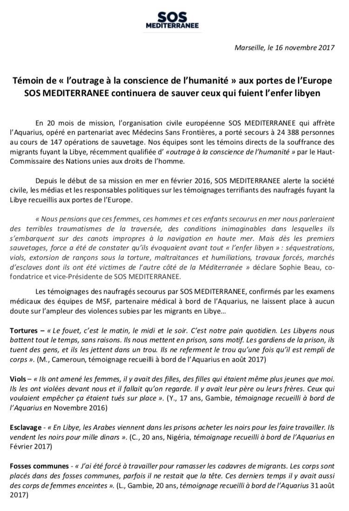
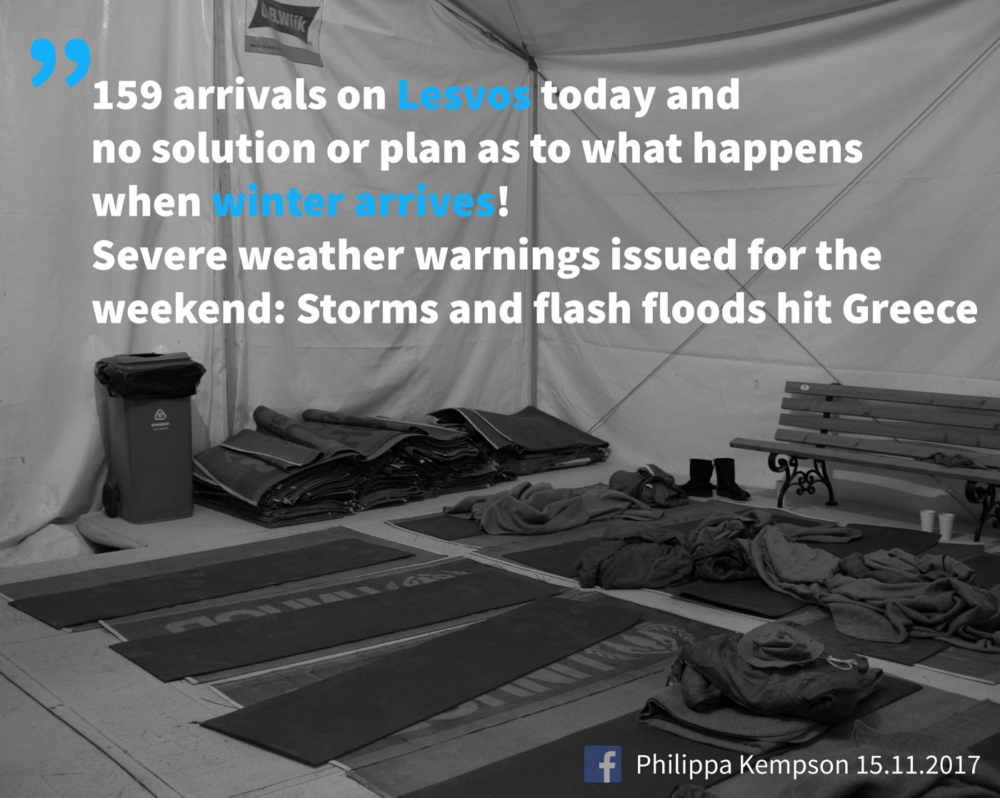
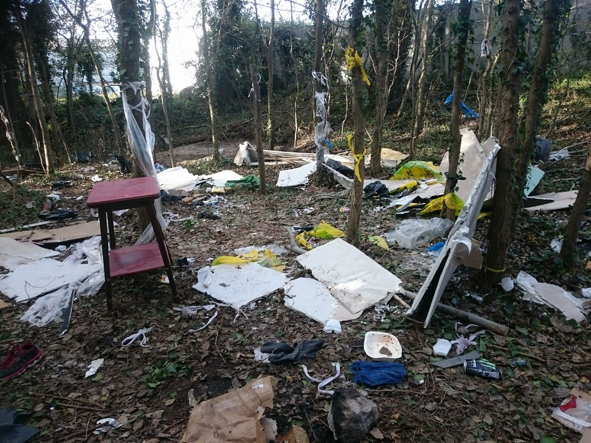
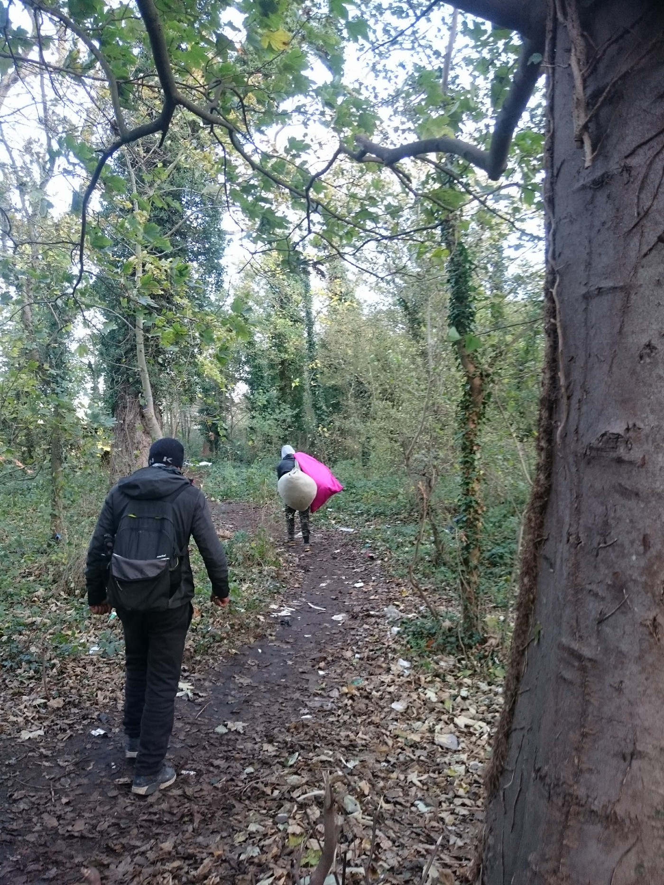

### AYS Daily Digest 16/11/17: EU defending “an outrage to the conscience of humanity”

_Although all human rights organizations condemn Libya, the EU member states — Germany and Italy in particular — seem to support crime / Greece facing serious weather conditions and organizations in need of more volunteers / Croatia involves consultants in setting up public system? / More refugees stuck in the France, UK etc\. / And more news…_

 \) The photo portrays horrendous conditions where a number of those “lucky enough” to have crossed the Mediterranean and reached the northern part of Italy](assets/3c178b8d9fc4/1*3s6N1ZorW1R4Dcb5fSQSzQ.jpeg)

Gorizia, November 16 \(Photo: [L’ ALTRA VOCE](https://www.facebook.com/L-ALTRA-VOCE-1245970425495921/) \) The photo portrays horrendous conditions where a number of those “lucky enough” to have crossed the Mediterranean and reached the northern part of Italy
#### FEATURE — Germany and Italy defending criminal practice of Libya

“Handing human traffickers the keys to European democracies” is presented by the Italian Minister as the alternative to the Italian and EU’s supporting of the unlawful and horrendous activities of their Libyan ‘partners in crime’\.

The practice of support \(political and financial\) given to the Libyan coast guard and other forces working on preventing people to flee their countries and the continent in a search for safety and decent life constantly exposes returned migrants to Libya’s lawless detention centers, with no legal recourse\.

> “ **Men, women and children enslaved, raped, beaten, piled on top of one another in the centres\. All this has been known for a long time** ,” 

— said former Italian foreign minister Emma Bonino\.

However, now Italy’s foreign ministry simply said that Rome had been calling “for months” for those involved “to multiply actions and efforts in Libya to ensure acceptable and dignified conditions” in detention centres\. This implies the states involved — are not involved?

 **shares experiences and continues rescuing those who escape the Libyan detention hell**](assets/3c178b8d9fc4/1*_ZN3WtzVnGXdK3bzPMjhPQ.jpeg)

[**SOS MEDITERRANEE France**](https://www.facebook.com/sosmedfrance/) **shares experiences and continues rescuing those who escape the Libyan detention hell**

The U\.N\. human rights chief demanded Libyan authorities investigate and prosecute those responsible for atrocities inside its detention centers, and for migrants sent back to Libya not to be detained at all\.

Italian Foreign Minister, on the other hand, said they invite all those who are giving lessons to instead give more funds, more logistical support and more intervention in Libya to solve this issue\. He also said that they know that conditions in the detention centers were unacceptable but said there were no alternatives\.

> “The increasing interventions of the EU and its member states have done nothing so far to reduce the level of abuses suffered by migrants\. On the contrary, conditions have only worsened\.” — _Human rights chief Zeid Ra’ad Al Hussein_ 

■■■■■■■■■■■■■■ 
> **[MSF Sea](https://twitter.com/MSF_Sea) @ Twitter Says:** 

> > Strong words from @[UNHumanRights](https://twitter.com/UNHumanRights) on #Libya detention centres. #MSF reiterates its call for an end to the arbitrary detention of refugees, asylum-seekers and migrants in #Libya [twitter.com/UNHumanRights/…](https://twitter.com/UNHumanRights/status/930416374475870209) 

> **Tweeted at [2017-11-16 12:15:16](https://twitter.com/msf_sea/status/931133566238502912).** 

■■■■■■■■■■■■■■ 

#### EU
### EU resettlement framework: Eppur si muove

A mandate for negotiations on a regulation establishing an EU resettlement framework for the admission of persons in need of international protection has been set up on behalf of the European Council\. With main objective being legal and safe pathways, common rules for resettlement and humanitarian admission, effective contributing to global resettlement and taking the pressure off the third\-countries, they hope to “ **decrease flows to our own external borders, disrupt the business model of smugglers and balance the efforts done in other fields, for example in returns** ”\.
#### GREECE

■■■■■■■■■■■■■■ 
> **[MSF Sea](https://twitter.com/MSF_Sea) @ Twitter Says:** 

> > Welcome to #Samos, where 1500 of men, women and kids fleeing countries like #Syria #Afghanistan and #Iraq are currently living in a center that should host 600 people. Time to #opentheislands? https://t.co/bvKH59hNha 

> **Tweeted at [2017-11-16 08:36:40](https://twitter.com/msf_sea/status/931078554489622529).** 

■■■■■■■■■■■■■■ 

#### New arrivals

Three boats to Lesvos this morning, a total of 146 people \(39, then 64 and the last boat had 42 people on board\), all on the north coast of the island\. They will be welcomed to a camp which has absolutely no space or capacity\!

Two boats arrived to Chios\. The first boat with 55 people arrived to Chios in the morning, carrying 14 men, 12 women and 29 children\.
The second one had 22 men, 7 women and 26 children on board\.
### Islands need medical staff
#### **Leros**

Kitrinos Healthcare has responded to the emergency crisis by seeking and obtaining official permission to provide essential medical services in Leros\. 
An emergency response medical team has headed to Leros this week and officially commenced services yesterday, Wednesday November 13\.

> Qualified doctors \(or nurse practitioners\) with a prescribing licence \(minimum 2 years post qualification\) are needed; ideally GPs, paediatricians, women’s health specialists \(including contraception advice\) and A&E doctors who are prepared to help with primary care\. We would also need experienced nurses with or without prescribing license \(although it is very helpful if you do have one 

#### Lesvos

![Monday to Saturday, our medical clinic in camp Moria serves up to 60 patients a day, previously a dentation centre designed to accommodate 2,500 people, is now home to 6,468 people seeking refuge from war and persecution\. People in need of shelter, food and water, sanitary, medical aid and a safe environment are living under very harsh conditions\. These challenges will only increase, as new arrivals come to the island of Lesvos every day and winter settles in\. **For our clinic to keep serving these patients, we are in need of senior and junior doctors to join our team for the month of December\.** As our clinic is busy from the moment it opens to when we leave the camp, we ask that only fully qualified, professional and experienced medical volunteers apply\. If you’re qualified and interested in this opportunity then please apply by emailing us directly with the subject heading MEDICAL to: **aid@ercintl\.org**](assets/3c178b8d9fc4/1*UpDD55eH3Jk4-zi5Y14reg.png)

Monday to Saturday, our medical clinic in camp Moria serves up to 60 patients a day, previously a dentation centre designed to accommodate 2,500 people, is now home to 6,468 people seeking refuge from war and persecution\. People in need of shelter, food and water, sanitary, medical aid and a safe environment are living under very harsh conditions\. These challenges will only increase, as new arrivals come to the island of Lesvos every day and winter settles in\. **For our clinic to keep serving these patients, we are in need of senior and junior doctors to join our team for the month of December\.** As our clinic is busy from the moment it opens to when we leave the camp, we ask that only fully qualified, professional and experienced medical volunteers apply\. If you’re qualified and interested in this opportunity then please apply by emailing us directly with the subject heading MEDICAL to: **aid@ercintl\.org**

### Athens — volunteering and aid needs

**AMURTEL Greece** wants to continue to support women with the so much needed vitamins\. [Help them](https://needslist.co/nlclaim/150/add/19) if you can\!14Currently refugee mothers still face an enormous challenge to have support during their pregnancy\.
The money budget per family is low and nutrition tends to be accordingly to what the money is enough to buy and not what is needed\. Vitamins help to reinforce the mothers system that in pregnancy is more fragile along with the living difficulties refugee women face every day\.

Not only for the mothers vitamins are important but also for the babies being breastfed as it helps to build their immune system as well\.

[**Khora Community Center**](https://www.facebook.com/KhoraAthens/?ref=gs&fref=gs&hc_location=group) is looking for volunteer English, German, French, computer, and music teachers\.

> We offer all levels of language from ABC´s to C1 fluency\. We take teachers with little or lots of experience, no certificate required\. We provide teachers with teaching resources and educational support\. We need teachers to teach at Khora for at least 4 weeks, the longer the better\! \! We are based in central Athens, close to Exarcheia\. For more info, please send an email to khora\.education@gmail\.com 

#### Free Shop needs help

> Since last November, the number of people coming through our shop has grown exponentially — in fact, so much that it’s become a bit of a problem\. Our aim has always been to serve people with an attitude of dignity and compassion\. We don’t use distribution lines \(they’re dehumanizing, and people aren’t animals\) \. We want to avoid huge mobs of people waiting outside \(safety never takes a holiday\) \. And we want people to have a fun experience at the Free Shop\.
 

>  During the month of November, Khora has been closed\. We’ve been doing building work, using feedback on how we can improve, and cleaning the space\.
 

>  We’ve found a location a short 5\-minute walk from Khora’s main building\.
 

> **we need your help\.** Running our shop and keeping it nice requires money\. This money goes toward electricity, water, gas for van trips to the warehouse, building upkeep, and rent\. We’re a small organization and want to help as many people as possible\. We can’t do that without the generous support of people like you\. 

Please contact them through their [official Facebook page](https://www.facebook.com/khorafreeshop/?hc_ref=ARSJ4qd7EP64Vfm2qUW2TlXh5qIHO2kbHD1mICAshCxABaVkv-Ct_fHYAGlSrhSheFI&fref=nf) so you can see how to help\.

**No Border School** urgently needs English and German teachers to help us continue to deliver our classes at various locations in Athens\.

> If you can commit to 4 weeks volunteering with us we’d love to hear from you 

PM to [https://www\.facebook\.com/noborderschool/](https://www.facebook.com/noborderschool/?hc_location=ufi) 
[http://www\.noborderschool\.com/contact\-us/](https://l.facebook.com/l.php?u=http%3A%2F%2Fwww.noborderschool.com%2Fcontact-us%2F&h=ATODyMGs2W6--EYX1WD29TnlIkBAitJwV3_FGV6IJ3ttsXDm_5SOlPBuFDqYN4zbI6oUcd0_-XfBlaDK_SXNZWukIW9j9hCbERprhDpqv5QnyXNxxo6Ugm5I3TsBiJvVyG6hs3N7) 
Email noborderschool@outlook\.com
#### CROATIA
### Why is the state of Croatia hiring ICT consultancy firm to tailor the national integration policy?

In Croatia, according to the words of the Government Office for Human Rights and Rights of National Minorities \(national coordinating body for integration policies\), the newly proposed Action plan for Integration of who they call ‘Third\-Country Nationals who need international protection’ for the period 2017–2019 should be adopted by the Croatian Parliament\. 
The previous Action plan has covered the 2013–2015 period, and we are not quite sure what was legally \(and actually\) directing Croatian decisions regarding the people in need of international protection in the meantime\.

What is even more peculiar than this period of limbo is the fact that the evaluation of the previous policy framework, measures for improvement of the ‘existing’ policies, but also creating the new policy framework and the indicators for its’ monitoring is project\-based \(funded from IPA 2012 and AMIF funds\) \.

> What AYS finds especially interesting is the fact that the evaluation and policy improvement ‘project’ is done in by two consultancy firms\. 

One of these private partners of the Croatian state has a mission ‘to ensure the provision of high quality consultancy and ICT services for their customers, supporting them to achieve their strategic and business goals and ensuring continuity throughout the changes to their business\.’ 
As citizens of this state, we find it hard to make the sign of equation between the ‘doing business’ and working with people\. 
Also, as citizens of this state, we would like to know what qualifies ICT business consultancy firm or any other generic consultancy entity to direct such a complex social and life process?

> **_We should highlight that the new Action plan is targeting almost exclusively the persons to whom the international protection has been granted within the majority of its measures_** 

— the measures which are targeting the asylum seekers include only those measures which are actually legal obligation of the State \(such as access to education for children and minors\), already defined by the Act on International and Temporary Protection\. 
This kind of approach might indicate the so\-called ‘rationalisation of the available resources’ and the **misconception that the integration process begins only in the moment when a person received his/her asylum papers\.**
#### ITALY
### Cona marchers reach Venice

Solidarity citizens are working to collect donations to support the asylum seekers who were stopped in the Venice area, where they came in a march from the asylum centre Cona, protesting the inhumane conditions there, hoping for a more dignified lodging and treatment\. 
Parishes of the area opened their doors for this night, although the police initially stopped them upon arrival and return was demanded, they were taken by buses and placed for the night\.

](assets/3c178b8d9fc4/1*MvebVkf--Nrf8r_zH4YdOA.jpeg)

Photos: [**Melting Pot Europa**](https://www.facebook.com/meltingpoteuropa/)

](assets/3c178b8d9fc4/1*9vsuChUMNStyyUgvuEvkFA.jpeg)

Photo: [Cooperativa Caracol](https://www.facebook.com/coopcaracol/)
### Rome

Baobab Experience Volunteer group need volunteers armed with patience and smiles, on Saturday, 15h, in the area of the Piazzale Maslax\.
They have plenty of things to distribute, they only ask for some of the things to be donated if possible, between 14:30 and 15h:
\- blankets
\- S/M size men’s underwear \(new\) and socks
\- men’s sport shoes, size 40–45
\- men’s sport jackets, S/M size \(no coats\)
\- backpacks
\- toiletries, shower gels and shampoos in SMALL size
#### FRANCE
### Calais refugees face the winter

The situation on the streets of Calais continues to worsen\. 
Over a year later, with the arrival of another winter, there are still hundreds of refugees and migrants bracing for the cold, desperate to cross the Channel and to make a fresh start in Britain\.
The refugees living in Calais continue to depend upon the volunteer organizations that have been present in the area all the while: Help Refugees, Utopia 56 and Care4Calais\.

> With temperatures now reaching zero degrees and over 800 people sleeping rough in Calais alone, it is becoming harder and harder for the few organisations operating here\. 

](assets/3c178b8d9fc4/1*dIERi3oFro_Qc8Thw01T7g.jpeg)

Photos: [Ifty Patel](https://www.facebook.com/ifty.patel)
### Paris

Restos du Coeur prepares hot food in Porte de la Chappelle on **Tuesday, Thursday, Friday and Sunday** \. 
They work **at 20h weekdays** , except **Sunday** , when it starts **at 19h** \. 
Food is prepared for 500 people, but as only 200 people seem to have found out about it on Tuesday, they are spreading the word\.
#### GERMANY
### A continuing disadvantage for the refugees

People with a migration background differ markedly from those without a migration background in key areas, such as education, the labor market and income\. This is the conclusion of [a study](http://m.dw.com/en/migrants-in-germany-are-at-a-disadvantage/a-41409791) by the Federal Statistical Office \(Destatis\) \. Their statistics show that those with a migration background have much poorer chances in the labor market than those without a migration background\.
### Families still in constant waiting

The issue of _Familiennachzug_ has once again come to prominence, this time from both the families’ side and the politicians’ interests\. 
It threatens to become the make\-or\-break issue on which coalition talks to form a new German government could founder, media [comment](https://www.thelocal.de/20171116/life-in-suspense-the-refugees-in-germany-who-cant-reunite-with-their-families) \.

The imposed measures by Germany contravene basic German law, the European Convention on Human Rights \(Article 8\) and the UN Convention on the Rights of the Child\. They also threaten the already vulnerable families, whose members have suffered a number of violations and/or threats prior to their arrival in Europe, where they were mostly welcomed with — a limbo\.

> Doctors say that it would have been too late if we had found him 10 to 15 minutes later 

The incident of a small boy from Sierra Leone who was found by the authorities could have been the latest in a long string of tragedies along the Brenner railway\.

> In recent months, other migrants have been hit by trains as they were walking along the Brenner railway northwards\. Some of their names are not yet known and may never be so\. _— [Info Migrants](http://www.infomigrants.net/en/post/6099/child-from-sierra-leone-found-alone-on-cargo-train-to-brenner)_ 

#### UK

Disturbing news are coming from the UK\. 
A petrol\-type accelerant was pushed through the front door letterbox of the semi\-detached house of a Syrian refugee family and the house burned in most part, while the family managed to get out\. The local residents fear it was racially motivated, but the police still didn’t go public regarding the reason behind the attack\.
The family, a woman with 3 children and the fourth one on the way, with her husband, are awaiting to be transferred to a new home\.

**_We strive to echo correct news from the ground through collaboration and fairness\._**

**_Every effort has been made to credit organizations and individuals with regard to the supply of information, video, and photo material \(in cases where the source wanted to be accredited\) \. Please notify us regarding corrections\._**

**_If there’s anything you want to share or comment, contact us through Facebook or write to: areyousyrious@gmail\.com_**

_Converted [Medium Post](https://areyousyrious.medium.com/ays-daily-digest-16-11-17-eu-defending-an-outrage-to-the-conscience-of-humanity-3c178b8d9fc4) by [ZMediumToMarkdown](https://github.com/ZhgChgLi/ZMediumToMarkdown)._
