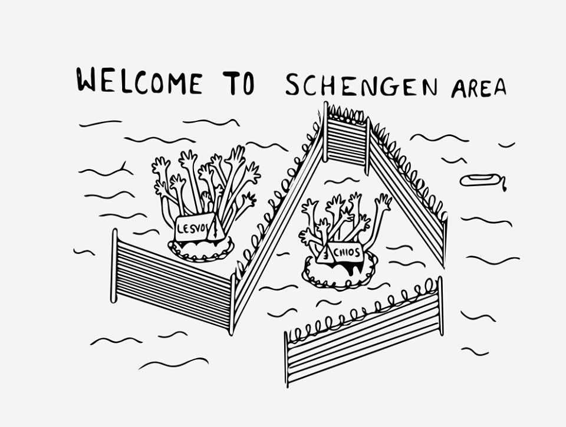
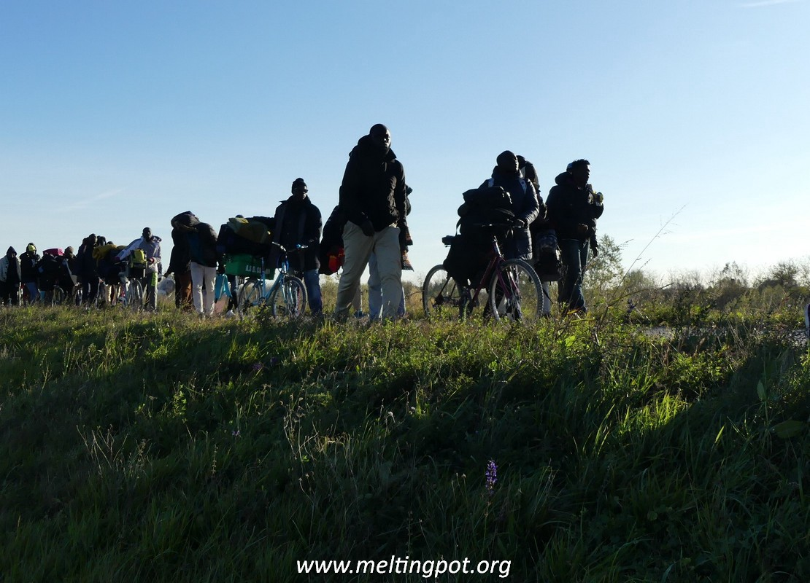
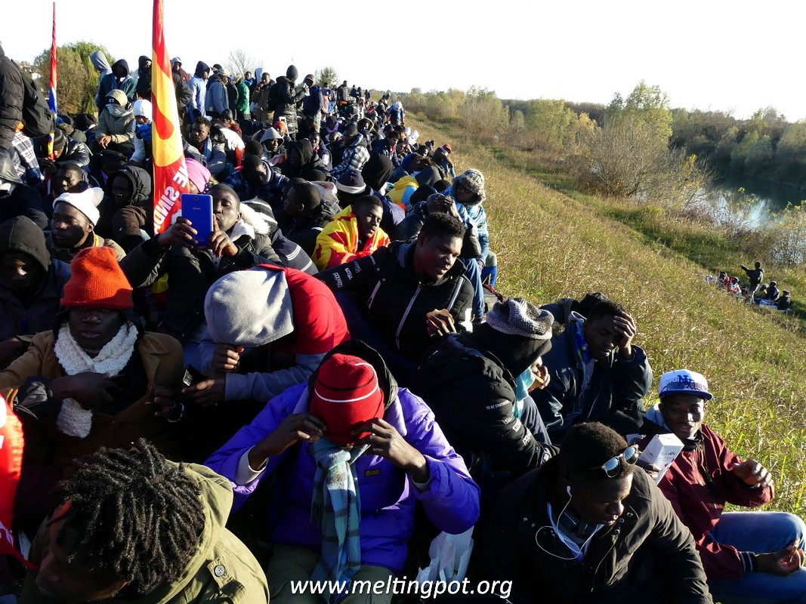
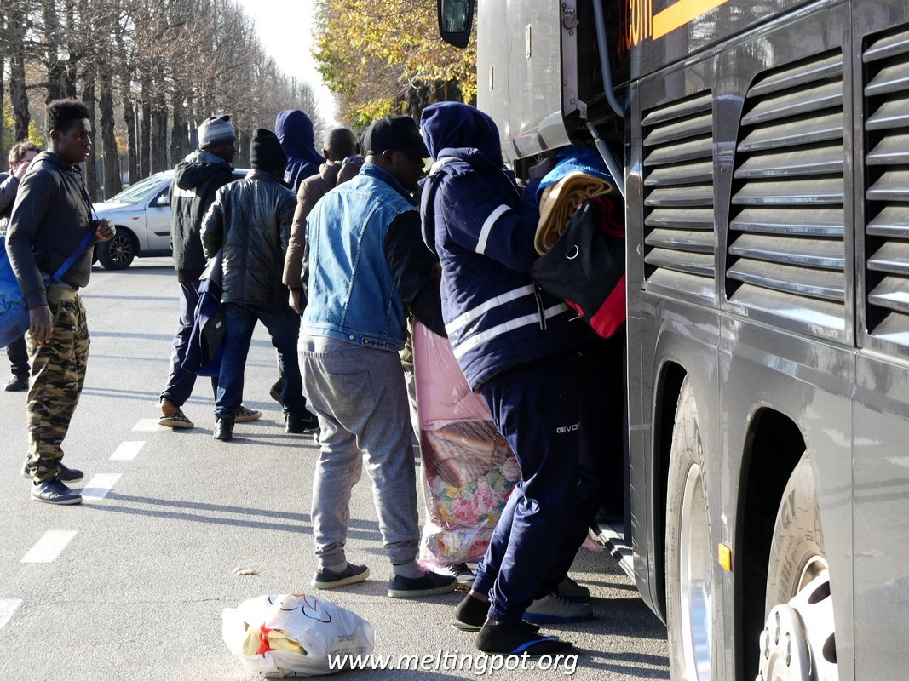
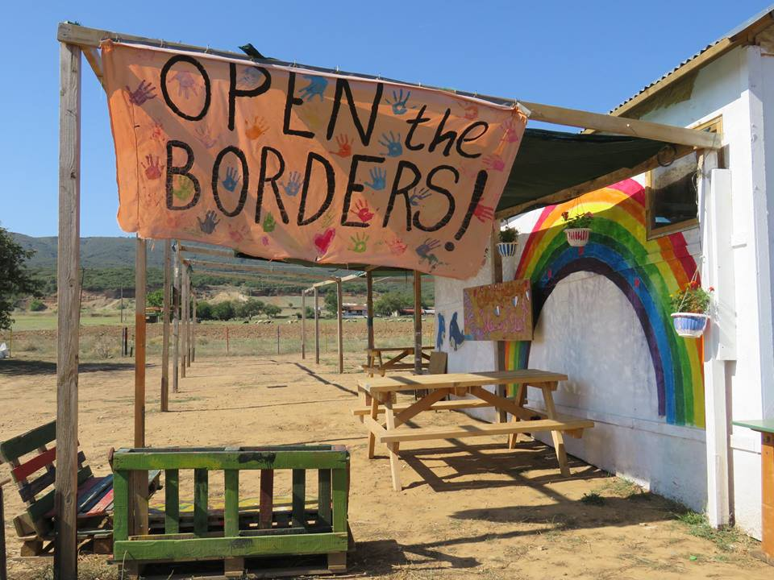
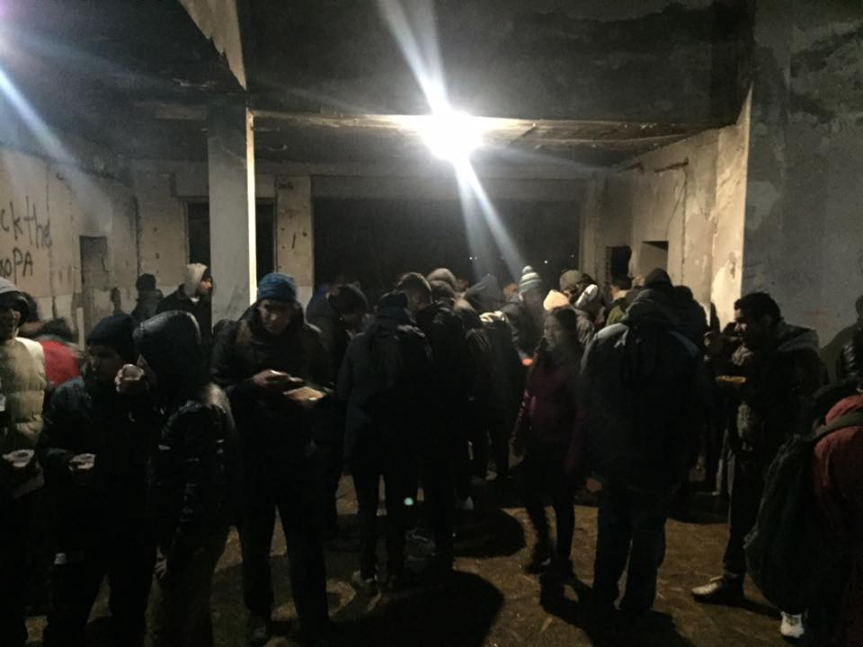
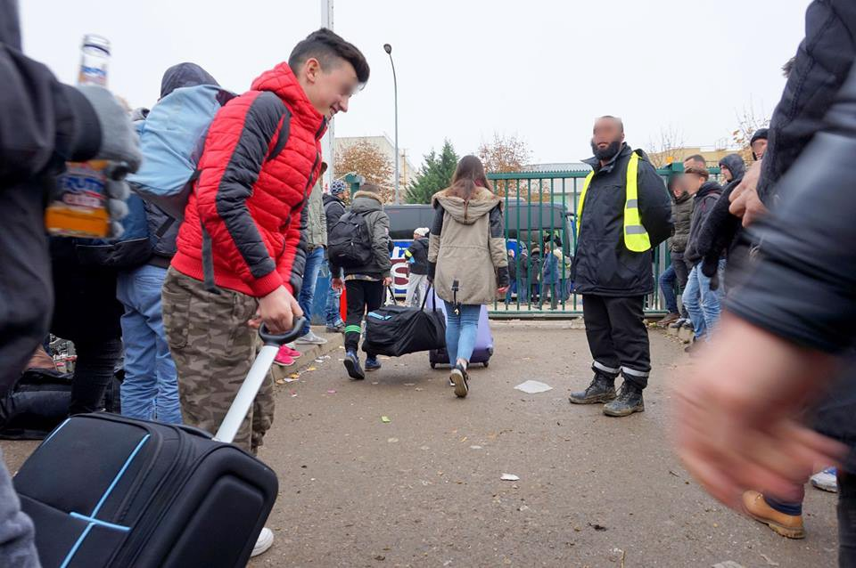
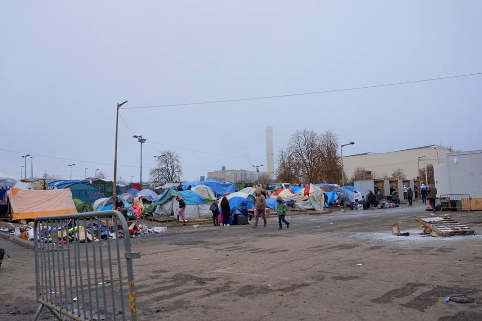

### AYS Digest 17/11/2017 **The march for dignity wins in Venice**

_Civilian casualties in Syria /// Heavy rain endangers lives in camps and towns in Greece /// Data on deportations in Italy and Greece /// Demonstration at Libyan embassy in Paris tomorrow /// Increasing controls at the Austrian/Italian border /// We are here squat evicted in The Netherlands_

\(Photo by Lesvos solidarity — Pikpa\)
#### **Feature: The march for dignity wins in Venice**

As reported in the last two digests \( [15/11](https://medium.com/@AreYouSyrious/ays-daily-digest-15-11-2017-2-years-of-eu-achievements-4833322e7505?source=user_profile---------2----------------) , [16/11](ays-daily-digest-16-11-17-eu-defending-an-outrage-to-the-conscience-of-humanity-3c178b8d9fc4) \), and widely covered by [Progetto Melting Pot Europa](http://www.meltingpot.org/) , refugees hosted in the notorious reception centre in Cona \(in the Veneto region, north\-eastern Italy\) started marching on Tuesday to reach Venice\.

 \(Photos by Carmen Sabello\)](assets/ccc1ffe285ff/1*sLlWL8wS4YGj7MVIz9pwxQ.jpeg)

[Melting Pot Europa](http://www.meltingpot.org/La-marcia-per-la-dignita-e-i-diritti-un-racconto-per.html?var_mode=calcul) \(Photos by Carmen Sabello\)

The march was organised by the same refugees, protesting about the condition of the centre and demanding its closure and the transfer of all the inhabitants to other centres\.

After a first meeting with the Prefect on Wednesday, and two intense days last night they were hosted in the parishes of the area\.

Today their demands were met: they have all been transferred in groups of thirty people to different centres in the region, and 67 of them will stay in the area of Venice\.

](assets/ccc1ffe285ff/1*QitK3vKSlRlaafNI8yHlVw.jpeg)

[Melting Pot Europa](http://www.meltingpot.org/Richiedenti-asilo-di-Cona-trasferiti-nei-centri-d.html)

The march for dignity — as it was named — was the first crack in the system of Italian reception _mega\-centres_ , which have been plagued by abuses and mismanagement\.

**Syria**
#### Civilian casualties in Syria

There have been many attacks on civilians in the last days\. [Syrian Network for Human Rights](http://sn4hr.org/blog/2017/11/18/snhr-documented-moment-friday-november-17-2017-killing-15-civilians/) reports that 15 people — 3 children, 1 woman, and 11 men were killed today by Syrian/Russian Alliance forces\. This follows the death of at least 43 people in Atareb Market in Aleppo on Monday\. The [Violations Documentation Centre in Syria](http://vdc-sy.net/market-massacre-is-a-war-crime-syrian-civil-society/) supports the call for further investigation by the international community\.

_Syrian civil society representatives are calling for:_

_1\.A UN\-led investigation of the Arateb market massacre, including the identification of the perpetrators of the attack;_

_2\.Immediate, continuous access by international, independent monitors to all de\-escalation zones, to ensure civilians are adequately protected;_

_3\.The UN and Member States to break the sieges across Syria and deliver cross\-line assistance as needed;_

_4\.Accountability for war crimes and crimes against humanity, including through a Special Tribunal for Syria supported by the General Assembly\._

Of those who have died in attacks in Douma, in the countryside near Damascus, 3 were volunteers with Support Syria Civil Defence\. Some other members of their team were injured\. Their jobs are particularly dangerous as they save those that are injured by air strikes and bombs\.

[Help Refugees](https://web.facebook.com/HelpRefugeesUK/posts/521866794840665?hc_location=ufi) , who sent 12 ambulances to search and rescue volunteers in Syria, have been asked by one of the Syria Civil Defence volunteers to raise awareness of the situation with EU governments and members of European Parliament\.

_Call for the international community to stop letting this continue\! Please find your MEP and take action here: [http://www\.europarl\.europa\.eu/meps/en/map\.html](http://www.europarl.europa.eu/meps/en/map.html)_

**Greece**
#### Arrivals

Lesvos — 1st boat 31 people arrived on the South Coast

Chios — 1st boat 52 people — 26 men, 16 women, 11 children

[No Borders](https://web.facebook.com/nobordersnetwork/posts/1567306050003948?hc_location=ufi) reports that 456 refugees have arrived on the northern Aegean islands in the last 48 hours\. Lesvos — 310 people, Chios — 111 people, Samos 35 people\. In addition to the arrivals mentioned above\.

A total of 2,055 refugees arrived in the northern Aegean from November 1st: 1310 in Lesvos, 596 in Chios and 149 in Samos\.
#### Registrations \(Official\) 16\.11\.17

Lesbos 149

Chios 111

Total 260

The total for November is more than 2000 now\. Despite the rough weather people still cross\. There were 469 new registrations on 15th and 16th November\.

Transfers: 23
#### Deportations

No Borders has also compiled a list of deportations and arrests:

4,133 refugees were arrested in October in 87 different incidents\. A total of 20 people were deported from Lesvos to Turkey yesterday, 16th of November: 18 men,1 woman,1 child\. Of these, 5 were from Iraq, 3 from Pakistan, 3 from Afghanistan, 2 from Cameroon, 1 from Algeria, 1 from Iran, 1 from Tunisia, 1 from Guinea, 1 from Nigeria, 1 from Morocco and 1 from Burkina Faso\.

Deportations for other dates:

12/11/2017 > 6

13/11/2017 > 16

14/11/2017 > 17
#### Lesvos

■■■■■■■■■■■■■■ 
> **[City Plaza Squat](https://twitter.com/sol2refugees) @ Twitter Says:** 

> > #Moria #HotSpot in #Lesvos #Greece: This is how it looks the condition of 1000s of #refugees inside tents without mercy. Photos by @[moutafis77](https://twitter.com/moutafis77) &amp; @[rspaegean](https://twitter.com/rspaegean) https://t.co/oXdFg2vnkp 

> **Tweeted at [2017-11-17 21:20:11](https://twitter.com/sol2refugees/status/931633088542765058).** 

■■■■■■■■■■■■■■ 

#### 30th day of the protest in Sappho Square

](assets/ccc1ffe285ff/1*nfXATzxaJR5WhbqxbZ1nvw.jpeg)

[1951RefugeeConvention](https://web.facebook.com/1951RefugeeConvention/)

All the members of the hunger strike have lost significant amounts of weight and there are concerns for their welfare\. Read a full report on the hunger strikers’ health [here](https://web.facebook.com/arashampay/posts/547732755572815) \.

\#opentheislands

■■■■■■■■■■■■■■ 
> **[Derek Gatopoulos](https://twitter.com/dgatopoulos) @ Twitter Says:** 

> > Lesbos mayor says EU policy creating "island prisons" - calls strike, protests for Monday 
[apnews.com/d934089ace8446…](https://www.apnews.com/d934089ace8446c0b381bf7fc653b910/Greek-island-calls-strike-against-EU-refugee-policy)

#Greece https://t.co/aywCysCTOw 

> **Tweeted at [2017-11-17 16:31:11](https://twitter.com/dgatopoulos/status/931560359793528832).** 

■■■■■■■■■■■■■■ 

**Chios**
#### Heavy rain affects VIAL hotspot

■■■■■■■■■■■■■■ 
> **[Եհҽմɾցíɑ_ցօҽԵíɑ ⛧](https://twitter.com/Theurgia_Goetia) @ Twitter Says:** 

> > Some photos from VIAL hotspot aka detention center of #Chios after the heavy rain.
#Refugeesgr https://t.co/1I1gHWAxeT 

> **Tweeted at [2017-11-17 21:05:23](https://twitter.com/theurgia_goetia/status/931629362314727426).** 

■■■■■■■■■■■■■■ 

 on Twitter](assets/ccc1ffe285ff/1*yN-OqXdldsRqzkIezrIvDA.jpeg)

Contact [Theurgia\_Goetia](https://twitter.com/Theurgia_Goetia) on Twitter

**Mainland**
#### [Pampiraiki](https://web.facebook.com/groups/PAMPIRAIKI/permalink/551564168521025/) call out for support in flood zone of Attica\.

> Emergency\! For Western Attica 

> We are trying to establish contact with solidarity structures or voluntary organisations that are active on the ground in support of the flood of Western Attica, to tell us what the needs are in clothes, blankets etc\., so we can send them\. Please let us know by e\-mail at pampiraiki@gmail\.com 6906408586 

> Refugee support initiative 

#### [Lifeguard Hellas](https://web.facebook.com/lifeguardhellas/posts/1556624177718856?hc_location=ufi) are also working to support the people affected by flooding in Attica

> There is a DIRECT need in Mandra for the following: 

> DRY FOOD \(no cooking required\): Cookies, Bread, Canned food, Croissant, Evaporated milk, Food and Milk for Babies from 0–6 years old and all ages, Diapers, Clothes, Galoshes, Socks, Shoes 

> The address to deliver to is Syngrou 180 at the offices of Lifeguard Hellas\. 

> Tel\. Numbers 210–9530177, 6986562769, 6937444507 

**Co\-ordinator needed**

Bê Sînor, Sinatex Cultural Centre, work to provide education and cultural activities for Sinatex Camp\. They are looking for a long term co\-ordinator for approximately 4 months in Northern Greece\. More info on the role and how to apply [here](https://web.facebook.com/besinor/posts/368054250307059?hc_location=ufi) \.

**Italy**
#### **Deportations in Italy**

On Wednesday, the Interior minister Marco Minniti [released data](http://www.camera.it/leg17/410?idSeduta=0886&tipo=stenografico#sed0886.stenografico.tit00060.sub00080) about deportations during 2017, while praising the efficiency of Italian policies\. From the beginning of 2017, 39,634 irregular migrants have been identified \( \+15% compared to the same period in 2016\) and 17,405 have been forced to leave the country \( \+14% compared to 2016\) \. Of these 6\.777 were repatriated or re\-admitted to their country of origin\.

The number of decrees of accompanied expulsions rose to 93 \( \+40%\), connected to anti\-terrorism and national security provisions\.

> “An effective repatriation policy can’t disregard an international activity, aimed at the establishment of deals and operative protocols with the countries of origin and passage of migrants\. Italy and the European Union have signed deals with more than 20 countries for repatriation purposes\. Moreover, technical agreements for the contrast of irregular migration have been established with third countries: Algeria, Gambia, Ghana, Gibuti, Niger, Nigeria, Senegal and Sudan, and specific initiatives have been taken with Libya, Tunisia, Egypt and Gambia\. At an experimental level, an agreement with Bangladesh has been established in 2017” _\(Minister M\. Minniti\)_ 

Meanwhile, the landings on southern coasts show a decrease since last year \(114,606 from the beginning of 2017, \-31\.47%\) \.
#### **Austrian delegation visit Pordenone**

An Austrian delegation from Bauren Helfen Bauern came today to visit refugees in Pordenone\. While the local administration claims not to have enough funding for a dormitory, they spent 90,000 € for Christmas decorations for the town centre\.

**Spain**

[German media](http://m.dw.com/en/melilla-no-asylum-for-black-men/a-41404179) have written an exposé about the institutional racism suffered by refugees from central and southern African countries when entering Melilla, a Spanish enclave in Northern Africa, and the first point of entry for many on their journey Europe\. Their asylum claims are less likely to be accepted and as a result less people apply for protection leaving them at risk as they have to hide in the surrounding countryside\.

**Serbia**

No Name Kitchen

[No Name Kitchen](https://www.facebook.com/NoNameKitchenBelgrade/posts/428813480850275) are looking for people with medical knowledge and willing to help in Šid \(on the Serbo\-Croatian border\) from January 2018\.

If you’re interested or know anyone who might be, this is your place\!

Get in touch with them [here](https://www.facebook.com/NoNameKitchenBelgrade)

**Austria**

Cargo Train Checks in Brenner Pass

Info Migrants [reports](http://www.infomigrants.net/en/post/6123/at-brenner-pass-anti-migrant-patrols-are-checking-cargo-trains) that Austrian Interior Minister, Wolfgang Sobotka, has announced trilateral checks on cargo trains in the Brenner Pass in the wake of the discovery of Anthony, the young boy found suffering from hypothermia and without his parents earlier this week\. Italian, Austrian and German police will work together to search cargo trains and can also do so on the Italian side of the border\.

Collection in Graz for Gorizia

[Border Crossing Spielfeld](https://web.facebook.com/RefugeesSpielfeld/posts/1953334878260325?hc_location=ufi) ask for support with collection, transport and donations of tents, shoes \(41–43, as sporty and suitable for winter as possible\), sleeping bags and Thermo\-documents, towels, water bottles, food \(only things that are easy to use and long lasting\! \) \. PM them for more info and to support\.

**France**
#### **RESPECTS Campaign**

The [Collectif pour un Nation Refuge](http://www.c-n-r.org/) \(CNR\) published a short movie “Refugiés” as part of their campaign [RESPECTS](http://www.c-n-r.org/le-manifeste-respects/manifesto/) , to raise awareness of the abuse of people in Europe\.

> It doesn’t matter what makes us run away\.
 

>  Fire, war, attacks, famine, natural disasters, any form of rupture that requires a survival reflex\. Being in exile is a survival pathway\.
 

>  We have to escape, right now, without taking anything away from what was our life until then, no matter where\.
 

>  The Walls: those borders that Europe keeps building in defiance of the same values it prides itself on\. The same values on which it lectures other countries \(and on which it goes to war\) \. 

> The walls reveal their cost in human lives: they are a criminal and deadly attitude that stops humans from finding safety\. 

> The closure of borders is likely to kill as many as the disasters that have forced people to flee\. 

> On the other side of these walls, fortresses are erected whether by vox populi or current policies and entire families live between the hammer and the anvil: escape and live as an outcast or stay and risk death\. 

#### **Protest against Libyan embassy in Paris Tomorrow**

The [Collectif contre l’Esclavage et les Camps de Concentration En Libye](https://web.facebook.com/ceccl/) \(CECCL, Collective Against Slavery and Concetration Camps in Libya launched a protest against the Libyan Embassy for tomorrow Saturday 18th November, at 14\.00 h\.

> By financing Libya to stop the emigration of young Africans, U\.E\. is complicit in crimes against humanity\. 

> By its permanent silence, the U\.A is an accomplice of this crime against humanity\. 

> We call everyone to join the mobilization this Saturday 18 November\. 

> **Libyan Embassy, 6–8 rue Chasseloup\-Laubat, 75015 Paris** 

> If you’re not in Paris this week\-end, mobilise at the embassy or consulate in your city\. 

#### Dismantling of Blida camp in Metz

 \)](assets/ccc1ffe285ff/1*99a0rAp-5QNMwBUsb1o6EQ.jpeg)

\#30HeuresDunDémantèlement \(Photo by [Mazou DeMetz](https://web.facebook.com/mazou.demetz?fref=gs&hc_location=group_dialog) \)

\#30HeuresDunDémantèlement \(Photos by Mazou DeMetz\)

On November 15, the French authorities dismantled the [makeshift camp in Blida](https://web.facebook.com/groups/883280335163353/) \. The 830 people living there were taken to different reception centres throughout the country by bus\. Some of them had lived in the camp since it reopened on March 24th 2017\. In 2016 the camp was also closed before winter\.
#### Update from Calais

**Netherlands**
#### We Are Here Squat evicted after a strong day of resistance\.

■■■■■■■■■■■■■■ 
> **[Tessa Neijland](https://twitter.com/Tessaneijland) @ Twitter Says:** 

> > De sfeer is omgeslagen bij de ontruiming van Wij Zijn Hier https://t.co/FQeIW8syWG 

> **Tweeted at [2017-11-17 11:34:56](https://twitter.com/tessaneijland/status/931485803246768128).** 

■■■■■■■■■■■■■■ 

Riot police, horses and arrest vans arrived to break down the fence\. The last people were dragged out of their home by force and at least one person has been arrested\. The building is owned by Arq, ‘experts’ in supporting traumatised refugees\. Some of the people they made homeless today have been receiving support from the organisations Arq work with\. This is the 29th home from which the residents have been evicted\.

As we write they are still looking for a place to sleep and only have a few belongings with them\.

**Sweden**

A fundraiser for [Refugee welcome Sweden](https://web.facebook.com/refugeeswelcomesverige/) started today\. Support them [here](https://web.facebook.com/donate/547730585571887/) \.

> **We strive to echo correct news from the ground through collaboration and fairness\.** 

> **Every effort has been made to credit organizations and individuals with regard to the supply of information, video, and photo material \(in cases where the source wanted to be accredited\) \. Please notify us regarding corrections\.** 

> **If there’s anything you want to share or comment, contact us through Facebook or write to: areyousyrious@gmail\.com** 

_Converted [Medium Post](https://areyousyrious.medium.com/ays-digest-17-11-2017-the-march-for-dignity-wins-in-venice-ccc1ffe285ff) by [ZMediumToMarkdown](https://github.com/ZhgChgLi/ZMediumToMarkdown)._
