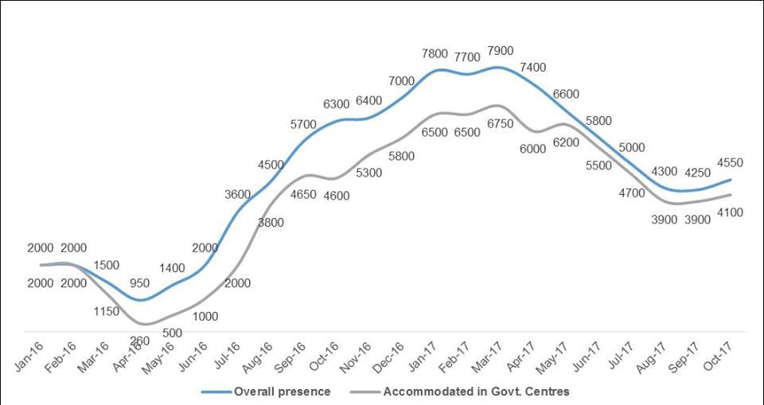

### AYS Daily Digest 19\.11\.17: Police say they are happy to let refugee on hunger strike die

Credit: Claudio Cadei
#### Feature

Today is the fourth day of a hunger strike by Hesam Shaeri Hesari, an Iranian refugee whose asylum application was denied\. Hesam was forced to flee his home country as a result of his political beliefs, and he has good reason to believe that should he return to Iran, he would be persecuted or jailed\. To protest this injustice, Hesam has opted to go on a hunger strike\.

Hesam has been under police custody for the last ten days and is expected to stay there until his deportation to Iran\. Tonight, Hesam was transferred to a hospital\. According to a post by [Arash Hampay](https://www.facebook.com/arashampay/posts/548376988841725) on Facebook\. Hesam was questioned about his refusal to eat\. Hesam replied that, “Until you set me free I will stay on hunger strike, because I didn’t do any crime, and if you deport me I might die there,” to which the policeman replied, “Ok\. So you will die\.” That anybody, let alone a police officer, would respond in such a way is deeply troubling, especially so when the circumstances are taken into account\. There have been numerous cases of refugees attempting suicide after their asylum application was rejected, as happened today when a 29 year old on Rhodes attempted suicide\. As of now there is no information about the person in question, but for those who are familiar with the conditions on the islands cannot say that this comes as a surprise\. Life is very difficult on the islands, with many leading hopeless lives without any assurances of a better future\.

Would they truly allow Hesam to die? This is very unlikely, given the publicity that such a scenario would inevitably attract\. The most likely scenario is that sooner or later, the authorities will demand that Hesam be force\-fed to keep him at the very bare minimum of life\.

We at AYS stand in solidarity with Hesam, as well as with all other refugees who were forced from their homeland and whose life now hangs in the balance as the threat of deportation lingers over their heads\. We hope to see Hesam’s case resolved in his favor, that he is able to continue his life without the lingering threat of imprisonment by the Iranian regime\.
#### SYRIA
### 61 exposed to chemical attack in Eastern Ghouta

The Syrian American Medical Society [has reported that](https://www.sams-usa.net/press_release/suspected-chemical-attack-east-ghouta-read-statement/) a chemical attack has hurt numerous residents of Eastern Ghouta in the aftermath of an artillery strike\. 15 of the exposed required hospitalization, 11 of them under the care of SAMS\. The exact composition of the weapon is unknown, but the victims responded to treatments against phosphorous compounds\. Eastern Ghouta has been heavily targeted by the Assad regime, and there are currently 450 people who are in need of an urgent medical evacuation, and medical supplies have run out and cannot be imported as a result of the siege instituted by the government\. Food is also incredibly scarce, with 72% of children under the age of 5 experiencing malnutrition\.
#### GREECE
### 29 year old refugee on Rhodes attempts suicide
### Protest scheduled in Lesvos for November 20, right wingers to hold counter\-protest

On November 20, starting from 5pm, people on Lesvos will hold a demonstration in Mitylini against the EU’s and UN’s numerous failures to commit their obligations towards refugees\. The main demand of the protesters is that the islands be opened to allow refugees, who have been stranded in the islands for months, to move to the mainland\. Anti\-refugee right\-wingers, as well as the mayor of Mytilini will hold an event earlier in the day against the presence of refugees on Lesvos and in Greece more generally\.
### Moria continues to be unsuited for winter weather

A resident of the family section of Moria has posted a video of the present conditions in Moria\. The video shows flimsy summer tents which are not at all suited for the cold weather beginning to rear its head\. It has rained on Lesvos for the last two days, and tonight there is a thunderstorm\. The camp is completely unprepared for the challenges of winter, and unless the authorities begin to act now, it is probable that many people will end up sick, hurt, or, worst of all, dead as a result of cold\-related problems\.

Another refugee has also sent in a video showing the condition of the tent, inhabited by four families, is in\. The tent is open and it is quite cold within\. Just outside of the entrance is a constant stream of water\. The man, a father caring for his three young children and his niece, pleads for help from anybody who would listen to him\.

### Dinner in Samos provides an embarrassing look at the current state of affairs

Refugees in Samos tonight went away without a hot meal\. A photo submitted by a refugees shows the contents of the dinner as follows: two eggs, a tomato, cheese, a slice of bread, olives, and cake\. Refugees do not expect to be served lobster and truffles, but this strange and low\-effort motley of food is unlikely to fulfill a person’s dietary needs\.

### Rescue Crew needs volunteers for December 2017 and January 2018

Land Crew plays a vital role in identifying and locating refugee boats and signalling the proper authorities to rescue the people aboard\. They will be needing volunteers for this coming December and January\. For more information, please visit the link below\.

### Humans 4 Humanity needs a volunteer on Lesvos

Humans 4 Humanity need a volunteer to manage its clothing boutique at the House of Humanity on Lesvos\. The person will be responsible for keeping track of the inventory, repacking shelves, identifying low stock items supervising shoppers and checkout\. Please signal your availability by messaging [Humans 4 Humanity’s Facebook page](https://www.facebook.com/Humans4HumanityOrg/?hc_ref=ARS-C_ABK3mmb9eUUuJEkhimd5aNhXkdLIz83J6fKKAV98rAreOA3Ay-VdphjT8oKA8) \.
### New arrivals

Lesvos: 57 people
#### SERBIA

Refugees warm themselves around a fire in Šid\. Photo Credit: Dimitris Tosidis
### UNHCR data shows increasing numbers of refugees in Serbia

According to the UNHCR, as of October 2017 there were 4,550 refugees in Serbia\. Most are housed in centers across the country, however, the data shows that approximately 10% \(450\) of those living in Serbia are currently without shelter\.
### No Name Kitchen is looking for a medical volunteer

The city of Šid, where No Name Kitchen operates, is in need of medical personnel starting from January 2018\. If you or somebody you know can step in, please send them a message via their [Facebook page](https://www.facebook.com/NoNameKitchenBelgrade/?ref=gs&hc_ref=ARTAsV3wAUi2ngZWH94Eh2syaRkZnbo2F2pwn7aYXTuzGGve0bvqxhrgabjUAi50WVs&fref=gs&hc_location=group) \.
#### CROATIA
### AYS van has its windows smashed

The AYS van has been vandalized after our appeal to keep the residents in Zagreb rather than moving them to a motel near the Serbian border\. The police has opened aninvestigation, but we don’t expect much out of it\. We use this vehicle every day to bring both kids and adults from Porin camp to different educational or other activities, to move those who’ve been granted asylum to their new homes, to distribute donations etc\. We are completely paralyzed without it\. If you would like to contribute to repairing the van, please contact us on FB\. We’d really appreciate it\.
#### BELGIUM
### Shelter for refugees of Maximilien Park to open next week

About twenty volunteers have been active since Saturday to equip the soon to be opened shelter with beds and other amenities so that the refugees will no longer have to sleep outdoors\. There is as of now no official date of opening, but the organization working on the shelter, the [Plateforme citoyenne de soutien aux réfugiés Bruxelles,](https://www.facebook.com/plateformerefugiesbxl/?ref=gs&hc_ref=ARSEUapKNJpu1yl6oK93-50JdtB6tjUwKoRV2qZhko27EO6YPgjULuhMU3A2tj9V6CU&fref=gs&hc_location=group) is asking for additional volunteers to complete the project, so all nearby people are encouraged to contact them\. For volunteering opportunities around Belgium more generally, please be sure to join [BXLRefugees volunteers / bénévoles BXLvolunteers \[OFFICIAL\]](https://www.facebook.com/groups/BXLVolunteers/?ref=gs&fref=gs&hc_location=group) \] \.
#### THE NETHERLANDS
### We Are Here group looks for necessities

The We Are Here group consists of refugee individuals who have found themselves trapped in a legal loophole\. They have been refused asylum in the Netherlands but they also cannot be deported\. Last Friday, 65 of them were evicted from the empty building that they had been squatting in\. Because of their legal status, they have difficulty accessing basic necessities such as housing, food, and basic hygienic needs\. They have found temporary shelter in Amsterdam on Zeeburgerpad 94, but they need donations, namely food items such as rice, potatoes, onions, sugar, tomato concentrate, cooking oil, as well as toilet paper and cleaning products\. If you are in Amsterdam and have the capability to donate to them\.
#### FRANCE
### 6 weeks after evictions, refugees from squat in Rue Gambetta continue to camp outdoors

The encampment continues its existence\. Photo Credit: Francis Voignier

As winter is right around the corner, the refugees evicted from a squat on rue Gambetta 43 days ago continue to camp in the area\. The flimsy tents that the refugees are staying in are poorly insulated and consequently there is no doubt that many of them will become sick\. Meanwhile, the building from which they were evicted continues to be empty, and there is no telling when it will be occupied\. In the meantime people will struggle throughout the winter\.
#### MEDITERRANEAN
### 3 sink while heading to Ceuta

3 refugees have died after falling out of a boat destined for Ceuta\. The 21 survivors on the boat were rescued by the Spanish coastguard\. Ceuta is seen as a desirable destination for many\. The city, located at the northern tip of Africa, is a Spanish territory\. The territory is completely walled off from neighboring Morocco, forcing people to resort to more dangerous means to cross the border\.
### SAR numbers

Two boats carring a total of 99 people were rescued in Alboran, to arrive in Motril\.

Guardamar Caliope has rescued 11 people on a boat 60 miles from Cartagena, headed towards Torrevieja\.

**600 have been rescued by the Spanish coastguard Friday — Saturday**

Approximately 600 refugees have been picked up by the Spanish coastguards in the previous 24 hours, according to a statement made on Saturday\. The number of refugees arriving to Spain has grown recently, as the EU has made the route to Italy much more difficult with the help of militias that have now dubbed themselves a coastguard\. 17,687 have arrived in Spain this year, three times more than in 2016, and the year is still not over\.
### The Algerian coastguard has blocked 286 people from leaving

**_We strive to echo correct news from the ground through collaboration and fairness\._**

**_Every effort has been made to credit organizations and individuals with regard to the supply of information, video, and photo material \(in cases where the source wanted to be accredited\) \. Please notify us regarding corrections\._**

**_If there’s anything you want to share or comment, contact us through Facebook or write to: areyousyrious@gmail\.com_**

_Converted [Medium Post](https://areyousyrious.medium.com/ays-daily-digest-19-11-17-police-say-they-are-happy-to-let-refugee-on-hunger-strike-die-78197c933431) by [ZMediumToMarkdown](https://github.com/ZhgChgLi/ZMediumToMarkdown)._
