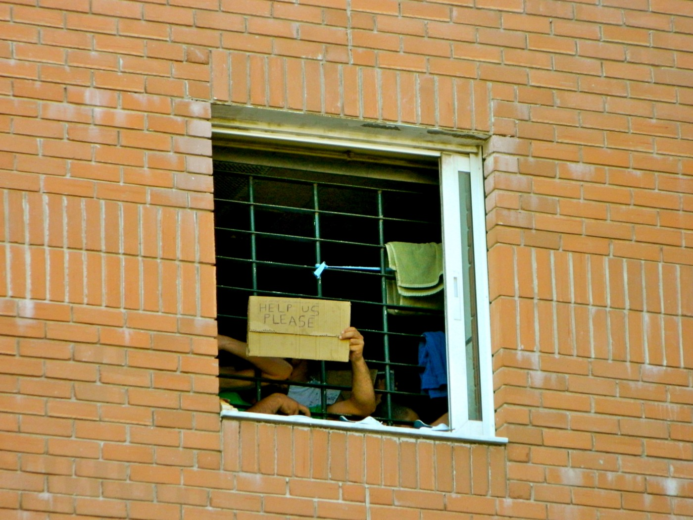
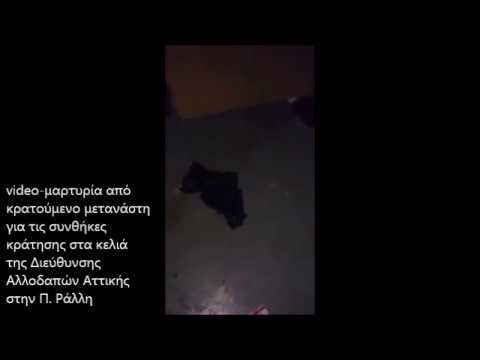
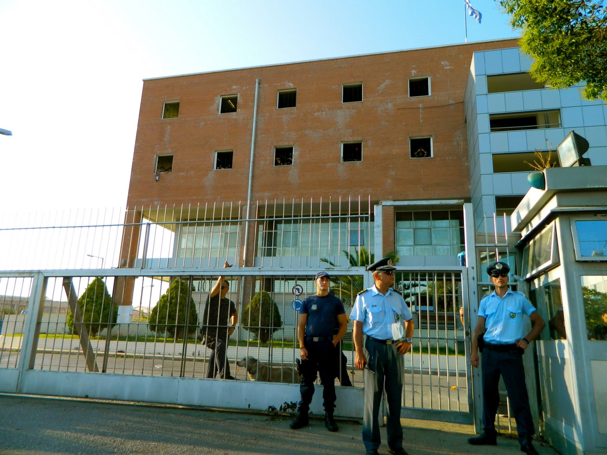

### AYS SPECIAL: The tragic story of 8 Algerian men from Petrou Ralli

_This story of 8 Algerian men is directly connected with two facts: the inhuman living conditions migrants are exposed to in Greek detention centres and their unknown detention status which is completely dependant on police authorities\._

Photo by **Katja Lihtenvalner\.**

_“We demand release of 8 migrants, who were beaten, tortured and arrested with accusation of “revolt” in hell of detention facility Petrou Ralli,”_ was one of the demands [from a group of anarchists](https://athens.indymedia.org/post/1580020/) , who last week occupied the Polytechnic school of Athens, two days before the historic anniversary of the Athens Polytechnic uprising against the military regime of November 17, 1974\.

The story of 8 Algerian men is the latest most significant story of police violence in Greek detention facilities\.

The Council of Europe’s Committee for the Prevention of Torture and Inhuman or Degrading Treatment or Punishment \(CPT\) reported on the mistreatment by the police officers in the Athens based detention facility Petrou Ralli in its [September report](http://www.politico.eu/wp-content/uploads/2017/09/CPT-report.pdf) \. It addresses the authorities to take _“rigorous action to counter acts of ill\-treatment”_ \.
### **Cells in Petrou Ralli “filthy, stuffy and infested”**

CPT, in its report, describes the cells in Petrou Ralli detention facility as “filthy, stuffy and infested”\. Apart from inhuman living conditions police authorities [continue to practice](http://www.aitima.gr/images/pdf/deltiokratisisenglish.pdf) “the use of prolonged detention”, reportedly one year or even more\.

The conditions in Petrou Ralli were well documented [in the video](https://www.youtube.com/watch?v=nkbh-0QOBHk) released after a 45\-year\-old Algerian man died last February\.

This rare piece of evidence shows the kind of conditions of the facilities that migrants in Petrou Ralli are staying in:

The document is shocking\.

_“We asked police more then 4 times to call for a doctor and to help sick migrant\. They denied to help,”_ the migrant in the video describes\. He also adds that ill migrants \(AIDS, hepatitis\) are detained together with migrants who are healthy and as such “at risk”\.
### **What does the police say?**

We asked Greek police authorities for comment and to confirm if the video was really taken in Petrou Ralli detention facility\.

_“Considering the video, it seams that it does show a space, which is very similar to cells on third floor of Petrou Ralli for vulnerable migrants\. The wing is not in use to detain migrants due to lack of lighting and ventilation,”_ was the answer given to us by Greek police authorities\.

They add that for the above mentioned video and the incident in it, \(the death of an Algerian man\) a police investigation was conducted, but is still pending\.

The answers of the police authorities are on the contrary to the released video document and to migrant testimonies\.

The video very clearly shows that migrants are detained in these dark cells: there is a migrant on video, a mattress on the floor and the testimony of the man who took the video\.

Iraqi Kurd Shayan Samad also confirms this [in our report for MEE](http://www.middleeasteye.net/in-depth/features/migrants-greek-detention-facilities-dehumanised-1022874595) \.

_“On the second floor there are a few abandoned, dark, very dirty and smelly cells\. In these cells there are sick migrants,”_ she adds\.

Photo by **Katja Lihtenvalner**
### Brutal police attack

The sick conditions in Petrou Ralli and the prolonged detention without any explanation led a group of men, on 31st of May, to demand answers\. On that morning they demanded to talk with the director of the detention facility\. Most of them were detained in a sick condition for over 8 months without reasonable explanations\.

As the migrants explained to us, police officers answered with the method they usually used: “ _They promised us that next week someone will deal with our status\.”_ Migrants aware of this daily police routine, feeling desperate and anxious, continued to insist on seeing the director of the police detention facility\.

What follows, was one of the most brutal, organised and savage attacks of police officers behind the four walls of a Greek detention facility\.

_“The group of armed police officers entered cells and started to beat us badly,”_ deeply traumatized migrants explained to us after the attack\. The result was broken arm and head injures as “Coordination of the collectives and individuals against detention” \(SSAEKK\) [reports](http://ssaekk.espivblogs.net/2017/07/04/%25ce%25b5%25ce%25bd%25ce%25b7%25ce%25bc%25ce%25b5%25cf%2581%25cf%2589%25cf%2583%25ce%25b7-%25ce%25b3%25ce%25b9%25ce%25b1-%25cf%2584%25ce%25b7%25ce%25bd-%25cf%2585%25cf%2580%25ce%25bf%25ce%25b8%25ce%25b5%25cf%2583%25ce%25b7-%25cf%2584%25cf%2589%25ce%25bd-8-%25ce%25bf%25ce%25b9-%25ce%25ba%25ce%25ac%25ce%25bc%25ce%25b5/) \.

After the attack, the police authorities went further: they arrested 8 Algerian men, and accused them of disobedience and resistance to authorities\. They are keeping them detained in different prisons around Greece\.

Eight Algerian men \(most of them young boys in their 20s\) are now awaiting trial as defendants in the brutal police attack, which nothing but confirms, “the ill\-treatment” criticised by CPT and [reported](https://www.globalresearch.ca/protests-at-greek-detention-camp-highlight-state-violence-against-immigrants-in-europe/5345735) by migrants and human rights organizations in numerous cases\.

Photo by **Katja Lihtenvalner**

_The demands from the group of anarchists, that last week occupied Polytechnic in Athens, were not answered\._

_The 8 Algerian men, victims of a brutal police attack in Petrou Ralli on 31st of May, are still in jail and awaiting trial\._

_The case nothing but confirms that human life in Greek detention facilities is worth less then a speck of dust\. In these migrant prisons inmates are completely dependent on the caprice of sadistic police officers\. And not much was done to stop them\._

\(The question for comments on detention conditions were sent to responsible authorities on 12th of July, 2017\. The police authorities answered on 29th of August, 2017\. \)

**\(By Katja Lihtenvalner, Athens\)**

> **We strive to echo correct news from the ground through collaboration and fairness\.** 

> **If there’s anything you want to share or comment, contact us through Facebook or write to: areyousyrious@gmail\.com** 

_Converted [Medium Post](https://medium.com/are-you-syrious/ays-special-tragic-story-of-8-algerian-men-from-petrou-ralli-719eea82340) by [ZMediumToMarkdown](https://github.com/ZhgChgLi/ZMediumToMarkdown)._
