### AYS Daily Digest 20/11/17: A warning and cry for help from the Aegean
#### tensions rise on the overcrowded underprepared Greek islands / Bulgaria doubles its refusals / Indignation of the refugees in the north of Italy due to unbearable state of the reception centres / The only reliable help in the north of France / Late surge of arrivals from the sea — prison in Spain as a provisional reception centre / Solidarity protest in Berlin / Another suicide in Morton Hall / …

 \)](assets/dde4c88c3529/1*sqoXOYYTRyPupwTD9qbAKA.jpeg)

Children in a refugee camp on a Greek island, November 2017\. They are not playing to live there\. \(Photo taken from: [1951RefugeeConvention](https://www.facebook.com/1951RefugeeConvention/) \)
#### FEATURE

Imprisonment of the people who have managed to survive the perilous journey across the sea and reach the Greek islands, is a constant state they live in, under miserable living conditions\. Their isolation, constant state of dependence and repression they are faced with when trying to challenge or question such inhumane treatment go against everything the EU and the UN claim to stand for\. The official systems seem to have went from supporting such a state that keeps the refugees silent and weak, to sending a message that goes way beyond the EU borders and seas\.

> According to UNHCR data, the current number of refugees in lesvos is 10\.484\., however,the island only has a reception capacity of 1800 under acceptable conditions\.
 

> This situation is aggravated when the Greek government prevents these people from crossing into the Greek Peninsula \(restriction of islands\) until their situation is unregulated, which is against human rights\.
 

> The result of this is that the fields camps and detention centres, such as die, are completely overwhelmed, with the consequence that basic needs, such as food, health and education, are not covered\. — [_Holes in the borders_](https://www.facebook.com/RefugiadosenAtenas/?hc_ref=ARSQifUH1_1q8XXlxCdz5ky5TK9A27PvGxQTpnu7RLNOLALiaCo_NmZJdwqqMoNK07M) 

](assets/dde4c88c3529/1*dD1RJ1Utu_fsP9hVWKWZkQ.jpeg)

by [United Rescue Aid](https://www.facebook.com/unitedrescueaid/)

It has been 20 days since the begining of the hunger strike by a group of refugees on Lesvos, the overcrowded island that keeps receiving more people \(on Monday morning 39 people arrived\) and new ways of handling the situation have not been developed, neither has any serious preparation for the winter there been set in motion\.

> About 7,000 refugees and immigrants from Moria’s camp \(where the housing infrastructure is for 2,200 people while the water and sanitation network for 800\) have woken up in the mud — among them more than 500 children under the age of 10 living in summer tents under the rain\. As it became known, many of the children woke up with fever, after two rainy days now they are wet and live in the mud\. Through social networking pages, doctors are urged to rush to offer their services “in the jungle of Moria”, the so\-called camp, corresponding to that in the French Calais, known as the “Calais jungle” — _from an article in the Greek [press](https://l.facebook.com/l.php?u=http%3A%2F%2Funfollow.com.gr%2Fweb-only%2Flesvos-moria-7-000-prosfiges-xipnisan-mesa-stis-laspes%2F&h=ATOtHviGuJygM96gtywLCfsu9-FPzmF5LWhegeDtz-Qyy3b34GOI3zbV9ogFWLQs8rrAuMLUr5s4uz6Om8p6mt7XeCA4vCqxH38tMKgX1sOFMGtdnD3hfHnkj8iYpWk8njufh-z0p-3q6OoR8KvbxVM22M5Qo_rsrap2HdZqzjr_VihfDJPDa8bZvHxclcavNQLytxZts_Z7qv9HwXZ1des5PXR58pNbgNrGcVSefTSQ2dw2NmCjcD8S8MXZeqbJLIu3lBtlvVFAPLn8qGRELN8JdIZdDeENKoIf7w) , translated by [Sotiris Alexopoulos](https://www.facebook.com/sotiris.alexopoulos1?hc_ref=ARSzVrDRQho1ZVf46aqDgyZurlavNZvJmP53zUv4zuuyxOjiK2xcflrPot0PwS93o9o)_ 

#### [Protests](https://l.facebook.com/l.php?u=https%3A%2F%2Ftwitter.com%2Frspaegean%2Fstatus%2F932616588565647360&h=ATPIc-VYln6UmAi2GJQewoY50Be43xvunhG-nMs7Cz52-jnZ_ppauussPS8mAmAiASN_UBXl0xAw-pcV1ggxKcszYJE5DDc2A7UGpWFNbVW-9u__K5tzlUv4KrV4lVMeD0lYrkNM) and fire broke in Moria camp last night\.

> The trouble started at around midnight when an argument between migrants escalated into a brawl and then into a general riot, resulting in the offices of the United Nations refugee agency and of another aid group on the site being vandalized\. 

> The unrest abated following the intervention of riot police and a local prosecutor at around 4 a\.m\., _media [report](http://www.ekathimerini.com/223450/article/ekathimerini/news/tensions-peak-on-islands-as-migrants-riot-locals-protest)_ 

[")](http://www.youtube.com/watch?v=xxALZwXK87M)

It seems like none of the responsibles in Moria Camp are prepared for any kind of emergency situation or alternative shelters\. Amidst rain and tear gas, several families were brought to the nearby community centre of Humans 4 Humanity\.

■■■■■■■■■■■■■■ 
> **[Michael Räber](https://twitter.com/iwatnew) @ Twitter Says:** 

> > Shots fired at 2am in #EU camp #Moria #Lesvos #Greece. Explosion sounds scare war-torn families. #refugeesGr people injured by protesters stones or police teargas. By now still families waiting outside the gate to be evacuated. #humanrights #EUTurkeyDeal https://t.co/0FKiiYGL50 

> **Tweeted at [2017-11-20 01:30:21](https://twitter.com/iwatnew/status/932420817291489282).** 

■■■■■■■■■■■■■■ 

#### Weather gives the most dangerous of warnings about the situation

Tents on Samos were destroyed by the strong winds, heavy rain and low temperatures so most of the refugees are now without tents\. \.
People, among them many children, have found themselves out in the streets\.

■■■■■■■■■■■■■■ 
> **[Doctor Ahmed](https://twitter.com/DrAhmedKazmi) @ Twitter Says:** 

> > For those wondering what a refugee camp looks like in Europe... yes really #[Refugees](https://twitter.com/Refugees)gr #[Refugees](https://twitter.com/Refugees) @[Refugees](https://twitter.com/Refugees) @[RefugeeAction](https://twitter.com/RefugeeAction) #HumanRights https://t.co/XkQF7hUZyt 

> **Tweeted at [2017-11-20 12:28:32](https://twitter.com/drahmedkazmi/status/932586456429813760).** 

■■■■■■■■■■■■■■ 

■■■■■■■■■■■■■■ 
> **[Caroline Sykes](https://twitter.com/cmn_sykes) @ Twitter Says:** 

> > It's #UniversalChildrensDay today. Protest, tear gas and fire at #Moria camp last night. Meanwhile, the first unaccompanied child from the Greek camps arrives in the UK. 1yr after Govt pledged to accept 100s. We can do so much more #opentheborders #refugeesGR #opentheislands 

> **Tweeted at [2017-11-20 19:00:49](https://twitter.com/cmn_sykes/status/932685177024860161).** 

■■■■■■■■■■■■■■ 

#### MEDITERRANEAN

Bad weather conditions have forced the [Maydayterraneo — Proyecto AitaMari](https://www.facebook.com/MAYDAYTERRANEO/?hc_ref=ARSfF_8xRPN60edsOFbTwdFrnazWiM7jT9esT_uoAHq76vlYQGXhh64XmHdQ7eIqERM&fref=nf) emergency rescue service to land in Tunisia\. They will have to wait for a while before getting back to the rescue zone\.

■■■■■■■■■■■■■■ 
> **[SALVAMENTO MARÍTIMO](https://twitter.com/salvamentogob) @ Twitter Says:** 

> > Buque Clara Campoamor embarca 28 personas rescatadas de 3 pateras por la patrullera Río Guadalentín @[guardiacivil](https://twitter.com/guardiacivil) (11+9) y por la Guardamar Caliope (8) en zona Calblanque. Caliope rescata una cuarta patera a 28 millas SE de #Cartagena con 10 magrebíes adultos https://t.co/rpzP29a13l 

> **Tweeted at [2017-11-20 14:50:24](https://twitter.com/salvamentogob/status/932622159939297280).** 

■■■■■■■■■■■■■■ 

■■■■■■■■■■■■■■ 
> **[SALVAMENTO MARÍTIMO](https://twitter.com/salvamentogob) @ Twitter Says:** 

> > Pesquero Pico Veleta localizó 2ª patera que se buscaba en mar de Alborán. Han rescatado a sus 35 ocupantes, entre ellos 3 mujeres y un menor. Algunos habían caído al agua, pero los pudieron recoger a todos. Después transbordados a Salvamar Spica que los llevará a #Almería. 

> **Tweeted at [2017-11-20 19:55:41](https://twitter.com/salvamentogob/status/932698983444643843).** 

■■■■■■■■■■■■■■ 

#### EU
### Magnifying glass at the EU borders

EU Observer reports that on Monday the EU adopted new rules that will require border guards to register the entry, exit and refusal of entry information of non\-EU nationals crossing the external borders of the Schengen passport\-free area\. The so called “entry\-exit system” is suposedly intended to crack down on those who overstay their visas and improve the fight against terrorism\. The new system will not be in place until 2020\.
#### GREECE
#### Help to fill a container intended for Lesvos — [contact](https://www.facebook.com/leah.wild.106?fref=gs&dti=633458933424233&hc_location=group)

> Food is ridiculously expensive on the Islands
 

> We need a constant supply of baby milk 

> Coffee instant or ground 
 

> Condensed milk
 

> Instant cappuccino
 

> Instant hot chocolate
 

> Lemon juice
 

> Long life milk
 

> Salt,
 

> Sardines
 

> Tea bags
 

> Tinned chick peas
 

> Tinned custard
 

> Tinned green beans
 

> Tinned kidney beans
 

> Tinned mackerel
 

> Tinned pineapple
 

> Tinned sweet corn
 

> Tinned tomatoes
 

> Tinned white beans
 

> Tomato puree
 

> Tuna
 

> Vegetable stock cubes 

> Body lotion
 

> Deodorant
 

> Eye shadow, eyeliner and mascara, lip gloss and lipstick \(non essential but the women often ask and it’s so nice to give them something that makes them feel good\)
 

> Face cream for women
 

> Hair gel for men \(for the same reason as above\)
 

> Shampoo
 

> Shower gel
 

> Vaseline 

> Underwear and socks all ages and genders 

> Clothing needs
 

> men’s shoes, men’s jackets, men’s trousers in smaller sizes, men’s sweatshirts, hoodies and long sleeved t\-shirts, hats scarves and gloves mostly men’s, rucksacks, sleeping bags 

### The Greek locals also protest

Residents of Lesvos went on strike on Monday to protest against European policies they say have turned it into a “prison” for migrants and refugees, Ekathimerini reports\. 
The Greek government and the EU have so far ignored pleas from the mayors of Lesvos, Chios, Samos, Leros and Kos, to allow more refugees to travel to the Greek mainland, resulting in major overcrowding at the island facilities\.
In their protest, the islanders shut businesses, shops, municipal offices, nurseries and pharmacies and dozens rallied on a central square, calling on the government to transfer asylum\-seekers to the mainland\.

The main demand of the islanders is to “unblock the approximately 8,500 refugees and migrants living in structures in Mytilene area of 32,000 inhabitants”\.

> Immediately release all those people who are entrapped in Lesvos and live in miserable conditions\. Lesvos is not an open prison, nor will anyone be allowed to see it as such\. 

### Greek law regulates the detention of asylum seekers

According to the law, an asylum seeker should not be detained for the sole reason of seeking international protection or having entered and/or stayed in the country irregularly\. Read more [**here**](https://www.facebook.com/notes/refucomm/spotlight-on-detention-in-greece/529787747373032/) \.
#### BULGARIA
### Less asylum seekers, harder conditions and more refusals

This year, about 3400 people had been newly registered, had sought protection and more than 12 000 decisions had been issued regarding the overall number of applications\.Refusals to grant refugee or humanitarian status have doubled, refugees agency head said to the official Bulgarian [media](http://sofiaglobe.com/2017/11/20/number-of-non-eu-nationals-seeking-protection-in-bulgaria-has-dropped-fivefold-refugee-agency-head-2/) \.

> A person given refugee status has a deadline of two weeks to leave the refugee centre, and is expected to find work and start earning a living\. 

#### SERBIA

[BelgrAid](https://www.facebook.com/belgraid/?hc_ref=ARRBToF04n5_MJnoEBDXWph0QacrpeIo5Tf0wahwsHXCKpnTxipMe4GLCWlpoDEXkm0&fref=nf) team is looking for volunteers to join them working in food service\. If you have such experience and/or would like to help out, please email them at: volunteer@belgraid\.org

 , the community garden of Belgrade\. This Saturday 25th of november, we will garden together and prepare the plot for the winter\. It’s an excellent chance to meet people, we will have food together and a small party\. We are meeting in the morning and go to the garden together\. If you want to come, please contact Cesar on \+381 61 16 57 048 \(Also whatsapp\) \. We hope to see you there\!” — [Refugee Aid Serbia](https://www.facebook.com/refugeeaidserbia/?ref=gs&fref=gs&hc_location=group_dialog)](assets/dde4c88c3529/1*TzTukb-4KymcqNiwSSy29g.png)

“ To all our refugee friends in Serbia, this Saturday we are launching our gardening project\! RAS got allocated a plot in [Baštalište](https://www.facebook.com/Bastaliste/?fref=gs&hc_location=group_dialog) , the community garden of Belgrade\. This Saturday 25th of november, we will garden together and prepare the plot for the winter\. It’s an excellent chance to meet people, we will have food together and a small party\. We are meeting in the morning and go to the garden together\. If you want to come, please contact Cesar on \+381 61 16 57 048 \(Also whatsapp\) \. We hope to see you there\!” — [Refugee Aid Serbia](https://www.facebook.com/refugeeaidserbia/?ref=gs&fref=gs&hc_location=group_dialog)

[The Workshop: Belgrade](https://www.facebook.com/theworkshopbelgrade/) is a joint project by [NorthStar](https://www.facebook.com/NorthStarSerbia/?fref=mentions) and [Refugee Aid Serbia](https://www.facebook.com/refugeeaidserbia/?fref=mentions) \. At the Workshop, they provide Art, English, Math, German, and Serbian classes for asylum seekers residing in Belgrade\.

> We are open from 2–7pm Monday\-Friday\. If you are interested in attending classes or volunteering with us, please send us a message\! 

#### ITALY
### Sleeping rough ahead of the worsening weather conditions — help needed

Refugees in the north of Italy are experiencing a very harsh reality, both in the woods, streets and road tunnels where some are sleeping rough, but also in what was meant to be reception centres\.
A number of people who arrived by sea and were later on settled in some of the centres for the first reception have later on entered some of the other facilities \(as a part of the official reception programs or independently\) and in the end ended up outside again, while the others had been living in other EU member states, where their asylum claim was denied and they came to Italy to try again\. Many are different, yet similar stories of suffering and struggle to obtain a _status_ considered worthy of care and respect by the system\.

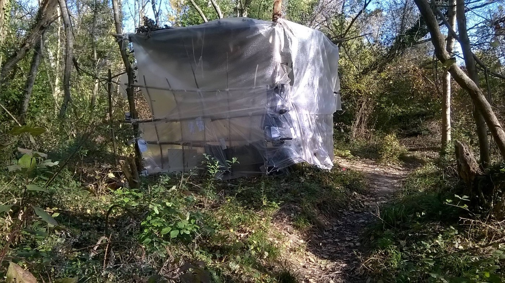

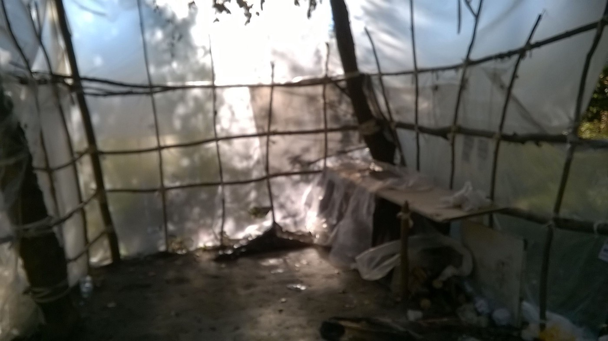

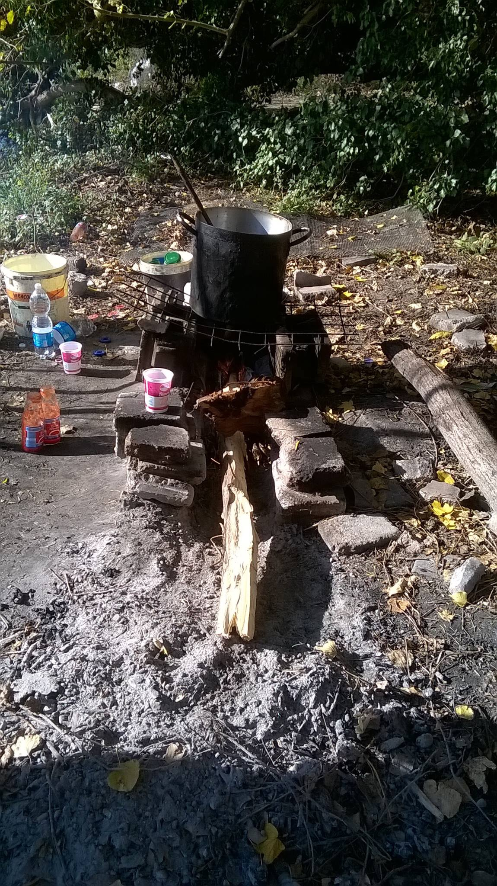

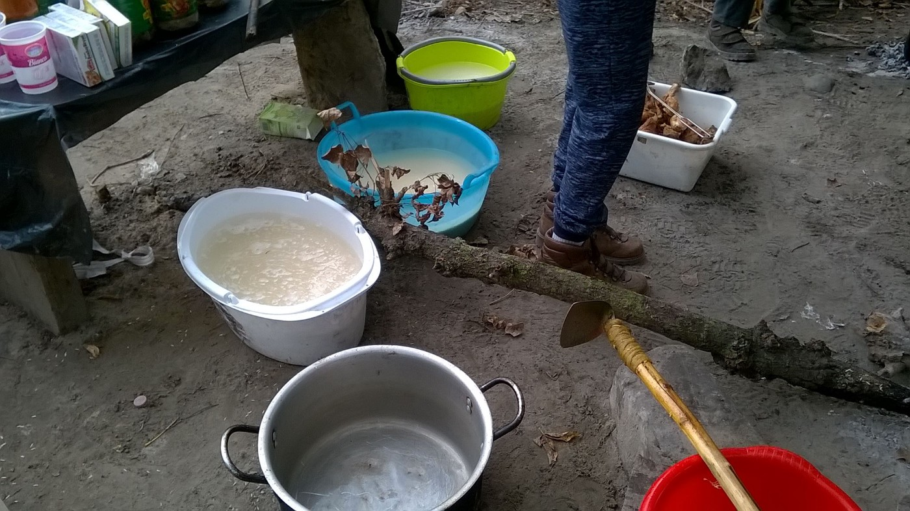

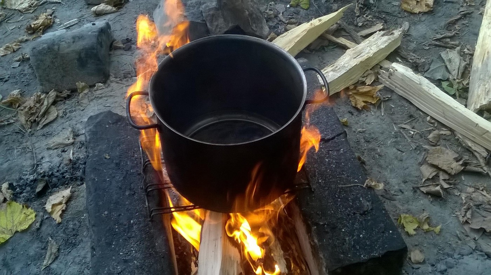

Gorizia, area close to the border with Slovenia \(Photos: Mauro Chiarabba\)

Volunteer groups from the region, backed by international volunteers who recently started helping more often in the area, are all struggling to provide at least the basic amenities to the stranded refugees\.
They need and accept help, but before any possible action you and your group might plan, please refer to their lists and recommendation and always contact some of the volunteer groups from the area so as to help in the best possible way\. Some recommendations you should consider before planning a trip and bringing help to any of the places in the area can be found [here](http://www.umino.org/projects/gorizia_pordenone/Recommendations.pdf) \.
### Forgotten at the reception centres

Most of the rooms are without heating and the facility is largely with no hot water\. Food is always the problem, as the local volunteer groups report and refugees confirm\.

> Some rooms without glass windows, there is no hot water to wash, there is no heating, many bathrooms are as in the photos\. 

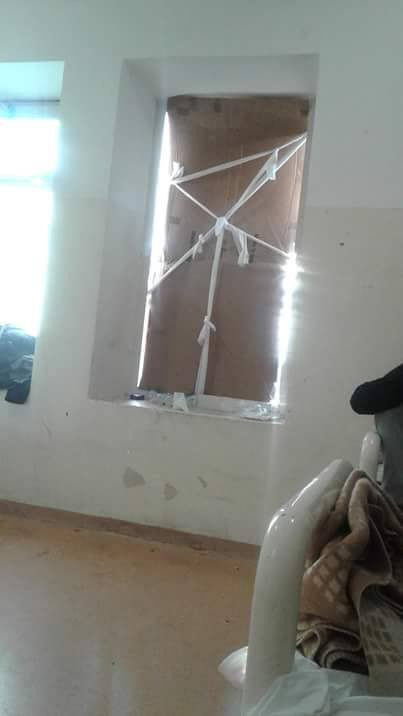

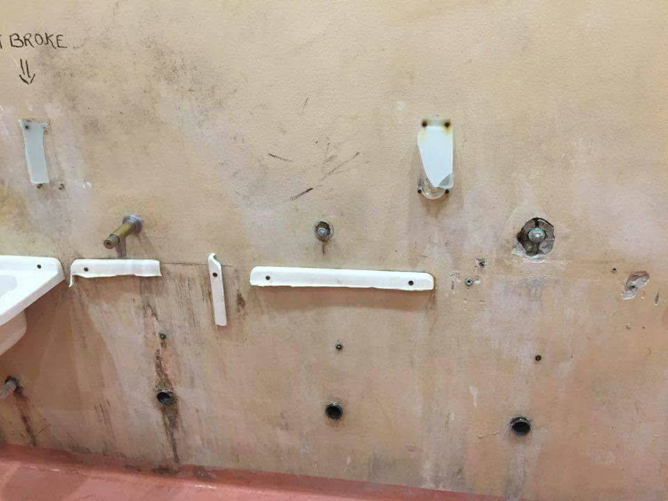

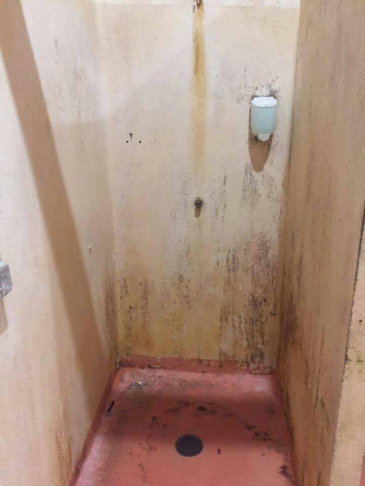

Photos: Mauro Chiarabba

Food is one of the main problems as well\. Volunteers report that both in

Gorizia \(the photo of pasta portions given to the residents of Nazarene centre\) and in other centres the food is the same and not nearly good enough in quality or quantity to suffice and be given as a daily meal, so the groups providing food in these areas struggle with that as well\.

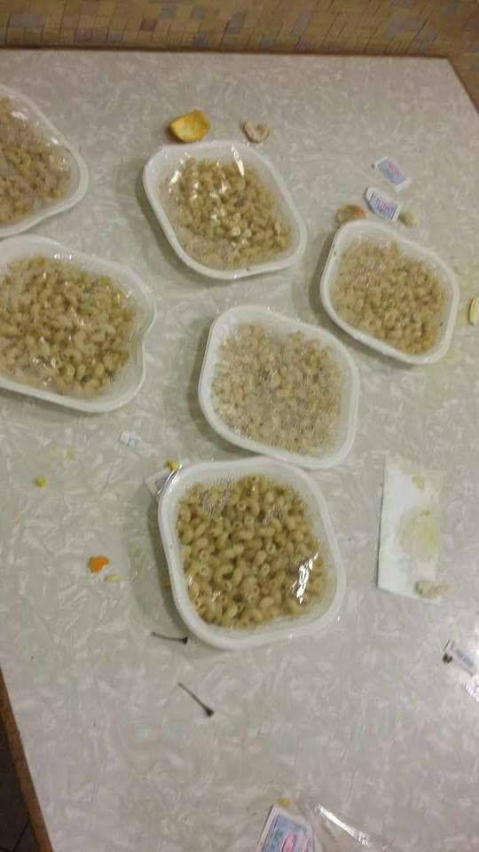

#### Desperation driving refugees in the streets

Local volunteers posted a video earlier today documenting a march of approximately 50 refugees who have been staying in the reception centre in Cona for a while now\. They left the centre due to poor conditions of the facility and were walking towards Piove di Sacco\. Describing the conditions in the reception centre, an abandoned former military base in Conetta, they said they prefer staying outside than in the facility, mentioning also the food as one of the problems \(according to them, rice is all they ever get\) \.

The local mayor has [reportedly](http://www.tgcom24.mediaset.it/cronaca/cona-la-rivolta-dei-migranti-meglio-in-strada-che-in-quel-centro-accoglienza-_3107491-201702a.shtml) said that all they live there is a situation of suffering and a poor life, both for the approximately 1200 refugees and for the 160 local residents\.
#### SPAIN

■■■■■■■■■■■■■■ 
> **[Sergio Rodrigo](https://twitter.com/SRodrigoruiz) @ Twitter Says:** 

> > Este es el "Centro" donde #España va a encerrar a los 500 migrantes. Una cárcel pendiente de ser abierta por problemas de acceso al agua potable https://t.co/zLdkMZkTP7 

> **Tweeted at [2017-11-20 14:41:14](https://twitter.com/srodrigoruiz/status/932619849708265474).** 

■■■■■■■■■■■■■■ 

The Spanish Government has decided to transfer 519 recently arrived migrants who have arrived to Cartagena earlier on 49 vessels\. More than 900 people have arrived since last Thursday\. The photos show the facility in Archidona where the people who have fled their countries are supposed to be lodged, as in a provisional CIE centre\. It is a prison whose opening has reportedly been delayed due to access problems and the lack of drinking water\.
The 37 people who had declared themselves minors in the age from 14 to 17 have been transfered to a facility for minors El Peñasco in the coastal area of Mazarrón, where their age is to be determined\.
#### FRANCE
### Support the group and individual efforts in Calais and Dunkirk

Refugees in Calais and Dunkirk are going through a really difficult period, getting worse by the day as the winter draws near, no permanent solution is in sight and constant raids and tough police presence is a daily routine\. They mostly rely literally on the ‘kindness of strangers’ through the solid and consistent support that volunteer groups provide in different ways\. 
Here are a few:
#### Food

The [Refugee Community Kitchen](https://www.facebook.com/refugeeCkitchen/) are providing over 2,500 meals a day and have been the only regular source of cooked food for the refugees in the north of France\. They need support to keep going:

 so that we can keep serving nourishing meals to people in need\!” — RCK](assets/dde4c88c3529/1*hczUCMtUKeVsCke0WBAgGg.jpeg)

“Every day we use: 75–100kg Dried Beans/Pulses
180kg Basmati Rice or Pasta or 250kg Potatoes
150kg Onions
5kg Garlic
5kg Ginger
30L Sunflower Oil
5L Olive Oil
8kg Spices & chilli
100kg Salad Veg
100kg Veg \+ Potatoes for Curry — That’s A LOT of food\! Please [share & give what you can](http://bit.ly/rckdonate) so that we can keep serving nourishing meals to people in need\!” — RCK
#### Health

People sleeping rough and facing \(yet another\) winter outside in the cold undoubtedly suffer additionally a number of health problems and their already existing conditions are usually not being treated for months while on the way\. Volunteer medical teams and doctors who have worked with refugees along the way confirm that a number of recurring infections and chronic diseases, including a lot of dental problems and pain are among the most common conditions they treat\. 
Here’s a recent feedback from a group health professionals who provide First Aid in the unrecognized refugee camps of the Dunkirk and Calais area:

> Taking teeth out in the cold is not nice at all
 

> Just got back from France Dunkirk
 

> The situation there is a 5 stars hotel if you are asking 
 

> Couldn’t even operate from a caravan as the police keep moving them
 

> So we had to set up somewhere where the crowd is
 

> So desperate families still live in tents in this horrible weather
 

> You can see that I was freezing by just standing there and seriously I don’t know how they can do it 

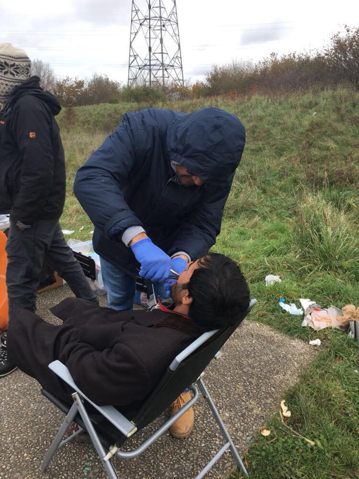

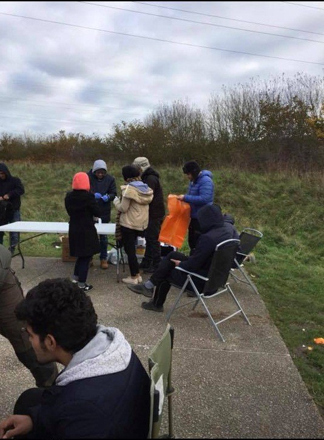

](assets/dde4c88c3529/1*QhUBFtvF06o642-iARGJZw.jpeg)

Photos and quoted comment: [Raid Ali](https://www.facebook.com/raid.abdul)
#### Connecting

> Isolated, not speaking the language, tired and poorly informed, the refugees need to fight a really strong psychological stress they are facing\. 
 

> Because we believe that talking to people, surfing the internet, getting to know their rights or amusing themselves for some time is just as important as having food, we need your [support to continue](https://www.gofundme.com/calais-infobus) the project Good Vibes InfoBus\.
 

>  — [_L’Auberge des Migrants_](https://www.facebook.com/LAuberge-des-Migrants-358496450338/) 

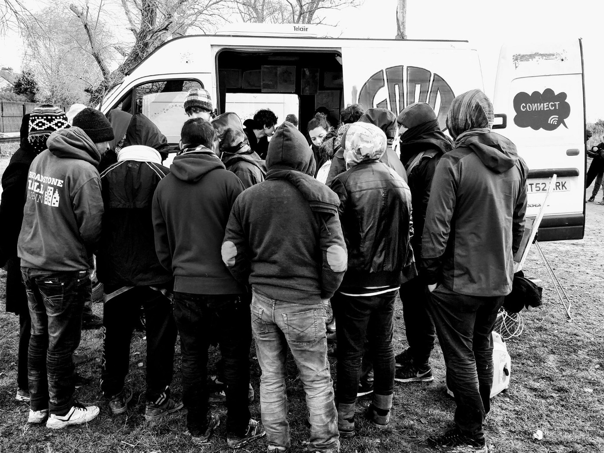

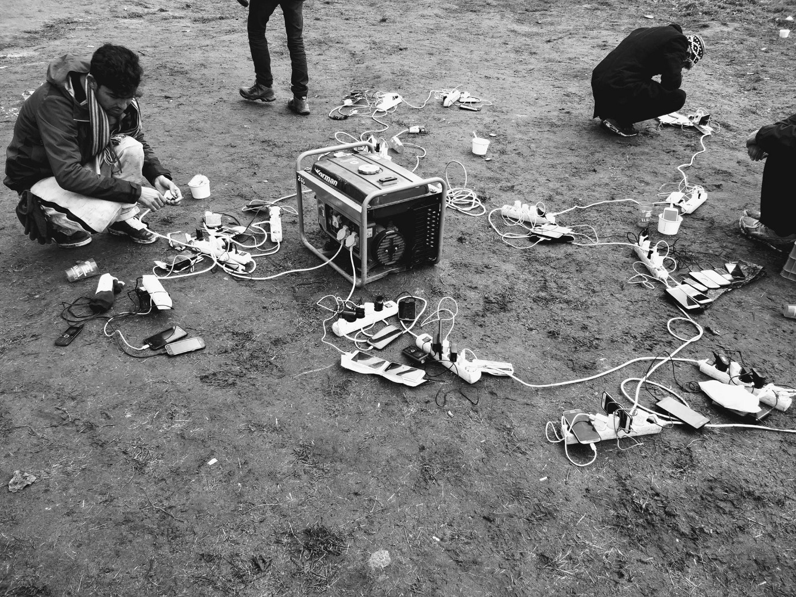

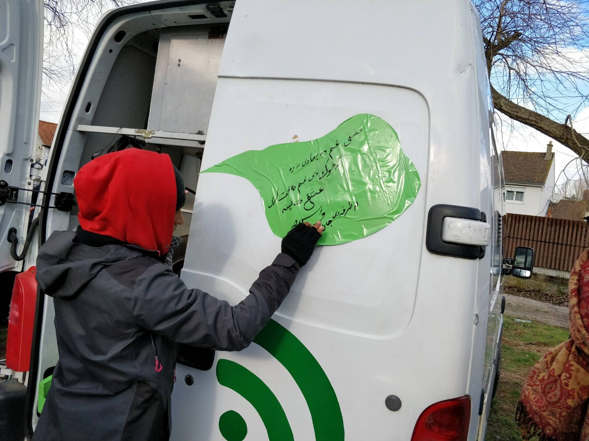

](assets/dde4c88c3529/1*yQ25S3GRN-SboY-CxiPZ5A.jpeg)

Photos: [L’Auberge des Migrants](https://www.facebook.com/LAuberge-des-Migrants-358496450338/)
#### BELGIUM

[Plateforme citoyenne de soutien aux réfugiés Bruxelles](https://www.facebook.com/plateformerefugiesbxl/?hc_ref=ARQcyQeVW0GnqmGYS5hm_bXABnFefxPaKloFA7h_8YIqO6mVkdgOGkeHN3i0MmlfRhU) is planing to set up showers for the refugees in Brussels and they are inviting people to join the [facebook group](https://www.facebook.com/groups/hebergementplateformecitoyenne) and [donate for the cause](https://www.facebook.com/plateformerefugiesbxl/posts/538410789831221) so everyone can be a part of the civil answer to the general ignorance of the officials who seem to have denied public funds for this particular purpose\.
#### GERMANY
### Protest in Berlin

Tomorrow, Tuesday 21/11, from 16h/4pm, a protest will be held in Belin, near the Brandemburg gate

The organizers have formed their solidarity protest to demand:
Implementation of the relocation and ensuring family reunification
Solidarity with the hunger strikers in Athens
No deportations to Turkey
Fighting causes of the forced migrations, not the refugees
#### UK
### Another suicide at Morton Hall

An emergency vigil will be held tomorrow, Tuesday 21/11, at the Home Office in Glasgow following the news that a man has taken his own life in the detention/removal centre\. Unfortunately, the [inquiries prompted by such horrific events](https://l.facebook.com/l.php?u=https%3A%2F%2Fwww.theguardian.com%2Fuk-news%2F2017%2Fnov%2F20%2Ffourth-death-at-lincoln-immigration-removal-centre-prompts-inquiry&h=ATP5MAg4wQTrLfLl_HOfOUUz0pJetVAA0koum3eixvQLXVO7HowrPAxymbWjaWH2OVjtRTgvt13p4NTmHTv_mR1oy_0zm13O2zrULFJyoSomKov0KZJasxfrSU5Q0tJu-6rHCQFGKC75BEqdrX8hW78Vuk5AumNRrEBRWwzEDqDAp0-tpWwS_HnH1tIXVDCBGMOZyo5X5dCqUYjC086blsTXZZKrheSa__gWZd8YUisOHAGdagdteJ4fwU-o3pl6Cjl-CfbxoqS1Btg2qAIJ-_ZNcrJ490rVfTcdCw) usually lead nowhere and fail to hold anyone accountable, so more and more people feel the need and responsibility to raise their voice and raise awareness\. Join them in protest:

Earlier this year, we wrote about the serious shortcomings of the UK refugee and asylum seekers’ reception and detention system, specifically on the [example of the Morton Hall](ays-daily-digest-21-03-2017-failure-of-institutions-puts-children-in-jail-for-weeks-8156fe4f0f85) Immigration Removal centre in Lincolnshire\. 
As we mentioned back then, there were clear evidence of very bad mental issues among the residents as nearly half the detainees told the inspectors they felt depressed or suicidal on arriving at Morton Hall\.

**_We strive to echo correct news from the ground through collaboration and fairness\._**

**_Every effort has been made to credit organizations and individuals with regard to the supply of information, video, and photo material \(in cases where the source wanted to be accredited\) \. Please notify us regarding corrections\._**

**_If there’s anything you want to share or comment, contact us through Facebook or write to: areyousyrious@gmail\.com_**

_Converted [Medium Post](https://areyousyrious.medium.com/ays-daily-digest-20-11-17-a-warning-and-cry-for-help-from-the-aegean-dde4c88c3529) by [ZMediumToMarkdown](https://github.com/ZhgChgLi/ZMediumToMarkdown)._
