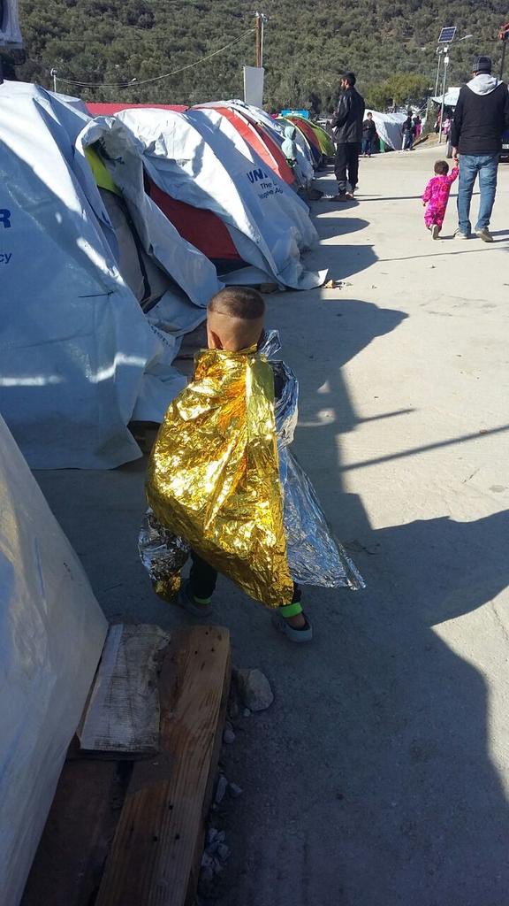
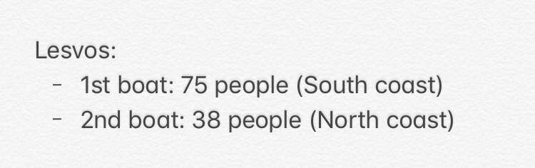

### AYS DAILY DIGEST 22/11/2017: Another child, another victim of this Fortress Europe
#### A 6 year old girl is the latest victim of this closed border policy / Clashes between refugees and far right activists in Lesvos / 20 organisations are sending Tsipras an Open Letter to demand the transfer of refugees from the islands / Video series to inform migrants on various rumours / Twitter campaign needed to raise awareness on conditions in Lavrio / Rumours on the closure of the Galleria Bombi in Gorizia / France urged UN Security Council to meet and discuss the slave trade in Libya / Donations needed in Paris / Hundreds of people rescued in the Mediterranean / More news from Croatia, Slovenia, Italy, Spain\. \.

Credit: MSF Sea

**FEATURE** :

As AYS [reported](https://www.facebook.com/areyousyrious/posts/915264668622417?hc_location=ufi) a few hours ago

HAVE ACTIONS TAKEN BY THE CROATIAN POLICE RESULTED IN THE DEATH OF A LITTLE GIRL RIGHT AT THE SERBIAN BORDER?

Information on the tragic passing of a six\-year old girl on the train tracks near the Šid\-Tovarnik border crossing have been reaching us since early this morning\.

Testimonies from volunteers and people who were in the vicinity of the accident claim that the Afghan family, together with other refugees, was pushed back by the police from Croatia immediately before the tragedy occurred\. According to their accounts, the little daughter of the Afghan family was hit by a freight train mere meters from the point where the pushback occurred\. It appears that the Croatian police let the family back into Croatian territory, only to expel them from the country once again in the morning\.

Following the aforementioned testimonies, we appeal to the Ministry of Interior of the Republic of Croatia to conduct an urgent investigation in order to determine the circumstances of the case and preserve the reputation of the institutions of the Republic of Croatia\.

Many renowned organisations, including Doctors Without Borders, UNHCR, ECRE, as well as foreign journalists, have reported on the systematic illegal pushbacks of refugees from our country, the majority of which happened at the exact spot where the tragedy occurred\.

Doctors Without Borders [data](https://twitter.com/MSF_Sea/status/933377291769597954) speaks of 7 deaths occurring on the border between Croatia and Serbia, and three out of those who died were children\. This is a direct result of closed border policies and the systematic denial of the right to seek international protection in the Republic of Croatia\.

This tragic event serves as another reminder that domestic and international laws stipulate that the right to seek international protection \(asylum or subsidiary protection\) in the territory of Croatia belongs to any human being who needs it, but this right is being systematically denied, further endangering the lives and wellbeing of the already vulnerable refugee population\.

If there was a way to prevent this horrific tragedy, and if illegal conduct by the Croatian police occurred, we expect the most severe sanctions for the perpetrators\.

Journalist colleagues, please reach out to us at: [areyousyrious@gmail\.com](http://areyousyrious@gmail.com) if you want more information on the illegal pushbacks of refugees from the Republic of Croatia, as well as on this specific case\.

**GREECE**

_Lesvos_

**Arrivals**

Credit: Erik Gerhardsson

**Registrations and transfers**

No new registrations, 61 people transferred to mainland\.

Following what [we reported](ays-daily-digest-21-11-2017-brutality-in-italian-reception-centres-2de4e4aaa72b) yesterday in regards to the increasing pressure to end the hunger strike in Mytiline, this morning members of police forces arrested and used violence against refugees protesting in Sappho Square, as [reported](https://www.facebook.com/nobordersnetwork/photos/a.660787423989153.1073741828.657905327610696/1571790969555456/?type=3&theater) by NoBorders\. After the initial clashes, refugees again tried to occupy the public space, being surrounded not only by police but also by members of far right movements\. As [stated](http://www.ekathimerini.com/223503/article/ekathimerini/news/tension-breaks-out-in-lesvos-public-square-over-protesting-afghans) by Ekathimerini, these last ones were also pushing around journalists reporting on the hunger strike and almost started a fight with volunteers who were there defending the migrants’s right to protest\. The newspaper reports that migrants have been moved to PIKPA until their applications will be reviewed to determine whether it is possible for them to be transferred to the mainland\.

In a [post](https://www.facebook.com/arashampay/posts/550030872009670) , Arash Hampay connects what happened yesterday to today’s event in this way: _“Yesterday, the bombers???? contacted me and told me that the head of the police, who came to negotiate with the protesters’ representative, claimed to have information that the [\#fascists](https://www.facebook.com/hashtag/fascists?source=feed_text) want to attack us today — the day after the mayor supported the departure of refugees from the island\!_

_They asked us to clear the square and stop the protest and the sit\-in, and said that if we disagree with the opposition then we must not continue to sit down but we must remove our tents — because they made the city look ugly\!_

_The talks were long, and there were several fascist attacks on the refugees and refugee supporters in front of the police, the mayor, the head of the judiciary and the head of the police, but finally, through discussions with the head of the judiciary and the mayor and the head of the police, we concluded that the tents would be removed and that we would cancel the protests for two days\. However, if they do not release …\. …\. until the time of his death and the protesters do not receive a letter of permission for departure from Lesvos or [\#Greece](https://www.facebook.com/hashtag/greece?source=feed_text) , we will continue our protests and strikes again\._

_Unfortunately, last night, we met the mayor and head of the police, Baulin Badakoy\. They settled the refugees outside the city of Mitylini in a shelter for refugee, but in very dirty tents\. ?????,,_

_That night, we again returned to the Mitlyini Square to [\#protest](https://www.facebook.com/hashtag/protest?source=feed_text) , but we were met with a lot of riot police who did not allow us to sit in the square\._

_We will come back today to sit down and continue our peaceful protests, and I hope that the [\#police](https://www.facebook.com/hashtag/police?source=feed_text) will not abuse us again\._

[_\#refugees_](https://www.facebook.com/hashtag/refugees?source=feed_text)

[_\#freedom_](https://www.facebook.com/hashtag/freedom?source=feed_text)

[_\#opentheislands_](https://www.facebook.com/hashtag/opentheislands?source=feed_text) _”_

_Samos_

[Volunteers](https://www.facebook.com/groups/greecevolinfopoint/permalink/578849049112831/?hc_location=ufi) needed for December and January mainly to take part in offering classes and activities\.

_Mainland_

Open the Islands\!

Another appeal to transfer migrants from the islands to the mainland, as winter is approaching\.

20 organisations, including HRW, Amnesty International and IRC, have issued a joint statement and signed an [open letter](https://www.hrw.org/news/2017/11/22/greece-winter-nears-asylum-seekers-stuck-tents-islands) to Tsipras, PM of Greece, in order to _“protect the human rights of asylum seekers trapped on the islands by ending the containment policy, immediately transferring people to improved conditions on the mainland, and making a commitment to ensure that no one is forced to sleep in a tent”_ \. As Jana Frey, the International Rescue Committee’s country director in Greece, states, _“this remains a matter of life and death”\._

The registration process in Greece is still incredibly slow\. This is increasing the risk of migrants being imprisoned and unable to access proper healthcare and other services that are guaranteed by authorities and some NGOs to only those who are part of the system\. Athens Legal Support Team has just released their 3rd denouncements in a [video](https://vimeo.com/243462941) and they need our support to spread the word\.

Rumours are incredibly dangerous for refugees and displaced people, as they contribute to creating false hopes or spreading panic\. In a series of videos by Refugee Info Bus, called “Let’s Talk”, different rumours affecting migrants’ lives will be discussed every week in order to help clarify doubts\. Please feel free to contact them in case of questions\. This week’s [video](https://www.facebook.com/RefugeeInfoBus/videos/2050162451885839/?hc_location=ufi) concerns the different aspects to be taken into consideration when deciding to leave the islands illegally \(this version is in Farsi\) \.

Twitter campaign needed to support 15 Afghans who are trapped in Lavrio\!

The camp opened over 40 years ago and, at the moment there are 2 families with an infant and some single men residing there\. In this camp, which is forgotten and isolated, the heating oil for hot water ran out last month, meaning no water in the camp, scarse hygienic conditions and no possibilities to wash the baby\.

As it often happens, those responsible \(Ministry of Immigration, Mouzalas, and UNHCR Greece, Philippe Leclerc\) are pretending not to see, demonstrating a lack of capacity of intervention and a negligence to care for those who they are responsible for\.

Some volunteers had the idea to start a Twitter campaign in order to bring to the spotlight this situation; if you can help to set it up, please [get in touch](https://www.facebook.com/photo.php?fbid=10154857009076035&set=gm.1615726975151942&type=3&theater&ifg=1) with them\!

With winter now here cases of hypothermia may increase\. Volunteers need to be aware of how to distinguish the various degrees of hypothermia and the correct treatment to perform\. Please take a careful look at these [guidelines](https://www.facebook.com/groups/informationpointforlesvosvolunteers/permalink/785784724962310/?hc_location=ufi) \.

**CROATIA**

The Croatian Ministry of Social Affairs has asked all national organisations to help with finding accommodation for people that have been granted asylum\.

It will be a 2 year contract and the state of Croatia will be paying rent and all side costs; the price \(the state will pay\) will vary depending on the size of apartment \(market price\), while the expenses won’t include internet, phone and taxes\.

To be eligible to rent your property, you will need to have: proof of ownership, an energy certificate and the apartment should have at least tables, chairs, a bed, wardrobe, oven, bed sheets and towels\.

If you need more info or you’d like to rent a place for refugees, please contact [AYS](https://www.facebook.com/areyousyrious/) directly on Facebook\.

**SLOVENIA**

The Slovenian government had worked hard to allow Ahmad Shamieh, a Syrian refugee, to stay in the country despite Dublin regulations\. Ahmad made incredible efforts to integrate in the community and demonstrative actions by the left\-wing members of parliament took place in order to impede his deportation\. Nevertheless, last Friday, the government didn’t manage to get the consensus necessary to block the order of deportation, condemning Ahmad to an imminent push back to Croatia\.

As Euobserver [states](https://euobserver.com/migration/139958) , this decision has caused chaos in the Slovenian government, and conservative parties are calling for the impeachment of Prime Minister Cerar\.

_“The Shamieh case throws into relief the politics of the EU migration crisis in central and eastern Europe\._

_Slovenia has taken in 335 people from Greece and Italy out of its EU burden\-sharing quota of 567\._

_But several governments in the region — including Austria, the Czech Republic, Poland, and Slovakia — have boycotted the EU scheme in order to court right\-wing votes\._

_They have also stoked public fear over the potential terrorist threat posed by Muslim migrants\.”_

**ITALY**

_Gorizia\._ _The never ending odyssey of the asylum seekers\._

The only shelter for refugees in town, Galleria Bombi, will close down probably at the end of this week, following a decision taken by the local Prefetto\. The question remains of where all these young men will go\. To other cities? Other regions? Will they be able to find a dignified reception somewhere else? Or will they be forced to go back to sleep in the so called Jungle?

Local volunteers told AYS that yesterday a fight took place inside the Cara di Gradisca, 12 asylum seekers were expelled from the centre, 5 slept in the Jungle while others were heading towards the city\.

According to some [sources](https://m.facebook.com/story.php?story_fbid=1363566057104024&id=100003519287251&ref=m_notif&notif_t=group_activity&hc_location=ufi) the local Commission responsible for the asylum process will be moved to other cities in the region, making it even more complicated for the asylum seekers here to be in touch with the relevant authorities\.

In case anyone is still wondering how migrants sleep in Galleria, here is a [video](https://www.facebook.com/cesare.luperto/videos/10212580412520155/?hc_location=ufi) that will help you grasp the conditions\.

Donations that are [most needed](https://www.facebook.com/permalink.php?story_fbid=1559888397437454&id=1245970425495921&hc_location=ufi) in Gorizia with this imminent eviction are: sleeping bags, blankets, igloo tents, men winter shoes \(sizes 41\-44\), underwear size M, winter jackets size S and M, hats, scarves, gloves, socks and good\-to\-eat food\.

_Pordenone\. Solidarity is not a crime\._

18 minutes, 120 people\.

Here is [the face of solidarity](https://www.facebook.com/retesolidalepn/posts/1987098781570938?hc_location=ufi) that we much admire: the solidarity of teachers, doctors, unemployed people, activists, craftsmen, students, artists, common people who are not afraid to shout out against the criminal policies of the local authorities, who are not afraid to help, in whatever way they can, those who have less and are persecuted for the crime of seeking a new life\.

These are the people that defend the dignity and humanity of a city constantly renowned for its fascist policies\.

So thanks to all of you who are out there fighting for solidarity\.

Solidarity is not a crime\.

Italy — Refugee Crisis Database has posted a detailed [list](https://l.facebook.com/l.php?u=https%3A%2F%2Flookaside.fbsbx.com%2Ffile%2FLEGAL%2520SUPPORT.pdf%3Ftoken%3DAWywhfBDEAkue_hQ0mG5PqtbID5MCHtxWfPs49eE3jhF-xxtSVZKIBfcnYs-rvt4xW4E1g-vvI92TB867BR8ZxlNzY2EzxHByiffLXKbSnA3_jVyGKSw55ogXc3CZ0QCoju59DwTQtyIXw9muaJHWvR73japgZSq24agidtgoZz0BoEmqgJYAY1B5WjV4mkdb8YiqRrcH-Uvfr1cdxYBTQCpQwjCwH1gA91GZsSMacUZSA&h=ATN7sBx4-iYGiJB-z6VgeOAM8ByK5Dmy53aB5oGH22exiXexELQBzDi3XePuZIWpOIj9I_5P-w7GMs8xqxK0bdEj7BARiyzCNVmb8QMtCh5rF_TSc9xv5GCh84n1Qk8jmonWbq-qOa-ua4AJ1w) of organisations and help desks which provide legal advice and counselling in the country \(the list is divided per region\) \.

Please read carefully, as some of these organisations are available only for specific users\.

**FRANCE**

President Macron [has called](http://m.france24.com/en/20171122-france-calls-un-security-council-meeting-libya-slave-auctions-macron) for an emergency meeting of the UN Security Council to discuss and find a solution to the Libyan slave trade\.

Macron also stated that the images he saw were disturbing and that slave trade is _“a crime against humanity”_ \.

_“I hope we can go much further in the fight against traffickers who commit such crimes, and cooperate with all the countries in the network to dismantle these networks\.”_

Unfortunately the heavy weight of the European cooperation with Libya in sea missions is not easy to put aside or forget\.

_Calais_

Beautiful words describing a horrible reality\. Read here a volunteer’s testimony\.

The super heroes at RCK have managed, after 6 months of constant work and fundraising, to build a [new kitchen](https://www.facebook.com/groups/CalaisMigrantSolidarityActionFromUK/permalink/1717428171665256/?hc_location=ufi) that is ready to be used\! \! They need any sort of support you can give\.

Donations needed for Paris \(get in touch with Paris Refugees Ground Support\):

\* \* \* \* \* \* Needs list \* \* \* \* \* \* \* \*

_\(THE MOST IMPORTANT ITEMS THROUGHOUT THE WINTER WILL BE SLEEPING BAGS AND BLANKETS\)_

**_\* \*Sleep and cover\* \*_**
- _Blankets \(thick and thin\)_
- _Sleeping bags \(thick and thin\)_
- _Tents \(popups are the best and 1/2/3 man are ideal, but we’ll take any and all\)_
- _Inflatable pillows_
- _Tarpaulins S/M/L_
- _\* \-Backpacks \(Medium\) \*_

**_\* \*Clothing\* \*_**
- _Mens \(S/M\) brand new socks and underwear \(possibly we could make up small packs of just these 2 items?\)_
- _Mens t\-shirts \(S/M\)_
- _Mens tops \(S/M\)_
- _Mens jumpers/hoodies \(S/M\)_
- _Mens trousers/jeans/joggers \(S/M sizes 28" to 34"\)_
- _Mens Shoes and Boots \(sizes 40\-45, especially 42 and 43\)_
- _Mens coats/jackets, preferably good winter quality_
- _Hats_
- _Scarves_
- _\*Gloves\*_
- _Thermal underwear longjohns/vests_
- _Waterproof jackets \(S/M\)_

**_\*Weather protection\*_**
- _Rain ponchos \(by the thousands\)_
- _Foil/Emergency Blankets \( by the thousands \)_

**_\* \*Hygiene \* \*_**
- _Small packs of toothpaste and toothbrush \(in a zip lock bag\)_
- _Small packs of razor, soap or shampoo and deodorant \(in a zip lock bag\)_
- _Small packs of lip balm, vaseline and moisturiser \(in a zip lock bag\)_
- _Small packs of comb, nail file and nail clipper \(in a zip lock bag\)_
- _Tiny LED torches \(keyring/pocket sized\)_

**_\* \*Food packs\* \*_**
- _1 x small bottle of water_
- _1 x small juice carton_
- _1 x ring pull tin of fish_
- _2 x energy/cerial bars_
- _2 x chocolate bars \(Maybe a small pack of nuts\)_

_Yeah, you guessed it, in a zip lock bag_

**_\* \*Flu meds\* \*_**
- _Deodorant_
- _Lip balm_
- _Vaseline_
- _Cold and flu tablets_
- _Beechams_
- _Lemsip_
- _Strepsils_
- _Vitamin C_
- _Multi vitamins_
- _Pocket tissues_
- _Vicks nasal inhalers/rub_
- _Cough syrup_
- _Paracetamol_
- _Berocka_

**_\* \*Other items\* \*_**
- _Phones_
- _Pre\-payed sim cards_
- _Metro tickets_

**SPAIN**

As reaching Fortress Europe via the central Mediterranean route has become more and more difficult, migrants are trying to enter the continent via Ceuta y Melilla and the western Mediterranean\.

Diritti Umani [claims](https://dirittiumani1.blogspot.de/2017/11/sbarchi-record-in-spagna-23187-arrivi.html) that from the beginning of the year until 19 November, 23,187 migrants have arrived in Spanish territories, 19,983 by sea, 3,204 via Ceuta y Melilla; 161 deaths have been reported\.

This represents the biggest number of arrivals since 2006\.

Interesting also to note that, in the first 2 weeks of November boats started to land again at the Canary Islands for the first time in years; with 3 boats carrying 45 migrants from Mauritania and 47 from Senegal\.

**SEA**

Another busy day in the Mediterranean\.

In fact, MSF reports that today 100 people have been rescued in a first operation in collaboration with EUNAVFOR MED\.

■■■■■■■■■■■■■■ 
> **[MSF Sea](https://twitter.com/MSF_Sea) @ Twitter Says:** 

> > BREAKING: The #Aquarius has just completed a rescue of over 100 people in callaboration with a EUNAVFOR MED ship. All are safely on board. https://t.co/DADq6N1Ixc 

> **Tweeted at [2017-11-22 07:58:50](https://twitter.com/msf_sea/status/933243359946194944).** 

■■■■■■■■■■■■■■ 

A second operation saved 108 people, including 13 unaccompanied minors\.

■■■■■■■■■■■■■■ 
> **[MSF Sea](https://twitter.com/MSF_Sea) @ Twitter Says:** 

> > #Aquarius has finished a second rescue of a rubber boat with 108 people - including 13 unaccompained minors. Photo: Fabian Mondl https://t.co/qXjPydaLWL 

> **Tweeted at [2017-11-22 13:34:43](https://twitter.com/msf_sea/status/933327889818365953).** 

■■■■■■■■■■■■■■ 

By early this morning, the Aquarius had a total of [279 people on board](https://l.facebook.com/l.php?u=https%3A%2F%2Ftwitter.com%2FMSF_Sea%2Fstatus%2F933333964399562757&h=ATMcNQHSbM4P3F4M5ibrR6FhkzBK_NZZ-45D7u4Dc4cOx3sw3__qaJEs8Z55iQ84v2sd-dqJo75rkuaGv2SQtgv_BN68hr2d5-U4xP6jY1YDrH9GTY5iHBBZkpykyO-z0cBP0OYQNuCwH1lOkA) , including 66 children and teenagers\. Most of them exhausted and dehydrated but slowly recovering thanks to the efforts and amazing job of the MSF team\.

LIFELINE crew also had an [amazing surprise](https://www.facebook.com/DDBalkanKonvoi/posts/1455336871216405?hc_location=ufi) in one of their rescue operations this morning ❤\. A pregnant woman gave birth in one of the rubber boats\! A total of 177 people have been saved by the NGO\.

Sea\-Watch managed to transfer 177 rescued people to Sea Watch 3\.

■■■■■■■■■■■■■■ 
> **[Sea-Watch](https://twitter.com/seawatchcrew) @ Twitter Says:** 

> > Photos from today´s rescue. Soon we start an operation to transfer 177 ppl from @[SEENOTRETTUNG](https://twitter.com/SEENOTRETTUNG) to Sea Watch 3. #NoSleepTillSafety #SafePassage https://t.co/LLISjTaMCb 

> **Tweeted at [2017-11-22 20:04:19](https://twitter.com/seawatchcrew/status/933425931968024576).** 

■■■■■■■■■■■■■■ 

We will never be grateful enough to these NGOs saving lives at sea\.

**GENERAL**

As we mentioned earlier, rumours are unreliable and dangerous\.

Another rumour to be addressed is the one concerning changes in the Dublin regulation\. Lots of people believe that this change will be beneficiary for migrants, including for example, a new relocation program\. As [reported](https://www.facebook.com/mobileinfoteam/photos/a.1800063030222418.1073741830.1796286800600041/2071370673091651/?type=3&theater) by Mobile Info Team, this is unfortunately not true, as this is currently just a proposal\. Therefore there will be negotiations between the actors involved and the process will take a long time \(years\) before eventually coming into force\. It might, as well, not be favourable to refugees\.

> **_We strive to echo correct news from the ground through collaboration and fairness, so let us know if something you read here isn’t right\._** 

> **_If there’s anything you want to share, contact us on Facebook or write to: areyousyrious@gmail\.com\._** 

_Converted [Medium Post](https://areyousyrious.medium.com/ays-daily-digest-22-11-2017-another-child-another-victim-of-this-fortress-europe-d7cf88505efd) by [ZMediumToMarkdown](https://github.com/ZhgChgLi/ZMediumToMarkdown)._
