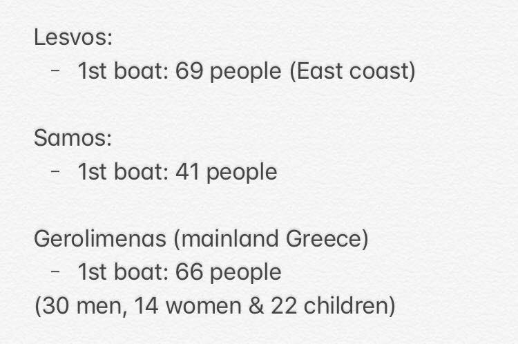
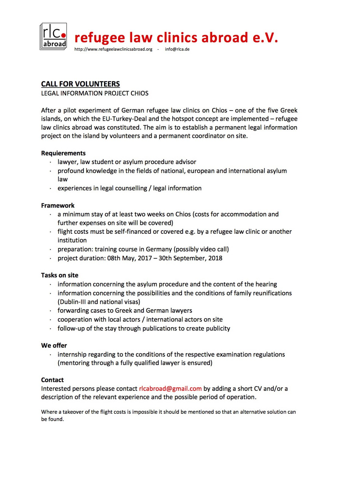
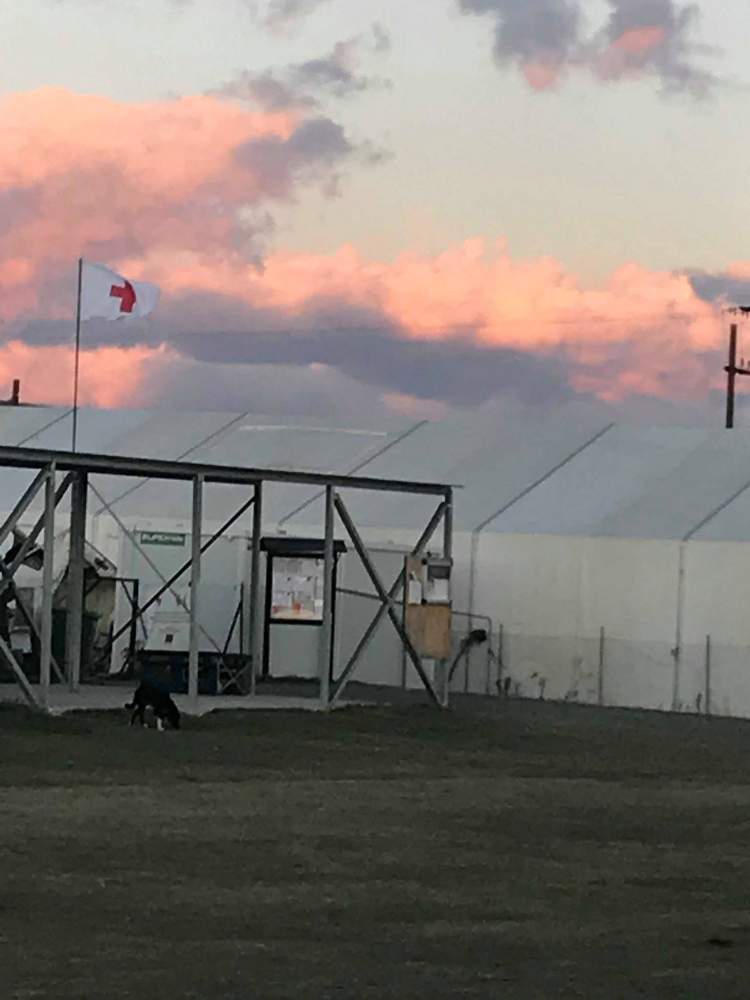

### AYS Daily Digest 23/11/17: Some rescued in the sea, while others die on the land
#### Libyan treatment of people calls for urgent measures / A death in Croatia and in Denmark / Greece needs more people to help / Germany builds up teams for conducting deportations / Refugees in Italy fighting for their rights / Protests announcements / News from Syria, Spain, UK, Turkey …

](assets/3272d3191f77/1*k0Dg_cXluy6mT4v-XYQy_g.jpeg)

SAR mission of a team in the Mediterranean — Photo: [**Maydayterraneo — Proyecto AitaMari**](https://www.facebook.com/MAYDAYTERRANEO/)
#### FEATURE

An urgent meeting Of the United Nation Security Council was called by French foreign minister Jean\-Yves Le Drian to discuss slave\-trade in Libya, InfoMigrants [report](http://www.infomigrants.net/en/post/6211/france-calls-un-security-council-emergency-meeting-over-libya-slave-trading) s\.

This follow the commitment of the French government, expressed on Monday 20th, to welcome 35 refugees evacuated in Libya from Niger\.

Reports on violence, inhuman conditions and slavery in Libya, especially within the detention centres for refugees, are not new\. For the whole year official documents and news reports have highlighted the situation in the country\. Nonetheless EU countries are praising the deal made with Libyan authorities, helping Libya block boats at sea and return migrants to deplorable centres in the crisis\-hit country with no respect for human rights in this matter\.

At the same time, [media reports](https://euobserver.com/migration/139962) reveal that the monitoring system implemented to prevent abuses and rights’ violation during rescue operations of the EU\-trained Libyan coastguard is evidently not working\.

A European Commission spokeswoman told reporters last week that they have yet to receive any reports of abuse — despite video evidence collected by charity NGO boats that suggests otherwise\.

> “If any kind of violence was to be noticed, we would obviously condemn it,” said the spokeswoman\. 

The EU’s Mediterranean flotilla Operation Sophia has trained some 142 Libyan coastguards\. The same coastguard intercepted over 19,000 people trying to cross the Mediterranean since the start of the year\.

A monitoring mechanism in July was set up to make sure the Libyan coastguard adhere to human rights as part of the EU\-run training exercise\.

But in practice, it means getting the Libyans to draft reports about themselves\.

**The European solution — [educating the torturers](https://www.vanguardngr.com/2017/11/eu-step-migrant-rights-training-libyan-coastguard/)**

On the EU side, it means sending experts from Operation Sophia to Tripoli to assess the monitoring but only “when conditions on the ground allow for it”\.

The Sophia operation said last month that the number of migrants setting off for Europe had fallen by 20 percent so far this year, in part because of the support given to the Libyan coastguard — did anyone stop to wonder where the people ended up as a part of the scheme?

> “That is why teams from the European Union, the UN’s refugee agency \(UNHCR\) and the International Organization for Migration \(IOM\) train them to respect human rights and the standards of international humanitarian law,” 

— said the Italian admiral during a seminar on migration and security in Rome\.

■■■■■■■■■■■■■■ 
> **[Apostolis Fotiadis](https://twitter.com/Balkanizator) @ Twitter Says:** 

> > Strong evidence that EU Africa Trust Funds have irregularly been offered to Libyan Coast Guard which failed to observe legal standards, while monitoring from EU is practically a hoax, paints a very dark picture of @[EU_Commission](https://twitter.com/EU_Commission) refugee policy in Libya [euobserver.com/migration/1399…](https://euobserver.com/migration/139962) 

> **Tweeted at [2017-11-23 11:07:00](https://twitter.com/balkanizator/status/933653101705400320).** 

■■■■■■■■■■■■■■ 

#### **SYRIA**

Refugee\.Today reported of A Syrian graveyard found in the Bekaa Valley, in Lebanon, in the small village of Nebaa Faour close to the Syrian border\.

Syrian refugees aren’t allowed to bury their dead ones at the official graveyards by the Lebanese community in the area\. This graveyard was made by the Syrians on a small piece of land\. More than 800 people are buried here often in layers\. Many children and youngsters have ended up in the Lebanese soil at the bed rock of the Anti\-Lebanon Mountains\.
#### TURKEY
### Anti\-terrorist actions put a lot of Central Asians in danger of being deported

After the Turkish police [conduced more than 1,400 raids](http://aa.com.tr/en/todays-headlines/turkey-over-4-800-held-in-1-week-for-terror-drugs/964198) across the country in a single week, 6,890 people were detained for undocumented immigration, and 1,167 for suspicion of belonging to terror groups and little is known about what happens to thousands of those detained\. 
[HarekAct](http://harekact.bordermonitoring.eu/2017/11/23/central-asian-migrants-in-turkey-at-risk-of-being-labelled-as-terrorists/) claims that the media outlets never ran an update on the raid that happened back in 2015, aimed mostly at Uzbeks and Tajiks\. All the campaigns to halt such deportations of people from Central Asia have so far been unsuccessful\. “With Turkey seeking to deal with terror threats itself now, migrants are at risk of being deported over security concerns, and upon return to their home countries, these individuals are at risk of being labelled as extremists by those governments as well\.”

> \(…\) thousands of migrants may be at risk of being forced back home, into the hands of governments who have a history of jailing and torturing political dissidents and alleged religious extremists\. 

#### SEA

1127 people have been saved at the sea by the international search and rescue vessels on Wednesday\.

\. \.news from the SAR teams …

■■■■■■■■■■■■■■ 
> **[Sea-Watch](https://twitter.com/seawatchcrew) @ Twitter Says:** 

> > They left their homes in Syria, Pakistan, Afghanistan, Nigeria or Eritrea: 254 people are onboard the #SeaWatch 3 on their way to the next safe harbor. Civil rescuers have saved many lives yesterday, now we need support from the EU in the Mediterranean: [sea-watch.org/en/massive-res…](https://sea-watch.org/en/massive-rescue-operation-sea-watch-3/) https://t.co/ECnGg2TAa9 

> **Tweeted at [2017-11-23 12:06:19](https://twitter.com/seawatchcrew/status/933668031129182208).** 

■■■■■■■■■■■■■■ 

■■■■■■■■■■■■■■ 
> **[Sea-Watch](https://twitter.com/seawatchcrew) @ Twitter Says:** 

> > This boy was born on a boat. Now, he is spending his second day on earth with the crew of Sea Watch 3. His mother is still too weak so we feed him every 3 hours. #BabyOnBord #LifeIsPrecious https://t.co/OOOpSbFFVd 

> **Tweeted at [2017-11-23 17:39:13](https://twitter.com/seawatchcrew/status/933751807855284230).** 

■■■■■■■■■■■■■■ 

■■■■■■■■■■■■■■ 
> **[SOS Humanity](https://twitter.com/soshumanity_de) @ Twitter Says:** 

> > UPDATE The 108 women, men and children we rescued earlier today were transferred from the #Aquarius to @[openarms_fund](https://twitter.com/openarms_fund) ship along with the body of the deceased woman found by our teams on the rubber boat this morning.

#Aquarius remains in int'l waters off the coast of #Libya. https://t.co/PUgPvQFCoA 

> **Tweeted at [2017-11-23 17:29:59](https://twitter.com/sosmedgermany/status/933749484009525250).** 

■■■■■■■■■■■■■■ 

■■■■■■■■■■■■■■ 
> **[MSF Sea](https://twitter.com/MSF_Sea) @ Twitter Says:** 

> > #Aquarius has rescued 108 men, women &amp; children. Sadly there was one deceased woman - her family told us she died before leaving #Libya https://t.co/lPgCMGPYhY 

> **Tweeted at [2017-11-23 12:07:37](https://twitter.com/msf_sea/status/933668355650801664).** 

■■■■■■■■■■■■■■ 

#### GREECE
#### Arrivals

Three people who arrived on board the boat to Samos have been detained for questioning by the police, so officially 38 were welcomed upon arrival to the island, through 41 landed\.

 have been there for the landing of over 400 of those arrivals\. There are more young people arriving in the boats than ever before, roughly 50% of arrivals that are assisted by Refugee Rescue are children\. Almost every boat has an elderly person, a person with disability or somebody suffering from a chronic condition on board” — Help Refugees](assets/3272d3191f77/1*XaThO5DpI4N28ETMhjRItQ.jpeg)

Over 1000 people have arrived on Lesvos since the beginning of November\. Our partners [Refugee Rescue / ‘Mo Chara’](https://www.facebook.com/RefugeeRescueUK/?fref=mentions) have been there for the landing of over 400 of those arrivals\. There are more young people arriving in the boats than ever before, roughly 50% of arrivals that are assisted by Refugee Rescue are children\. Almost every boat has an elderly person, a person with disability or somebody suffering from a chronic condition on board” — Help Refugees
#### Protest at Sapho Square — update

](assets/3272d3191f77/1*TKhrNkJPc3o-H4_FRn3hlg.jpeg)

Photo: [**No Border Kitchen Lesvos**](https://www.facebook.com/NBKLesvos/)

Please, [read the story](https://www.facebook.com/NBKLesvos/posts/1041812392625216?hc_location=ufi) on how the situation developed and about the intrusion of the “concerned fascist citizens”, by [**No Border Kitchen Lesvos**](https://www.facebook.com/NBKLesvos/)

](assets/3272d3191f77/1*grKaA8Y66Vq9oSO0TTDdQA.jpeg)

Photo: [**Lesvos Solidarity — Pikpa**](https://www.facebook.com/pikpalesvos/)

> After a confrontation with some locals and the police this morning, the protesters from Sapfous Square are currently staying in our Pikpa camp\. 

> The protesters returned to the square this morning, after removing their tents last night following negotiations with the authorities\. They returned without tents, to continue their peaceful protest but were hindered by locals\. The police intervened, by using force against the protesters\. Some protesters were taken to the hospital afterwards to receive medical care\. 

> The protesters were surrounded by riot police in heavy gear for a few hours, while some far\-right elements were verbally attacking both refugees and people from solidarity groups\. 

> The protesters are now staying in Pikpa camp for 3 nights, while waiting for the outcome of the negotiations with the authorities\. The police stays present in Sapfous Square\. — [**Lesvos Solidarity — Pikpa**](https://www.facebook.com/pikpalesvos/) 

### Chios

> We are looking for qualified teachers and youth workers to join our project from December onwards\. 

> We are the the largest voluntary run education service for children and youth stuck on Chios Island, Greece\. At the most basic level, we fulfil a fundamental right of children — to access education\. In Chios, children are continually denied access to the formal education system run by the Greek Government and there are no immediate plans to integrate the children arriving into Europe into the local education system\. 

> Requirements:
 

> \- Experience teaching English either in a formal school setting 
 

> or in non\-formal education settings\.
 

> \- Experience working with youth in either a youth centre, 
 

> summer camps or sport programmes\.
 

> \- Experience in social work
 

> \- Can commit to at least 5 weeks volunteering in Greece\. 

> We provide shared accommodation on the Island\.
 

> _If you fulfill the conditions, please send your CV to nicholas@baas\-schweiz\.ch\._ 

[**Refugee Law Clinics Abroad in Chios**](https://www.facebook.com/rlcabroad/?hc_ref=ARTRNVyD33PkAjNe3KRI79-cQtRjL5uo1f9VjGkuye2SdUaI0Ui2WP5zOU09OP34C38&fref=nf) is looking for volunteers

### Volunteers wanted in many other places

](assets/3272d3191f77/1*gDM17I51bXOmv7ZZClDosw.png)

[**ERCI — Emergency Response Centre International**](https://www.facebook.com/ercintl/)

[Movement On The Ground](https://www.facebook.com/movementontheground/?hc_ref=ARRS8jrho-KbWzr4xZQ0MXW6Pe1yy04RoA4Evm99iqxU0TmrOt95oT_zPszvaBMt8UU) is looking for volunteers to join their team:

> We’re looking for volunteers that are:
 

> \- not afraid of the cold
 

> \- motivated and dedicated to help people that fled war and prosecution
 

> \- Flexible, patient and independent
 

> \- At least 21 years of age
 

> \- Resistant of stress; the conditions in the camp are often challenging, tough & emotional
 

> \- Preferably experienced in structuring and organizing activities in large 
 

> complex groups under challenging circumstances
 

> \- Financially independent
 

> \- available for at least two weeks in the coming month\(s\) 

> Do you fit the profile? Please apply through the form on our website\! [http://movementontheground\.com/volunteers](https://l.facebook.com/l.php?u=http%3A%2F%2Fmovementontheground.com%2Fvolunteers&h=ATNPtrzXvuBPGJvWzrggXeZaxDEIPN7uxx0CGks5Y95bdsFAnbdE2KFw9D3m0DI4LKeDn5lN8ESBxPiUteVGJYnd1bBmTIuY5it46YwL7oLleNN4BHEs8Hi4vILSD0HrODUFX0_EICeiR72E3QTuSkMsGMkwdiTTOGjn6esqA4F2YGbfD4H9SugdLpb3RVK2D_BReguTlWUtDedEJAqPBFrsaQB1mWvE-CsKl--B9aEh4zMW2sfb-TMYr_uA0gPxcVoLhbLqyHwiV8TOvuWAjISq_FKxSgckMPUYeQ) 

](assets/3272d3191f77/1*TeA7k33KUBw6oriyUzVe6w.jpeg)

Photo: [**Dråpen i Havet**](https://www.facebook.com/drapenihavet/?ref=gs&hc_ref=ARSwR7ZISqW9cLNyGu1cDi2xwqIWVct8OzqOe7_DG22_gz2b8RI1fg-9thxwX2P21MU&fref=gs&hc_location=group)
#### Urgent call: Drop in the Ocean is looking for more volunteers for December, minimum stay is 7 days\.

Read more [here\.](https://www.facebook.com/groups/greecevolinfopoint/permalink/579055872425482/?hc_location=ufi)
#### BULGARIA

Along with other official forces in the Ministry of Interior whose role and responsibility will change in large part, Bulgarian Parliament passed amendments to the Interior Ministry Act that would also give the border police directorate of the ministry wider powers to investigate crimes and participate in search operations\.
Another change is to regulate the ministry’s relationship with volunteer associations in cases of emergencies and disasters, the media have [reported](http://sofiaglobe.com/2017/11/23/bulgarian-mps-amend-law-to-expand-border-police-powers/) \.
#### CROATIA
### Another refugee lost his life

A [man was found dead](http://www.novilist.hr/Vijesti/Crna-kronika/Iracanin-pronaden-mrtav-u-Gorskom-kotaru-Umro-je-od-hladnoce) in the forest area near Fužine in the Gorski kotar region, the mountain area of the country\. After conducting an investigation over the death of an Iraqi man, asylum seeker in Croatia, the Croatian authorities have concluded he died of freezing and that there was no criminal background to the story\.
However, as time passes our policies regarding the refugees seem to have had a steep way down, as every several days there is a story, an account or a warning of lives being threatened because of the negligence, lack of political will or simple unprofessional behavior fueled by antagonism, to say the least, towards the fleeing people\.

> Tragic and poor treatment of people does not only happen in Libya, deaths do not only occur in Mediterranean, and everyone of us in the EU should be aware of that\. 

‘Playing ping\-pong’ with people’s lives and fates should not be happening, regardless if that is done by smugglers, activists not taking into account the risk people are sometimes not up to, or the authorities at our borders\. This kind of behavior is resulting with deaths that all the stake holders wash their hands from, even though they are the immediate result or a consequence of the policies and a wrong attitude put into practice and in the field\.

The same field where the [young Afghan girl died on Wednesday\.](https://medium.com/@AreYouSyrious/ays-daily-digest-22-11-2017-another-child-another-victim-of-this-fortress-europe-d7cf88505efd?source=user_profile---------1----------------) 
As everyone seems to want the case to be gone as soon as possible, not much media or official attention has been given to study the circumstances under which the family found themselves walking on the train tracks towards Serbia\. The girl’s funeral will be organized in Šid, as the Serbian side also shares the rug under which they sweep the common unwanted topics\.
#### ITALY
### Asylum seekers of Cona determined to fight for their rights and have their requests heard and dealt with

The latest updates by :

> _22nd November_ 

> 9\.30: after spending the night in Rubano, 54 migrants got on the buses that would take them to Mestre in order to meet with the Prefetto and discuss their requests\. The initial proposal to meet him in a hotel in Mestre was declined, the asylum seekers want to meet the Prefetto in a public space\. 

> 10\.30: the guys are taken to Malcontenta \(Venice\) \. The promise was broken, they were not taken to Mestre\. The Prefetto will meet the guys in this forgotten place\. 

> 11\.00: the meeting starts\. The Prefetto states always the same empty promises: “Go back to Cona, we’re working on emptying the centre\. If you go back, you will not be kicked out the reception system”\. But maybe authorities ignore the fact that these guys will NOT go back to Cona\. They have nothing to lose so they are ready to deal with the consequences their actions\. 

> “We’re human beings, not animals and there you live like in a dump\.” 

> The Prefetto insists on the fact that, if they don’t go back within 2 days, other solution will be decided for them\. 

> 12\.15: after the meeting, the asylum seekers gather to think on the best course of actions 

> 13\.15: they state that they will never go back\. The Prefetto says that there would be renovations in the centre and a better control of the management of Edeco, the cooperative that is in charge of the services there\. The asylum seekers are tired to hear empty promises\. “We risked so much to come here, we went through Libya, we don’t want to live in a pigsty anymore\!” 

[")](http://www.youtube.com/watch?v=WZaj6j58a1o)

> The Prefetto tells them to think about it again, he would come back later\. 

> 16\.50: nothing new comes up\. People are waiting for the Prefetto to come back\. Guys now are in Canevon, a centre around Malcontenta \(Venice\) \. 

> 17\.30: the Prefetto comes back\. He claims that in the next days around 100 asylum seekers will be moved from Cona, in order to allow for renovation works to start\. The guys say they are exhausted, they have been marching during the past days and now they want to rest in Canevon and talk about it the following morning\. 

> 18\.30: the Prefetto agrees on their request to remain in Canevon\. He invites them again to go back to Cona and reassure them that they will not be kicked out the reception system\. While the spokesman draws up their requests \(immediate closure of Cona and Bagnoli and of all the big hubs, transparency and control on the work of the cooperatives, reform of the public calls and restrictions to fundings, better living conditions etc\. \), the Prefetto leaves the premises\. 

> _23rd November \(Malcontenta, Venice\)_ 

> Morning meeting for the asylum seekers\. The Prefetto, Carlo Boffi, and the mayor of Cona, Roberto Panfilio, are both present\. 

> 13\.00: the meeting with the Prefetto starts\. 

> 13\.40: the meeting is suspended \(the proposal of the asylum seekers is met a strong closure by the authorities\) \. They are exhausted\. 

> 19\.15: buses arrive to take the guys to a centre offered by the diocese in the area around Venice\. 

> _24th November_ _\(Spinea, Venice\)_ 

> 9\.00: after spending the night in a centre, the asylum seekers are having breakfast\. 

> 9\.20: Spinea\. A meeting is being held among the asylum seekers\. No decision taken yet\. Last night one of the guys who was hospitalised has gone out of the hospital\. Soon, also the other 2 migrants will be released\. 

> 9\.30: the meeting between the spokespersons of the asylum seekers and the Vicario \(Prefetto’s vice\) of Venice will start soon\. 

> 9\.50: meeting goes on\. Here is the proposal of the Prefetto: 

> \- 100 places granted to leave Cona, priority given to those who have been there the longest and to those who have health issues 

> \- guarantees that private social NGOs will be able to enter the centre \(for example, through the Italian classes\) 

> \- reassures that the Prefettura and UNHCR will visit weekly the centre of Cona\. The Vicario asks for a quick answer, hinting at the possibility to be banned from the reception system in case the answer will take too long\. 

Updates will follow\.
### No slavery and no criminal deals with Libya\!

Today in Rome, **in front of the Libyan Embassy** \(Via Nomentana, 365, 00162 Rome\), a protest against the criminal agreements between EU and Libya is starting at **15:30h / 3\.30 PM\.**

> The slavery we’re talking about in these days in reference to Libya is a widespread phenomenon both in Africa and Italy through old and new forms of slavery\. Examples include the slavery towards black people in some African countries, in Italy the so\-called modern slavery in the countryside through the farmworkers in the agri\-food business as well the movers in the logistic chain\. 

#### SPAIN
### Automatically brought a step closer to be considered criminals

17,687 migrants reached southern Spain by boat between January 1 and November 15, compared to 5,445 during the same period in 2016, IOM has reported\.

A wave of reactions arose after Spanish authorities decided to put the newly arrived refugees to the yet not opened prison facility in the south of the country, that [we reported earlier about](ays-daily-digest-20-11-17-a-warning-and-cry-for-help-from-the-aegean-dde4c88c3529) \.

More than 30 NGOs have denounced these actions as “confinement of people in a penitentiary centre”, media [reported](http://www.euronews.com/2017/11/23/spain-houses-hundreds-of-migrants-in-a-jail) \.

> On Tuesday, a food service had to be urgently called in order to provide meals to the new guests and the mayor of Archidona told the Spanish national EL Pais that the centre does not yet have drinking water\. 
 

> The security team is made up of 52 voluntary agents who were conjured up in all urgency last Monday 

#### GERMANY

Germany plans to deport 78 Afghans on December 6\. 
The federal police is therefore looking among its staff for people with valid visas for Afghanistan\. According to the media, they don’t seem to have enough people \- at the same time, there is a scheduled deportation flight to Pakistan\.
#### DENMARK
### Death under the police pressure

A man about to be deported has [reportedly died](https://l.facebook.com/l.php?u=https%3A%2F%2Fekstrabladet.dk%2F112%2Fmand-doed-efter-kamp-i-koebenhavns-lufthavn-politiet-var-meget-barske%2F6929384&h=ATOOeQloDMrLut2GPu-8GG-x-T2ypzxXUZPC7quU0UKI85Vu19DA3gDQCsheLA7HVbgwS1Hc7DydyyGduXFIpldKqFkDSJe6v62tpsTRzDjB087a6EBtT4OI_jHyWKu3owotMZOHpVBqNaqKYZIVNt6fHGBXAG6pvOkcJCH7i89MJ3Y5Xdo_K5oL8d46Zdvq6dsvVRiW_dYII4t33TWkPWBT1vt2SnyMLfMHwOMjZGIWwIXCJWNACvfMcq-3l1xnxxfasdq44ep_D75_EMLx4a4xcCY) after struggle with the police at the Copenhagen airport\. 
The same media source has contacted the man who sat just a seat away from the deceased man:

The 53\-year\-old Danish traveler said that the entire event was very violent\.

”I could see, that there were three officers on him\. Two of them laid on top of him, and a third was holding him back in the seat\. On top of that, there was a female officer who stood and kept the event separate from passengers on their way onto the plane,” he said\.

> He was surprised that the police acted so violently\. 

”Normally, I would have interrupted and asked what they were doing, but I didn’t know what kind of man the victim was or what he had done, and the female officer stood with her sign and told passengers to stay put and keep calm,” he said\.

> According to the Dane, the dispute lasted for about a half an hour\. 
 

> Until the man was suddenly completely quiet\. 

The Danish [activists](https://www.facebook.com/udvisninger/?ref=gs&hc_ref=ARQi8BmyV_-Pqd4lyvpYT0BX3bJkWh-vDv0_gDk1whP5bYeEMjUTUoxoLE4BzbaP0VQ&fref=gs&hc_location=group) invite for support:

> Not only are Denmarks deportation policy deadly in the countries people are deportation\. Now it is apparently so important to carry out deportations that they are costing lives themselves\! His death will not be in vain\! We will remember him and hold our minister responsible until her policies of death are changed\!
 

> Spread the word and keep lookout for news about protests the coming days\! 

#### UK
### You can help a refugee in the UK reach their employment and education goals

[RefuAid](https://www.facebook.com/refuaid/?ref=gs&hc_ref=ARSJth4dMoxpgsmLxpzkUqVqXY1pPyPhJXPjiNNE5W5bKm1Lv1UGExyL5-rlTc1hZic&fref=gs&hc_location=group) are urgently seeking volunteer language tutors throughout major cities in the UK to support refugee students 1\-to\-1 in learning English and gaining the qualification they need to get a job or begin studying\.

> If you have between 2 and 6 hours a week and are TEFL/CELTA qualified, please consider volunteering today\.
 

> To sign\-up visit: [www\.refuaid\.org/language](https://l.facebook.com/l.php?u=http%3A%2F%2Fwww.refuaid.org%2Flanguage&h=ATMfg373IqAXHYngYTmwbGRkpPVmD2Gj9A5pVs2_FDOntqK1yCL9tt2rUk-hrpnDeeg2L6vy09aIVlCisOjrpguUFHwQrY46l4zRW_ZkukbdwiRlvRIftgRiY-49SDu0KQ5ZfZ3M-qD1VwkkolgGEtyNkFa-rVlDAak3N72paI_EFCytw5ipQTS02EFlh_OnpXt-haMJ-MBN5OB5zaphEWQNDOM_tc8NcO4vRBU4vNFcvJDfWai4WtAbkpKjH8gJVSt8tNCs8Vcb7DlddA) and follow the ‘Volunteer your time’ button\. 

#### GENERAL
### **Desperate Journeys**

UNHCR published [data](https://data2.unhcr.org/en/documents/download/60865) about movement patterns of refugees to Europe in the third quarter of 2017\.

_Sea arrivals to Italy from Libya decreased from July onwards\. While arrivals via the Central Mediterranean route remained higher than those of the other routes for the three month period, in both August and September the Eastern Mediterranean was the primary entry point to Europe, primarily due to increased sea arrivals to Greece\. While arrivals to Spain have increased in 2017, these peaked in August at over 3,000, thus averaging just under 100 refugees and migrants arriving in Spain per day that month\. Refugees and migrants continued to diversify their routes to Europe with over 470 people arriving in Romania from Turkey via the Black Sea in August and September\._

_\[…\]_

_In addition, over 14,500 unaccompanied and separated children have entered Europe so far this year \(mostly via the sea route to Italy\), while concerns remain high that many women and girls arriving in Europe are victims of trafficking\._

**_We strive to echo correct news from the ground through collaboration and fairness\._**

**_Every effort has been made to credit organizations and individuals with regard to the supply of information, video, and photo material \(in cases where the source wanted to be accredited\) \. Please notify us regarding corrections\._**

**_If there’s anything you want to share or comment, contact us through Facebook or write to: areyousyrious@gmail\.com_**

_Converted [Medium Post](https://areyousyrious.medium.com/ays-daily-digest-23-11-17-some-rescued-in-the-sea-while-others-die-on-the-land-3272d3191f77) by [ZMediumToMarkdown](https://github.com/ZhgChgLi/ZMediumToMarkdown)._
