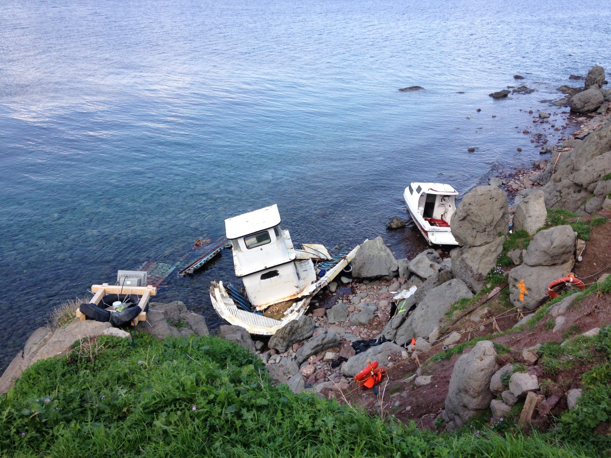
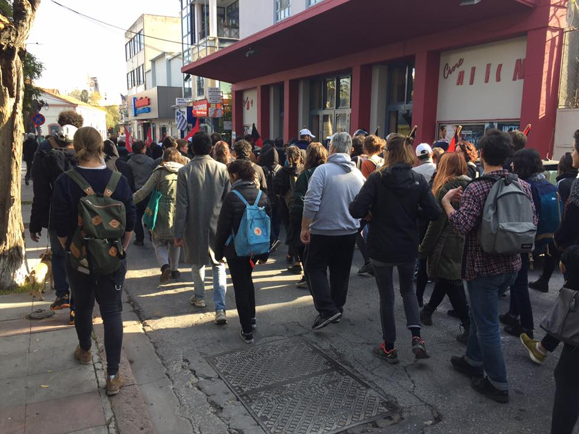
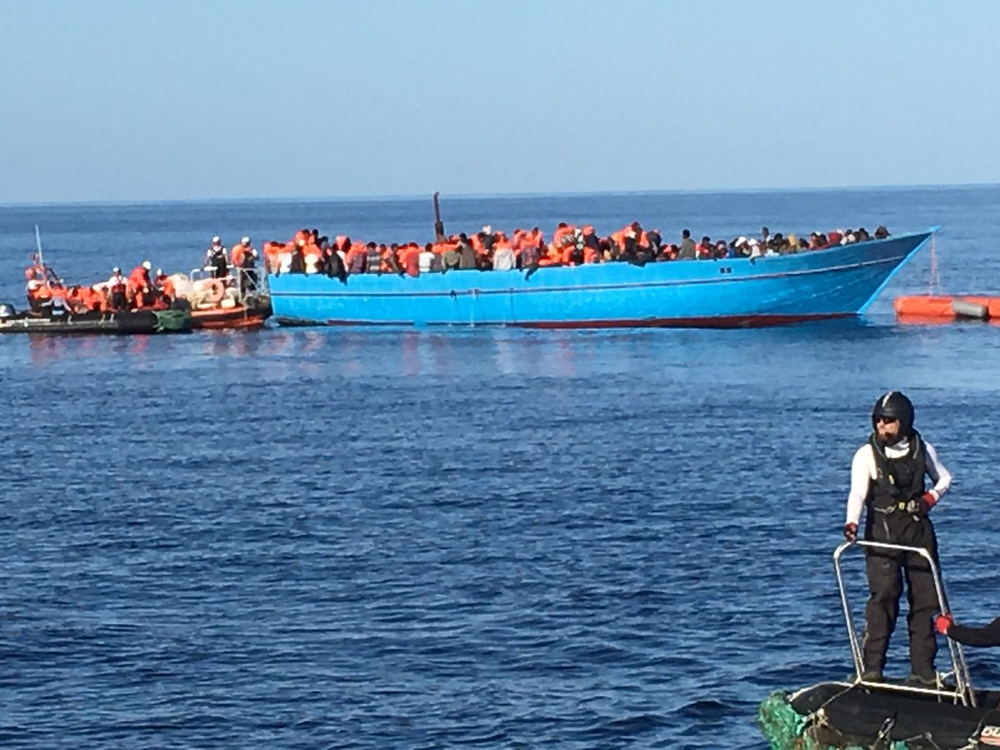
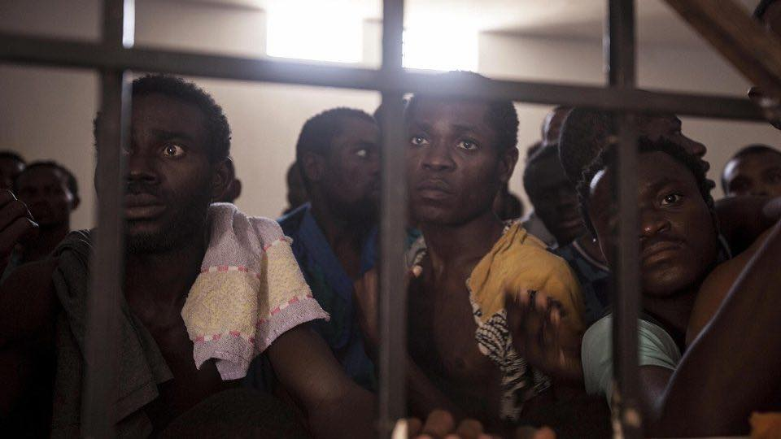
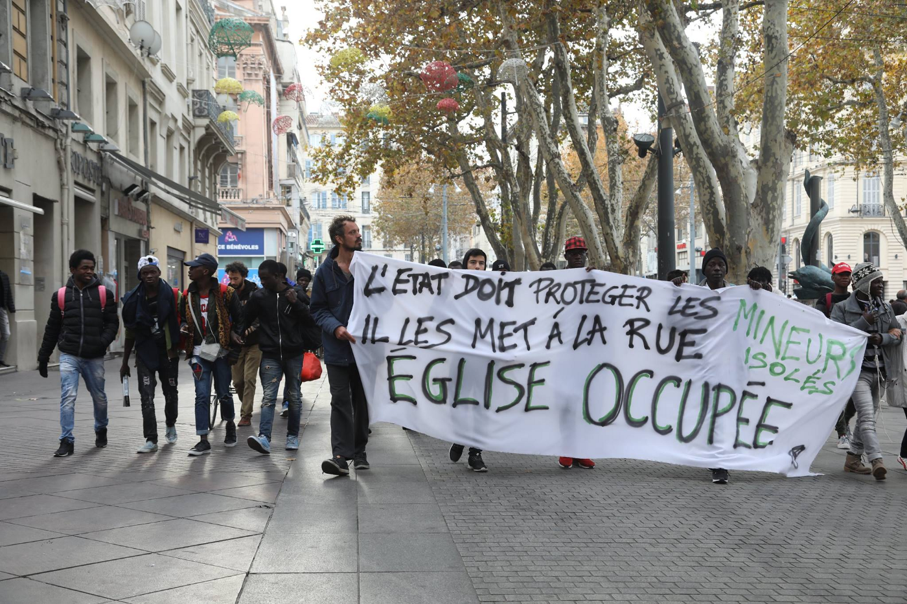

### AYS Daily Digest 25/11/2017: Afghan boy found dead off Lesvos
#### Afghan boy dies on boat reaching Lesvos//Thirty\-one bodies recovered off the Libyan coast//Protests against slavery continue

#### Greece
### Arrivals

One boat with 45 people landed on Samos and one with 62 people landed on Chios\. Three boats landed on Lesvos, with 50, 54 and 66 people on each\. [Ekathimerini](http://www.ekathimerini.com/223608/article/ekathimerini/news/afghan-boy-10-found-dead-off-lesvos-in-migrant-boat) says a 10\-year\-old boy died on board the boat with 66 people\. According to his parents, the boy was trampled by the other passengers during the evacuation by a Bulgarian Frontex vessel\.
### Occupation of Syriza building on Lesvos

Photo by Lesvos Solidarity — Pikpa

A pro\-refugee march in Mytiline ended in the occupation of a Syriza building in the centre of the town, calling for Greece to \#opentheislands\. According to the No Border Kitchen, the other demand is to free Hesam Shaeri Hesari, one of the hunger strikers who was detained and currently fears being deported\.

Human Rights Watch and other human rights and humanitarian aid organizations wrote an [open letter](https://www.hrw.org/news/2017/10/23/greece-asylum-seekers-abysmal-conditions-islands) to Prime Minister Tsipras a month ago, calling on him to end the Greek government’s policy of confining asylum seekers to the Aegean islands\. The situation has not improved and 20 human rights and aid groups have [reiterated these demands today](https://www.oxfam.org/en/pressroom/pressreleases/2017-11-22/greece-winter-nears-asylum-seekers-stuck-tents-islands) , with the IRC’s country director in Greece, Jana Frey, saying:

> “Lives will be lost — again — this winter — unless people are allowed to move, in an organised and voluntary fashion, to the mainland” 

As of 20 November 2017, the hotspots on Lesvos, Samos, and Chios are hosting 10,925 people in facilities meant for just 3,924\.
### Volunteers needed

[The Schoolbox project](https://www.schoolboxproject.org) needs new volunteers in Andravida, given a sudden surge in new residents at the LM Village Camp\.

[ERCI is looking to hire](http://ercintl.org/careers/) a Greek\-speaking medical coordinator for its clinic in the Moria camp on Lesvos\.

For more volunteer needs, check out [GreeceVol](http://www.greecevol.info/) \.
#### Turkey
### ReVi needs help

[ReVi](https://www.revifamily.org/) , an organisation that helps families with job opportunities, education, and emergency aid in Izmir, needs financial support as it says it has no money to pay for its programmes starting next week\. Small [donations](https://www.revifamily.org/support) as well as shopping through their [online store](https://www.revifamily.org/store) are welcomed\. The group is also looking for long\-term solutions through grants and sponsorships\.
#### Sea
### Thirty\-one bodies recovered off the Libyan coast

[Reuters](http://news.trust.org/item/20171125113801-6lpes/) says at least 31 refugees died after their boat sank off Libya’s western coast on Saturday and some 200 others were picked up by the Coast Guard to be brought back to the port in Tripoli\.

Photo by SOS Méditerannée

The Aquarius rescued more than 400 people aboard an overcrowded wooden boat\. More than a third of them were women and there were also “ _many young, very, very thin kids_ ” according to Megan Williams of CBC\. Those rescued also include a three\-day\-old baby and a woman who went into labor in Libya\.
### Protests against slave trade in Libya

Protests against the slave trade in Libya continue\. **Several demonstrations took place in Sweden** , including Gothenburg, Stockholm, and Uppsala, where the demonstration was attacked by a group of Nazis, injuring at least two **\. In Paris,** another protest took place in front of the Libyan embassy this Friday\. **In Berlin** , hundreds protested in front of the embassy on Saturday and another protest is planned in **Cologne** [this Monday](https://enoughisenough14.org/2017/11/25/cologne-demo-call-stop-enslavement-in-libya/) \.

Photo by MEDU

**In Italy, the Medici per i Diritti Umani \(MEDU\) NGO gave a letter to Marco Minniti, Minister of the Interior,** during his visit to the Pozzallo hot spot, denouncing the human rights violations suffered by refugees in Libya\. The letter is based on more than 2,600 direct testimonies given to doctors and psychologists over the last three years\.

[Reuters](http://news.trust.org/item/20171125144419-nse5j/) **reports Ivory Coast president Alassane Ouattara has called on the International Criminal Court to indict the criminals who are selling black African migrants in Libyan slave markets** \. Reuters adds that many West Africans and the United Nations Human Rights office accuse Europe of facilitating the abuses by co\-opting Libya to try to reduce the migrant flow, without taking much interest in how they achieve this\. [The Intercept](https://theintercept.com/2017/11/25/libya-coast-guard-europe-refugees/) also points out that:

> “ _European governments are financing, funding, training, and to some degree, coordinating, a Coast Guard that both the United Nations and the European Commissioner for Human Rights have [found](https://www.coe.int/en/web/commissioner/-/commissioner-seeks-clarifications-over-italy-s-maritime-operations-in-libyan-territorial-waters) to be “directly involved in human rights violations” and exposing migrants “to a real risk of torture or inhumane or degrading treatment or punishment\._ ” 

#### France
### 60 unaccompanied minors offered housing after protest

Photos by Haidi Motola/Activestills\.org

ActiveStills says a group of about 60 unaccompanied minors were finally offered temporary housing after occupying a church in the center of Marseille since Tuesday this week\. The minors, mostly from sub\-Saharan Africa, together with local organizations, united at the beginning of the week to protest and demand their rights for housing, schooling, and health care\.

](assets/7b47ab5d53b1/1*HZXIZ-iHX7QfWJxe-kb2XA.png)

Photo by [Collectif Soutien Migrants 13 / El Manba](https://www.facebook.com/collectifmigrants13/)

Meanwhile Paris d’Exil Mineurs, an organisation profiled in one of our [specials on unaccompanied minors in Paris](ays-special-from-paris-part-1-child-refugees-rely-on-volunteers-for-shelter-1651ce6e04d2) , now has its own [crowdfunding page](https://www.helloasso.com/associations/paris-d-exil-mineurs/formulaires/1) \. Funds will go towards sleeping bags, legal costs, food, transportation and phone credit among other things\.

> **_We strive to echo correct news from the ground through collaboration and fairness, so let us know if something you read here isn’t right\._** 

> **_If there’s anything you want to share, contact us on Facebook or write to: areyousyrious@gmail\.com\._** 

_Converted [Medium Post](https://areyousyrious.medium.com/ays-daily-digest-25-11-2017-afghan-boy-found-dead-off-lesvos-7b47ab5d53b1) by [ZMediumToMarkdown](https://github.com/ZhgChgLi/ZMediumToMarkdown)._
