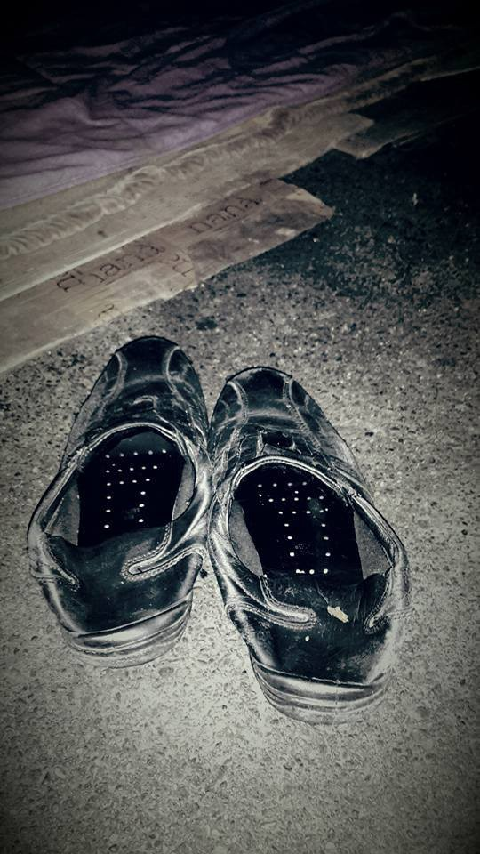
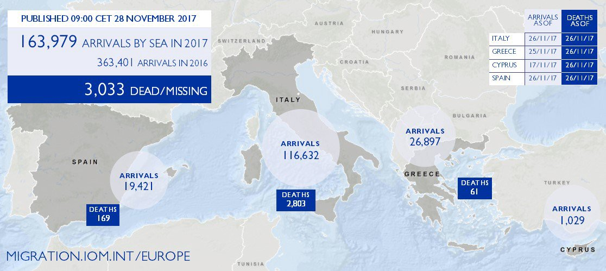

### AYS DAILY DIGEST 28/11/2017: “The authorities will be responsible for my death”

Moria, Lesvos\. Credit: Lesvos Solidarity — Pikpa\.

_Hunger strike in Portugal/Statistics regarding Syria/Calls for donations and volunteers in Turkey, Greece and NGOs working at sea/Data regarding presence on the islands and accommodation updates/Video and pictures of squalid living conditions in Samos and Chios/Key figures on asylum numbers in Serbia/Statistic data of arrivals to Italy and IOM figures/Finding legal ways to reach Europe is possible and it’s a duty of all the State members to guarantee the safeguard of human and asylum rights/More news from Germany, France, Spain…_
#### FEATURE:

[“The authorities will be responsible for my death”](http://expresso.sapo.pt/sociedade/2017-11-27-As-autoridades-serao-responsaveis-pela-minha-morte-o-unico-yazidi-em-Portugal-iniciou-uma-greve-de-fome) : the only Yazidi in Portugal started a hunger strike\.

Provisional residence permit for Saman Ali, the only Yazidi refugee to remain in Portugal, expired on 15 November\. In protest against the delays of the SEF \(borders and foreigners authority\), the university professor remains closed in his house of Guimarães, refusing food and water, awaiting permanent residence, to be able to “return to live”\.

Since the beginning of October Saman Ali was nervous\. The validity of his provisional residence permit in Portugal was approaching the deadline and the Foreigners and Borders Service \(SEF\) did not give him certainty of a renewal\. On November 15th, he did not receive the permanent residence, which guarantees him international protection for five years\. This Monday he decided to make public his personal protest: he started a “hunger and thirst strike” \[…\]

“ _Now the authorities will be responsible for my death_ ,” Saman stated\.

Saman, a university professor of medical biology, arrived to Portugal on March 6th 2017 as a refugee\. He’s a Yazidi from Iraq and like many others, he travelled to Lisbon from Greece\.

The Islamic State \(Daesh\) killed his entire family: mother, sisters, brothers, father\.

At the Lisbon airport he swore loyalty to Portugal, “my second country forever\.” And he kept the promise, even when the fellow travellers began to leave, he was the only Yazidi left in Portugal\.

It is not Saman’s first protest: on May 5th, he wrote a public letter to the President of the Republic, Marcelo Rebelo de Sousa, where he revealed that his first permit was about to end and how much he feared losing another country\. Renewal came soon after\.

Now, a new deadline is over\. “ _The day before the deadline, I went to the SEF of Braga, already desperate\. They told me that it is normal for the deadline to expire, that it is okay to be illegal and that they will call me later\. How can they accept that it is illegal and that this is not a problem? \[…\] I can not go to the hospital, I can not go to buy medicines, I can not even leave the house because I do not have valid identification and my residency papers have expired\. It’s like being in a prison\. And I want to live again_ ”, he said\.

The Minister of Internal Affairs explains that “the citizen was the holder of a provisional residence permit until 15\.11\.2017 and this document has already been renewed\.” With regard to the asylum procedure, “the final decision on the granting of international protection status is being finalised, following the procedures in the national asylum law”\.

Today Saman sent the President\- as well as SEF, the Portuguese Council for Refugees, the International Organisation for Migration, the Guimarães City Council, UNHCR and the European Court of Human Rights — a new letter:

“ _I started today a hunger strike \(and thirst \! \! \! \) as a protest for my asylum process in Portugal\! \[…\] In Iraq, I was a university professor, but I was forced to leave my country on 20 January 2016 because of my religion, my opinions and my activities\. My life was in great danger\. I can never return to Iraq because of the risk of being persecuted and killed\. \[…\] Today November 27th, 2017 I begin the hunger strike and will continue until I receive my refugee status, permanent residence, 5 years of international protection \[…\] or I’ll die because of my hunger strike\. \[…\]_ ”

Since April, Saman has psychiatric supervision in the Department of Psychiatry and Mental Health of the Guimarães Hospital\. In the last report, written one day after the end of the period of residence in Portugal, the accompanying doctor states that “the bureaucratic procedures associated with the process of obtaining refugee status are at the moment the main factor of stress and symptomatology of the depressive\-anxious form presented”\. Early depressive symptoms also emerged in Greece, associated with traumatic experiences in Iraq\.
#### SYRIA

UNHCR has published the latest data regarding the refugee population in Syria up until 27th November 2017\.

Here are some of the main key figures:
- A total of 60\.484 refugees \(42\.859\) and asylum seekers \(17\.625\) are present in the country; those who are living in camps are around 23\.562
- 6\.3 million are IDP \(internally displaced people\)
- 600\.000 are Syrian IDP returnees
- 5\.8 million are in need of NFI \(non\-food items\) assistance, 4\.3 million are in need of shelter, 13\.5 million are in need of protection and humanitarian assistance, 12\.8 million need health assistance

The document also reports the financial requirements for the different populations, revealing that, logically, operations and assistance to IDPs are the mayor voice when it comes to fundings needed \(303\.989\.073 $\) \.

UNHCR presence is strong all over the country, a part from the regions of Idlib, Raqqa and Deir es Zour, which have undergone radical changes recently and where clashes between Syrian Army and ISIS are still occurring\.

In terms of Winterization Program, there are currently 205\.170 people who benefit from it, mainly in the areas of Aleppo, Rural Damascus and Homs\.

#### TURKEY

Volunteers and donations are needed in Izmir\. Please get in touch with [Imece](https://www.facebook.com/imeceinisiyatifi/photos/a.703664563076914.1073741828.703040606472643/1371234196319944/?type=3&theater) if you can help\.

_“Empathy makes us human”_
#### GREECE

_Lesvos_

Registrations as by 27/11: 18

Transfers: 37

According to [official data](http://mindigital.gr/index.php/προσφυγικό-ζήτημα-refugee-crisis/1756-apotyposi-tis-ethnikis-eikonas-katastasis-gia-to-prosfygiko-kai-metanasteftiko-zitima-tis-27-11-2018) , there are almost 15\.900 migrants on the islands again, while in September, for one day, less than 13\.000 presences were registered\.

Small reminder: the official total capacity of the hotspots is around 5500, according to the Ministry of Migration data mentioned above, but, more than 13\.000 people are stuck in squalid detention centres\.

EnoughisEnough has published a detailed [article](https://enoughisenough14.org/2017/11/28/fascist-attacks-against-refugeesgr-and-supporters-on-lesvos/) , summarising the course of events and relative statements and demands of the actors involved, after the fascist attack on Sappho Square’s protestors in Lesvos, that lead to the occupation of the Syriza headquarters\.

_Samos_

This [video](https://www.facebook.com/687993924641223/videos/1486062881500986/?hc_location=ufi) is a testimony of the indecent conditions in which refugees are forced to live when the heavy rains fall\. Not only they have to cope with humidity, rain and wind, but also with mud invading their tents\.

The EU is not humane\. \#opentheislands

_Chios_

The situation in Vial is not better at all, as the pictures below clearly show\. CESRT also states that last week’s arrivals don’t even have a tent to sleep in and are forced to sleep on the concrete\.

But, at least, they are managing to distribute clothes, under wear, socks, scarves, gloves and shoes to 108 children \+ adults who are living in tents\.

_Mainland_

UNHCR weekly accommodation update shows that around 10% of the places available is still vacant, which means that more refugees could easily be hosted in decent housing facilities\.

The current total available places, between mainland and islands, of apartments and buildings, are 20\.275; of these, 17\.912 are actually ready to use \(the rest is under repair or have other sort of issues\) \. The current population hosted in proper housing facilities is of 16\.215 refugees\.

[Info and updates](https://www.facebook.com/mobileinfoteam/photos/a.1800063030222418.1073741830.1796286800600041/2075328129362572/?type=3&theater) on family reunification published by Mobile Info Team, both in Arabic and English\.

“ _Family reunification through the Greek Asylum Service is continuing as normal, however due to a large number of flights being booked this month for people approved in March 2017 Himalaya Travel has suspended bookings for a few days\. Family reunification through the Embassy is also continuing but since March 2016 it is only possible if the family member in Germany has refugee status, that means a three year residence permit\. \[…\] This restriction was supposed to be in place until March 2018 but recently there were discussions in Germany to prolong the restriction until March 2020\. We will update you if this restriction changes_ ”\.

[Volunteers](https://www.facebook.com/groups/204202716585823/permalink/561462617526496/?hc_location=ufi) needed in Khora Community Centre \(Athens\) to facilitate child support\!

Intervolve is also looking for [news media about Softex](https://www.facebook.com/InterVolve/photos/a.256091268062602.1073741829.219418945063168/538896303115429/?type=3&theater) — print and online articles, photos, video reports etc\.

“ _The media representation of Softex as part of the wider coverage of the refugee crisis, has had a huge impact on public perceptions of asylum seekers and the situation in Greece\. This in turn has an effect on the lives of asylum seekers, from influencing the aid received to harming integration efforts\. Many things reported were not true or exaggerated, and many things that did happen were not reported at all_ ”\.

FrankenKonvoi is also looking for [donations](https://www.facebook.com/franken.konvoi/photos/a.917776704981540.1073741827.917644168328127/1576249732467564/?type=3&theater) to support their much needed work in Greece and Serbia\.
#### SERBIA

UNHCR and partners assisted 126 new arrivals \(as compared to 157 the previous week\) \.

53% reported arriving from Bulgaria, 32% from FYR Macedonia, and 13% by air\.

Most were from Afghanistan \(34%\) or Iran \(24%\), followed by Pakistan \(19%\) and Iraq \(15%\) \. Children accounted for 39%, including 23 unaccompanied or separated children \(all boys from Afghanistan, all but one entering from Bulgaria\) \.

On 26 November, 4,312 new refugees, asylum\-seekers and migrants were counted in Serbia \(below chart refers\) \. 3,940 are housed in 18 governmental centres\. These comprise 35% children, 15% adult women and 50% adult men\.
Over 70% had fled Afghanistan \(54%\), Iraq \(15%\) and Syria \(2%\) \.

Two vulnerable unaccompanied refugee children, left Belgrade for Stockholm on 22 November\.
#### ITALY

New statistics by UNHCR has been published, giving clear information on the number of arrivals, the deaths at sea and the mayor countries of origin of the migrants reaching Italian coasts\.

Total arrivals \(1 Jan — 26 Nov 2017\): 116,305 \( \-30% circa compared to the same period of last year\) / Total arrivals \(1 Jan — 26 Nov 2016\): 170,826

Total arrivals in November 2017: 4,908 / Total arrivals in November 2016: 11,399

Average daily arrivals in November 2017 so far: 189 / Average daily arrivals in October 2017: 183

Dead and missing in 2017 \(as of 26 Nov\): 2,992 / Dead and missing in 2016 \(as of 26 Nov\): 4,691 \(out of a total of 5,096 in the whole year\)

_Pordenone_

Credit: Lorena Fornasir

As local volunteers [report](https://www.facebook.com/lorena.fornasir/posts/1452809641502795) , everyday refugees sleeping in the streets need to go to the A&E or the medical guard, suffering from fever, bronchitis, acute pain caused by the freezing temperatures of the night\. Common diagnosis: renal colic, intestinal block, intercostal pain and usual therapy: Brufen 1 cpx3\. And then? Then they go back to the street, under plastic sheets, or in a crummy place where they wake up with rats, the big ones, that eat their documents, and browse on the only jacket and run impudently over their paralyzed bodies\. Impossible to say “good night”\. “ _What good night?_ ” he asks me\. It’s true: “good night” is now an unsayable word\.

Italy — Refugee Crisis Database has published a [list](https://www.scribd.com/document/365945972/Learning-database) of organisations and places which provide learning support \(Italian language schools/courses, other languages and Informatics classes, training courses, professional training, study counselling, support with practices on education and training matters and support into schools\) \. They are divided by region and some of them specified the users they direct their activities to\.
#### GERMANY

Another attack against solidarity in Germany\.

The mayor of Altena, Andres Hollstein, has [reportedly](http://m.dw.com/en/germany-altenas-pro-migrant-mayor-stabbed-in-kebab-shop/a-41556872) been stabbed in what seems to be a politically motivated attack\. The city of Altena \(North Rhine\-Westphalia\) has, in fact, welcomed more refugees than required by the national quota\.

It is not the first time that attacks like that take place, in fact, two years ago, also the mayor of Cologne, was stabbed by a right\-wing extremist\.
#### FRANCE

La cuisine des migrants has published an interesting map showing where refugees are living in Paris and where police harassment events have occurred\.

#### SPAIN

On the 30th November there will be [protests](http://www.europapress.es/epsocial/migracion/noticia-convocan-protestas-30-noviembre-denunciar-propaganda-interior-nuevo-cie-algeciras-20171128122457.html) around the country to fight against the opening of a new CIE \(centre for identification and expulsion\) in Algeciras and the propaganda the Ministry of the Interior has been creating around the topic\. Demos will take place, among other places, also in front of the Interior Ministry in Madrid\.
#### SEA

163\.979 migrants arrived by sea so far in 2017, as illustrated by IOM — 363\.401 in 2016\.

3\.033 is the number of those who lost their lives at sea or that went missing\.

Credit: IOM

Sea\-Watch 3 needs [donations](https://twitter.com/seawatchcrew/status/935553983778902016) in order to guarantee their incredible work\. If you can, please consider donating to them\.

A call for [donations](https://www.facebook.com/MAYDAYTERRANEO/videos/vb.131671990715231/195625430986553/?type=2&theater) is also coming from the crew of Salvamento Marítimo Humanitario\. The crew also [rescued 109 people](https://twitter.com/salvamentogob/status/935565596669988865) form 2 different boats today in the Alboran Sea\. The migrants saved reached the coast of Motril \(Spain\) late in the evening\.
#### GENERAL

In an [interview](http://m.dw.com/en/jean-claude-juncker-migrants-need-legal-ways-to-come-to-europe/a-41556151) with DW, Jean\-Claude Juncker called out for legal ways for migrants to reach Europe, after the shocking reports of people being sold as slaves in Libya\. Despite the fact that thousands of people are trying to cross the Mediterranean every month and that the EU is restricting its border policy and signing inhumane agreements to stop this flow of people, the President of the European Commission candidly stated:

“ _I can’t sleep easy when I think about what’s happening to those people who went to Libya to try and improve their lives, only to find themselves in hell_ ”

He also added that he had been trying to address the issue of legal routes in previous European Council meetings, without success, and that Europe will not be silent in front of this situation; the fact that a stricter border policy has been implemented it’s not an excuse to rape, kill, torture innocent people, whose only crime is to to seek a better life\.

So what could be the possible solutions?

“ _I believe that if we don’t offer legal ways of emigrating to Europe, and immigrating within Europe, we will be lost_ ”

One concrete and viable option is the one of resettlement via humanitarian corridors that have been implemented already in [Italy](http://www.santegidio.org/pageID/1165/langID/en/itemID/756/Dossier-What-are-the-humanitarian-corridors.html) and [France](https://www.ecre.org/france-opens-its-first-humanitarian-corridor-to-syrian-and-iraqi-refugees/) , for example\. It provides refugees with legal access to a state where they will be granted civil, social, cultural rights\.

The main difficulty concerns the fact that the States should be willing to offer financial and bureaucratic support to the new arrivals\.

That is why all the actions taken so far were carried on by members of the civil society, mainly religious organisations, in Italy\. The Federation of Evangelical Churches and the Community of Sant’Egidio, after signing specific agreements with the Ministries of Interior and Foreign Affairs, initiated the project in February 2016\. In 2 years they have the goal to transfer safely around 1000 refugees from Lebanon \(Syrians\), Morocco and Ethiopia\.

Earlier this year, France signed an agreement to transfer 500 refugees from Syria and Iraq over 18 months\.

On the same direction goes the [statement](http://www.unhcr.org/admin/hcspeeches/5a1d80e07/statement-united-nations-security-council.html) written by Filippo Grandi, United Nations High Commissioner for Refugees, to the UN Security Council, where he states that “ _the grave abuses perpetrated against migrants and refugees along the Central Mediterranean routes can no longer be ignored \[…\]_ ”\.

Grandi also calls for safe legal pathways for vulnerable migrants to reach Europe and safety\.

“ _I have called for 40,000 additional resettlement places in the 15 countries affected by these movements\. To date, we have indications of just 10,500 places — an encouraging, but still insufficient number_ \.”

> **We strive to echo correct news from the ground through collaboration and fairness\.** 

> **If there’s anything you want to share or comment, contact us through Facebook or write to: areyousyrious@gmail\.com** 

_Converted [Medium Post](https://areyousyrious.medium.com/ays-daily-digest-28-11-2017-the-authorities-will-be-responsible-for-my-death-6cbe62ab240a) by [ZMediumToMarkdown](https://github.com/ZhgChgLi/ZMediumToMarkdown)._
