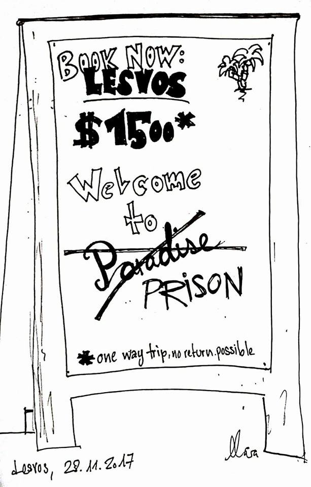
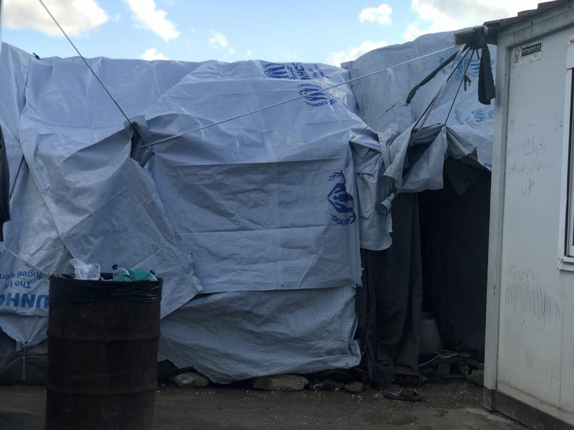
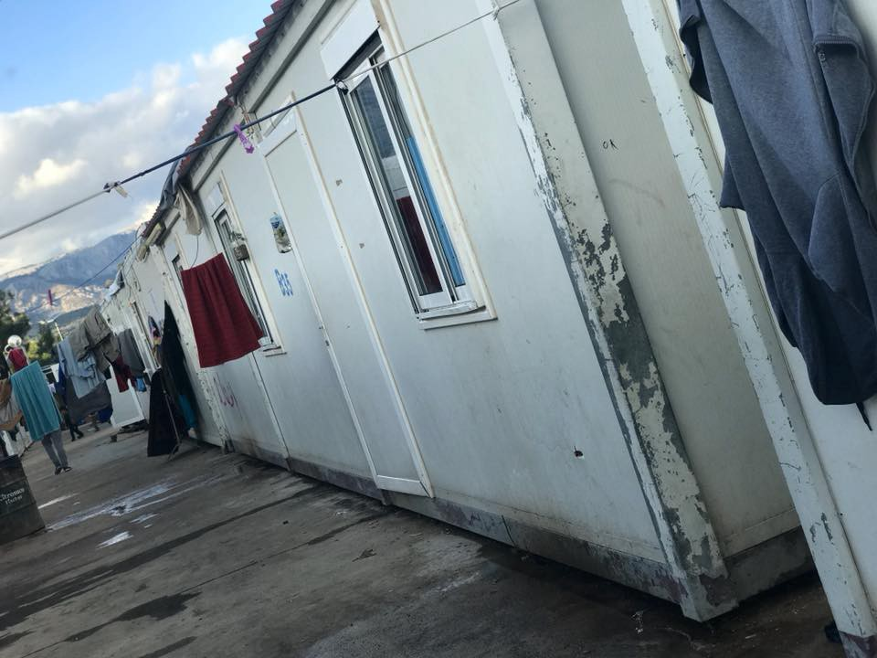
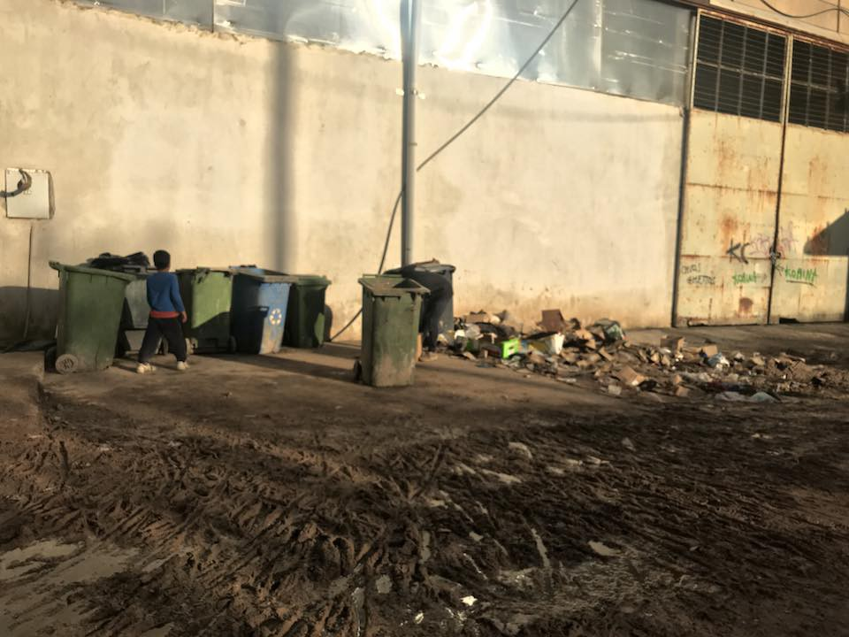
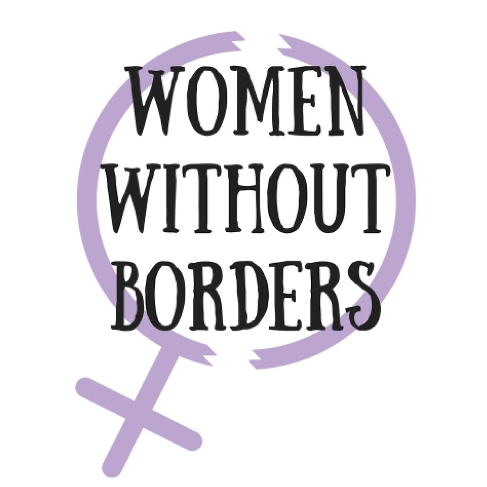

### AYS Daily Digest 29/11/2017 Estonia proposes change to the reception of applicants for international protection

€285 million plan for Libyan coast guard /// Over 150 refugees imprisoned in a basement in Istanbul /// Illegal deportations from Lesvos /// Updates from Chios and Samos /// German Conservatives plan to start deportations to Syria /// Frontex to organise its own deportation flights

Still 16\.000 refugees are stuck on the islands \#OPENTHEISLANDS — picture by Mara Milena
#### FEATURE — Estonia proposes change to the reception of applicants for international protection\.

Estonia, which currently holds presidency of the EU, has suggested that the executive European Commission should work on a “fair share” system in which countries would be expected to take in asylum seekers at their own borders\. This would remove pressure from first entry countries like Greece and Italy as it would no longer be their responsibility to deal with the claims of everybody who arrived on their shores\.

A country’s “fair share” would be largely based on their population and wealth\. However, if arrivals rose to the point that they would be above this level, countries could be warned in advance\.

Member states who did not want to take asylum seekers would be asked to offer assistance in other ways such as offering material aid, personnel, or funding\.

The main objectives of this [draft directive](http://www.consilium.europa.eu/en/press/press-releases/2017/11/29/reception-conditions-for-asylum-applicants-council-agrees-mandate-for-negotiations/) are:
- to provide standard reception conditions to applicants for international protection, which should ensure they receive an adequate standard of living and comparable living conditions in all member states
- to limit secondary movements by further harmonising standards and limiting access to reception conditions to the member state responsible for the application for international protection

[Media report](https://uk.reuters.com/article/uk-europe-migrants-solidarity/eu-considers-new-plan-to-ease-disputes-over-migrants-idUKKBN1DT11C) from Brussels that:

> The emphasis would be on averting crises by prompt action\. But if crisis conditions persisted, such that a country was sheltering 150 percent or more of its fair share — a number that would also take into account its previous record of taking in refugees — then a more formal procedure could oblige other states by majority vote to make good on offers of “solidarity”\. 

Under these rules both Greece and Italy would be due far more support from other EU states and it could reduce the number of people trapped in entry countries in life threatening conditions\.

However, the main objectives are both difficult to achieve\. Firstly, the living conditions of member states are not comparable even for those born in Europe\. Health care and legal aid provision, two of the most necessary services for asylum seekers, differ greatly between countries\. A country such as Greece, still suffering its own economic crisis, while also being a port of entry, is in a very different situation to most Northern European countries\. Secondly, the limiting of secondary movement fails to take in to account basic needs such as studying and working in other EU countries, something which those born in the EU take for granted and which ultimately supports economic growth\. It also continues the model currently used in the Greek islands and already in use within the EU\. Although better living conditions probably would make it less likely that people will want to leave the island/country in which their claim is being considered, or in which they are being given ‘protection’, geographic restrictions by their nature are open to abuse and can trap people in situations which endanger the lives and wellbeing of themselves and their families\. This is a situation which most EU citizens would not find acceptable\.

**Libya**
#### **New facility for vulnerable refugees to be opened in Tripoli**

UNHCR [report](http://www.unhcr.org/news/press/2017/11/5a1edc7c4/unhcr-welcomes-libyas-transit-facility-expedite-third-country-solutions.html) that a “transit and departure facility” will be set up in Tripoli for people in need of international protection to facilitate and speed up the process of securing solutions for thousands of vulnerable refugees in third countries, particularly for unaccompanied or separated children and women at risk\.

> These solutions will include resettlement, family reunification, evacuation to UNHCR\-run emergency facilities in other countries, or voluntary return, as appropriate\. 

In September, UNHCR called for an additional 40,000 resettlement places to be made available for refugees located in 15 countries along this route\. So far, only 10,500 pledges have been made\.

> “\[…\] we now need EU member states and others to step up with offers of resettlement places and other solutions, including family reunification slots\. Together, these will be an important platform for securing solutions for these vulnerable people, based on shared responsibility\.” _\(Roberto Mignone, UNHCR Representative in Libya\)_ 

#### € **285 million plan for Libyan coast guard**

Media [report](https://euobserver.com/migration/140067) that Mario Morcone, from the Italian interior ministry spoke to MEPs in the civil committee on Tuesday 28th November, stating that the total cost of combined EU and Italian efforts to improve the Libyan coast guard until 2023 will be €285 million\.

Despite several reports about abuses, violence and irregular and dangerous behaviour, Italy and the EU will stick to their plan to create operational centres in Libya, to “help search and rescue operations at sea” and to better coordinate fleets between the Libyan and Italian coastguard\.

Border guard posts on land will be also created\.

> Italy has given the Libyan coast guard some six vessels and is set to hand over another three before the end of the year\. 

> The EU Commission had earlier this year announced a €46 million programme to prop up the Libyan coast guard\. 

> That includes setting up two fully\-fledged control facilities in Tripoli overseen by the Libyan ministry of defence\. 

> The same ministry has been described by internal EU reports as having “little or no control of the armed forces”\. 

The EU and Italian efforts have been condemned by human rights defenders given that people rescued at sea are returned to Libya where they often face violence and even death\.

**Turkey**

“Close to 200” \(eyewitnesses say over 150\) refugees were discovered imprisoned in a basement in Istanbul, mostly from Pakistan\. They had not been given food or water for days\. One person managed to escape and alerted the neighbours, who called the police\. The basement is now abandoned with large number of chains, locks and suitcases left inside\. The original article in Turkish can be read [here](http://www.hurriyet.com.tr/polis-bodruma-indi-korkunc-manzarayi-gordu-istanbulda-muthis-operasyon-40659581) \.

**Sea**
#### [**3 people died**](https://twitter.com/salvamentogob/status/935885298784985088) **in the Strait of Gibraltar**

Three drowned men have been found in the Strait of Gibraltar by Spanish rescue boat, Helimer 219, according to media [reports](http://news.trust.org/item/20171129174450-3wfcb/) \. The bodies have been taken to Tarifa\. Two people were rescued alive, one man was transferred to Algeciras Hospital, the other to Jerez\. One is believed to be missing\. Weather conditions are currently very dangerous in the area with bad weather and big waves\.

The Guardamar Polyhymnia boat rescued 32 people \(4 women and 28 men from sub\-Saharan origin\) from a boat located by Helimer 206\. They have been moved to Almería\.

This is the moment of their rescue\.

■■■■■■■■■■■■■■ 
> **[SALVAMENTO MARÍTIMO](https://twitter.com/salvamentogob) @ Twitter Says:** 

> > Este es el instante en que Guardamar Polimnia rescata esta tarde 32 personas de una patera en mar de Alborán. Fueron trasladadas sanas y salvas a #Almería https://t.co/nLVFRlodXW 

> **Tweeted at [2017-11-29 20:21:29](https://twitter.com/salvamentogob/status/935966967223275520).** 

■■■■■■■■■■■■■■ 

**Greece**
#### **Registrations**

No new registrations on the islands on November 28th\.

87 people were transferred to mainland\.

Almost 13\.000 people are in the hotspots, and almost 16\.000 are still stuck on the islands\.

**Islands**

**Lesvos**

■■■■■■■■■■■■■■ 
> **[Fotini Rantsiou](https://twitter.com/FotiniRantsiou) @ Twitter Says:** 

> > Let’s not forget: every year around this time the islands are bursting because of refugee arrivals. But this day last year #Lesvos had 2,000 less people than today. #opentheislands #RefugeesGr 

> **Tweeted at [2017-11-29 20:38:24](https://twitter.com/fotinirantsiou/status/935971224747995136).** 

■■■■■■■■■■■■■■ 

#### **Illegal deportations from Lesvos**

[Harekact\.bordermonitering\.eu](http://harekact.bordermonitoring.eu/2017/11/27/dubious-deportations-to-turkey-prevented/) have published a new report regarding two recent instances of illegal deportation\. It details the cases of two people, one from Iran and one from Afghanistan whose deportations were prevented at the last minute by activists and legal representatives\. The deportations are considered illegal as one person had serious health problems and the other was in the middle of his second appeal\.

> _The law says that the state has to provide the applicants the right to bring a case to the court with ‘proper’ legal aid\. This is an indefinite term, so it is a matter of defining the law\. The European Court of Human Rights would have definitely considered the deportation illegal\._ 

The report points to a lack of adequate legal support on the islands as well as underlining some of the key problems with the EU\-Turkey deal\.
#### Memorial for the drowned refugees vandalised

](assets/72dadc8c4f25/1*cikEPSAQuUr6f8uY74ebbg.jpeg)

[RACIST CRIMES WATCH](https://racistcrimeswatch.wordpress.com/2017/11/29/1-460/)

The memorial for the drowned refugees at Thermis beach in Lesvos was found vandalised with black paint today\.

**Chios**

According to independent reports the authorities were about to transfer 40–50 ISO boxes to VIAL camp but the residents of Chalkios village, which is beside VIAL, filed an injunction against this measure because they don’t want the refugees to be established in the area\. The decision was in their favour and the delivery of the containers has been held off until at least the 16th of January\.

Photo by Ruhi Loren

Independent volunteers are once again filling the gaps in care at VIAL camp and are asking for support to provide warm clothes to people living in tents\. If you can help contact [Ruhi Loren](https://web.facebook.com/ruhi.akhtar.7/posts/1913669438649955?hc_location=ufi) \.

**Samos**

Another young man attempted to end his life yesterday at the hotspot on Samos but according to [reports from the ground](https://web.facebook.com/samosBside/posts/1956440974604996?hc_location=ufi) he was saved by the solidarity of his fellow refugees who lifted him up and removed the rope from his neck\.

It is unfathomable that people have been left in this situation for the 2nd winter in a row\.

[Samos Hot Spot](http://www.youtube.com/watch?v=ydPDdq0NvQQ)

**Mainland Greece**
#### 4 people have died in Thessaloniki

■■■■■■■■■■■■■■ 
> **[NoBorders](https://twitter.com/Refugees_Gr) @ Twitter Says:** 

> > 4 #refugeesgr dead / 4 at hospital after police chasing trafficker's car 
near Nea Peramos Thessaloniki
#antireport 
[efsyn.gr/arthro/tesseri…](http://www.efsyn.gr/arthro/tesseris-metanastes-nekroi-ystera-apo-katadioxi) 

> **Tweeted at [2017-11-29 09:19:56](https://twitter.com/refugees_gr/status/935800486162305024).** 

■■■■■■■■■■■■■■ 

[Press](https://www.apnews.com/41a04c0b8ffe40e89cb157062da05758) report that four people have died during a police chase in northern Greece near Kavala, Thessaloniki\. The car, reportedly driven by a smuggler and with 8 migrants inside, plunged off a 90\-foot cliff\. One man is believed to be in intensive care with multiple bone fractures, the other four people including the driver are okay\. The names of the dead and injured are not known\. The driver is facing multiple charges for manslaughter and human trafficking\.

The car was bringing people into Greece via the Turkish land route\.
#### Demonstration by Eastern Aegean Authorities on 5th of December

■■■■■■■■■■■■■■ 
> **[urbanliterarygraffit](https://twitter.com/ufroese) @ Twitter Says:** 

> > Chios residents to join protest over migration next week [dlvr.it/Q3QmtG](http://dlvr.it/Q3QmtG) via .@[ekathimerini](https://twitter.com/ekathimerini)
-Q to mayors of Lesvos, Chios, Samos, Leros and Kos How was the  50 million euros in emergency assistance spent? [twitter.com/ufroese/status…](https://twitter.com/ufroese/status/931126038490427392) #refugeesgr 

> **Tweeted at [2017-11-29 10:09:32](https://twitter.com/ufroese/status/935812966351589376).** 

■■■■■■■■■■■■■■ 

The demonstration will take place outside the Ministry for Migration Policy on Klafthmonos Square in Athens and will be attended by residents of Chios according to local [media](http://www.ekathimerini.com/223706/article/ekathimerini/news/chios-residents-to-join-protest-over-migration-next-week) \. The Easter Aegean Authorities state they are protesting against the terrible living conditions of refugees and migrants on the islands\.
#### Info Event at City Plaza this Friday

■■■■■■■■■■■■■■ 
> **[City Plaza Squat](https://twitter.com/sol2refugees) @ Twitter Says:** 

> > Friday 1st December 7pm at #CityPlaza: Ενάντια στα διπλό σύνορο του Αιγαίου / Against double Aegean border (participate solidarians from #Lesvos, #Chios #Samos) every one is welcome. 
[facebook.com/sol2refugeesen/](https://www.facebook.com/sol2refugeesen/) https://t.co/MkFWhC1BrZ 

> **Tweeted at [2017-11-28 15:27:26](https://twitter.com/sol2refugees/status/935530581080846336).** 

■■■■■■■■■■■■■■ 

#### Mosaico House Needs Volunteers

[Mosaico House](https://web.facebook.com/helpfromgreece/) is looking for volunteers for the months of December and January 2018\. They are a shelter for refugee women and children in Athens\. Their volunteers are asked to commit to volunteering for at least 2 weeks, but more is always welcome\. They mainly work with children from ages 3 to 13\. Volunteers are needed to facilitate structured games and activities with children and are also welcome to facilitate classes \(language, yoga etc\. \) for the refugee residents and community\.

**Italy**
#### **Updates from the CARA in Gorizia**

[L’Altra Voce](https://web.facebook.com/L-ALTRA-VOCE-1245970425495921/?ref=br_rs) published a message received from a boy hosted in the CARA \(Asylum Seekers Reception Centre\) of Gradisca d’Isonzo \(Gorizia\):

Local authorities in the area have declared that they are willing to shut down the CARA in order to open a CPR \(Centre for Repatriation\), a detention centre for refugees waiting deportation\. L’Altra Voce [responded](https://web.facebook.com/permalink.php?story_fbid=1566405976785696&id=1245970425495921) asking local authorities to stop reducing migration fluxes to a problem of public order:

> What should the 750 refugees of the CARA do as an alternative to the jungle? Staying closed inside and beat each other from time to time? Or going around town as zombies causing indignation among your electors? That will surely happen if the jungle is evicted\. Or using them for unpaid social work? So you’ll have tidy and clean green areas without paying any money\. 

> We think this is slavery and not integration\. 

> Instead of repressing the weaker, taking out their only form of survival, let’s take care of the management in the reception centres\. The problem is there and not in the jungle\. 

> Last fight in the CARA broke out for a pair of shoes, futile reason according to some people, but symptom of the total precariousness of life within the CARA\. 

> For a pair of shoes you expelled 12 people, punishing everyone, even those intervened to stop the fight\. The fight broke out in the late morning and by the same evening you had already expelled all of them, forcing 12 people to sleep rough in the streets in winter time, knowing that there is no safe refuge, no food\. 

> All of this for a pair of shoes\. 

> \[…\] 

**Portugal**
#### **Portugal to welcome 1,010 refugees from Turkey and other third countries**

Eduardo Cabrita, Minister of Internal Affairs announced on Tuesday that Portugal will accept 1,010 refugees from a new EU resettlement program, [media](http://expresso.sapo.pt/internacional/2017-11-28-Portugal-disponivel-para-acolher-mais-de-mil-refugiados-a-partir-da-Turquia-1) report\.

This new program aims to integrate 50,000 people throughout the European Union\. It is voluntary and is done under EU funding\. According to the EU Commissioner, Avramopoulos, 15 Member States have expressed their support\.

At the same time Portugal limited the number of eligible applicants for relocation from Greece and Italy\.

By the 15th November Portugal had welcomed 1,507 refugees — 2,993 short of the 4,500 refugees it should have accepted\.

**Croatia**

40 people have arrived from Turkey to Croatia today within the resettlement program\. They are families with children \(AYS has been told that the number of children within this group is about 30\) \. They will be transferred to Kutina reception centre, 1 hour drive from Zagreb\.

**France**
#### **Snow forecasted in Northern France**

Snow could start falling over North\-Western France from this Thursday\. In Calais, as a [volunteer](https://web.facebook.com/chiara.lauvergnac/posts/10155371792409092) reports, people still do not have the essentials\.

> They are out in the cold without enough tents, blankets, sleeping bags, tarps and some people have no jacket, the associations are struggling and the police destroy every tent or shelter they find, they spray blankets and sleeping bags with CS gas to render them unusable and people will die\. 

> There is not even a plan for the extreme cold\. previously the local authorities opened a disused gym when temperatures dropped but not any longer\. 

> Please distribute all you can, make more collections, volunteer, send money/ and take people to A&E if they show signs of hypothermia or develop pneumonia, life\-threatening situation\. 

If you want to support Chiara, you can donate through her paypal: [chiara\_lauvergnac@yahoo\.co\.uk](mailto:chiara_lauvergnac@yahoo.co.uk)

Help Refugees also report that “76% of refugees in Calais have had their blankets taken by police on average 3 times a week\.”

You can support Help Refugees [here](https://web.facebook.com/HelpRefugeesUK/posts/528201220873889?hc_location=ufi) \.
#### **Online legal advice sessions on Saturday and Tuesday**

The [Réseau des Exilés en France](https://web.facebook.com/refasso/) offer online sessions with a lawyer\.

The next one will be on Saturday 2nd December at 1pm\.

You can find more information [here](http://www.ref-asso.org/legal-aide/) \.
#### **New centre for unaccompanied minors to be open in Paris**

Médicins Sans Frontiéres will open a new [centre](http://www.msf.org/en/article/france-msf-opens-day-centre-unaccompanied-minors-paris) for unaccompanied minors in Pantin, Seine Saint\-Denis, Paris\.

It is estimated that by the end of 2017 25,000 young people will have applied for unaccompanied minor status in France\. The situation is extremely serious\.

> Many young people who say they’re minors receive no assistance and sleep rough in the most appalling conditions, surrounded by groups of adults, and at the mercy of people smuggler networks\. 

> A system of shelter, care and guidance provided in a secure and humane environment is urgently needed\. \( _Corinne Torre, head of mission for MSF in France\)_ 

The new centre will be a day\-only facility, operating from 9am to 5pm\. It will provide assistance, including legal aid, medical care, mental health and social services\. It will work in cooperation with several associations \(ADJIE, Safe Passage and COMEDE\) and lawyers from the Bars of Paris and Seine Saint\-Denis and will be available to 50 young people referred by these associations\.

> Some people do manage to apply for child protection and, if recognised as minors, are looked after by children’s services\. But those whose claims are turned down are ejected from the legal system and denied any further assistance\. 

> We’re calling not only for unconditional protection for these young people as children at risk but also for the upholding of the presumption of minority, which is regularly contravened\. 

#### Women Without Borders fundraising

[Dunkirk/Dunkerque Women’s centre](https://web.facebook.com/refugeewomenscentre/) has launched a fundraising campaign\.

Take a look and support them [here](https://web.facebook.com/refugeewomenscentre/posts/358687201223583) \!

**Germany**

Local media [report](http://www.zeit.de/politik/deutschland/2017-11/syrien-abschiebungen-cdu-csu-2018) that the conservative parties, CDU and CSU, are considering beginning deportations to Syria from summer 2018\. They want to discuss this proposal further next week\. Depending on the security situation in Syria, it could be that they identify safe regions and don’t extend the deportation ban for Syrians after 30th June 2018\.

**EU**

French President Emmanuel Macron has reportedly stated that migrants trapped in Libya must be ‘evacuated’ by which he means returned to their country of origin presumably regardless of the situations which forced them to leave\. Whereas in August he was still planning to set up ‘hotspots’ in Libya and suggesting that asylum processes should be completed in these centres\. Given that the conditions in Libya have been widely known by International Organisations and EU bodies for several years it seems unlikely that Macron, as President of France, was uninformed\. Since the recent CNN video of the slave trade in Libya Governments have been forced to come out publicly as decrying these practices but given the EU’s continued support for the deal to keep migrants and refugees in Libya, as well as the recent actions of their vessels to return boats from international waters to the Libyan shore, their words are meaningless\.

**General**
#### FRONTEX to organise its own deportation flights

FRONTEX will begin organising its own charter flights to speed up deportations of migrants who have been refused asylum in Europe\. According to [InfoMigrants](http://www.infomigrants.net/en/post/6310/frontex-to-set-up-its-own-repatriation-charter-flights) FRONTEX executive director Fabrice Leggeri stated that discussions are underway with the European Asylum Support Office to improve information exchange in order to make sure that those who are refused asylum can immediately be inserted into the deportation system\.

Ben Lewis from the UN Office of the High Commissioner for Human Rights is reported to have said that large\-scale repatriation is a sign of failure\.

> The word ‘repatriation’ is used in a ‘’clinical manner, outside of its context’’ and repatriation ‘’is a violent process for those subjected to it’’\. The word ‘repatriation’, he added, ‘’is a euphemism for expulsion of unwanted people’’\. 

> **_We strive to echo correct news from the ground through collaboration and fairness, so let us know if something you read here isn’t right\._** 

> **_If there’s anything you want to share, contact us on Facebook or write to: areyousyrious@gmail\.com\._** 

_Converted [Medium Post](https://areyousyrious.medium.com/ays-daily-digest-29-11-2017-estonia-proposes-change-to-the-reception-of-applicants-for-72dadc8c4f25) by [ZMediumToMarkdown](https://github.com/ZhgChgLi/ZMediumToMarkdown)._
