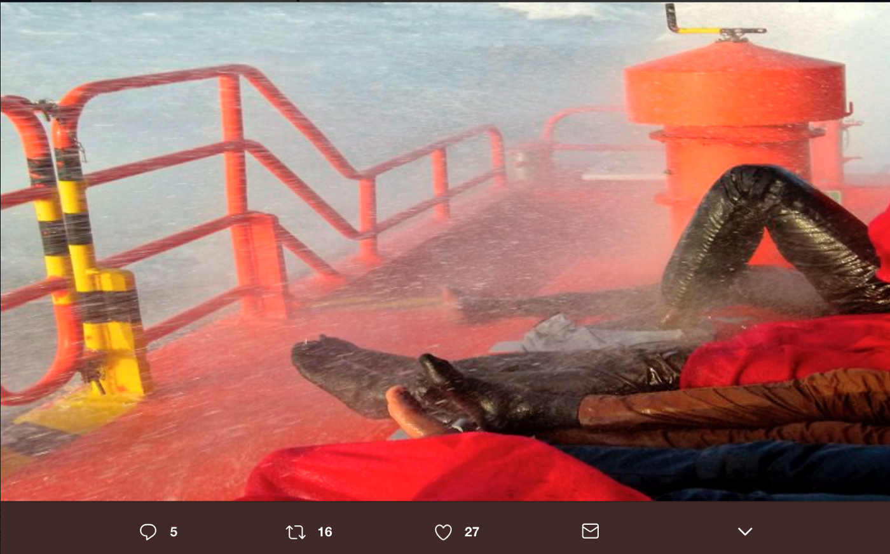
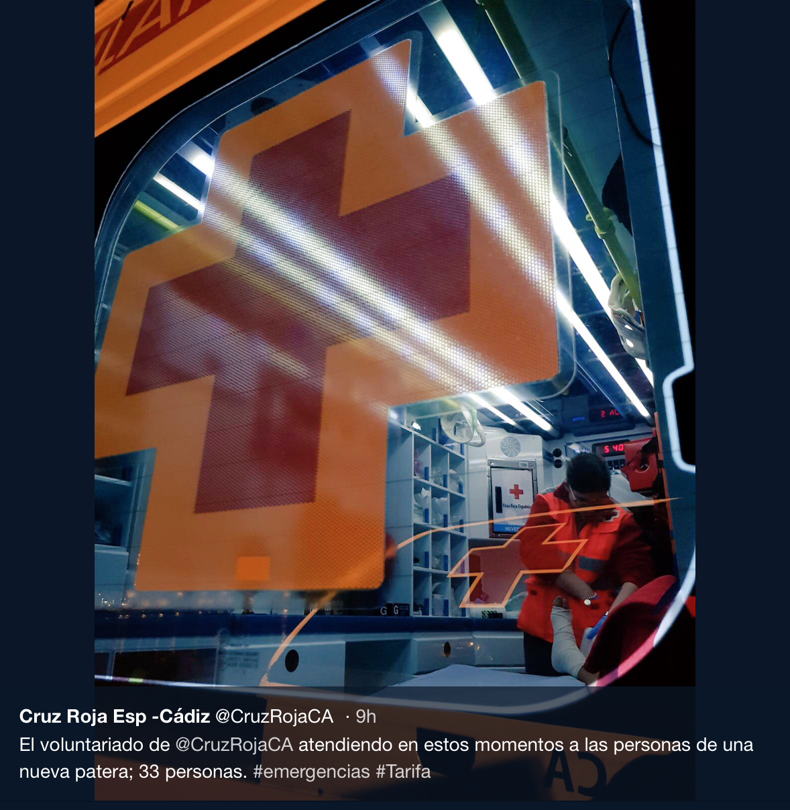
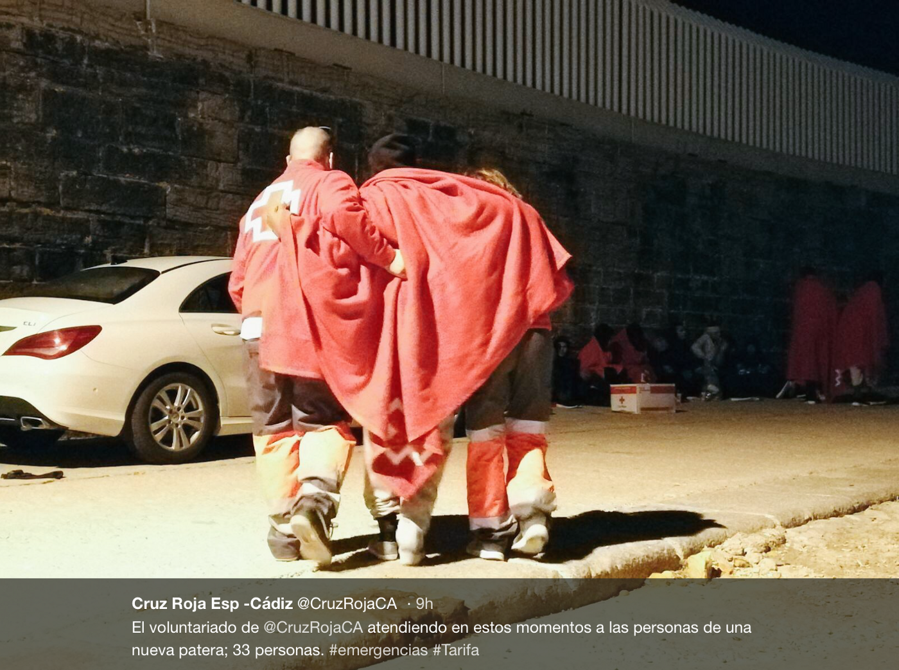
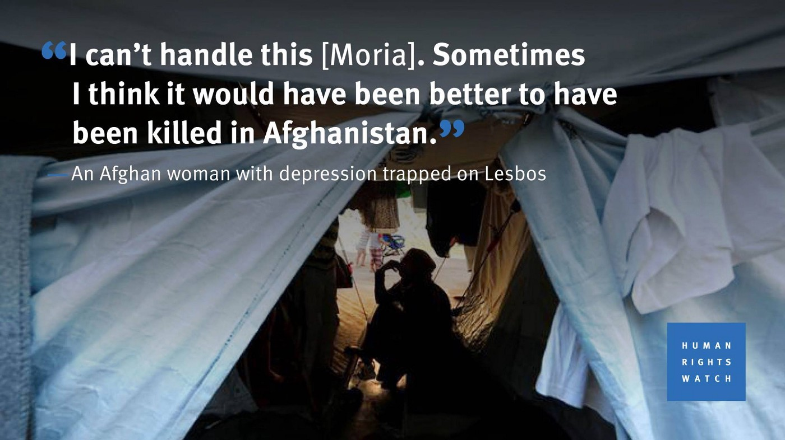
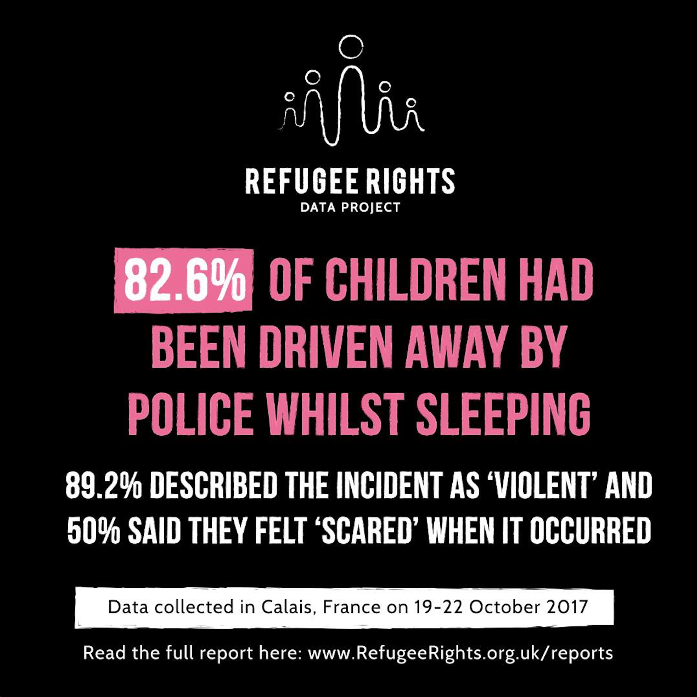
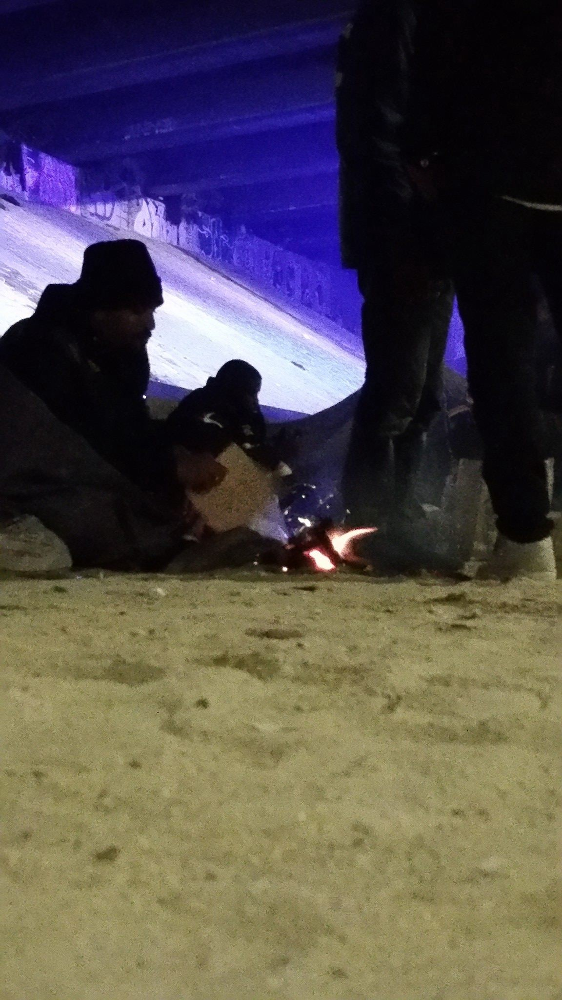
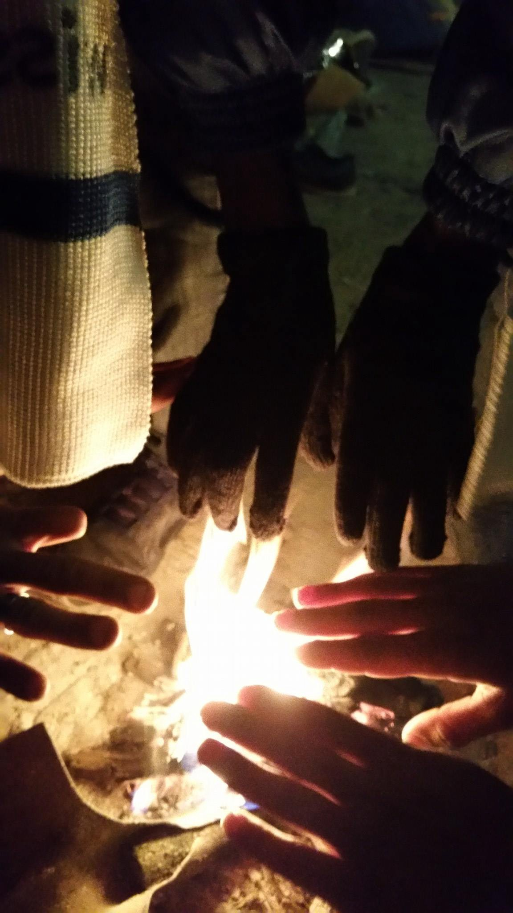

### AYS DAILY DIGEST 02/12/2017: When injustice becomes law, resistance becomes a duty — A very concerning proposal for replacement of the Asylum Procedures Directive 2013 could have catastrophic consequences

Proposal for replacement of the Asylum Procedures Directive 2013 and broadening of the term ‘safe third\-party country’//More rescues at sea and help needed//Joint protests planned by the municipalities of Lesvos, Chios and Samos// News from France// UK Statistics of LGBT asylum// News from Estonia, Denmark and more…

Children of war by Mana Neyestani
### Feature:

**When injustice becomes law… Resistance becomes a duty\.**

The European commission is currently in the process of pushing [through a proposal which will replace](https://www.mediapart.fr/journal/international/281117/le-diabolique-projet-de-l-europe-pour-bloquer-les-demandeurs-d-asile-hors-de-ses-frontieres-0?onglet=full) the Asylum Procedures Directive of 2013\. The new proposal will expand the concept of a ‘safe third\-party country’ and the consequence of this is that applications could now be rejected **lawfully** based solely on the grounds of ‘inadmissibility\.’ This has the potential to extend way farther than the current EU\-Turkey deal and the effects are going to be catastrophic for asylum seekers\.

**We need to act now before this legislation is passed\.**

‘Rather than questioning \[asylum seekers\] about the political violence that provoked their exile, rather than trying to assess the credibility of their testimony, rather than gathering evidence of their persecution, it would be a question of tracing their trajectory… did they cross a country in which they could live in safety \[on their way to Europe?\] \.’

What this proposal means is that it will become legal to reject asylum applications in EU member states based on general assumptions made in relation to where an asylum seeker is from and what ‘safe third countries’ they passed through on their way to the EU\. It will not be required for EU countries to review individual claims in any detail at all in order to send asylum seekers back to ‘safe third countries\.’

[A volunteer warns:](https://www.facebook.com/kester.ratcliff/posts/10155150968391238?hc_location=ufi)

‘This is the kind of legal change that sounds like a technicality to most of the general public until it becomes law and it’s then too late and we’ll be fighting its effects for the next decades…The EU\-Turkey deal was just a press release, not a legislative act and not an international treaty\. So we could challenge it legally in comparison to legislation\. If they succeed in passing this as legislation, then the principle of the EU\-Turkey deal of arbitrarily politically deeming countries to be “safe third countries” and rejecting asylum applications as inadmissible without even hearing people’s individual claims could become law, and then it will be even harder to fight its effects\.’

**What is a ‘safe third country’?**

A ‘safe third country’ is the name given to countries outside of the European Union that by Article 45 are supposed to guarantee human rights\. This refers to the fact that, in these countries “applicants have to fear neither for their life nor for their freedom because of their race, their religion, nationality, membership in a particular social group or political opinion\.”

**However, in reality this is not the way it sounds…**

What is deeply concerning about this proposal is that a country could be declared ‘a safe third country’ even if all but one of its regions are not\. Thus, countries who may be at war can technically be declared safe if the war does not threaten every single region and all the people\. This broadening of the term ‘safe third country’ will allow unsafe and unstable countries such as Libya to be declared ‘safe’ alternatives to the EU\. Thus, many neighbouring countries outside the EU that do not have the means to provide the protection and support necessary to refugees will be legally forced to take asylum seekers back from European soil\.

The new regulation being negotiated is a generalization of this EU\-Turkey agreement, criticized by all the NGOs as well as by the UN\. It calls into question one of the fundamental principles of asylum, enshrined in the 1951 Geneva Convention, according to which every asylum seeker has the right to have his personal situation examined in the country in which he seeks protection\.
### Sea

Seven boats were rescued on the Spanish coast today by SALVAMENTO MARITIMO\. The total number of those rescued today came to 164 persons\.

Source: SALVAMENTO MARITIMO

Cruz Roja Espanola Volunteers were busy today attending to the survivors as they were disembarked on land\.

Source: Cruz Roja Espanola

[Maydayterraneo — Proyecto AitaMari](https://www.facebook.com/MAYDAYTERRANEO/videos/196937484188681/?fref=gs&dti=1652972374920129&hc_location=group) is asking for people to join their team and become rescuers\. In 8 rescue operations, they have rescued 580 lives thanks to team work\. They want to highlight that donations also help to save lives: 50 euros can provide 200 people rescued at sea with warm blankets\.

To learn more visit [this link](https://www.migranodearena.org/reto/15691/may-day-mediterraneo-proemaid--smh) \.

[Mission Lifeline](https://www.facebook.com/seenotrettung/videos/314975915575621/?hc_location=ufi) need your help more than ever\. They are asking for donations to continue saving lives at sea — to donate you can follow this [link](https://www.betterplace.org/en/projects/46977-mission-lifeline-search-and-rescue) \.

### Greece:

A young Syrian boy risks deportation from Rhodes to Turkey\. Volunteers are urging people to go to the [OASIS — Rhodes Solidarity Group](https://web.facebook.com/groups/OasisRhodes/about/) and offer support to help them with their battle to stop the deportation\. You can read [Ahmed’s Story here](http://oasisrhodes.blogspot.com.au/2017/12/blog-post_2.html) \.

The tension on the islands continues to rise for both the local and the refugee populations as thousands of asylum seekers remain trapped in what are becoming unmanageable conditions on the Eastern Aegean islands of Lesvos, Chios and Samos\.

Currently the islands of the Aegean are ‘housing’ approximately 15,500 refugees\. Hotspots such as Moria, Vathi and Vial are three times over capacity yet still the travel ban is not being lifted which would allow refugees to be transferred to accommodations on the mainland, many of which remain unfilled\.

Source: Human Rights Watch

[A rally has been organised for Tuesday by the municipalities of the three islands](http://www.ekathimerini.com/223803/article/ekathimerini/news/islanders-to-descend-on-athens-over-refugee-crisis) in an attempt to bring the current situation on the islands to the attention of the media\.

Protesters will congregate outside the Immigration Policy Ministry and demand the immediate transfer of refugees from the Eastern Aegean islands to the mainland\.

“We have decided to protest and again to demand the immediate decongestion of our islands, so the government reacts to the problem,” read a joint statement by the municipalities\.

In the last two days, the Greek Government transferred 500 people to the mainland, however with people arriving daily to the islands — this is not enough\.

Lifting Hands International is looking for dancers to come and teach Yazidi refugees in Northern Greece\. This program has been running for nearly a year with huge popularity amongst the residents who are very passionate and would like to continue developing their skills\. Start date: before 30th of December\.

Please contact jessica\.basi23@gmail\.com for more information\.

Kitrinos Healthcare is looking for an experienced and committed individual to join their Trustee Board\. Kitrinos Healthcare has been assigned by the Greek Ministry of Health and Migration of caring for refugees in Greece since 2016 as a medical\-services provider at various camps\. If this interests you please follow [this link](https://www.facebook.com/groups/135609506795670/permalink/525812767775340/?hc_location=ufi) to find out more\.

If refugees need assistance navigating the Greek bureaucracy in Athens, the CARE organisation will provide a service at the KEP

Location: [https://goo\.gl/maps/HioECdRMCJu](https://goo.gl/maps/HioECdRMCJu) \.

This service is ‪available Monday to Friday, 9 a\.m\. to 5 p\.m\., and you don’t need an appointment\.

‪Just remember to bring all your documents with you, including your Full Registration card or Residence Permit\. Arabic, Persian, French and English speakers will be there to assist\.

[The SMH team urgently needs Medical Professional volunteers](https://www.facebook.com/basi.micha/posts/1537953722966301?hc_location=ufi) to assist their work on Chios between December 15 and January 15\. People who are interested can send a personal message or write to sanitario\.smh@gmail\.com

[ERCI are asking for donations to assist](https://www.facebook.com/ercintl/posts/729447350588352?hc_location=ufi) them as they continue to support refugees at Moria Hotspot, Lesvos, with medical care\. You may donate via [this link\.](https://ercimed.causevox.com/)

Khora has made an urgent call for blankets in Athens, warning there is a severe shortage in Athens\. You may donate money directly to this cause, just send them a message on their [Facebook page](https://www.facebook.com/KhoraAthens/posts/800262080146402?hc_location=ufi) to find out how\.

The SYRIZA office occupation has been going on for more than eight days\. [Authorities are yet to meet the demands of refugees](https://www.fastcompany.com/40456557/this-chatbot-helps-refugees-prepare-for-asylum-interviewS) occupying the building\. They will continue to occupy the building until all 35 refugees are allowed access to the mainland and Hesam Shaeri Hesari—who remains imprisoned to be deported—is freed\. This protest is a continuation of the one which lasted for over thirty days in Sappho Square\.

[A new chatbot called MarHub has been designed](https://www.fastcompany.com/40456557/this-chatbot-helps-refugees-prepare-for-asylum-interviews) by MBA students at the University of California\-Berkeley’s Haas School of Business\.

The tool is designed to prepare asylum seekers for what to expect at an interview and how to present their case\.

UC law professor Katerina Linos stated that rumours in refugee camps, which can be seriously harmful for asylum seekers, tend to spike with changes in policy and procedure\.

“A lot of people mix up these interviews,” says Nomanbhoy\. “They prepare for the wrong one\. They’re not sure why they’re being asked questions about Turkey, and they don’t really know their rights going into the interview\.”

Many asylum seekers have been found to be unaware of their full rights during interviews, such as: requesting a different translator, or reviewing the transcript of an interview to make sure it is correct\. Some refugees, particularly Syrians, often assume that the reason they fled to Europe is obvious, and they do not make a case for why they felt personally threatened\. Things like this can seriously impact the success of an asylum claim\.

The first version of the chatbot should be launched in November, partnering with trusted local organisation RefuComm\.
### France:

Source: Refugee Rights Data

With the grip of winter fast approaching in France, hundreds of vulnerable children remain without access to shelter and water\. We would like to draw attention to [data compiled by Refugee Rights Data\.](https://www.facebook.com/RefugeeRightsData/posts/1744180519222119?hc_location=ufi)

\- 98\.9% of the children were unaccompanied\. 39\.1% said they have family elsewhere in Europe, the majority of whom were said to live in the UK \(32\.6%\) \.

\- 93\.6% of the children had experienced police violence in France\.

\- 82\.6% of the children had been driven away by police whilst sleeping\. 89\.2% described the incident as ‘violent’ and 50% said they felt ‘scared’ when it occurred\.

\- 41\.1% of the children had experienced violence by French citizens\.

\- 63\.8% of the children had been in Europe for six months to a year and a half\.

\- 84\.7% of the respondents did not have access to information about their rights or how to change their situation\.

Refugee rights data asks you to sign this letter to the Home Secretary demanding her to take urgent action to protect vulnerable unaccompanied children in Europe: [http://refugeerights\.org\.uk/nov\-2017\-letter\-to\-home\-secret…/](https://l.facebook.com/l.php?u=http%3A%2F%2Frefugeerights.org.uk%2Fnov-2017-letter-to-home-secretary%2F&h=ATO6wpPg7Nm1LIQS_jkgyJCbq4Q2IiTh2R_DCLZ3tIwFOcfD97Ue-ahhYYk2qeq8IvVDL_ddb3v4uINnIGpWxMB1aefOO5aYhGZpaMP0GPSlOcTV0WhUE7LDaayTgS-PKtijO92wDYwNBleXqJI1r7N2P-eOz5MoNo8knq52whPIlZgQLk0Rs4XOtJiWUsx4Szx-TiDJPYJ9nyjanw_Ldw4H6nncpIBRYLlxJlzPm0vyUX1imJEgJykZhnMZUuA4MvIxtYVAMEHzLtbAzmbyHLGKycjGIFeCA_DnbdWTQqAM1h7VeFBsgA)

Source: Paris Refugee Ground Support

‘It’s freezing cold and hundreds of people are living on the streets\. Tents, blankets and other belongings are destroyed every day by the police\. It’s difficult to explain what this does to people psychologically, let alone physically\. A pair of gloves costs 50p\. A life\- saving blanket costs £2\.’

This is [the second day of Calais Action’s Advent Calendar fundraiser](https://www.facebook.com/calaisaction/posts/1737588222960342) , and they are drawing attention to the work of Refugee Ground Support who provide aid to a large number of refugees living on the side of the road in Paris without access to the most basic essentials such as food, water and shelter\. You can support them by donating via [this link](https://www.gofundme.com/4dwnptc) \.

More police violence in the forest at Grande Synthe, France against refugees attempting to reach the UK\.

[**A report from a volunteer on the ground describes events the occurred on the 30th of November:**](https://www.facebook.com/nastassia.kantorowicztorres/posts/10155902562509293?hc_location=ufi)

‘ On Thursday, November 30, 2017, exiled people living in the forest at Grande Synthe, France had their homes once again destroyed, their personal belongings confiscated, and when they are left with nothing, they are put on buses and taken to temporary shelters, many of which are inadequate\. Around 8 am in the morning at least 30 CRS \(French National Police\) began to arrive in the forest\. They went from tent to tent, kicking the tents so the people would wake up\. They did not give the exiled people enough time to assemble all their belongings\. According to witnesses, the CRS told some they could only grab a backpack and their phones, forcing them to leave sleeping bags and anything else behind\. Some other witnesses said they did not even have time to take their things, including prescription medications\.’ The volunteer warns that often males in the family are arrested by the CRS in a bid to convince the women and the children to go to the shelters\. However, he met two families \(from both of which the fathers had been arrested\) that were left behind in the Synthe forest after the CRS told them the shelters were in fact full\. A young man also confirmed this asking him what they are supposed to do now when the had CRS destroyed everything and the shelters are full\.

‘No bus, no shelter, no tent, no sleeping bag, freezing temperatures\.’

In these cases, people are left behind in Synthe forest\.

The volunteer was unable to continue documenting as the CRS escorted him away declaring he was not allowed in this public space during an “operation”\.

He pleads for the violence against refugees to stop\.

‘The French government needs to accept that people dream of reaching the UK\. Adequate housing should be provided for people in transit and all their needs should be met\. Police violence towards exiled people needs to stop\. The French, and Europe, need to make their government accountable for its actions\. People have the right to live a life of dignity\.
### Denmark:

In Denmark, rejected asylum seekers are forced to live at the departure camp “Kærshovedgård Exit Center” near Ikast\.

Many of them wish for a volunteer contact person outside of the camp\. If you want to learn more about whether this is right for you, you may attend a meeting at CPH where there will be discussion about what it means to be a contact person and you may sign up if you want\. [You can visit the event here\.](https://www.facebook.com/events/1741352472838289/)
### Estonia:

[Estonia presented a compromise proposal regarding the relocation of refugees in which it stated that the country would be ‘fair’ to all EU member states\.](http://www.euractiv.com/section/justice-home-affairs/news/estonia-aims-to-resuscitate-eu-refugee-quotas/) The proposal was shared at a meeting in Brussels, where 28 national ambassadors of the EU attended to discuss how to reform the slow relocation of asylum seekers\.

“We hope it can lay the foundation for future discussions,” said a spokesman for Estonia, which currently holds the rotating EU presidency\.

He went on to describe the proposals as “fair” without giving details\.

The slow process has been partly to blame for countries such as Poland and Hungary who refuse to take any asylum seekers at all under the shared program\.

The European High court dismissed complaints in early September by Slovakia and Hungary regarding Brussels’ right to force member states to take in asylum seekers\.

[According to a diplomatic source](http://www.euractiv.com/section/justice-home-affairs/news/estonia-aims-to-resuscitate-eu-refugee-quotas/) , Estonia envisions:

1\. An early warning system where the European Commission would warn of a disproportionate increase in asylum applications in certain countries\. The EU executive will then recommend financial solidarity measures between countries but also member states would be invited to take in some asylum seekers on a voluntary basis from European Countries under ‘excessive pressure\.’

2\. In the case of a ‘crisis’ in a country which is measured by a migratory pressure indicator, a secondary step would be initiated\.

This proposal highlights that the actual transfer of asylum seekers from one country to another would remain conditional on an agreement between the two countries\.
### UK:

[Data was published today, for the first time by the UK government](http://www.pinknews.co.uk/2017/11/30/the-uk-has-rejected-thousands-of-gay-asylum-seekers/) , which showed that large percentages of gay, lesbian and bisexual asylum seekers have had their claims for asylum rejected over the last two years\. This is despite the fact that thousands of them come from countries where the penalties for being gay involve violence, imprisonment and even death, such as in Iran, Nigeria and Uganda\.

3,535 asylum applications based at least in part on sexual orientation were made by asylum seekers — this amounts to 6% of all asylum claims\. More than two\-thirds of these claims were rejected\.

The data raises serious questions for Theresa May, who carried out a review of the regulations of the continuously revealed discriminatory and failing LGBT asylum claim procedures\.

The procedures for processing LGBT asylum seekers have been dubbed as ‘inconsistent and humiliating\.

‘One lesbian asylum seeker [was told she couldn’t be gay because she has children](http://www.pinknews.co.uk/2015/03/04/home-office-claims-asylum-seeker-cant-be-a-lesbian-because-she-has-children/) , while another asylum seeker was [compelled to show caseworkers explicit pictures of himself having gay sex to ‘prove’ his sexuality](http://www.pinknews.co.uk/2015/05/12/bisexual-asylum-seeker-tells-of-extremely-degrading-treatment-by-home-office/) \.

Another bisexual man, who fled from persecution in his home country, [had his application challenged by the Home Office](http://www.pinknews.co.uk/2016/11/12/the-home-office-quizzed-a-bisexual-asylum-seeker-on-lgbt-terminology-during-his-interview-process/) because he said the T in LGBT stood for ‘Trans’ as opposed to ‘Transgender’\.

Many LGBT asylum seekers have been scheduled for deportation and told to go home and ‘act straight’\.’

He added: “After years of intensive lobbying, the UK Home Office have finally published statistics\.

“This is a welcome step forward but they raise a series of concerns: the statistics do not provide any information as to why a person seeking asylum on account of their sexuality was refused, trans people are excluded entirely and we do not know how many people were detained upon seeking asylum\.”

“Asylum claims by LGBT people are often matters of life or death\. We urge the UK Home Office to take proactive steps to improve standards, training and the quality of decision\-making to ensure LGBT people fleeing persecution are genuinely respected and protected\.”

> **We strive to echo correct news from the ground through collaboration and fairness\.** 

> **If there’s anything you want to share or comment, contact us through Facebook or write to: areyousyrious@gmail\.com** 

_Converted [Medium Post](https://areyousyrious.medium.com/ays-daily-digest-02-12-2017-when-injustice-becomes-law-resistance-becomes-duty-a-very-354466b51236) by [ZMediumToMarkdown](https://github.com/ZhgChgLi/ZMediumToMarkdown)._
