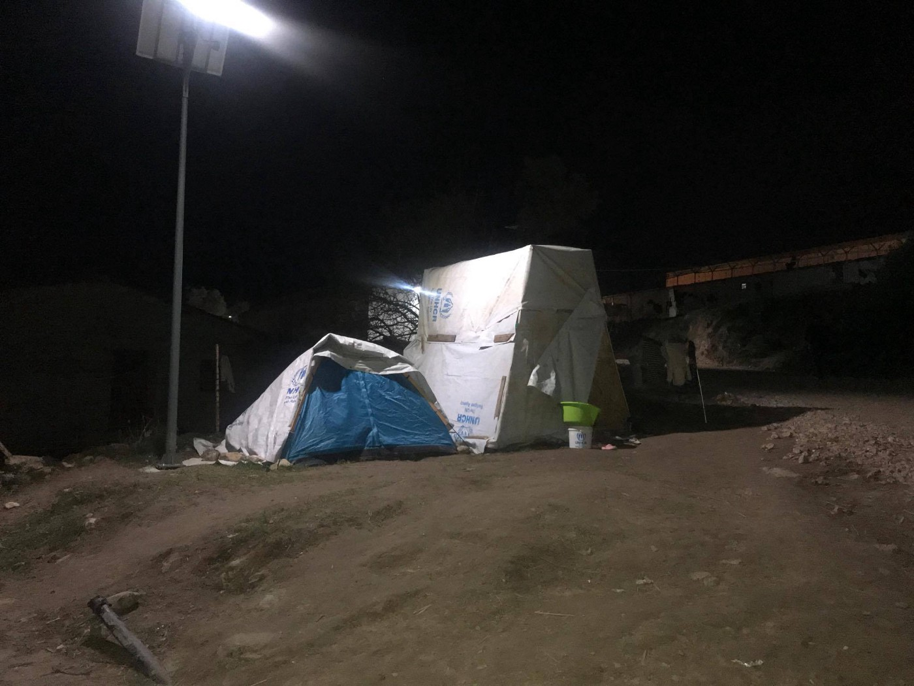

### AYS DAILY DIGEST 3/12/2017: Welcome to Europe\! \!

9\-year\-old child tried to kill himself in Chios, Greece // 15486 on Greek islands // 21 persons rescued after boat sinking near Morocco // People help people in Athens // Make\-shift camp in Chios // Protsts against deportation in Austria

Upon arrival to EU, many refugees are forced to stay out in the open, sleeping in shelters they have to build by them selfes\. This is Chios, Greece\. Photo Ruhi Loren\.
### Feature

Another reckless move by the Trump administration shook the world yesterday\. While having no desire to defend him, we must admit that his decision is as ugly and cynical as many of the policies implemented in EU countries towards refugees and migrants\. This time, the US administration decided to withdraw the country from a United Nations pact to improve the handling of migrant and refugee situations\. The explanation is that it is “inconsistent” with its policies\.

The document was adopted in September 2016, by the members of the UN General Assembly\. It is a non\-binding political declaration, and the countries pledged to uphold the rights of refugees, help them resettle and ensure they have access to education and jobs\.

US Ambassador Nikki Haley said the country would continue its “generosity” in supporting migrants and refugees around the world, but that “our decisions on immigration policies must always be made by Americans and Americans alone\.”

“We will decide how best to control our borders and who will be allowed to enter our country\. The global approach in the New York Declaration is simply not compatible with US sovereignty\.”

The decision came just before the opening of a UN global conference on migration, on Monday in Puerto Vallarta, Mexico\.

While the media in Europe are commenting on this Trump move, the reality is that the declaration is not binding for anybody, and that little has been done all over the world to meet the needs of refugees and migrants\. It is just another UN declaration whose purpose is not clear to anybody, since there is no way to make anybody follow the recomandations\.

Most of the EU countries are treating people with no respect, offering them little to no protestions for their most basic rights and needs, as our daily reports reveal\. Declarations and resolutions that are not implemented, are not binding and do not hold member countries accountbale for their actions\. While the US pulling out of this treaty may have little effect on the treamtent of refugees, it is another indication of growing hostility towards people fleeing war, and gives a green light towards further abuses\.
### Sea

It was another dramatic day in the Sea\. Early evening, [@alarm\_phone](http://twitter.com/alarm_phone) crew was informed about the boat between \#Morocco and \#Spain\. Apparently, 21 people were on the board when the boat sunk\. Miraculously, people swam to Morocco and at the end, everybody was safe\.

■■■■■■■■■■■■■■ 
> **[SALVAMENTO MARÍTIMO](https://twitter.com/salvamentogob) @ Twitter Says:** 

> > Respecto presunta patera sin rescatar con personas en el agua: Tras dejar al resto vivos en la orilla, 3 #personas siguieron en la #patera. Buscada inicialmente por unidades de ambos países, Marruecos asumió todas las operaciones cuando se supo que estaba en zona SAR marroquí. 

> **Tweeted at [2017-12-03 15:51:49](https://twitter.com/salvamentogob/status/937348657472593920).** 

■■■■■■■■■■■■■■ 

In the meantime, one of the rescue boats published a video showing how their operation looks like every day\.

### Greece

Devastating news from Greece\. According to the local media, a child 9\-years\-old tried to commit suicide in Vial, Chios\.

Local website [Politis](http://politischios.gr) reports that the boy from Syria tried to hang up him self\-using the sleeve of his blouse as an improvised loop\. Fortunately, he was saved at the last minute, and was immediately taken to the hospital “Skylitzio”\.

The media report that police confirmed the suicide attempt happen in the camp\. It is not clear what triggered the child to do this, but the living conditions in the camp certainly contributed\. Thousands are living in this overcrowded camp, some of them under summer pop\-up tents\. It is cold, dangerous and definitely not a place for children\. But those responsible are not doing enough to deal with this situation that persists for months now\.

Our friend [Ruhi Loren](https://www.facebook.com/ruhi.akhtar.7) , an independent volunteer, went to Vial only to find that about 400 people are living in tents\.

> “It’s windy and cold according to camp residents\. One brother told me it was so windy the night before his tent was shaking\. The communal showers and toilets are far and for the last two days, the water supplies have not been working\. There is also still people living outside on the streets next to the containers due to lack of space and in the woods\.” 

By Ruhi Loren, Vial\.

So far in November, a total of 2542 have been transferred from islands to the mainland\. The arrivals have slowed down, due to bad weather and this week on several days no arrivals were registered on any of the islands\.

AYS

[Tommy Olsen](https://www.facebook.com/tommy.olsen.336?fref=gs&dti=1652972374920129&hc_location=group) , a volunteer in Greece, registered that 67 boats have arrived on the Greek islands during the last month, with a total of 3175 people\. It is much less than month before when 112 boats arrived in total, with 4116 people\.

Currently, there are 15486 people stuck on the islands\.

AYS

Meanwhile, protest of a group of people in Lesvos entered its 50th day\. They ask better living conditions and faster asylum procedure, but none of it is happening so far\.

A good story from Athens where two refugees from Syria opened a shop [People for people\.](https://www.facebook.com/events/172498200003795/)

> “But who are we? We are two friends who were in the middle of a dream last year and together we had the idea of creating something that would help people in need\. Help for all people, refugees, homeless, immigrants, everyone\. But we had nothing, no means, only\. But now, a year later, we were able to create a dōristḗrio, a little shop that would provide clothes, shoes, blankets, etc\. and it would be open to all the people in need\. And we hope, of course, with your help that we will always have more things to give\.” 

The place is at Tuileries 28, in Metaxourgeio and everybody is welcome to visit\. If you have clothes to donate or want to help in any way, get in touch with them\. Or just go to the shop and show your support\.

[Humanitarian Support Agency \(HSA\)](https://www.facebook.com/HumanitarianSupportAgency/photos/a.127121260972590.1073741827.127098714308178/449652902052756/?type=3&theater) is looking for TEFL certified teachers to volunteer in Kara Tepe\.

[Lifting Hands International](https://www.facebook.com/groups/greecevolinfopoint/permalink/583683475296055/) needs volunteers with construction experience to help build a chicken coop at their site in Serres, Northern Greece\. They offer housing for 5 euros per night, dependent on availability\. For more info, please email [jessica\.basi23@gmail\.com](mailto:jessica.basi23@gmail.com)
### Italy

During winter, night [shelters in Como](https://www.facebook.com/comosenzafrontiere/photos/a.558048217690576.1073741828.558043977691000/813604712134924/?type=3&theater) will be open again, every night from 19:30 to 7\.00\. Admission is from 19:30 to 22:30 and Address are Centro Pastorale Cardinal Ferrari, Viele Battista 8\.

They are also looking for volunteers to help at this place\.
### Serbia

Rigardu team in Serbia needs help to continue working and provide mobile showers in Subotica\.

More info:
German: [https://www\.betterplace\.org/de/projects/58785](https://www.betterplace.org/de/projects/58785) 
English: [https://www\.betterplace\.org/en/projects/58785](https://www.betterplace.org/en/projects/58785)
### Austria

Deportations are still happening in Austria, despite constant protests from the public\.

A new victim of this cruel policy could be a [young Afghan man](http://www.nachrichten.at/oberoesterreich/muehlviertel/Asyldrama-in-Pabneukirchen-Das-ist-kein-Bescheid-sondern-ein-) , who has been living since 2 years in Austria\. Now, his asylum claims are rejected and he has to leave the country\. Over the last two years, he’s been pursuing professional training as a plumber and has advanced from an alphabet to graduating professional school — with lots of dedication and hard work\.

Colleagues and friends are planning to intervene and protest, the local priest has offered church asylum as a last resort

At the same time, another protest against deportation is being organized\.

[Stand up\! Resist\! Freedom of Movement for All\!](https://www.facebook.com/events/305252289967408/)

People will gather on 5th December 2017 at the Airport Schwechat Vienna to call for a stop of the planned deportation to Afghanistan in the night of 5 to 6 December\. The flight will probably be organized together with Sweden\. The protest is officially declared to the police\.

Important info for people with no EU\-passport:
1\. Your own safety is what matters most\! If you feel unsafe and do not want to join us for a public protest, there are many other ways to show your solidarity\!

2\. ID controls are allowed and can take place\!

3\. If the police declare the protest has to end by saying e\.g\. “die Kundgebung ist beendet”, please leave\. If you resist the official end of the protest, it can lead to legal consequences and bigger problems\.

4\. Please think about whether you want to bring your phone or shut it off\. In case of an arrest, the police might be able to access your contacts and records which could put you or your friends in danger\.
### Germany

Despite warning from different organizations not to encourage return of people to Syria, Afghanistan and other, where wars are still going on, the German government decided to do that\. [Interior Minister Thomas de Maiziere told newspaper Bild is Sonntag](http://m.dw.com/en/germany-floats-bonus-for-rejected-asylum-seekers-to-go-home/a-41629858) that the government want to encourage rejected asylum seekers to voluntarily return to their home countries with a cash incentive\.

“For years, Germany has provided rejected asylum seekers and others with financial help to return to their countries, including costs associated with travel and restarting life back home\. On top of that, de Maiziere said families can receive up to €3,000 \($3,570\) and individuals up to €1,000 if they voluntarily return home by the end of February,” DW reports\.

Ironically, the program is called “Your country\. Your future\. Now\!”

Journalists from [Irish Times](https://www.irishtimes.com/news/world/middle-east/the-road-back-to-damascus-the-syrian-refugees-who-want-to-go-home-1.3309941?mode=amp#.WiK0qSEG1Iw.facebook) recently published an investigation on a life of people who returned to Syria from Germany, writing about all the dangers people face with upon return\.
### France

French daily [Liberation reports](http://www.liberation.fr/societe/2017/12/02/a-ouistreham-l-errance-des-migrants-inquiete-et-mobilise_1614055) about 80 to 100 Africans who are living in the port of Ouistreham \(Calvados\), surviving thanks to donations from residents\. Here, as well as in many other parts of France, the police is trying to prevent people from forming camp or simple staying, while not offering any solution\.

“Badr, a 25\-year\-old Sudanese says “It’s hell\. Last night we could not sleep in the woods: it rained all the time\. But each time we tried to sleep somewhere in the city, the police told us to leave\. We do what they tell us\. But we didn’t sleep at all”\. Every night he tries to sneak onto a ferry to reach England\. Behind him, 15 volunteers from this city with 9,000 people distribute food every week,” Liberation reports\.

Like in Calais or Paris, police take blankets and phones from people, and according to volunteers from the collective helping migrants in Ouistreham \(CAMO\), they also used tear gas on them\.

Calais: Donation needed at [Meena Center](https://www.facebook.com/permalink.php?story_fbid=510336369340505&id=160982470942565) , and unofficial women and children’s center\.

> **_We strive to echo correct news from the ground through collaboration and fairness, so let us know if something you read here isn’t right\._** 

> **_If there’s anything you want to share, contact us on Facebook or write to: areyousyrious@gmail\.com\._** 

_Converted [Medium Post](https://areyousyrious.medium.com/ays-daily-digest-3-12-2017-welcome-to-europe-29259d37d515) by [ZMediumToMarkdown](https://github.com/ZhgChgLi/ZMediumToMarkdown)._
