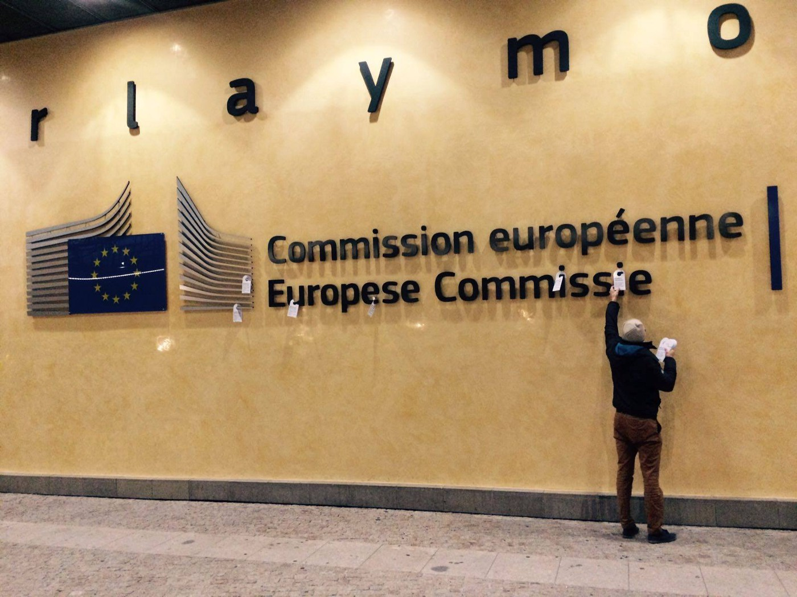

### AYS Daily Digest 06/12/17: Saying NO to indifference
#### Protests against deportations on the rise / UNHCR’s report reveals much higher numbers for sexual abuse in Syria and detention centres / Greece starts slow and symbolic process of moving people from the islands to the mainland / Help and solidarity are crucial during winter in the border areas, north of France and the big cities / Belgians against the indifference / Is Austria about to start deporting to Bangladesh? and more…

 **\)**](assets/4262953c7e1a/1*GqgyObpH8XM0x4QPFCa9gQ.jpeg)

“Stop the indifference\!” — In front of a detention centre in Belgium \(Photo: [**Sophie Devillé**](https://www.facebook.com/sophie.deville.58) **\)**
#### FEATURE

Undivided support and solidarity were visible at Terminal 1 of Frankfurt airport on Wednesday evening when about 500 people gathered to protest loudly the announced deportation of 27 people to Afghanistan\.

■■■■■■■■■■■■■■ 
> **[NoBorder_Ffm](https://twitter.com/noborder_ffm) @ Twitter Says:** 

> > Mehrere hundert Leute auf lautstarker #demonstration  am Flughafen Frankfurt gegen #Abschiebung/en nach #Afghanistan. Aufgerufen hat das Afghan Refugees Movement. https://t.co/pWskUVwt0o 

> **Tweeted at [2017-12-06 18:55:38](https://twitter.com/noborder_ffm/status/938482078689185792).** 

■■■■■■■■■■■■■■ 

Afghan authorities confirmed the planned arrival of a deportation flight for Thursday morning in Kabul\.
Since December 2016 Germany has sent 128 people back to the country of origin via forced deportations\.

■■■■■■■■■■■■■■ 
> **[IL Rhein-Neckar](https://twitter.com/ILRheinNeckar) @ Twitter Says:** 

> > Jetzt am #Flughafen #Frankfurt. Demo gegen weitere grausame #Abschiebung nach #Afghanistan #RefugeesWelcome #ProAsyl #Asyl https://t.co/PzJBmbPF4e 

> **Tweeted at [2017-12-06 18:27:17](https://twitter.com/ilrheinneckar/status/938474945297993729).** 

■■■■■■■■■■■■■■ 

Germany officially claims that only refugees with a criminal record are deported to Afghanistan\. This is far from the truth, [c](https://l.facebook.com/l.php?u=http%3A%2F%2Fwww.spiegel.de%2Fpolitik%2Fdeutschland%2Fabschiebung-nach-kabul-vom-ausbildungsplatz-in-den-abschiebeflieger-a-1181980.html&h=ATPbtoKy5axszwaeVyqB81Dw8q_lGuTMf1_AGrDdfpGOyN0WF-C9H_wTxr0SiS3GWcCDXMXrqT9NmNpCPMREAkNR0HvWISdDwxYjf46eu1mkt0r3EI4dOaXLwxF243FgFSfHc1tZc1ptIIFTRyjZ_aY429nj3RP2zLijIq_OqBFxfZY_biRCT77vU0ehA8DTdDqeXtYs-6crmT3c3WD5ynfBxKpZ534sw7gqUXG8bcpjhQp64M5mMkQWAYFjMBo2) [laims](http://www.spiegel.de/politik/deutschland/abschiebung-nach-kabul-vom-ausbildungsplatz-in-den-abschiebeflieger-a-1181980.html) Bayerischer Flüchtlingsrat\. 
Nine out of the 20 Afghans who were deported today are from Bavaria\. Two of them have records that prove them to be offenders against the law\. The crime of the other seven is probably “not to have cooperated enough to clarify their identity”, say the activists\. One man showed his identity papers from Afghanistan “too late”\. The list of deportation candidates included two young men who, in the opinion of refugee activists and lawyers, are not in any of the three categories mentioned — including a young man who was to be deported from his training program in Bavaria\. According to a previous agreement, apprentices should not be deported during apprenticeship or for the following two years since there is a deficit of qualified workers in Germany\. It is not known why this was not applied in his case\. Bavaria reportedly has the most strict interpretation of the agreement on who should be deported\.

](assets/4262953c7e1a/1*3FCjaXyhAjsu73wpbEQKEg.jpeg)

Photo: [**Fabian Scheuermann‏**](https://twitter.com/ScheuermannF)
### SYRIA
### Widespread rape of boys and men — a [report](http://www.unhcr.org/news/latest/2017/12/5a27a4e04/male-rape-sexual-torture-widespread-syria-crisis-report.html)

Men are usually not considered to be “vulnerable” in whatever context — be it the Greek islands, Lebanese camps, reception centres in Europe or the program sheet of an NGO\. However, it is young boys and men who often bear the biggest stigma in society\. Unfortunately, along with war and fighting, their suffering continues in their countries of origin\. UNHCR has presented results and statistics related to the growing question and problem of sexual abuse\. Victims have accused armed groups within Syria of carrying out mass rapes, with sexual violence often occurring in detention or prison facilities\. One focus group of refugee women in Jordan estimated that between 30–40 percent of the adult men in their community were victims of sexual violence while in detention in Syria\.

Many have described shocking torture while in detention, including weapons being used as tools of rape\. The report noted that there is concern that the high rate of child labor among Syrian refugee boys, which, for example, is 94 percent in Jordan, leads to sexual exploitation and rape\. Refugee boys and men have reported that some employers refuse to pay wages until sexual acts are performed\. It has also been found that boys in countries of refuge are often targeted by older youths, with accounts of rape occurring in refugee communities on a daily basis\.
#### GREECE

### It is a European, not just a Greek, responsibility

> The Greek government needs to spell out to its European partners what it requires in terms of concrete support immediately to improve reception conditions and the operations of its asylum system\. 
 

> EU member states could in turn support Greece by continuing the relocation of recognised refugees from the Greek mainland, suspending Dublin returns to Greece,… 

Read more on the problems regarding the impact of the EU\-Turkey statement and its consequences in [the text](http://www.esiweb.org/pdf/ESI%20core%20facts%20-%20Greece%20Refugees%20Asylum%20-%2027%20Nov%202017.pdf) stating ESI view on the matter\.
### Overcrowded Lesvos needs help and volunteers

> We are in need of volunteers for the coming months, both for the North shore watch/response and for the warehouse to help with distribution at Moria\.
 

> It is possible to do both if you have the energy\.
 

> Please message me for more information\. — [_Philippa Kempson_](https://www.facebook.com/philippa.kempson.1?fref=mentions) 

■■■■■■■■■■■■■■ 
> **[MSF International](https://twitter.com/MSF) @ Twitter Says:** 

> > #Greece: These horrendous living conditions pose a critical risk to people’s health and lives #OpenTheIslands [msf.org/en/article/gre…](http://www.msf.org/en/article/greece-families-trapped-islands-brink-humanitarian-emergency) https://t.co/iiYyprvU1e 

> **Tweeted at [2017-12-06 14:13:05](https://twitter.com/msf/status/938410971151794177).** 

■■■■■■■■■■■■■■ 

> For the second consecutive winter, Greek authorities are trapping thousands of men, women and children on the Greek islands leaving them on the brink of a humanitarian emergency — [_says_](http://www.ekathimerini.com/223915/article/ekathimerini/news/fresh-warnings-as-migrants-face-daunting-winter-on-islands) MSF 

The dangerously overcrowded Moria camp on Lesvos has resulted in a wide range of serious consequences to people’s health and wellbeing\.

■■■■■■■■■■■■■■ 
> **[Saima Hassan](https://twitter.com/ClicksandCauses) @ Twitter Says:** 

> > #Refugees in MoriaCamp can't #eat food given inside- it is #inedible, makes them #sick, they hv to wait #3hours in a line for it, &amp; there is #neverenough quantities for #7000 people #trapped inside
#opentheislands #refugeeswelcome #safepassage
#RefugeesGr
[instagram.com/p/BcX60e0HrU3/](https://www.instagram.com/p/BcX60e0HrU3/) 

> **Tweeted at [2017-12-06 20:27:54](https://twitter.com/clicksandcauses/status/938505298796597248).** 

■■■■■■■■■■■■■■ 

The situation on the island was already terrible, now it’s beyond desperate, [MSF warns](https://reliefweb.int/organization/msf) in their latest report:

> People’s psychological conditions are also shocking: in our mental health clinic we have received an average of 10 patients with acute mental distress every day, including many who tried to kill themselves or self\-harmed\. 
 

> The situation on the island was already terrible, now it’s beyond desperate\. 

■■■■■■■■■■■■■■ 
> **[MSF Sea](https://twitter.com/MSF_Sea) @ Twitter Says:** 

> > Amal is one of ~7,000 #people stuck in a center for max 2,300. She is speaking out from #Moria #Lesvos and asking for #dignity and #respect. #opentheislands https://t.co/uG4nRGrtaa 

> **Tweeted at [2017-12-06 14:03:05](https://twitter.com/msf_sea/status/938408457228734464).** 

■■■■■■■■■■■■■■ 

They have worked on an assessment and will propose additional support to Greek authorities in the coming days to improve water and sanitation conditions in Moria\.

■■■■■■■■■■■■■■ 
> **[MSF Sea](https://twitter.com/MSF_Sea) @ Twitter Says:** 

> > #Breaking: We opened a clinic to respond to the medical needs of children under 16 trapped in #Moria #Lesvos. These families should not stay here, they should be moved to better conditions in the mainland! #OpenTheIslands https://t.co/GnsrMYKquR 

> **Tweeted at [2017-12-06 07:36:41](https://twitter.com/msf_sea/status/938311215155236866).** 

■■■■■■■■■■■■■■ 

According to reports, the government plans to transfer about 3,000 people from Lesvos to the mainland by December 10, but all stakeholders, the most important being refugees and the volunteers and aid workers who are actually on the field, consider this to be not nearly adequate to tackle the problem\.
### Chios

230 people perceived as ‘vulnerable’ were transferred from Chios to Piraeus by ferry today\. They will later on be lodged in different places across Greece where the UNHCR runs reception facilities\. This is part of the official efforts made to contribute to easing the burden on the Aegean islands, [commented](https://l.facebook.com/l.php?u=http%3A%2F%2Fwww.amna.gr%2Fhome%2Farticle%2F211703%2F230-prosfuges-kai-metanastes-apo-eualotes-omades-taxideuoun-apo-ti-Chio-gia-Peiraia&h=ATOOKQ__CVzNB-sAZ-6OStgy7uc7H02Jpg1BuZ9PRfZc6EXBVEfWTZ_44NLht8hrGNyJEhMlNp-Pw-In-w6sUGUZmBQjsn5PTtQ8BsuWWH8Y5l20dGzYXh4WBaifsQgnOei6ekqeZg) the Greek media\. Many people continue to arrive to the islands, still the policies remain the same and more and more people are literally squeezed into inhumane spaces…

■■■■■■■■■■■■■■ 
> **[Terre des Hommes](https://twitter.com/TDH_IF) @ Twitter Says:** 

> > Last winter three refugees died trying to keep warm in freezing conditions on the Greek islands. It cannot happen again.

RT and tell @[tsipras_eu](https://twitter.com/tsipras_eu) to move EVERY person to shelter on the mainland!

[destination-unknown.org/winter-in-gree…](http://destination-unknown.org/winter-in-greece-last-years-cruelty-must-not-be-repeated/) #OpenTheIslands #RefugeesGR [twitter.com/guardiannews/s…](https://twitter.com/guardiannews/status/938346241854984192) 

> **Tweeted at [2017-12-06 18:56:00](https://twitter.com/tdh_if/status/938482171152441345).** 

■■■■■■■■■■■■■■ 

[Salvamento Marítimo Humanitario](https://www.facebook.com/smhumanitario/) is engaged in close\-to\-the\-shore search and rescue activities\. They **need doctors** with experiences in general health care and basic knowledge in emergency medicine to evaluate the conditions of those who arrive and to provide first aid\. 
Additionally, medical assistance is needed in the Vial camp\.
Food, housing and transport are covered\. Please, contact them directly if you fulfill the requirements and wish to give your time and make a difference\.
#### Updated situation on unaccompanied refugee minors in Greece \(statistical data as from November 30\) can be found: [here](https://reliefweb.int/sites/reliefweb.int/files/resources/61143.pdf)
### Cash assistance — overview

36,135 eligible refugees and asylum seekers \(16,410 households\) received [cash assistance in 111 locations in Greece](https://data2.unhcr.org/en/documents/download/61138) \. 44% of those are located in Athens, with 26% currently on the islands and a further 17% in Central Macedonia\.
Eligibility is assessed on the basis of one’s date of entry into the country, legal status and current location\. Of the 36,135 individuals who received cash assistance this month, 42% were children, 23% were women and 35% were men\. The amount of cash assistance distributed to each household is proportionate to family size\. It ranges between 90 euros for an individual in catered accommodation, to 550 euros for a family of seven members or more in self\-catered accommodation\.
#### SERBIA

](assets/4262953c7e1a/1*NiUJn5qRYQ6KEnGnTtZgIw.png)

In June 2016, as part of the “Solidarity” project, SOS Childen’s Village opened an IT corner and internet access at Miksalište\. Now, this corner has been transferred in the upper barrack, where educative workshops and games are held, so the refugees can access the computers and get the necessary information about their journey — [Refugee Aid Miksalište](https://www.facebook.com/RefugeeAidMiksaliste/?ref=gs&fref=gs&hc_location=group_dialog)
#### AUSTRIA
### A whole county protests the deportation of four young Iraqi men

The young men \(two pairs of brothers\) have been living in the county of Leogang \(3,300 inhabitants\) for several years, and were reportedly well integrated\. They work as volunteers, and some have jobs\. 
They might face death returning to Iraq, saying that several relatives were killed for political reasons\. 
After two of them received their denial, the county has been trying to help them by collecting money for the lawyer to appeal the decisions\.
### First Austria\-Bangladesh Charter coming up?

> From within the Bangladesh diaspora in Austria, there are many indications of an upcoming mass deportation\. Usually, there are individual deportations from Austria to Bangladesh, but none on chartered planes\. 

> We do not have any proof documenting this plan\. However, it seems there is a list of names of around 80 persons\. 

> They are being sought, some have already been arrested by the deportation authorities\. It seems Bangladesh´s Embassy is issuing ID documents for them, which are necessary for the deportation\. 

> Be Careful & Know your Risk\! 

> Even though the exact date as well as full information is yet be confirmed: Ask your legal adviser if you´re at risk of being deported \(Attention, VMÖ Verein Menschenrechte is NOT a real, independent legal advice service\) \! 

> In case you are under the threat of deportation: 

> Until we know the exact date of this deportation, and until we know it has passed: Don´t stay at your officially registered “Melde\-Adresse” and do not go where racist controls are common, such as at U6, Westbahnhof or Praterstern\. 

> Make good use of your time by taking the legal steps to obtain Asylum/a visa/a residency permit \(…\) together with your legal advisor/ lawyer\. 

> For the next few weeks, stay prudent\! Don´t get arrested\! — _source:_ [_No Border\. No Nation\. Stop Deportation\._](https://www.facebook.com/stopdeportation/?hc_ref=ART_IVyw3-0SemKfKS0WFsJ0UqeWJgCqR5FjreciArLZD736NgNMCz1XNrrKMA_3waI&fref=nf) 

#### ITALY

■■■■■■■■■■■■■■ 
> **[Open Migration](https://twitter.com/open_migration) @ Twitter Says:** 

> > 4 years ago, almost 300 people drowned when their boat capsized off Lampedusa. Now a father and mother who lost their four daughters in the tragedy seek justice before the Italian courts. @[LibertiesEU](https://twitter.com/LibertiesEU) interviewed their lawyer Arturo Salerni (@[progettodiritti](https://twitter.com/progettodiritti)) 👇 #openmigration [twitter.com/LibertiesEU/st…](https://twitter.com/LibertiesEU/status/938339057515552770) 

> **Tweeted at [2017-12-06 10:26:08](https://twitter.com/open_migration/status/938353857637347328).** 

■■■■■■■■■■■■■■ 

_But instead of coming to the rescue after a Syrian doctor’s frantic SOS calls to the Italian coastguard, Italian and Maltese maritime authorities argued over who was responsible for dealing with the emergency\. As more and more water rushed into the fishing boat, which held more than 400 people, the Italian Navy boat Libra idled close by, awaiting clear orders from Rome to intervene\._ 
_A famous Italian lawyer is representing [a married couple from Syria who lost their four little daughters in the shipwreck](https://l.facebook.com/l.php?u=https%3A%2F%2Fwww.liberties.eu%2Fen%2Fnews%2Fdarkest-moments-in-europe-interview-2013-lampedusa-shipwreck%2F13736&h=ATPE24_qk3eU4RdkpqeAu6LWyWEUqZyhXVe8Hak5wUHDOkQI7LArjHerp5GtbFH1quOOcEWtTgwONKc6hDKsDgiLzDXJl1c5tB8fF7oCXE6P57hg25HLVvrVn-ZvgyJBRUKwnr_-dBip0Xa541C7iXV3c1Lo1QobFnxFlyRVPGpCVXiMkRl97GNuOUVBXmyj9EslpRSjUqorvTmZqODD1fHkU1BXez-9kGSTnYFyCASCb2zYaug_y-duTThXnqlbInXlxuTYMDZpyknuB2wJU7uqd-U) \._
### Ventimiglia / France

Donations needed for refugees staying outdoors in Ventimiglia:
Winter clothes for men, blankets, sleeping bags, hygiene articles, cell phones/chargers/SIM\-cards, food, tea, water, plastic plates/cups, medication\. Donations can be dropped of in Ventimiglia, Nice or Grasse\.

](assets/4262953c7e1a/1*YE7OZkNr5Dr-Z_QeNJ8heA.jpeg)

Infoleaflet source: [**Teresa Maffeis**](https://www.facebook.com/teresa.maffeis)
#### FRANCE

[L’Auberge des Migrants](https://www.facebook.com/LAuberge-des-Migrants-358496450338/) is printing their logo on the sleeping bags and blankets they distribute due to confiscations, and they plan to claim their ownership if and when it happens that these are taken from the people they lend them to\.

Médecins du Monde will also distribute blankets and sleeping bags today in the Calais area\. Anyone who wants can sign a “loan agreement” — which means if the goods are confiscated by the police, as happens almost daily, the refugees/associations have the legal basis on which to request the return of their belongings\.

](assets/4262953c7e1a/1*Ggvc-PNnK1ynQVISIQdTFw.jpeg)

Photos: [**Médecins du Monde Hauts\-de\-France**](https://www.facebook.com/M%C3%A9decins-du-Monde-Hauts-de-France-850170168369696/?ref=gs&fref=gs&hc_location=group_dialog)

Ten containers for sleeping and one bathroom container are being installed in Saint\-Omer in the North of France, close to the showers which were installed earlier in September this year, to give shelter during the winter for refugees\. [Reportedly,](https://l.facebook.com/l.php?u=http%3A%2F%2Fwww.lavoixdunord.fr%2F274744%2Farticle%2F2017-12-05%2Fle-retour-de-dix-conteneurs-de-l-ancien-camp-humanitaire%23utm_medium%3Dredaction%26utm_source%3Dfacebook%26utm_campaign%3Dpage-fan-calais&h=ATOj_2oUkg480SS45yRBuDyphEI0cV2B3z11PGeNa1_2bm4LYo2ujoTqW9jDrDjmXpmGjcSB0QNGlCj1P0eGhXL7-1gIcOQpYlfTUW17G6NHv3ThOONpNyde2ioFsrHSbuNKOnDJbB0qU-xil5Z00-6BHVLJ5Wl4CqMH9ZwCMZIU9k6cEdpJLHCEqVJOWDfyLPPM4Z1ylkJqenoWD4ZQjsC8cdQlNGMFNCufSPkPISp8H1Ldv1yNBCWgJ0dEhGGS) there is also a hangar in Zone des Dunes, that will be used as a shelter if temperatures drop\.
### Medical help is needed in the north of France

[Dunkirk Refugee Women’s Centre](https://www.facebook.com/refugeewomenscentre/?hc_ref=ARTZHjBcPKj6rq3ovyEg2YRWoaOZ5YPv3ahdGXx4WfGT7gXLHH5FwXMmTk4ha5hPPks&fref=nf) is sharing a shout out to anyone with medical skills and a desire to use them to help refugees on the ground in Dunkirk/Calais\.

> _In our daily work we come across numerous conditions suffered by those who are now living at the mercy of a bitter winter, police violence, and chronic fatigue\._ 

> _We rely on other organisations on the ground to be able to provide medical support, such as the fantastic FAST team who come three times a week\. If you have time and skills to offer \(including a First Aid course\) please sign up/get in contact via their website: [http://www\.f\-a\-s\-t\.eu/](http://www.f-a-s-t.eu/)_ 

#### BELGIUM

Although people pretend nothing happens at Parc Maximilien in Brussels, on this Tuesday alone—361 people found shelter there\.
Men, children, women, a young man who was barefoot, another who was bitten by a police dog, some without jackets, some in tears because their brother was arrested and taken away …\. 
The team of HÉBERGEMENT PLATEFORME CITOYENNE finished their solidarity activities and left the Park at 2:30 in the morning after an exhausting evening/night\. \. :

](assets/4262953c7e1a/1*b11w49lC4hx3TPxE7d1Iig.jpeg)

Photos: [Plateforme citoyenne de soutien aux réfugiés Bruxelles](https://www.facebook.com/plateformerefugiesbxl/?ref=gs&fref=gs&hc_location=group_dialog)

](assets/4262953c7e1a/1*ghZk0vdINi8JMC3AUKsE-g.jpeg)

Photo: [Plateforme citoyenne de soutien aux réfugiés Bruxelles](https://www.facebook.com/plateformerefugiesbxl/?ref=gs&fref=gs&hc_location=group_dialog)

More than 25,000 door hangers were distributed in Belgium to request a change of migratory policies — to support our friends in Belgium\!

](assets/4262953c7e1a/1*vrvSne0v59wfj1rto6v9mw.jpeg)

Photos: [Tout Autre Chose](https://www.facebook.com/toutautrechose/)

[**Belgium Kitchen**](https://www.facebook.com/BelgiumKitchen/?hc_ref=ARRjwmGFCo4HPLBE3RdDY_OrfrOFLRk_QZI3Z0YDJOokcB-vqoiytv31je5eECMoZok&fref=nf) continues to cook every day and their stocks are running down\. Here is a list of the items they need\.
**You can drop them off every day between 2 and 9pm at Avenue Van Volxem 2 in Forest** \.

> List of donations: 

> Bread
 

> Onions
 

> Potatoes
 

> Eggs
 

> Oil
 

> Cheese slices
 

> Peas carrots
 

> Coffee
 

> Sugar
 

> Plastic spoons
 

> Fruits🍓
 

> courgettes
 

> Tomatoes
 

> Cucumbers
 

> Eggplant
 

> peppers
 

> Chillies
 

> Lemons
 

> Ginger
 

> Garlic
 

> Peanut paste
 

> Tuna
 

> Milk \(large bottles and small crackers\)
 

> Juice bottles
 

> Biscuits, waffles, snacks 

> Shampoo
 

> Dishwashing liquid
 

> Laundry detergent
 

> Maintenance products and materials
 

> Garbage bags for household waste \(white\)
 

> Women’s hygienic protection individually packaged for BruZelle 

> wipes
 

> Lange for baby size 5
 

> Baby bottle with nipple
 

> blankets
 

> Sleeping bags
 

> socks 

> kettles
 

> Electrical insulation
 

> Bunk beds
 

> One person mattress 

> What we do not accept or accept for the moment: 

> Salt
 

> Tomato sauce
 

> Spaghetti
 

> Women’s Hygiene
 

> Toothpaste and toothbrushes
 

> Soap
 

> Shaver
 

> Foam
 

> pharmaceuticals
 

> Compress, Bandage, Dressing
 

> Clothing
 

> Children’s toy
 

> Kitchen utensils, tableware
 

> Tea
 

> Canned fruit
 

> Semolina
 

> Couscous
 

> rusks
 

> Canned, brick or instant soup
 

> Oatmeal
 

> Corn Cake
 

> The remains of the events 

> We can not push back the walls and we want to avoid all kinds of waste, that’s why we refuse certain gifts\. We thank you for your involvement and for your understanding\. 

> To help us in water, gas and electricity bills:
 

> BE71 7506 7226 9069
 

> Or
 

> [https://chuffed\.org/project/belgiumkitchenincalais](https://chuffed.org/project/belgiumkitchenincalais) 

#### GERMANY

On 6 December 2016, the German Institute for Human Rights published its second annual [report](http://www.institut-fuer-menschenrechte.de/fileadmin/user_upload/Publikationen/Menschenrechtsbericht_2017/Human_Rights_Report_2017_Short_version.pdf) on the human rights situation in Germany\. The topics, among others, included “Organising everyday life in communal accommodation facilities in conformity with human rights principles” and “Refugees with disabilities: Identification, Accommodation, and Care”\.
#### SWEDEN

A government amendment which [came into force](https://www.migrationsverket.se/Om-Migrationsverket/Nyhetsarkiv/Nyhetsarkiv-2017/2017-12-01-Lagandring-1-december-gallande-aterkallelse-av-arbetstillstand.html) on Friday will prevent foreign workers from being deported over mistakes in their paperwork if these mistakes are corrected before they are picked up by the Migration Agency\.
Read more [here](https://www.thelocal.se/20171206/law-change-aimed-at-reducing-deportations-of-foreign-workers-criticized-as-not-enough) \.

**_We strive to echo correct news from the ground through collaboration and fairness\._**

**_Every effort has been made to credit organizations and individuals with regard to the supply of information, video, and photo material \(in cases where the source wanted to be accredited\) \. Please notify us regarding corrections\._**

**_If there’s anything you want to share or comment, contact us through Facebook or write to: areyousyrious@gmail\.com_**

_Converted [Medium Post](https://areyousyrious.medium.com/ays-daily-digest-06-12-17-saying-no-to-indifference-4262953c7e1a) by [ZMediumToMarkdown](https://github.com/ZhgChgLi/ZMediumToMarkdown)._
