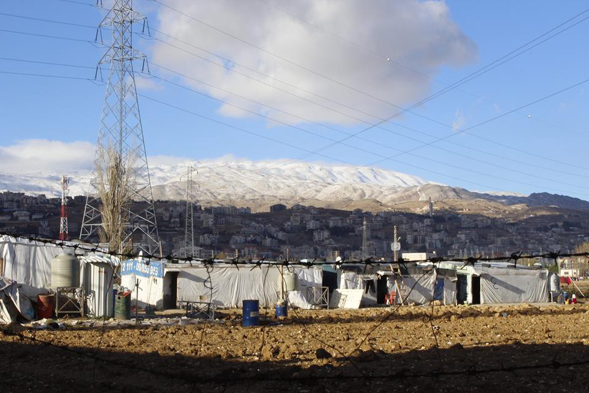
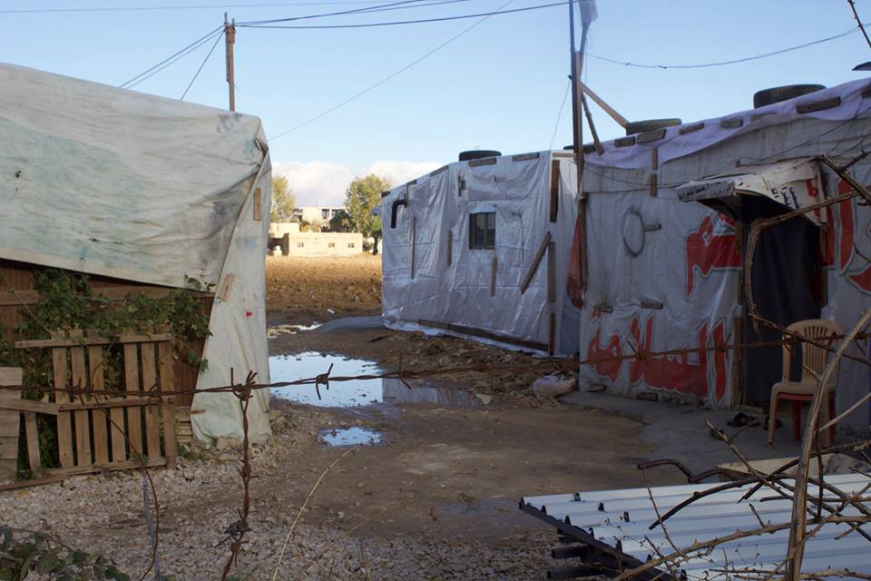
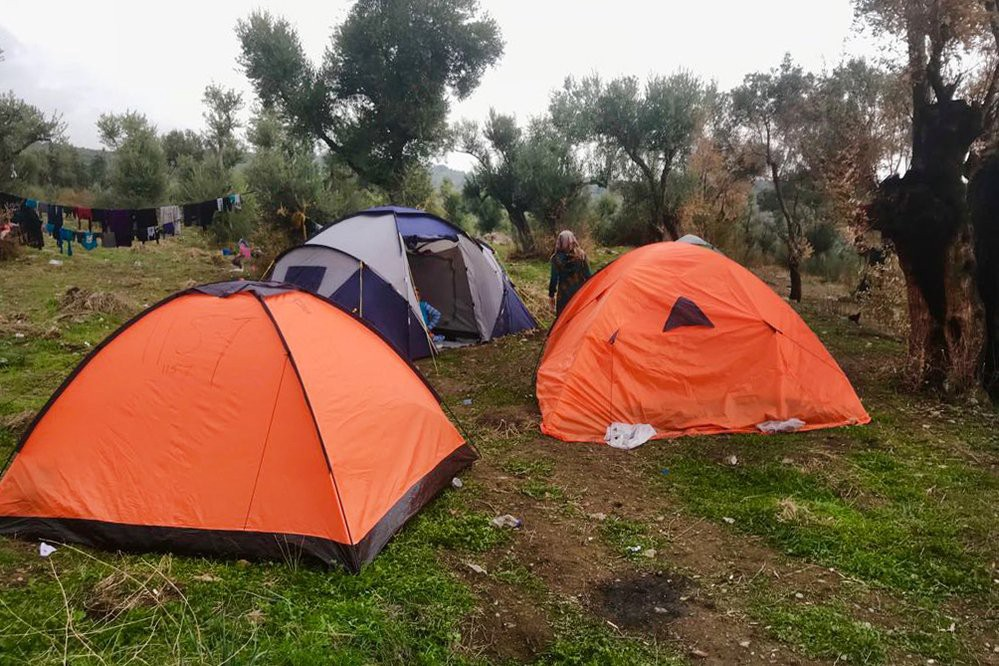

### AYS Daily Digest 07/12/17: EU takes Czech Republic, Hungary, and Poland to the Court of Justice

Commission proposal for a EU Agency for Asylum / Moving to mainland Greece / Islands on the verge of another crisis / Ventimiglia — Calais of Italy / New pressure to alter Denmark’s family reunification rules

“It’s freezing cold in Beqaa now\. There is snow in the mountains and people are living in tents\. The temperature has been dropping this week and yesterday heavy rain was falling\. The puddles on the ground are getting bigger and bigger\.” Photo: AYS
### FEATURE

The European Commission is suing eastern member states for failing to fulfill their legal obligations in accepting their share of asylum seekers, DW [reports](http://m.dw.com/en/eu-sues-czech-republic-hungary-and-poland-over-low-refugee-intake/a-41691870) \.

160,000 refugees were supposed to be relocated across most of the bloc’s 28 member states to ease the burden on Greece and Italy, meaning the three eastern nations would have to settle around 8,000 migrants between them as part of the quota\. So far, Hungary and Poland have taken in none at all, while the Czech Republic has accepted a mere 12\. [Here](http://m.dw.com/en/the-eu-migrant-relocation-and-resettlement-scheme-what-you-need-to-know/a-40378909) is a more detailed analysis of the relocation scheme and the failure to implement it\.

“The replies received were again found not satisfactory and three countries have given no indication that they will contribute to the implementation of the relocation decision,” EC [stated](http://europa.eu/rapid/press-release_IP-17-5002_en.htm) \. The mentioned countries could face heavy fines if they do not comply with a court ruling on their duty to accept refugees\.
### EU
#### Commission proposal for a EU Agency for Asylum

Preliminary agreement on a EU\-wide asylum agency has been reached between co\-legislators, while work on a technical level is still required\. The proposal should be adopted by March 2018, EASO \(European Asylum Support Office\) [writes](https://twitter.com/easo/status/938741151158456320) \.

“The EU needs a robust and effective system for sustainable migration management for the future\. The weaknesses in the design and implementation of the current EU asylum system have led to differing treatment of asylum seekers and varying recognition rates across the EU\. These divergences encourage secondary movements and abuse of the rules\. The procedures are also too complex and lengthy and the system overall leads to disproportionate pressure being put onto the Member States of first entry\.” An EC factsheet explaining what the new rules will mean in practice can be read in full [here](http://The European Asylum Support Office) \.

](assets/b3a63798ddd4/1*-pHr61TXK3G9QoUGOC28mQ.jpeg)

Source: [EASO](https://twitter.com/easo/status/938741151158456320)
### LEBANON

A big fire broke out in Beqaa this afternoon, burning down a whole settlement and taking the lives of at least eight people\. Children are believed to be among the dead\. The number of second\-time displaced people are still unknown, but it could be in the hundreds\. Red Cross, among other emergency response teams, have been on site\. Not much is known right now and a more nuanced update will follow tomorrow\.

It’s freezing cold in Beqaa now\. There is snow in the mountains and people are living in tents\. The temperature has been dropping this week and yesterday heavy rain was falling\. The puddles on the ground are getting bigger and bigger\.

One of thousands of settlements in the Beqaa valley, Lebanon\. Photo: AYS
### TURKEY

The Turkish Coast Guard Command recently published comprehensive [statistics on arrivals](http://www.sahilguvenlik.gov.tr/baskanliklar/harekat/faaliyet_istatistikleri/duzensiz_goc_istatistikleri.html) in all seas surrounding Turkey, comparing the years 2016 and 2017\.
### GREECE
#### Urgent call for medical volunteers on Chios

SMH, guardians of the shores of Chios, ensuring that refugees receive appropriate medical aid and screenings upon arrival, needs medical volunteers \(general practitioners or emergency specialists\) between December 15th and January 15th\. Besides landings, duties include being on call at the Athena Centre for Women and Vial\. Volunteers should write to sanitario\.smh@gmail\.com\.
#### Refugees being moved to mainland

Some 1,000 refugees and migrants belonging to vulnerable groups are set to be removed on Saturday from camps on the eastern Aegean islands of Lesvos, Chios, and Samos\. The transfer is part of the Migration Policy Ministry’s efforts to remove as many vulnerable refugees and migrants — including seniors, disabled people, families with children, and women — from the islands as possible, Ekathimerini [writes](http://www.ekathimerini.com/223972/article/ekathimerini/news/around-1000-refugees-to-be-transferred-to-mainland) \.

MSF [said](http://www.ekathimerini.com/223936/article/ekathimerini/news/islands-boiling-over-as-winter-arrives) the situation is on the brink of a humanitarian crisis\. Since last week, MSF set up operations outside the Moria camp in Lesvos, offering assistance to those in need in cooperation with the Hellenic Center for Disease Control and Prevention \(KEELPNO\) \. The harsh conditions and the cold are posing a serious threat to the health of the some 7,000 people that remain at the Moria hot spot\.

In Samos, 1,500 people live in a camp designed for only 700\. Hundreds are sleeping in summer tents without any heating and with poor hygienic conditions, MSF [writes](https://twitter.com/msf_sea/status/938797806021685248) \.

Samos, source: MSF

According to [media reports](http://www.kathimerini.gr/936349/article/epikairothta/ellada/san-na-sprwxnoyme-ena-voyno-me-gymna-xeria) , 40% of the refugee population at the Moria hotspot are children \(UNHCR estimates them to be at 20%\) \. At the hotspot in Vathi, Samos, children are believed to make up 30% of the population\. Based on data from UNHCR, 36\.8% of the 27,245 new arrivals in Greece this year were children, RSA [writes](http://rsaegean.org/refugee-mothers-without-enough-milk-and-diapers/) \.

■■■■■■■■■■■■■■ 
> **[Michael Bakas](https://twitter.com/mibakas) @ Twitter Says:** 

> > Tonight at #Moria, boy from Syria sleeping tonight at tent, trying to warm his hands over fire #opentheislands #refugees #Refugeesgr https://t.co/6clhp2aVNW 

> **Tweeted at [2017-12-07 20:25:21](https://twitter.com/mibakas/status/938867044690391045).** 

■■■■■■■■■■■■■■ 

Just when RSA published a distressing [text](http://rsaegean.org/refugee-mothers-without-enough-milk-and-diapers/) about milk and diaper shortages, City Plaza writes that they too are in urgent need of baby milk powder No1 and evaporated milk\.

> Social workers stress that donations do not suffice\. Some bigger NGOs may provide limited numbers of these items otherwise mothers have to buy them themselves using their little monthly credit of their cash cards, which they receive as financial aid \(150 or 90 Euros per person according to their place of stay and if they get catering or not\), but in many cases this amount is not enough to cover their monthly needs\. Even in the ‘social pharmacies’ [\[1\]](http://rsaegean.org/refugee-mothers-without-enough-milk-and-diapers/#_ftn1) in Athens to which some of the mothers resorted, the deficiencies in nutritional supplements for babies are enormous\. The supply depends on the number of donations\. Shortages are also observed in Northern Greece with large organizations not being able to meet the needs\. —  [_RSA_](http://rsaegean.org/refugee-mothers-without-enough-milk-and-diapers/) 

#### Latest arrivals

Three more boats arrived on Greek shores since yesterday evening\. Two to Lesvos, carrying nine and 82 people, and one to Chios with 71 people, among them 38 children\! Among those on the boat to Lesvos with 82 people were four medical cases that had to be taken to the hospital\. The boat to Chios was saved by HCG after its engine stopped working and the sea was getting rough\.

](assets/b3a63798ddd4/1*-Rxi5uGMhTnkAG5oX0UoiA.jpeg)

Yesterday night around 9 o’clock a small boat came with 9 people\. Nationality Afghanistan\. They came in a small wooden boat, which is quite unusual\. They were rescued by the Portuguese frontex and transferred to the port of Skala — [Refugee 4 Refugees](https://www.facebook.com/Refugee4Refugees/)
### SEA

There are reports of another rescue this afternoon in Alboran, in which 33 people \(among them five women and three children\) on board were saved by the Guardamar Polyhymnia\. Another five rafts were rescued by patrol boats from Morocco in Alboran\.

55 more people were rescued roughly 28 miles off Fuengirola\. They were spotted by the vessel Atlantic Moon and collected by Salvamar Alnitak, which took them to Malaga\.

■■■■■■■■■■■■■■ 
> **[SALVAMENTO MARÍTIMO](https://twitter.com/salvamentogob) @ Twitter Says:** 

> > Imagen del rescate esta tarde en Alborán de las 33 personas de la patera por la Polimnia https://t.co/59mjNwLKzh 

> **Tweeted at [2017-12-07 17:53:51](https://twitter.com/salvamentogob/status/938828918752194560).** 

■■■■■■■■■■■■■■ 

### LIBYA

The Security Council referred to reports of migrants being sold into slavery in Libya at today’s Council meeting\. They condemned it as heinous abuses of human rights and possible crimes against humanity, and called for those responsible to be held to account\. The Council also welcomed statements by the African Union calling for an immediate end to such practices and by the United Nations Secretary‑General requesting United Nations actors to actively pursue the matter\. Reaffirming support for the Action Plan for Libya, the Council emphasized that a stable Libya was the only way to help improve the living conditions of all people in the country, including migrants, ReliefWeb [reports](https://reliefweb.int/report/libya/security-council-presidential-statement-condemns-slave-trade-migrants-libya-calls-upon) \.

Read the full text of the presidential statement [here](https://reliefweb.int/report/libya/security-council-presidential-statement-condemns-slave-trade-migrants-libya-calls-upon) \.

Journalist and advocate [Meron Estefanos](https://twitter.com/meronina) wrote today that she has spoken to refugees who are being held as hostages by smugglers in Libya, saying there are over 1,000 hostages\. Among them are 200 women, children, and some who have paid ransom four times\. Estafanos heard that some have not had any food or water for five days\. Many of them are sick and so far four have died, she says\.
### ITALY
#### Ventimiglia

The mayor of the Italian border town of Ventimiglia — dubbed ‘the Calais of Italy’ — said the situation is now extreme, and can only be solved through reform of the Dublin Convention\. Ioculano said a response to the consequences of the migration crisis “can only be provided” by the EU as a whole, and called on European countries “to do their part” in the framework of a future system of shared responsibility for asylum seekers, EU Observer [reports](https://euobserver.com/migration/140185) \. Proper functioning of the current Dublin Regulation is “impossible,” said S&D MEP Brando Benifei\. There are over 600 asylum seekers currenly in Ventimiglia\. There are “shortcomings in the overall management,” and a worryingly high number of children, he added\.

A high numbers of migrants who try to cross the border with France are rejected by the French authorities, and sometimes try to cross illegally, often taking dangerous routes\. Stuck either in a Red Cross camp or in an illegal camp by the river in Ventimiglia, migrants live in sort of legal and human limbo\.

SolidariTea, active in Ventimiglia, needs help with funding as well as a place to park their van\. Please help if you can or spread their [call](https://www.facebook.com/refugeesolidaritea/posts/1212343188867435) \.
#### Pordenone

The public prosecutor’s office has received the situation of the people, above all asylum seekers, living outside in this cold period\. A group of 15 people and the migrants’ association have delivered it, raising the case and asking whose responsibility this was\.

“The situation has been going on for years — the authors explain — and it worsened after the denial for the opening of a dormitory, free for the community, offered by the Red Cross, and the fact that no solution with dignity has been found, irrespective of the cold weather\.”
These are the reasons for the petition to the public procescutor’s office: it is asked if it is anyone’s responsibility, and if the lack of rescue and of right to receive are in place\.

32 people are currently waiting to enter the hub, plus other 15 people that fall out of the perimeters of the project, i\.e\. that have concluded the receiving period\. Last year, the municipality, the parishes, and the associations had found a solution for the people lacking a shelter, but this year this did not happen in part due to a higher number of arrivals\.

In the last weeks, the number of homeless people was reduced\. The police headquarters are, however, overwhelmed with their work, and the meetings for the formalization of the asylum request take longer — some of the applicants will be received only in March 2018\. Moreover, some people have appealed against the decision of a refusal, and their appointments shifted from August to December to a date to be confirmed\.
#### Demonstrations planned

On December 16th there will be a demonstration in Gorizia against inhumane reception policies and the mistreatment of migrants\. Find more information on the event [here](https://www.facebook.com/events/169145683681893/?ti=icl) \.

A demonstration is also being held on the same day in Rome\. You can find out more [here](https://www.facebook.com/events/336431463489907/?ti=icl) \.
### SERBIA
#### Krnjača camp football club

Next Tuesday, December 12th, at 14:00, RAS representatives will be waiting outside Krnjača camp to take any interested refugees to their first of a series of regular football sessions in Belgrade\.

Anyone interested can contact rhys\.hartley\.ras@gmail\.com or send [Refugee Aid Serbia](https://www.facebook.com/refugeeaidserbia/posts/1962256870764162) a Facebook message\. Spread the good news\!
#### An evening of solidarity and discussion with Refugee Aid Serbia

Lazara Marinkovic’s VICE documentary, “City within the City: Abdul’s Story,” will be screened \(in Serbian and English\) this Sunday to commemorate the struggle of the more than 60 million displaced people around the globe on World Human Rights Day\. After the documentary follows a video\-message from Abdul, where he talks about the continuation of his journey towards a life in peace and dignity\. There will also be the possibility to discuss with Lazara, the Serbian photojournalist who made the documentary and who became an advocate for refugee rights\. Find more on the event [here](https://www.facebook.com/events/146026359496473/) \.
### FRANCE
#### Nantes

Since November 26th, students have occupied the castle of Tertre in Nantes\. The building, belonging to the University, was occupied with participation from and in solidarity with refugees\. The trigger for action was Nantes’ left\-wing local government’s refusal to house refugees, many of whom are unaccompanied children, instead leaving the fully functioning building capable of giving shelter to hundreds of people empty, Freedom News [writes](https://freedomnews.org.uk/nantes-students-and-refugees-occupy-the-castle-of-tertre/) \. The university’s press releases had prior suggested that, contrary to evidence otherwise, there were no young homeless people on the streets of Nantes, sparking outrage among the students\.

The situation of the refugees dramatically deteriorated recently due to the freezing conditions\. In addition, French police destroy every tent or shelter they can find, confiscate blankets and sleeping bags, or spray them with CS gas to render them unusable, the students add\.
#### Legal advice available via WhatsApp

If you have a problem and you would like to talk to a lawyer about it, you can do it via your WhatsApp this Saturday\. Find more information and register for a session [here](http://www.ref-asso.org/legal-aide/) \.
### DENMARK
#### Family reunifications

According to the current reunification scheme, refugees given asylum must wait three years before they are eligible for their families to join them in Denmark\. The new demands made by the Danish People’s Party leader Kristian Thulesen Dahl would represent a fundamental change in Denmark’s asylum policies\. Prime Minister Lars Løkke Rasmussen appeared on Thursday ready to change rules on family reunification, as well as on the return of asylum seekers granted so\-called temporary residence \( _midlertidigt ophold_ in Danish\), The Local [reports](https://www.thelocal.dk/20171207/syrians-can-reunite-with-families-in-aleppo-danish-peoples-party) \. These rule changes would be likely to affect a large group of Syrian refugees who arrived in Denmark in 2015\.

Dahl stated that, “If you are able to soon return to, for example, Aleppo in Syria, that’s where family reunification should happen\.” 93% of people returning to their homes in Syria had been displaced internally within the country, according to an IOM [report](https://www.iom.int/news/over-600000-displaced-syrians-returned-home-first-7-months-2017) \.

An even more absurd and disgraceful idea comes from Denmark’s immigration minister, who is considering sending failed asylum seekers to live on deserted islands in the chilly Scandinavian seas, IBT [reports](http://www.ibtimes.co.uk/denmark-could-send-failed-asylum-seekers-live-desert-islands-1650619?utm_source=social&utm_medium=facebook&utm_campaign=%2Fdenmark-could-send-failed-asylum-seekers-live-desert-islands-1650619) \. Immigration minister Inger Stojberg is open to the plan which would see hundreds of foreigners who do not have a right to asylum being shipped to camps in one or more of the 300 uninhabited islands belonging to Denmark\. He does admit that it could be legally and practically difficult, but remains open to the idea\.

**_We strive to echo correct news from the ground through collaboration and fairness\._**

**_Every effort has been made to credit organizations and individuals with regard to the supply of information, video, and photo material \(in cases where the source wanted to be accredited\) \. Please notify us regarding corrections\._**

**_If there’s anything you want to share or comment, contact us through Facebook or write to: areyousyrious@gmail\.com\._**

_Converted [Medium Post](https://areyousyrious.medium.com/ays-daily-digest-07-12-17-eu-takes-czech-republic-hungary-and-poland-to-the-court-of-justice-b3a63798ddd4) by [ZMediumToMarkdown](https://github.com/ZhgChgLi/ZMediumToMarkdown)._
