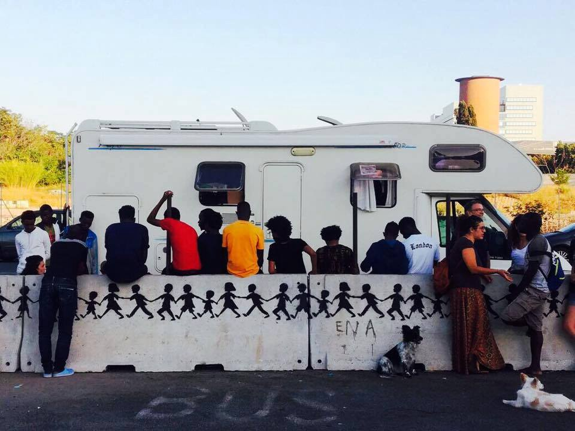
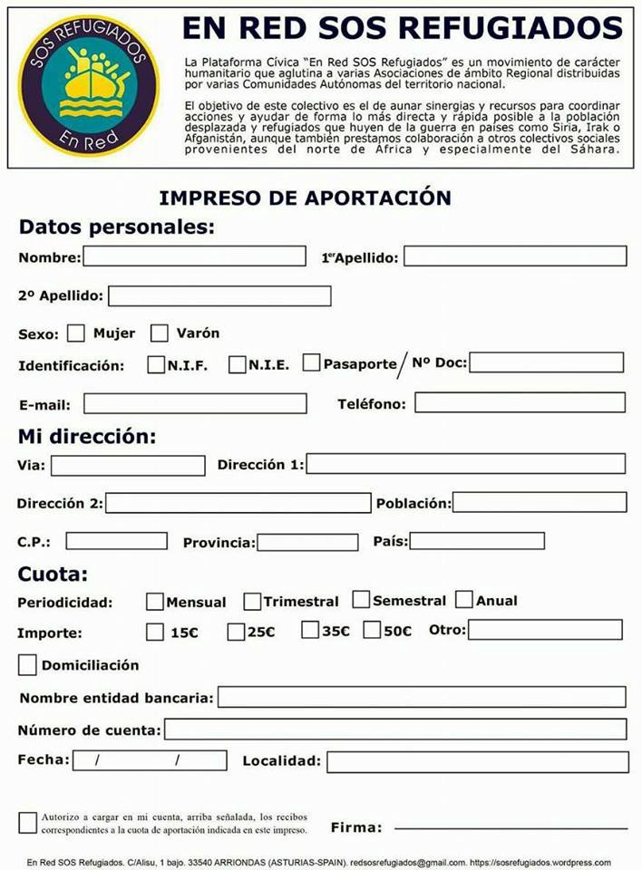

### AYS DAILY DIGEST 9/12/2017: A disastrous reception system that does not guarantee medical assistance to victims of torture
#### Report of MEDU on the medical assistance given to migrants in Rome / Transfers from Greek islands to mainland and Crete / Donations and volunteers needed/New report to be published regarding police illegal push backs and violence at the border with Serbia / Volunteers needed in Paris/Demo against deportations in the Netherlands / More rescue operations in the Mediterranean / Representation form for victims of armed conflict violence in Afghanistan to be submitted to ICC / More news from Italy, Switzerland, the UK…

Credit: MEDU — Medici per i diritti umani

**FEATURE**

We keep stressing, almost daily, the inhumane conditions in which asylum seekers are detained in Libya and it seems never to be enough\.

On Thursday, [MEDU — Medici per i Diritti Umani](http://www.mediciperidirittiumani.org) \(an NGO that has been working with migrants for years, offering medical care and assistance, based in Rome\), presented the results of last year’s research in the light of the work of their mobile clinic at Piazzale Maslax, in co\-operation with Baobab Experience\.

As [reported](http://www.infomigrants.net/en/post/6456/80-percent-migrants-treated-by-rome-clinic-are-torture-victims) , more than 80% of the patients survived torture and serious abuse in Libya, just to reach Italy and find no welcoming reception system\.

From December 2016 until November 2017, the staff members of MEDU treated 868 people, completing 1,524 checks \(including first checks and follow ups visits\), during 124 night shifts in 3 different precarious “spots” in Rome: Piazzale Maslax, the Termini area and an occupied building in the Tor Cervara district\.

As Melting Pot further [reports](http://www.meltingpot.org/Presentati-oggi-i-dati-di-un-anno-di-attivita-della-clinica.html#.WizkJbGZNbU) , the majority of the patients were forced migrants \(seekers of asylum relocation, refugees, forced migrants transiting to other EU countries\) \. 93% of them were males, between 18 and 30 years old \(68%\) and, in the majority of the cases, they had reached Italy a few months or weeks before \(44% less than a month before\) \.

People with different vulnerabilities were treated: victims of torture or other inhumane and degrading treatments, sexual abuse, victims of the slave market \(80% of them\), unaccompanied minors, single mothers with children, patients with chronic illnesses or psychological conditions\.

Seventeen of the 47 unaccompanied minors visited declared that they were victims of such mistreatments\.

The mobile staff gave informations to 1,283 patients\. 240 people were referred to medical, social and legal services, while 85 of them \(particularly vulnerable\) were physically taken to the services \(especially for specific medical check\-ups\) \.

The percentage of those who remain excluded from access to medical treatments is also shocking: 79%\. This is due to lack of information, cultural or linguistic obstacles, lack of services in specific areas of the territory and disorganisation of info points at reception centres\.

The absence of adequate answers to the migratory “emergency” is still a major issue that resonates loud and clear in the guilty silence of the authorities\.

Here you can find the report \(in Italian\) with more detailed information and graphics\.

#### GREECE

According to the [latest statistics](https://www.facebook.com/areyousyrious/photos/a.542222625926625.1073741829.537310533084501/923334201148797/?type=3&theater) published by AYS, 3,800 people arrived in the Greek islands the past month, while 2,128 were transferred to the mainland in the same period\.

After the statement made by Mouzalas yesterday and in light of the various requests by NGOs to guarantee transfers to the mainland by winter, Ekathimerini [reports](http://www.ekathimerini.com/224035/article/ekathimerini/news/migrant-arrivals-offset-decongestion-efforts) that today the Migration Policy Ministry “ _dismissed rumours on Chios that there are plans for the immediate removal of some 1,000 people from the Vial hotspot\. It said that removals will take place gradually_ ”\.

On the other hand, the head of mission of Oxfam Greece, Nicola Bay, [stated](http://greece.greekreporter.com/2017/12/08/oxfam-5000-refugees-to-be-moved-to-mainland-greece/) on Friday that the government has the intention of transferring 5,000 people from the islands to the mainland “before winter”, even though no official announcement has been made yet\.

_Arrivals_

Credit: Erik Gerhardsson
#### Islands

_Chios_

180 people are expected to be transferred from Chios to the mainland on Monday night, according to this [source](http://www.alithia.gr/politiki/feygoyn-ti-deytera-alloi-108-metanastes-prosfyges-xios) \(Greek only\) \.

_Lesvos_

262 refugees are transferred to Crete

■■■■■■■■■■■■■■ 
> **[UNHCR Greece](https://twitter.com/UNHCRGreece) @ Twitter Says:** 

> > 262 #refugees depart from #Lesvos to #Crete on #UNHCR hired ferry as Greek Government increases efforts to ease overcrowding. https://t.co/vqwvC9oBE0 

> **Tweeted at [2017-12-09 11:14:02](https://twitter.com/unhcrgreece/status/939453078088114176).** 

■■■■■■■■■■■■■■ 

#### Mainland

En Red Sos Refugiados has shared a donations’ request form in order to collect funding for the Victoria Social Centre in Athens\. The centre distributes food every day to refugees\.

Credit: En Red SOS Refugiados

_Donations/Volunteers_

DocMobile is [looking for qualified doctors](https://www.facebook.com/groups/135609506795670/permalink/530088907347726/?hc_location=ufi) , nurses and paramedics who are willing to volunteer at one of their four different spots\. If you are qualified, ready to start ASAP and willing to work during Christmas time and New Years’s Eve, get in touch with them\!
#### SERBIA

Rigardu e\.V\. will publish on Sunday the full report regarding systematic police violence against refugees and illegal push\-backs occurring at the borders of the EU with Serbia\. The entire report will be available on their [website](https://rigardu.de/en/welcome/) and on the [AYS FB page](https://www.facebook.com/areyousyrious/) \.

In co\-operation with other NGOs, Rigardu e\.V\. has collected visual proofs and reports of more than 110 cases in which Croatian and Hungarian police illegally deported migrants to Serbia, just in 2017\. More than 850 people, including minors, have experienced violence and abuse and were deprived of their dignity\. The incidents were mainly reported in the areas of Šid \(Serbia\-Croatia\) and Subotica \(Serbia\-Hungary\) \. The asylum seekers involved were mainly from Afghanistan, Pakistan and the Maghreb\.

Borderviolence\.eu [reports](https://www.borderviolence.eu/blog/) also that minors were involved in at least 52 of the cases and that “ _most of the violent acts \(76\) took place on Croatian territory and were perpetrated by Croatian police, whereas 16 cases were reported from Hungary and 12 from Slovenia\. In the latter, Slovenian police usually worked together with their Croatian equivalents to create ‘push\-back chains’ in which refugees were handed over to Croatian police who deported them back to Serbia, often beating them again upon release_ ”\.

Follow our page or Rigardu’s website for more information\.
#### ITALY

_Pordenone_

On Thursday, [three Afghan men](http://m.messaggeroveneto.gelocal.it/pordenone/cronaca/2017/12/08/news/si-stende-in-strada-e-cerca-di-darsi-fuoco-1.16213199?ref=hfmvpnea-1) blocked the road outside of a building they had occupied for a few days and, subsequently, had been evacuated from\. One man lay on the ground with a blanket over himself, the others took footage of him, to protest against the evacuation\. They had been previously taken to the Questura, where they explained that they were exhausted and spoke out against the lack of jobs and housing solutions\.

The atmosphere was very tense, with a truck driver pushing the man to the side to clear the road\. When the police arrived, they loaded him into the car, but the Afghan man tried to light his coat and immolate himself\.

The police stopped him and handcuffed him, the other two men ran away, probably to pass the night on the streets again\.

This is just the latest event that describes the tragedy of the reception system in the area\. Local volunteers have been speaking out against the situation for a long time, always encountering the opposition of part of the community and the fascist policies of the local authorities\.

Rete Solidale Pordenone keeps asking for a public dormitory, transparently managed, that could represent a first step in solving the critical situation and help these people regain their lost dignity\. Here’s their statement

#### SWITZERLAND

A border guard [was sentenced](http://www.rts.ch/info/suisse/9152095-le-garde-frontiere-reconnu-coupable-de-la-mort-d-un-enfant-a-naitre-syrien.html) to seven months in prison and a 60\-day\-fine of 150 francs \(with probation\) in Switzerland after the miscarriage of a Syrian woman under his responsibility\.

He was convicted of bodily harm due to negligence, trying to interrupt a pregnancy and repeated violence of working rules\. The charges of homicide were dropped\.

In July 2014, a group of 30 refugees who were intercepted at the Franco\-Swiss border were sent back by bus to Italy\. A Syrian woman was seven months pregnant in the group\. She complained of lower abdominal pains as well as bleeding during the transfer\. Instead of calling a doctor or holding the Syrian family back in order to find a doctor to examine her, the guard ordered that the bus should proceed straight to Italy\. He only informed the Italian guards that there was a pregnant woman who was suffering on the bus\. By the time the bus arrived at Brig, at the French\-Italian border, the baby was already dead\.
#### FRANCE

_Paris_

Cuisine des migrants [is looking for](https://www.facebook.com/sarah.fenbydixon.1/posts/1315229365248730?hc_location=ufi) a long or short term location to cook for their meal distribution\.

IMPORTANT: NGO Humans For Women [is looking for](http://www.humansforwomen.org/cours-francais-refugiees/) volunteers for child care during the French classes for women and families, every Sunday from 13:30 to 15:30\. The child care will take place at 51, Rue de la Révolution \(Metro station: Croix de Chavaux\) \. — Child care is one of the key elements so that women and families can concentrate on the lessons\.

MSF has released a video on the situation of unaccompanied minors in Paris, stressing their right to social assistance and the obligation of the State to protect their personal security\.

#### UK

Right to Remain has published a [detailed article](http://www.righttoremain.org.uk/legal/the-family-returns-process/) explaining the family return process, which “ _applies to all families with a dependent child or children \(under 18\) when the family is liable to be removed from the UK if they are categorised by the Home Office as one of the following:_
- _an illegal entrant_
- _someone who requires leave to enter or remain in the UK but does not have it_
- _someone facing [deportation](http://righttoremain.org.uk/toolkit/glossary.html#deportation) from the UK \(usually following the serving of a criminal sentence\)_
- _a person refusing leave to enter or leave to remain_
- _a person who has been refused asylum and has asked for assistance in leaving the UK_ ”

#### THE NETHERLANDS

On Monday, 11 December, the Sudanese Democratic Forum is organising a [demo](http://www.doorbraak.eu/11-december-haag-actie-dreigende-deportatie-soedanese-vluchtelingen/) [nstration](http://www.doorbraak.eu/11-december-haag-actie-dreigende-deportatie-soedanese-vluchtelingen/) , against the deportation threat of three Sudanese refugees at the Ministry of Security and Justice in The Hague\. A previous demonstration on 15 May against the deportation of another refugee was a success: not only was the deportation stopped but the refugee was also given right of residence\.

Join the action on 11 December to prevent Sudanese asylum seekers from being deported again\!

#### SEA

115 people have been rescued by Aquarius today\. Thankfully, the operation was successful\.

■■■■■■■■■■■■■■ 
> **[MSF Sea](https://twitter.com/MSF_Sea) @ Twitter Says:** 

> > BREAKING #Aquarius just finished rescuing one rubber boat with 115 people in int'l waters. Despite bad sea conditions, all are safe onboard. https://t.co/iRCu2mP2Ki 

> **Tweeted at [2017-12-09 10:52:00](https://twitter.com/msf_sea/status/939447531133636609).** 

■■■■■■■■■■■■■■ 

150 people were also rescued by Proactiva Open Arms today\. The NGO saved people from three different boats in the same day\.

■■■■■■■■■■■■■■ 
> **[Open Arms](https://twitter.com/openarms_fund) @ Twitter Says:** 

> > 🔵#ESTAPASANDO Rescatamos una tercera barca con 150 personas. 3 en un solo día. Cientos de personas al borde de la muerte hoy #Med
No habrá titulares ni abrirán telenoticias hoy pero cada una de esas vidas es única y valiosa para nosotros. https://t.co/Rk7Uw3d7pM 

> **Tweeted at [2017-12-09 13:36:01](https://twitter.com/openarms_fund/status/939488810294968322).** 

■■■■■■■■■■■■■■ 

Earlier in the morning, 111 people were rescued in international waters, among them, 20 women and three children\.

Every life is valuable\.

As Reuters [reports](http://news.trust.org/item/20171209163725-z2ce9/) , on Saturday, Libya and Italy agreed to join forces to tackle migrants smugglers and traffickers, as part of a wider plan to cut migrants’ flow to Europe\.
#### GENERAL

On 20 November 2017, the Prosecutor of the International Criminal Court \(the ICC\), Ms\. Fatou Bensouda, requested authorisation from Pre\-Trial Chamber III to initiate an investigation into alleged war crimes and crimes against humanity in relation to the armed conflict in the Islamic Republic of Afghanistan since 1 May 2003, as well as regarding similar crimes that are linked to the armed conflict in Afghanistan and were committed on the territory of other States Parties to the Rome Statute since 1 July 2002 \(“Situation in the Islamic Republic of Afghanistan”\) \. The Prosecutor issued a Public Notice on the same date\.

As per the ICC’s legal framework, the victims of the alleged crimes committed in the situation in Afghanistan have the right to submit “ _representations_ ”, i\.e\. to provide their views and concerns to the judges who are going to take a decision on the Prosecutor’s request\. To help facilitate this process, the Victims Participation and Reparations Section \(VPRS\) of the Registry has prepared a template PDF representation form which is available for download here in English, Pashto or Dari \(each victim is to fill in only one form, regardless of the language\) \.

Alternatively, an online version of the form is also available below in the same three languages, to be filled in and sent online\.

The deadline for submitting victims’ representations to the ICC is 31 January 2018\. These documents aim to facilitate the submission of both individual and collective \(i\.e\. on behalf of groups of victims\) representations\. The VPRS is strongly encouraging victims to send their representations as soon as possible so VPRS can review them and transmit them together with a report to the judges in due time, especially if the forms need to be translated from Dari or Pashto into English\.

All information is available on the website of the ICC: [https://www\.icc\-cpi\.int/afghanistan](https://l.facebook.com/l.php?u=https%3A%2F%2Fwww.icc-cpi.int%2Fafghanistan&h=ATNJ0fkHhYCLCGCYlYg1yvVyQngw8SPtU-chyzN4CljU8FbM_3Ecg_Cjn4lg6B7EA47sm3RWlxhb2AQKzUTKgnEIK5ELU_HvFduDtpfreREvJrQlr-DSJYA8emp2-7YZxScwU8mwBuUyDcLB5OE)

> **_We strive to echo correct news from the ground through collaboration and fairness\._** 

> **_Every effort has been made to credit organizations and individuals with regard to the supply of information, video, and photo material \(in cases where the source wanted to be accredited\) \. Please notify us regarding corrections\._** 

> **_If there’s anything you want to share or comment, contact us through Facebook or write to: areyousyrious@gmail\.com\._** 

_Converted [Medium Post](https://areyousyrious.medium.com/ays-daily-digest-9-12-2017-a-disastrous-reception-system-that-does-not-guarantee-medical-82c727a60bbd) by [ZMediumToMarkdown](https://github.com/ZhgChgLi/ZMediumToMarkdown)._
