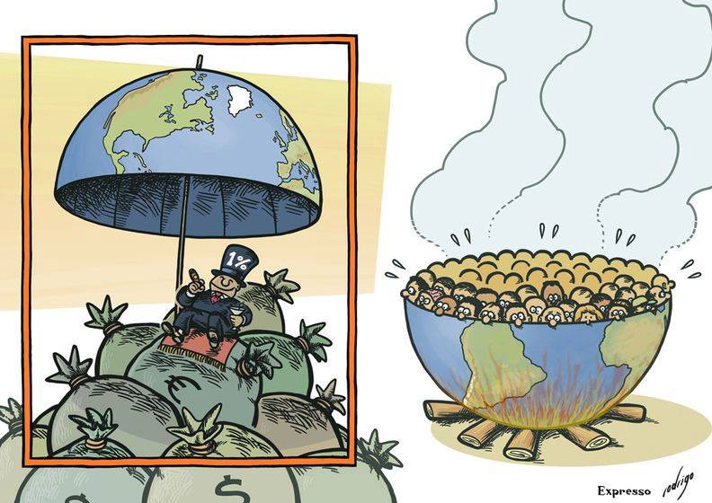
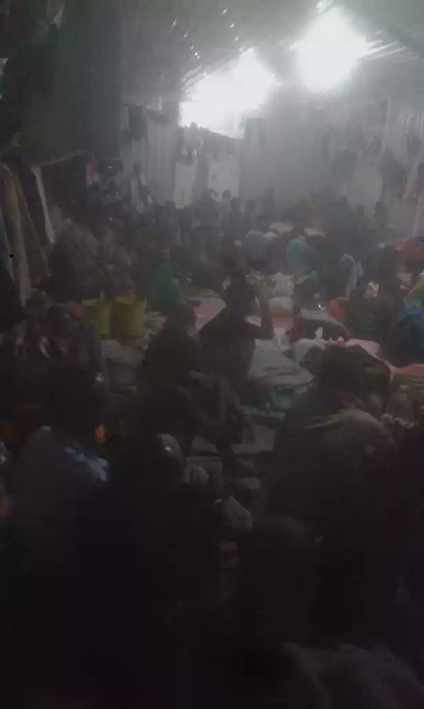
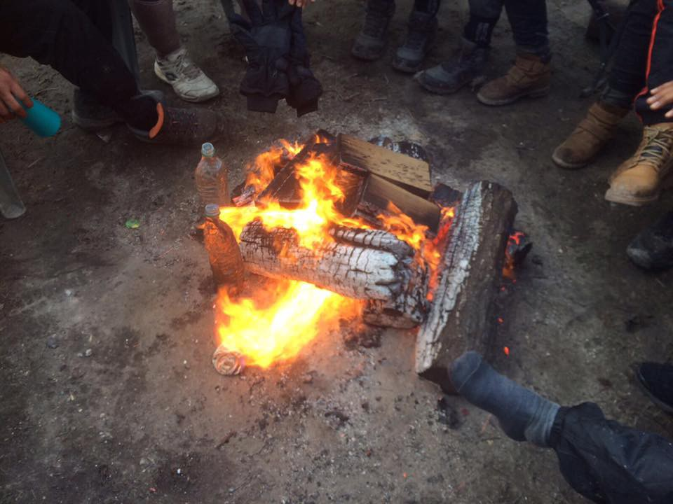
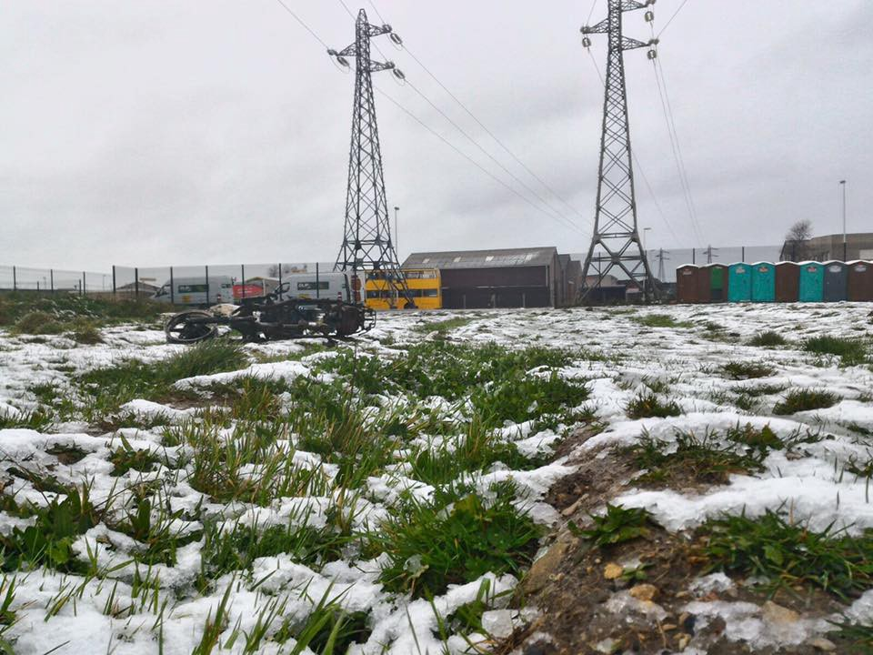
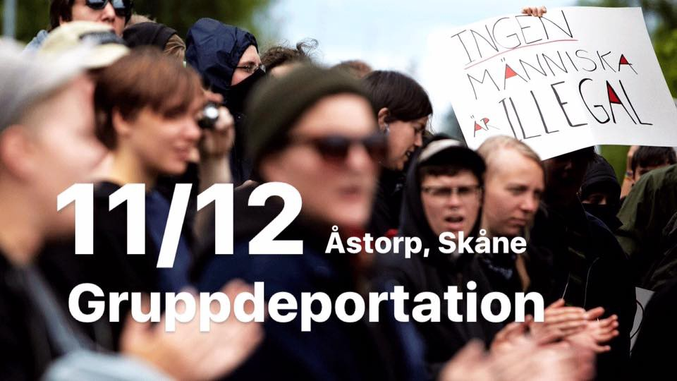
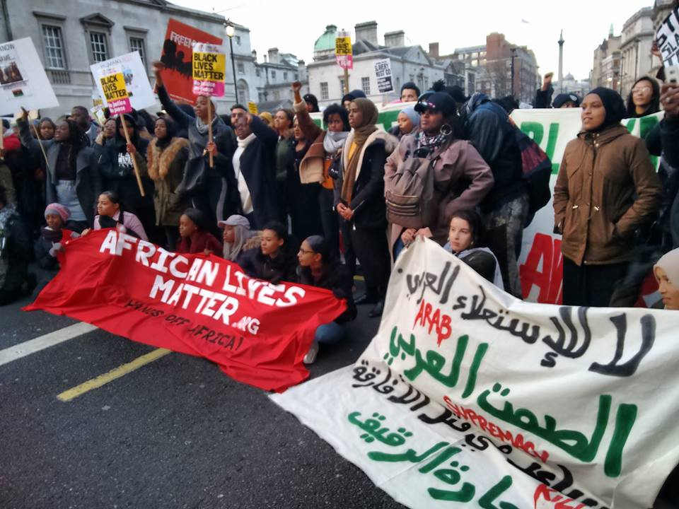

### AYS 10/12/2017 \- On Human Rights Day two reports of ransom, torture and slavery in Libya

Busy weekend in the Mediterranean /// Dire hygienic conditions on the Greek islands /// Snow and no shelters in Calais /// Demonstration against mass deportation in Sweden /// Updates from anti\-slavery demo in London

The Rich get richer, by Rodrigo de Matos \(Art Against\)
#### **Feature — On Human Rights Day two reports of ransom, torture and slavery in Libya**

■■■■■■■■■■■■■■ 
> **[Meron Estefanos](https://twitter.com/meronina) @ Twitter Says:** 

> > Picture from the connection house (6) https://t.co/NFmqPP4KNA 

> **Tweeted at [2017-12-10 11:41:18](https://twitter.com/meronina/status/939822328321593344).** 

■■■■■■■■■■■■■■ 

■■■■■■■■■■■■■■ 
> **[Meron Estefanos](https://twitter.com/meronina) @ Twitter Says:** 

> > Picture from the connection house (7) https://t.co/oS59klVNFV 

> **Tweeted at [2017-12-10 11:41:36](https://twitter.com/meronina/status/939822404607598597).** 

■■■■■■■■■■■■■■ 

Journalist Meron Estefanos has been in contact with refugees in Libya in both ‘legal’ and illegal detention and in smugglers connection houses\. People are being held hostage by both smugglers and militias in illegal detention\. But even in ‘legal’ detention conditions are bad\. Many people pay smugglers to enter them and then struggle to get registered by UNHCR\.

In one illegal detention building, people have been imprisoned for 8 weeks since they were ‘arrested’ near Sebratha\. Now the militia is demanding that they get paid $3600 per person to take them to the legal detention\. Other have been asked to pay as much as $5500 each and most of them have paid the ransom 4 or 5 times with no result\.

Refugees staying at a smugglers connection house, who have already paid for the sea trip, are also being asked to pay $3600 each just to be taken to the legal detention\. Refugees held hostage by the smugglers report being tortured, starved and raped\. People are desperate and families don’t know what to do\.

](assets/a7c6e36c38b5/1*E3q_gMdEwd350l5KixZyVQ.jpeg)

These are pictures from the so called legal detention, taken by the refugees\. @ [Meron Estefanos](https://twitter.com/meronina/status/939823127537836032)

■■■■■■■■■■■■■■ 
> **[Senay Tesfamichael](https://twitter.com/senaymichael) @ Twitter Says:** 

> > If this is the the condition of the legal detention centre, I can't imagine what the illegal detention looks like #LibyanSlaveTrade [twitter.com/meronina/statu…](https://twitter.com/meronina/status/939823127537836032) 

> **Tweeted at [2017-12-10 11:50:21](https://twitter.com/senaymichael/status/939824604146749440).** 

■■■■■■■■■■■■■■ 

Reports from [L’Espresso](https://twitter.com/mannocchia/status/939794324899975168) also confirm the continuing mistreatment of refugees in Libya\.

> After they caught me in the sea I have been moved in three different prisons, the first was in Tripoli\. Then one night a group of armed boys came in\. They took me and fifty other people by force and took us to a shed where we stayed for weeks\. They beat us every day, we did not have enough water or food, they treated us like animals\. We are not human beings for them, we are objects\. Less than objects\. Our life has no value, blacks are used to be sold or blackmailed\. Now we are here but anyone can come in, take us away and ask our families for money to free us\. The value of men is two thousand dinars, women three thousand\. Pregnant women up to four thousand\. 

Yet, this week the Libyan coastguard have continued to intercept boats and return people to these conditions against their will\. Italy continues to support them\. On Human Rights Day we would like to ask — When will the EU stop contributing to human slavery?

**Sea**
#### SOS MEDITERRANEE France Update after busy weekend

On Saturday, the 9th of December, Aquarius found and rescued 115 people, including 11 women and a baby, who were on board a fragile boat at risk from the waves are now safe on board Aquarius\.

On Sunday 10th, 335 people were transferred from Proactiva Open Arms and merchant ships

In total there were 450 refugees of 26 different nationalities including Eritrea, Syria, Libya, côte d ‘ Ivoire, Senegal, guinea Conakry and Pakistan\. All of them had transited through Libya and have now been brought to safe harbour\.

■■■■■■■■■■■■■■ 
> **[Open Arms](https://twitter.com/openarms_fund) @ Twitter Says:** 

> > 🔵 #DiaDeLosDerechosHumanos 
Esta noche, en la inmensidad de este mar implacable, a 60 millas de #Libia 13 personas rescatadas,6 niños. No hay derecho.
Por encima de todo y a pesar de todos los obstáculos,defendemos y defenderemos lo más importante: el Derecho a la Vida. https://t.co/dESgKoWTPu 

> **Tweeted at [2017-12-10 09:09:48](https://twitter.com/openarms_fund/status/939784199187386369).** 

■■■■■■■■■■■■■■ 

> Tonight, in the immensity of this relentless sea, 60 miles off \#Libya 13 people rescued, 6 children\. There is no law\. 

> Above all, despite all the obstacles, we defend and will defend the most important: the right to life\. 

Salvamento Maritimo were also patrolling

■■■■■■■■■■■■■■ 
> **[SALVAMENTO MARÍTIMO](https://twitter.com/salvamentogob) @ Twitter Says:** 

> > Guardamar Concepción Arenal rescata de noche y de madrugada 53 y 22 #personas de 2 #pateras #Estrecho y transborda otras 25 más rescatadas por patrullera @[guardiacivil](https://twitter.com/guardiacivil) Desembarcadas todas en #Barbate https://t.co/7jWPLwK4U7 

> **Tweeted at [2017-12-10 09:40:38](https://twitter.com/salvamentogob/status/939791960491118592).** 

■■■■■■■■■■■■■■ 

> Guardamar Concepción Arenal rescues at night and early morning 53 and 22 people from 2 dinghies in the Strait and disembarked in Barbate other 25 people rescued by guardia civil patrol boat 

■■■■■■■■■■■■■■ 
> **[SALVAMENTO MARÍTIMO](https://twitter.com/salvamentogob) @ Twitter Says:** 

> > La tripulación de la salvamar Denébola ha rescatado a las 4 #personas de la foto de #patera en #Estrecho al Sur Punta Europa. Desembarcados ya en #Algeciras Gracias buque Eagle Turn por avistar y avisar. https://t.co/d5mBN1C8Su 

> **Tweeted at [2017-12-10 12:26:28](https://twitter.com/salvamentogob/status/939833695367782400).** 

■■■■■■■■■■■■■■ 

_Salvamar Denebola crew has rescued 4 people in the southernmost point of Europe\. Already landed in Algeciras\. Thank you ship Eagle Turn by sight and warn\._

According to the Italian radio station [Radio Radicale](https://twitter.com/scandura/status/940012033948508160) a total of 900 migrants arrived in the last 48 hours in the cold of December, saved by NGOs, Coast Guard, EU4med\. The latest 3 ships are arriving today in the ports of Augusta, Catania and Trapani\.
#### Data on Interceptions in the Aegean

■■■■■■■■■■■■■■ 
> **[SARwatchMED](https://twitter.com/SARwatchMED) @ Twitter Says:** 

> > #TurkishCoastGuard stats: 41 boats with 1976 people intercepted in November in the #AegeanSea. A further 457 people were intercepted in the first 10 days of December, 268 on Thursday alone. [sahilguvenlik.gov.tr/baskanliklar/h…](http://www.sahilguvenlik.gov.tr/baskanliklar/harekat/faaliyet_istatistikleri/duzensiz_goc_istatistikleri_ege.html) https://t.co/Qk39gGoo38 

> **Tweeted at [2017-12-10 20:55:22](https://twitter.com/sarwatchmed/status/939961763759624192).** 

■■■■■■■■■■■■■■ 

**Greece**
#### **Conditions deteriorating on the islands**

Authorities and Government have tweeted, posted and released official statements about Human Rights Day\. In the meanwhile thousands of people are still held in the Greek Islands, unable to leave, in overcrowded hotspots, with dire hygienic conditions\.

■■■■■■■■■■■■■■ 
> **[MSF Sea](https://twitter.com/MSF_Sea) @ Twitter Says:** 

> > A mum of 5 who fled #raqqa last month &amp; is now stuck in #Moria #Greece told us: “It's been weeks we’ve been in our tent now.The zip is broken &amp; it leaks when it rains.No wonder my children are getting sick! I try hard to spare them from the cold, hard conditions but I am failing” https://t.co/u8jzWJJ93X 

> **Tweeted at [2017-12-10 18:04:50](https://twitter.com/msf_sea/status/939918845317468160).** 

■■■■■■■■■■■■■■ 

■■■■■■■■■■■■■■ 
> **[Methkal](https://twitter.com/meth_kh) @ Twitter Says:** 

> > Lesvos Island, about 7000 refugees and mountains of garbage every where.
#refugeeswelcome #refugees #chiosdarkside #Refugeesgr https://t.co/IoW7Kz7BPv 

> **Tweeted at [2017-12-10 22:37:20](https://twitter.com/black_lotus0000/status/939987422095511554).** 

■■■■■■■■■■■■■■ 

■■■■■■■■■■■■■■ 
> **[Daphne Tolis](https://twitter.com/daphnetoli) @ Twitter Says:** 

> > Non-existent hygiene and sanitation facilities. 
Moria refugee camp, Lesvos. https://t.co/PeT0lxVonM 

> **Tweeted at [2017-12-10 20:04:23](https://twitter.com/daphnetoli/status/939948934151196673).** 

■■■■■■■■■■■■■■ 

#### Updates from Samos

**Call for donations and volunteers**
#### Distress call from Pampiraki warehouse in Ellinikon, Athens

Pampiraki warehouse supply all squats, mainland camps, the islands, families in apartments, the Athens homeless, etc\.

We all know them well\. They are an extraordinarily efficient, centralized, and egalitarian, distribution point\.
They are in a very serious crisis with dry food and supplies\.

> We are basically running out of food and the donations we are getting are not covering all the needs\. \[For\]… example, we need at least 130 ltrs of oil just to minimally cover 8 of the squats for a week & 275 kgs of legumes\. And this is just for 8 squats…\. 

> \[We are\] running out of options, need to find new solutions\. 

You can help them by contacting [Negia Milian](https://web.facebook.com/negia.milian) for details\.
#### InterVolve needs volunteers

One Happy Family is looking for sponsorships for their long\-term volunteers working in the community centre in Lesvos\.

Read more about their sponsorship system [here](https://ohf-lesvos.org/en/sponsorships/) \.

**Italy**
#### Pre\-Deportation Centre set on fire by detainees in Pian del Lago, Sicily

Local media [report](http://www.seguonews.it/caltanissetta-a-fuoco-il-cpr-di-pian-del-lago-immigrati-appiccano-le-fiamme) that a group of detainees of the CPR \(Centro Permanente per il Rimpatrio, Permanent centre for repatriation\) of Pian del Lago, Caltanisetta, have set fire to different points of the structure in the night between Saturday 9th and Sunday 10th\.

The centre held 90 asylum seekers waiting to be deported\. No one was harmed but the centre was completely destroyed\.

**France**

[Refugee Info Bus](https://web.facebook.com/RefugeeInfoBus/) is among the organisations working in Calais\.

Snow in Calais \(Photos by Refugee Info Bus\)

> 10th December is Human Rights Day\. In Calais, we woke up to snow covering the ground once more\. Emergency shipping containers have been opened for women and children but there are still hundreds of young men sleeping rough in these conditions\. **The state allegedly will not provide emergency shelter until the temperature is below 0°C both day and night\.** 

> Along with the other organisations operating in Calais, we are looking out for signs of hypothermia\. 

Support them [here](https://mydonate.bt.com/donation/start.html?charity=189110) \!

Chris, a long term volunteer of the [Refugee Community Kitchen](https://web.facebook.com/refugeeCkitchen/) in Calais wrote a first hand account on the situation with the temperatures dropping rapidly:

> People burn anything they can to keep warm: bags, tyres, old broken trainers\. Everyone huddles round the toxic fumes or packs inside our van for a few hours of warmth\. Red raw eyes and cold hands greet us every day\. My friend\. Oror\. Hey bro\. Salam aleikum\. Akkun negar\. Ça va? Choni bashi\. Manana\. I don’t know how people keep smiling\. Or why\. 

](assets/a7c6e36c38b5/1*qZBsE0qtdcjXKaTBiKd3fQ.jpeg)

Photo by [Chris Sees World](https://chrisseesworld.com/2017/12/09/frosty-reception/)

Read the full account and find some useful resources on [his website](https://chrisseesworld.com/2017/12/09/frosty-reception/)

**Sweden**
#### Demonstration to stop mass deportation on Monday 11th December

[Refugees welcome — Swerige](https://web.facebook.com/refugeeswelcomesverige/) published a call for demonstration against a planned mass deportation from Åstorp, at 11 AM on Monday\.

14 young people Afghani men have been moved there from centres throughout the country and a charter flight is set to depart for Kabul in the late morning\.

Read more [here](http://mailchi.mp/0912630aa7e8/organisationer-vill-stoppa-deportation) \!

**UK**
#### Demonstration against Libyan slave trade in London

Photos and a report on Saturday anti\-slavery [demonstration](https://web.facebook.com/events/460529561008367/?active_tab=discussion) were posted:

](assets/a7c6e36c38b5/1*tP2ujb5ZP0xJgZFqo38xJg.jpeg)

Photo by [Amma Fosuah Poku](https://web.facebook.com/ammafosuah.poku?hc_ref=ARR2dNcec9O2LnQnv4I3jSnc8xuSIqxQko_W8iG7Eb6B-mnoXUW9tlqybPJU4lAVves)

Thanks to everyone who participated in the protest today\. We started in Belgrave Square, marched to the Libyan embassy in Knightsbrigde where we chanted, made our voices heard and listened to solidarity messages\.

](assets/a7c6e36c38b5/1*dY3Tmkrc11yWEt5Q7QcSAw.jpeg)

Photo by [Amma Fosuah Poku](https://web.facebook.com/ammafosuah.poku?hc_ref=ARR2dNcec9O2LnQnv4I3jSnc8xuSIqxQko_W8iG7Eb6B-mnoXUW9tlqybPJU4lAVves)

We moved on to march down Pall Mall, pass Buckingham Palace through Trafalgar Square, up to Downing Street, the official residence of the Prime Minister, all along making our voices heard\.

](assets/a7c6e36c38b5/1*bE-xHbxB2A1CDNBUFQpjbw.jpeg)

Photo by [Amma Fosuah Poku](https://web.facebook.com/ammafosuah.poku?hc_ref=ARR2dNcec9O2LnQnv4I3jSnc8xuSIqxQko_W8iG7Eb6B-mnoXUW9tlqybPJU4lAVves)

When we reached the Houses of Parliament we made it known through our drumming, chanting and occupation of the road \(some of us sat down\) that we were there to deliver a message that “African Lives Matter”\.

> **_We strive to echo correct news from the ground through collaboration and fairness\._** 

> **_Every effort has been made to credit organizations and individuals with regard to the supply of information, video, and photo material \(in cases where the source wanted to be accredited\) \. Please notify us regarding corrections\._** 

> **_If there’s anything you want to share or comment, contact us through Facebook or write to: areyousyrious@gmail\.com\._** 

_Converted [Medium Post](https://areyousyrious.medium.com/ays-10-12-2017-on-human-rights-day-two-reports-of-ransom-torture-and-slavery-in-libya-a7c6e36c38b5) by [ZMediumToMarkdown](https://github.com/ZhgChgLi/ZMediumToMarkdown)._
