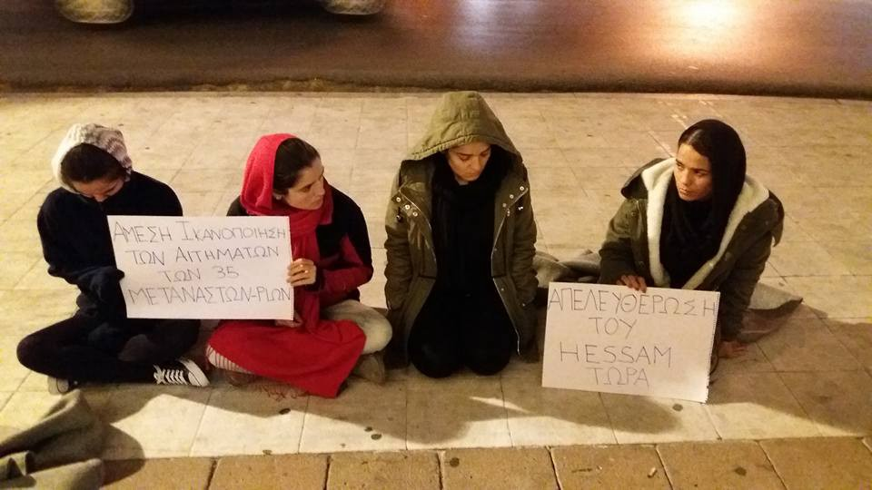

### AYS DAILY DIGEST 13/12/2017: EU denies all responsibility for situation in Libya

_EU denies all responsibility for situation in Libya // Syrian and Kurdish refugees exploited in areas around Izmir // More rescues at sea between Spain and Morocco // More arrivals to the Greek Islands and transfers to the mainland // Doctors cannot cope with pregnancy rates on Lesvos // And news from Austria, Germany, Netherlands and France…_

](assets/5617453380b8/1*G8JAyJn8GRz5rBjBEAsKWQ.png)

Source: [Refugee Rescue / ‘Mo Chara’](https://www.facebook.com/RefugeeRescueUK/?ref=gs&fref=gs&hc_location=group_dialog)
### Feature

The EU Commissioner for migration, Dimitris Avramopoulos dismisses accusations by Amnesty International of the EU being complicit in the situation currently seen in Libya\.

> “This discourse has to stop,” he said\. 

Very ironically and against all evidence, he suggests that the situation in Libya has in fact been bettered by the EU, via their international partners who are improving the situation on ground\.

Remorselessly, instead of discussing the latest accusations by Amnesty International and warnings by other human rights groups, [EU leaders will be discussing how to further reduce immigration to Europe](http://news.trust.org/item/20171213070958-s7wpk/) over dinner tomorrow\.

We sincerely hope they can stomach their meals as they play political chess with the lives of innocent people\. Source: No Name Kitchen\.

> Despite heavy criticism by human rights groups that it is aggravating the suffering of refugees and migrants on the southern shore of the Mediterranean, the EU is sticking to its policy of providing various kinds of assistance to the governments and U\.N\. agencies in the Middle East and Africa in order to prevent people making the trek north\. 

Italian Prime Minister, Paolo Gentilon, is also refusing to take any blame for what is happening in Libya\.

> Italy prides itself on “spotlighting” atrocities in Libya 

Despite also being accused of complicity in the violent human rights abuses endured by refugees in Libya, [Italian Prime Minister has dismissed allegations](http://www.infomigrants.net/fr/post/6551/l-italie-se-targue-d-avoir-allume-les-projecteurs-sur-les-atrocites-en-libye) by saying that Italy has ‘spotlighted’ these atrocities thereby improving the situation by allowing UN agencies to intervene in the country\.

David Noguera, the [president of Médicos Sin Fronteras Spain calls out the EU on their hypocrisy](http://www.elmundo.es/internacional/2017/12/13/5a217d30e2704ebe238b469b.html) and demands change that translates into actions in the emigration policies of the EU and its member states\.

> Since the EU has increased its anti\-migration interventions, detention conditions in Libya have deteriorated…They must put an immediate end to policies that simply aggravate their desperate situation\. 

He urges that EU member states facilitate maritime search and rescue operations and cease their support for the Libyan Coast guard\.

> Libya, let’s not forget, has not even signed the Convention on the Status of Refugees\. If the European leaders persist in their attitude, they will continue to be accomplices of those crimes that they themselves are now beginning to condemn\. 

Following this report MSF Presna released a statement:

> ‘We urge to facilitate maritime search and rescue operations and to cease its support to the Libyan coast guard interception and return of migrants and operations’ 

Source: MSF Presna
### Turkey:

[A report on seasonal refugee agricultural labourers in Turkey,](http://harekact.bordermonitoring.eu/2017/12/13/seasonal-agricultural-labor-in-turkey-the-case-of-torbali/) in the area around Izmir, outlines details of exploitation and abuse of workers, as well as racist attacks on refugees in the area\.

> Seasonal agricultural workers are trying to survive in the face of many problems, including matters of accommodation and nutrition\. Children, for example, have to work at a very young age and therefore cannot go to school, and women face many problems due to patriarchy, such as the exploitation of their labor\. 

The report states that before the influx of Syrian refugees to Turkey, Kurds were the largest group of low\-wage sector workers\. The average pay was 40–50 lira per day, the equivalent of 8\.8–11 euros\. Since the arrival of Syrian refugees to Izmir, the pay for work has dropped to 20–30 liras per day, the equivalent of 4\.4–6\.6 euros\. All are fighting for survival\.

The living conditions are very poor\. There is no clean drinking water in the area and water is drawn from artesian wells\. Refugee workers cook on simple gas stoves\. Sanitation and toilets are deplorable\. One of the most concerning aspects is that people in the fields cannot go to the hospital in case of illness unless they are registered in Izmir, which most are not\.

> According to the temporary protection system in Turkey, a Syrian can only benefit from rights and services in the place he or she is registered in…Because of this, they often hear this sentence at the hospitals: “Go and get examined at the place you are registered”\. 

The [İmece İnisiyatifi Çeşme](https://www.facebook.com/imeceinisiyatifi/?hc_ref=ARQmtdggyEHFE66VNQgi_Yr0XQdCGU8PZQDE1D-PYr8--B15ufqaQj9V4lz2BbZ0iPY&fref=gs&hc_location=group) initiative continues to work for the victims of war\. You can contact them if you would like to volunteer\.
### Sea:

113 people from sub\-Saharan Africa were rescued by the Tripoli coastguard today\. The coastguard has not released where exactly the rescue took place but it is thought to be Garabuli off “eastern” Tripoli — 60km from the capital\. Those rescued included 5 women\. They were taken to Busetta naval base before being transported to various detention centres\.

> ‘According to one of the survivors, the coastguard was called in after a helicopter spotted their boat in difficulties\. He said they had been in great danger at the time\.’ 

[Three boats holding 92 people were rescued in the Spanish Alboran Se](https://twitter.com/HelenaMaleno/status/940985266088620033) a today by FronteraSur\. Two boats were taken to Mortil \(35 \+ 26 people\) and one was taken to Polyhymnia \(31 people\) \.

Morocco has indicated that it has rescued 5 boats \(174 people\)

[PoteraSur](https://twitter.com/salvamentogob/status/940988277213089792) warns that 3 boats remain missing carrying 120 people\.

Source: Oscar Camps

The Libyan government has informed IMO to withdraw their certification request for SAR zones\.
### **EU**

European leaders are very happy to deny all responsibility for suffering inflicted upon refugees in Libya, however, they still cannot agree on how to best take care of refugees who have made it to Europe\.

[Member of the European Parliament, Cecilia Wikström](https://www.facebook.com/Europaparlamentariker-Cecilia-Wikstr%C3%B6m-300583770875/?hc_ref=ARRY5YFD9SVR-cGK30F4OOFmusu3_uSpGS9vQIPATMr2RoopOA0nwQ5VjFOCjvGg4LE&fref=nf) has [insisted the Dublin System must be revamped to ensure a fair and responsible EU asylum system\.](https://www.facebook.com/permalink.php?story_fbid=10154929698475876&id=300583770875) She states that it should not be further postponed and that the parliament will not sign off on any reform that does not change the current failed situation on the ground\.

> We will not repeat the errors of the past and sign off on a watered\-down compromise, which is guaranteed to fail again on first contact with reality\. Any new Dublin system must include an automatic relocation system, with the full participation of all member states, as well as fostering true solidarity between all member states\. 

### Greece:

More arrivals on the Aegean Islands today\. 145 people arrived in Lesvos, 136 to Samos and 12 to Famakonisi\.

[The Greek Government wants to send](https://www.amna.gr/home/article/213767/G-Mouzalas-Parathuro-apo-tin-Tourkia-gia-metafora-aitounton-asulo-stin-endochora) Asylum seekers from the Aegean Islands back to Turkey for their asylum cases to be processed there\.

> A “window” from Turkey to accept the request of the Greek government to transfer asylum seekers from the islands to closed hinterland centers in order to examine their asylum request there, without destroying the EU\-Turkey Agreement, opens, according to Minister of Immigration Policy, Yiannis Mouzalas\. 

The minister has stated that this has been a demand the Greek Government has been submitting to the EU and Turkey for over a year and a half\.

> “It is very likely, on the part of Turkey, to open a window to the request that we had submitted five times to the European Union, to be able to transfer people to inland centres without being lost in the EU\- Turkey, and if they get asylum to stay in Greece, if not return to Turkey\. “ 

Some sources are saying that there has been an increase in birth rates witnessed in Mytilini and doctors and medical staff are struggling to provide support\.

A peaceful protest calling to close Moria Hotspot has been scheduled for 11am on Thursday morning\.

[A message from four sisters currently](https://www.facebook.com/arashampay/posts/559720451040712?pnref=story) occupying SYRZIA office, Mytilini, Lesvos:

Source: Arash Hampay

Hello all dear Greek people and people from all over Europe\!

> We, four sisters, along with 31 other refugees, left Moria camp almost two months ago, and now, for more than one month, are sleeping in your cold streets\. We were on hunger strike, we were beaten by your police and fascist people, we were arrested, we were humiliated, we heard bad words and, in the end when we saw there was no safe place for us, we had to go to one of the government offices because all these things happened from the Greece government to us\. 

> Now we are in Syriza’s office for more than 10 days in the hope that the Greece government will do something for us; for 35 people\. 

> Our requests are: 

> 1\. That they release [\#hesam\_shaeri\_hesari](https://www.facebook.com/hashtag/hesam_shaeri_hesari?source=feed_text&story_id=559720451040712) from prison and that they do not deport him to Iran 

> 2\. That they give these 35 refugees papers so that they can leave Lesvos\. 

> Our requests are so small and insignificant that we never thought that we would get beaten by the police and hear so many bad words\. 

> We had so much hope of your Greek people that we couldn’t believe that those things came from you\. We know that you don’t want us stay in your country anymore, and we also don’t have any safety here\. So we want to request you people and your government to let Hesam Shaeri go free and let us leave your country\. 

> Please don’t let your government threaten and condemn us anymore and use us for their dirty political game\. 

[A report states that](http://www.ekathimerini.com/224139/article/ekathimerini/news/authorities-to-house-156-asylum-seekers-in-grevena-hotels) 156 asylum seekers who were recently moved to the Greek mainland from Chios will be settled in three hotels in Grevena, Northern Greece by IOM\.

> They include 71 people from Syria, 26 from Iraq, 12 from Afghanistan, 20 from the Palestinian Authority, 9 from Kuwait, 3 from Iran, 2 from Somalia, 1 from Sudan and 1 from Guinea\. 

The Kathimerini newspaper reports that 300 refugees have been moved from Chios and Lesvos to the mainland and it is expected that another 183 will follow\. They will be taken to locations in Attica as part of the decongestion scheme of the Greek Islands\.

In total, in the last week, 1524 people have been moved from the Aegean Islands to the mainland\. 833 people from [Lesvos](https://twitter.com/hashtag/Lesvos?src=hash) , 300 from C [hios](https://twitter.com/hashtag/Chios?src=hash) , 176 from [Samos](https://twitter.com/hashtag/Samos?src=hash) , and 215 from other islands\.

Many thousands remain in grievous conditions\.

Source: Michael Raber

Despite the transfers to the mainland sounding like good news, No Borders Kitchen warns that it might be yet another political manoeuvre of the failed EU\-Turkey deal\. According to [STATEWATCH](http://statewatch.org/) , last week Athens persuaded Ankara to accept migrant returns, including Syrian refugees from the mainland\.

[A report](http://insights.careinternational.org.uk/publications/left-behind-how-the-world-is-failing-women-and-girls-on-refugee-family-reunion) , based on new research emphasises how the failure to provide safe and legal routes for those seeking asylum, particular those seeking family reunification has gendered impacts on women and girls who have been left stuck in transit countries\. The report analyses these impacts on women and girls from a women’s rights perspective, and discusses what governments may do differently to better protect women and girls fleeing persecution\.

[AMURTEL,](https://www.ulule.com/armutel/) an international, grassroots organisation managed by women to help women and children in Greece is in need of donations\.

> In Greece, we are committed to assisting refugee mothers and babies to have the best possible perinatal care\. More pregnant women and mothers are coming everyday at Amurtel; to make sure we can give them the support they need we are raising 30 000 euros by the end of January\. 

Skaramangas and Schisto Camp in Athens are in need of donations\.

> In Skaramagas Camp the housing and infrastructure for refugee toddlers’ nursery schools are ready\. We want them to start functioning before New Year’s festivities, but they still need equipment and materials such as: 

> Toddler size chairs, cushions, toys, black and coloured pencils, crayons, markers, A4 or A3 papers, drawing paper rolls, low bookcases for child books, toy boxes\. 

Please follow [this link](https://www.facebook.com/groups/greecevolinfopoint/permalink/588288104835592/?hc_location=ufi) to find out how you can help\.

SKYPE SCHEDULE FOR ASYLUM REGISTRATION PROCESS

This is the most up\-to\-date information on the [current Skype schedule](http://asylo.gov.gr/en/?page_id=987) on the Greek Asylum Service website\.
### Austria:

[Demonstrations against the Libyan Slave trade](https://www.facebook.com/pg/plattform.refugees.welcome/posts/?ref=page_internal) are scheduled to occur on the 16th of December in Austria\.

An Austrian activist group has put out a [statement against asylum evaluator Christof Mackinger](https://www.facebook.com/plattform.refugees.welcome/posts/1929453363984414?hc_location=ufi) , who has said many absurd and false things about the safety of Afghanistan\.
### Germany:

Confusion in legislation between German authorities and different levels of government has left a [German refugee helper, who guaranteed the living costs of Syrian refugees in large financial debt\.](http://m.dw.com/en/refugee-helpers-in-germany-sued-for-helping-refugees/a-41763812) Refugee Organisations are stating that people are being punished ‘for showing humanity\.’ They are being forced to pay back costs to job centres\.

> In a ruling made last Friday, a court in Münster declared that William Eichouh would have to pay what he estimated at over €30,000 in back payments for unemployment benefits paid to two Syrians \(his brother and sister\-in\-law\) who had their asylum accepted within four months of their arrival\. 

This same situation has the potential to affect thousands of people who have made similar commitments\.
### Netherlands:

Two LGBTQ\+ asylum seekers from the Ukraine, who have photographic evidence of brutal violence they have endured due to their sexuality in their country of origin, have had their claims for asylum rejected by the Netherlands\.

The Netherlands is one of four countries in Europe that consider Ukraine safe and do not make exceptions for threatened LGBTQ\+ persons\. These countries include the United Kingdom, Luxembourg, Bulgaria and the Netherlands\.

### France:

Temporary shelters have been opened in Calais and Dunkirk after extended pressure from volunteer groups\. [Care for Calais provides more information\.](https://www.facebook.com/care4calais/photos/a.1047087828657507.1073741832.1046117708754519/1756508544382095/?type=3&hc_location=ufi)

> Due to freezing temperatures, and pressure applied collectively by the associations working in Calais, temporary bad weather shelters were opened in Calais and Dunkirk for the first time on Monday\. 

The Auberge group is in need of donations as they continue to run projects that provide daily meals and material aid to displaced persons\. Follow [this link](https://www.facebook.com/calaisaction/posts/1749925885059909?hc_location=ufi) for more information on how you can help\.

Source: Calais Action

Photographs shows French Government workers stealing asylum seekers blankets on the streets of Paris\.

> Like every day, or almost, for three months in Paris, the blankets we give to the refugees are removed\. This photo was taken this Wednesday, around 17 pm, porte de la chapelle\. 

Source: Utopia 56

[Refugee Community Kitchen](https://www.facebook.com/refugeeCkitchen/?ref=gs&fref=gs&dti=823345507763152&hc_location=group) is in need of donations to support people through the brutal winter months\. Follow [this link](https://www.facebook.com/groups/hertsforrefugees/permalink/1504910039606692/?hc_location=ufi) to find out how you can help\.

L’Auberge des Migrants are in need of donations\. Please follow [this link](https://www.facebook.com/AubergeMigrants/?hc_ref=ARTuW114vdvjcNF9LokVJyGyn_FQZdLLumsrMF2H87s5fYPhnmC0_k2tYVSP4F2SQhU&fref=gs&hc_location=group) to find out how you can help\.

> **_We strive to echo correct news from the ground through collaboration and fairness\._** 

> **_Every effort has been made to credit organizations and individuals with regard to the supply of information, video, and photo material \(in cases where the source wanted to be accredited\) \. Please notify us regarding corrections\._** 

> **_If there’s anything you want to share or comment, contact us through Facebook or write to: areyousyrious@gmail\.com\._** 

_Converted [Medium Post](https://areyousyrious.medium.com/ays-daily-digest-13-12-2017-eu-denies-all-responsibility-for-situation-in-libya-5617453380b8) by [ZMediumToMarkdown](https://github.com/ZhgChgLi/ZMediumToMarkdown)._
