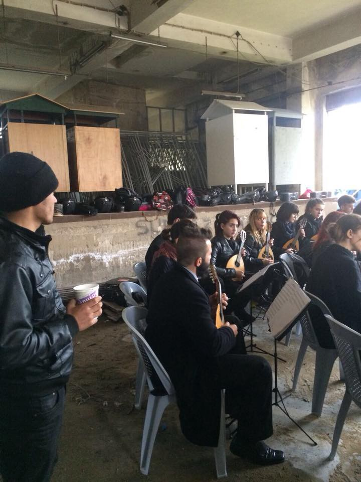

### AYS Daily Digest 17/12/17: The daily struggles of building up a new life in Europe

_Survey with immigrants and refugees shows their challenges and worries / New horror stories from Lesvos / Patras city orchester gives solidarity concert in squat / Updates from Serbia, Germany, Belgium, France and Italy_

](assets/2f4328bfe01/1*ZnGELtrcydOJA84os2xItw.jpeg)

Even when they leave the camps, immigrants in Europe often face trouble in their host countries\. Credits: [Art Against](https://www.facebook.com/artagainstproject/photos/pcb.1559715397411222/1559715150744580/?type=3&theater)
### Feature: The challenge of finding a new home

Those who reached Europe face many obstacles on daily baises, results of a survey conducted by The European Network Against Racism \(ENAR\) [show](http://enar-eu.org/Survey-reports-appalling-living-conditions-for-migrants-in-Europe-77) \. More than 5000 survey participants \(immigrants and refugees\) gave an insight about their experiences with finding jobs, treatment at work based on ethnicity, feeling of acceptance at the place where they live, discrimination and other topics related to their everyday life\. The research was conducted in five EU countries: Germany, Greece, Hungary, Italy and Sweden\.

](assets/2f4328bfe01/1*t2yV4ktwN-xJ473GhFbFWg.jpeg)

Many people are afraid of reporting crimes — especially, when they do not have a legal status\. Source: [ENAR](http://enar-eu.org/Survey-Migrants-speak-up-1468)

Getting a job”, “immigration administration” and “missing friends and family” are cited as the main difficulties for migrants in the five countries\. The majority of the respondents experienced difficulties in finding a home to live in \(77%\) and housing conditions are particularly bad in Greece\. Overcrowding is most common in reception and detention centres in Greece and Italy\. Respondents are particularly vulnerable to crime in Greece, with assaults being the most significant\. One third of respondents reported having experienced verbal abuse, with black Africans reporting the highest levels \(37%\) \. Reporting crime is an issue, especially for undocumented people due to fear of deportation\. The highest reported distrust of the police is in Hungary \(23%\) \.
### Greece

The situation on the Greek islands is very difficult, especially for vulnerable groups\. Just two days ago, Human Rights Watch published a detailed report on the situation for women in Moria hotspot on Lesvos \(read the summary in our [Friday’s digest](ays-daily-digest-15-12-17-more-responsibility-for-libya-in-sea-rescues-italy-suggests-f00e694fe8fd) \) \. Yesterday the next terrible [report](https://twitter.com/filiopk/status/942105443865976842) came out: A pregnant woman in her eight month in Moria was sleeping in a summer tent for the last two months\. Now that she was transferred to an \(isolated\) camp, she still has a dirty room that is not even heated\.

](assets/2f4328bfe01/1*duOZUzZ1pT7C9psNgCkgNA.jpeg)

Not an appropiate place for a pregnant woman\. Credits: [F\. Kontrafouri فیلیو](https://twitter.com/filiopk)

To improve the dire conditions in Moria at least a bit, the Respond team started a new [fundraiser](https://www.chuffed.org/project/we-all-love-a-shower) \. The want to set up a shower complex next to the camp and provide their guests with supplies\. For constructing and running the showers, they want to raise 15\.000 Euros\.

According to volunteer and media [information](http://astraparis.gr/stin-athina-i-sinexeia-me-tous-32-tourkous-pou-zitisan-asilo/) , the 33 Turkish nationals, who arrived in Greece by boat on Thursday, were transferred to Athens now\. The reason, that they were transferred so quickly apparently is, that there was no translator on the island\. But also, because there was no capacity in the facilities of Chios to accomodate them appropiately\.
#### Mainland

The city orchestra of Patras today gave a great example of solidarity\. It decided to give a concert in an abandoned factory building, where some people reside\. Several hundred people live in the squat and were happy to listen to the live performance\.

The city orchestra of Patras performs in an abandoned factory building\. Credits: Rando Wagner
### Serbia

It’s three weeks now, that Rigardu moved to Subotica and Sombor with their mobile showers\. They report, that the people are splitted on several spots, the volunteers try to deliver\. People still report about police violence on the Hungarian side, pushbacks, dog bites and warning through speakers, that border guards will also shoot in case of an illegal crossing — what is assumed a theoretical warning but not practice\. To avoid colds, Rigardu also bought a pavillon, so the people can change their clothes without wind\. Their full report can be found on their [homepage](https://rigardu.de/2017/12/17/schnee-und-duschen-in-subotica/) \.
### Germany

The number of new arrivals has dropped for the second your in a row\. After 280,000 crossing in 2016, Interior Minister Thomas de Maiziere presmued a total of less than 200,000 people this year, talking to Bild am Sonntag \(via [TheLocal](https://www.thelocal.de/20171217/migrant-arrivals-in-germany-fall-for-second-year-in-a-row) \) \. By the end of November, reportedly some 170,000 people were counted\.
### Belgium

The Belgium Kitchen asks for food donations to keep their work ongoing\. They provide more than 500 meals a day and published a list of their needs and items, they do not accept at the moment\. If you have access to larger amounts of food, please get in touch with them\.

### France

La Cimade reports, that one man has been rescued in the mountains at the border to Italy, walking barefeet\. He was evacuated with a helicopter and is now being treated in a hospital\. Activists also held demonstrations, urging the government move off border police in the region, causing people to take riskier routes to arrive France\.

■■■■■■■■■■■■■■ 
> **[La Cimade](https://twitter.com/lacimade) @ Twitter Says:** 

> > #TousMigrants #EGMigrations les professionnels de la montagne demandent le retrait des forces de police de la frontière. Les migrants prennent des risques pour les éviter, certains sont amputés. @[gerardcollomb](https://twitter.com/gerardcollomb) @[EmmanuelMacron](https://twitter.com/EmmanuelMacron) allez vous les entendre ? #SOSAlpesSolidaires https://t.co/EhLAoQMPqG 

> **Tweeted at [2017-12-17 12:17:29](https://twitter.com/lacimade/status/942368146987667456).** 

■■■■■■■■■■■■■■ 

### Sea

Alarmphone [managed](https://twitter.com/alarm_phone/status/942313622495289345) to find help for 16 people in two boats last night\. Meanwhile the Aquarius is heading back to Sicily with more than 300 rescued people on board in heavy seas\.

■■■■■■■■■■■■■■ 
> **[Darrin Zammit Lupi](https://twitter.com/darrinzl) @ Twitter Says:** 

> > #Aquarius heading back to Sicily in heavy seas with 320 migrants on board @[SOSMedFrance](https://twitter.com/SOSMedFrance) @[MSF_Sea](https://twitter.com/MSF_Sea) @[reuterspictures](https://twitter.com/reuterspictures) #onassignment #atsea #mediterranean #slomo https://t.co/bZELnVl8T3 

> **Tweeted at [2017-12-17 10:34:53](https://twitter.com/darrinzl/status/942342329981194246).** 

■■■■■■■■■■■■■■ 

### Italy

The volunteer group for Italy got an updated needs list for December\. You have to be member of the [Facebook group](https://www.facebook.com/groups/1834254390190027/) to see the file\.

### General

An IOM [update](http://migration.iom.int/europe/) shows, that as of December 13 in 2017 178,277 people arrived to Europe, 167,724 of them by sea and 10,553 by land\. Numbers are significant lower than 2016, when 387,895 people came to Europe\. Despite of this drop in arrivals, the number of dead andmissing people in the Mediterranean sea is still horribly high — 3095 people\.

> **_We strive to echo correct news from the ground through collaboration and fairness\._** 

> **_Every effort has been made to credit organizations and individuals with regard to the supply of information, video, and photo material \(in cases where the source wanted to be accredited\) \. Please notify us regarding corrections\._** 

> **_If there’s anything you want to share or comment, contact us through [Facebook](https://www.facebook.com/areyousyrious/) or write to: areyousyrious@gmail\.com\._** 

_Converted [Medium Post](https://areyousyrious.medium.com/ays-daily-digest-17-12-17-the-daily-struggles-of-building-up-a-new-life-in-europe-2f4328bfe01) by [ZMediumToMarkdown](https://github.com/ZhgChgLi/ZMediumToMarkdown)._
