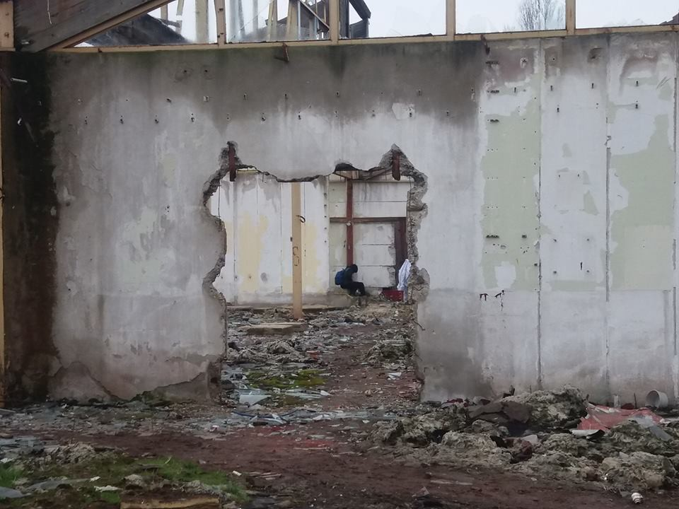
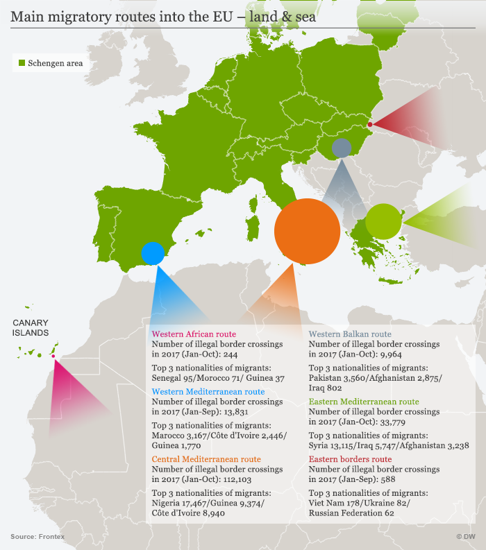
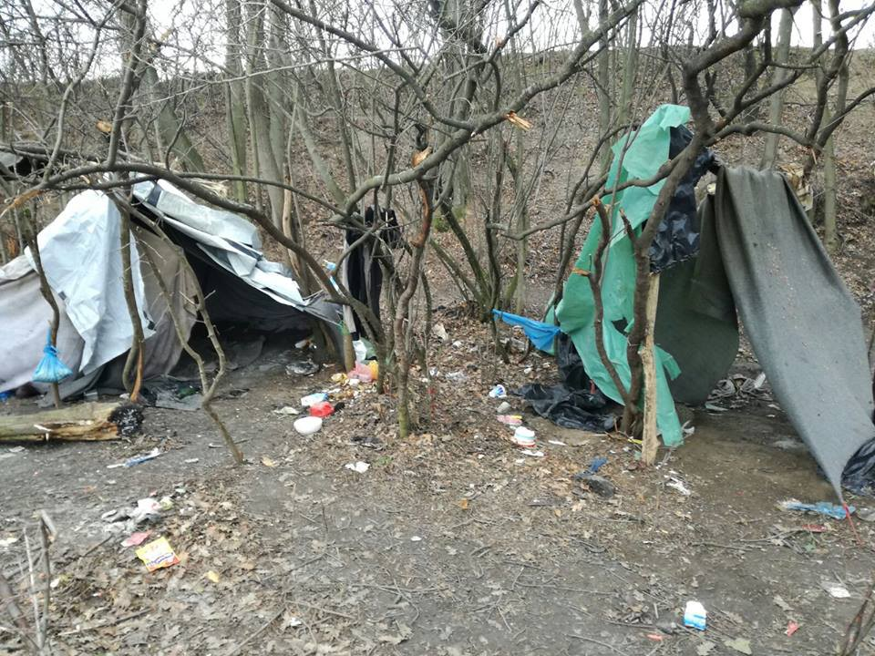
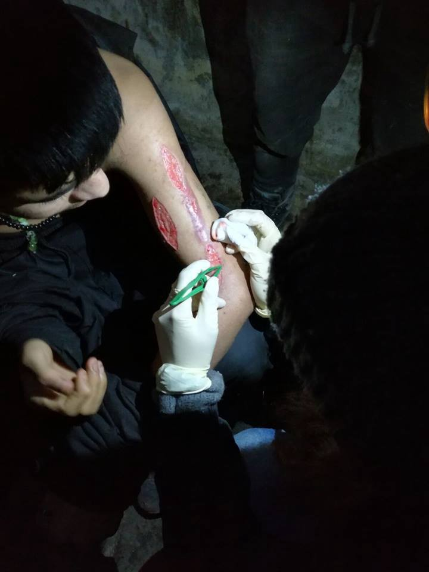
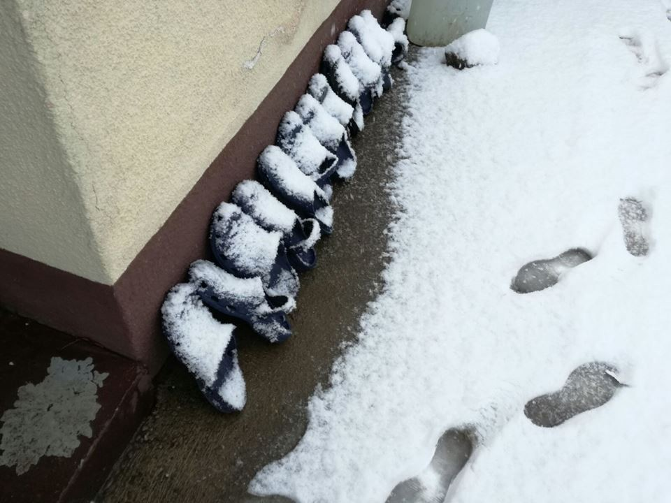
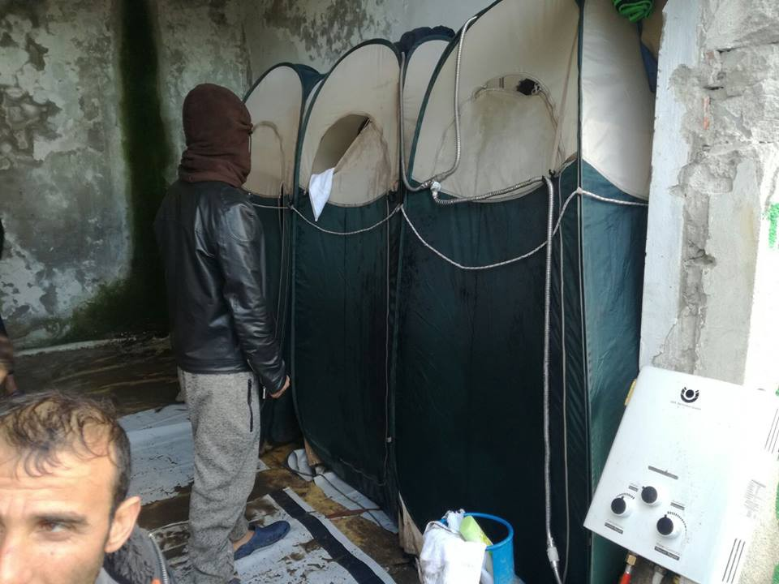

### AYS DAILY DIGEST 18/12/2017: “Calais is not good\. Police come every time\. They collect clothes, spray, hit\. \[…\]”
#### International Migrants Day opens with a report on police violence in Calais/Statistics on developments of migration movements and asylum applications in Europe/New transfers from Lesvos to mainland but a lot needs to be done/Videos showing inhumane conditions in Moria and Vial/Statement of Info Park/Situation in Pordenone and Gorizia is not improving/New fascist measures to be adopted by Austrian government/ [\#18d17ActionDay](https://www.facebook.com/hashtag/18d17actionday?source=feed_text&story_id=1870025539705851) actions all over Europe/New arrivals at sea and more news from Germany, UK, Denmark\. \.

Šid\. About 100 people were in Šid today\. The youngest one was a 10 years old child travelling with his father\. Credit: AYS

**FEATURE**

On International Migrants day, we keep reporting about the dire conditions in which refugees are forced to live in Europe, die in Europe and see their life on pause in Europe\.

We support and agree with the [statement](https://www.facebook.com/proactivaservice/posts/1734960426534801) made by Proactiva Open Arms:

“ _We have nothing to celebrate today \-Migrant Day\-, nor every other day that we are at sea\._ 
_Today and always, we denounce, and will keep denouncing, that the Mediterranean has become the greatest black hole of human rights\._ 
_They are not migrants, they are people and their rights are also ours_ ”

Meanwhile in Calais…

Police is using excessive force against refugees, in order to confiscate sleeping bags, blankets and clothing, basically everything that could help them cope with the freezing temperatures\.

In this [article](https://www.hrw.org/news/2017/12/18/france-calais-migrants-risk-cold-arrives) by Human Rights Watch, it is reported that these sort of abuses have been implemented at least since November 2017, in order to deter migrants from staying in Calais\.

The CRS \(riot police\) have confiscated and destroyed not only the above mentioned items, but also personal belongings as phones, documents and medications\.

“ _At least 500 migrants and asylum seekers, of whom an estimated 100 are unaccompanied children, are living on the streets and in wooded areas in and around Calais\. Most are from Eritrea, Ethiopia and Afghanistan_ ”

These sort of “deterrent”, violent actions have been implemented since the demolition of the Jungle in 2016, via legal court orders and personal initiative of the CRS who, not only has been physically abusing migrants, but also harassing aid workers and volunteers\.

Various NGOs \(including HRW\) working in Calais as well as the French ombudsman’s office and the National Consultative Commission for Human Rights have reported and denounced the abuses various times\.

As a result of investigations, convincing evidence was found, that police had used violence, resulting in a call for improvements in the practices carried on by the CRS\.

“ _On December 11th, after several weeks of increasingly cold weather, but before they were required by law to do so, Calais city officials opened emergency accommodation for two days, later extended through the morning of December 18th\. According to information provided by local authorities to aid organizations, this accommodation consists of containers with 70 places for women, children, and vulnerable people such as the elderly and the ill, and a warehouse with 200 places for men\. They are open only at night_ ”

But, apparently, those who reached the shelters by foot, were turned away and no information on opening hours or procedures for entry were provided\.

The freezing temperatures and scarse hygienic conditions are responsible for the increase of health issues: frostbites, hypothermia, scabies, trench foot condition and general muscle pain among others\.

The mental health is also at stake, not only the one of refugees, but of volunteers too\.

“ _French law requires opening emergency accommodation for all homeless people, including undocumented migrants, when the weather meets certain conditions, for instance when the temperature falls to \-5º Celsius \(23º Fahrenheit\) on two consecutive nights and also remains at or below freezing during the daytime\. Local officials can, at their discretion, open emergency shelters in less severe conditions_ ”

This violence is especially horrible if we think it’s directed towards unaccompanied minors too

“ _This morning the police came, more than 25\. They took all our sleeping bags, took my phone…\. When they come, they beat us\. They take our sleeping bags, our jackets, every time\. They hit me sometimes\. They use gas, all over my face\. They say, ‘Don’t sleep\. Go\!’ …\. Now life is not good\. Now it starts to rain, ice\. The night is very, very cold\. We sleep outside at night but don’t have anything_ ”

_\- 17\-year\-old boy, December 5, 2017_

**GENERAL**

When we talk about migration in Europe, of what kind of numbers are we talking about?

Infomigrants has published an [overview](http://www.infomigrants.net/en/post/6438/migration-to-europe-in-numbers) of the recent developments of migration movements updated to the first half of 2017\.

The main nationalities who sought asylum in Europe were Syrians, Afghans and Nigerians, even though the number of applications decreased significantly in 2017: \-54% of first time applications in the time span from April to June \(a total of 149\.000\), compared to the same time bracket of 2016\.

What are the most used routes?

Central Mediterranean, Eastern Mediterranean, Western Mediterranean, Western Balkan, Eastern Europe and Western Africa \(Canary Islands\) \.

Credit: Infomigrants

UNHCR [reports](https://data2.unhcr.org/en/situations/mediterranean) that 168\.982 people reached Europe via sea this year, while, according to IOM, an [estimated](http://missingmigrants.iom.int/region/mediterranean) 3\.115 people lost their lives at sea or went missing during 2017, the deadliest month being May, when 613 people lost their lives; the deadliest route being the Central Mediterranean \(2\.833 victims\) \.

The most frequent destinations, until the first half of the year, were: Germany \(28% of all the applications in the EU\), Italy, France, Greece and the UK, which was also the country with the lowest rate of positive asylum applications’ response\.

Pakistani had the highest number of rejections, followed by Nigerians and Afghanis\.

More detailed infos can be found in the article mentioned above\.

For more updated statistics and data regarding asylum applications in Europe in the third quarter of 2017, you can visit [Eurostat’s website](http://ec.europa.eu/eurostat/statistics-explained/index.php/Asylum_quarterly_report) \.

**TURKEY**

ReVi needs help reaching out to local shops, in order to improve the sales of their fantastic products\!

**GREECE**

Announcement for Pakistani applying for asylum: rumours of the opening of the Attica Regional Asylum Office to the public is not serious\! Pakistani, who wish to apply for asylum, need to do so by registering through Skype\.

_Lesvos_

As [reported](http://www.protothema.gr/greece/article/742040/mutilini-anahorisan-gia-ton-peiraia-alloi-344-prosfuges-kai-metanastes/) on Sunday, another 344 refugees and migrants left for Piraeus from Mytilene\. 
In the framework of the decongestion plan of the islands, they will be transferred to hospitality structures in Attica and other areas\.

As a whole, the withdrawals were members of vulnerable categories\. In the morning and at the port of Piraeus, UNHCR buses will be waiting for refugees to transport them to accommodation facilities in Attica and elsewhere\.

Videos recording the horrifying living conditions inside Moria have been published today

■■■■■■■■■■■■■■ 
> **[Oliver Sallet](https://twitter.com/OliverSallet) @ Twitter Says:** 

> > More exclusive footage from inside #Moria #refugee camp. Greek police wants to keep these conditions secret. We filmed with a hidden camera. Full report @[dwnews](https://twitter.com/dwnews) #MigrantsDay #Refugeesgr https://t.co/HhvbnoFOmh 

> **Tweeted at [2017-12-18 13:00:11](https://twitter.com/oliversallet/status/942741280744001537).** 

■■■■■■■■■■■■■■ 

■■■■■■■■■■■■■■ 
> **[Oliver Sallet](https://twitter.com/OliverSallet) @ Twitter Says:** 

> > EXCLUSIVE footage from inside #Moria #refugee camp, where filming is officially prohibited. On #MigrantsDay we look at inhumane conditions. Full coverage @[dwnews](https://twitter.com/dwnews) https://t.co/WOvHdv3SRd 

> **Tweeted at [2017-12-18 08:49:15](https://twitter.com/oliversallet/status/942678131319689216).** 

■■■■■■■■■■■■■■ 

[According to](http://www.ekathimerini.com/224257/article/ekathimerini/news/population-of-moria-migrant-camp-falls-below-6000-mark) Ekathimerini, the number of people stuck in Moria has dropped below 6\.000 \(5\.500\) for the first time in months, following the transfer of 1\.650 asylum seekers to the mainland\. The camp is still overcrowded, as it was originally designed to host around 2\.000 people\.

Even though transfers will increase in the next few weeks, there are also 990 people in Kara Tepe, as well as another 700 migrants staying in other accommodations in Mytilene, who needs to be taken into account\.

Arrivals in the island has reached the number of 659 since the beginning of the month, making it a total of 1\.769 people on all the islands\.

Always Ekathimerini [reports](http://www.ekathimerini.com/224231/article/ekathimerini/news/bid-to-accelerate-migrant-asylum-applications-and-returns) that the Greek parliament is expected to draft a law to boost the asylum process with a bill, this week\.

_Chios_

The conditions in Vial are not better, as we can see from the videos and pictures below

**SERBIA**

Info Park has published their press release for International Migrants Day

“ _They attacked me four times, each time it was something else, I was taken off the phone once, and the other time they saw me buying something, so they forced me to squeeze everything out of my pockets, the last time they attacked me because I defended the boy who just came and they were placed in my camp room\. Every time I retreated from a knife — and this is precisely why I fled my country: violence”, says an Afghan migrant who comes to the Info Park daily\. One in a series of testimonies of a difficult and especially unsafe situation that we hear every day_

Credit: Help\-Na

**ITALY**

As Italy — Refugee Crisis Database [reports](https://www.scribd.com/document/367471490/Sea-Arrivals-to-Italy),) , sea arrivals to Italy, up to 15/12, have reached the number of 118\.064 — 34\.09% compared to the same period of last year\.

The main countries of origin are: Nigeria \(18\.099\), Guinea \(9\.646\) and Bangladesh \(8\.939\) \.

As of 01/12, the number of unaccompanied minors is reported to be 15\.540\.

_Pordenone_

Still no public dormitory\.

Local authorities denied the possibility to open a dormitory, managed by the Red Cross, with no costs for the municipality\. They made a “restyling” of the city by letting inside the hubs those asylum seekers who had been sleeping rough for the past 2 months\.

And now?

Now they have opened the wing of an abandoned old school building, including local cooperatives and the Red Cross in the management\.

To receive who?

No one\! The asylum seekers were forced to enter the hubs before Christmas, no new arrivals are in the area, as the Questura keeps its offices closed and unwilling to accept new applications\.

They created a “dormitory” for those who are already living in the hubs, but they are not allowing those outside the reception system \(around 30\) to sleep there\. These last ones are maybe part of a larger group of people who have been expelled from the system for “misbehaviour” or that failed to have their asylum application accepted \(ndr\) \.

Temperatures are as low as \-3°\.

_Gorizia_

The situation in Gorizia is not getting better, despite the heated tent MSF donated to Caritas in order to assist those migrants sleeping rough, as stated [here](http://www.infomigrants.net/en/post/6612/italy-migrants-in-undignified-conditions-in-gorizia-msf) \.

MSF is calling for a long term solution for the city, in order to guarantee to the new arrivals and to those who aren’t part of the reception system, dignified living conditions\.

**AUSTRIA**

Few days ago, we announced the decision by the Austrian government to not accept EU refugee relocation quotas\. Today, as [reported](http://www.infomigrants.net/en/post/6607/new-austrian-government-to-toughen-migrant-stance) , it has announced that new measures will be introduced to reduce financial benefits for migrants and refugees\. The plan will cut the benefits from just under 840 euros/month \(the current amount\) to 365 euros/month\.

It is not clear when the plan will be implemented\.

Furthermore, this new action will include the duty for all asylum seekers to provide authorities with access to their personal phones\.

Refugee children should also take separate German classes and not be integrated in the regular school system\.

A demo will be organised on Wednesday 20th in Vienna to protest against deportations in war torn countries\. Follow the [link](https://www.facebook.com/RefugeeCampVienna/posts/1680575748661678?hc_location=ufi) and take action\!

**GERMANY**

Anyone facing imminent deportation, can contact [Kirchenasyl](http://www.kirchenasyl.de/herzlich-willkommen/welcome/) \. They will be able to re\-direct you to the nearest church that offers “church asylum” \(legal assistance and shelter\) \.

**DENMARK**

Today, activists gathered in front of the Europe House in Copenhagen, to protest against the EU’s fundings of slavery in Libya, as part of a wider European network of activists and people in solidarity\.

Follow the hashtags:

[\#18d17ActionDay](https://www.facebook.com/hashtag/18d17actionday?source=feed_text&story_id=1870025539705851)

[\#StopEuropeFundingSlaveryInLibya](https://www.facebook.com/hashtag/stopeuropefundingslaveryinlibya?source=feed_text&story_id=1870025539705851)

[\#StopTheWarsOnMigrants](https://www.facebook.com/hashtag/stopthewarsonmigrants?source=feed_text&story_id=1870025539705851)

to have an overview of the actions taken\.

**UK**

The Refugee Council is working on re\-defying the restrictive rules regarding family reunion\.

You can follow this [link](https://action.refugeecouncil.org.uk/savethedate/) and send it to your MP, in order to pressure them to attend the parliament vote on 16th March 2018\.

**SEA**

Consider [donating](https://www.facebook.com/seawatchprojekt/videos/1959823294235742/?fref=gs&dti=1652972374920129&hc_location=group) to Sea Watch in order to continue their amazing job of saving lives at sea\.

_Malaga_

At the port, 55 migrants were disembarked in the past few hours\. Among them, 2 minors and 7 women

Other 45 people have been [rescued](https://twitter.com/salvamentogob/status/942761314283376641) \(among them, 4 women\) off the coasts of the Alborán island\. Previously, in the same surroundings, [another boat](https://twitter.com/salvamentogob/status/942707710822318081) carrying 32 people, was rescued\.

> **_We strive to echo correct news from the ground through collaboration and fairness\._** 

> **_Every effort has been made to credit organizations and individuals with regard to the supply of information, video, and photo material \(in cases where the source wanted to be accredited\) \. Please notify us regarding corrections\._** 

> **_If there’s anything you want to share or comment, contact us through [Facebook](https://www.facebook.com/areyousyrious/) or write to: areyousyrious@gmail\.com\._** 

_Converted [Medium Post](https://areyousyrious.medium.com/ays-daily-digest-18-12-2017-calais-is-not-good-bfe519633309) by [ZMediumToMarkdown](https://github.com/ZhgChgLi/ZMediumToMarkdown)._
