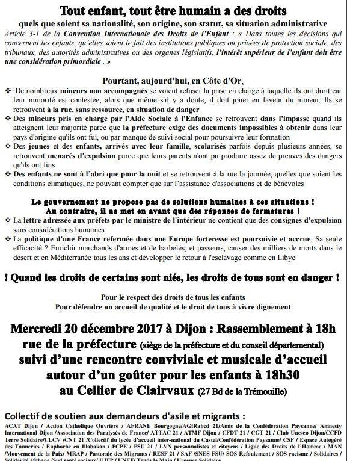
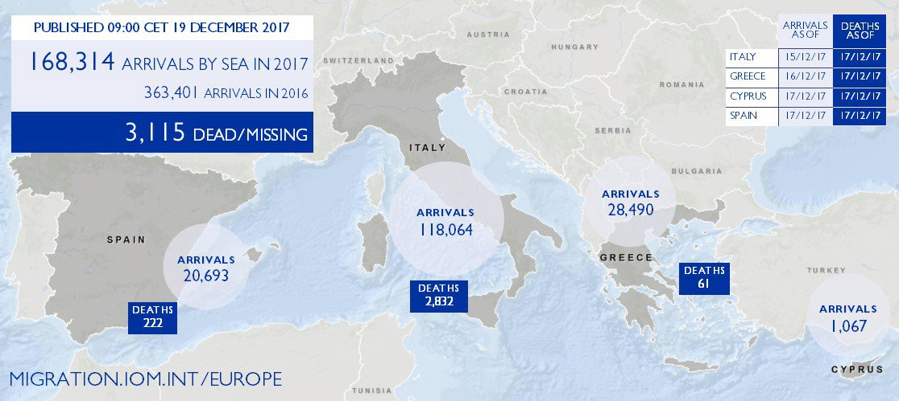

### AYS Daily Digest 19/12/2017 Clashes in Moria Camp

\#Opentheislands /// Caall for demonstration in front of Petrou Ralli detention centre, Athens /// New deportations from Norway /// Challenges to deportations from Finland /// Lack of minors reception centres in Ventimiglia /// Family of Madina press charges against Croatian Police

 \)](assets/ed787ac6cb18/1*BjnoRdwzuYkBtnVhEXN6nA.jpeg)

A clear message for International Migrants Day fromLesvos \( Photo by [Lesvos Solidarity](https://twitter.com/Lesvosolidarity) \)

**FEATURE: NEW RIOTS IN MORIA CAMP**

Around 11pm EET first reports were published about new riots within Moria camp, on Lesvos:

■■■■■■■■■■■■■■ 
> **[Michael Räber](https://twitter.com/iwatnew) @ Twitter Says:** 

> > Fire in #EU camp #Moria #Lesvos #Greece. Violent incidents inside camp, injured were brought to gate, at least 4 #refugeesGr ppl evacuated by ambulances, others treated by BRF and ERCI medics outside camp. Hundreds of traumatized families stay trapped in unsafe camp. #humanrights https://t.co/anH78Oe0Cl 

> **Tweeted at [2017-12-19 23:28:37](https://twitter.com/iwatnew/status/943261821145960448).** 

■■■■■■■■■■■■■■ 

■■■■■■■■■■■■■■ 
> **[Michael Räber](https://twitter.com/iwatnew) @ Twitter Says:** 

> > Violent incident ongoing #EU camp #Moria #Lesvos #Greece. Police teargas, fire brigade working in camp, ESAO reportedly attacked, 3 ambulances in last 30 min, BRF medics work on olive grove, injured #refugeesGr report more “broken legs and heads” inside. #humanrights https://t.co/dcKY0tohFk 

> **Tweeted at [2017-12-19 21:44:49](https://twitter.com/iwatnew/status/943235698609606656).** 

■■■■■■■■■■■■■■ 

According to news [reports](http://aa.com.tr/en/europe/violence-erupts-at-greek-refugee-camp-in-lesbos/1009646) clashes erupted between Arab, Afghan and Iraqi refugees; at least 15 people were transferred to the hospital in ambulance and fire trucks intervened to stop the fire in the camp\. Riot police intervened using teargas\. So far no information about arrests have been published\.

By 1am EET the situation in the camp seemed calm\.

Already in October several associations advised Prime Minister Tsipras that containment policies in the islands, overcrowding, unhealthy conditions and unfair treatment would have a “ [devastating impact on the long\-term well\-being of people trapped there](https://www.amnesty.org/en/documents/eur25/7343/2017/en/) ”\.

■■■■■■■■■■■■■■ 
> **[Marianna Karakoulaki](https://twitter.com/Faloulah) @ Twitter Says:** 

> > Hotspots like Moria are failed attempts to control migration. It's been more than a year of the same story and #fortressEurope has yet to realise the crime it's committing. #refugeesGR #OpenTheIslands 

> **Tweeted at [2017-12-19 21:51:38](https://twitter.com/faloulah/status/943237413740085259).** 

■■■■■■■■■■■■■■ 

LIBYA
#### **UN to evacuate 10,000 refugees from Libya in 2018**

The United Nations plans to move up to 10,000 people from Libya next year, media [report](https://uk.reuters.com/article/uk-europe-migrants-libya/u-n-to-move-10000-migrants-from-libya-in-2018-idUKKBN1ED1PV) \. This figure will comprehend voluntary returns, relocation to other Arfican countries and still\-to\-be\-defined transferals to EU countries and Canada\.
#### **MOAS evacuates to Niger 74 vulnerable refugees**

Representing an evolution of its activities, MOAS carried out its first aerial mission under a UNHCR [scheme](http://www.unhcr.org/news/latest/2017/12/5a3802b04/evacuation-libya-gives-refugees-new-hope.html) , flying 74 vulnerable refugees from Tripoli to Niamey, in Niger\. The refugees will [reportedly](https://twitter.com/moas_eu/status/941669253777850369) be relocated to safe countries such as Canada and France\.

TURKEY
#### **Employment rights denied to refugees**

Refugees international have produced a report on the employment situation for refugee in Turkey\. Even though refugees are allowed to seek employment under Turkish law, legal jobs are largely inaccessible for the vast majority of refugees in Turkey\. In study, “ [I Am Only Looking for My Rights”: Legal Employment Still Inaccessible to Refugees in Turkey](https://www.refugeesinternational.org/reports/refugeesemploymentinturkey) , Refugees International examines the challenges and consequences facing refugees as they seek employment in Turkey\.

The RI report offers the following policy recommendations, among several others:

> •The Government of Turkey should create incentives for employers to hire refugees and educate employers on the current work permit policy\. In addition, Turkey’s government should implement a clear and comprehensive informational campaign to educate the Turkish public on the positive contribution of refugees to Turkey’s overall economy\. 

> •For its part, the European Union, which provides billions of Euros to Turkey for projects to assist refugees, should place greater emphasis on livelihoods and enabling the refugee population to be self\-sufficient\. 

> •The United States should significantly increase resettlement of refugees from Turkey to the United States, particularly for people with vulnerabilities\. 

#### **Turkish Coast Guard Statistics 2016–2017**

SEA
#### Rescues in Western Mediterranean

64 people had been rescued from 2 boats in the Alboran sea by Salvamento Maritimo vessels\. They were taken to Motril and Almeria\.

■■■■■■■■■■■■■■ 
> **[SALVAMENTO MARÍTIMO](https://twitter.com/salvamentogob) @ Twitter Says:** 

> > 64 personas rescatadas de 2 pateras. Salvamar Hamal, 32 personas (5 mujeres) de patera a 58 millas al SSW de Cabo Sacratif avistada por Sasemar 101 y Salvamar Spica otra con 32 (3 embarazadas) a 41 millas al SE de is.Alborán, localizada por Helimer 206. Van a Motril y Almería https://t.co/QV3K70Qtcj 

> **Tweeted at [2017-12-19 15:18:13](https://twitter.com/salvamentogob/status/943138408582582272).** 

■■■■■■■■■■■■■■ 

Other 4 minors were [rescued](https://twitter.com/salvamentogob/status/943164950800936960) in the same hours\.
#### Support SOS Mediterranee

■■■■■■■■■■■■■■ 
> **[SOS Humanity](https://twitter.com/soshumanity_de) @ Twitter Says:** 

> > SPREAD THE WORD: People continue to flee from Libya's hell across the  Mediterranean. @[SOSMedGermany](https://twitter.com/SOSMedGermany) hasn’t stopped its operations for 22 months &amp; is still out there to save people from drowning. Share this tweet to help us continue our mission! #HumanityAtSea #TogetherForRescue https://t.co/jGt4Zz1LpG 

> **Tweeted at [2017-12-19 17:47:02](https://twitter.com/sosmedgermany/status/943175859145510912).** 

■■■■■■■■■■■■■■ 

GREECE
#### **\#Opentheislands**

■■■■■■■■■■■■■■ 
> **[Oxfam International](https://twitter.com/Oxfam) @ Twitter Says:** 

> > With just a couple of days before the official start of winter, no one should be forced to sleep in the cold on #Greece Aegean Islands. [oxf.am/OpenTheIslands](http://oxf.am/OpenTheIslands)  #OpenTheIslands #RefugeesWelcome https://t.co/sbSOY0W9i9 

> **Tweeted at [2017-12-19 09:10:10](https://twitter.com/oxfam/status/943045782403534848).** 

■■■■■■■■■■■■■■ 

**Human Rights Watch’s [call to action](https://www.hrw.org/opentheislands) to \#opentheislands**

> Winter is nearly here, and more than 15,500 asylum seekers are trapped on Greece’s islands in worsening weather conditions\. European Union\-sponsored processing centres housing them are filthy and overcrowded — many people, including women and children, are forced to sleep in summer tents or on the ground\. 

> This is happening because Greece, with the support of other EU countries, has put in place a containment policy to prevent asylum seekers from leaving the islands to the mainland\. But the Greek government can change this\. They can ensure that by December 21, the start of winter, no one sleeps in these arduous conditions\. It is high time they ended this inhumane containment and \#opentheislands\.” 

[**ACT NOW**](https://twitter.com/intent/tweet/?text=Nobody%20should%20be%20forced%20to%20sleep%20in%20the%20cold%20this%20winter.%20End%20the%20inhumane%20containment%20of%20asylum%20seekers%20on%20the%20Greek%20Islands.%20%40EUCouncil%20%40Tsipras_EU%20%40PrimeMinisterGR%3A%20%23OpenTheIslands%20https%3A%2F%2Fwww.hrw.org%2Fopentheislands%20%20) — Click to tweet Alexis Tsipras

> Please tell Greece’s Prime Minister and EU member states to end the containment of asylum seekers on the Islands by December 21, and call on other European leaders to support Greece in doing so\! 

■■■■■■■■■■■■■■ 
> **[MSF Sea](https://twitter.com/MSF_Sea) @ Twitter Says:** 

> > There are more than 500 #people on the waiting list of our mental health clinic in #Lesvos. @[MSF](https://twitter.com/MSF) just cannot respond alone to the needs produced by trapping these people in #Moria. We call on the Greek authorities to increase medical care and #opentheislands! https://t.co/sSrS2z8Pxu 

> **Tweeted at [2017-12-19 15:46:10](https://twitter.com/msf_sea/status/943145438974267392).** 

■■■■■■■■■■■■■■ 

[Chios Eastern Shore Response Team — Info Point](https://www.facebook.com/groups/421759534684819/) published some videos from Vial camp during their distribution of winter clothing, showing the condition of the _outside_ camp\. Watch them [here](https://www.facebook.com/groups/421759534684819/permalink/724899594370810/?hc_location=ufi) \.
#### Denouncement on Relocation program

Athens Legal Support Team published a video denouncing the malfunctioning of the Relocation program\.

#### Demonstration outside Petrou Ralli Detention Centre, Athens

A group of activists are calling interventions to bring attention to [Petrou Ralli](ays-special-tragic-story-of-8-algerian-men-from-petrou-ralli-719eea82340) detention centre and the situation of [8 detained men](ays-special-tragic-story-of-8-algerian-men-from-petrou-ralli-719eea82340) \.

Co\-ordination of syllogikotḗtōn and individuals against detention centres \(Ssaekk\) calls for open intervention outside the EU’s immigration address\. Ralli on Thursday 21/12/17 at St\. Anna at 17\.45\.

_Immediate liberation of the persecuted_

#### Khora Athens to start financial support for volunteers

> [Khora](https://www.facebook.com/KhoraAthens/) is going to start supporting volunteers who cannot afford to give their time for free and have limited opportunities to support themselves financially\. The initial phase will begin on the 1st of January and finish on the 30th of April\. 

> Financial support is for refugees, asylum seekers and native Greek speakers\. 

> Applicants must be able to commit to four shifts a week \(or two shifts a week if its a part\-time role\) \. 

> Find out more and apply online in English / Greek through following links: 

> There are Arabic, Farsi, Dari & Urdu forms available at the info desk\! 

> Applications will close on the 24/12/2017 

English form: [https://goo\.gl/forms/TNK1HnyJRLUP6FBz2](https://goo.gl/forms/TNK1HnyJRLUP6FBz2)

Greek form: [https://goo\.gl/forms/s7PmvjlPOhidRfJ82](https://goo.gl/forms/s7PmvjlPOhidRfJ82)

**Education 4 Community**

[No border school](https://www.facebook.com/noborderschool/) and [Jafra foundation in Greece](https://www.facebook.com/JafraFoundationinGreece/) launched a new project:

> We strongly believe in the value of language classes as they both empower and bring people together\. At the moment the focus is on English, which offers people who are encountering a new and unfamiliar life a way to communicate and to feel comfortable but is also a skill that will help them to begin working and sustaining themselves\. 

> Jafra offers Arabic classes for children, as well as maths and music classes in Arabic\. Many of the children have missed out on years of schooling, due to war and instability\. There is great value in giving them an opportunity to learn and consolidate skills in what is a native language for the majority of those involved in the program\. 

> We also offer a host of creative and practical courses, including art, dance and photography classes to both children and adults\. These provide creative outlets, allowing people to express themselves and experience a degree of healing\. They can also be an important part of preserving and sharing culture\. The ‘Dabke’ classes, for example, teach a traditional Palestinian folk dance\. They form part of our youth program and we regularly host public shows\. Our Dabke shows and classes add richness to the program, allowing us to showcase our culture and invite people to experience it with us\. 

> Our education program includes practical and vocational training opportunities\. We offer courses in sewing, knitting, and hairdressing\. The vocational training aims to equip women with the skills to start supporting themselves in their new countries\. 

> We are also set to open an art café, which will specialise in Middle Eastern cuisine and sell products made by people taking part in our training courses\. By opening the art café we hope to keep our culture alive and to share it with the local community in Greece\. 

> In addition, we are planning to run informative talks on Middle Eastern culture and Arabic language classes for those volunteering in Athens\. The team at Jafra is mostly made up of refugees of Middle Eastern origin, with a great deal of cultural understanding\. We want to use this knowledge to foster an informed solidarity amongst volunteers of all nationalities working here in Greece\. Through lectures and language classes we hope to strengthen the connection between volunteers and refugees, and to share our culture and identities\. 

Read more and support them [here](https://chuffed.org/project/education4community)

Urgent need for cook in [Soul Food Kitchen](https://www.facebook.com/dirtybunch/) in Thessaloniki, Greece from January 10 till end of January\.

DocMobile need volunteers, if you are medically trained and can collaborate with them message them [here](https://www.facebook.com/docmobile.org/photos/a.1115077615231588.1073741829.1112468405492509/1771482879591055/?type=3&theater) \.

ITALY
#### **Ventimiglia lacks facilities for children and teenagers**

Local groups sounded alarm over the situation of unaccompanied minor migrants in Ventimiglia\. As of December 11 the adult migrants reception centre “Parco Roja” hosts, alongside 426 adults, 9 women alone, 30 families and 24 unaccompanied minors, Infomigrants [reports](http://www.infomigrants.net/en/post/6633/groups-sound-off-on-ventimiglia-s-lack-of-minor-reception) \.

> Moreover, associations are “very worried for the situation of numerous foreign unaccompanied minors who are in Ventimiglia outside the reception system, on the shores of the Roja River”\. Living in “makeshift shelters, without heat or restrooms, without access to drinking water and food, exposed to abuse and violence\. There is also the presence of some young women minors, who are often victims of sexual assault, some who whom have small children”\. 

> Placing unaccompanied minors in a reception center not dedicated exclusively to them “represents a serious violation of the \(national\) law” and “of numerous EU and international laws”, the associations said\. During 2017, “various appeals have been filed with the European Court for Human Rights to protect MSNA placed in adult reception centres, following which the Court ordered five precautionary measures according to Article 39 of the Rules of Court, ordering the Italian government to transfer the appellants to adequate structures, ensuring reception conditions in line with internal and international law in terms of protection of unaccompanied minors”, the associations said\. 

> “We hope that the illegitimate practice of the lack of reception for MSNA stops immediately,” they said\. 

SPAIN
#### Increase in border crossings in Ceuta

According to [InfoMigrants](http://www.infomigrants.net/en/post/6638/ceuta-border-vulnerable-migrant-assaults-up-34-percent) the border at the Spanish enclave of Ceuta in Morocco has seen a 34 percent increase in attempts to cross the border in the last year\. There have been 26 attempts to cross the wall since the start of the year\.

> In this time, 1,130 migrants have managed to enter Spanish territory, not including those who arrived by sea with motorboats, small vessels and via rescue off the coast of the autonomous city\. 

There has also been criticism from Amnesty International regarding the force used by border guards\. Read more [here](http://www.infomigrants.net/en/post/6638/ceuta-border-vulnerable-migrant-assaults-up-34-percent) \.

CROATIA
#### **Madina’s family press charges against Croatian police**

Family of 6\-year old Madina, who died one month ago at the serbo\-croatian border, has pressed criminal charges against the unknown Croatian police officers who pushed them back to Serbia moments before the tragedy\.

Charges include manslaughter, violation of children’s rights, abuse of power, and inhumane treatment which resulted in trauma for the entire family\.

On Croatian side, the case is handled Are You Syrious and Center for Peace Studies \(CMS\), with support from APC/CZA in Serbia\.

The family said they’re not filing charges only for themselves, but for all the other victims of border violence, in hopes that future tragedies might be prevented\.

> Family with 6 children that was caught near the border asked for protection and asylum, but police refused to grant them their rights\. They told them to walk the train tracks back into Serbian territory\. They refused mother’s request to at least let them rest overnight, because children were tired and cold\. This resulted in the death of the child _\(Sanja Bezbradica Jelavic, family’s lawyer\)_ 

AYS published three reports on systemic abuse and neglecting of refugee’s rights, to the extent that refugees whom we talked to in Sid think that there’s no asylum system in Croatia anymore\. A new one will be published in January\.

> In this year only, UNHCR has registered around 3000 pushbacks from Croatia to Serbia\. Many of them were abused and humiliated in the same manner as Madina’s family\. Many of them say that police officers ordered them to walk the same train tracks into the Serbian territory\. It was just a matter of time before a tragedy like this would happen\. _\(Tajana Tadic, AYS\)_ 

> Even Croatian police admits they’re not letting people in Croatia, but they describe this practice as “discouragement”\. 

HUNGARY
#### Testimonies from the transit zone

Migszol, the Migrant solidarity group of Hungary, would like to share their final patch of [testimonies](https://www.migszol.com/transit-zone) from the transit zone on the Hungarian\-Serbian border \( \#14 — \#23\) \. All testimonies were collected this autumn, they are simultaneously a happy and a sad read\. While parents rejoice children can finally to go to school, the experience of detention is devastating\.

GERMANY
#### Starting Below Zero

Trixiewiz have released their new collaboration\-project “ [Starting below Zero](http://www.trixiewiz.de/starting-below-zero-a-guide-by-and-for-refugee-women/) ” — a Guide for and by Refugee Women\. The brochure is available in Arabic, Farsi, English, Albanian, German \(and soon Kurmanji\) \.

> This brochure is aimed at you, living in a refugee camp and it contains a lot of practical information\. It is also aimed at people who support you\. In the following pages you will find quotes, explanations, lists of addresses of useful organizations, as well as empowering phrases and illustrations\. The lists of addresses do not by far cover all the many initiatives and organizations that offer support and counselling, but we tried to give an overview\. The main topics covered in this brochure are health and care, legal counselling \(also regarding discrimination\) and information on topics that are specific to women\. 

FRANCE
#### Demonstration in Dijon, Wednesday 20th December

[ATMF — Association des Travailleurs Maghrébins de France](https://www.facebook.com/ATMFnational/) launched a demonstration in Dijon for Wednesday 20 December to protest against French state policies towards refugees and minors especially\.

> All [\#children](https://www.facebook.com/hashtag/children?source=feed_text&story_id=1973920365957967) , all being [\#human](https://www.facebook.com/hashtag/human?source=feed_text&story_id=1973920365957967) , has [\#rights](https://www.facebook.com/hashtag/rights?source=feed_text&story_id=1973920365957967) 
 

>  Regardless of nationality, origin, status, administrative status… 

NORWAY
#### Deportations to Kabul

[AMASO](https://www.facebook.com/permalink.php?story_fbid=1775049202525356&id=195295217167437) report that 5 Afghan asylum seekers, most of them young boys deported from Norway, have arrived in Kabul this Morning\. Norway deports 3–8 people back to Kabul on a weekly basis\. The deportees from Norway also include families\.

FINLAND
#### Important development for fighting cases of child deportation

The Finnish Supreme Administrative Court [ruled](https://us1.campaign-archive.com/?u=8e3ebd297b1510becc6d6d690&id=8c97f2d551#11) that being in contact with the family of a minor is not in itself a proof that a child will be taken care of upon return\.

> On 10 November 2017, the Supreme Administrative Court of Finland ruled in case KHO:2017:172 regarding the return order and two\-year entry ban issued to a Moroccan unaccompanied minor after the rejection of his asylum application\. 

> The Supreme Administrative Court ruled that Article 10\(2\) of the Returns Directive requires Member States to ensure that a minor will be returned to a member of his or her family, a nominated guardian or adequate reception facilities in the country of return\. However, the fact that the minor is in regular contact with the member of the family cannot, in itself, be regarded as evidence that he will have adequate reception at home\. In the case in question, the child’s mother had informed the Finnish child welfare authorities that she was ill and homeless, thus not being able to care for his son\. 

> The minor in the case had been taken into care by the child welfare authority\. The Court stated that the fact that a child had been taken into care was not an absolute obstacle for a decision of deportation\. However, the Court recalled that according to the Finnish Child Welfare Act, the social welfare institution has the right to decide on the child’s whereabouts, education and general care and concluded that the applicant cannot be deported before the child’s welfare measures have terminated\. 

> Therefore, the Supreme Administrative Court annulled the decisions of return order and entry ban of the Finnish Immigration Service and of the lower Administrative Court and referred the case back to the Immigration Service for reconsideration\. 

UK

**Inadequacies of court rulings in cases against immigration officers**

Free Movement published a [detailed account](https://www.freemovement.org.uk/immigration-officer-excessive-force-shittu/) revealing the the inadequacies and bias of court ruling in trials against the Home Office for using excessive force against migrants during the removal process\.

Civil claims against the Secretary of State in these circumstances turn on whether the first instance judge will accept the claimant’s evidence against the evidence of immigration officers, who benefit from their own written record of events and being able to provide a set of corroborating accounts\.

> \[…\] Whilst this is generally an appropriate stance to adopt in civil appeals, it is less certain whether it is the correct approach to alleged torts committed by the Home Office while exercising its immigration powers\. The Home Office is in the unique position of being able to remove potential claimants from the jurisdiction, which will usually prevent a claim from being brought against it\. 

> In the context of a removal attempt, the Secretary of State can commit civil wrongs with near impunity knowing that the victim of the tort will imminently leave the jurisdiction and therefore has no time to instruct lawyers\. The imbalance of power in this situation means that the Court of Appeal should rigorously re\-evaluate the findings of trial judges in the knowledge that many meritorious claims will not reach the courts\. 

EU

■■■■■■■■■■■■■■ 
> **[ECRE](https://twitter.com/ecre) @ Twitter Says:** 

> > Top country of origin of applicants for international protection in Italy is Nigeria. In Poland, most asylum applicants are from the Russian Federation. Across Europe, Syria &amp; Afghanistan are top countries of origin  - #AIDA January to November 2017 https://t.co/i8qkO3IvU6 

> **Tweeted at [2017-12-19 14:58:04](https://twitter.com/ecre/status/943133335773175809).** 

■■■■■■■■■■■■■■ 

GENERAL
#### **Missing Migrants new data**

Missing Migrants project published new data on arrivals and death in the sea:

A new [Fatal Journeys Report](https://publications.iom.int/system/files/pdf/fatal_journeys_3_part2.pdf) was published as part of a larger project documenting the number of lives lost during migration\.

> The publication of this report is particularly timely, as the 192 UN Member States prepare to discuss the adoption of a global compact for safe, orderly and regular migration\. A key indicator of unsafe migration is the number of migrants who perish each year during their journeys\. Sadly, there seem to be few signs that this number is decreasing\. 

> Since the beginning of 2014, IOM has recorded the deaths and disappearances of nearly 25,000 migrants\. IOM has also calculated that at least 60,000 migrants have died since the year 2000\. 

> The Mediterranean crossing, which has claimed the lives of 15,000 migrants since it first made headlines in October 2013, is just one example of the many migration routes that see numerous fatalities each year\. 

> However, the true number of migrant fatalities is unknown, as not all deaths and disappearances are reported\. In many remote regions of the world, bodies may never be found, and many migrants may never be identified\. 

> Each nameless death represents a family missing a loved one\. 

> **We strive to echo correct news from the ground through collaboration and fairness\.** 

> **If there’s anything you want to share or comment, contact us through Facebook or write to: areyousyrious@gmail\.com** 

_Converted [Medium Post](https://areyousyrious.medium.com/ays-daily-digest-19-12-2017-clashes-in-moria-camp-ed787ac6cb18) by [ZMediumToMarkdown](https://github.com/ZhgChgLi/ZMediumToMarkdown)._
