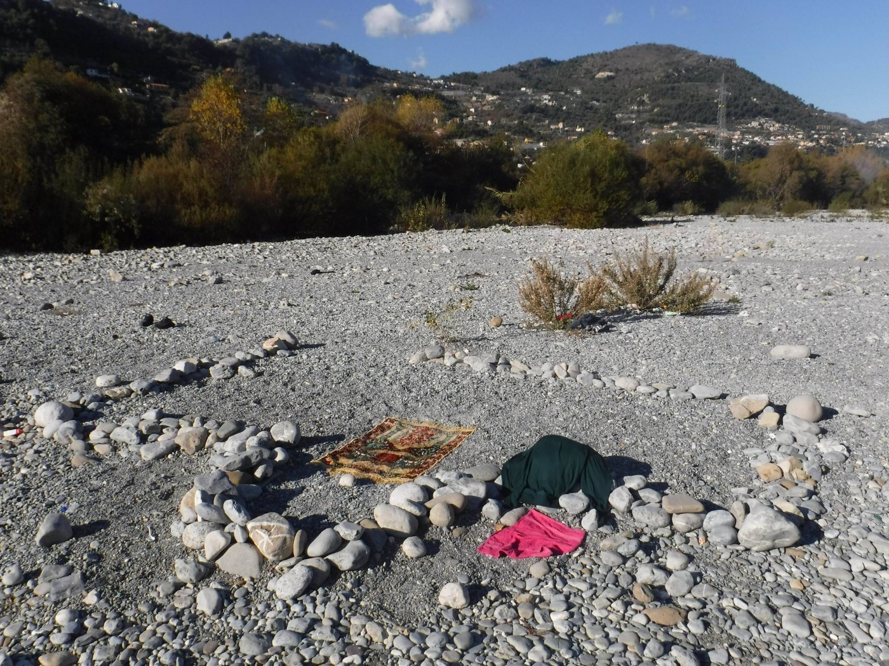
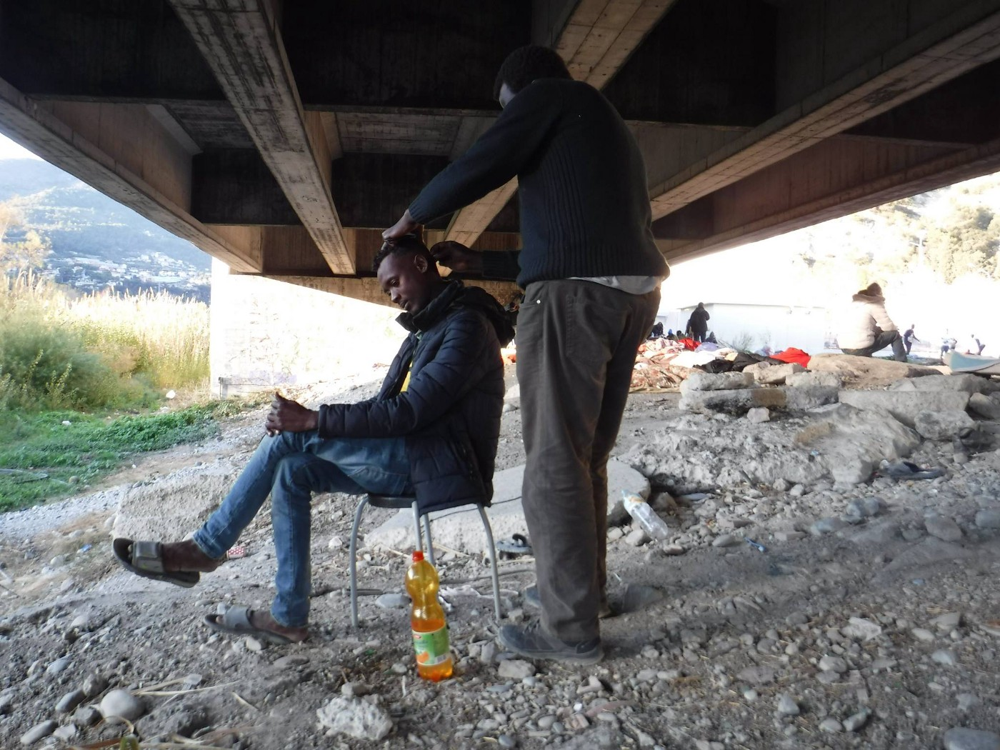
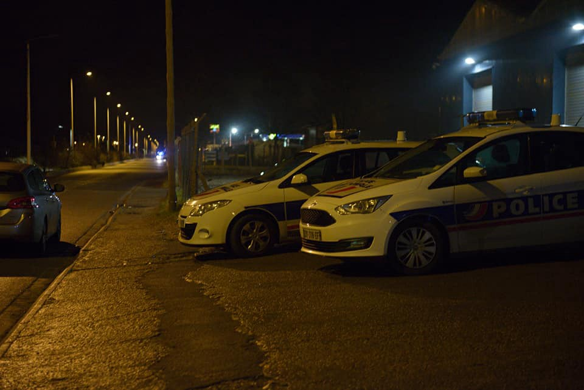
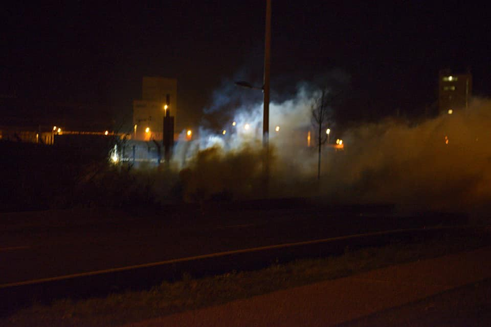
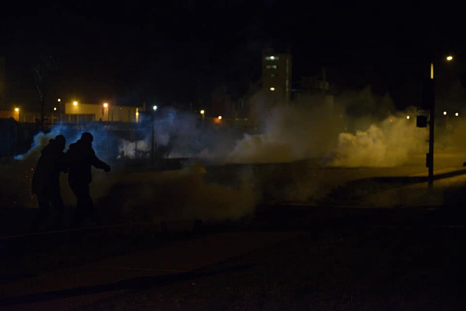

### AYS Daily Digest 20/12: Winter threatening thousands of lives
#### Denmark ignores the recent studies and decides to say “no” / Refugees no longer need to pay for flights to reunite with families / Islands on the verge of disaster, officials either using force, casting blames or ignoring / Grand Synthe’s shelter inadequate and reflects state measures / Calais police cruelty continues / Switzerland funds missing people project / UK looking for hosts, volunteer groups in Greece looking for help and aid, …

](assets/ea479c660e21/1*6QjZ91Te2r7jhPnLOfrKMw.jpeg)

by: [NoBorders](https://www.facebook.com/nobordersnetwork/?ref=gs&fref=gs&hc_location=group_dialog)
#### FEATURE
### A ‘paradigm change’ in Denmark’s attitude to asylum

New rules regarding asylum seekers are being demanded by the nationalist Danish People’s Party in return for support for tax cuts, a hot topic in the Danish political scene\.

According to the proposed scheme, all refugees granted so\-called temporary asylum are [denied the right to family reunification and will be returned to their home country](https://www.thelocal.dk/20171207/syrians-can-reunite-with-families-in-aleppo-danish-peoples-party) once it is considered to be safe\.

> Refugees on temporary stays would also be barred from integration services such as language lessons and the so\-called ‘basic integration education programme’ 

“If you are here with asylum status, you must go home when there is peace in your home country,” a government spokesperson for immigration [said](https://www.thelocal.dk/20171218/refugees-with-jobs-should-be-sent-home-danish-mp) \.
#### LIBYA
### Over 25,000 Nigerians held in slave and sex camps

Director General of the National Agency for the Prohibition of Trafficking in Persons [officially stated](http://saharareporters.com/2017/12/20/over-25000-nigerians-held-slave-and-sex-camps-libya) this information on Tuesday, adding that the recent trend which marked the resurgence of the slave trade was more alarming and required the attention it deserve\.

> There are 700\.000 illegal immigrants in Libya, 30\.000 of whom are in detention centers across Libya, _Libyan Anti\-Illegal Immigration Authority [said](https://www.libyaobserver.ly/news/700000-illegal-migrants-libya-30000-whom-are-detention-centers-libyan-official) \._ 

16\.000 people have been deported to their countries of origin from Libya, IOM said earlier, adding that it has a plan that will see another 15\.000 people repatriated before the end of February\.
#### SEA

■■■■■■■■■■■■■■ 
> **[SALVAMENTO MARÍTIMO](https://twitter.com/salvamentogob) @ Twitter Says:** 

> > Salvamar Arcturus ha rescatado 10 hombres de origen subshariano de una patera, 5'5' al sur de la isla de Tarifa, que se buscaba desde esta madrugada. Han sido trasladados a @[puertotarifa](https://twitter.com/puertotarifa). 

> **Tweeted at [2017-12-20 07:47:39](https://twitter.com/salvamentogob/status/943387407889719296).** 

■■■■■■■■■■■■■■ 

#### GREECE
### Weather warning

The whole of Greece will be in the grip of an ice\-cold weather front coming from the north\. The National Meteorology Service warns of snow and rainstorms, frost, and a temperature drop far below freezing but also of stormy winds above 9 Beaufort\.
### Lesvos

Over the course of the day, 4 boats arrived on Lesvos carrying 226 people\.

The [mayor of Lesvos filed a lawsuit](http://www.ekathimerini.com/224330/article/ekathimerini/news/lesvos-mayor-files-suit-over-conditions-at-moria-migrant-camp#item-comments) in the island’s Court of Misdemeanors, claiming that the law is being broken at the government\-run facility at Moria, which is supervised by the military\.

](assets/ea479c660e21/1*67bwu9p38FM8cULYJB2t3Q.jpeg)

“ Stage 2 right now with 59 people just arrived to the south and the bring them here because Moria camp closed until the fix the problem from last night\.” — Photo: [Refugee 4 Refugees](https://www.facebook.com/Refugee4Refugees/)

Around 10 people were rushed to hospital on Lesvos on Tuesday night following violent clashes between rival groups in the Moria refugee and migrant camp, Greek media [report](http://www.ekathimerini.com/224324/article/ekathimerini/news/around-10-people-injured-in-clashes-at-moria-migrant-camp-on-lesvos) \. Journalists are not allowed into the military\-run camp without the prior agreement of authorities, so the exact extent of Tuesday’s and other similar clashes are not known\.

On the other hand, No Border group reports:

> Riots at Moria, ended at 4 in the morning, 15 refugees injured, 8 of them hospitalised\. Fight stared while waiting long time in line for toilets and shower\. Again and again\. 
 

> If you blame nationalities for the riots, and not this EU fucking hell created for these people, better wake up\. 

Local volunteers also write about the Moria fight aftermath:

“Fighting again last night in Moria camp, 15 people stabbed, nearly every night now fighting, the poor families with their children going through this every night, the children will be scared for life living in this hell hole, this is Europe 2017, shame on the European commission, shame on the European parliament, shame on the aid agencies, you are responsible for putting human beings through a living hell\. Just been informed 3 people died in the fighting last night\.” — [Eric Kempson](https://www.facebook.com/eric.kempson.7?hc_ref=ARQsEuoxUakYqiKGFUUfrmY5IaINJdYgbb6JX0iZ34nPYIJLv-lecxyJd7mQ9JNv5Rg&fref=nf)

Reactions to what has been going on on Lesvos recently keep appearing:

■■■■■■■■■■■■■■ 
> **[Terre des Hommes](https://twitter.com/TDH_IF) @ Twitter Says:** 

> > Winter officially starts tomorrow on the Greek Aegean islands.

But children are STILL being forced to spend it in flimsy tents.

@[tsipras_eu](https://twitter.com/tsipras_eu) and @[EUCouncil](https://twitter.com/EUCouncil), it's time to #OpenTheIslands and move those trapped there to safety on the mainland!

[destination-unknown.org/support-the-ca…](http://destination-unknown.org/support-the-campaign-to-move-asylum-seekers-in-greece-to-safety-before-winter-hits/) #RefugeesGR [twitter.com/itvnews/status…](https://twitter.com/itvnews/status/943251532446949376) 

> **Tweeted at [2017-12-20 12:03:00](https://twitter.com/tdh_if/status/943451668145897473).** 

■■■■■■■■■■■■■■ 

■■■■■■■■■■■■■■ 
> **[Eva Cossé](https://twitter.com/Eva_Cosse) @ Twitter Says:** 

> > The tent of this lovely Afghan family was totally burned during last night’s fire at #Moria ! 1000s trapped on Greece’s islands are at risk. It’s high time @[PrimeministerGR](https://twitter.com/PrimeministerGR) acts to #OpenTheIslands [hrw.org/opentheislands](http://www.hrw.org/opentheislands) https://t.co/jKyUZ3wHVY 

> **Tweeted at [2017-12-20 13:43:20](https://twitter.com/eva_cosse/status/943476917805699074).** 

■■■■■■■■■■■■■■ 

■■■■■■■■■■■■■■ 
> **[NoBorderKitchen](https://twitter.com/noborderkitchen) @ Twitter Says:** 

> > Refugee in wheelchair deported from #Lesvos to #Turkey by ferry under #EUTurkeyDeal on 14/12/17. Stop all deportations NOW!
#OpenTheIslands #RefugeesGR #stopdeportation https://t.co/FmIfReEZST 

> **Tweeted at [2017-12-20 19:20:37](https://twitter.com/noborderkitchen/status/943561795662434305).** 

■■■■■■■■■■■■■■ 

■■■■■■■■■■■■■■ 
> **[F. Kontrafouri فیلیو](https://twitter.com/filiopk) @ Twitter Says:** 

> > When a few days ago the mayor of #Lesvos described to me #Moria as the "Dachau of modern times," I thought he was too extreme. I've been to the camp several times in the past but this time, what I saw and heard in there made me feel UTTERLY ashamed to be a European. [twitter.com/FotiniRantsiou…](https://twitter.com/FotiniRantsiou/status/943366738925768704) 

> **Tweeted at [2017-12-20 18:28:10](https://twitter.com/filiopk/status/943548597211189251).** 

■■■■■■■■■■■■■■ 

The Olive Grove is a separate makeshift camp outside the gates of the Moria hotspot on Lesvos, where hundreds of people live without any security, electricity, showers, or running water\. Dozens of families, single women and children were living in summer tents in the Olive Grove by early December 2017\. Human Rights Watch writes about the mental health crisis facing asylum seekers on the island\. Read the story [**here**](https://www.hrw.org/video-photos/interactive/2017/12/21/trapped) \.
### Chios

](assets/ea479c660e21/1*8UaAzOhKL3-fNmvtDDKjWQ.jpeg)

Chios, photo: [Ruhi Loren](https://www.facebook.com/ruhi.akhtar.7)

Refugee Support Europe comment on the fact that people are still trapped on the islands, in spite of the possible solutions for their move to the mainland, including the fully prepared and set up camp Katsikas:

> It is OUTRAGEOUS that there are still delays transferring refugees from the overcrowded and inhumane conditions on the islands, to Katsikas camp on the mainland where there are empty, warm and dry homes waiting for them\. We have become accustomed to broken promises on refugee movements but this is ridiculous\. It would be funny if it didn’t mean that people who have suffered enough, are being made to suffer even more and so unnecessarily\. 

> Katsikas was supposed to receive people in April but then underwent further upgrades to receive people on 15 December\. Yet here we are on 20 December, after 2 weeks of hard work from our volunteers to prepare our shops and welcome packs for every new arrival, with all the other agencies and volunteer groups here and ready to help, but with no refugees on the camp and no clear information on when they will arrive\. 

> But this isn’t about the support agency schedules — this is about trying to do the best for people \(…\)
 

> The refugees want to leave, the island authorities want them to leave, the govt has committed to moving them so why on earth is there still a delay? 

> At best it is negligent, at worst it is criminal\. 

### Chef needed at SoulFood Kitchen

URGENT CALL FOR CHEFS: if you have experience with cooking, especially for many people who like spicy food and you would like to donate some of your time by volunteering, [SOUL FOOD Kitchen](https://www.facebook.com/dirtybunch/?fref=mentions) / [Philoxenia — food and kindness in action](https://www.facebook.com/teamphiloxenia/?fref=mentions) are urgently looking for cooks who can help **from 10th January until 1st February** \. 
For more information please contact them on links from the text\.
### Khora needs first aid supplies

Khora Community Centre in Athens is in dire need of first aid materials, if you have a possibility to come with some supplies or to organize a delivery, please contact them beforehand\.

](assets/ea479c660e21/1*B8EYl8ea_XlrGS36L70i-A.jpeg)

A special day for the kids of CityPlaza that took their certificates from the public schools\! Solidarity win\! — [**Refugee Accommodation and Solidarity Space City Plaza**](https://www.facebook.com/sol2refugeesen/)
### Ministry of the Migration Policy issued an announcement regarding those to whom the Dublin III regulation applies…

> _The National Dublin Unit of the Asylum Service informs that:_ 
 

> _Following the successful outcome of the international public tender number 8310/28–04\- 2017 concerning the «Transportation services of international protection applicants to the responsible Member States, within the framework of the European Regulation 604/2013 of the European Parliament and Council of June 26th 2013 \(Dublin III\)», it is announced that the successful contractor is the travel agency «ZORPIDIS TOURIST ORGANIZATION Commercial SA», for the time period from the signing of the contract, that is 08–12–2017 up to 31–12\- 2018\._ 
 

> _It is of utmost importance for applicants of international protection and family reunification based on the «Dublin ΙΙΙ» Regulation, to know that: _ 
 

> _\- «ZORPIDIS TOURIST ORGANIZATION Commercial SA», shall issue tickets based on the lists received from the Asylum Service — National Dublin Unit and following the communication of the Asylum Service with applicants by phone\. _ 
 

> _\- In order to avoid potential misunderstandings and unnecessary hassle, we kindly ask all persons whose transfer is pending not to contact the travel agency individually\._ 

### …refugees no longer have to pay for tickets to complete family reunification process

[Mobile Info Team](https://www.facebook.com/mobileinfoteam/?hc_ref=ARRBdxAwcsHbJfVPyg2Ij05N4Po2OIWeEYCtP3mkwyDC6444dxKzIb80UpJosC7q6XY&fref=nf) confirmed with Dublin Transfer Unit that **flights will now be fully paid by the European Union and the Greek state** \. From today they will start booking flights again\. As Himalaya Travel did not completely book all flights for the last list that came out, as of today people will be contacted for this\. Around **200 people were still on the list for Germany and around 40 people were still on the list for other countries** \(such as the United Kingdom\) \. After these people are contacted and booked, new lists will come out next year\.
PLEASE NOTE: **No one should call Zorpidis Travel\!** Only the Greek Asylum Service will organize flights with refugees directly\. All refugees will be called by the Greek Asylum Service with a translator to confirm their booking\. Then people can go to collect their tickets from the travel agency office office in Athens or in Thessaloniki\. Transfer Unit also confirms that **if a refugee cannot collect their ticket themselves a representative can collect on their behalf\.** Please be aware that this is a new system that still might be adapted\. Mobile Info Team will update you if there are any changes\.
#### ITALY
### Ventimiglia

](assets/ea479c660e21/1*0n5rvPjg6QF26CDMjUQ67g.jpeg)

Photos: [**Make Aid Happen**](https://www.facebook.com/MakeAidHappen/)

[Safe Passage UK](https://www.facebook.com/SafePassage2/?ref=gs&fref=gs&hc_location=group) have written a joint letter, alongside 5 Italian NGOs, calling on authorities to take urgent action to uphold the rights of child refugees in Ventimiglia\.

> _Our independent research in Ventigmlia in August 2017 revealed a situation in which refugees are living in wholly inadequate conditions, with many reporting that they are unable to access clean drinking water or sanitation facilities on a regular basis\._ 

> _Children are especially vulnerable, and are at increased risk of trafficking and exploitation\. Our research found that:_ 

> \- 25% of minors in the area had family elsewhere in Europe 

> \- 48% of had experienced health problems since arriving in Italy, while only 16\.7% had been able to access medical care\. 

> \- 80% reported feeling unsafe in the area, with 76% citing risk of injury or death when trying to cross the border as their biggest concern\. 

> We support calls to the Italian authorities to provide a much\-needed centre for unaccompanied child refugees in the town\. 

> Read more about Safe Passage’s urgent call here: [https://goo\.gl/aC6NuW](https://l.facebook.com/l.php?u=https%3A%2F%2Fgoo.gl%2FaC6NuW&h=ATMs76qaLB6ww9XP0l3M9v8EN6Kk2kvWH0pt1woen3RFTdqXXZ9CgaylWlFviH5DSElQyFDS1LU1vxC2ZsAOvyB9bANRs8x3YmBruBaLMUSsVNRatIpbGe6cMC4EAMQadaxBI1U1YahDR9qCXoyRwNkE8dWeZJnysuWvbo-MYC5OTAcfRlavzfTg7Dg1uQQ2_1gV1Rs3C9mCyLXebZUrbLOm8VWSLx_F0J4IyW721f1GdFHA6Fk5ibXwoq47b3DA-DJvLZUb6gXc_VwC6Q) 

> Read our report, ‘In Dangerous Transit’: [refugeerights\.org\.uk/…/…/2017/10/RRDP\_InDangerousTransit\.pdf](http://refugeerights.org.uk/wp-content/uploads/2017/10/RRDP_InDangerousTransit.pdf) 

### 6 refugees stopped in the mountains

In the western part of the Susa Valley, in the Bardonecchia mountain area of Italy, six refugees were [caught using this more difficult route to reach France](http://torino.repubblica.it/cronaca/2017/12/20/news/bardonecchia_sei_migranti_dispersi_tentavano_la_fuga_verso_la_francia-184678330/?refresh_ce) \. Going towards Colle della Scala through the snow, they seem to have gotten lost and needed help\. However, upon the arrival of the Mountain Rescue, they refused to go back with them, though the rescue workers warned them of the danger\. 
Afterwards, another three refugees of African origin, all three minors, had set off in the same direction, but were also stopped by the rescue team\.

The Italian SAR mountain teams warn of the danger of walking through the mountains unprepared, without knowing the area or having the skills it takes to undertake such hikes, even with the equipment\. They are asking for official support in trying to prevent more people risking their lives while crossing mountains over 2000m, trying to reach France\.
#### FRANCE
### Grand Synthe

](assets/ea479c660e21/1*sbO2Qqepj5ozmZ8UV2hJ6A.jpeg)

Photo: [**Médecins du Monde Hauts\-de\-France**](https://www.facebook.com/M%C3%A9decins-du-Monde-Hauts-de-France-850170168369696/)

After the town hall had decided to open an emergency shelter in a school that would take in about 100 people, it turned out that the facility was under capacity to receive all those who needed protection\. There is double the number of people currently staying there\. However, the measures taken by the officials were strict and included: no devices allowed, cutting off the water supplies in the woods nearby, forbidding NGOs to hand out food and hot beverages\. 
Now, according to the group, there are about 180 people staying at the facility, while approximately another 50 are staying outside in Puythouck, deprived of basic amenities\.

MDM stated that, in spite of the official policies and practice determined to exhaust and demotivate those on the route, they remain in the area helping and providing the needed aid as long as people live and survive in the area\.
### Calais

As the provisional camp in the area between Saint\-Martin\-lez\-Tatinghem and Longuenesse has been [demolished by 45 policemen](http://www.lavoixdunord.fr/283909/article/2017-12-20/quarante-cinq-policiers-pour-encadrer-la-destruction-du-camp-de-migrants) on Wednesday morning, the volunteers in Calais expect the people whose tents and private things have been destroyed there to come to Calais in search of shelter and help\. However, pressure from the authorities doesn’t cease there, either\.

Volunteers report from Calais area —

> Verrotiers, the main jungle area in Calais\. 
 

> The day began and ended with police violence\. 

> This morning and again in the afternoon, the CRS came into the jungle areas and destroyed and/or removed the few tents and shelters that anyone had\. The vast majority had none and slept outside the night before\. 
 

> With the emergency winter shelters remaining closed, the French State had decided that all migrants would face the cold night with nowhere to sleep\. 
 

> The anger and resistance from the previous evening only got stronger\. The arrival of the Border Police looking for people in jungle, on top of the CRS police threat only added fuel to the flames\. 
 

> The anger manifested itself against OFII, the French Government organisation tasked with informing migrants of the their rights to claim asylum in France\. Migrants told them they weren’t welcome and they left\. Frustrations against all associations/charities is growing\. Around 19\.00 tonight a large group of around 70 attempted a mass storming of the port\. Me and a friend followed with camera to try catch the inevitable police violence\. Predictably the attempt was brave, futile and largely symbolic\. As the migrants arrived almost at jungle the cops began firing tear gas\. The migrants jeered and after more tear gas stones became the expression of their resistance and lots more tear gas followed\. The police were CRS \(3,4 vans full\) and Police Nacional \(1 car with CRS vans and another 4 came from the other direction\) \. 
 

> It’s horrible to see the people, among whom are friends be out in the cold but for the second night running ,many looked 10 inches taller\. 

> Resistance, is enriching and liberating I guess\. I hope to convey some the bravery and unity that was there tonight\. Ethiopians, Eritreans, Afghans, Sudanese and other places all together against the border and multiple humiliations of the UK border here in North France\. — [_Yahya Bennett_](https://www.facebook.com/yahya.bennett?fref=gs&hc_ref=ARQFqAFmXHVPDEjoeHGfC9svM9AkrZV_nbN9nVKEP1tIM5PSEq2_yvbQtKvcAlGJDhU&hc_location=group) 

 / [Yahya Bennett](https://www.facebook.com/yahya.bennett?fref=gs&hc_ref=ARQFqAFmXHVPDEjoeHGfC9svM9AkrZV_nbN9nVKEP1tIM5PSEq2_yvbQtKvcAlGJDhU&hc_location=group)](assets/ea479c660e21/1*hORiIbCRFUZf8ppt44nbAQ.jpeg)

Photos: [Nastassia Kantorowicz Torres](https://www.facebook.com/nastassia.kantorowicztorres?fref=gs&hc_location=group) / [Yahya Bennett](https://www.facebook.com/yahya.bennett?fref=gs&hc_ref=ARQFqAFmXHVPDEjoeHGfC9svM9AkrZV_nbN9nVKEP1tIM5PSEq2_yvbQtKvcAlGJDhU&hc_location=group)

#### SWITZERLAND

Through sophisticated new DNA tests Switzerland has funded a new project by the International Commission on Missing Persons \(ICMP\) \. 
They [intend to](https://www.thelocal.ch/20171219/switzerland-helps-fund-programme-to-identify-migrants-lost-at-sea) work over the next two years to set up a programme to locate and identify people who have died during perilous journeys across the Mediterranean\.
They also hope to help track down thousands of children believed to have been trafficked after being separated from their families en route\.
#### UK
### Refugees at Home

Hundreds of refugees in the UK are without a home, alone and destitute\.

Over 150 [Refugees at Home](https://www.facebook.com/refugeesathome/?fref=mentions) guests have been welcomed into the homes of British families this Christmas\. But hundreds more need your help\. 
If you can offer a spare room to a destitute refugee or asylum seeker, please visit [www\.refugeesathome\.org](https://l.facebook.com/l.php?u=http%3A%2F%2Fwww.refugeesathome.org%2F&h=ATOIB6qN-vyaX0WGyanfLn1yLWqFZq4ewmIZ41crLqdutcsfaZWBzwv-YU0WbZNznfD1OBmXZC020Cq74j_DaT1lCiYtsEuxq8lhdJDvNHdkxxy-Vii0dhz8b7l7zkMIJ3ZfNpxDzWF-ESjUSJu6Go4X49JNvPcVZbqSghKVMdcMc4GzmZGOeoH748SEf4t_vtDAm3bafNXTdVQoVbzYpDQWiUIzHBnibGBIDgsOqP-5xnD9YxxCXOr9jfvxoh8pGMfrSIY_DWMkuFez_1lnb6wL95jRV_fnWtWfoA) and find out how to help\.

**_We strive to echo correct news from the ground through collaboration and fairness\._**

**_Every effort has been made to credit organizations and individuals with regard to the supply of information, video, and photo material \(in cases where the source wanted to be accredited\) \. Please notify us regarding corrections\._**

**_If there’s anything you want to share or comment, contact us through Facebook or write to: areyousyrious@gmail\.com_**

_Converted [Medium Post](https://areyousyrious.medium.com/ays-daily-digest-20-12-winter-threating-thousands-of-lives-ea479c660e21) by [ZMediumToMarkdown](https://github.com/ZhgChgLi/ZMediumToMarkdown)._
