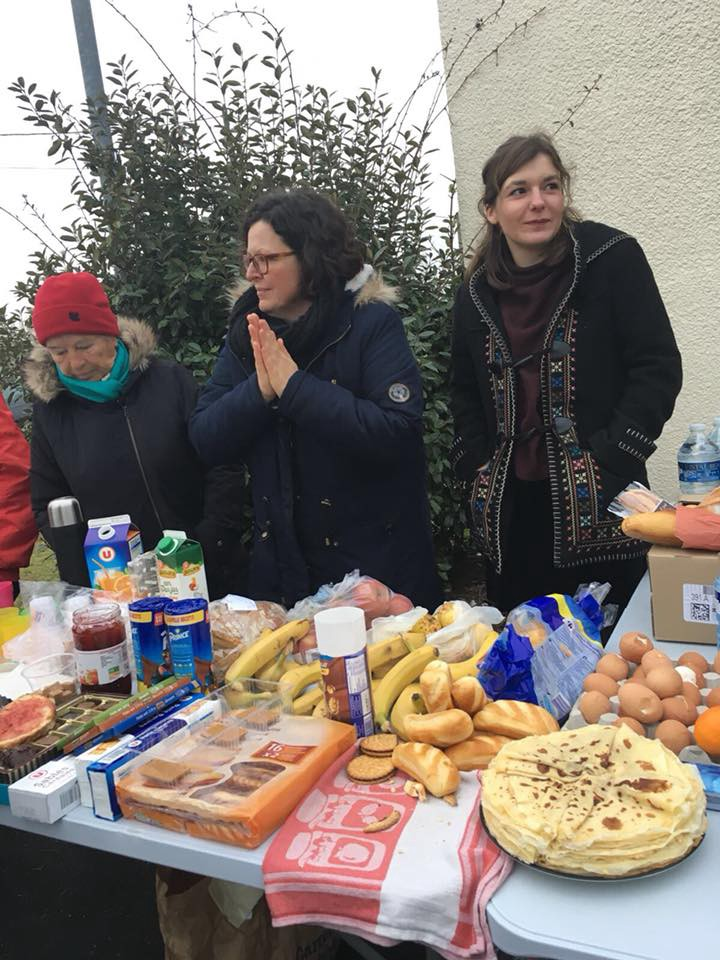

### AYS Daily Digest 22/12 “Children held as inmates in Archidona Prison, Spain”

_Spain condemned for Archidona prison/ Heavy airstrikes continue in Ghouta, Syria / Over 9,000 civilians deaths in fight to free Mosul/ 162 women and children evacuated from Libya to Italy/ Tensions remain high on Aegean Islands/ Greece receives 7 million Euros to improve reception facilities/Bulgaria assigned presidency of European Council/ and news from Bosnia, Serbia, Germany, The Netherlands and France\._

Refugees are not criminals and should not be criminalised for seeking Asylum\. A photo from Section B Prison facility, Moria, Lesvos\. Source: Loys Ha
### **Feature: Spain condemned by UN for Archidona Prison facility**

[Spain has been condemned by the United Nations](https://www.euroweeklynews.com/3.0.15/news/on-euro-weekly-news/spain-news-in-english/146866-exclusive-archidona-prison-un-condemns-spain%E2%80%99s-%E2%80%98lack-of-national-strategy%E2%80%99) for its treatment of refugees in Archidona Prison, where hundreds of migrants have been held since mid\-November in the ‘unopened’ facility\. They have been moved to the prison after entering Spain via the coasts of Almeria and Murcia due to alleged claims by the Government that refugee internment centres are full\. Minors have been found within the prison facility\.

Many people and groups have openly condemned the facility, [including the Spanish Church](http://www.patheos.com/blogs/europeancommunion/2017/11/outrage-spanish-church-imprisonment-malaga-nearly-500-refugees/#fCG7kc3pzAZ4HlhR.99) which released this statement:

> **Identifying immigrants and refugees with criminals is enormously unjust** 

Just last week the government was accused of deploying riot police, rubber bullets and tear gas on detainees who were protesting for more food and against deportations\.

Five children were found among the detainees and have since been moved into Spanish care [according to reports](https://www.euroweeklynews.com/3.0.15/news/on-euro-weekly-news/spain-news-in-english/146835-more-children-found-among-archidona-migrant-prison-group) that have been released\.

Three [minors, however, remain in Archidona prison and are scheduled for deportation back to Algeria](http://www.eldiario.es/andalucia/ONU-Espana-expulse-encerrados-Archidona_0_721278225.html) \. This is happening as a result of a court verdict based on bone tests conducted on the boys, which suggested they were over 18 years of age\. The boys, however, have birth certificates with them that prove their age, but these documents have been ignored despite the fact that it is well known that bone tests are not accurate and have a margin of error of between 14–18 months\. The NGO Malaga Acoje urges that the the children be taken to a minors’ institution\.

Yesterday saw one of the [largest demonstrations](https://www.euroweeklynews.com/3.0.15/news/on-euro-weekly-news/spain-news-in-english/146813-in-depth-%E2%80%98humiliation%E2%80%99-%E2%80%98riots%E2%80%99-%E2%80%98minor-incidents%E2%80%99-insiders-dispute-what-is-really-happening-at-archidona-prison) against the migrants’ internment at the ‘unopened’ prison and their deportation back to Algeria so far\.

Source: Acaip Cordoba

[The UN also condemns Spain](http://www.eldiario.es/andalucia/ONU-Espana-expulse-encerrados-Archidona_0_721278225.html) for not having a working strategy in place to address the needs of asylum seekers\.

> Maria Jesus Vega, a spokesperson for the United Nations Human Rights Council \(UNHRC\) in Spain, said: “The situation in the Archidona prison is just a symptom of a worrying situation in Spain in relation to the management of mixed migration flows \(refugees and economic migrants\), due to the lack of a national strategy to properly address this challenge\. We cannot continue patching things up\.“ 

What UNHCR proposes is for Spain to establish two disembarkation hubs in Cádiz and Málaga which should be fully equipped to function as registration, identification and assistance points where the protection needs of arrivals can be efficiently assessed and persons referred to adequate channels\.
### Syria:

The world is silently looking on as the Russian and Syrian governments tighten the noose around the suffering population of Eastern Ghouta with unlawful strikes, widely\-banned weapons, and a devastating siege which has put countless innocent civilians in great peril\.

■■■■■■■■■■■■■■ 
> **[Gerry Simpson](https://twitter.com/GerrySimpsonHRW) @ Twitter Says:** 

> > Besieged by Syrian forces, indiscriminately bombed by Syria and Russia and running out of food, Syrians in the Damascus suburb of Eastern Ghouta face starvation and say they are just "waiting to die" @HRW [bit.ly/2DrnerR](http://bit.ly/2DrnerR) https://t.co/VNtFB2lGzm 

> **Tweeted at [2017-12-22 09:41:44](https://twitter.com/gerrysimpsonhrw/status/944140889936494592).** 

■■■■■■■■■■■■■■ 

The Syrian and Russian government forces [have intensified their airstrikes on Eastern Ghouta](http://www.infomigrants.net/en/post/6680/unhcr-seeks-eu-asylum-reform-as-bulgaria-takes-eu-council-presidency) , which is located only 15 km from the centre of Syria’s capital Damascus\.

> Syrian forces have tightened their siege of the enclave, held by anti\-government armed groups, severely restricting humanitarian aid in violation of the laws of war and preventing civilians from leaving the area\. 

### **Iraq:**

[A report](https://apnews.com/bbea7094fb954838a2fdc11278d65460/9,000-plus-died-in-battle-with-Islamic-State-group-for-Mosul?utm_campaign=SocialFlow&utm_source=Twitter&utm_medium=AP) suggests that between 9,000 and 11,000 civilians lost their lives during the fight to free Mosul from Islamic State militants\. This number is 10 times higher than what has previously been reported\.

By early March, Iraqi officials and the U\.S\. \-led coalition could see that civilian deaths were spiking, but held their course\. The result, in Mosul and later in the group’s Syrian stronghold of Raqqa, was a city left in ruins by the battle to save it\.

> Most of the civilians killed in west Mosul died under the weight of collapsed buildings, hit by airstrikes, mortars, artillery shells or IS\-laid explosives\. The morgue provided lists of names of civilians and place of death\. Names often included entire families\. 

By early March, Iraqi officials and the U\.S\. \-led coalition could see that civilian deaths were spiking, but held their course\. Despite the number of civilian deaths that occurred because of government airstrikes, the coalition has defended its operational choices, saying it was the Islamic State group that put civilians in danger as it clung on to power\.
### Libya:

[UNHCR](http://www.unhcr.org/news/press/2017/12/5a3d3baf4/unhcr-first-evacuation-162-vulnerable-refugees-libya-italy.html) reports that 162 exceptionally vulnerable African women and child refugees have been evacuated from Libyan detention by the UN and sent to Italy for the first time via an airplane on Friday\. Detention centres in Libya have frequently been condemned by human rights groups as inhumane\.

■■■■■■■■■■■■■■ 
> **[UNHCR Italia](https://twitter.com/UNHCRItalia) @ Twitter Says:** 

> > Awtsane, 21 days old, was born. In a detention center in Libya. Tonight he reached safety with his mother after having been evacuated  from Libya to Italy @refugees @refugeesmedia https://t.co/yCSLZ0RsWz 

> **Tweeted at [2017-12-22 19:07:44](https://twitter.com/unhcritalia/status/944283328328368128).** 

■■■■■■■■■■■■■■ 

■■■■■■■■■■■■■■ 
> **[Italy in Libya](https://twitter.com/ItalyinLibya) @ Twitter Says:** 

> > 161 among the most vulnerable migrants being transferred from #Libya to #Italy through a humanitarian corridor in cooperation with @[UNHCRLibya](https://twitter.com/UNHCRLibya) & @[GovernmentLY](https://twitter.com/GovernmentLY).
Advancing Italy‘s strategy agnst illegal #migration & human smuggling by creating legal frameworks for migrants in need https://t.co/FBUSiIpG1o 

> **Tweeted at [2017-12-22 14:57:42](https://twitter.com/italyinlibya/status/944220409255419906).** 

■■■■■■■■■■■■■■ 

### **Sea:**

According to IOM, in 2017 a total of 170,249 refugees arrived in Europe by sea, while 3,116 people that took the journey across the sea are dead or missing\.

■■■■■■■■■■■■■■ 
> **[IOM - UN Migration 🇺🇳](https://twitter.com/UNmigration) @ Twitter Says:** 

> > Breaking: 170,249 #migrants & #refugees arrived by sea to Europe. 

3,116 dead/missing ➡️ [missingmigrants.iom.int](http://missingmigrants.iom.int) https://t.co/ZXV31Tq5JF 

> **Tweeted at [2017-12-22 10:28:52](https://twitter.com/unmigration/status/944152754280452096).** 

■■■■■■■■■■■■■■ 

### The EU:

The UK and European countries are under increasing scrutiny for sending hundreds of desperate asylum seekers back to Afghanistan, one of the world’s most dangerous countries\.

[IOM has released figures which suggest](https://www.theguardian.com/world/migration) that in 2017, 500 Afghan asylum seekers were forcibly sent back to Afghanistan, compared to with 200 in 2016\. What should come as more shame on the EU, over 3,000 Afghan asylum seekers returned voluntarily due to the harsh and lif\-threatening reception they have faced in Europe\.

> As of September 2017, Afghans accounted for the largest number of asylum applications in the EU, with 170,045 pending cases\. But they lose more than 50% of asylum appeals — far more than Syrians do — because some parts of the country, such as the capital, Kabul, are now considered safe\. 

> Human rights activists say people sent home could be killed, and Amnesty has [accused Germany and other European countries](https://www.amnesty.org/en/latest/news/2017/10/european-governments-return-nearly-10000-afghans-to-risk-of-death-and-torture/) of breaking international law by deporting people at a time when civilian casualties in the country are at their highest for years\. 

In [Germany](https://www.theguardian.com/world/germany) , forced repatriations have resulted in an increasing number of airport protests and demonstrations\. Even some pilots have joined the movement and are now refusing to fly repatriation planes\.

> “What the government is doing is awful,” said Ramin Mohabat, an Afghan refugee who protested against the departure of 78 asylum seekers at the beginning of December\. “They are playing with people’s lives and everyone who is sent back is in danger\. I have been all over Afghanistan and I know all the cities, and conflict is happening everywhere\. The biggest problem is the Taliban but there is also the Islamic State now and in every city there are different armed groups that just do what they want to do\.”

### Greece:

People continue to arrive on the Greek Aegean Islands from Turkey\. Today on Lesvos two boats arrived on the South Coast carrying a total of 61 persons\. On Samos one boat arrived carrying 40 persons\.

[UNHCR is urging](http://www.unhcr.org/news/briefing/2017/12/5a3ccd394/situation-greek-islands-still-grim-despite-speeded-transfers.html) the Greek Government to continue easing the pressure on the Aegean Islands, Lesvos, Samos and Chios\. They suggest that the government should further shorten the procedures which allow people to move to the mainland and continue to improve the conditions on the islands for those who will stay there\.

■■■■■■■■■■■■■■ 
> **[UNHCR News](https://twitter.com/RefugeesMedia) @ Twitter Says:** 

> > #UNHCR is calling on the Greek Government to continue easing pressure on Lesvos, Chios & Samos, by further shortening procedures for people eligible to move & urgently improving conditions for those who stay [goo.gl/VKvRgo](https://goo.gl/VKvRgo) 

> **Tweeted at [2017-12-22 10:16:49](https://twitter.com/refugeesmedia/status/944149719525273601).** 

■■■■■■■■■■■■■■ 

■■■■■■■■■■■■■■ 
> **[UNHCR News](https://twitter.com/RefugeesMedia) @ Twitter Says:** 

> > Current restrictions keeping people on Greek islands need to be reviewed, to allow for the quick transfer from Reception and Identification Centres of vulnerable asylum seekers & others who could continue the asylum procedure on the mainland [goo.gl/VKvRgo](https://goo.gl/VKvRgo) 

> **Tweeted at [2017-12-22 10:17:36](https://twitter.com/refugeesmedia/status/944149918842851328).** 

■■■■■■■■■■■■■■ 

[Tension on the islands has continued to escalate](http://www.unhcr.org/news/briefing/2017/12/5a3ccd394/situation-greek-islands-still-grim-despite-speeded-transfers.html) since the summer months as the number of people arriving on the Islands from Turkey continues to increase\. Currently most facilities remain between two and three times over capacity\.

The conditions within the facilities remain very poor and improvements have been scarce and inadequate — with many people living in summer tents with no insulation and without access to adequate shelter, electricity or functioning water and sanitation facilities\.

■■■■■■■■■■■■■■ 
> **[Riot Turtle @riotturtle@kolektiva.social](https://twitter.com/RiotTurtle65) @ Twitter Says:** 

> > I don't know how many times I was on the Balkan route but each time I have a head ful of images. Enough to puke a couple of weeks. Today I was inside #Moria #Lesvos. Without words... It will take a few days before I can write about it for @[enough14](https://twitter.com/enough14) #RefugeesGR #NoBorders 

> **Tweeted at [2017-12-22 15:33:07](https://twitter.com/riotturtle65/status/944229321971064833).** 

■■■■■■■■■■■■■■ 

> In some cases, local authorities have opposed efforts to introduce improvements inside the RICs \(Reception and Identification Centres\) \. On some islands, local reluctance has also hampered efforts to secure small numbers of temporary and exceptional accommodation in apartments and hotels for the most vulnerable, according to the UNHCR\. 

The outcry by volunteers, locals, refugees and human rights bodies continues as winter arrives in Greece\. They urge to \#OpenTheIslands\.

■■■■■■■■■■■■■■ 
> **[Eva Cossé](https://twitter.com/Eva_Cosse) @ Twitter Says:** 

> > #WinterIsHere & 1000s of ppl trapped on Greece's islands are crammed in tiny camping tents & sleep under the pouring rain and in the cold. Nowhere to go, nowhere to dry clothes and shoes. Call on Greece & #EU leaders to #OpenTheIslands [hrw.org/opentheislands](http://www.hrw.org/opentheislands) https://t.co/EFuUR6LBAw 

> **Tweeted at [2017-12-22 11:51:12](https://twitter.com/eva_cosse/status/944173473680756736).** 

■■■■■■■■■■■■■■ 

■■■■■■■■■■■■■■ 
> **[MSF Sea](https://twitter.com/MSF_Sea) @ Twitter Says:** 

> > Every day our doctors in #Lesvos treat children with fever or respiratory tract infections and they have to send them back to their summer tents in #Moria. This situation is unbearable, #opentheislands! https://t.co/JgZ9xYSSRj 

> **Tweeted at [2017-12-21 09:22:32](https://twitter.com/msf_sea/status/943773670710923265).** 

■■■■■■■■■■■■■■ 

The European Commission has stated that it has provided € 7 million in new financial assistance to Greece in order for the country to improve reception centres and respond to the desperate needs of housing, catering, sanitation and cleaning services\.

The Commissioner for Immigration, Home Affairs and Citizenship, Dimitris Avramopoulos says:

> “We continue to show solidarity in Greece with regard to the management of immigration on the islands and in the hinterland\. 

■■■■■■■■■■■■■■ 
> **[Dimitris Avramopoulos](https://twitter.com/Avramopoulos) @ Twitter Says:** 

> > Today we awarded an additional €7 million in emergency #migrationEU assistance to #Greece to provide an immediate response to urgent needs for shelter, catering, hygiene and cleaning services. We continue to show solidarity both on islands and mainland  [ec.europa.eu/home-affairs/n…](https://ec.europa.eu/home-affairs/news/commission-awards-additional-%E2%82%AC7-million-emergency-assistance-migrants-greece_en) 

> **Tweeted at [2017-12-22 18:04:18](https://twitter.com/avramopoulos/status/944267366799695872).** 

■■■■■■■■■■■■■■ 

Often the most easy\-to\-manage and normal things pose a very great risk when living in a refugee camp\. One such thing that is often not given due thought is the implication of having a monthly period, when women do not have access to safe and secure sanitation facilities\.

> “I am more scared when I bleed, it is very, very hard\.” The 15\-year\-old Syrian girl standing in front of her family’s tent in the warm Greek sun, hands in her pockets, doesn’t smile, but looks down at the mud covering her battered, thin blue sandals\. “Just take a look, look at the conditions around you,” she said\. “Yes, I am scared\. I cannot go inside because there are too many people, too many guys, too many drugs, drunk people\.”

For the many women who have to endure living in refugee camps across Europe, they must deal with a very impractical and degrading situation each month\. Many women do not have access to sanitary pads, tampons or wipes\. Many also do not even have access to safe sanitation facilities\.

Dinit are launching a campaign to raise funds in order to buy menstrual hygiene products for Lesvos\. If you wish to help their efforts please follow [this link](https://l.facebook.com/l.php?u=http%3A%2F%2Fwww.dinit.ie%2F&h=ATPOV0uSoSc5dI94-P84H8Tcr7SC2hQC7DHCI2sx4_LVGNH2qEpf7zuyQL_Ws49jA3RWypaR2UPn_s3gKynO3a0d_hzU8-9YUlSngGM5NEWBrIUVQQ370_WzjxuJ0wSX4_k1JxlIvmZdRH8XlNilX0QyIu91yy_-z4RHecZoFSD1M2vG226qbJFX1Ct1wbzgfJHxi2oVKxLK1DDCu7cmS5URzSYrKI85ythgU9Hhvr4wllSepJebEpvuXm11AstwkBGgMEcjUw1Y-OPA6syEGI_hbSJc) to find out more\.

The Unmentionables are looking for volunteers to join their team on ground\. They have four open positions, including Education Coordinator, Sexual and Reproductive Health Education Fellow, Photography Coordinator, and Shop Manager\. You can find out more via [_this link\._](https://l.facebook.com/l.php?u=https%3A%2F%2Ftheunmentionablesglobal.org%2Fvolunteer&h=ATPQWBMGSqQZAb68vn-GqFRxyK7AojTC4Z1c1d-KQtjsRpY9U1hierL99QURqG5s3XaCWkk6dbiBYT8oA9yn3XHVkVGGsnXR7cI3NxtG9yUext4-b2tKke7ZW5S5asZ1Xm2HB5pbTiLZqW4d6yKV3gC0FkA2zq0KskUQD-3GWiIy-kDMzazB_vpw2NAneK7iS1X-ohIjtesKnJk55daIMIZc3tizSkab4BdT5FKCG3skNLX330YI2qM)

No Border School are launching a new project in collaboration with [مؤسسة جفرا في اليونان/Jafra foundation in Greece](https://www.facebook.com/JafraFoundationinGreece/?fref=mentions) and need your help to do so\. You can support them by sharing this video below\.

### Bulgaria:

With Bulgaria being assigned the presidency of the Council of the European Union for the next 6 months, [UNHCR has published a series of recommendations](http://www.infomigrants.net/en/post/6680/unhcr-seeks-eu-asylum-reform-as-bulgaria-takes-eu-council-presidency) for the country\. The set of recommendations highlights the need for the EU to better assess the protection needs of asylum seekers and for EU member states to foster greater mutual solidarity and sharing of responsibility\.

> The set of recommendations presented by the UN agency underscored that “with an estimated 1\.2 million persons in need of resettlement globally in 2018,” EU member states needed “to continue expanding and strengthening safe and legal pathways for persons in need of international protection that are responsive to global protection needs\.”

> The UNHCR underscored “the need for contingency planning to more effectively respond to changes in arrivals and for systems to better protect refugee children” and “the need to invest more in the integration of refugees in Europe\.”

### Serbia:

According to [a report by Reuters](http://news.trust.org/item/20171220115211-m8zdo/) , Croatian and Serbian police have detained 17 people suspected of smuggling dozens of migrants into the European Union\.

With the Balkan route being closed to refugees, many have been left with no other option but to use smugglers to reach the EU\.

> In a statement, the Interior Ministry said the group detained in Belgrade and four northern towns comprised 12 Serbians and one Afghan man\. The police in neighbouring Croatia have detained four more suspects, it said\. 

> “It is suspected that this criminal group facilitated the illegal crossing of the border and transit … to a total of 82 migrants from Afghanistan, Iran and Iraq, from whom they took 1,500 euros \($1,800\) per person\.”

### **Bosnia:**

The imam of the Sarajevo mosque of Muhamed Velic opened the doors of mosques in this city for refugees\. [As he wrote on his Facebook page:](https://www.facebook.com/muhamed.velic.549/posts/10215193635260060) over the last few nights several people from Syria were found in Sarajevo homeless, and people called the imam to ask for help\. He invited them to stay in the mosque and encouraged people in Sarajevo to help\. Apparently, currently all existing capacities for asylum seekers in Bosnia are overcrowded\.

The number of people who are in Bosnia is not clear\. Recently local authorities published information stating that the number of asylum seekers has drastically increased since May, by over 230 percent in comparison to last year\. Most of these people are coming from Montenegro and Serbia and are on their way toward the EU\.

Imam Velic, on his post and publicly on the regional TV station, invited all the citizens of Bosnia to help refugees, saying that we should all open our hearts and then doors will be opened\.
### **Germany:**

[A report states](http://m.dw.com/en/migrant-shelters-attacks-in-germany-see-a-significant-decrease/a-41899093) that the number of attacks on refugee shelters in Germany has decreased substantially in 2017 \(264 attacks\), compared with 2015 \(1031 attacks\) and 2016 \(995 attacks\) \. Despite this, politically motivated attacks on refugee shelters remain higher than before 2015 when Germany opened its borders to thousands of refugees\.

> According to the BKA report, 251 of the attacks were carried out by right\-wing extremists, while in the other 13 instances police said they had not ruled out a political motive\. Most of the recorded cases were mainly propaganda offenses and damage to property\. However, 16 attacks involved arson and two involved explosives\. 

### **Netherlands:**

A petition has been made for the immediate release of S\.H\.A, an 18\-year\-old Afghan refugee, from a Dutch prison\. S\.H\.A’s appeal was rejected earlier this month and he now risks deportation to Afghanistan\.

> In 2015, S\.H\.A\., then just 16 years old, fled the war in Afghanistan with all the inhabitants of his village\. During the journey, he was separated from his family\. He arrived in the Netherlands alone and applied for asylum\. Two months later, he was denied asylum\. He appealed the decision\. As soon as he turned 18, he was notified that the appeal had been rejected and that he would be deported to Afghanistan\. He had no news from his family, members of the Hazara ethnic minority, which has been persecuted throughout history in Afghanistan\. 

### **France:**

A 15\-year\-old [Afghan boy has been hit it by a car](http://www.nordlittoral.fr/62956/article/2017-12-22/le-migrant-mortellement-fauche-sur-la-rocade-etait-age-d-une-quinzaine-d-annees) on the road to Calais; found by a passing motorist\. A hit and run; an alert was put out to find the person and car responsible, neither the person nor the car were not found\.

Christmas in Paris sounds like a romantic idea for many, but not for the hundreds of refugees currently sleeping rough on the streets in this festive period\. Many refugees have stationed themselves by the Paris Canal, and their tents are damp and cold\.

> “Teachers in school taught us about France and what a wonderful place it was,” said Khater, who said he was 15 years old, as he stood by the dozens of tents strung along the banks of the Canal Saint\-Martin that now serve as home for hundreds of migrants\.“I didn’t think it would be like this\.”

[Cair4Calais](https://www.facebook.com/care4calais/?hc_ref=ARQtGeRsotBG-9XDJUTMoAfLuH-wNr1FLaNGUXS-79m_AFzCnjPBLRnDkZZocM-aegk) reports from Ouistreham near Caen, a French coastal town where yet another group of young refugees, from Sudan this time, have made a temporary home\. French locals in the town have been praised for their efforts to provide assistance\.

> French locals gather to distribute hot food and even some clothes they have collected and a small girl walks around smiling happily and handing out sweets\. 

Source: Care4Calais

> **_We strive to echo correct news from the ground through collaboration and fairness\._** 

> **_Every effort has been made to credit organizations and individuals with regard to the supply of information, video, and photo material \(in cases where the source wanted to be accredited\) \. Please notify us regarding corrections\._** 

> **_If there’s anything you want to share or comment, contact us through Facebook or write to: areyousyrious@gmail\.com_** 

_Converted [Medium Post](https://areyousyrious.medium.com/ays-daily-digest-22-12-children-held-as-inmates-in-archidona-prison-spain-74466b47c7a0) by [ZMediumToMarkdown](https://github.com/ZhgChgLi/ZMediumToMarkdown)._
