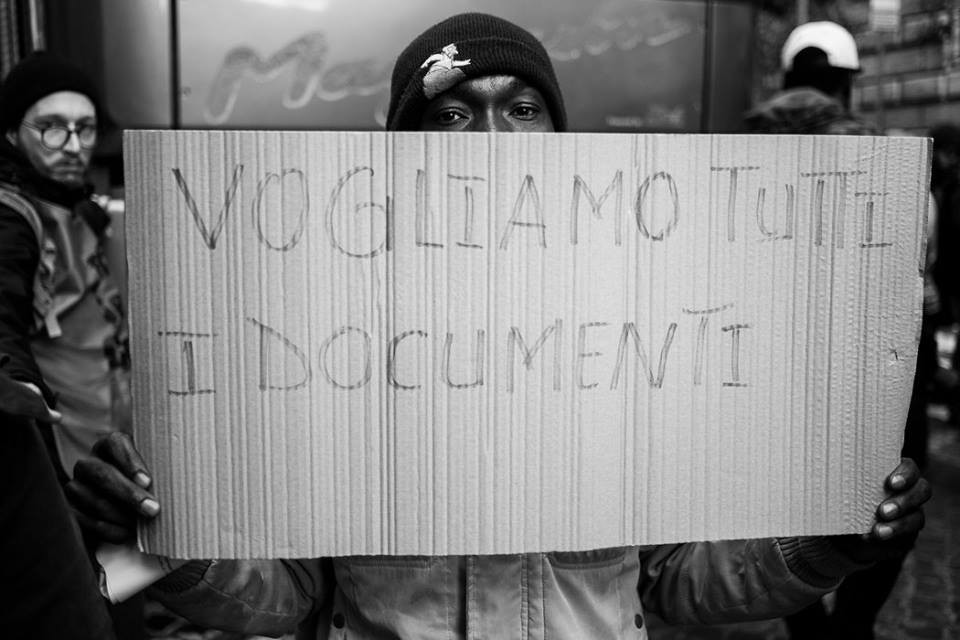
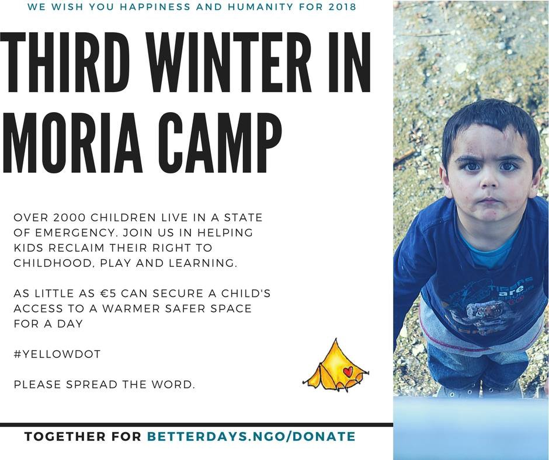
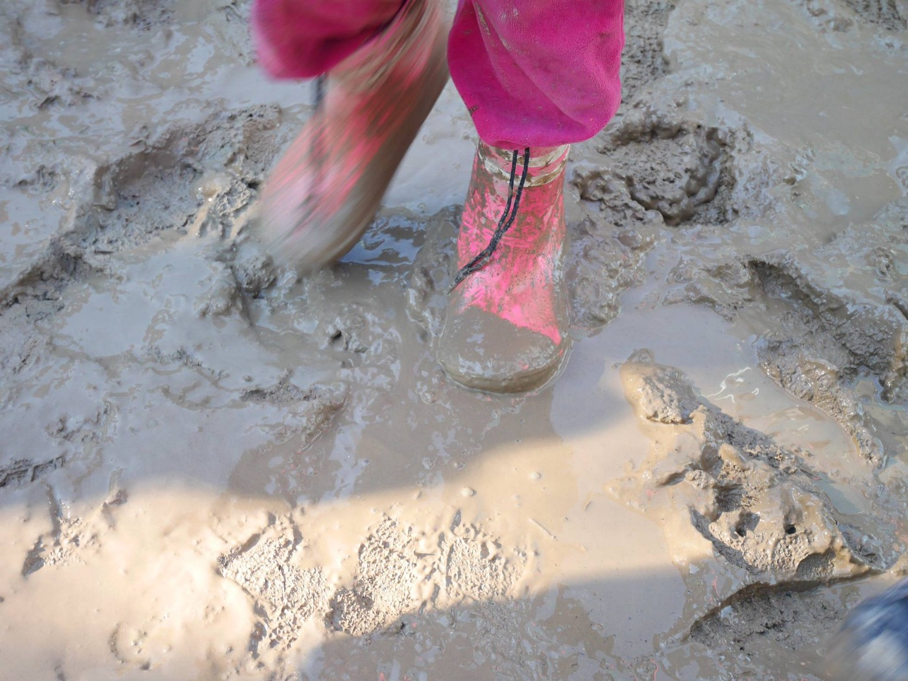
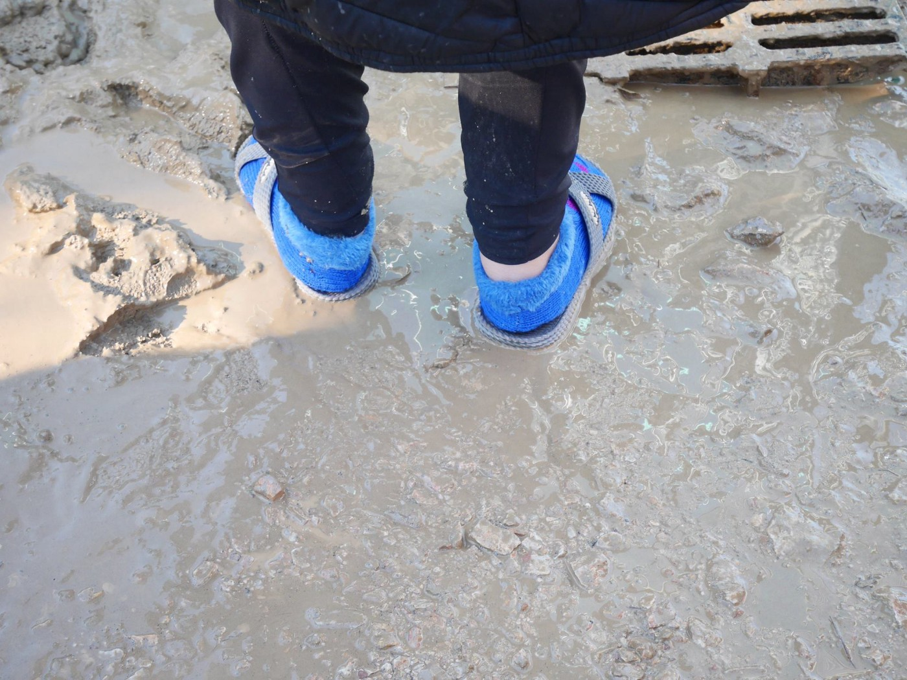
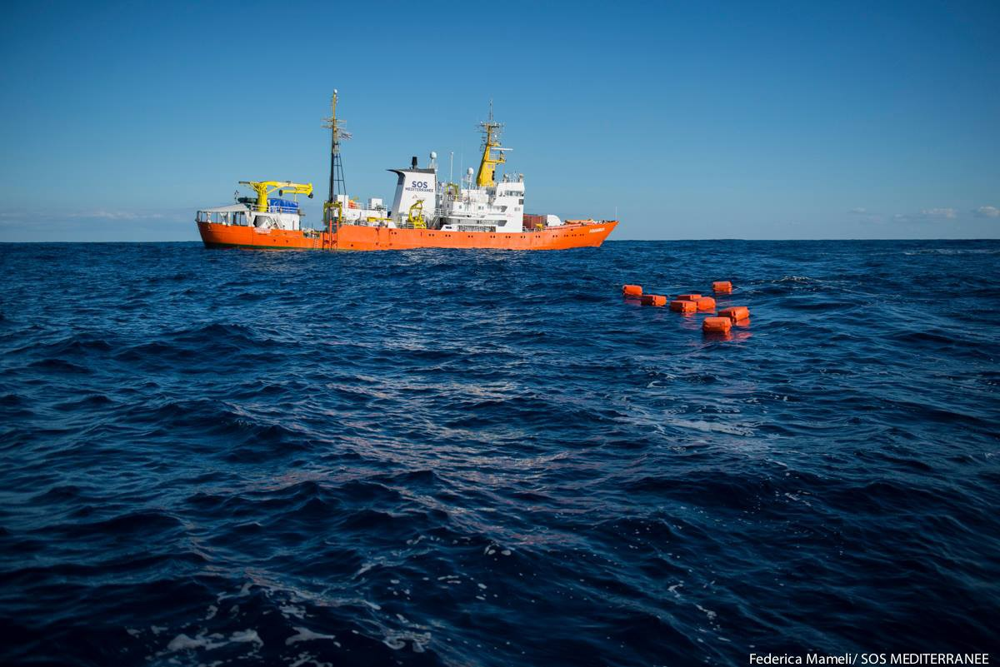
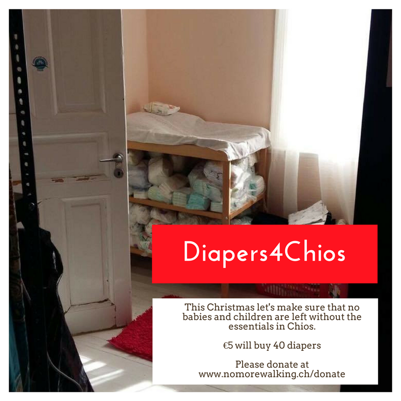
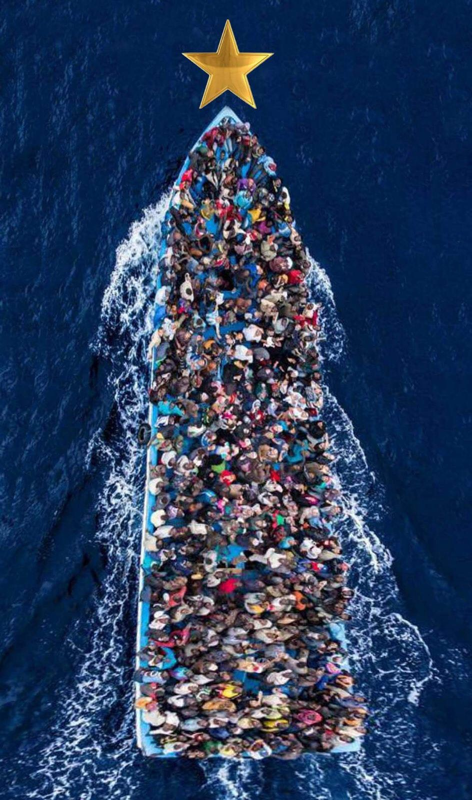

### AYS DAILY DIGEST 24/12/2017: Où est la dignité/Where is dignity?

_Images of Europe on the Christmas Eve are not something to be proud of // More people rescued in the Sea // Migrant died on the train from Italy to Austria // More restrictive measures from Austria // And more from France, Belgium, Italy, Greece…_

“We want documents\!” Foto di Daniele Napolitano/ collettivo Messafuoco Immagini in Lotta
### Feature

It is holiday time, but tens of thousands of people in Europe are homeless or living in hard to bear conditions\. People are trapped in Greek islands, thousands, many are homeless on mainland;

](assets/db1127e3add9/1*P5bBwVF8I0i21zzwt_pedA.jpeg)

Vial, morning\. Photo by [**Georgouli Vicky**](https://www.facebook.com/georgouli.vicky?hc_ref=ARTqztoa98MoMC6WGnSOOIYirQkBjTgVGEzgUxqxVe4_40fh-Dn121QLryzQMHBWkmM)

In Serbia, people live in shameful conditions in building/camps that should not be used at all, while hundreds are sleeping rough near the borders dreaming of EU; in Italy, France, Belgium children are on the streets; in Sweden, Germany, and many other countries, people who escaped war and poverty are living in a fear to be deported…

And it does not take so much to change all this\. Solidarity is the first step\.

Geneviève Jacques, President of La Cimade, a French NGO that gives assistance and support to people uprooted by war, in a video message addressed to President Emmanuel Macron, said that, contrary to his statement on 27 July in Orléans, migrant people are still sleeping in the streets\.

### Libya

Many promises European leaders give in 2016 to 2017 were just empty words\. New promises are coming this year, too\. Can we trust them?

The Italian government said on Sunday that up to 10,000 people stranded in refugee camps and detention centers in Libya could be relocated to Europe in 2018\.

_“In 2018, up to 10,000 refugees will be able to come to Europe without risk, through humanitarian corridors,”_ Italian Interior Minister Marco Minniti said in an interview with the newspaper La Repubblica\.

According to estimates, about 400,000 migrants are in Libya, including roughly 36,000 children\. Number Italian government is mentioning in comparison to this estimations does not mean anything\.
### Sea

Even last night, while many people were celebrating, those who are running from wars and poverty, were trying to come to Europe\.

Photo by Federica Mameli/Sos Mediterranee

Those who are helping them in the sea are warning that crossing the sea in winter is especially dangerous\.

Last night, Salvamar Spica located and rescued 28 people, after during a day they saved 95 persons of 6 boats\.

■■■■■■■■■■■■■■ 
> **[SALVAMENTO MARÍTIMO](https://twitter.com/salvamentogob) @ Twitter Says:** 

> > Salvamar Spica localiza y rescata 28 #personas última #patera #Alboran finaliza búsqueda. Llega #Almeria sobre 22:50 horas. Hoy rescatadas 95 personas de 6 pateras incluidas las 34 de la foto, rescatadas por la guardamar Polimnia. https://t.co/52jHaJmVDU 

> **Tweeted at [2017-12-23 19:21:30](https://twitter.com/salvamentogob/status/944649181112819713).** 

■■■■■■■■■■■■■■ 

### Greece

Help is needed in Chios\. There are so many children and not enough diapers\.

No more walking delivered over 20,000 diapers and 1,800 boxes of baby wipes in the last couple of months, and they want to continue this mission\.

_“They are now raising funds for the next shipment which is the rate that diapers are needed will need to be really soon\! We get the diapers at an unbeatable price from a small family business in Greece\.”_

You can either donate under [www\.nomorewalking\.ch/donate](http://www.nomorewalking.ch/donate) or if you prefer to pay the vendor directly, let them know and they will put you in touch with them, so you can be part of the next shipment\.
### Italy

[Authorities in Brennero](http://www.altoadige.it/cronaca/bolzano/tragedia-al-brennero-profugo-muore-folgorato-sul-treno-merci-1.1479811) find another body of a migrant near the border with Austria\. It is supposed that person, man, got electrified while trying to stay on a train traveling toward North of Europe\.

His identity is still unknown, but it is estimated that he is about 30 years old\.

Over the last couple of day, there were many very young people in an area in between Italy and Austria\.
### Austria

While people are dying at his border, the new Chancellor, Sebastian Kurz [decided to align](https://uk.reuters.com/article/uk-europe-migrants-kurz/help-refugees-wherever-they-come-from-austrias-kurz-says-idUKKBN1EH0Q1) with central European neighbors like Hungary and the Czech Republic, in opposing German\-backed proposals to distribute asylum seekers around EU member states\.

_“Forcing states to take refugees don’t take Europe any further\. The discussion makes no sense,”_ he told Germany’s Bild is Sonntag newspaper\.

He called for the EU to support, _“perhaps militarily,”_ efforts to help people in their countries of origin or in neighboring states\.

_“If that isn’t possible, then they should be helped in safe areas on their own continent,”_ he said\. _“The EU should support that, perhaps even organize it, and back it militarily\.”_
### Germany

Even though seen by many as the most open country in Europe for refugees and migrant, it is not that good in Germany after all\. Unfortunately\.

[Local media](https://www.welt.de/politik/deutschland/article171876012/Jugendheime-in-Marokko-Deutschland-plant-Rueckfuehrung-minderjaehriger-Migranten.html) are reporting that the government started construction of two youth centers in northern Morocco to house local “street children” as well as unaccompanied Moroccan minors who have been deported by Germany\.

This project is a legal pathway for Germany to start deporting young people, which they have not done so far\.

According to a statement from the Interior Ministry, the shelters “will be open to those under 18 returning voluntarily, as well as forced deportees, especially youths convicted of crimes\.”

The same newspaper spoke with migrant youth center counselors in Germany who told them that so far they have not seen any attempts by the authorities to locate the youths’ families although many of them regularly talk of the phone with their mothers\.

The condition for deportation in Germany for minors is very strict\. Before deportation, the authorities must ensure that a family member or responsible guardian in their home country will take in the child, or that a”suitable” reception facility is available in their country of origin\.

[The same newspaper reports](https://www.welt.de/politik/deutschland/article171874700/Bamf-verfehlt-selbstgesteckte-Ziele-bei-Integration.html) that Germany has fallen behind its own integration goals for migrants and refugees this year\.

According to their report, the waiting time for people to start integration courses rose to 12\.5 weeks by the end of November, well short of the six\-week goal the Federal Office for Migration and Refugees \(BAMF\) had set for itself earlier this year\.

In January, the wait time for an integration course was 10\.9 weeks\.

At the same time, instead of planned 430,000 people in integration courses this year, only 280,000 participated, while only some 84,000 participated in career\-related language support courses, compared to a goal of 175,000 participants\.

Integration courses offer migrants and refugees German language training and provide an orientation to German law, history, culture, and values\.
### France

This week, on Thursday night, a young boy from Afghanistan \(15\) have died in Calais after hit by car\. His identity has not been certified yet, [Care4Calais](https://www.facebook.com/care4calais/posts/1766505193382430) reports\.

_“As the death toll increases year by year, the border separating France and England is becoming a graveyard for refugees trying to cross hoping for a better life\. Getting hit by a vehicle, freezing in squalid conditions, falling victims of all types of abuse: this is the fate that awaits and takes the lives of too many refugees stranded in Calais\._

_The Calais prefecture has announced another €5m will be paid by the UK government to light the motorway bypass around the town\. How much would it cost to house these boys in the UK?_

_Still, European governments, with blood on their hands, continue to shut borders and dehumanize migrants at home, and bring war and create poverty abroad\._

_As we look towards the New Year we ask how long will this tragedy last?”_

Volunteers from the [Rastplatz](https://www.facebook.com/rastplatz/posts/560141394333326) are getting ready for Paris, joined by people from several groups\. They will try to help to Paris Refugee Ground Support\. You can help them, too\.

According to the [local media](http://www.laprovence.com/.../au-centre-de-retention...) , there were several suicides or suicide attempts in the Marseille detention center where many migrants are locked inside\. The last two victims were two Albanian who was waiting for deportation\.

Some organizations are claiming that in some cases there were up to seven attempts of suicide \(three in a week\), but also acts of self\-mutilation and violent aggression that ‘s have succeeded since mid\-November\.

“People are here in a state of psychological fragility, vulnerability” that Julian Karagueuzian, coordinator of Refugee Forum, had “never observed” in other centers in France\.

Local NGOs and human rights groups are asking for the investigation into causes for such a situation in this place\.
### Belgium

Deportations to Sudan caused many people in Belgium to ask their government to act responsibly\.

Last week, the Chamber of Representatives had an emergency meeting to hear testimony from the secretary of state for immigration, who faced the criticism for collaborating with the regime of Sudanese President Omar al\-Bashir\.

Francken invited Sudanese officials to Brussels in September to help authorities identify Sudanese migrants and arrange for their forced repatriation\.

Belgium’s Human Rights League further argued that the Sudanese were subject to arbitrary arrest and maltreatment and said the expulsions were in violation of the European Convention on Human Rights\.

After the emergency meeting, the Prime Minister Charles Michel, suspended deportations of Sudanese refugees\.

Photo Holes in the Borders\.

> **_We strive to echo correct news from the ground through collaboration and fairness\._** 

> **_Every effort has been made to credit organizations and individuals with regard to the supply of information, video, and photo material \(in cases where the source wanted to be accredited\) \. Please notify us regarding corrections\._** 

> **_If there’s anything you want to share or comment, contact us through Facebook or write to: areyousyrious@gmail\.com_** 

_Converted [Medium Post](https://areyousyrious.medium.com/ays-daily-digest-24-12-2017-o%C3%B9-est-la-dignit%C3%A9-where-is-dignity-db1127e3add9) by [ZMediumToMarkdown](https://github.com/ZhgChgLi/ZMediumToMarkdown)._
