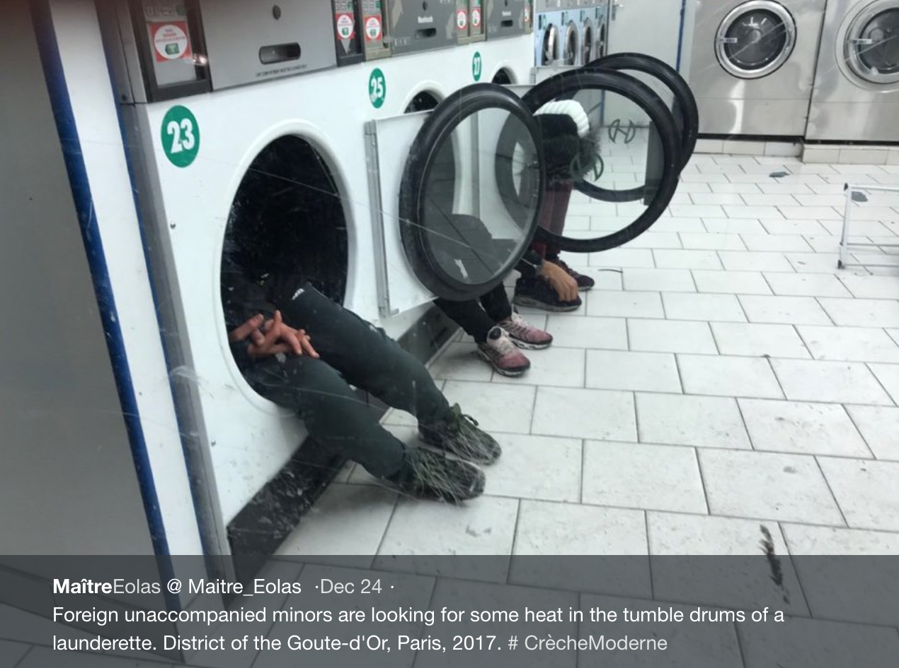
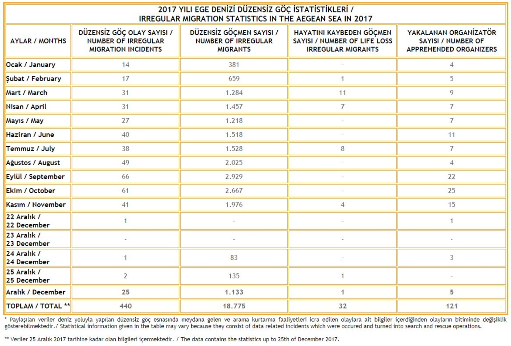
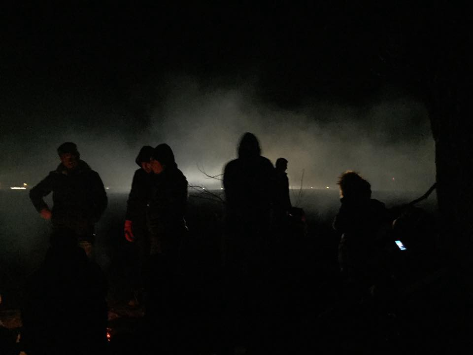
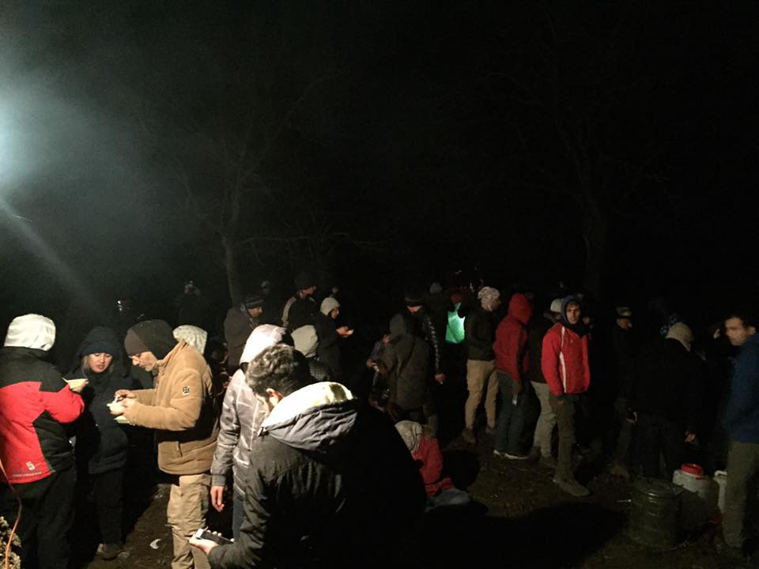
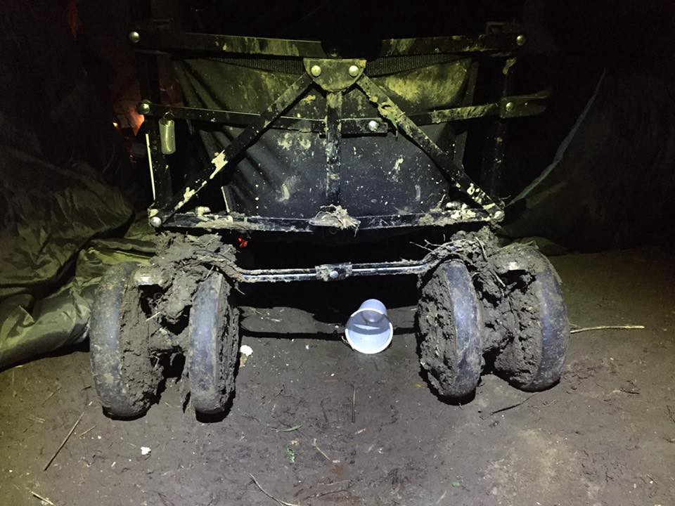
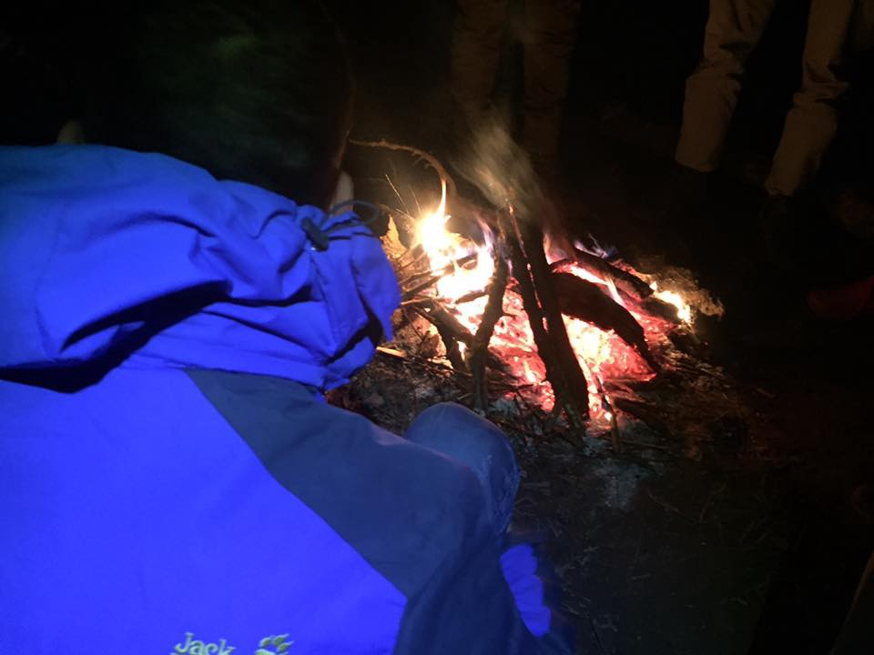
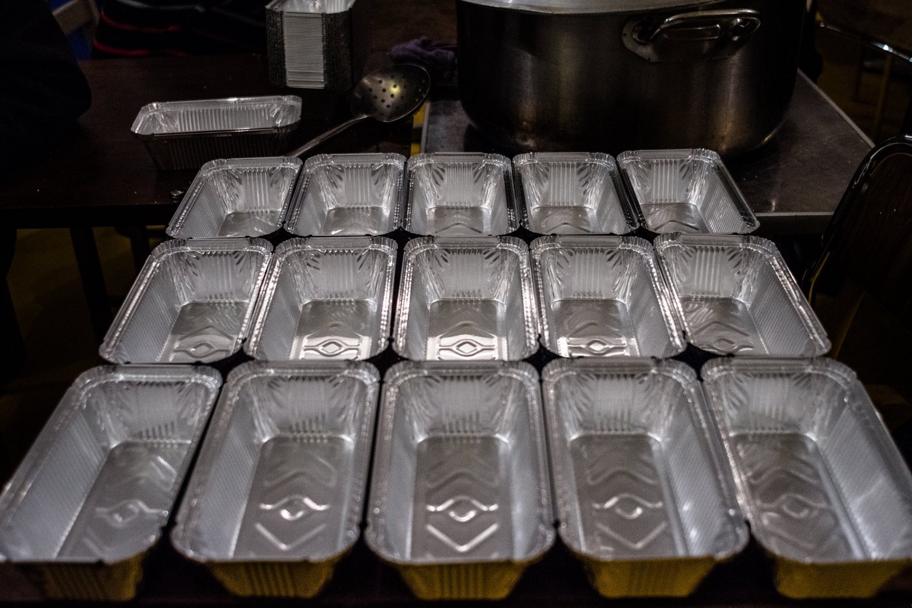
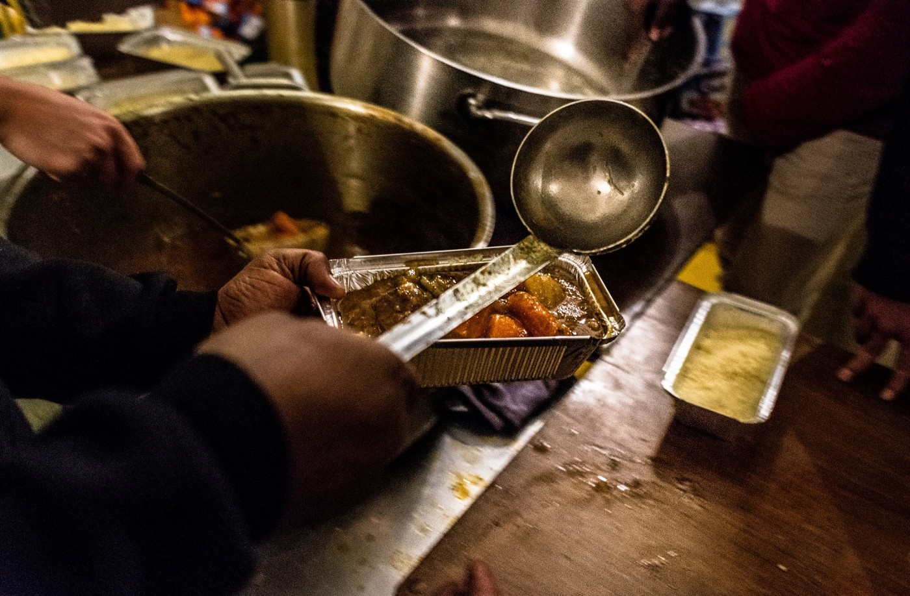

### AYS DAILY DIGEST 25/12/2017: “Dear Santa, all we wanted was to be safe”

_Do leaders of the EU hear messages of religious leaders? // Do they hear voices of refugees and migrants all over Europe? // Do they see kids dying in the sea? // Do they see people being trapped in camps and sleeping in the streets because of the closed borders? //_

Dear Europe, Merry Christmas\. Source: Alex Falcó Chang, Art Against
### Feature: A message from the Pope on Christmas… but will it change anything for refugees?

> “I wish to see my parents again,” one boy scrawled on a scrap of purple paper, before pinning it with a clothes peg to the \[Christmas\] tree in [the day centre in Rome](http://www.savethechildren.org.uk/about-us/emergencies/child-refugee-crisis-appeal) \. With its warm meals and welcoming smiles, this facility, which opens during the day to allow child refugees to wash, make friends, and play table football, was the best imitation of home they could find\. 

> Another wrote a longer message that could have stood for them all\. “I hope that I will be accepted in this new society,” he scribbled, “and that I will see my family again\.” 

From [A Christmas Carol for Refugees](http://s.telegraph.co.uk/graphics/projects/Christmas-Carol-refugees/index.html) : Outlining how two young refugees spent Christmas this year in Rome\.

As millions of Roman Catholics celebrate Christmas today worldwide, Their spiritual leader [Pope Francis urges](http://www.bbc.com/news/world-europe-42475252) that people do not to ignore the plight of refugees; many of whom have spent what is a day of celebration for millions of people in Europe; scared, unsafe and unwelcome\.

](assets/f4ca0acae383/1*AcGLf056YKXXebJB2cV-_g.png)

Merry Christmas from a refugee camp, near Thessaloniki \(Greece\) Source: [**La luna di Vasilika** ‏](https://twitter.com/LunaDiVasilika)

The Pope, has made the defence of refugees and migrants a major theme of his leadership\.

He explained that true Faith demands that migrants are respected and foreigners are welcomed everywhere\.

At the Christmas Eve mass he recounted the biblical story of Joseph and Mary, who were forced to flee their homes, and likened it to the plight of the 22 million \+ refugees currently worldwide\.

> “So many other footsteps are hidden in the footsteps of Joseph and Mary,” he told worshippers who gathered in St Peter’s Basilica on 24 December\. 

> “We see the tracks of millions of persons who do not choose to go away but, driven from their land, leave behind their dear ones\.” 

Many religious leaders have used their platforms to speak out about the world’s treatment of refugees in the past\. Over 2000 religious leaders from various backgrounds [signed a letter](https://maryknollogc.org/article/religious-leaders-letter-supporting-refugee-resettlement) in solidarity with refugees, addressed to Donald Trump on January 25th this year\.

We wonder whether the Pope’s message will be heard by the leaders of EU Member States, who are undeniably responsible for the suffering inflicted upon thousands of Refugees in Europe this Christmas\. We are not very hopeful…

…But for the 10,000 unaccompanied children who made their way to Europe on their own in 2017, we will continue to hope that things will change for the better in time for Christmas next year\.

### Turkey:

**Some people spent Christmas risking their lives across the Aegean Sea…**

One death was reported of an infant child who is thought to have suffocated during her journey across the sea to Europe this Christmas\. Another child has been hospitalised in a critical condition\. The boat they were on was overcrowded and in distress before it was rescued\.

[According to a security source](http://aa.com.tr/en/turkey/83-irregular-migrants-held-in-western-turkey/1013998) , the Turkish Coast Guard rescued the boat which was carrying 83 refugees\. They were held in the Western province of Canakkale\.

There were 18 women and 27 children on board the rescued ship, and all refugees were from Syria\.

3 smugglers from a Ukrainian background have been arrested\.

> The migrants reportedly paid $3,000 each to the smugglers who had promised to take them to Italy\. They were referred to the local migration management authorities after being questioned\. 

The Aegean Sea remains one of the main routes of travel for refugees trying to reach Europe\. This year nearly 19,000 people attempted to cross it\. 32 people have lost their lives an 121 persons have been arrested for offences related to people smuggling\.

Migration Statistics in the Aegean Sea, Source: SAR Watch MED
### **Sea:**

**Some people made it to Spain on Christmas… Only to find out they might be sent back\.**

33 people landed in the Chafarinas islands of Spain today\. They remain in the presence of the army and have not been moved on to a secure location\. Concern remains that the group will be sent back to Morocco\.

■■■■■■■■■■■■■■ 
> **[Sergio Rodrigo](https://twitter.com/SRodrigoruiz) @ Twitter Says:** 

> > #URGENTE 33 personas han sido desembarcadas en las Islas Chafarinas de #España. Están junto al Ejército pero no han sido trasladas a puerto seguro, se teme una devolución a Marruecos https://t.co/pE7Lr96iuv 

> **Tweeted at [2017-12-25 21:43:57](https://twitter.com/srodrigoruiz/status/945409808915750913).** 

■■■■■■■■■■■■■■ 

### Serbia:

**Some families spent Christmas outside in the cold, without shelter, and with crumbling hope…**

Between 100 and 150 refugee, including families with children have reached the border post of Tovarnik today, 5 km from the Serbian town of Sid\. They travelled from many camps around Serbia\. According to volunteers, the group was mislead into thinking the border will open today\.

This movement followed recent release of the video which called for protests at the border, allegedly scheduled for today\. However, when people came to Sid, they quickly realised there was nothing organised there\. An additional 150 people gathered at the Belgrade central station, but most of them decided not to go towards Sid after all\.

No Name Kitchen volunteers tried to care for the group of people as best as they could, providing them with hot food and drinks\.

No one assumed responsibility for the video and/or false info about the open border\.

At AYS we condemn with strongest force the spread of false rumours\. Borders will not open\! \! \!
### Greece:

**A Christmas spent on the Aegean Islands is anything but merry…**

Three boats arrived on the Island of Lesvos today\.

Boat 1 was carrying 63 persons , boat 2 was carrying 48 persons, boat 3 was carrying 61 persons\.

One boat arrived to Chios carrying 54 persons\.

[UNHCR once again urges](http://www.ekathimerini.com/224431/article/ekathimerini/news/unhcr-calls-for-migrant-transfers-greek-authorities-blamed-for-grim-conditions) the Greek Authorities to transfer thousands of refugees from the Aegean Islands, who for months have been forced to live in unsafe and inhumane conditions, to the mainland which is much better equipped to support them\.

UNHCR spokewoman Cecile Pouilly has said:

> “In some cases, local authorities have opposed efforts to introduce improvements inside the reception centres\.” 

The EU’s special envoy on migration, Maarten Verwey, also puts blame on Greek Authorities, [stating](http://www.ekathimerini.com/224431/article/ekathimerini/news/unhcr-calls-for-migrant-transfers-greek-authorities-blamed-for-grim-conditions) :

> “The Commission has made the funding available to ensure appropriate accommodation for all\. However, the Commission cannot order the creation or expansion of reception capacity, against the opposition of the competent authorities 

**Disagreements between the EU and Greek Authorities**

[The EU and the Greek Authorities agree](https://www.neweurope.eu/article/brussels-blame-competent-greek-authorities-moria-camp/) that overcrowding of the hotspots on the Aegean Islands remains the key issue in Greece’s migration problem, however they disagree on how to solve it\.

The EU executive suggests that “a sustainable solution requires a more effective return policy”\.

The Greek government is instead speeding up the transfer process of the migrants to the mainland\.

Another solution that may improve conditions on the islands would be increasing the capacity of the reception centres, however it has been very difficult to convince the local population to support this option\.

Despite majority disapproval — Kara Tepe on Lesvos has extended it’s capacity by 56% since August 2017 and internal transfers from Moria to Kara Tepe have occurred\.

**The Greek Government has been feeling the pressure from multiple sides:**

[Pressure on the Greek Government has been mounting](http://www.ekathimerini.com/224412/article/ekathimerini/news/govt-seeks-to-tweak-refugee-deal-as-island-tension-in-party-criticism-grow) as it is faced with tensions rising at the island hotspots, criticism rising from inside the ruling SYRIZA party and hesitation regarding calls to readjust the EU\-Turkey deal\.

Khora is changing volunteer induction date from Saturday 30th to Thursday 28th of December\.

If you want to start volunteering the week beginning 1st January\. Please come to this induction on the 28th December\. Thank you and sorry for any inconvenience\.
### Italy:

It’s the holiday season and Kesha Niya are asking for your help to celebrate this period with the refugees currently living under the bridge in Ventimiglia\.

“We want to enjoy our time together as much as we can, so we are going to prepare some special foods and have an awesome night with a band, artists, lots of snacks and fireworks\.”

To support them please follow [this link](https://www.leetchi.com/c/community-kesha-niya-project) \.

Yesterday Como Senza Frontiere has led a pro refugee march named _“They’re people, not numbers”_ \.

The protestors placed candles in a a way which wrote “ _there was no place for them”_ , chosen by Combonians in Rebbio to highlight the injustice and the lack of morality of the exclusion of many from their fundamental rights\. They wanted to highlight the 400 children who have died trying to reach Europe\.

> The participant stood still and silent for about an hour holding the image of a dead person in the Mediterranean, turned in a huge marine cemetery by the laws hindering the free circulation of people” 

[**A writing competition**](http://www.infomigrants.net/en/post/6692/mother-tongue-a-writing-competition-for-foreign-women-in-italy) **for foreign women in Italy:**

> Lingua Madre is a writing competition open to all women, adolescents and girls of foreign origin who live in Italy and want to express and explore the relationship between their identity, roots and host country\. Italian women, adolescents and girls can also participate with entries about foreign women\. 

[**L’ ALTRA VOCE need**](https://www.facebook.com/permalink.php?story_fbid=1591467190946241&id=1245970425495921&hc_location=ufi) Blankets socks men underwear size M winter hats scarves gloves and shoes size 40,41,42,43,44 and jackets size S and M
### France:

For Most refugees in Paris, Christmas was spent in fear of being swept away by the police and a another night in freezing temperatures\.

[Comité de soutien des Migrants de la Chapelle describes](https://www.facebook.com/LaMeutePhotographie/photos/?tab=album&album_id=317306368673698) their distributions on Christmas Eve\.

> Tea is welcome, it warms, and it is good to have a little warmth when you sleep on the wet grass in the cold and moisture that reigns on the edges of the canal saint Martin\. 

](assets/f4ca0acae383/1*YhI22n3B8XEpjZEhlVV_rg.jpeg)

Source: [Comité de soutien des Migrants de la Chapelle](https://www.facebook.com/LaMeutePhotographie/photos/?tab=album&album_id=317306368673698)

> **We strive to echo correct news from the ground through collaboration and fairness\.** 

> **If there’s anything you want to share or comment, contact us through Facebook or write to: areyousyrious@gmail\.com** 

_Converted [Medium Post](https://areyousyrious.medium.com/ays-daily-digest-25-12-2017-dear-santa-all-we-wanted-was-to-be-safe-f4ca0acae383) by [ZMediumToMarkdown](https://github.com/ZhgChgLi/ZMediumToMarkdown)._
