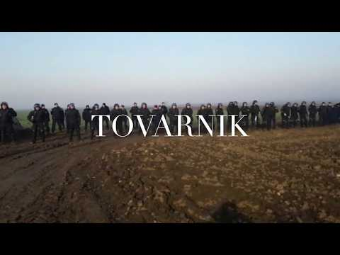
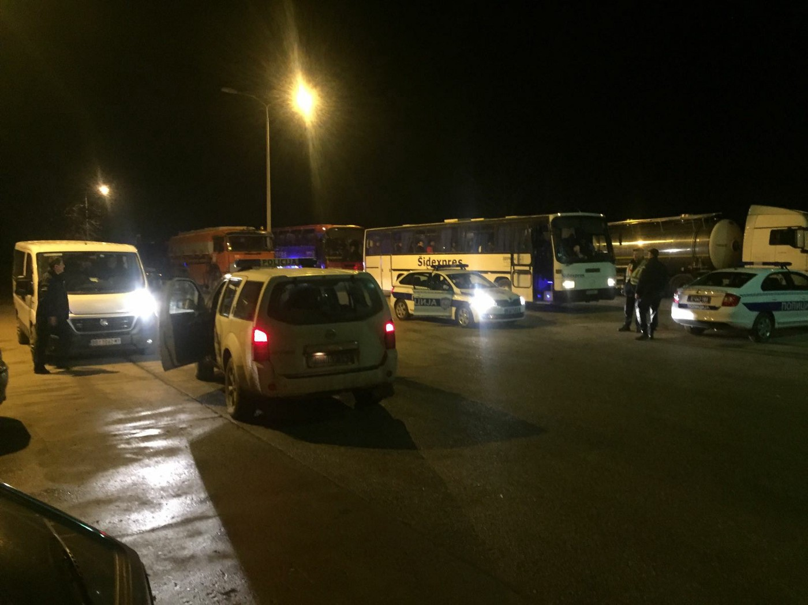
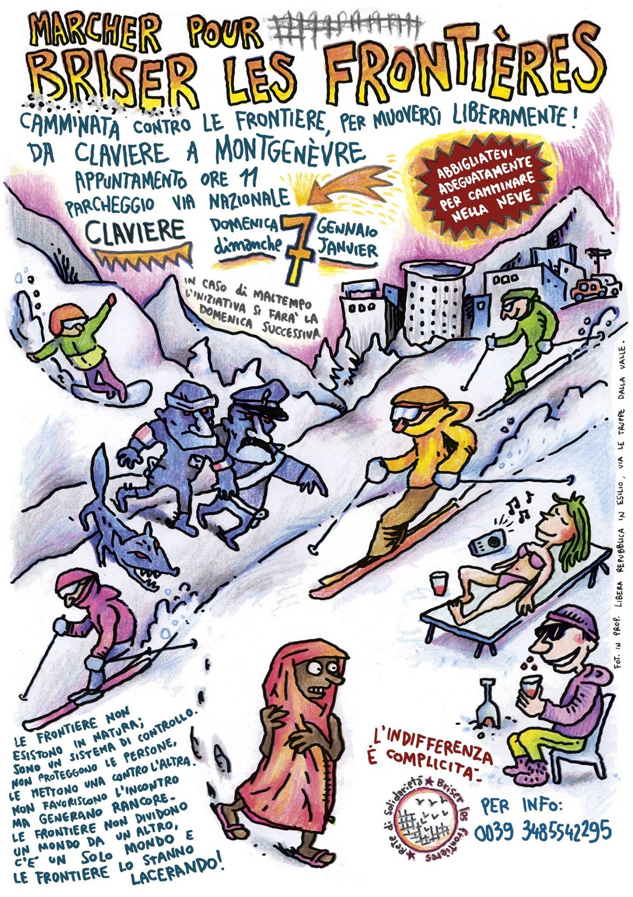
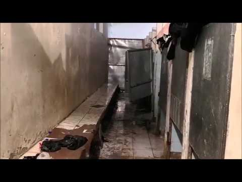

### AYS Daily Digest 26/12/2017 Protest on the Serbo\-Croatian border

New rescues in the Central Mediterranean /// Boats intercepted and pushed back by Turkish Coast Guard in the Aegean /// Call for a march against border on Italian/French mountains /// Kurdish activists extradited in Turkey despite torture threat /// New deportations from Germany to Afghanistan in January

](assets/12facc386d85/1*xK6S2M2C24hwtFEmAbnTzg.jpeg)

WE EXIST Photo by [No Name Kitchen](https://twitter.com/nonamekitchen1)
#### Protest in Tovarnik, Serbia

What started yesterday as a [gathering](https://medium.com/@AreYouSyrious/ays-daily-digest-25-12-2017-dear-santa-all-we-wanted-was-to-be-safe-f4ca0acae383?source=user_profile---------1----------------) following a false rumor about the opening of the Serbo\-Croatian border, soon turned into a protest when the numbers of the people kept growing throughout the night\.

In Belgrade police used physical violence and electric shocks to prevent people from boarding the train to reach the protest in Tovarnik\.

■■■■■■■■■■■■■■ 
> **[NoNameKitchen](https://twitter.com/NoNameKitchen1) @ Twitter Says:** 

> > #opentheborders https://t.co/1dGA2Q1v2M 

> **Tweeted at [2017-12-26 11:01:17](https://twitter.com/nonamekitchen1/status/945610462938492928).** 

■■■■■■■■■■■■■■ 

The protest took place 100 meters away from the border that divides Serbia and Croatia, 4 kilometers away from the city of Šid, located in west Serbia\. Their intention is to protest peacefully against the situation they suffer since months and against the confinement in the transit centers in Serbia, facing the impossibility of asking for asylum\.

■■■■■■■■■■■■■■ 
> **[Pedro Menendez](https://twitter.com/astPmendez) @ Twitter Says:** 

> > Frontera serbocroata, esta mañana. Vía @[NoNameKitchen1](https://twitter.com/NoNameKitchen1)  #opentheborders #refugeeswelcome https://t.co/G2upXxX6w9 

> **Tweeted at [2017-12-26 10:12:41](https://twitter.com/astpmendez/status/945598233220403200).** 

■■■■■■■■■■■■■■ 

From [No Name Kitchen](http://www.nonamekitchen.org/en/protest-in-the-border/) :

> The Croatian authorities in the border, after detecting the presence of the people on the move close to the border, didn’t take long to deploy anti\-riot units and the army, facing the woman and kids to stop them from moving forward to the European territory\. Croatia doesn’t possess a fence to separate the territory with his Serbian neighbors, but this doesn’t make them more vulnerable, since they invested a huge amount of money in high technology like sensors, drones, thermal cameras, helicopters, which makes almost impossible crossing the border to Europe\. 

The protest lasted till 11PM, when Serbian police brought everyone back with buses\.

**Afghanistan**
#### **Help needed for deported boy**

[ECADA — European Citizens against Deportations to Afghanistan](https://www.facebook.com/ecada2017/) published a call for donations for a 18\-years\-old boy recently deported\.

> From Lene Kjær
 

> Just got the message from another 18\-years\-old boy that was deported back to Afghanistan\.
 

> While he was in europe his father was killed \(he was just 38\) \.
 

> The boy told me, that he is afraid to go out\. “Killingbombs every day\.” … and now he has to earn the money for his 8 little sisters and brothers, together with his mother and grandmother\. 

> As we did for Hafiz we need 10 or 15 people who will donate €10 a month\. He can collect from WU\. It won’t make him safe but his family will be fed\. 
 

> This support makes a big difference to Hafiz\. I’m sure we can do it again 

If you can help message ECADA [here](https://www.facebook.com/ecada2017/) \.

**Sea**
#### **More than 250 migrants saved on Christmas night**

■■■■■■■■■■■■■■ 
> **[Sara Alonso Esparza](https://twitter.com/SAlonsoEsparza) @ Twitter Says:** 

> > La cubierta del @[openarms_fund](https://twitter.com/openarms_fund) es refugio ahora mismo para 134 personas (una embarazada, 36 menores la mayoría solos) que acaban de volver a nacer. Hace un rato flotaban a la deriva en el Mediterráneo  #ue #safepasage #refugees https://t.co/pgEnWHS5VD 

> **Tweeted at [2017-12-26 09:59:34](https://twitter.com/salonsoesparza/status/945594929681764352).** 

■■■■■■■■■■■■■■ 

Today Proactiva Open Arms’ vessel rescued 139 people in the Central Mediterranean\. They have been transferred on Aquarius and are now heading towards Italy\.

Among the rescued there are 15 women, 2 pregnant and 30 children; Several families from Pakistan and Bangladesh\.

Media [report](https://www.thelocal.it/20171226/255-migrants-rescued-in-med-italian-coastguard) that a military ship from the EU operation Sophia also rescued 121 people from two dinghies\.
#### **Italy**
#### [**Eufemia Info&Legal point**](https://www.facebook.com/EufemiaVentimiglia/?hc_ref=ARQAkHruvsBL7QIX5TpL-MVNfGLVGicBsKL0ZvJYK1kL7j5RtRWf-VlfeL1nFWrRwAY&fref=nf) **call for lawyers**

> Christmas doesn’t change migrant situation here in Ventimiglia\. Thats why we don´t stop\! \! 

> \[…\] If you are a lawyer and able to help here, we will really appreciate it\! Not to know your rights when you are in this situation is one of the worst thing for them… 

> Thanks to your kind support, we are able to continue our work here and give the people living under the bridge a little bit of dignity in our InfoPoint\. 

If you can help, get in touch with them\!
#### March against borders across the Italian\-French mountain border

[Briser le Frontières / Rete di solidarietà](https://www.facebook.com/briserlesfeontieres/) organised a walk against border and for freedom of movement across the Italian\-French border, from Claviere to Montgenèvre on Sunday January 7, h\.11

Image by Briser Les Frontières / Rete di solidarietà

**Greece**
#### Arrivals

3 boats last night landed on the Greek islands:

First boat picked up by Hellenic Coast Guard off Chios, arrived in port at 01\.00 AM, carrying 54 people \(12 children, 15 women, 27 men\) \.

A second boat was picked up by HCG outside Samos and landed in port at 02\.30, with 61 people \(31 children, 11 women, 19 men\) \.

A third boat was picked up off the Northern coast of Lesvos by HCG, and arrived in Skala Sykaminias at 05\.00\. It was carrying 30 people \(6 children , 6 women, 18 men\) \.

While yesterday a third boat was intercepted by the Turkish Coast Guard while heading to Lesvos, today they pushed back 4 refugee boats carrying 147 people\.

■■■■■■■■■■■■■■ 
> **[SARwatchMED](https://twitter.com/SARwatchMED) @ Twitter Says:** 

> > #TurkishCoastGuard update: a third boat was intercepted yesterday in the #AegeanSea, while heading for #Lesvos with 46 people on board, mainly from Angola, totalling 181 people intercepted on Christmas Day. https://t.co/O35p1y9Jqx 

> **Tweeted at [2017-12-26 17:40:13](https://twitter.com/sarwatchmed/status/945710856259756033).** 

■■■■■■■■■■■■■■ 

#### Taking a Shower in Moria

[Riot Turtle](https://twitter.com/RiotTurtle65) reported on Christmas Day in Europe:

> I arrived in the Moria camp in the early afternoon\. It’s December the 25th and so its Christmas\. Like always the smell of burning plastic was everywhere\. While many people were celebrating the birth of a refugee in Bethlehem, who was born about 2000 years ago, I went to the Moria camp on Lesvos\. 

> \[…\] I started to smell burning plastic, so I knew we \(Me and a few members of the Cars of Hope collective\) were about to arrive at Moria\. In the past days we distributed many many nappies and baby food and the shops were closed\. During the distribution we noticed that many people just wanted to talk and often they had many questions\. So we decided to go to Moria and take the time to answer questions as good as we can and talk with people\. There were many questions that we could answer, others we couldn’t so we also started to collect links with information about the legal situation and asylum procedures that we will spread in the coming days\. But as I wrote above; many people just wanted to talk\. To see a new face and exchanging thoughts was important for many people\. Some of them are stuck on Lesvos for more than 18 months now\. 18 months of waiting, 18 months of living in these inhuman conditions and trying to survive\. 

> We spoke with a Syrian young man who has papers to travel to Athens on the Greek main land since 3 months but when he goes to the ferry he was told again and again; no not today\. At one point he got angry and was arrested\. Another man was worried about his family and told us he was asking himself day after day when he would see his family again\. An Afghan woman told us she is afraid to go to the toilet at night because she is to afraid\. Many adult women wear nappies at night because they have fear to go out at night\. Tension is rising in this overcrowded refugee camp full of desperate people and often the police doesn’t come at all or very late when there is a fight\. 

Read more on [Enough is Enough](https://enoughisenough14.org/2017/12/26/taking-a-shower-at-moria-on-lesvos-christmas-2017-in-europe/amp/?__twitter_impression=true)

While refugess are still stuck on the open air prisons in the Greek Islands, officials prefer carrying on the blame game between local authorities, Greek Governments and EU representatives\.

Migration minister Mouzalas told the EU to put an end to its hypocrisy and asked the union to support more the country’s effort instead of blaming it for the overcrowding of the islands\.

Mouzalas also said that Greek authorities are “hoping to restore _normality”_ in the Moria hot spot by the end of January, local media [report](http://www.ekathimerini.com/224432/article/ekathimerini/news/normality-to-be-restored-at-moria-by-january-end-mouzalas-says) \.

**Serbia**
#### Kurdish activists extradited in Turkish despite torture threat

The [Belgrade Center for Human Rights](http://www.bgcentar.org.rs/cevdet-ayaz/) reported that late on Sunday, December 25, a Turkish citizen of Kurdish origin, Cevdet Ayaz, who is threatened in Turkey for his political convictions, and where he will serve a 15 year jail sentence based on the judgment rendered on the basis of his confession given under torture, was returned to that country after an extradition request sent by Turkish authorities\.

Serbian authorities authorised the extradition despite all the allegations made by his legal representatives and the decision of the UN Committee Against Torture, which ordered them to refrain from returning mr\. Ayaza to Turkey because of the real risk of being tortured or otherwise cruel, inhuman or degrading treatment in that country\. In openly opposing the decision of the UN body, Serbian authorities acted contrary to art\. 3 United Nations Convention against Torture, prohibiting the forced departure of any person into a country where he is subjected to the risk of torture\.

> As a person persecuted for political opinion, Mr Ayaz also, in the opinion of the Belgrade Human Rights Center, fulfills the conditions for refugee status under international law, which has not even been considered in the domestic asylum procedure, and the Republic of Serbia has also violated art\. 33 of the Convention on the Status of Refugees, as well as Art\. 6 of the Asylum Act and Art\. 47 of the Aliens Act\. 

> The Belgrade Center for Human Rights reminds the authorities of the Republic of Serbia and all relevant institutions that the prohibition of torture or other cruel, inhuman or degrading treatment in international law is absolute and inaccessible and that there are no reasons of political, security or any other nature that might justify her violation\. The same applies to the prohibition of the forced removal of persons into a country where they are threatened with the real risk of torture or other forms of abuse, as well as persecution that, in the case of Mr\. Ayaza had already happened through a court\-appointed court order, which ultimately had his conviction of 15 years in prison\. 

**Romania**
#### Housing support needed in Timisoara

From [Refugees, Welcome to Romania](https://www.facebook.com/RefugeesWelcomeRo/) :

> Lets do it, Timisoara\! 

> A young refugee couple from Iraq who recently received refugee status urgently need a place to stay\. Both speak English, have higher education and work in the humanitarian area in Iraq\. Due to circumstances, the 2 must leave the centre where they are currently housed, which causes anxiety and depression\. 

> Let’s help\! They need 1 rooms in an apartment / house or apartment for 1, 2 months free of charge in Timisoara\. 

> Go ahead\.
 

> More information on: 0757\.049\.902 \(Flavius Ilioni\-login\) 

**Germany**
#### **New deportation to Afghanistan in January**

[Forum Afghanischer Migranter](https://www.facebook.com/Forum-afghanischer-Migranten-%D8%A7%D9%86%D8%AC%D9%85%D9%86-%D9%85%D9%87%D8%A7%D8%AC%D8%B1%D8%A7%D9%86-%D8%A7%D9%81%D8%BA%D8%A7%D9%86-193026784462210/) inform of a new [deportation flight](https://www.facebook.com/permalink.php?story_fbid=408890012875885&id=193026784462210) to Afghanistan planned for January 23 from Dusseldorf Airport\. It seems that people will be deported from detention centres in Hessen, Bavaria and Baden\-Wurtenberg\.
#### **Protest in Deggendorf**

A meeting of the refugees community was held on December 26th in Dingolfing against the deportation culture in Bavaria\.

More info [here](https://www.facebook.com/groups/refugee.community.movement/permalink/1886392428088751/)

■■■■■■■■■■■■■■ 
> **[Omar Kadkoy](https://twitter.com/OmarKadkoy) @ Twitter Says:** 

> > A Syrian living in Germany for 2 years applied for a vocational training position. He was rejected, but given the following suggestion: 'Instead of vocational training, go back to your country because the war has finished. Your country desperately needs you for reconstruction' https://t.co/ZK67MJqQHL 

> **Tweeted at [2017-12-26 12:30:51](https://twitter.com/omarkadkoy/status/945633001676967938).** 

■■■■■■■■■■■■■■ 

**France**
#### The Cloakroom for Migrants is in dire need of clothing donation

> Hello everyone\! 

> The Cloakroom will be open on Saturday 30 and Sunday 31 December from 9 pm for the distribution of women’s clothing, men and children\. 

> Emergency Call\! 

> We are at: 

> \- zero pants size 38 to 42
 

> \- 0 underpants
 

> \- 0 belts
 

> \- 0 shoes 40 to 45 \(Baskettes\)
 

> \- 0 Gloves and hats 

> We also need socks, jackets, scarves, children’s diapers and hygiene products\. 

> And volunteers to sort the clothes on Wednesday from 15 pm and to dress minors at 17 pm\. For Saturday and Sunday for distribution women, men and children from 9 PM\. 

> Thank you to associations, collectives and people for their donations and support\. 

> Happy holidays for life, everyone\! 

> Thank you for your solidarity\! \! \! 

The Cloakroom for migrants /Vestiaire pour les migrants is in 12, rue st\. Bruno, 75018 Paris / on the corner with rue St\. Luc\.

If you can help contact Pablo on [facebook](https://www.facebook.com/pedro.p.naranjo) \.

> **_We strive to echo correct news from the ground through collaboration and fairness\._** 

> **_Every effort has been made to credit organizations and individuals with regard to the supply of information, video, and photo material \(in cases where the source wanted to be accredited\) \. Please notify us regarding corrections\._** 

> **_If there’s anything you want to share or comment, contact us through Facebook or write to: areyousyrious@gmail\.com\._** 

_Converted [Medium Post](https://areyousyrious.medium.com/ays-daily-digest-26-12-2017-protest-on-the-serbo-croatian-border-12facc386d85) by [ZMediumToMarkdown](https://github.com/ZhgChgLi/ZMediumToMarkdown)._
