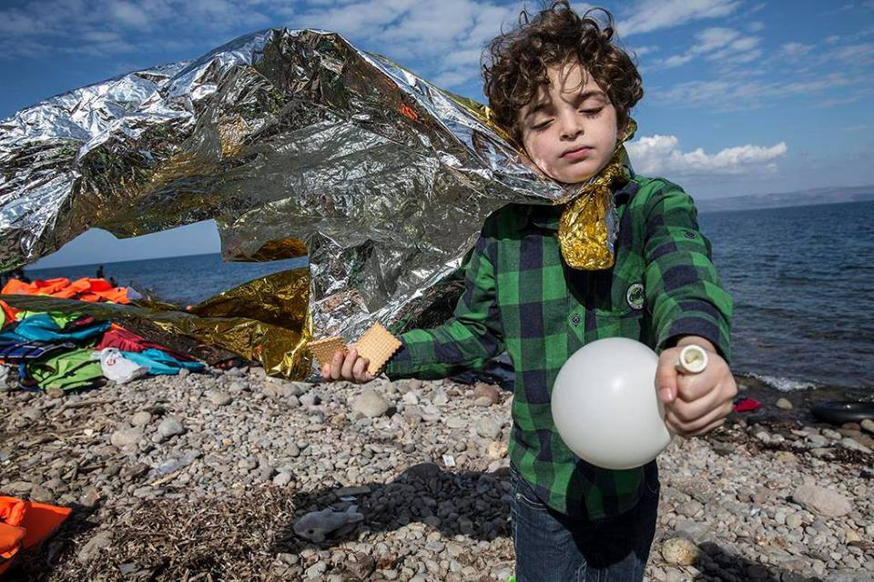
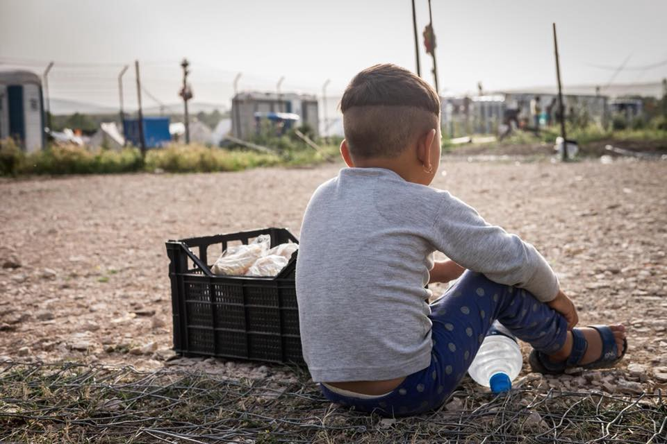
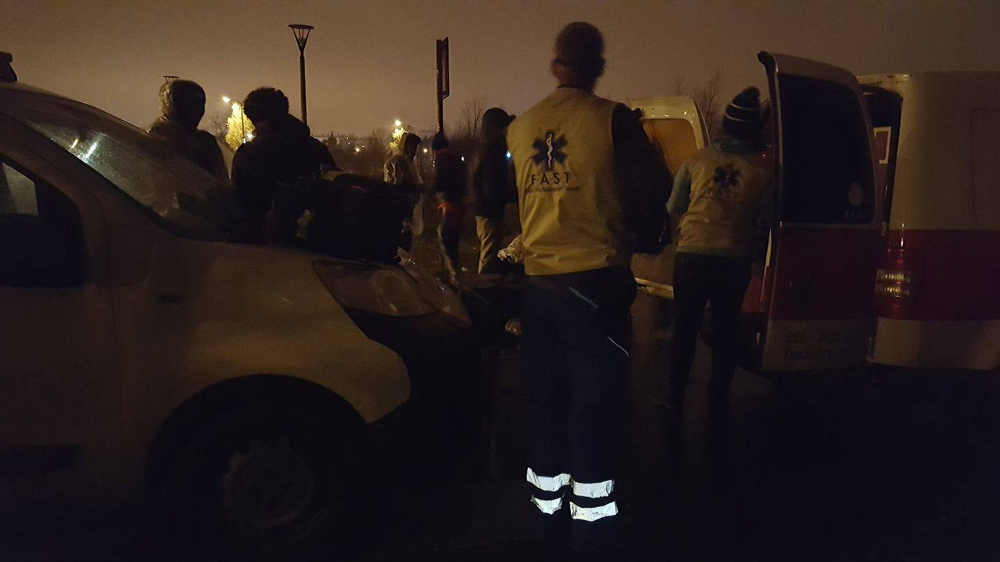

### AYS Daily Digest 28/12/17: 10,000 children are missing in Europe

_1000 children reported missing in Germany this year / Donation needs in Turkey / Rescues at sea / Greek migration minister lies / Transfers to the Greek mainland / Italy sends troops to Niger / Austrians fight deportations / And more news…_

A young Iraqi boy on the island of Lesbos\. How many of these refugee children will become one of the missing in Europe? \(Photo credit: MSF Sea\)
### FEATURE: Over 1000 refugee children reported missing in Germany

This week the German Red Cross \(DRK\) announced that it had received over [2700 inquiries in Germany](http://www.infomigrants.net/en/post/6747/missing-migrants-germany-s-red-cross-receives-thousands-of-inquries) from relatives looking for missing family members\. Over 1000 of these requests were for missing children\. Despite the fact that new arrivals in Germany are down since last year, the number of reported missing are still considerably high\. For comparison, last year DRK registered approximately 2800 requests for missing people\.

Since 2015, Europol has reported that [over 10,000 refugee children](http://www.dw.com/en/more-than-10000-migrant-children-missing-europol/a-19014669) have gone missing on the European continent\. Brian Donald, the agency’s chief of staff added that this was a “conservative estimate\.” Many of these children have fallen into the hands of sex traffickers, or are being exploited for free labour\. The Europol chief recommended that European citizens remain vigilant and aware of this crisis: “These kids are in the community; if they’re being abused it’s in the community\. They’re not being spirited away and held in the middle of forests\.” Many of the criminal organizations which have profited from getting refugees into the EU have shifted towards sex trafficking of refugees\.

Compounding this problem is the fact that so many refugee children are attempting this journey alone\. The number of unaccompanied minors entering Europe, and trying to reach safety worldwide, has skyrocketed since the start of the recent crisis in 2015\. The number of unaccompanied children worldwide has increased fivefold, according to data from UNICEF\. In 2011, the agency tallied around 66,000 unaccompanied refugee children worldwide\. In 2016, the estimate was over 300,000\.
### TURKEY

The EU ambassador to Turkey [announced](https://euobserver.com/tickers/140424) today that the bloc has contracted out all of the more than 3 billion in payments to support humanitarian aid for refugees in Turkey\. These payments are part of the EU\-Turkey deal that has resulted in thousands of refugees being deported to Turkey, and millions remaining trapped in the country\.

The [Kapilar](https://www.facebook.com/izmirkapilar/posts/1940326066232952?hc_location=ufi) organization in Turkey is raising funds to support their youth education and kitchen projects\. The majority of refugee children in Turkey are not able to attend school, and Kapilar is one of the organizations trying to fill this need\. As the volunteers at Kapilar remind us, “Every little bit helps\. For example €10 can cover the costs for all the food we cook at one of our community kitchen events, the water and lights bills for one week, or one weekly workshop session\.” You can support them [here](https://www.youcaring.com/kapilar-1025228) \.
### SEA

■■■■■■■■■■■■■■ 
> **[MSF Sea](https://twitter.com/MSF_Sea) @ Twitter Says:** 

> > UPDATE: Due to strong winds and waves of 5 meters yesterday night, #Aquarius is disembarking 373 people this morning in new port: Augusta. https://t.co/6SKjmm9Eht 

> **Tweeted at [2017-12-28 08:38:57](https://twitter.com/msf_sea/status/946299418835382272).** 

■■■■■■■■■■■■■■ 

■■■■■■■■■■■■■■ 
> **[Federico Scoppa](https://twitter.com/FedericoScoppa) @ Twitter Says:** 

> > Aquarius, a ship run by @[SOSMedFrance](https://twitter.com/SOSMedFrance) and @[MSF_Sea](https://twitter.com/MSF_Sea), is now in Augusta, Sicily disembarking 373 person rescued on the Mediterranean Sea in the last days. #migants #crisis #photojournalism #italy #news https://t.co/5bWkMNnOjL 

> **Tweeted at [2017-12-28 15:02:24](https://twitter.com/federicoscoppa/status/946395918227660800).** 

■■■■■■■■■■■■■■ 

Today MSF reported treating multiple people suffering from severe burns after making the dangerous crossing across the Mediterranean\.

■■■■■■■■■■■■■■ 
> **[MSF Sea](https://twitter.com/MSF_Sea) @ Twitter Says:** 

> > Since yesterday, @[MSF](https://twitter.com/MSF) medics on board #Aquarius treated 20 people with severe fuel burns. It's a recurrent serious health issue we see especially in women rescued. They're caused by the toxic mix of fuel and sea water that gets inside the rubber boats and burns people's skin. https://t.co/3oK3W3SF8D 

> **Tweeted at [2017-12-28 14:21:47](https://twitter.com/msf_sea/status/946385694691352576).** 

■■■■■■■■■■■■■■ 

The MSF vessel _Aquarius_ rescued over [1000 people](http://www.sosmediterranee.fr/journal-de-bord/sauvetages-261217) from the Mediterranean this month\. Many of those rescued are fleeing appalling conditions in Libya, where refugees are kidnapped, tortured, and even enslaved\. As one Eritrean man who was rescued on Christmas [explained](http://www.sosmediterranee.fr/journal-de-bord/sauvetages-261217) , “We risk our lives, but it is really better to drown than to be stopped by the Libyan navy\.”

Despite dropping temperatures, and increasingly dangerous conditions, the sea crossings continue\. As Francis Vallat, the president of SOS MEDITERRANEE, the rescue organization that operates the _Aquarius_ alongside MSF, explained, “The crossings of the central Mediterranean continue under conditions of extreme danger in the middle of winter\. Escape by sea remains unfortunately the only option for thousands of people detained in Libya in deplorable conditions\. Faced with this humanitarian tragedy that has claimed more than 3000 lives this year, rescue at sea remains an absolute priority\.”

 for SOS MEDITERRANEE\.](assets/1dce6a5fa884/1*pBIR8Sz_8x1bH9Mu3mIKqA.jpeg)

Photo credit: [Federica Mameli](http://www.federicamameli.com) for SOS MEDITERRANEE\.

■■■■■■■■■■■■■■ 
> **[Refugee Rescue](https://twitter.com/_refugeerescue) @ Twitter Says:** 

> > Our crew is still on call and was out last night to help transfer people to #Skala port. 18 men, 6 women and 6 children were on board. Our land crew took care of them for a few hours at #stage2, #Lesvos. https://t.co/i0zR83xjDq 

> **Tweeted at [2017-12-28 16:52:00](https://twitter.com/refugeerescueuk/status/946423498670530560).** 

■■■■■■■■■■■■■■ 

### GREECE
#### Greek Islands

The Greek Minister of Migration, Mr\. Mouzalas, paid a visit to the Moria camp on Lesbos this week, and in his remarks following the visit whitewashed the realities in the camp\. Calling the continued outcry over deplorable conditions in the camp [“silly” and “overblown,”](http://www.efsyn.gr/arthro/ti-den-eide-o-ypoyrgos-sto-kentro-ypodohis-tis-morias) Mouzalas claimed that conditions were not as bad they seem, and that refugees had to be patient for improvements\. The Greek _EFSYN_ outlet described the reality of the Moria camp this week, in a rebuttal to Mouzalas’ falsehoods\. From their [report](http://www.efsyn.gr/arthro/ti-den-eide-o-ypoyrgos-sto-kentro-ypodohis-tis-morias) :

> “The rubbish overflows from the collection bins and forms hills everywhere… refugees are trying to heat themselves by burning trees or lighting fires in cans with what is available, with the danger of there being again deaths from poisonous gasses, parents desperately asking where they can find first aid for children, toilets in extreme impurity, which do not emit hot water, so that the refugees warm up water from bottles and wash themselves in their tents, and there are young children playing next to outbreaks of infection\.” 

 \)](assets/1dce6a5fa884/1*0UXgnwgnDhQnZ8q6Bh3tIg.jpeg)

Refugees trying to warm themselves outside the Moria camp on Lesbos on 21/12/17\. Does anything about this scene look “silly” or “overblown?” \(Photo credit: [Daphne Tolis](https://twitter.com/daphnetoli?lang=en) \)

This is not the first time Mouzalas has lied about the conditions in the Greek camps, and as a strong defender of the EU\-Turkey deal, Mouzalas has earned his nickname as the “Muzzler of Human Rights\.”

According to data recently released by the Greek migration ministry, more than 4150 refugees have been transfered off of the Aegean hotspots in the past month\. In that time, there have also been 2323 reported new arrivals to the islands\. The island with the largest number of transfers was Lesbos, from which 2264 people were moved\. The island received 1175 new arrivals in the same period\.

The [Love Without Borders](https://www.facebook.com/groups/478293189015540/) organization is soliciting donations to buy children’s underwear for kids trapped on Chios\. You can donate [here](https://www.paypal.me/lovewithoutborders4) \.
#### Greek Mainland

In cooperation with the “ [Sick of Waiting](https://www.facebook.com/SickOfWaiting/?hc_ref=ARQj9UheXXpZm84Dmbzza1b85xzbxKwPH-B4H_7lo9ypMcA7N9NDx2oPB54N-nq3_aY&fref=nf&hc_location=group) ” activist group, the Athens Legal Support Team has released a new video detailing the struggles of refugees waiting to be reunited with their families in Europe\. The family reunification process is extremely slow, and the waiting period many refugees go through far exceeds the maximum proscribed by EU law\. As the video explains, the average wait for family reunification is over one year\. You can watch it [here](https://www.facebook.com/SickOfWaiting/videos/516673875335906/) \.

The [Second Tree](https://www.facebook.com/pg/SecondTree/about/?ref=page_internal) volunteer group has reported the arrival of 127 refugees in the isolated Katsikas camp in northern Greece\. The camp reopened last night for these new arrivals, and has beeen set up for the incoming refugees with the help of volunteers\. While the camp is better and safer than the Moria camp on Lesbos, those on the ground remind us that “a container guarded by the military is not a home\.” The camp is expected to receive another group of people tomorrow, and has a capacity of 500\.

A child by the edge of the Katsikas camp\. \(Photo credit: Second Tree\)

> Last night Katsikas Camp welcomed the first group of 127 refugees from Moria\. These new residents are the first after a year of closure for renovations\. Our team along with [Habibi\.Works](https://www.facebook.com/HabibiWorks/?fref=mentions&hc_location=group) were there to welcome the new residents with some tea and smiles as they arrived\. The camp has undergone many upgrades since its opening in March 2016, but we will always remember the strength of the previous residents and their struggle to secure better housing for the winter\. 

Forwarding an announcement from the Elliniko warehouse team in Athens:

> Please note that our Elliniko warehouse is closed for the holiday period and will resume normal operations on Wed\., Jan\. 3rd 2018, at 11am\. 

> However, we will be available to open the warehouse by prior arrangement on any day to take delivery of incoming pallets on trucks/containers during this period, so that demurrages/delay costs may be saved\. 

> Whilst we are closed, we recommend that incoming volunteers contact Patricia Colón of SOS Refugiados to arrange volunteering at their pioneering project in Victoria Square \(the heart of ‘refugees’ Athens\) the VICTORIA SOCIAL CENTER on 14, Guilford St\. 

### ITALY

[Italian authorities](https://euobserver.com/tickers/140422) have announced their intention to send a unit of “non\-combat troops” \(obviously a bit of any oxymoron\), to Niger in order to stop human traffickers there\. This mission is part of a much larger trend of Western nations pushing their border policies further away from their own territories, and of using forces and treaties in other countries to stop refugees from reaching their own shores\.
### FRANCE

The [First Aid Support Team](https://www.facebook.com/groups/www.fast.eu/permalink/2019508894995617/?hc_location=ufi) has updated their list of needed items for their work in northern France\. You can see the list here:

> From your donations we buy medical supplies such as: 

> Rehydration sachets
 

> Strepsils or throat lozenges
 

> Anti\-histamines
 

> Gaviscon or antacids \(tabs — \-easier to distribute\)
 

> Cough syrups \(non alcoholic & non drowsy\)
 

> Athelete’s foot or Any anti fungal
 

> Anti Itch eye drops \(hay fever eye drops\)
 

> Gloves
 

> Dettol/Betadine or antiseptic skin preps
 

> Vaseline or Petroleum jellies
 

> Ear drops/otomize spray for simmers ear 

> For the refugees in Calais, Dunkirk and Brussels there is no first aid at all and that is why volunteers are taking that task at the moment\. Please do not forgot the people in this horrible situation\! 

To support them with material donations, please contact [Joram Melissant](https://www.facebook.com/joram.melissant?fref=gs&hc_ref=ARTS6ZNKT-4EnObKmv7gifzf_85HQ83uos0mlYK3PKlwyz8tIGsBQlPf5wLxGIdogA8&dti=1628341497445694&hc_location=group) , or donate online [here](https://mydonate.bt.com/fundraisers/firstaidsupportteam) \.

The FAST team at work in northern France\. \(Photo credit: FAST\)
### AUSTRIA

Activists in Austria are currently fighting for an Afghani minor who is facing deportation\. Shirullah Hussaini is a young man who is alone in Austria, and has worked hard to learn the language and attend school there\. He wants to become a translator in order to help other people in his position\. Since he has been in Austria, he has been involved in volunteer work at a number of organizations\. By all accounts, he is a wonderful young man and a model citizen\. Yet because of his nationality and the EU’s cynical deals with Afghanistan, he is now facing deportation\. You can learn more about the case and sign the petition [here](https://www.openpetition.eu/at/petition/online/shirullah-muss-bleiben) \.

Austrians are also protesting against threats of deportation against young refugees who are training as apprentices in trades that are under\-staffed\. The threat of deportation is making the apprenticeship program harder to sustain for both refugees and employers\. The apprenticeship program has been hugely succesful in integrating refugees into their new communities, training them and getting them jobs, and also has been beneficial to the Austrian economy as it has brought much needed new workers into certain industries\. Learn more about the program and the threats facing it and its beneficiaries [here](https://www.openpetition.eu/at/petition/online/ausbildung-statt-abschiebung) \.

> **_We strive to echo correct news from the ground through collaboration and fairness\._** 

> **_Every effort has been made to credit organizations and individuals with regard to the supply of information, video, and photo material \(in cases where the source wanted to be accredited\) \. Please notify us regarding corrections\._** 

> **_If there’s anything you want to share or comment, contact us through Facebook or write to: areyousyrious@gmail\.com\._** 

_Converted [Medium Post](https://areyousyrious.medium.com/ays-daily-digest-28-12-17-10-000-children-are-missing-in-europe-1dce6a5fa884) by [ZMediumToMarkdown](https://github.com/ZhgChgLi/ZMediumToMarkdown)._
