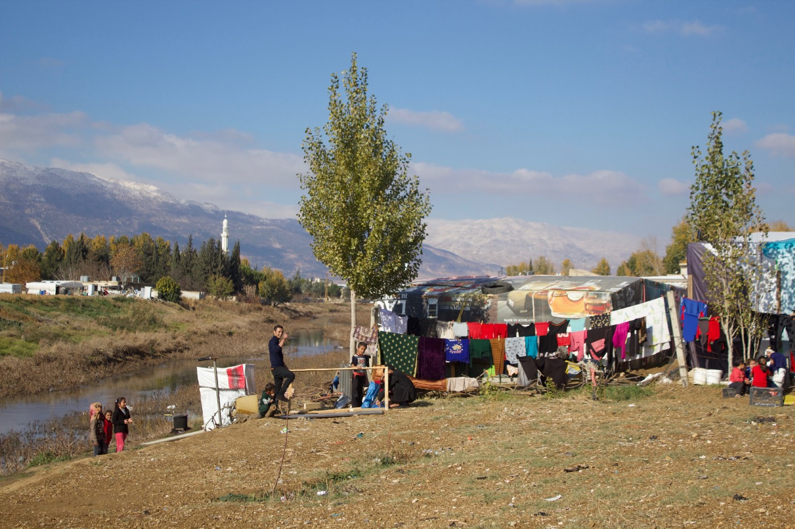

### AYS SPECIAL — Lebanon: “Don’t forget me, please\!”

Photo: AYS

The woman standing in front of me wears a beautiful green dress with small stones attached to it\. On the floor there are Persian carpets and the ceiling is covered with plastic\. It is a good roof, might just leak a tiny bit in case of heavy rainfall\. She can’t be much more than 25 and has five children\.

She arrived with her kids from Al Raqqa to Lebanon a couple of weeks ago\. It’s only them nowadays\. Her husband is not alive anymore\.

“Daesh took him\.”

Another day another woman explains that she came to Lebanon a few months ago\. She speaks better English than most Syrians stuck in the Beqaa valley\. Her voice is quiet when she says that she used to live in Al Raqqa\. She left as soon as she could after the siege was over\.

The third woman has been sleeping on some relatives’ floor since she came to Lebanon with her children\. Her husband also died in Syria\. She offers everyone a small glass of sweet chai\. Just before we’re about to leave she writes something on a small piece of paper\. It’s her phone number written in Arabic numbers\.

**“Don’t forget me, please\!”**

Photo: AYS

According to several sources, Al Raqqa will be unlivable for years\. At the same time, UNHCR and the Lebanese government hasn’t registered anyone for more than two years and the European borders are closed\.

Already when she squeezed the note with her number in my hand, I knew that neither she nor her children would get everything they need\.

**It’s a strange reality\.** No one in the Beqaa valley has everything they need\. That’s just the way it is\. It can sometimes be a bit overwhelming\.

I’m about the same age as the women mentioned above\. That is probably why their stories affect me most\. Somehow, I can see myself in them without really being able to grasp what they have been through\.

It is both worlds apart and something very familiar at the same time\. Every now and then, I’m playing different stupid mind games\. It’s in one way useless to compare things, but it gives me some sort of perspective\. What if we were born the exact same year, in 1989? Me at a hospital in a safe and boring suburb to Stockholm, they in different parts of Syria\.

**In 2009 we were 20\.**

At the same time as I panicked over which university to choose, the woman in the green dress already was married\. Judging by the age of her kids, she could have been pregnant as well\.

**In 2011, when the war started, we were 22\.**

I was a university student and did what most university students back home do\. Studying, partying and not having any problems bigger than passing the next exam\. They were raising kids in a country torn by a proxy war, living in a city that soon was to be under Daesh siege\.

The past couple of years, I’ve been reading about the war and Daesh terror in the newspaper\. I’ve seen terrible photos and videos\. They were in the middle of it\. Then a lot of coincidences and choices led us all here to Lebanon’s Beqaa valley\.

In one way, we are all here for the same reason\. If the world would have been different we either could have been neighbors or classmates, or never met at all\. Instead, we’re all here\.

The words in the paper are stranger than fiction to me\. Politicians seem to think that common sense still makes sense\. Meanwhile, the impossible is possible every day in the Beqaa valley\.

Where young women are asking about something that shouldn’t have to be a humble request, but unfortunately makes more sense than politicians quoted in the paper\.

I’m very sure that none of the women had anything to do with the war that made them widows and brought them to Lebanon\. Still, they are among those who pay the highest price for an uncertain amount of time ahead\. All I can hear when I read reasonable arguments saying that we can’t do more is those same words over and over: “Don’t forget me, please\!”

**_\(Hanna Strid, AYS Daily Digest editor, currently volunteer in Lebanon\. \)_**

_Converted [Medium Post](https://medium.com/are-you-syrious/ays-special-lebanon-dont-forget-me-please-d443b954be12) by [ZMediumToMarkdown](https://github.com/ZhgChgLi/ZMediumToMarkdown)._
