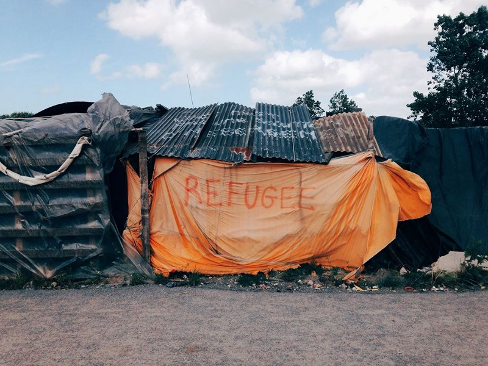
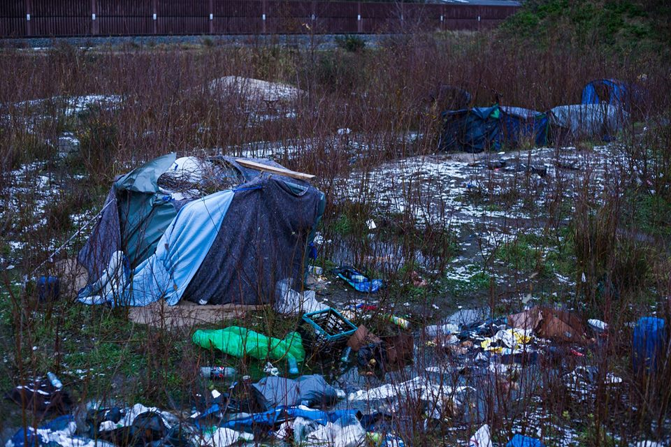

### AYS DAILY DIGEST 29/12/2017: Another refugee dies near Calais

_Second refugee dies in the Calais region in a matter of weeks//No Name Kitchen responds to accusations of being the root cause behind Christmas protests in Serbia_ // _Critical situation in the Malaga detention centre_ //

Calais before the eviction\. Photo by the Worldwide Tribe
#### Feature
### Another refugee dies near Calais

This morning near Calais a man in his thirties died inside a lorry after the driver lost control of the vehicle\. After first reports of an Erithrean refugee, l’Auberge des Migrants and police sources have now said it was an Afghan refugee according to [La Voix du Nord](http://www.lavoixdunord.fr/288325/article/2017-12-29/accident-mortel-sur-l-a26-le-chauffeur-surpris-par-le-geste-du-migrant) \.

Help Refugees reminds us that last week a 15\-year\-old child was killed in a hit\-and\-run incident on the motorway\. He had been formally referred to the state child protection services as vulnerable, and as a potential family reunification case, but no action was taken\.

A few days ago, a 22\-year old young man was also involved in a car crash near Grande Synthe which has left him fighting for his life in hospital\.

Help Refugees says:

> These tragic deaths were entirely preventable\. The emergency accommodation in Calais remains closed, as the local authorities have deemed it insufficiently cold\. The Dublin III family reunification procedure currently takes an average of nine months\. The Dubs Amendment for unaccompanied children is stalled\. The French and British Governments have a duty to protect Europe’s most vulnerable, but are failing to meet the most basic and causing unnecessary tragic deaths at our border\. 

L’Auberge des Migrants adds that the number of refugees living in Calais has steadily increased since the beginning of the year, from 100 in January to 500 in December\. It adds that they are mostly in the region because they cannot seek asylum in France, as the government measures do not work, with refugees forced to give their fingerprints and therefore likely to be sent back to Italy, Bulgaria and other countries\. Police is systematically tracking refugees and destroying their belongings while they take enormous risks each night to cross the border\.

Calais is not the only region where these tragic deaths happen: In the Alpes\-Maritimes region at the border with Italy, 15 refugees have died since September 2016, with the latest falling to his death near the highway last Wednesday according to [France 3](https://france3-regions.francetvinfo.fr/provence-alpes-cote-d-azur/alpes-maritimes/menton/roquebrune-cap-martin-migrant-retrouve-mort-au-bord-a8-apres-chute-1391603.html)

A vigil will be held for the latest victim this Saturday at 18:30 in front of Richelieu park in Calais\.
### Help Refugees calls on authorities to open emergency accommodation centres

Help Refugees also calls on authorities to reopen the emergency accommodation centres in Calais which could shelter 260 people and has provided a [template email](https://www.facebook.com/HelpRefugeesUK/photos/a.123267671367248.1073741830.111893659171316/543386972688647/?type=3&theater) to send to the local Prefecture\. The Refugee Info Bus notes that authorities argued it is “not cold enough” to open the centres, despite freezing winds and heavy rain forecast overnight\.

Photo by Futuro Berg
#### Greece
### Numbers on Lesvos remain high despite transfers to mainland

1,161 refugees arrived to Lesvos in December, while 1,746 departed for the mainland\. An estimated 7,664 are currently staying on the island\.

14 new Syrians arrived in Rhodes\. They are in the Rhodes prison: five men, three women, six minors\. [Oasis Rhodes](https://www.facebook.com/groups/OasisRhodes/?ref=br_rs) group calls for donations\.
### Man drowns trying to cross the Evros river

[Ekathimerini](http://www.ekathimerini.com/224531/article/ekathimerini/news/man-dies-while-trying-to-cross-into-greece) reports authorities in northern Greece are trying to identify a man who drowned in the Evros river, apparently while trying to cross from Turkey into Greece\. The man was probably aged between 20 and 25 and is likely of African origin\.
### Migration ministry blames local authorities for conditions on islands

[Ekathimerini](http://www.ekathimerini.com/224504/article/ekathimerini/news/migration-ministry-responds-to-criticism-over-island-camps) also says the Migration Ministry has blamed local authorities for the grim conditions inside island refugee camps, after criticism from the EU’s special envoy on migration, Maarten Verwey\. Verwey had said that the European Commission made funding available to ensure appropriate accommodation for all\. “ _However, the Commission cannot order the creation or expansion of reception capacity against the opposition of the competent authorities,_ ” he added\.
### Education coordinator needed in Northern Greece

Lifting Hands International needs an Education Coordinator from January/February 2018 onward to work with and lead their language programmes for Yazidi refugees, in Serres, Northern Greece\.

As an education coordinator, you would:

\- teach English to Yazidi refugees of all ages
\- provide training to incoming volunteers
\- ensure teachers have the resources and support they need
\- help timetable classes
\- coordinate with other NGOs across Greece that provide education resources, training and advice for volunteers

You will need to be organised and proactive with a strong teaching/TEFL/CELTA background\. This position requires a minimum time commitment of 60 days\. LHI can offer housing at our volunteer apartment in the centre of Serres for 5 euros per night\. For more info, please email [jessica\.basi23@gmail\.com](mailto:jessica.basi23@gmail.com)
#### Serbia
### No Name Kitchen responds to accusations of being the root cause behind Christmas protests

[No Name Kitchen](http://www.nonamekitchen.org/en/criminalizing-humanitarian-aid/) writes about the aftermath of the Christmas protests at the border with Croatia\. It says it reacted to this emergency situation and asked the Serbian police whether their could satisfy their basic needs: tents, food, water, basic medical treatments\. A demand that was accepted\.

However, the Commissariat for Refugees \(KIRS\), the organisation responsible for refugee care, soon accused them in several media of being the root cause of the protest:

> According to them, we made everyone believe the borders would be open because it was Christmas\. It’s not true\. We just offered our help when we realized that a lot of families would sleep outside with nothing to protect them from the cold and the police allowed us to\. We gave them hot food, blankets and tents\. We are very disappointed to see an organisation with such responsibility in this humanitarian crisis that Europe is experiencing, assuming the refugees don’t have the capacity of thinking for themselves and self\-organizing\. We should not forget that, even though some people see them as disabled, they are people who invested their lifetime savings to put on a backpack and travel across half the world with the hope of a better future\. 

](assets/34aaa4eb1f6b/1*7DhqkY4c_nVh8Gdb-YHD5w.png)

Photo by [**Gabriel Tizon**](https://www.facebook.com/gabrieltizonfotografo/)
#### Croatia
### AYS need official Kurmanji translator

AYS is looking for an official translator of the Kurmanji language spoken in Gaziantep, Sanliurfa and northern Syria for a translation\. Ideally the translator should reside in an EU country in proximity of Croatia\. Please send us a direct message through our Facebook page\.
#### Spain
### 20 people saved in the Strait of Gibraltar

The Spanish coastguard has rescued three men on a boat in the Strait of Gibraltar and has brought them to Tenerife\. Moroccan authorities meanwhile have rescued two boats with 10 and seven people on board\.
### Algerian man found dead at the Malaga detention centre

[El Diario](http://www.eldiario.es/andalucia/malaga/Hallan-muerto-Archidona-inmigrantes-internos_0_723727922.html) reports an Algerian man was found dead at the immigration detention centre of Malaga in a possible suicide\. The detention centre is located at a future prison and hosts those who reach the Spanish coast by boat\. The president of “Malaga Acoge” Arantxa Triguero has indicated that she is against“people being brought to a prison” saying that it violates their fundamental rights\. Many NGOs have also denounced the “deplorable” conditions within the prison\. Journalist Sergio Rodrigo says that the previous day, detained immigrants faced repression and violence by Spanish authorities\.

■■■■■■■■■■■■■■ 
> **[Sergio Rodrigo](https://twitter.com/SRodrigoruiz) @ Twitter Says:** 

> > #URGENTE Así estaba ayer el módulo de la Cárcel de #Archidona donde ha aparecido esta mañana un migrante supuestamente ahorcado. Lo internos denuncian represión y reclusión por parte de las autoridades españolas https://t.co/0hlj35U3J1 

> **Tweeted at [2017-12-29 20:06:02](https://twitter.com/srodrigoruiz/status/946834717248294912).** 

■■■■■■■■■■■■■■ 

#### Sea
### Proactiva Open Arms saves 10,523 lives in 2017 alone

Proactiva Open Arms says it has now saved 57,718 lives since it first started and 10,523 lives in 2017 alone\. Meanwhile, 3,155 people have died while trying to cross the Mediterrenean\.

> **_We strive to echo correct news from the ground through collaboration and fairness\._** 

> **_Every effort has been made to credit organizations and individuals with regard to the supply of information, video, and photo material \(in cases where the source wanted to be accredited\) \. Please notify us regarding corrections\._** 

> **_If there’s anything you want to share or comment, contact us through Facebook or write to: areyousyrious@gmail\.com\._** 

_Converted [Medium Post](https://areyousyrious.medium.com/ays-daily-digest-29-12-2017-another-refugee-dies-near-calais-34aaa4eb1f6b) by [ZMediumToMarkdown](https://github.com/ZhgChgLi/ZMediumToMarkdown)._
