### AYS DAILY DIGEST 30/31\.12\.2017\-1\.1\.2018: **It’s time to end the hypocrisy\!**

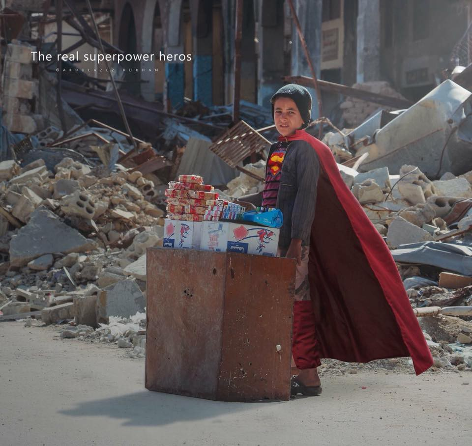

A new kind of super hero has appeared, anonymus but very important\. A brave boy selling food at the destroyed streets of Aleppo, Syria\. Photo by Abdulazez Dukhan\.
### Intro

The year of 2017 was much more difficult than we could even imagine during the previous year\. More borders, more populism, more fascism, militarization, wars, police violence… Children are dying again before closed borders, but it seems like no one cares any more\.

While part of the world population will celebrate the arrival of the new year, the other part, millions of people who have fled their homes due to wars, poverty or fear for their lives, will spend another night in tents, on the streets, in the forest, dreaming of reaching a country where they will have a chance for a better life and the possibility of choice\. Now that borders closed, their chances in 2017 became smaller than ever\.

At the end of this year, we could simply repeat the same [digest we published at the end of last year](https://l.facebook.com/l.php?u=https%3A%2F%2Fmedium.com%2F%40AreYouSyrious%2Fays-new-year-special-this-is-what-we-wish-for-in-2017-106066f0bf74&h=ATPIOSTyiiqx5T88FRvpADcb3UdRy_Wcgvg8WNAKglFf8ow7jgdW4MSl2uTCykCivqyA4KbMgJYjuVVAPJsGzJQPaLPHfIXUstSI2d--WvfCM9yUQROQIwhfR-qWfWU4RLrjEt03fyZlAlVj) \. Nothing has, unfortunately, really changed\. At least not for the better\.

But we have written another one\. To remind us all of what we should not forget of what happened over the last year, and also to shed light on the struggle and the resilience people have within themselves\. When we come together, we can make miracles\.

Solidarity and love\!

Everyone knows Batman is an imaginary actor in a movie, but have you heard about the real Batman? By 
Abdulazez Dukhan
### Syria

Many people are affected by the war, which has been going on for seven years in Syria\.

Can you imagine how difficult it must be for parents to see their kids in such a bad situation? These fathers and mothers are the real superheroes who are doing their best to save their children\. They are sacrificing their lives and braving dangerous situations to save their kids\.

They leave home if it is not safe to make sure that their kids will be in a better situation\.

They deal with the cold so their kids will be warm and they work anywhere with anything to make money they can spend on their families\.

Those are the real superheroes who put their families’ needs before themselves\.

These are the heroes who are using their superpowers to help their families and the ones they love\.

**_\(Abdulazez Dukhan, asylum seeker in The Netherlands\. Moved from Greece this year as part of a relocation program\)_**
### Iraq

I hope the wars and conflicts will end\. And that Iraq will become a great example in the Middle East for stability, peace, development, building, tourism, and the economy\.

**I hope the new year will be a year of peace and security in Iraq and the world\.** I wish in this new year that Iraq too will have a clear and correct policy in the economy, security, education, foreign policy, and media\. And rebuild the infrastructure in the cities devastated by the war\.

The long history of Iraq has been marred several times by the ravages of wars\. The Second Kurdish–Iraqi War \(1974–1975\), the Iran–Iraq War \(1980–1988\), and the Gulf War \(1990–1991\) are some of the major wars fought by Iraq in the past century and the sanctions against Iraq were a near\-total financial and trade embargo imposed by the United Nations Security Council 1990 to 2003\.

In 2003, U\.S\. forces invaded Iraq to overthrow the government led by Saddam Hussein\. The intervention prompted the civil war, which lasted from 2004 to 2009\.

War and conflict also appear to haunt the country at the present time with the emergence of armed terrorist organizations and the war on ISIS since 2014\.

Wars and the lack of security, political and economic stability make Iraq a country exporting refugees around the world\.

**_\(Nafaa Adnan, independent volunteer\)_**
### Libya

_“A government that couldn’t protect their own people will never be able to protect migrants\.”_

Earlier this month the [City Plaza](https://www.facebook.com/groups/943355035786244/) and other local groups, organized a demonstration in Athens against EU involvement with the slave trade in Libya\. It took place on 16 December, International Migrants Day, with many other solidarity demonstrations taking place in multiple European cities\.

A Libyan comrade contacted activists in Athens to state his wish to be involved in organizing the event and to be present at the demonstration, yet his application to leave the refugee camp in which he lives in the north of Greece was denied by both DRC and UNHCR\. This is one of many examples of the random enforcement of geographic restrictions on refugees in Greece\. In this case, in blatant disregard of an individual’s right to freedom of speech\.

As a result, the young man sent a statement which was handed out at the demonstration\. His testimony is doubly important as he himself had worked with the UN in Libya since 2014\.

He is clear that there has been evidence of slavery in Libya for the last 10 years and international aid agencies have been aware of the situation but no action was taken\. However, now that EU governments are becoming involved in a bid to end migration to Europe, their impact is extremely negative\.

_“The European Union \(Italy especially\) is training the Libyan coast guard\. The same Libyan coast guard involved in the smuggling network\. The European Union said they will fund whoever can control and end the smuggling and slavery of people\. This has led to militias in the country fighting over cities in hopes of getting the funding\.”_

It is also important to note that the type of slavery he witnessed was very particular to the current situation in Libya\.

“ _And we need to be clear that slavery nowadays in Libya is one smuggler selling people to another smuggler — Not slavery as in the old times\. It’s also important to be clear that Libyans themselves suffer the same thing\. Prisoners are sold to their families and kidnapping is a daily crime in the country\. Many Libyans were killed because their families couldn’t pay the ransom\.”_

And yet, when a Libyan man requests ‘leave’ to protest against the terrible conditions in his country from an organization he himself has worked with in gathering evidence of these abuses, he is denied\. Why? Because he is being illegally detained in northern Greece\.

**It’s time to end the hypocrisy\.**

If EU governments want to stand up to slavery in Libya then they need not merely end their involvement with militias in Libya but also look at conditions for new arrivals in their own countries and the EU’s border countries\.

**_\(Emma Musty, AYS daily digest editor\)_**
### Turkey

Dear 2018,

I wish for Turkey to accept Syrians simply as our neighbors: people who just happen to live in this forsaken country\. We share the same smog, the same traffic, the same uncertainties and fears, and gaze at the same stars when the moon is gone\.

I wish that all who have been apart from their loved ones would be reuniting right this moment, not this year, not this month, not this week, not this day, but right… now… Because a minute apart from your beloved child, or the love of your life, or the cousin who always had your back during school, or the friend who made you laugh so hard your cheeks hurt, is a minute too much\.

**I wish that all countries open their borders so everyone who has been apart can have blissful moments of love and friendship\.**

I wish for all my Syrian friends to receive refugee status in Turkey, and all the children of my friends to be able to attend the schools they want, all of them to get every health benefit they have the right to\.

I wish for my fellow Turkish citizens to be accepting, fair and courageous enough to stand up for their neighbors’ rights, their rights to live decent lives\.

I wish for the Syrians in Turkey to forgive us, for everything we have failed to do: for not protecting your children so they can go to school instead of working in textile workshops\. For keeping you apart from your loved ones\. For letting your families die in the Aegean or at cold, hard borders\. For letting people discriminate against you and steal your well\-earned wages\. For turning a blind eye while you wait, in vain, for things to change\.

I wish to thank all those who have been trying, in vain, to give you back a glimpse of your lives\. There are so few of us, but together, we will make 2018 better than 2017 was\. It is a promise to myself, and to you, my neighbors\.

**_\(Zeynep Kurmuş Hürbaş, an independent volunteer in Turkey\)_**

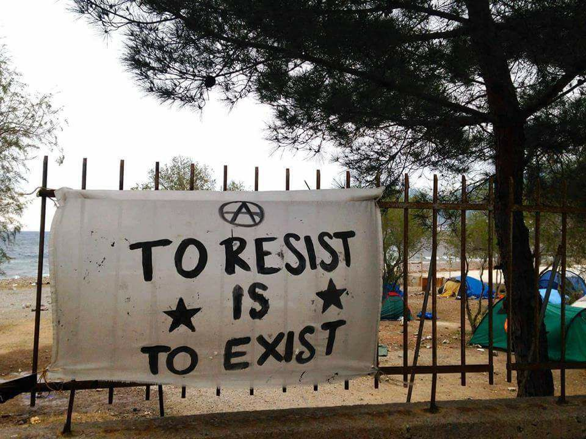

NoBorders community Athens
### Greece

We were asked to make a wish for 2018\.

For 2018, we wish Nothing\.

Because, for us, wishes fall short of our goals\.

For the year to come, **we will continue to resist and struggle** against:
- Detention centers, concentration camps, and prisons\.
- Deportations, push\-backs and people’s oppressors\.
- Borders, war, deaths of people at sea, land and concentration camps, and imprisonment, as a result of policies such as the EU\-Turkey Deal\.
- Any gain and exploitation of man by man, or of the weak by the powerful\.
- Against racism, discrimination, and xenophobia\.

We stand in solidarity with the struggles of people in every corner of the planet, for land, freedom, autonomy, and self\-organization\.

**_\(NoBorders community — Athens\)_**
### Italy

At the moment, no asylum seeker is sleeping in the streets\. The illegal refusal of new asylum applications, the result of an agreement between the Prefettura and the Municipality, has to lead to incorporating all the asylum seekers sleeping rough into the system, discouraging new arrivals\.

Those who are still sleeping in the streets are the last ones, the forgotten ones: around 20 young men, the so\-called “fuori progetto” \(those who concluded the asylum process as well as those who were kicked out of the reception system, even for absurd reasons\), who are sleeping either at the Bronx, a semi\-open parking lot, that has been the major gathering point for new arrivals, or in other makeshift shelters here and there, like a makeshift tent in the Comina area, four km from the city center\.

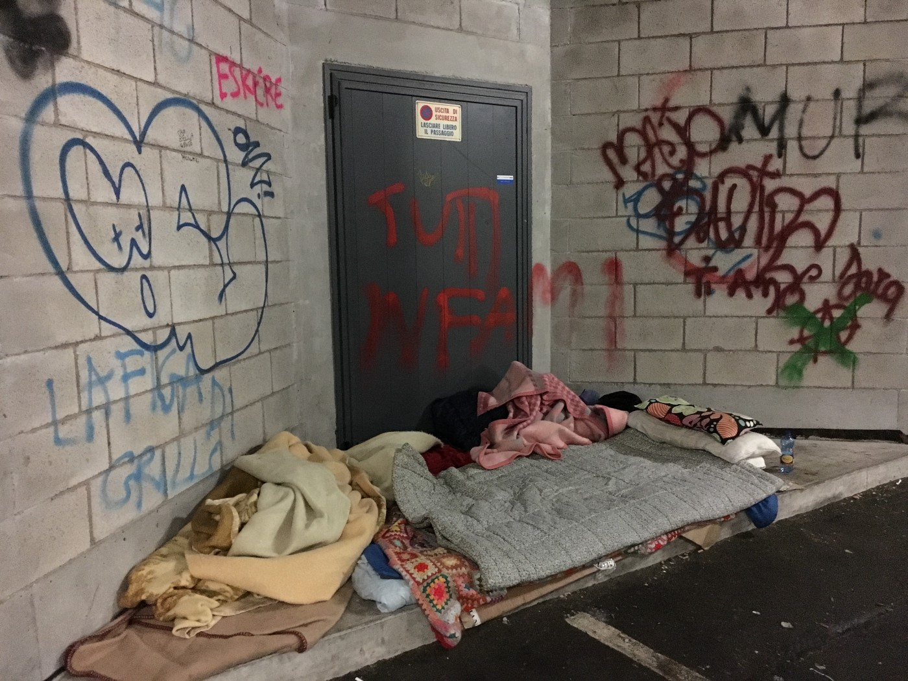

All these young men are supported by the few volunteers \(4–5 people\) still going around the streets and they receive one evening meal a day, offered by the Red Cross, which has been providing this service since last spring to all those living in the streets \(the maximum number reached was around 70\) \.

_These migrants are obviously suffering, physically and psychologically, from this forced lifestyle, out in the streets; for some of them, this has been going on for a few months, for some, for over a year\._

This situation represents the final chapter of a complex phase started at the end of 2014 with the first arrivals\. **We, volunteers, as we make the rounds in the streets every night, keep asking ourselves what the next chapter will be like?** What is missing the most is the righteous indignation and rage that can bring the change\.

**_\(Lorena Fornasir, Gian Andrea Franchi, independent volunteers in Pordenone area\)_**

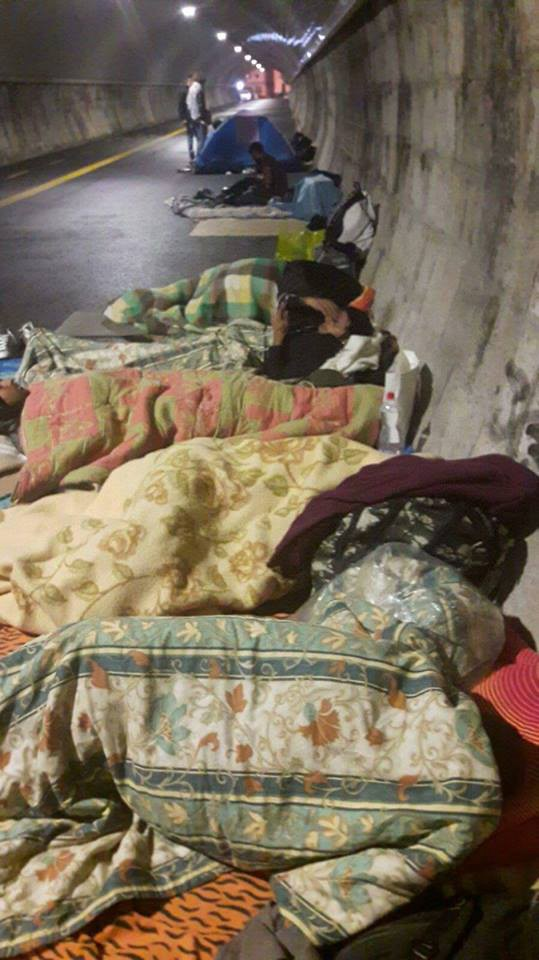

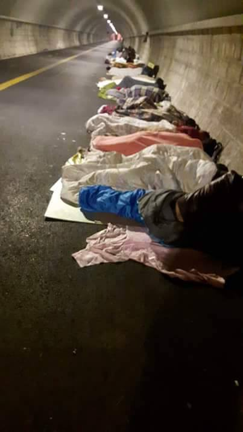

Photo by Pics: Mauro Chiarabba & L’Altra Voce

**Gorizia**

At the moment our group doesn’t have certain and concrete data on the flux of migrants\. Data of two days ago reported that there were 45 people staying in a big tent, and 30 inside a dormitory managed by Caritas\.

The number is, however, extremely variable, because of the continuous transfer to the Cara and other Italian regions\. Authorities, as well as the Church and other local associations are extremely reserved when it comes to sharing official and real numbers of migrants outside the reception system\.

The impression is that they want to keep the situation as secret as possible\. We can say, approximately, that the number of those outside the system is around 70; during the day they roam around the streets because the dormitories close, most of them go to the Jungle and cook something there\. Around 30 people eat an evening meal offered by a parish, but even this information is imprecise\. The only sure thing is that they all go and eat at the Jungle during the day\.

For 2018, **we wish a national network of volunteers who will support people on the move and help each other** \. Currently, too many divisions are present and there is a lack of a national web of contacts\.

**_\(Mauro Chiarabba, volunteer in Gorizia area\)_**
### Macedonia

The refugees in the Balkans are desperate\. They have been stuck for too long en route, their rights denied, without papers or the option to be seen as equal\. The European borders are closed and they receive no response to their asylum petitions\. They are passing our country, silently — invisible to our eyes, but not to the police and criminals\.

During 2017, we were dealing with push\-backs, rejected claims, and too many other issues people had to fight\. We cannot name all the inhumane acts they suffered from the states\.

_Even us—the volunteers whom refugees expect will cure their destroyed dreams— have been helpless faced by the fresh wounds caused by police brutality, scars from the fences they tried to cross, frozen bodies, empty gazes into an uncertain future…_

**Macedonia is keeping the gate of EU firmly closed** \. With double razor wire, with laws that don’t offer protection to those in need, with special police forces from EU located on the border lines, with the presence of FRONTEX, with closed camps…All this, against people who have no hope\!

Will Macedonia receive an“award” for this from the EU? We will see in 2018\.

Listen to the voices of the refugees, see them, talk with them, act in accordance with the obligations mandated by international law\. This will make Macedonia, and their leaders, better in every field of work\.

Open your heart, eyes and BORDERS\! \! \!

**_\(Mersiha Smajlović, Legis\)_**
### Serbia

A year ago, AYS wished for Serbia’s government to start prioritizing the well being of refugees and migrants over bureaucracy\. Many things have changed since then\. But if we consider how 2017 kicked off, it seems that priorities haven’t changed much\.

Between 1000 and 2000 refugees and migrants — including minors and kids — spent a harsh, freezing winter with temperatures of \-15° C in a makeshift settlement behind Belgrade’s main train station\. Hidden in plain sight, 500 meters away from the city center of a European capital, this became a [city within a city](https://video.vice.com/rs/video/grad-u-gradu/594a55e473f153215418d5b9) \.

These abandoned warehouses, demolished in May, were their refuge for many months due to overcrowded government camps and the lack of trust in the institutions\. Living “conditions” in the infamous Barracks were humiliating, terrifying, degrading, dehumanizing\. Serbia faced an emergency situation verging on a humanitarian disaster\.

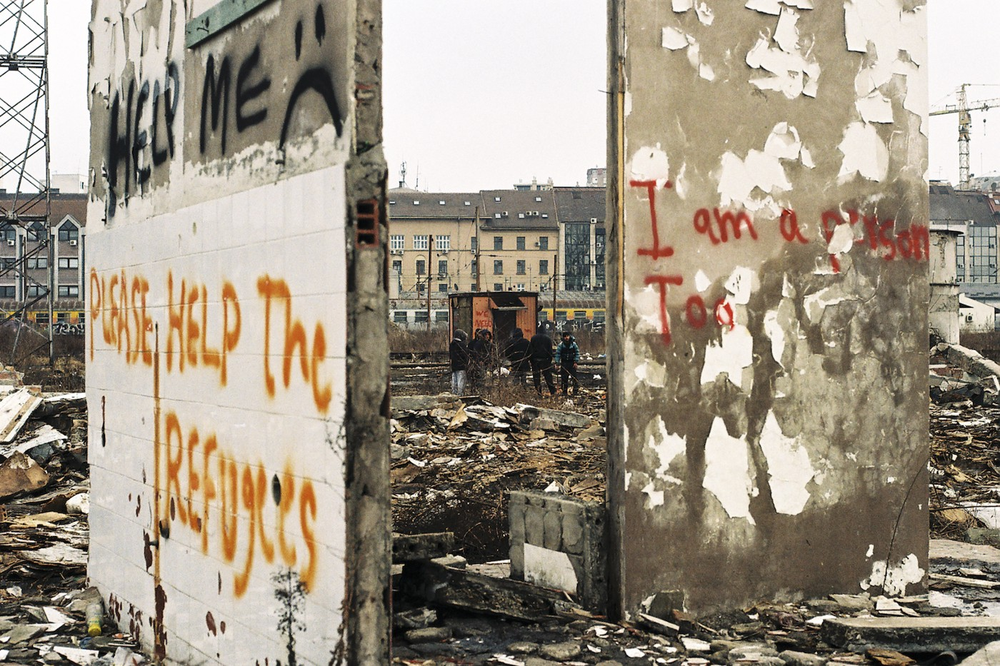

Photo Lazara Marinković

The hands of the NGOs were mostly tied by a “recommendation” from Serbian authorities stating that providing aid outside official camps encourages migrants to stay on the street\. Bureaucracy over human lives\. Sad images of young men and boys living rough without heat, basic sanitary facilities, proper shoes, clothes, food and medical aid made global headlines\.

Once the winter was over and most refugees were accommodated in 18 camps and centers in the country — other problems came to light\. Conditions in camps vary from horrible to decent\. Most of them are located on the country’s outskirts, enhancing isolation and social distance\.

Many NGOs and experts warned that people cannot just be packed into camps and expected to vegetate there for months, a year, or even more in some cases\. The longer stays in camps inevitably lead to deteriorating mental health, depression, anxiety — even aggression and self\-harm — especially among these people who already faced trauma during their long and dangerous journeys\. Boredom, the insufficient psycho\-social support and integration activities for adults, the constant uncertainty and rising despair also continue to push people into risky attempts to cross the borders either on their own or with smugglers, sometimes with tragic consequences\.

_One of the first victims of the closed borders around Serbia in February was 19\-year\-old [Rahmat Ullah who drowned](http://www.dazeddigital.com/artsandculture/article/34778/1/the-19-year-old-who-died-in-a-river-trying-to-reach-safety) in the frozen Tisza river while trying to walk over it to Hungary\. One of the last and youngest victims is six\-year\-old Madina, who was hit and killed by a train right after her family was pushed back from Croatia\._

Besides people getting killed or injured while trying to reach EU soil over the past year, helpers in Serbia have registered countless number of refugees pushed back from surrounding borders with injuries, broken phones, humiliated and traumatized\.

There are serious and complex issues — human trafficking, sexual violence and other forms of abuse and exploitation among refugees — which have as yet to be dealt with properly\. If ever\.

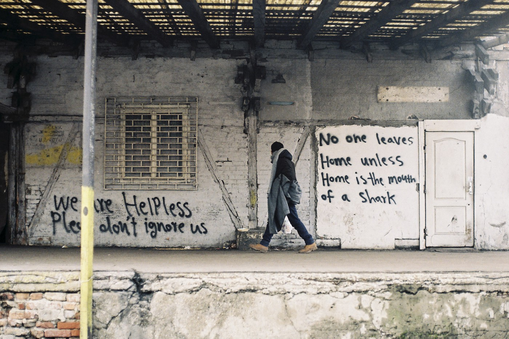

Photo Lazara Marinković

What do I wish for refugees and migrants in Serbia in 2018? Where to start? **Decent and humane treatment\. Less isolation\. More cooperation between the government and NGOs\. More real, systematic support and fewer [PR stunts](http://www.dw.com/en/afghan-little-picasso-offered-serbian-citizenship/a-40126804) \.**

We can do much better than this\.

**_\(Lazara Marinković, journalist and photoreporter\)_**
### Romania

Romania has became an alternative route: the number of arrivals is increasing ever since the Hungarian and Croatian governments enforced their border defence\. According to the Romanian border police, 1600 people arrived last year, which is 20 percent more than arrived during the previous year\.

This non\-Schengen zone EU Member State has a very special role in this European crisis\. It is not on the main refugee route due to geographic and strategic reasons\. The border crossing via the Black Sea is much more dangerous than via the Mediterranean area\. Bulgaria —also a non\-Schengen country — was the first country to build a fence along the border in the Eastern region\.

An influx from Serbia has been avoided until now, Romania being a blind route as a neighbour of Hungary \(known for its government’s anti\-migrant policy\), Ukraine, Bulgaria and Moldova\. But now, with alternatives running out, the importance of this EU Member State is growing\.

Romania is an exception in the Eastern and Central European region for several reasons\. Although there are also emerging anti\-migrant and anti\-refugee movements, the government expressed its wish to participate in the refugee relocation process \(unlike Hungary, Poland or the Czech Republic\) \. This year 3500 refugees were relocated by Romania\.

The Romanian diaspora in the European Union and the United Kingdom represents a vulnerable group as well, the uprising xenophobia in Europe may affect Romanian citizens, too\. So the acceptance and flexibility in migrant and refugee issues is more accentuated here\.

Last but not least, it is an EU Member State, so the opportunities here seem to be more promising than they do in Serbia, for example\.

These trends point out not only that refugee routes are changing, but that Eastern and Western European cooperation on the migrant and refugee crisis needs to be rethought\.

**_\(Parászka Boróka, journalist\)_**
### Croatia

Croatia finishes the second calendar year with the shameful organised practice of violent push\-backs of refugees, not only from the border, but also from deep inside the territory — for example, from Zagreb, including from in front of the UNHCR Croatia building \(several cases\) \.

Not only AYS and Center for Peace Studies, but also international organisations such as MSF Serbia and UNHCR Serbia have confirmed that this is happening \(e\.g\. UNHCR Serbia has reported about 3000 cases of push\-backs from Croatia during 2017\) \. These cases include women, children, LGBT persons\. They often include harsh violence and misappropriation of the personal property of refugees\. And they are all conducted by the Croatian police\.

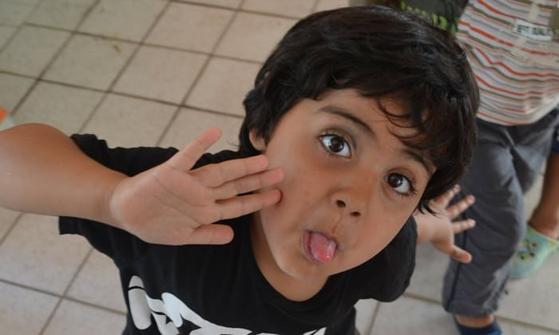

Madina Husseini

**Croatia will hopefully have enough of a conscience to remember the death of the little Afghani girl, Madina Husseni, this year** who was the last victim \(the seventh since the border closure\) of this organised practice and closed\-border policy\. However, the dominant discourse continues to shift to national security and border ‘protection’ from unarmed civilians and children seeking shelter\.

The punchline of 2017 was given yesterday by Interior Minister Božinović, who said that the first condition for the granting of asylum is ‘legal entry to Croatia’\. If we take this seriously, then we can easily conclude that international protection in Croatia remains inaccessible\.

**_\(Asja Korbarica, AYS volunteer\)_**
### Germany

Especially because of the federal elections in Germany, the topics of protection and integration were very much present and discussed\. Even though the number of new arrivals dropped off dramatically, the arguments became more and more dominated by the right\-wing\.

Asylum laws have become more stringent, which is most visible in the increasing number of deportations to Afghanistan\. The deportations were suspended after the attack on the German embassy, but now they continue — for criminals and threats to the national security, as official statements claim\. But in fact, this is not always the case\. Furthermore, this is visible when it comes to decisions of subsidiary protection and the growing rejection rate\.

Another point is **chain deportations when the people are first deported to another EU member state under the Dublin agreement and from there to the country of origin** \. Even if Germany does not deport directly to that country\. It seems that this phenomenon is not exclusive to Germany\.

Still, for those who receive a positive decision, integration has become easier\. More and more manage to get out of the camps into their own flats — even though this is still difficult\. They learn the language and the system, find \(at least\) small jobs or training\. But they must make most of the efforts themselves because there seems to be a gap between their needs and what the authorities offer\.

It is hard to say which direction German politics will take in 2018\. The new government is not yet constituted, so important topics like suspended family reunion for cases with subsidiary protection or the already discussed returns to Syria are still pending\. The politics of collaboration with Libya and other transit countries in Africa must not be forgotten\.

**_\(Niklas Golitschek, AYS daily digest editor\)_**
### The Netherlands

Last year I hoped for more solidarity and humanity, that we would build larger tables not higher fences\. Thinking about it now I wonder why I have been disappointed\.

Our new government’s view on refugees seems to be that too many refugees are coming to the Netherlands, which leads to unrest and endangers social cohesion\. One solution to this problem could be to build bigger fences, bigger in the form of agreements intended to stop migrants from reaching Europe\. Looking at the EU\-Turkey deal however we can all agree that this did not stop people from reaching Europe, nor did it make things better, and the same can be said about the deal with Libya\.

While this outsourcing and moving the EU border control to other countries has proven to be ineffective and lethal, our prime minster still thinks the best solutions are deals like this and helping people in their own region instead of here\.

**Instead of more humanity and more solidarity the only thing we have gotten is more populism\.** It hurts so much when I see advertisements targeting Brexit migrants saying something like, move to Amsterdam, your monthly rent will be as much as you would pay for a week in London\. And at the same time, our government’s populist words that migrants cause unrest, chaos and fear\. One migrant is welcome to Holland, whilst the other, the one that needs us, is not\. We only want those from whom we will profit, those who have money and resources; the others will create so much chaos and unrest in our society that it is doomed to collapse\.

It is sad to see that populism, fear and the wish to become even richer than one already is are the leading factors that seem to determine who can come and live in the Netherlands nowadays\.

From Amsterdam, with solidarity and love\.

**_\(Aida Kristina Ničija, AYS info team\)_**
### Sweden

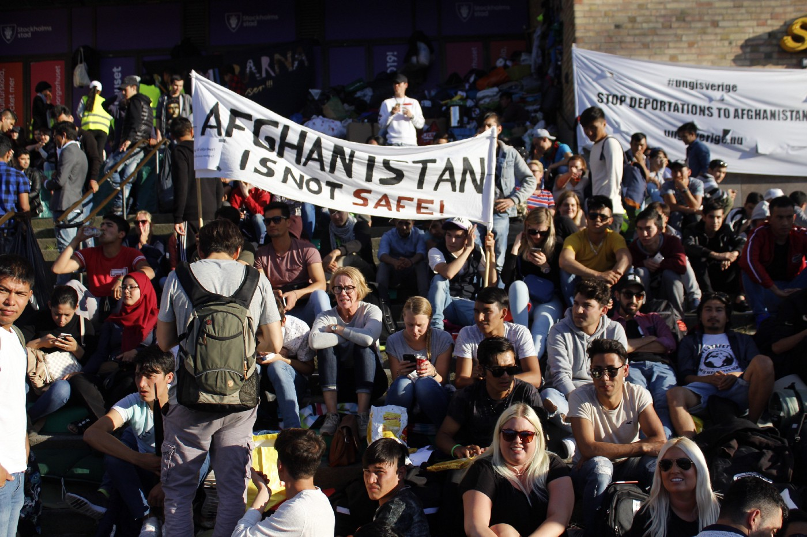

Photo AYS

Last New Year’s, I wished for a couple of things in 2017\. Among them that family reunification would speed up, unaccompanied minors would be treated better and for people to start questioning the concept of humanity and what it means to them\. Unfortunately, while looking back at 2017, very few of those things came true\.

Instead, the number of deportations increased\. Sweden continued to apply the strictest asylum laws allowed in the EU\. Nothing indicates a change anytime soon, even though there is opposition both within the government and among the public\. There are many decent people with good intentions in Sweden\. Next year, with upcoming elections, I hope they will win\. I hope the Sweden Democrats, who became a part of the government in the last elections in 2014, will lose votes\.

2017 was the year when Afghan youths became so sick and tired of their situation that they started a protest that lasted for months in Stockholm as well as in other cities\. Their action is still ongoing\. **I wish their simple demand to be met: stop all deportations to Afghanistan\.**

Next year I wish that migration and the refugee situation will become a more personal topic for more people in Sweden\. I hope fewer decisions and opinions will be based on selfishness, false arguments and fear in 2018 than in 2017\.

**_\(Hanna Strid, AYS daily digest editor\)_**
### Portugal

It has been a year since we wished for a change in the way the powerful looked at the most vulnerable in the world\. There were many changes in the figures and even more new promises but the reality is that, on the ground, for most people, there was little or no change\.

In Portugal, like in most of the European countries, the refugee crisis seems to have ended for most people’s perception, and most of the information channels have moved on\. Unfortunately, the reality is very different and despite the slight increase in the rate of relocations during this year, by the end of the deadline we were well below the target we gave ourselves to rescue people…PEOPLE\!

Portugal is seen as a country that has done a lot in comparison with others but took in about 1500 of a total of 4500 we should have taken in, which is above average but still far from enough\. More, the government even suggested we could take up to 10,000 people which makes this number even more modest and seems only to aim to boost its image in the country\.

On top of this, 54 % of the refugees who came already left the country for personal reasons of delays in the processing of paperwork\. This chronic problem was most visible recently when Saman Ali, the last Yazidi remaining in the country, went on a hunger strike, demanding his process be completed\.

On a more positive note, there was a significant effort to provide good conditions to the small number of refugees in Portugal and 45% of the Syrian refugees who came to the country were working or getting the professional training, a good rate as compared to other host countries in Europe\.

**This means that there is still a lot to do** and a huge need to expand the program, learn from mistakes, tackle bureaucracy and continue following good procedures but above all, really to take a stand and provide more and more refugees waiting throughout Europe and the world the safe place they deserve and need to rebuild their lives\.

**_\(Joao Pequeno, AYS daily digest editor\)_**
### Australia

Last year I wished that Australia would be held accountable for the gross systemic injustice it has inflicted upon innocent people who came by boat to its shores looking for safety\.

I hoped the Australian government would stop lying to the public, and that the rhetoric concerning refugees, in the mainstream media of this country would change, from divisive to truthful\.

Neither of these happened\.

I hoped that Australians would wake up to the injustice being committed in their name and hold their government accountable for their human rights abuses towards refugees and asylum seekers\.

I hoped Australians would demand change\. I hoped they would demand better\.

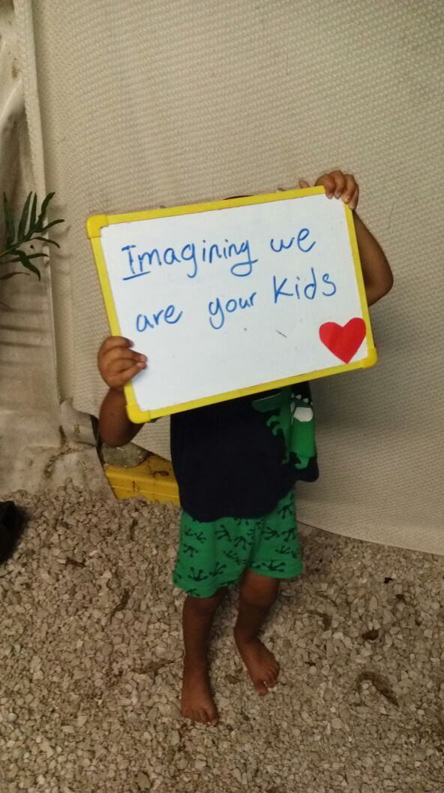

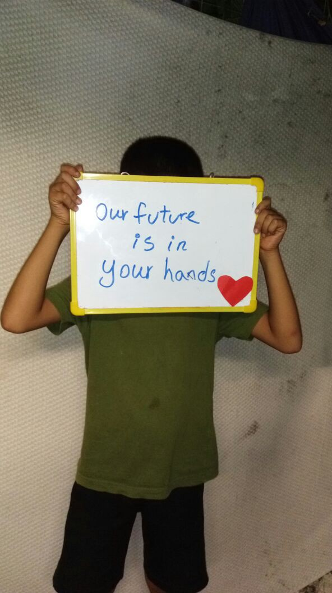

Many did\. Many didn’t\. I hoped that the international community would demand better from Australia, too\. I hoped it would demand that Australia adhere to the obligations of the refugee convention that it signed in 1951\.

The international community did demand this, but only in writing, not in actions\.

I hoped this pressure and accountability would force the Australian government to change it’s brutal and inhumane detention and boat push\-back policies that have been in effect for far too long\. 
It didn’t\.

These racist and xenophobic policies have tarnished far too many lives already, I hoped they wouldn’t tarnish anymore\.

They did\.

I hoped Australia would abolish the mandatory detention of refugees and asylum seekers\. I hoped it would abolish refoulement\. I hoped Australia would stop torturing people who were seeking asylum\. The torture didn’t stop\.

Last year I hoped that the adults and children detained on the Island prisons Australia created on Manus and Nauru would be finally resettled and safe\. I hoped they would finally be able to resume their lives\.

They weren’t given this chance\.

For many, it has been five years as political prisoners\.

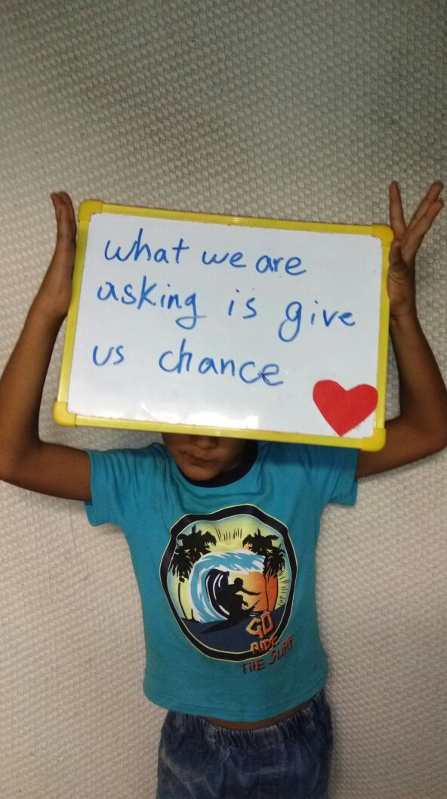

That’s more than enough suffering for innocent people to endure in order to find safety\. Five years too many in a tropical hell\.

This year I hope it ends\.

_\(If you want Australia to stop torturing refugees and to close its island prison camps — please follow this link to [RISE Refugee organization](http://riserefugee.org/sanctionaustralia/đ) web site, to find out what you can do to help put an end to this in 2018\. \)_ 
 
**_\(Manja Petrovska, AYS daily digest editor\)_**
### US

One of the hallmarks of the 2016 presidential campaign was Trump’s promise to build a wall along the entire US\-Mexico border\. Since taking office, Trump has repeatedly demanded funding for this wall, but Republicans are making no serious effort to construct it\.

The wall will never be built, for a reason politicians know well\. The US is highly dependent on undocumented labor\. Many sectors of our economy, such as agriculture, would collapse without this workforce\. In some agricultural parts of the US, undocumented workers make up to 20% of the population\. The US\-Mexico border is currently defined by a series of walls that cut through more urban sections of the border\.

However, most of the border is unfenced, and cuts through large swaths of desert that are inhospitable to human life\. These sections of the border are policed by drones, infrared cameras, and Border Patrol trucks and helicopters\. With all this technology, the US Border Patrol could easily decrease the number of migrants and refugees crossing each year, and lower the number to almost zero\. Yet instead, they have chosen to push the migration routes into desert areas, where the crossing takes days and is much more dangerous\.

By making the route more dangerous, the US is able to restrict migration without cutting it off completely, and politicians can pretend to be “tough” on the issue\. In this way, there are similarities between the US and EU borders\.

The US Border policy is not just harsh — it is murderous\. In the past 16 years, the Border Patrol has recorded over 6,000 deaths on the border\. This is a conservative number, as many bodies go undiscovered in the desert\. Since the election of President Trump, the number of deaths on the border has increased by almost 20%\.

**WHAT WE CAN DO**

Undocumented people are the backbone of the US\. Yet these same people are the targets of abuse and oppression by governmental policies\. How can we stand up for those without papers? Here are some ideas\.

**Show up** — Attend ICE check ins and deportations hearings for undocumented people in your area\. Look up active groups in your city to learn more\. Those living in NYC can tap into the [New Sanctuary Coalition](https://www.facebook.com/NewSanctuaryCoalitionNYC/) , or [Make the Road](http://www.maketheroad.org) for more ideas on how to act\.

**Volunteer on the US border** — organizations such as [No More Deaths](http://forms.nomoredeaths.org/volunteer/) are always looking for volunteers to help with their vital work assisting migrants in desert crossings\. The group also needs people to volunteer online and remotely\.

**Advocate and vote for politicians who protect migrant rights\.**

**Educate yourself on the issue so you can be a voice for those who are denied one\.**

**_\(Sam Reed, AYS daily digest editor \)_**
### And, one more thing…

we want to thank to all these people who contributed to the AYS info team in the past years\. And there are many, from all over the world\.

This has been a difficult year and we’d like to use this opportunity to warmly thank all volunteers who have sacrificed their own private lives to help the others\.

**You make this world a better place\.**

\#opentheborders

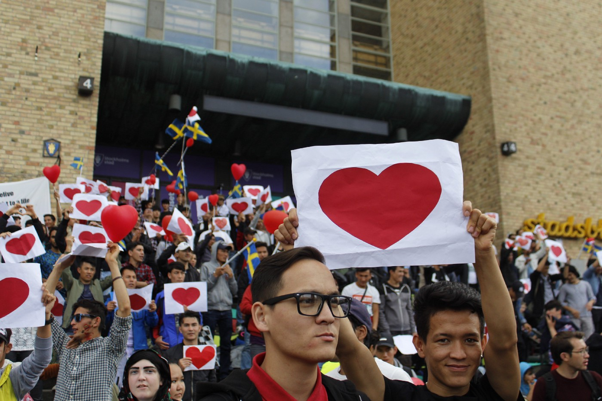

Photo AYS

> **_We strive to echo correct news from the ground through collaboration and fairness\._** 

> **_Every effort has been made to credit organizations and individuals with regard to the supply of information, video, and photo material \(in cases where the source wanted to be accredited\) \. Please notify us regarding corrections\._** 

> **_If there’s anything you want to share or comment, contact us through Facebook or write to: areyousyrious@gmail\.com\._** 

_Converted [Medium Post](https://areyousyrious.medium.com/ays-daily-digest-30-31-12-2017-1-1-2018-its-time-to-end-the-hypocrisy-44ad4ecefc83) by [ZMediumToMarkdown](https://github.com/ZhgChgLi/ZMediumToMarkdown)._
