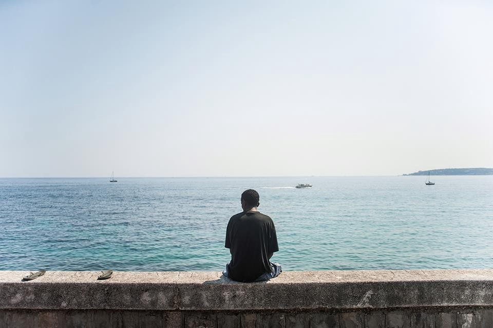

### AYS SPECIAL — Greece: Single men, one of the most vulnerable groups

Photo by Progetto20k\.

I have been a volunteer in Greece for most of the past 2 years, first in Lesvos and then in Athens as part of a team setting up and running the [Khora Community Centre](https://www.facebook.com/pg/KhoraAthens/reviews/) \.

A bright spark of a young Syrian man I know, 17 years old, was recently relocated to a northern European country\. He had spent 2 years waiting in Greece, being moved around between camps, living for months in Athens’ squats, before being given a secure apartment\. Then false promises and shockingly minimal information before the move actually happened\.

But this is a happy step in his story\. He’ll now have a chance to start his life again properly, knowing that he’ll be settled in that one place\. He’ll still have to find his way in another new country, navigate the system, make the best of it that he can\. As an amazingly positive and motivated young man, I’m sure he will\.

Even in this situation there’s such a luck of birth\. You can hardly call a young Syrian man who fled his home as a teenager lucky\. But the options available to some are so much greater than for others, especially those coming from countries that aren’t recognised as war zones or places to flee from\.

I think often of a young Pakistani man, 18 years old, who I met a few times at a local youth centre\. “I have nowhere to stay,” he said to me, with only a t\-shirt and thin raincoat to keep out the winter cold, and a brave hopeful smile\.

I see single young men as one of the most vulnerable groups, not recognised as such by the system, the government, the large aid providers\. So many young men, full of potential, energy, life force, strength, hope… but who have left everything, lost everything, and in lots of ways are floundering, ungrounded, without their family, community and elders to provide boundaries, support, and to help them take wise choices\.

Many have no chance of a positive relocation, or no hope of being reunited with their families, and live a life of interminable waiting\. Waiting for someone else’s answer to determine the course of their lives, they are stuck in limbo — cycles of hope, hopelessness, helplessness, frustration, anger\.

“I’m _so_ tired,” I have heard many say, ground down by trauma, treacherous journeys, uncertainty, waiting, powerlessness\. I have seen a real deterioration in people’s mental health over the past months and years, especially amongst some of the single men I know, often alongside an increasing reliance on drugs and alcohol\.

The waste of all this vital energy repeats itself across Europe\. The passion of youth turning from hope for the prospects of a new life to feelings of frustration, abandonment, being let down, anger\.

In Greece I have come across no evidence of any radicalisation in the name of Islam, but in some places, for some people, it can only be that this neglect by the world will eventually turn into something colder, something more hateful and vengeful\.

There is very little work available in Greece and understandably nobody wants to stay\. The short sightedness of government policies is a travesty\. This is such a massive wasted opportunity\.

With a shift in the wider perspective and some positive political will, there could be great possibilities for individuals, the refugee community as a whole and, in Greece’s case, for supporting the local economy\.

There are thousands of skilled and educated people who with a small helping hand to set up businesses could contribute so much\. They could have their hope and life energy supported and encouraged, and could be part of adding to a thriving local economy and community\.

Instead the whole situation is seen as a burden, a problem, something to defend against, something with which to fuel fear, hatred and division\. For those that have less chance of a hopeful new future, what a waste of human potential\.

**_\(Jo McGain, AYS info team and Khora Community Center volunteer\)_**

> **_We strive to echo correct news from the ground through collaboration and fairness\._** 

> **_Every effort has been made to credit organizations and individuals with regard to the supply of information, video, and photo material \(in cases where the source wanted to be accredited\) \. Please notify us regarding corrections\._** 

> **_If there’s anything you want to share or comment, contact us through Facebook or write to: areyousyrious@gmail\.com\._** 

_Converted [Medium Post](https://medium.com/are-you-syrious/ays-special-greece-single-men-one-of-the-most-vulnerable-groups-38eac963f58e) by [ZMediumToMarkdown](https://github.com/ZhgChgLi/ZMediumToMarkdown)._
