### AYS SPECIAL — Paris: Where the French system fails, people provide\.

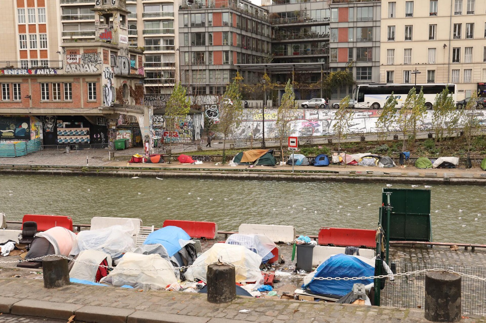

Photo: Danika Jurisic, Paris

A group of almost two hundred refugees are sleeping in a parking lot in Saint Denis, less than a kilometer from Porte De La Chapelle, the official camp made for refugees in northern Paris\. They are not accepted or allowed into the camp, because they lost their first given accommodation, and strict rules apply that every person can be admitted and housed in a camp only once\.

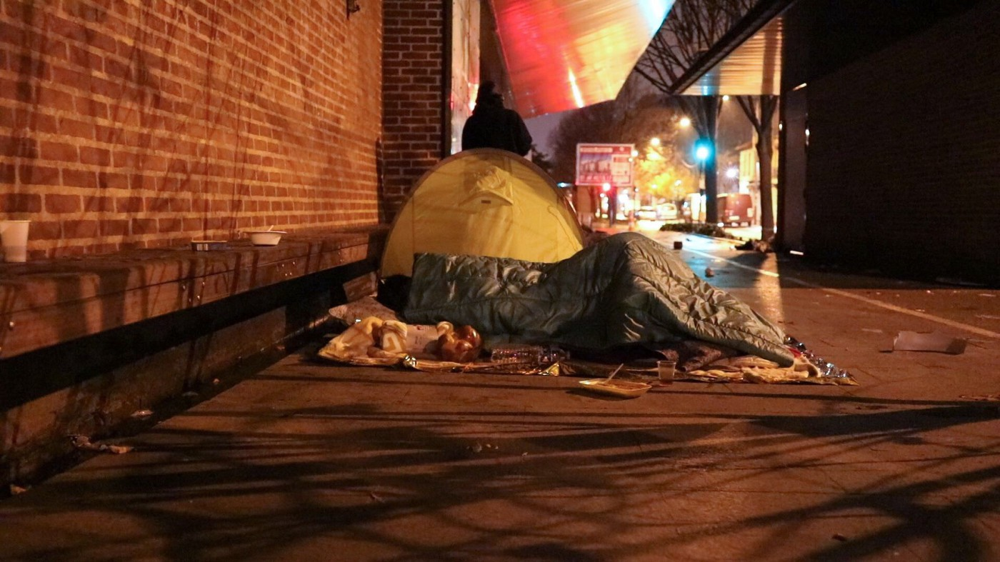

Paris winter 2017

Many of them lost their place in centre d’accueil for banal reasons, some arrived late, some couldn’t renewed their documents at the prefecture of the police, because their dublined case of asylum\-seeking was not still solved\.

The ways of French administration are complicated and cruel\. People are often left to themselves after the slightest changes that they have no control over\.

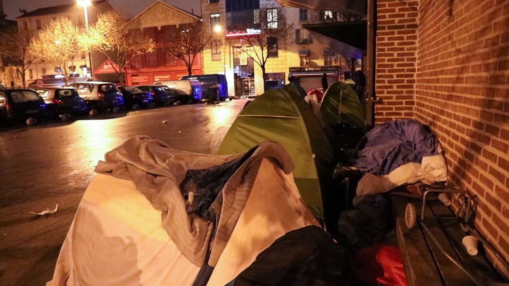

Refugees in winter

Another larger group of refugees, mainly of Afghan origin, is sleeping around the center of FTDA, hoping to get any help\. This camp is infested by rats that profit from the leftovers of the food the refugees are given and have unlimited access to the camp because of the canal surrounding it\.

This is where I met H\. a refugee with broken spine\.

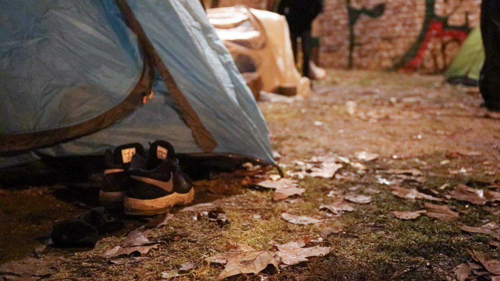

Refugee camp on Jaures, in proximity of France Terre D’Asile

Many heard of a refugee who was hit in an accident while he was trying to climb a wall that separates camp from the rest of the world\. But there was no detailed investigation to follow\. Even members of the association at the camp claim they had no information about this\.

Hamid broke his back when he fell from a height of four meters and was left paralyzed for months\. After three operation, a lot of therapy, he gained a bit mobility just in time to be kicked out of the hospital\. He found himself, in early December, on the street, with no options\. He is partially mobile, and with every day that he spends on the street, his condition gets worse\. Unable to control or urinate on his own, his clothes were soiled\. He is only 19 years old\.

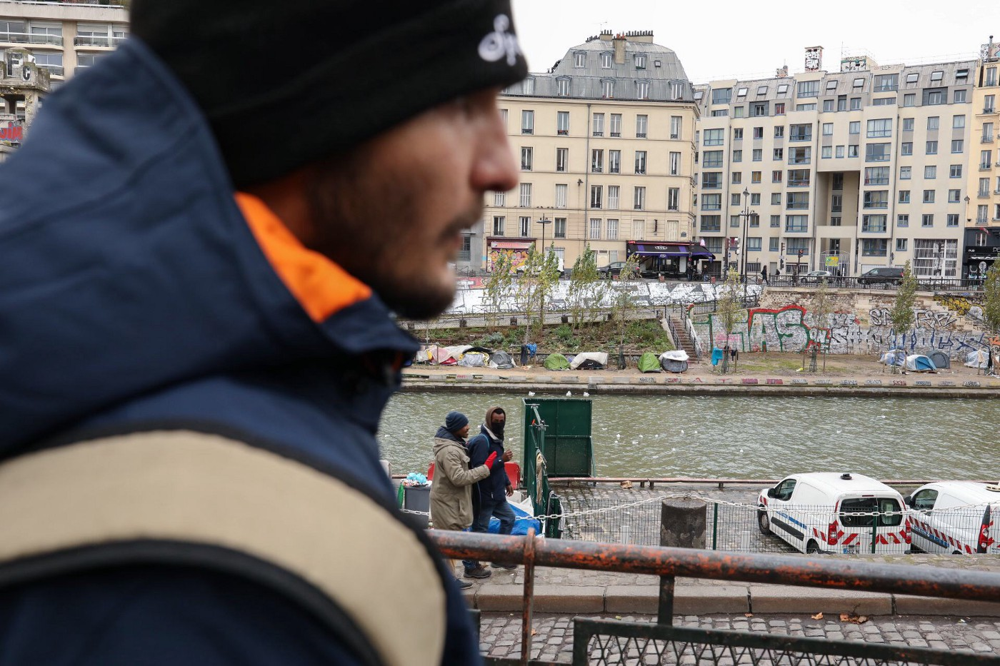

A view on the Jaures refugee camp

Hamid has to use crutches to get around, and in a busy city like Paris, taking the metro on his own is often an impossible task\. He doesn’t have any papers, in spite the fact that he has been in Paris for almost a year\.

During his time in hospital there was no procedure initiated to help him get his asylum\. The social worker who was assigned to him in hospital decided on their own, without consulting any informed body or a lawyer, that H\. has no chance of getting asylum\. This presumption is far from the truth, but it has complicated H’s situation\. He was told to leave the hospital on 8 December, without any instructions for what to do or where to go\. He went back to the only place he knew — the camp\.

He spent several days sleeping out in front, until he was told a definitive no, he cannot enter the camp\. He went back to hospital, but the doors there were also shut\. He stayed at Jaures, in a tent with a group of Afghans, hoping for some help from the FTDA\.

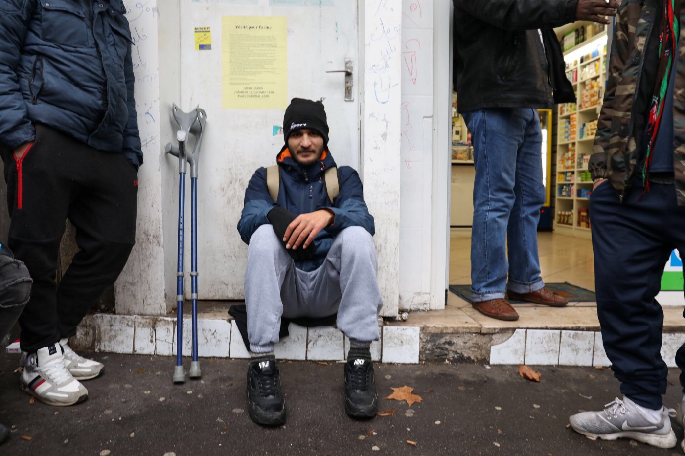

La Chapelle, the gathering point

The conditions in this camp are quite harsh\. There has been constant police harassment, Refugees would be woken in the early morning hours, with pepper spray, shouts, their tents are slashed, their sleeping bags thrown away\. There is no shelter against the cold and rain except for a plastic covers that are placed in layers over the tents\. Tats and others are common visitors, and there is only one toilet, with no running water\. These conditions are very hard even for grown men in full health, but the vulnerable and disabled have no chance\.

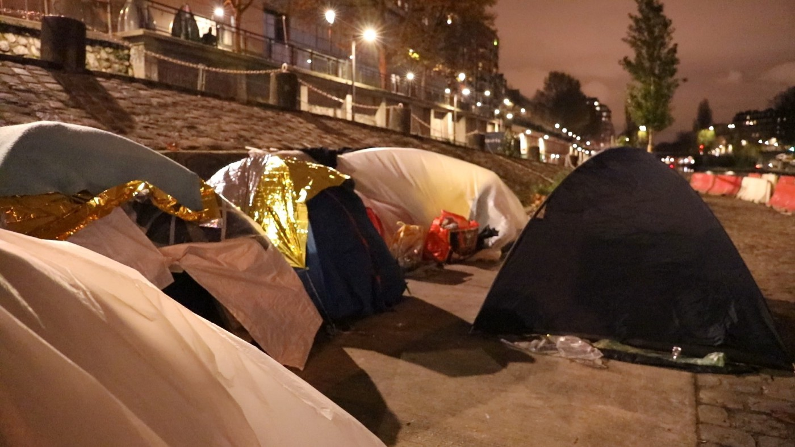

Jaures refugee camp

H\. has multiple scars on his body but the ones on his neck, the ones that were left after his operations, suggested the gravity of his condition\. It seems impossible that someone like him should be on the street, this is serious threat to his life, almost a death sentence\.

He needs to use certain equipment every four hours to relieve himself, otherwise toxins will remain in his body and could be fatal\. A box of 30 tubes — five days worth — costs 200 euros at the local pharmacy if you don’t have insurance\. This is an impossible amount of money for the refugees in the street\. Fortunately, France is a social state that has a possibility of medical insurance even for the “sans papiers,” the people without papers\.

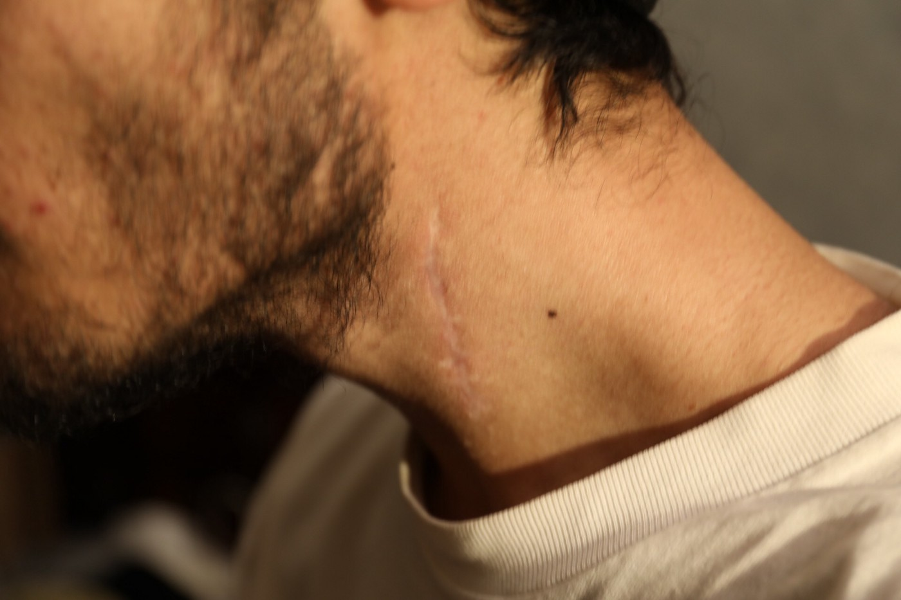

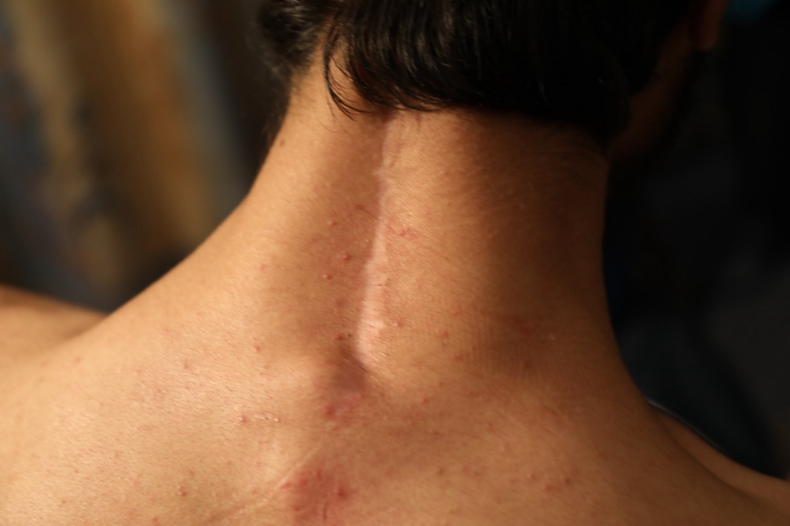

A large network of volunteers present in Paris is providing a temporary shelter for hundreds of vulnerable people, families, children, minors, people with disabilities\. H\. has been housed by them, until his poorly handled procedure and paperwork were reinitiated\. His story is very extreme and dramatic, but he is not the only one\.

There are around 200 minors in Paris who are trying to claim asylum\. In the meantime, they are sleeping either on the street or in accommodation provided by volunteers\.

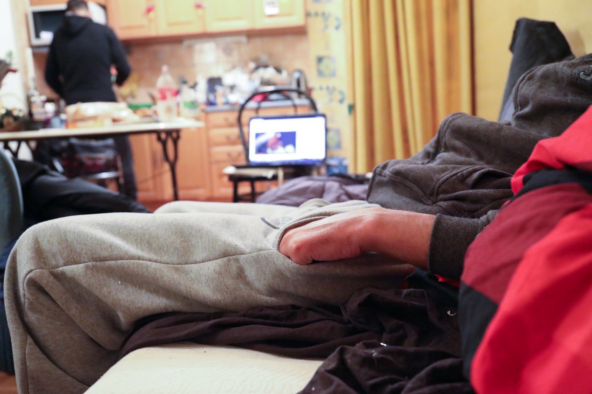

Volunteers

Unable to live side by side with adult refugees, mostly men, in improvised camps, underage refugees seek shelter elsewhere, in more hidden, less visible places, where they can avoid all sorts of street predators\.

Some of them found a relatively safe place in the park close to the Red Cross DEMI — an association that should be taking care of them, but somehow fails\. The park closes in the evening, but the boys have found a way to jump over the fence and sleep in sheltered corners\. They hide their sleeping bags in the park, but the bags are often found and thrown away\. Groups of volunteers often pass through the bars replacements for the lost bedding, and it is a sort of horrible feeling to pass them a sleeping bag trough the bars, as if they are living in a cage\.

This is almost 2018\., we should not have this situation, I should not be able able to take such a photo\.

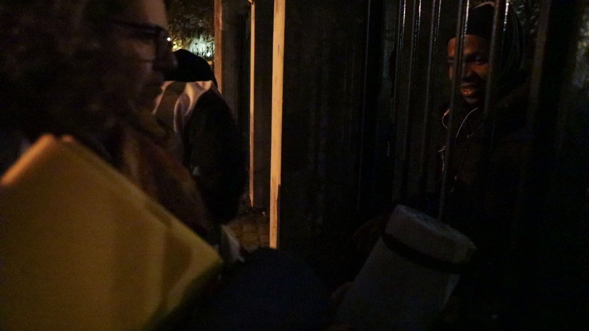

Distribution of blankets and sleeping bags to minors sleeping rough

The refusal rate for the asylum claims from underage refugees is around 90% in Paris\. Unlike for the adults, the first negative response leaves them instantly on the street\. Some of them, forced by conditions of life on the street, try to start their process as adults, lying that they are 18 and over\. Some succeed, but they lose every chance for a decent education\.

To protect them from the violence and abuse they might encounter when they are mixed with adults in other distribution points, several associations and many independent volunteers have created separate distribution of food, clothes, sleeping bags\. To keep track of them, they are provided with a cheap phone and a prepaid card with five euros credit, so they can call volunteers in case of emergency\. There are special courses, mainly French lessons, organized for them, at the local library\.

Many of them, after months of waiting, are recognized as minors and brought back into the system\. But their survival in those months between depends mainly on the help they get from volunteers\.

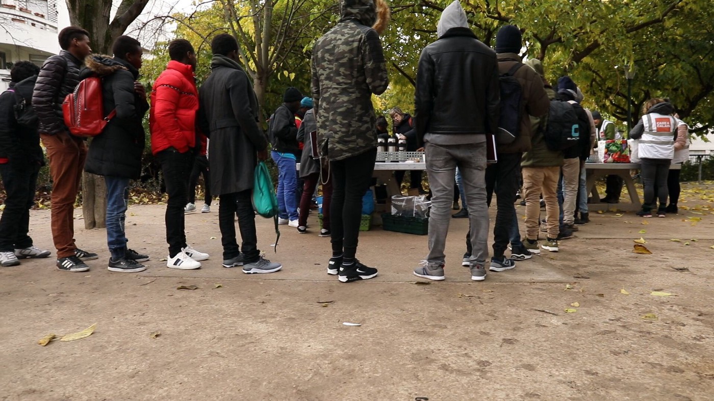

Separate food distribution for refugee minors

Even when housed, minors often don’t receive appropriate treatment\. In the centers where they are placed, in hotels, food distribution is often neglected\. They sleep in rooms without heat, in beds infested by parasites\. They return to places where they know they can ask and get some help, food, clothes…

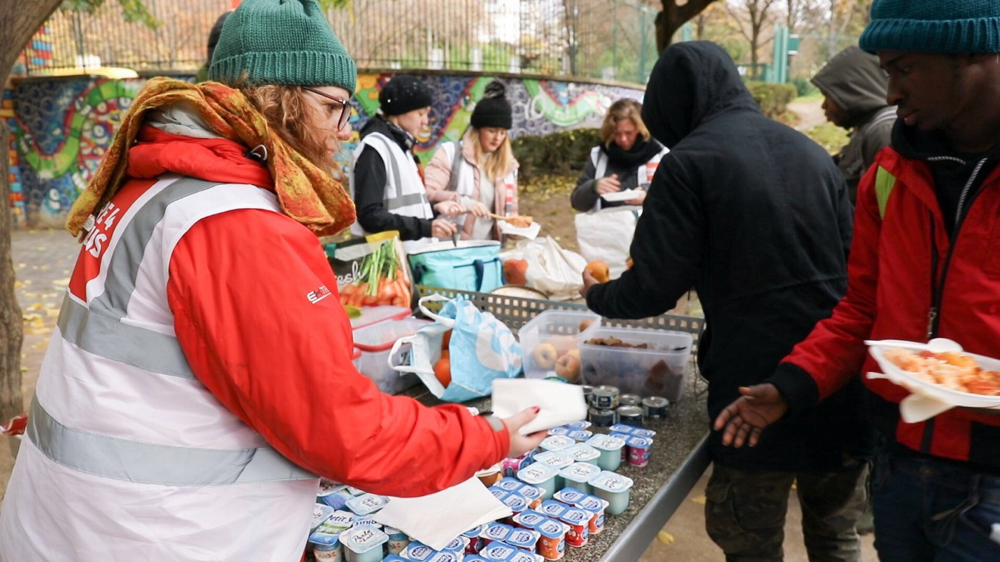

Food distribution Care4Calais

Regardless of Macron’s promise that “no one would sleep outside,” this winter, there too many refugees and homeless people in the streets\. Still no solution has been offered\.

Paris needs tents and sleeping bags and food for them, but the most needed and most desired thing would be a shelter, anything indoors that would give them a more dignified and more protected place to sleep while they are waiting for the system to provide them with asolution\. In spite of all the action, promises, fundraising, there has not been a single new bed provided\.

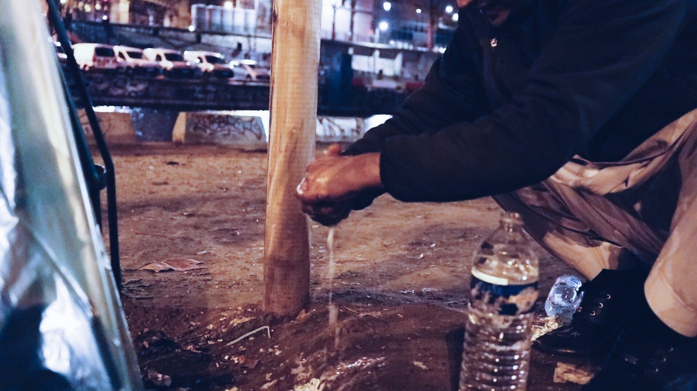

Volunteers, Parisiens, goodhearted people who give their extra room, their sofa for the refugees, are still the main force behind emergency housing for the vulnerable\. Squats, empty storage units, empty premises, even when they are occupied by an NGO or grassroots association, are used for storing donations, rather than for sheltering refugees\.

**_Text and photo by Danika Jurisic, independent volunteer in Paris\)_**

> **_We strive to echo correct news from the ground through collaboration and fairness\._** 

> **_Every effort has been made to credit organizations and individuals with regard to the supply of information, video, and photo material \(in cases where the source wanted to be accredited\) \. Please notify us regarding corrections\._** 

> **_If there’s anything you want to share or comment, contact us through Facebook or write to: areyousyrious@gmail\.com\._** 

_Converted [Medium Post](https://medium.com/are-you-syrious/ays-special-paris-where-the-french-system-fails-people-provide-484c1889aa64) by [ZMediumToMarkdown](https://github.com/ZhgChgLi/ZMediumToMarkdown)._
