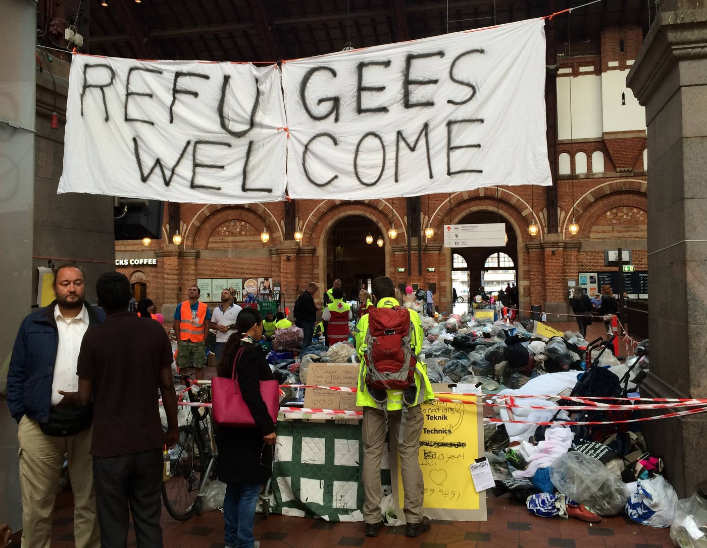
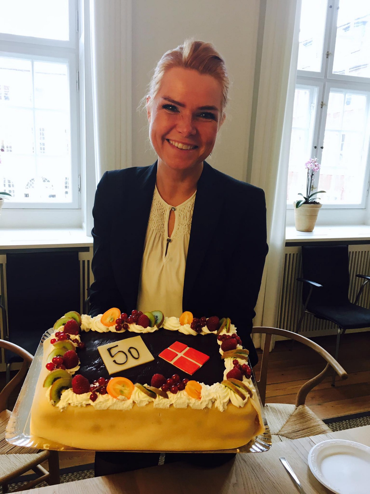

### AYS SPECIAL — Denmark: Once a fairy tale country

By Refugees Welcome Denmark\.

Once upon a time… That’s how I, as a now non\-Dane Dane, often find myself thinking of Denmark\. Once it was a welfare state for all, once the politicians would do their best to take care of all the people within its borders\. All of that was once upon a time, in the past\.

When did this change happen? It was before 2017, the year when the hostile rhetoric against humans with a non\-western background became normal on the everyday political scene\.

The year 2017 started with a reclassification of being a Dane — the Parliament voted, with a small majority, to pass a law with the wording “there can’t be more then 50% non\-Danes in a specific area, you aren’t a Dane if one of your grandparents is from a non\-western country\.” Which means that quite a lot of Danes are now non\-Dane Danes, including me\.

I’m a quarter Greenlandic\. Greenland is considered as a native non\-western country, so with my brown golden skin and brown hair I’m a non\-Dane Dane\.

This law has no influence on anyone’s legal status, it is purely symbolic\. This specific law should prevent ghettos, and as so many other laws to follow in the year 2017 the law hasn’t been enforced\.

Inger Støjberg, immigration minister celebrating the tightening of immigration controls\. Photo: IS FB page\.

In January the immigration minister, [Inger Støjberg, celebrated the 50th amendment](https://www.facebook.com/IngerStojberg/photos/a.276535912386133.68727.207401585966233/1397458950293818/?type=3) to tighten immigration controls with a cake\. This picture won’t be forgotten — the smiling minister with a big celebration cake\.

This year 67 amendments have been passed that tighten immigration laws, 16 of those have either no effect or haven’t been enforced, often because the laws made are purely symbolic, with no practical meaning except to make the rhetoric of “them and us” stronger, laws which seems to be made just to divide the people into Danes and non\-Danes\.

This government, with the support of the right\-wing Danish People’s Party have, from my point of view, created a new normal in the integration debate in the Danish media\. A representative of the Danish People’s Party in a political debate said directly “you are not a Dane” to a young male student who had lived all his life in Denmark\.

Yes, his skin was brown but he knows no other home country than the dear Daneland\. In the Danish media it created headlines for one day\. I remember clearly the sadness in the young man’s face and his answer to the politician “but I can’t make my skin white…”

The immigration ministry is proud of these amendments, so proud that on their [webpage](http://www.uim.dk) , there is a big blue result list updated with the number of tightened laws\.

By the end of 2017, the rhetoric got so bad that even the NGO’s went public and criticised the government\.

The Danish Red Cross pleaded with the government to not make laws for the sake of deterrence\. They argued that these laws are made in response to non\-existing challenges which then create an illusion in the population that there is a problem to be solved\.

Denmark is now a country where the immigration minister can decide herself whether or not Denmark will give protection to the most vulnerable people, the quota refugees that are stipulated by the UN\. Refugees are being talked about as criminals who come only to be a part of our prosperity; going against the human rights conventions is the new normal; deportations to countries of origin isn’t sensational; the parliament is making divisive laws who’s only aims seem to be to keep non\-western human beings out of the country\.

What happened to the small fairy tale country? From my point of view Denmark has been taken over by fear\. The Danish government and their support party try to rule with fear, trying to speak to the darkest side of the Danes\.

What brings me hope for the new year is the growing grassroots movements — places like the 7 year old community centre the Trampolinehouse for asylum seekers and other displaced humans and the movement of the friendly humans Venligboerne, who now have more then 22 solidarity houses around the country where humans to humans make friends, do language exchange and are together as equals\.

It is the growing activist groups like Welcome to Denmark, [flygtningebørn\.dk](http://xn--flygtningebrn-lnb.dk/) , NoDeportations, Folkebevægelsen for Asylbørns fremtid \(The Movement for Asylumchildrens Future\) and Refugees Welcome, who together help asylum seekers in their legal processes or build awareness through activism about how to stop inhumane deportations\.

These groups together with many others are the normal Danes and non\-Danes saying no, saying enough is enough\. These groups are fighting for either humane integration policies or against the border regime\.

 \.](assets/98604c09492a/1*HiUtCtf7QmW89AHADbA3YA.jpeg)

Children’s march for asylum children's right to a future\. Photo by [Tone Olaf Nielsen](https://www.facebook.com/photo.php?fbid=10155362731709755&set=a.10151093344739755.439592.674939754&type=3&theater) \.

How will the fairy tale end?

I don’t know\.

I’m scared of the road Denmark is on as a country, the road of inhumanity\. Denmark is unfortunately not only following the right wing’s attempt to split human beings into “us and them\.” Denmark is actually taking the lead\.

I wish for 2018 that the grassroots movements become stronger, that the normal Danes, the non\-Dane Danes and the new Danes together will see we are just humans\.

As a non\-Dane Dane I want to end the fairy tale with “… they lived happily ever after” — but, dear reader, the road is long and the goal is far away\. In spite of this I will keep my hopes up for us all as humans\.

In the meantime, I’m not proud of being a Dane, I’m embarrassed by the inhumane politics, but I am proud of being a non\-Dane Dane — a quarter Inuit who will continue to not follow the mainstream harassment of human beings in need\.

**_\(Camilla Lynge, non\-Dane Dane, volunteer with [Khora Community Center](https://www.facebook.com/KhoraAthens/) in Athens and AYS Info Team\)_**

> **_We strive to echo correct news from the ground through collaboration and fairness\._** 

> **_Every effort has been made to credit organizations and individuals with regard to the supply of information, video, and photo material \(in cases where the source wanted to be accredited\) \. Please notify us regarding corrections\._** 

> **_If there’s anything you want to share or comment, contact us through Facebook or write to: areyousyrious@gmail\.com\._** 

_Converted [Medium Post](https://medium.com/are-you-syrious/ays-special-denmark-once-a-fairy-tale-country-98604c09492a) by [ZMediumToMarkdown](https://github.com/ZhgChgLi/ZMediumToMarkdown)._
