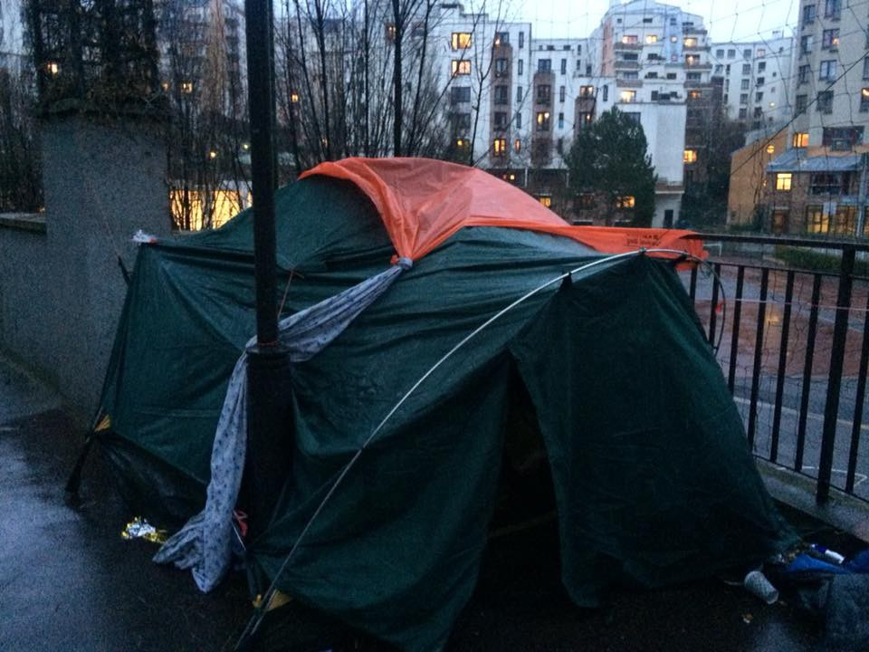
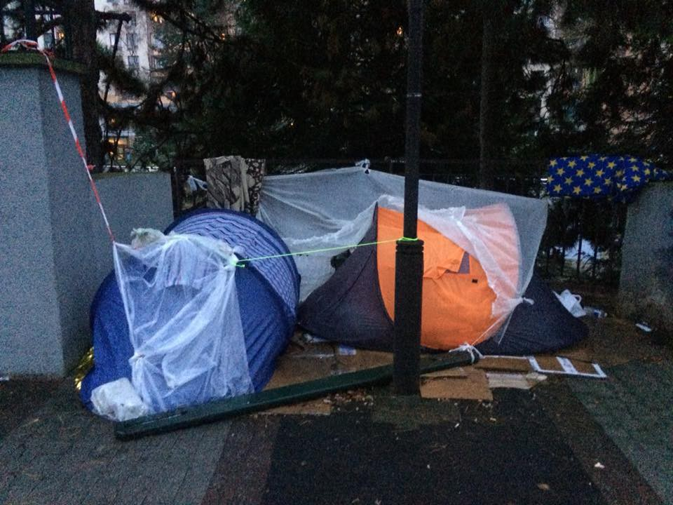
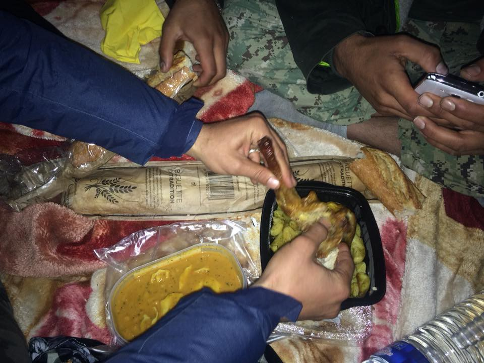
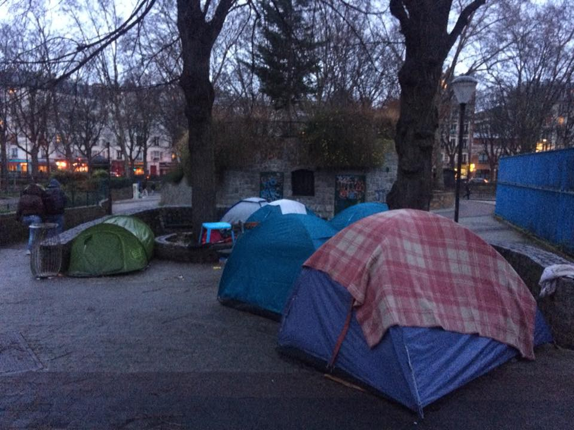

### AYS DAILY DIGEST 03/01/2018: Delays and detentions continue

_Delays at the Athens’ Immigration Unit / New centers for unaccompanied minors in central Greece / 1632 people detained across Turkey yesterday / 335 people landed in Catania, Italy / Rough sleeping in Paris / and more_

](assets/c417d25129f/1*Z4faUYSjM3EMWX6ywvW2jA.jpeg)

Yesterday afternoon, a refugee cooks for a group of companions in the so\-called “jungle” near the Serbian\-Croatian border, where they have been living for more than a year; by [Gabriel Tizon](https://www.facebook.com/gabrieltizonfotografo/?hc_ref=ARSXGzlyOEMmAoSAkmNBuLltw91gHKMVnV8sIYJzLHFXHRVoNJYFBNN__Ja6v5aFu6o&fref=nf)
#### FEATURE

[Lesvos Solidarity — Pikpa](https://www.facebook.com/pikpalesvos/) published a press release regarding an inhumane and illegal detention case linked to the EU\-Turkey deal\. They call for the immediate release of a vulnerable case currently unnecessarily detained in PROKEKA, the prison within Moria refugee camp\. **His is one of many such cases\.** Here is what they wrote:

The individual; known as K\.M, is a 31\-year\-old citizen of Pakistan, and has been a refugee in Greece since 2016 after being forced to flee due to religious persecution\. His detention is purely administrative\. His case is on\-going and his previous rejection from the Asylum Office has legal reasons to be contested\.

Despite his co\-operation with the Greek authorities, longstanding health problems, and having a safe address to return to on the island, K\.M has been imprisoned in one of the most notorious refugee facilities in Europe\. Along with 16 other detainees, K\.M is locked in one room for 23 hours per day\. Suicide attempts within PROKEKA are numerous\.

“K\.M lives a punishing life\. Every single day he is submitted to conditions that, according to International Law, consist of torture,” said K\.M’s lawyer\. “Cleanliness, heating, food, communication and dignity within PROKEKA are absolutely unacceptable and degrading for every detainee, not to mention for a person suffering from both depression and a longstanding illness\.”

The most recent UNHCR coordination meeting acknowledged that the provision of medical services in PROKEKA is poor\. K\.M’s requests to see a doctor are only sometimes granted, and always with an average delay of 48 hours\. The judicial authorities have been made aware of K\.M’s worsening physical and psychological condition, however twice they have refused to order his release, despite this being an option that is legally available\.

“This example of detention is unnecessary and dangerous\. We raise our voice against the inhumane detention of any human asking for international protection\. Detention should be an exceptional measure that should only be implemented in exceptional cases\. This is an example of bureaucracy before humanity and it is causing irreversible damage to a large number of already vulnerable people”, said Efi Latsoudi from Lesvos Solidarity\.
#### GREECE

Apart from the delays in the Asylum Service, which can be easily spotted by anyone passing Katehaki every day, over the past months major problems have also been found in the Athens’ Immigration Unit, which serves the entire Municipality of Athens\. Appointments for resident permits’ renewals are given on dates after the expiration of the current ones\. However, during this time there is no certification given, which makes these people appear to be irregular and without papers\. This generalized regime of uncertainty can go on for even a month\. During this period, people are at risk of being taken to prison, losing their job or even their insurance, Generation 2\.0 [reports](https://g2red.org/delays-residence-permits-press-release/) \.
#### New centers for minors

Several unused buildings in Attica and Magnesia, central Greece, are to be transformed into reception centers for unaccompanied minors who have applied for asylum in Greece, ekathimerini [reports](http://www.ekathimerini.com/224598/article/ekathimerini/news/defense-ministry-to-renovate-empty-building-to-host-child-migrants) , adding there are currently some 3,300 unaccompanied minors in Greece, only 1,104 living in venues deemed appropriate\.
#### Lesvos

Moria camp in Lesvos is not ready for winter\. The list of what is currently most needed, such as warm clothes, blankets, sleeping bags and even tents is available [here](https://www.facebook.com/Hamburger.Hilfskonvois/posts/1642574332430919:0?hc_location=ufi) along with information on how else you can contribute\.

](assets/c417d25129f/1*xf2ESD_wjeoc10iQdVug9w.jpeg)

Every day new tents are popping up in the Olive Grove, the wild camp around the Moria refugee camp on Lesvos, Greece — [Enough is Enough](https://www.facebook.com/enough14/?hc_ref=ARQ7XAjnw3ECrAYYN0hmyoN1WWXv9Pjh8Anf-vlY9TJ0buoMpzfA_9Z6LDVIL3dYqHE&fref=nf)
#### Chios

On December 31 2017, the UNHCR was scheduled to stop running a bus service for asylum seekers stuck in Vial camp, a 2\.5 hour walk to the city and services available there\. Over 2,000 people will be trapped in a facility designed for 800, with inadequate shelter, with no clothes distribution, no heating, no hot showers, a place that is unsafe and inhumane\. CESRT \(Chios Eastern Shore Response Team\) is urgently moving and expanding their much needed and used Children’s House program \(warm showers, clothes and food, space to play\) to a site that is walking distance from Vial\. Your help is needed, see [here](https://www.youcaring.com/asylumseekersinvialcamp-1049502) for more info\.
#### Volunteers needed

[Dråpen i Havet](https://www.facebook.com/drapenihavet/?hc_ref=ARQsvfjgWNExN1BWbpmaDAa83w8Rt3Os-0EJrNfKU3xQMQEWwOTj-rCcKgYSZC8bn4c&fref=nf) are in need of volunteers willing to work with them in Greece\. If you over the age of 25 and can stay for 10 days or more email them at frivillig@drapenihavet\.no\. Long term volunteers that are able to stay for 8 weeks or more are also needed\. As a long term volunteer you will be able to apply for financial support\.

[Action from Switzerland](https://www.facebook.com/actionfromswitzerland/) are looking for female volunteers for at least 3–4 weeks from February 2018 for the Athena Centre for Women on Chios\. The Centre has been a safe space for the female refugee population of Chios since July 2016\. Besides empowerment and educational activities, it functions as a hub from where specific needs — legal/psychological/female health — of the women are addressed\. Email rahel@actionfromswitzerland\.ch with a short introduction of yourself, your availability and CV if interested\.

Greek Reporter [writes](http://greece.greekreporter.com/2018/01/03/rise-in-migrant-flow-likely-retaliation-of-turkish-president-over-asylum-seeking-soldiers/) about a possible correlation between the Greek asylum committee granting asylum to one of the Turkish soldiers who fled to Greece after the failed coup attempt and a rise in migrant flow to the Aegean\. On Monday and Tuesday alone, 400 more people landed on Chios and Lesvos, adding to the already overcrowded registration centers\.

Another 180 asylum seekers were transferred today from Lesvos to inland Greece, amna [reports](http://www.amna.gr/home/article/218404/180-akomi-prosfuges-apo-eupatheis-omades-metaferontai-se-domes-filoxenias-stin-endochora) \. All of them are members of vulnerable groups of refugees \(families, single women, disabled, etc\) \.

](assets/c417d25129f/1*zl86GflrZx-aQKu1rjxQmw.jpeg)

[Hesam Shaeri Hesari is a political activist and a refugee from Iran\. For months he has been under arrest in Lesvos and could be deported from Greece to Turkey in the following hours\.](https://twitter.com/jmasautonell/status/948489647574933504)
#### TURKEY

A total of 1,632 people were detained across Turkey yesterday \(January 2\) according to military figures\. Border troops detained a total of 1,556 people from Syria trying to cross into Turkey, as well as five from Greece and two from Iran, Hurriyet daily [reports](http://www.hurriyetdailynews.com/over-1-600-undocumented-migrants-detained-across-turkey-125106) \. Sixty\-four migrants were also caught while trying to enter Greece from Turkey, while five others were held at the Syrian border attempting to enter Syria\.
#### ITALY

The first landing of 2018 in Catania numbered 335 people, among them a trafficked 14 year old, [OIMItalia](https://twitter.com/OIMItalia) reports\.
#### Ventimiglia

Here is an update from [Make Aid Happen](https://www.facebook.com/MakeAidHappen/?hc_ref=ART_Vht_KISRZp4pphyCVIMgYx0jngZo_c8e5jzn0P7pZ5NPONQCPf5r1Oro3gvvm8E&fref=nf) about the situation in Ventimiglia\.

> We spent the morning cleaning under the bridge, just four volunteers with some plastic bags and gloves and in few minutes almost 30 people helping and making the place a little bit better… We collected almost 100 huge plastic bags of rubbish\!
 

> They want to live in better conditions, we just need to provide them resources to do it\.
 

> After cleaning we came back to [Eufemia — Info&Legal Point](https://www.facebook.com/EufemiaVentimiglia/?fref=mentions) to keep working like dayly, but today we had an unexpected visit\. Italian police decided to come in front our local to arrest people, the people with who we are working everyday… our friends\. Arrested people will be sent tomorrow to Taranto, 1200km far away from here\. They will be back in a week or two… crossing all Italy again and again\. Is the way how Italian authorities want to stop our apparently uncomfortable work\. Scare the people who are coming to our place as the only possibility to contact their families or have some clothes\. 

#### ITALY/MALTA

The general election for a new government in Italy will be held on 4th March\. The current center\-left government, led by Enrico Letta, Matteo Renzi and Poalo Gentoloni, accepted to take in all migrants rescued in the central Mediterranean including those who were closer to Malta\. This has meant that Malta has seen no major boat arrival of migrants in the last 4 years\. Renzi is unlikely to win the election following a split in his own party and the birth of a new leftwing outfit called Liberi e Uguali \(Free and Equal\) \. The centre\-right party led by Silvio Berlusconi enjoy an eight\-point lead over both the current party and the populist Movimento Cinque Stelle \(M5S\) \. A government led by Silvio Berlusconi’s Forza Italia would also include the far\-right Lega Nord which in the past has insisted that Malta should take in migrants rescued in its waters, The Shift [writes](http://theshiftnews.com/2017/12/28/will-italian-election-re-open-maltas-migration-floodgates/) \.
#### FRANCE

Rain and cold hit Paris while many refugees are still sleeping rough on the streets\.

[Care4Calais](http://www.care4calais.co.uk) are asking everyone to have a look in their closets for a coat they no longer use and donate it to refugees who need them desperately\.

Tents as the only option for refugees in Paris\. They are popping up all over the north part of Paris\. I was invited for dinner in one of them tonight — Danika Jurisic

> **_We strive to echo correct news from the ground through collaboration and fairness\._** 

> **_If there’s anything you want to share or comment, contact us through Facebook or write to: areyousyrious@gmail\.com\._** 

_Converted [Medium Post](https://areyousyrious.medium.com/ays-daily-digest-03-01-2018-delays-and-detentions-continue-c417d25129f) by [ZMediumToMarkdown](https://github.com/ZhgChgLi/ZMediumToMarkdown)._
