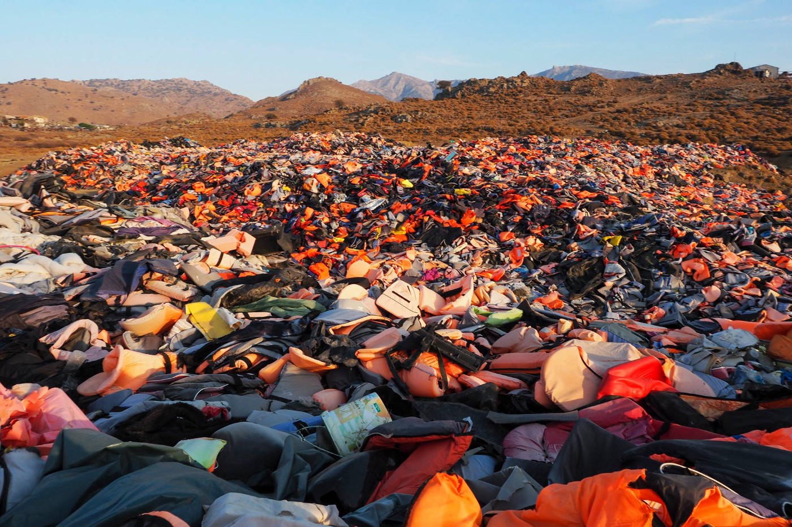
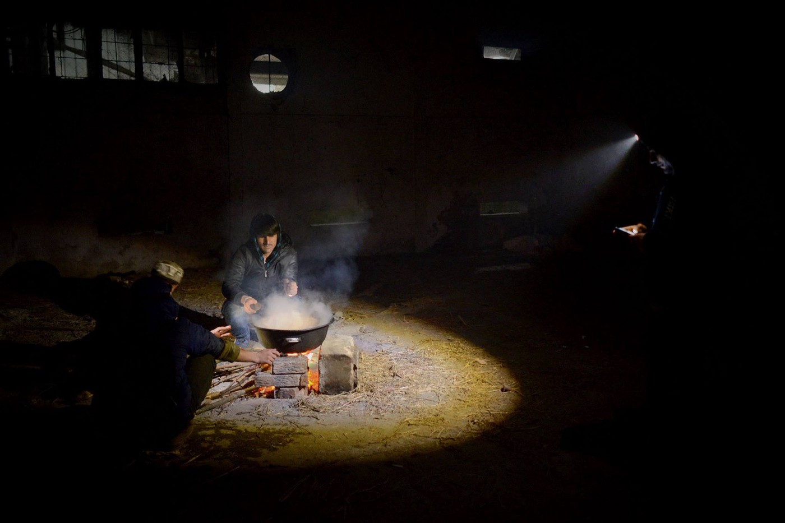
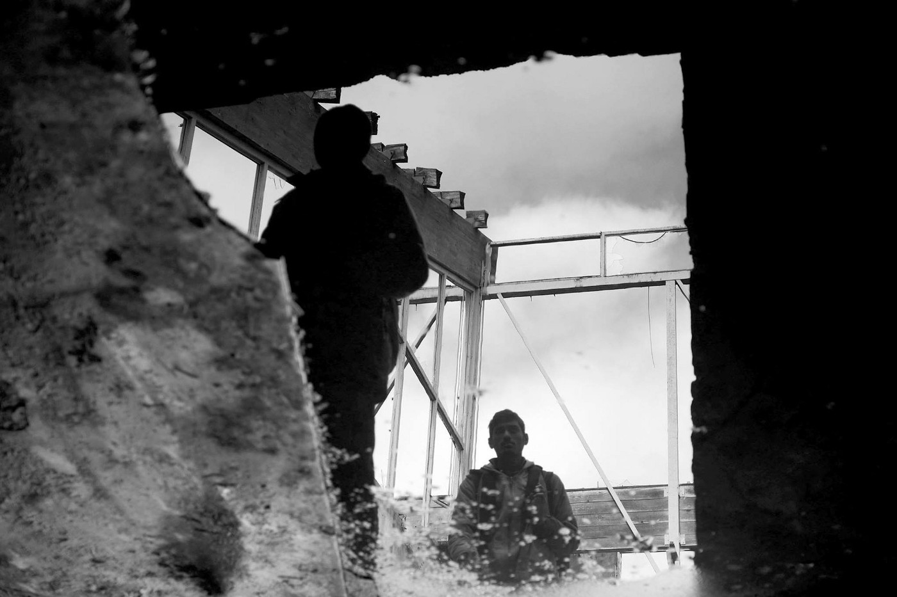
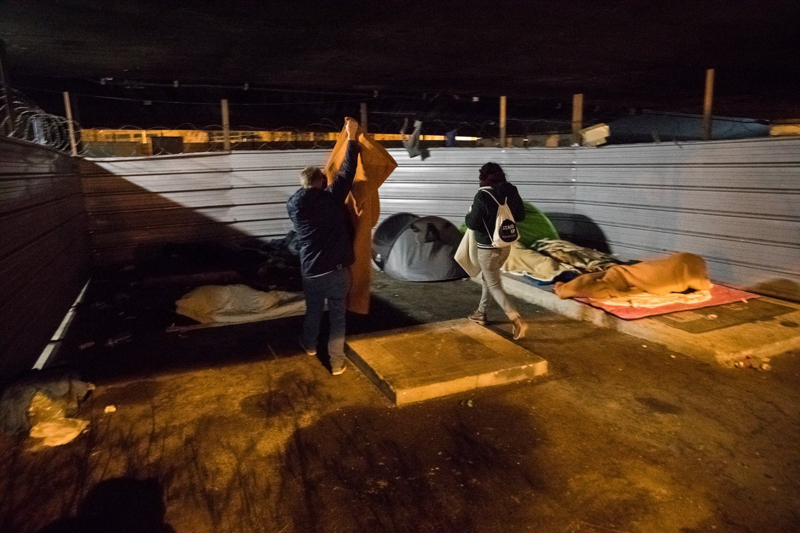
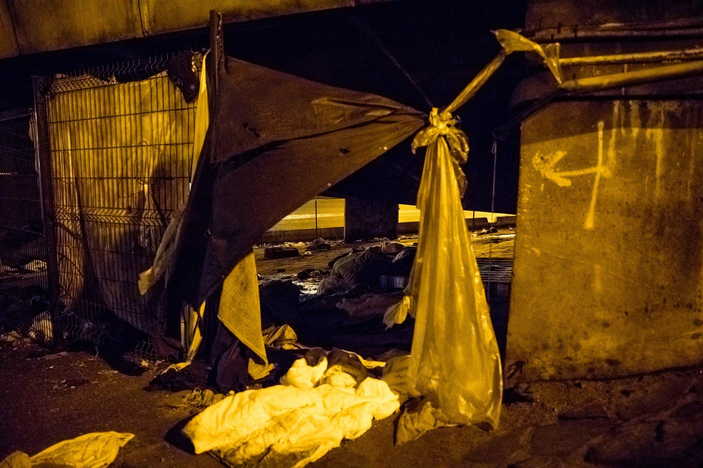
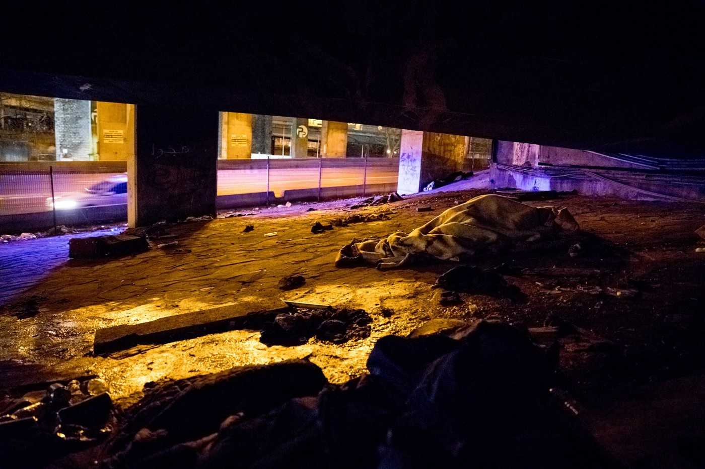
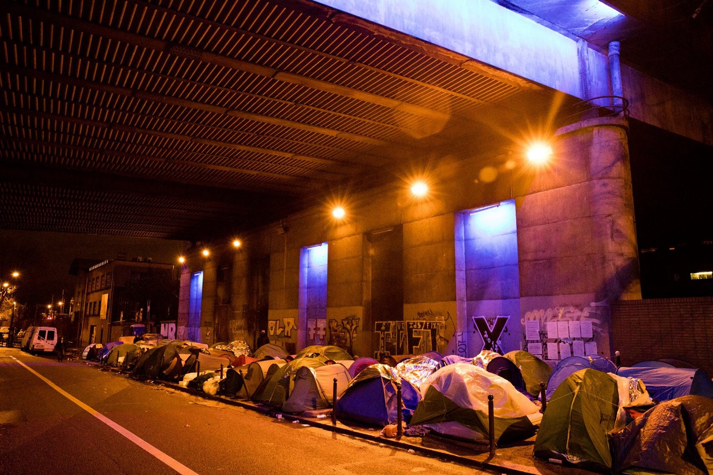
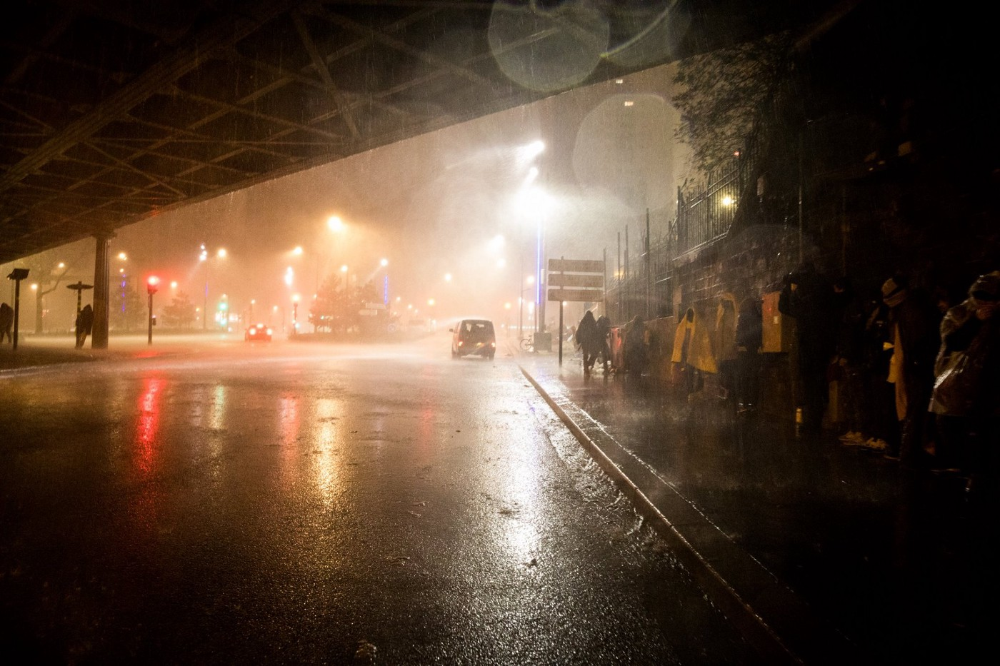

### AYS Daily Digest 04/01/17: Greater influx from Turkey to Greece in the midst of hard conditions
#### _Islands in poor condition, receiving new arrivals / Information on detention in Greece: free showers and need for aid / Serbian locals protest against refugees using their power and water / Croatia’s reception centre with no cooked dinners for a month now / Italian police’s racial profiling and disappearance of refugees / Refugees in France continue struggling / EU countries bond over anti\-refugee stance / Updates, volunteer calls, and more news\. \. \._

 \)](assets/e10e56677e75/1*J2F7vBsuQG3CWePwIME_Gg.jpeg)

Paris \(Photo from [Rastplatz](https://www.facebook.com/rastplatz/?hc_ref=ARRxB-geYtb8viGd3P4Coqf3b8ILKIjIu5VYhIYiYwIgZSbIez4fLxwmrf9XAMn1Exw) \)
#### FEATURE: influx of arrivals from Turkey to Greece

Two boats were reportedly stopped by the Turkish Coast Guard on their way to Greece over Thursday night and the following morning\. In addition to the initial 400 people who arrived over Monday and Tuesday, however, more people have arrived on the Greek Aegean islands over the past 24 hours\.

15 people arrived on a boat on the south coast of Lesvos earlier on Thursday\. 
A boat with 38 people \(28 men, six women, and four children\) landed on Chios and 44 others \(12 men, 16 women, and 16 children\) were on board a vessel that arrived on Samos\.

Considering that larger numbers of arrivals appeared about 24 hours after a Greek asylum committee granted asylum to one of the eight Turkish soldiers who fled to Greece after the failed coup attempt in Turkey in July 2016, [some](http://greece.greekreporter.com/2018/01/03/rise-in-migrant-flow-likely-retaliation-of-turkish-president-over-asylum-seeking-soldiers/) interpret this recent surge as an act of retaliation by the Turkish president for asylum being granted to the soldier\.

Turkish sources, however, claim that in 2017, the country stopped 50,000 people heading to the EU from illegally leaving Turkey, and, that “despite the international agreements, Greek security forces pushed back 6,000 refugees who entered to Greece via illegal means over the Evros River\. Most of those forced back from Greece claimed that they were either beaten by Greek police or had their phone and money appropriated\.

Either way, in spite of the EU\-Turkey deal which was supposed to serve the politicians as a means to stop the influx of refugees from Turkey to Greece and the rest of Europe, the numbers have only shrunk, while the flow of people has failed to cease\.

Refugees continue to suffer in difficult circumstances all along their travels and upon their arrival to the islands, as conditions remain precarious for those who make it there\.

■■■■■■■■■■■■■■ 
> **[NoBorders](https://twitter.com/Refugees_Gr) @ Twitter Says:** 

> > 507 #refugeesGR  arrived in the islands of #Greece since 1/1/2018 .
Bad weather, still no #safepassage
#opentheborders
#opentheislands 

> **Tweeted at [2018-01-04 14:59:11](https://twitter.com/refugees_gr/status/948931821785485312).** 

■■■■■■■■■■■■■■ 

#### GREECE
#### An overview of arrivals

> A total of 730 boats reached the Greek islands in 2017, carrying 29,229 people\.
 

> When the new year started, 13,671 people were stuck in camps on the Greek islands\. 

> **Lesvos:** 
 

> A total of 292 boats made it to the Greek island of Lesvos in 2017, carrying 12,709 people\. Official numbers on the islands when the year ended was 7\.352 people\. 

> **Chios** :
 

> In 2017, 148 boats made it across from Turkey with a total of 6,655 people\. Official numbers on Chios were at 2,005 people when 2017 ended\. 

> **Samos:** 
 

> In 2017, 131 boats reached Samos with a total of 5,433 people\. Official numbers on the island reached 1,805 people\. 

> **Other islands:** 
 

>  A total of 159 boats have made it to other islands, with a total of 4,432 people in 2017\. Official numbers on these islands were 1,805 people when last year ended\. 

> Unfortunately, many people who tried to cross the Aegean to Greece didn’t make it\. The Turkish Cost Guard \(TCG\) and the police had stopped a total of 699 boats, carrying 29,651 people\. Approximately 50% of the boats were stopped trying to cross\. 

> The TCG stopped 495 boats at sea, carrying 21,937 people\. In 2016, the TCG stopped 833 boats, carrying 38,130 people\. Turkish police stopped 204 boats at the starting point, carrying 7,714 people\. 

> The total number on refugees living in Greece at the end of 2017 was 64,400\. In the beginning of 2017, this number was not much different, at 62,784 people\. 

The update above was given by [Aegean Boat Report](https://www.facebook.com/AegeanBoatReport/?hc_ref=ARTa1ZbpuBIRskH25K5e_pUHPM5Mrjou6DsKVH-v1_P-0qjjK7p4PiLLn1upOW_iSko) \. Visit their page for more detailed statistics and information\.

> There was a total of 12,742 arrivals on Lesvos in 2017\.
 

> There are approximately 7,572 refugees currently living on Lesvos\. 
 

> In November 2017, 40% of the arrivals were children\. 
 

> In the last three days alone, 251 people have arrived\.
 

> Heavy rains and bitterly cold temperatures are battering the island, and we fear the weather will only get worse\. Moria is desperately overcrowded, with many living in dangerously thin summer tents\. 
 

> What will happen to these people without proper shelter? 

> _— [Lesvos Solidarity — Pikpa](https://www.facebook.com/pikpalesvos/?hc_location=group_dialog)_ 

### Inhumane and illegal detention case linked to the EU\-Turkey deal

The latest press release of Lesvos solidarity was signed by a number of organizations active with refugees in Greece and calls for the “immediate release of a vulnerable case currently unnecessarily detained in PROKEKA, the prison within Moria refugee camp\.” They stress out that his case is one of many inhumane and illegal detention cases linked to the EU\-Turkey deal\. We wrote about it in yesterday’s Digest and you can read the entire text [here\.](https://enoughisenough14.org/2018/01/04/lesvos-inhumane-and-illegal-detention-case-linked-to-eu-turkey-deal/)
#### Help needed

[En Red SOS refugiados](https://www.facebook.com/sosrefugiados/?hc_ref=ARTh5MXchbZ9vxWmsVqpmmdLlKTU68TVFNrvfBlP4eWcsixQ8oWGdgmMekniB1qshtk&fref=nf) need diapers and milk for children\. If anyone can arrange the donation of these items, please contact them directly\.
### Detention in Greece

This week we will be discussing detention in Greece\. Conditions in detention centres in Greece have been heavily criticised as dangerous, cramped, cold, with terrible food, and people have spoken of violence\. Being held in detention is a very scary and horrible experience, especially when you have not committed a crime, other than being in Greece, or trying to travel without the correct papers\. The video above explains how immigration detention in Greece may affect you and what you can do if you are detained\.

If you would like a list of good quality lawyers whom Refugee Info Bus works with, please send them a private message on their [Facebook page](https://www.facebook.com/RefugeeInfoBus/?hc_ref=ARTONMif8-1hrrRuD5mNpwEocf-AGbDX1VnMkK2znmX2r1dPNyQrhNH4BacwBv0KKpY&fref=nf) \.
### Athens

The Orange House is currently providing 480 showers a month to residents of Athens who do not have access to decent washing facilities\.

> Clean soapy water helps us to feel human in inhumane conditions\. A clean towel, shower gel and shampoo also help\! Thank you to everybody who has donated, no matter how small the amount — you help us to pay the water bills at the Orange House\. 

](assets/e10e56677e75/1*FtaMcrTicqDXffd4q3UIIg.jpeg)

Photo from [Help Refugees](https://www.facebook.com/HelpRefugeesUK/)
#### SERBIA

An [update](https://www.slobodnaevropa.org/a/28955305.html) on the situation among the locals of Bački Vinogradi, a small town in the Vojvodina region of Serbia that borders with Hungary, comes from the local mayor\. After the media having written about hostility from the locals towards the refugees who have settled some 15 km in the area of Horgos, the mayor reportedly wanted to state clearly that no violence was perpetrated against the people from the side of the locals, claiming they had only expressed unease with the fact that the refugees were using their electricity and water\.

Photos by Gabriel Tizon
#### CROATIA

Around 450 residents of the reception centre Porin in Zagreb have, since December 1st, been receiving only canned food for supper\. Porin residents also told AYS volunteers that they don’t get fruits anymore\.

Considering that they can’t cook in their own rooms because authorities prohibit the use electrical devices, for many, especially families with children, this measure drastically reduced their quality of life\. The electric power installations in the facility are in very poor shape due to the fact that it has never been renovated, hence the restriction in using own devices\. Together with the residents of Porin, AYS awaits for the renovations to start and hopes that the new facilities will include a space where people can prepare their own food and cook\.
#### ITALY
### Police check ups, detention, and deportation

On Wednesday, another round up on an ethnic basis was done in Ventimiglia, Italian volunteers report\. Reportedly, after the usual cleaning of the river banks done by migrants and volunteers, in front of [Eufemia\-Info&Legal Point](https://www.facebook.com/EufemiaVentimiglia/) the Italian police stopped some of the boys going to Taranto\. One of them, despite the fact that he had all the documents, was detained “for an investigation\.” The growing concern is that he might have also been deported, because other people with documents have previously been deported to the south of Italy\.

> The practice of imprisonments in the border town is not a new one, but we would like to highlight and report the developments in that it has been for a long time that these people are also taking part in the — in the area in front and in the nearby bar — which is seriously undermining the Work And Developing International Support Networks \(there are lots of aid and donations coming from France and Spain\! \) 

> — [_Progetto20k_](https://www.facebook.com/progetto20k/?hc_ref=ARRjyaaKyVfJcPtUp9-_oxz_ibvYCqVOvHAD5dOkLpMN6fVbQ7uXFoTgKCKPWJfH9vg&fref=nf&hc_location=group) 

“We express our full closeness to the migrants affected by this infamous ‘gioco dell’oca,’ certain to find them in a few days in the city,” the group said\.
#### FRANCE
### Volunteers needed in Calais

[Refugee Youth Service](https://www.facebook.com/refugeeyouthservice/?hc_ref=ARQ3pkEg8izSiACq0v5cDtz4sUHJ-XqOmUCrO_erp9KoCrkDdnQ1PsAa651J-L2gYE4&fref=nf) is looking for a new Volunteer Administrator to join the team in Calais, Northern France\. Accommodation and a contribution to living costs will be provided\. Find out more on their page and apply by contacting: info@refugeeyouthservice\.net
### Paris: **Night distribution in the city**

The following is a photo story by [Rastplatz](https://www.facebook.com/rastplatz/?hc_ref=ARRxB-geYtb8viGd3P4Coqf3b8ILKIjIu5VYhIYiYwIgZSbIez4fLxwmrf9XAMn1Exw) , in collaboration with [Stand up for refugees](https://www.facebook.com/sufr.ch/?fref=mentions) [Verein FAIR\.](https://www.facebook.com/VereinFAIR/?fref=mentions) , [Projekt Soup\-Port: Flüchtlingshilfe vor Ort](https://www.facebook.com/vereinsoliba/?fref=mentions) , [Everyday, just a smile](https://www.facebook.com/everydayjustasmile/?fref=mentions) , [Be Aware And Share — BAAS](https://www.facebook.com/beawareandshare.baas/?fref=mentions) , and [Paris Refugee Ground Support](https://www.facebook.com/PRGS.team/?fref=mentions) \.

#### SPAIN
### SAR missions

Salvamento Maritimo reports that three women and 36 men were rescued by the Guardamar Polyhymnia from a boat located seven miles east of the island of Alboran, in the western Mediterranean, about 50 km north of the Moroccan coast and 90 kilometres south of the Spanish province of Almería\.
### Looking into the death of a boy in Melilla

[Onda Cero Melilla](https://www.facebook.com/onda.ceromelilla/?hc_ref=ARTlW9tDVlGuObJ2RqHHOStODvDVOasqOidCIu584Wo3raCZrSdAOBbcRrGU3hK7ads&fref=nf&hc_location=group) reports that the Spanish Ministry of Social Welfare has opened an investigation to clarify the cause of death of a 17\-year old who was found dead in a care centre\.

The City brought the case to the attention of the prosecution and judicial authorities after the minor was found on the bed in his room\.

The dead is a young Moroccan who had been welcomed in the care centre after catching a fever in the county hospital, where his foot had to be amputated due to the wounds he endured at the end of November after attempting to travel to the peninsula\.
#### LIBYA
### Planned returns during January

■■■■■■■■■■■■■■ 
> **[IOM - UN Migration 🇺🇳](https://twitter.com/UNmigration) @ Twitter Says:** 

> > Over 20,000 migrants will be escorted back home from #Libya by the end of January. https://t.co/IaRBWswK7w 

> **Tweeted at [2018-01-04 11:02:30](https://twitter.com/unmigration/status/948872260911329280).** 

■■■■■■■■■■■■■■ 

#### EU

[InfoMigrants](https://www.facebook.com/InfoMigrants/?hc_ref=ARQCAV5Gni1KlcTsLj-WbfNTBqXn3cefnsB9DH2u9FsEB0HMmnEKznwc96UQ1TMxEos&fref=nf&hc_location=group) reports Hungary and Poland’s prime ministers have said their anti\-immigration stances are gaining support within the EU and that they want a stronger say in the bloc’s future\. Both countries have rejected the EU’s refugee quotas\. [Read more here](https://l.facebook.com/l.php?u=http%3A%2F%2Fwww.infomigrants.net%2Fen%2Fpost%2F6846%2Fpoland-hungary-say-eu-migration-policy-has-failed&h=ATPdF4YpWz9uEu0w-5HLK4TSOpPzrVtQDZiv9AvGCsagLRabXaR644Be5geoAEE6M5dLyvigIIpFrHQw8zr3xjXiT6B7JMFXBGCv-Rtdrt2PEA7cBDbfGXZaWj9evxUXFl-FTV_2Ub5VJDp8CKUtFa6qIgK-vPnsUoX-Jy3l4ke26N2eaAlGTFiFerLO7LdDTa2g6VSh2W-eaDdNN6EW8e2332FyDQrR2yBZAfca3Vqu5z8BBuQe1UHrhDe7J1wBwrusSnHqnMmXeIx6GB8C6wj95Q) \.

**We strive to echo correct news from the ground through collaboration and fairness\.**

**Every effort has been made to credit organizations and individuals with regard to the supply of information, video, and photo material \(in cases where the source wanted to be accredited\) \. Please notify us regarding corrections\.**

**If there’s anything you want to share or comment, contact us through Facebook or write to: areyousyrious@gmail\.com**

_Converted [Medium Post](https://areyousyrious.medium.com/ays-daily-digest-4-1-17-greater-influx-from-turkey-to-greece-in-the-midst-of-hard-conditions-e10e56677e75) by [ZMediumToMarkdown](https://github.com/ZhgChgLi/ZMediumToMarkdown)._
