### AYS SPECIAL — CROATIA: “They taught us about sharing, fairness and everyday fighting\.”

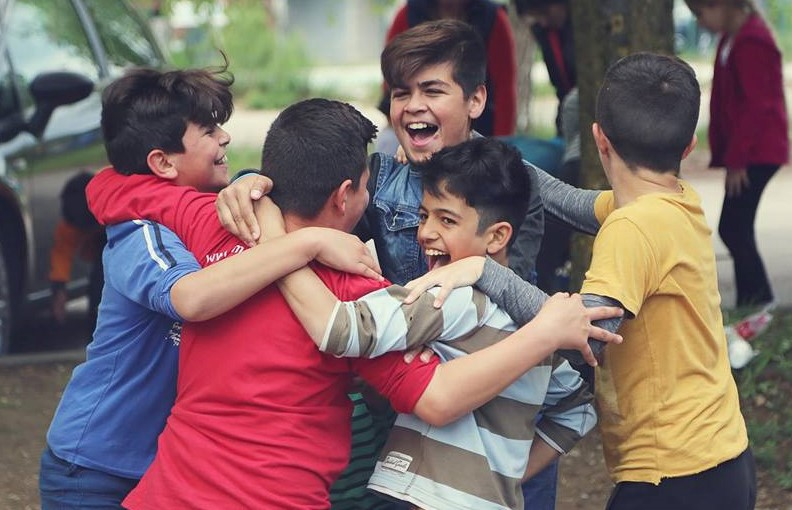

We celebrate togehter all our victories\. Photo: AYS

At the moment, sixty children and teenagers call little rooms home at Porin Asylum Seekers Center\. When 11 of us started our activities for children in October 2016, we didn’t think it would become the most important and challenging part of our volunteering\.

Today we have around 35 volunteers; individual teachers for newcomers, volunteers who organize birthday parties and drive kids to workshops and other events, volunteer who are helping kids with homework, teaching them Croatian, or helping to deal with any problems they may encounter\.

I dare to assert that we are not just teachers but also friends, we share good and bad moments, worries and hopes\.

It’s impossible to write about all of the events and emotions in a single text, but here is a short overview of our work during 2017, and our hopes for 2018\.

We spent the first three months of 2017 in a really small inadequate room shared by the different NGO\-s working at Porin\. The main problem was that we didn’t have tables, just conference chairs with little writing surfaces\. It was a nightmare for kids who are learning an entirely new language and alphabet to write on that kind of surface\.

Unfortunately, we couldn’t change anything in the room because it was shared, so we decided to send out mails petitioning the Porin administration \(read: police\) continuously until we were given permission to use one of the old conference rooms in the building and rearrange it as we wanted\.

Thanks to donations from two schools and many citizens, we created a child\-proof space\. Every kid has their own box with all the materials they need for learning, we created learning centers \(clustered tables\) that enable volunteers to work on joint tasks and encourage group learning through games and fun activities\.

Also, we are always trying to write everything multilingually, so they can learn from the environment\. For example, when we were teaching them the days of the week, they wrote them in the five languages spoken among the children and then put that on the wall\.

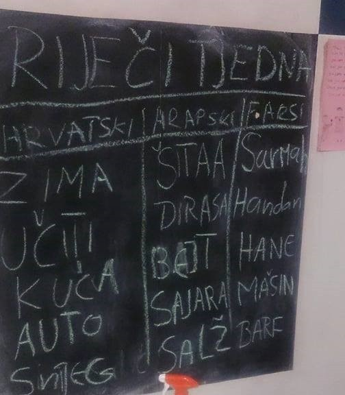

This is how we learn words\. W ords of the week in several languages\. Photo: AYS

In a system that treats them just as a number, we wanted to provide them with a place at Porin where they can express their identity and uniqueness\.

The following months were full of optimism for us and the children\. They were finally enrolled in school and we were trying our best to teach them the language and help with homework that was way too hard for them\. But luckily, we established a „big brother/sister “ program among the volunteers, so each of us had one kid to whom we gave extra care, which meant trying to connect school and parents, talk with their teachers about homework, ask family about their needs and the problems they face at the center\.

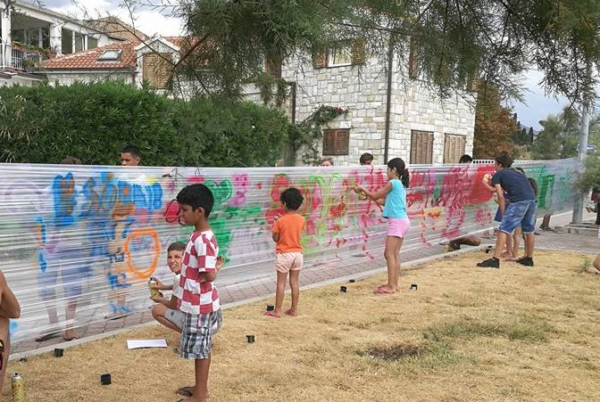

Graffiti workshop, Kaštel Kambelovac\. Photo AYS

I remember when the mother of my „little brother” invited me for tea in their room\. Their room was small, but really clean\. They had a little hot plate, a kettle and a fridge\. Some months later the police seized all the fridges from Porin residents with the explanation that they were consuming too much energy and overloading the electricity system\. For this family with three kids this means decreasing the quality of life, especially since December when people at Porin stopped receiving a cooked dinner, but were only given canned food\.

Despite that, they decided to stay here and wait for more than a year — and then their asylum application was denied, the same as for every Afghani family we met at 2017\.

In April we participated in World Book Night\. During these four days we had many workshops based on popular Croatian books and Professor Baltazar cartoons\. We showed the cartoons, read Baltazar picture books together, made Baltazar accessories \(hats and glasses\), had an experimental workshop, made our own picture books, build a Professor Baltazar magic machine and as the highlight of the events, our kids performed a show written by one of our volunteers\.

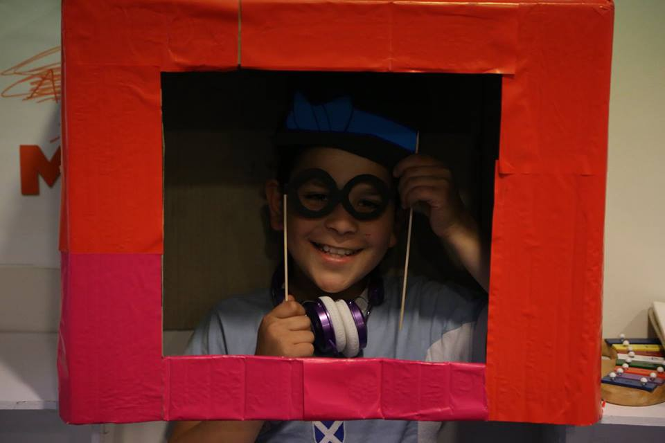

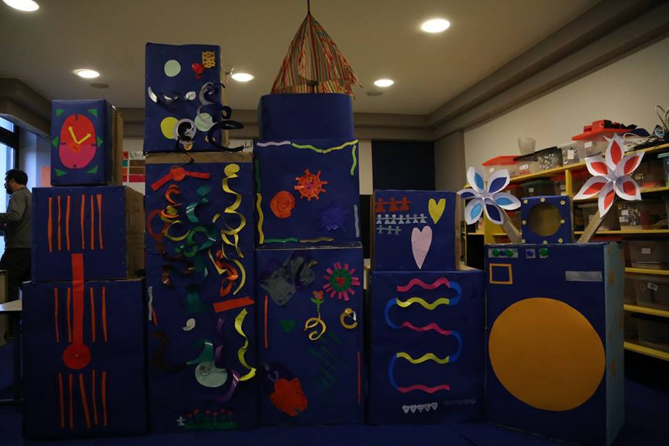

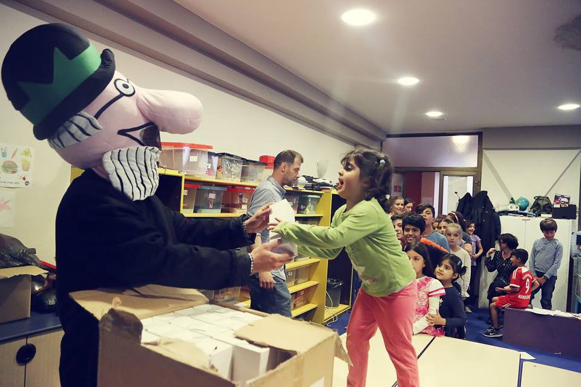

World book night event with Professor Baltazar\. Photo: AYS

It was amazing to see how after just six months of studying Croatian they were able to express themselves and how they were always striving to learn more\. Seeing them perform made us terrifically proud\. It was proof that we are doing something good and significant for these children\.

The last Saturday in April — like every last Saturday in the month — our volunteers organized a birthday party for all the kids whose birthdays fell in that month\. We had little party outside, played football and dodgeball together\. And then it happened\. After winning the dodgeball match, children from four different countries hugged each other and celebrated together\. For us, who knew there are always some tensions among children of different nationalities at Porin, this was a little victory\.

May hit us with the first negative decisions or at least the first we were aware of, because we had become close to the families\. We couldn’t understand why kids who started school here, learned the language and built friendships can’t stay, why they are “threat to national security” \(as Croatian intelligence said\) or why Afghanistan is considered a safe country\. Confronted with this, many families decided to leave, believing they will find happiness elsewhere, hoping they will not be sent back because of the Dublin III agreement between the EU countries\.

The saddest part was that we knew the children are aware of their situation because they were speaking among themselves about the negative decision\.

At one moment they play and learning languages like any other kid, at another they talk about problems and experiences that no kid should have\. We always strive to create a stable and safe environment for them, but at the end of the day nothing was certain for them\.

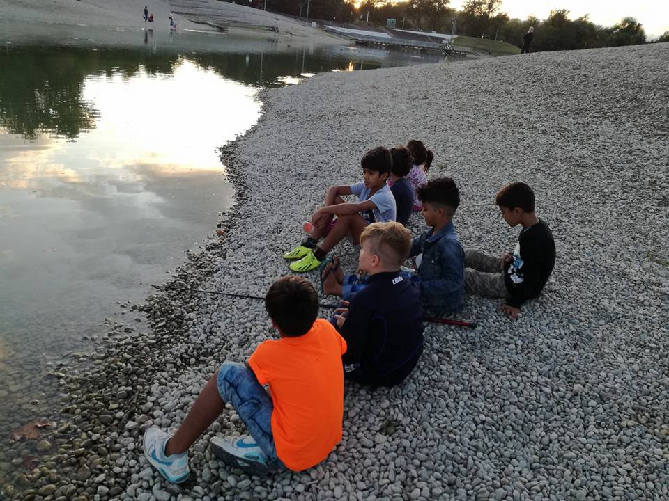

Visiting botanical garden \(Split\) and Bundek lake \(Zagreb\) \. Photo: AYS

In June and July, during school holidays, we reduced our shifts to three days per week, because many of our volunteers were out of the city for the summer\. Still we tried to involve them in as many activities as possible outside of Porin, to move them out of the Center\. Workshops, free swimming pool classes, a programming course and excursions to nearby Bundek Lake made their days a bit more cheerful\.

In the middle of August, as a part of the “Dobri domaćini” campaign we spent five days at the seaside with more than 20 children of school age and several mothers\. That five days will always be the most memorable days for all of us, days when we were just ordinary people on vacation, teaching children how to swim, doing fun activities, and cooking together\. We weren’t volunteers and Porin residents — we were friends\.

In September school started again and we were back on a four\-day working schedule, many families left because they received their second negative decision, but we also had new kids who arrived from Serbia so we had two different groups of children: beginners and ones with advanced knowledge of the language\.

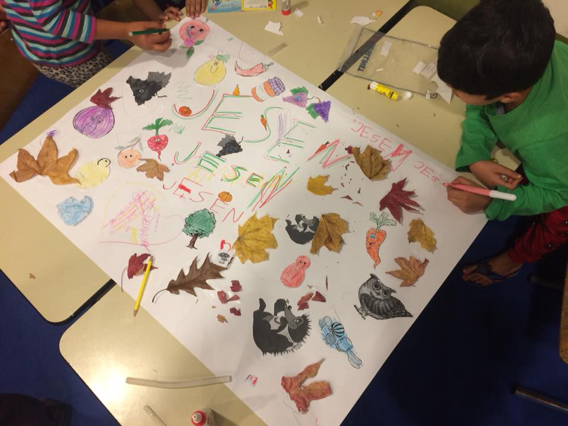

The fall with AYS\. Photo: AYS

Having shifts suitable for both of them is always challenging, but our volunteers give their best to teach something new in every shift\. After summer break, workshops in Mali Zmaj \(an NGO we are cooperating with\) continued\. These workshops are really valuable for children because there are also Croatian kids there so they can make new friendships and practice language\.

The last three months we have been trying to improve our teaching environment\. Thanks to donations from many citizens, we set up a small library that include titles in Arabic and Persian\. We also started with a “words of the week” project: every week we need to learn five words in Arabic, Persian and Croatian and on Fridays the children and the volunteers take a test\.

This helps the children, especially the newcomers, feel confident because they can also teach us something\. We decided to finish 2017 by giving children small presents which we collected from our Facebook friends\. There is no better way to finish a year then seeing smiles on their faces\.

None of this would be possible without our beautiful volunteers\. Each of them has their own reasons why they don’t give up even in moments when all of our efforts seem meaningless \(for example after the negative decisions for families\) \.

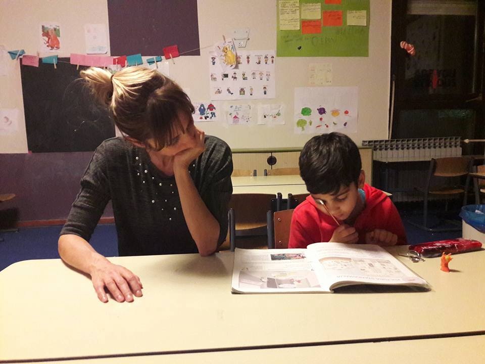

We learn togehter\. Photo: AYS

So I decided to ask them to describe a special moment with kids \(sad or happy\) \. Here are their answers:

**Dea:** One of the most memorable moments was at very beginning of my volunteering, one week after I met the mother of the kid that I was giving lessons to one\-on\-one\. We met outside Porin and started to talk in a mixture on Croatian and English, she looked truly happy about the meeting\.

I brought some cookies, tea and kinder surprise eggs for children\. One of them broke in my bag and I said to A\. \(child\) that I was sorry and he replied: „It’s not a big deal“, smiled and hugged me\. Or when we were waiting for other volunteers in the corridor and played some games, A\. left his bag with crackers at the floor and some of kids took his crackers and ate them\. When he realized this he started to cry\. I told him I will bring crackers next time, and he replied: but also for them, referring to the other kids\. He opened his bag with crackers, found one cracker left and gave it to the kid next to him\. Even if they don’t have enough for themselves, they are always sharing\.

**Elizabeta** : Going to Porin to volunteer was like finding an opening to another world for me, a world I hadn’t known before; meeting so many different people, children, cultures\. Once, one French volunteer told me “The easiest thing is to start volunteering\. The hard part is going back to how things were, saying goodbye to all those people\.”

Then, I couldn’t comprehend completely what he meant, what he said seemed weird, unreal\. But now I understand it completely: everything that happened at Porin, the children mostly, are now a part of me\. They’re with me even when I’m not there\. Every time I visit Porin, either just playing and hanging out with families or studying with them, is time beautifully spent\. You would not believe the children’s will to study, learn through games, every time I see them like that it makes me immensely happy, I’m filled with joy that I can help them, give them even the smallest thing\. But the thing is, it’s not always fun and games\.

We, as volunteers, are there to help children and their parents alike, when they feel down or are having a hard time, especially when their asylum application is denied and they are uncertain as to what to do next\. I’m happy that I could manage to make someone happy and comfort them when needed\. On the other hand, I am truly grief\-stricken that society is acting like an evil stepmother to refugees\.

**Sunčica** : Happy moment — when I met E\. \(child\) for the first time, in our old study room\. He looked a lot like any teenager, with a funny hairstyle for which he was extremely proud\. The next day I was helping him with documentation and we clicked immediately and instantly knew that I would choose him for my “little brother”\. He was learning Croatian so fast and his biggest wish was to stay in Croatia and finish school here\.

Sad moment — I brought a domino game in our room\. S\. \(kid\) wanted to play first and after kids disagreed on that, he took the dominos and ran from the room\. Other kids convinced me to ask S’s father to solve this, so I needed to go to their room\. This was my first encounter with the living conditions of the asylum seekers in Zagreb\. Such a tiny room, covered with brown and grey UNHCR blankets that clearly reminds them of status of the people who live there, the reason for their coming and the uncertainty of their future\.

**Maja:** After my first volunteering shift with little refugee kids, I couldn’t sleep for days\. I was overwhelmed by the poverty these kids live in, by the lack of basic support, and especially by the uncertainty that awaits them\.

When you meet them, when they smile at you and hug you for every little, maybe even insignificant, act of kindness or some ridiculous little, already damaged hand\-me\-down toy, you just cannot believe that there is no place on earth where these kids could feel safe and have something at least resembling a normal life\. In the meantime, many of the kids left to go to other unwelcoming countries, some even to the war zones of their own countries\. When you meet them, and start thinking not in terms of numbers but in terms of names and shiny eyes and bright smiles, it just breaks your heart\.

**Suzana:** Since I’m still new to volunteering at Porin, I’m still acquainting myself with the children, but what I’ll definitely never forget are things that are not directly related to Porin: First time meeting S\. \(kid\) outside the hotel \(when he was at the mall with his mother and grandmother\) who then jumped right into my arms for a hug\. Up until that point I believed the kids probably wouldn’t recognize me anywhere else besides Porin, since there are so many other volunteers working with them\. When I needed to go back home, his grandmother sent me kisses of gratitude\.

Or another situation, when M\. \(child\) first time checked in on me on Facebook to see how I was doing\. For most people, these kinds of things are probably little, maybe even meaningless, but to me, those are the biggest possible rewards\. At those moments you realize the children trust you\. That you being there, spending time, studying with them, giving them attention and care, means something to them\. Those children suffer the love of a world that cruelly and harshly ignores them\.

Even though they’re little kids, they are still very aware of how hard their life is, so I can only hope that we volunteers make it at least a little bit easier for them to go through it every day\.

**Sanja:** My favorite part of visiting Porin is when I’m getting out of the car at the parking lot in front of Porin and I can hear kids yelling from the balcony: Sanja, Sanja\! Then I try to figure out where are they, wave back and I see this little act brings happiness to their faces\.

Old room first day new studying room after some months\. Photo: AYS

**Petra:** At the last birthday party that was held at Porin I talked to one boy who had received asylum and had moved with his mother and brother into their own apartment\. While most refugees can only dream of leaving Porin, this boy wants to return to the hotel because his friends are still there, as well as the volunteers from various organizations\. Porin became his home because there are people there who understand what he has been through, people who love him and care about his future\.

It is a paradox that a child feels safer and more comfortable in a place like Porin than in our community at large\. This is why we all need to welcome our new citizens, our new neighbors, our new friends and help them rebuild their lives\.

**Tajana** : Yesterday AA \(child\) told me something I can’t keep out of my mind: All kids need the same things\. He showed how these little innocent beings are better people then most of my friends and relatives\.

A nine\-year\-old boy understands the concept of justice, even if he has experienced so much injustice in his life\. A kid who has right to keep chocolate he gets only for himself, but is always willing to split it and share with all the other kids in the room\. When you look at him and all the other children who come to our study room, you realize how many things they have taught us\.

They have taught us about sharing, fairness and everyday fighting\. Every second with those little life\-fighters is bless\.

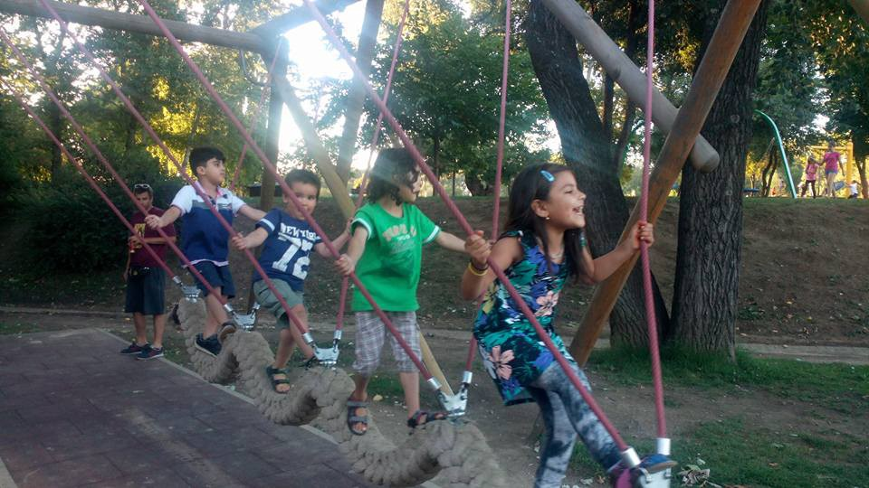

Playing togehter at Bundek\. Photo: AYS

**So, these are our hopes for 2018:**
- we hope that children will be enrolled in school 30 days after arriving in Croatia at the latest\.
- We hope psychological support will be granted to kids who deal with traumatic experiences\.
- We hope children and their family members will have access to full medical insurance as do other Croatian citizens \(now they have the right only to emergency medical insurance\.
- We hope that refugee minors who have been on their journey alone, without parents, will be given better institutional care\. We hope they will be placed in foster families or homes for abandoned children, and no longer in institutions for children and youth with behavioral problems\.
- We hope for more positive asylum decisions in 2018\.
- We hope that Afghanistan will be not be treated as if it is a safe country\.
- We hope that the Porin Center for International Protection Seekers will be updated, with new washing machines able to wash their clothes at the proper temperatures, joint kitchens they can use, and varied, cooked meals seven days a week\.
- We hope the Republic of Croatia thinks about alternative forms of accommodation for asylum seekers\.
- We hope we will grow even bigger and find more volunteers who can help families who came here through the relocation program without any kind of support for learning language \(it’s something we have already started with three families\)

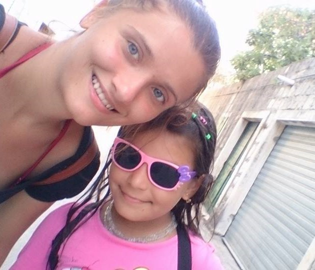

**_\(Anamaria Macanović is AYS volunteer\)_**

> **_We strive to echo correct news from the ground through collaboration and fairness\._** 

> **_If there’s anything you want to share or comment, contact us through Facebook or write to: areyousyrious@gmail\.com\._** 

_Converted [Medium Post](https://medium.com/are-you-syrious/ays-special-croatia-they-taught-us-about-sharing-fairness-and-everyday-fighting-a8a3210a9cfe) by [ZMediumToMarkdown](https://github.com/ZhgChgLi/ZMediumToMarkdown)._
