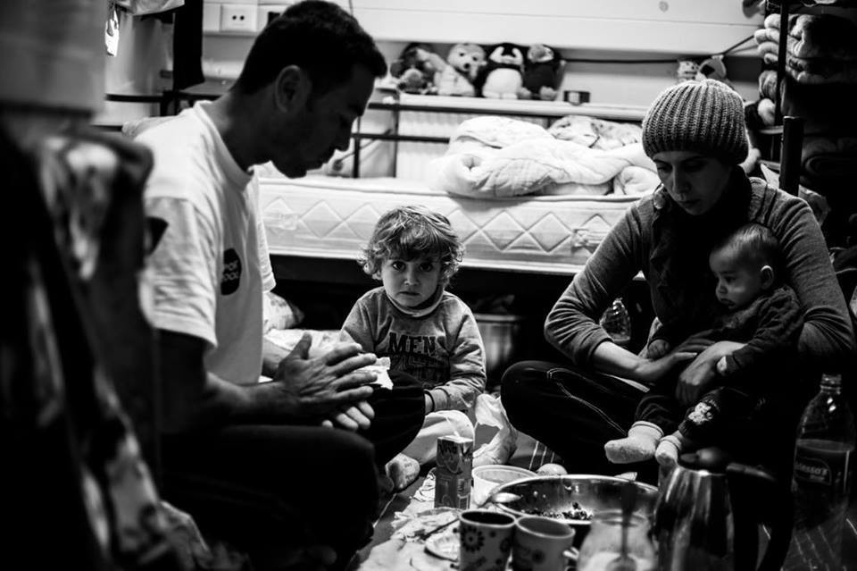
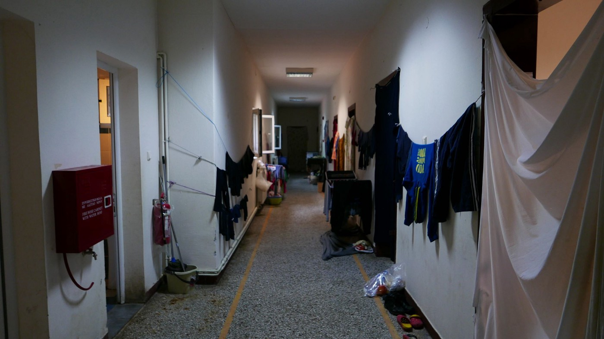
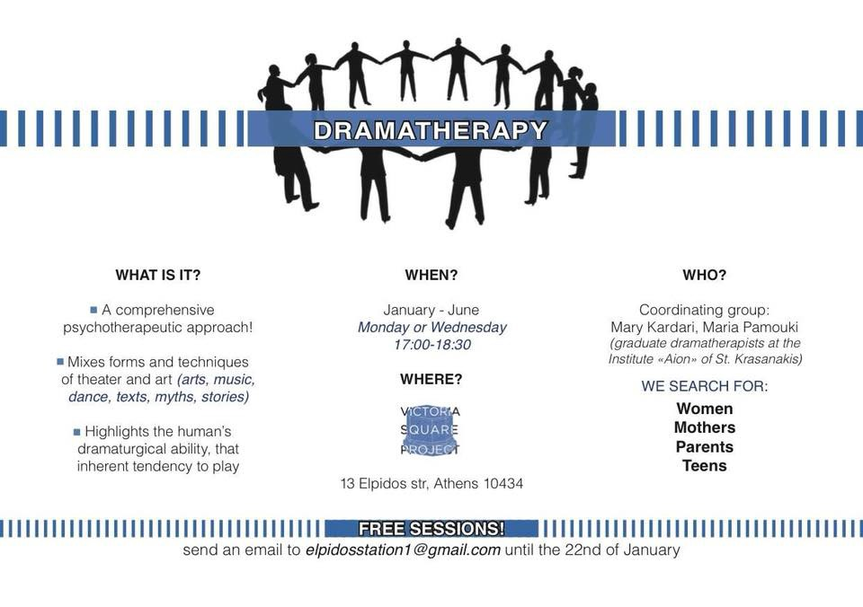

### AYS Daily Digest 06/01/2018: The sad end of good work

_Why Bridge2 had to leave the Veria camp / After new fighting: more than 60,000 displaced people in the Idlib region of Syria since November / OHF and Hope Project need support / Eight women die in shipwreck in the Mediterranean / and updates from Serbia, France and Belgium_

Bridge2 was active in Veria for 18 months\. Credits: Kuba Kaliszewski/Refugees Foundation
### Feature: Why Bridge2 had to leave the Veria camp

Requested by the military like many other teams after the eviction of Idomeni, Bridge2 started their work at Veria camp, a disused army space, in Northern Greece in October 2016\. Their activities included a clothing store, shoe store, supermarket\. They also created an individual women’s and men’s space, a kitchen with two cookers, and installed a 13\-piece playground, paid for Wifi as service at the camp was weak at best\. Additionally, they provided 57 bikes for the residents amongst many other projects each week, as stated by Bridge2 founder Sarah Griffith\.

One of the corridors at Veria\. Credits: Sarah Griffith

While she describes the collaboration with the Commander and representative from the Ministry for the camp as fine, it has come to a sad end now\. According to her own account, Griffith, who has already worked in six countries, was asked to send documents to the Department of Migration again and again\. In the end, “they informed me that I had to have the new set of documents all apostille\-ed and translated by their own lawyers\!”

As this entails huge costs, she decided to not go along with this practice anymore and remonstrates: “To charge people who are coming into your country with the relevant experience to help you, for free, at a time of crisis is quite staggering\.”

Her organization is not the only one that is forced to stop its activities now\. The founder of Bridge2 assumes that the government wants to push small NGOS out the camps and run things by themselves\.

](assets/29698b8ac1e3/1*53Yt96TVGU_V-fC6rm6CeQ.jpeg)

The goodbye party in early December ’17\. Credits: [Bridge2Refugees](https://www.facebook.com/bridge2refugees/)

In her statement Griffith further describes what went wrong over the last 18 months and how money had been wasted by officials\.

While the camp accommodated 236 residents in mid\-December, “the Government only employed 36 municipality workers, most of them unqualified, and none speaking English”, additionally there were 72 paid workers from various NGOs\.

Griffith remembers meetings at which they spoke about the very same topics week after week — but never initiated action\.

“I have seen a lot of cigarettes being smoked and much sitting and drinking of coffee,” is her unsatisfying conclusion, that many funds are just being wasted [referring](https://www.theguardian.com/world/2017/mar/09/how-greece-fumbled-refugee-crisis) to DG Echo officials, who estimated that 70 out of 100 Euros in Greece are spent for nothing\.

While independent volunteers also enthused about how Bridge2 \(considering the conditions\) managed to create a nice space from nothing, the residents of Veria will now lose massive support by volunteers\. Griffith: “ I feel shattered that this has come to an end in this way\.” Finally, she states that she will remember Greece as the “hardest and most disappointing” country to work in\.

Her full statement and an overview of things that happened and did not happen can be found on [Facebook](https://www.facebook.com/notes/sarah-griffith/the-truth-and-nothing-but-the-truth/10157307196423636/) \.

### Syria

Almost three months ago the governmental forces started an offensive to recapture the rebel\-held Idlib province in northwest Syria\. A strategic airbase is located there and it is one of the largest areas in the country that is still controlled by opposition forces\. Because of the fighting already more than 60,000 people have been displaced since November, as stated by the U\.N\. Office for the Coordination of Humanitarian Affairs \(OCHA\) \(via [Reuters](https://www.reuters.com/article/us-mideast-crisis-syria-idlib/syrian-govt-presses-idlib-offensive-as-people-flee-homes-in-the-cold-idUSKBN1EU1OE) \) \. Humanitarian Aid Agencies would not manage to meet the needs of these newly displaced civilians — some also stopped their activities in the southern province as the fighting began\.

■■■■■■■■■■■■■■ 
> **[Julian Röpcke🇺🇦](https://twitter.com/JulianRoepcke) @ Twitter Says:** 

> > Bilder von heute Morgen
Die humanitäre Katastrophe in #Idlib nimmt immer schlimmere Ausmaße an.
Zehntausende Kinder sind vor Assad und Putin auf der Flucht oder in einem der vielen „wilden“ Flüchtlingslager mit katastrophalen Bedingen untergekommen.
Europa sieht angestrengt weg. https://t.co/FdbsnYJuJA 

> **Tweeted at [2018-01-06 10:41:15](https://twitter.com/julianroepcke/status/949591688623869952).** 

■■■■■■■■■■■■■■ 

Also Mustafa al\-Haj Yousef, head of Idlib’s Civil Defence \(also known as White Helmets\), warned that there are not enough camps to cope with this large number of new arrivals — and that even more people could be forced to leave their homes due to intensification of the fighting\. “Most of them are sleeping on the ground, in tents that can’t protect from the rain or the cold\. Some people are able to rent, but the rent prices have also been very high\.”

Already 55 percent of the communities in the Idlib province are overburdened, said Jens Laerke, OCHA spokesman\. In around 10 percent of these communities, internally displaced people make up more than 70 percent of the total population\.
### Greece

Today one boat with 39 people, including 17 children, landed on Lesvos\. A team of [Lighthouse Relief](https://twitter.com/lighthouserr/status/949623859535339520) met the new arrivals and took care of them at the port of Skala Sikaminea\.

The large number of babies has become a challenge for the volunteers on the island\.

“We are giving out hundreds of diapers every day along with other supplies for babies and their mums, trying to improve the health and hygiene of the children,” says The Hope Project\. In order to keep the distributions running, they are asking for more funds\.

The One Happy Family Community Center on Lesvos is looking to replenish its library\. They are looking for novels, dictionaries, kids’ books, Farsi\-English dictionaries, Arabic\-English dictionaries, French\-English dictionaries\. If you know how to find these kinds of books, please leave them a message on [Facebook](https://www.facebook.com/OHFLesvos/posts/391078308002731) \.

](assets/29698b8ac1e3/1*YQXE1N53GmZlLjRabVeSTA.jpeg)

The OHF Community Center library\. Credits: [One Happy Family — Community Center, Lesvos](https://www.facebook.com/OHFLesvos/)

In Athens the Victoria Square project offers Dramatherapy\. It takes place at 13 Elpidos Str\. every Monday and Wednesday from 5:00 to 6:30 pm between January and June and is designed for women, parents and teens\. Volunteers who would like to help can send an email to elpidosstation1@gmail\.com until 22 January\.

### Serbia

Rigardu needs new volunteers for their projects in Serbia\. From mid\-January on, but also in February and March they need people who can stay for at least one month\. If you are interested, leave them a message on Facebook or send an email to projekte@rigardu\.de\. More information about them can be found on their [homepage](https://rigardu.de/en/aboutus/) \.

](assets/29698b8ac1e3/1*hagDUadLox2Aczf9WEQXTg.jpeg)

The mobile shower of Rigardu\. Credits: [Rigardu e\.V\.](https://www.facebook.com/rigardu/)
### Sea

The first shipwreck of 2018 took place on the Mediterranean Sea on Saturday morning when a dinghy had difficulties, the Associated Press [reports](https://apnews.com/6e4ab6adf3b04917ac2f9aa6f5bc9f1e) \.

A spokesman for the Italian Coast Guard said that eight women died\. It seems that the boat deflated\. Earlier the Libyan Coast Guard reported 25 deaths, which have not been confirmed so far\. 86 people were rescued, while survivors told the rescuers there were probably between 120 and 150 people on the boat when it departed\. According to the Spanish NGO Proactiva Arms, when the first rescuers arrived they estimated that the migrants must have spent hours in the water before the rescue\.

](assets/29698b8ac1e3/1*b_54EjibxCXaRrUNPqoMZA.jpeg)

The people rescued on board the Coast Guard’s rescue ship\. Credits: [CISOM](https://twitter.com/CIS0M)
### France

While trying to reach his tent, a man fell into the river in Paris yesterday night\. Volunteers from [Rastplatz](https://www.facebook.com/rastplatz/posts/566453670368765) managed to provide him with dry clothes\.

Meanwhile, in Calais, police with four vans intercepted a group of three people who had made a fire to keep warm\.

■■■■■■■■■■■■■■ 
> **[L'Auberge des Migrants](https://twitter.com/AubergeMigrants) @ Twitter Says:** 

> > 4 camions de CRS viennent d'arriver, une bonne vingtaine de CRS encerclent 3 migrants qui faisaient un feu dans le terrain vague à côté de l'entrepôt. https://t.co/233RksecZy 

> **Tweeted at [2018-01-05 08:52:17](https://twitter.com/aubergemigrants/status/949201877043957760).** 

■■■■■■■■■■■■■■ 

### Belgium

Two 15 year old girls who had been sleeping rough in Paris before, found safety now in Belgium\. They are now waiting for a medical appointment and bone test to provide proof of their age\.

Volunteers say, they are still in need of clothes, shoes, phones, SIM cards\. If you need the sizes or more information, send a message to [Faces Before Numbers](https://www.facebook.com/FacesBeforeNumbers/?hc_ref=ARSeaIGwggqmgyRGb07hZ_jFotodHH7UrZ-Og-k9fdvgzWWK7z1pReZ4zZBdryO3k8U&fref=nf) \.

> **strive to echo correct news from the ground through collaborationand fairness\.** 

> **Every effort has been made to credit organizations and individuals with regard to the supply of information, video, and photo material \(in cases where the source wanted to be credited\) \. Please notify us regarding corrections\.** 

> **If there’s anything you want to share or comment, contact us through Facebook or write to: areyousyrious@gmail\.com** 

_Converted [Medium Post](https://areyousyrious.medium.com/ays-daily-digest-06-01-2018-the-sad-end-of-good-work-29698b8ac1e3) by [ZMediumToMarkdown](https://github.com/ZhgChgLi/ZMediumToMarkdown)._
