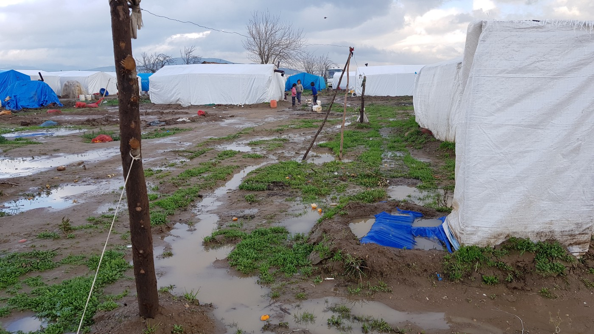

### AYS SPECIAL — Turkey: The only hope is to return one day

_How Thousands of Syrians live in the province of Izmir\._

This winter is pretty mild in Izmir\. During the daytime the temperature gets up to 15 degrees Celsius, while at night it can drop to around zero\. During the winter time farmers in this area grow cabbages or leeks\. Regular rainfall provides good growth and enough water for the fields\.

The same fields in the regionhave become the new home for thousands of Syrians who have arrived in Turkey since the begining of the war in their country\. Empty spaces, like this one in between olive trees, are becoming small makeshift settlements for up to 90 families\.

They rent the space from the local farmers, have paid for metal bars and tarpaulins to set up the tents on the earth, and here they work\. For this piece of land they must pay an average rent of 80 Euros a month\.

Most of these settlements are not accessible by car after heavy rainfall because of the dirt tracks — similar to the old days of Calais or Dunkirk, just harder to access and with rent to pay\.

One of the camps from above\.

Meanwhile their salary is far from a minimum wage\. The average payment of the farmers is around 40 Turkish Lira \(ca\. 8,90 Euro\) per day, for what can be 12 hours of work\. If there is not much work to do, the payment can go down to 10 TL \(ca\. 2\.20 Euro\)

Additionally, there is not enough work for everyone everyday\. Instead of money sometimes they get paid in vegetables from the farm\. Even though they have a residence permit to live in Turkey, which does not offer any kind of support, they are considered black\-market workers\. Therefore, the camp residents do not have any insurance or pensions for the future\.

Almost every farm camp has a “mayor”, usually the one who speaks a bit of Turkish\. He gets 10 percent of everyone’s income and usually does not work on the field\. His primary job is to decide who will work in the field on what day, as well to be a kind of spokesman for the camp with the farmer\.

Many residents would like for these mayors to take better care of the people, for when the farmer does not pay, or to help when someone is sick, but mostly this does not happen\.

Children playing in the mud with water canisters\.

Even the ones who could afford a small flat often decide to stay in the camps\. Having a flat in the village means that they live closer to the city, but it will be harder for them to get to work\. Without an income they are not able to pay their rent\. If they work on another field, a bus comes only to the camp to pick them up and bring them back later\.

Another reason for those who still have some money to stay in the camp is that sometimes not only families but whole communities or villages left Syria together\. And, now in Turkey, they want to stay together and be with those they already know\. That is why at least some communities can afford a phone, car or motorcycle\. But, in general, the structures and the conditions in the different settlements vary\.

Baking bread in one of the settlements\.

These are not the only reasons why people live in these squalid conditions\. Many Syrians who live and work in the fields did not have much back home\. In most cases they simply did not have enough money to continue their journey, while others have no intention to\. They still hope to be able to return to their old homes, homes that often do not exist anymore\.

Another issue some of the residents have to deal with is a lack of education\. Many are not able to read or write even in Arabic, and usually they do not speak a second language\. It is almost impossible to find another job\.

Because of the vast number of Syrians in the area, Turkish locals suffer with the situation\. In the past these low paid jobs were given to them, for a slightly higher salary, but now it is almost impossible for them to earn some money\. To deal with this situtation, the government passed the law stating that anybody who employs Turkish nationals will pay less tax\. However there are many issues with this law\. One is that it discourages companies to employ any refugees\. The other is it targets only those who are registered to work, while most of the people working at the farm, locals or Syrians, are not registered at all\.

One of the tents from inside\.

Poverty and dire living conditions in these settlements leave many in very dangerous situations, especially infants\. Most of them are undernourished, and there are not enough diapers and basic supplies\. Since mothers do not have enough nutritious, or sometimes any, food, they have problems with breastfeeding their babies often causing many illnesses\.

Health care is usually not accessible to many people who live in this way\. In theory public hospitals have to provide medical treatment to everyone, but, due to the language barrier — a claim made by refugees claim and witnessed by many volunteers — the help is denied to Syrians\. Sometimes they are given insufficient treatment, or they are forced to pay for a service that should be free of charge to avoid long waiting times\.

One settlement at night\.

Because of these experiences they prefer to stay home with their problems instead of seeing a doctor\. Even when treated by a doctor, in most cases they cannot afford long\-term medication, for which they usually must pay\. One refugee who had kidney problems told us that he gets his dialysis for free on the machine, but he must pay for all the other medication, and hence does not go as often as he should\. We were also told about a case in which volunteers had to push the doctors to give an iron injection to a woman whose haemoglobin values were already critically low\. Those who do get some medication often do not get any explanation as to how to use it\.

The entrance of one “school”\.

Even more crucial is the access to education for children\.

Syrians have the right to attend public schools, but first need to pass a language test\. For many this presents a major obstacle since no language courses are available\. Only some volunteers provide language training\. As the children stay in the camps most of the time — sometimes the nearest village is far away — they rarely spend time with Turkish children to improve their language skills\.

For older children it is more difficult to integrate in school\. Next to the language skills they need to pass an education test to show that they are at the right level for their age\. Because usually the parents are uneducated it is almost impossible to get access to education\. Their future will likely be in the fields, if it is not already the reality for them\. Even 14\-year\-olds are working to contribute to the family’s income\.

At least the youngest are not entirely without education\. Thanks to the efforts of volunteers some camps have their own school\. The teachers are camp residents and paid by volunteers to educate the children with the basics of Arabic\. But because they do not speak Turkish themselves, it is not possible to fully prepare the kids for public school\.

Volunteers also struggle to set up better, permanent structures\. Everything beyond emergency aid, such as the distribution of some items, is hard to realize\. Turkish authorities do not want too much attention\. After a German TV team made a documentary about one camp, a large group of people lost their residence permit for the region, were relocated to another municipality within the country, and yet again had to start their lives from scratch\.

For the people who are living in the field camps, the only hope is that they can return to their homes in Syria one day\. Turkey is not the future for them, just a place to survive the present\. Meanwhile, refugees from Syria are still arriving\. Among them are many who cannot afford to continue their journey\.

Residents carrying donated oil bottles\.

In the course of the EU\-Turkey deal, Brussels promised 3 billion Euros to Turkey in order to be able to cope with more than 3\.5 million refugees — mainly from Syria\. The European Commission states: “As of 22 December 2017, **72 projects** have been contracted worth more than **€2\.75 billion** , out of which more than **€1\.78 billion** has been disbursed\. The total allocated for implementation under the Facility for Refugees in Turkey on humanitarian and non\-humanitarian actions stands at **€2\.95 billion** \.“

But even the heaters, which most of the tents have nowadays, were bought and distributed by volunteer organizations\. Some people might benefit from these programs but the ones living in the fields of the region of Izmir definitely do not\.

\(AYS volunteer\)

Special Thanks to the [Refugees Foundation](https://www.facebook.com/RefugeesFoundationSfRotR/) for contributing to this research\.

> **We strive to echo correct news from the ground through collaborationand fairness\.** 

> **Every effort has been made to credit organizations and individuals with regard to the supply of information, video, and photo material \(in cases where the source wanted to be credited\) \. Please notify us regarding corrections\.** 

> **If there’s anything you want to share or comment, contact us through Facebook or write to: areyousyrious@gmail\.com** 

_Converted [Medium Post](https://medium.com/are-you-syrious/ays-special-turkey-the-only-hope-is-to-return-one-day-1df83003a89b) by [ZMediumToMarkdown](https://github.com/ZhgChgLi/ZMediumToMarkdown)._
