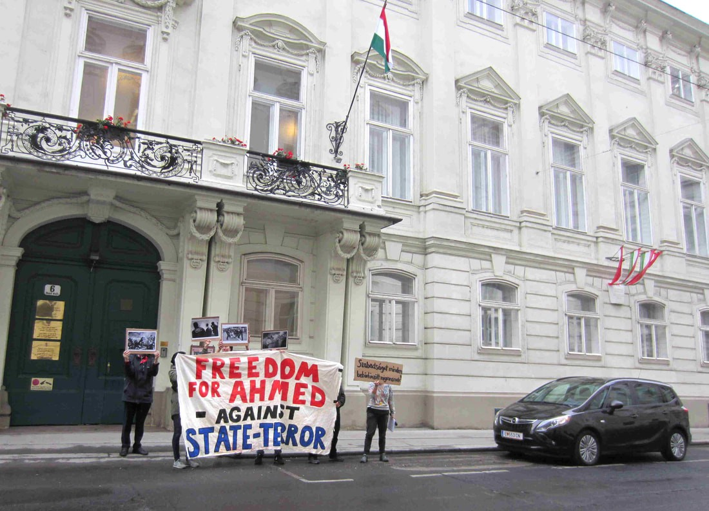
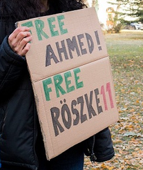
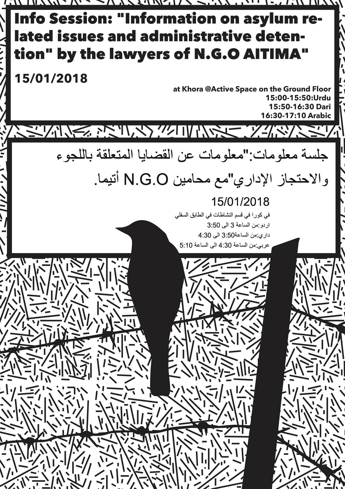

### AYS DAILY DIGEST 8/1/2018: Second instance verdict for Ahmed H\. in Hungary expected on Friday

_Retrial for Ahmed H\. in Szeged to continue on Wednesday // The wall between Turkey and Iran to be finished soon // More arrivals to Greece // Austria, and France to introduce tougher rules for people on the move this year // Help is needed for people all over Europe_

Photo by Free the Röszke 11\.
### Feature

The retrial for Ahmed H\. began on Monday at the court in Szeged, Hungary\. The second trial day is due on Wednesday this week, while the verdict should be delivered already on Friday\.

At the first instance, Ahmed was found guilty for an “act of terror” committed during the clashes with Hungarian police at the border on September 15, 2015, and sentenced for 10 years in prison\. Nevertheless, after his lawyers filed the complaint, the second instance court referred it back to the first level for “lack of consideration of contradictions in the evidence”\.

What Ahmed was doing is protesting the policy of closed borders, with many others\. The protest was held just a few hours before Hungary had closed the border and had made any crossing a criminal offense\. Clashes started after some people attempted to get through the fence, and the police responded with tear gas and water cannon, injuring dozens\.

Some people threw stones, including Ahmed\. But news footage also clearly shows Ahmed using a megaphone to call on both sides to remain calm\.

Afterwards, Ahmed H\. and 10 more people, were randomly captured by the police\. The other were charged for “illegal border crossing” and “participation in a mass riot”, while Ahmed is indicted as a leader of protests\.

Ahmed is held in a high\-security prison in Budapest since the first instance verdict was pronounced on November 30th, 2016\.

On the day of protest at the border, the police were using tear gas and water cannons against people who were trying to cross the border\. Randomly the police arrested 11 people charging them for terrorism, including some who are very young, some very old people, sick people, and a person in a wheelchair\.

_“On 1st of July 2016, after nearly 10 months of detention in horrible conditions, after the falsification of translations and the biased refusal to take into consideration important video material \(link\)and the brutal police violence, the 10 accused were found guilty\.The international media didn’t pay attention and didn’t cover the trial and the scandalous verdicts 10 of the accused got prison sentences between 1 and 3 years and expulsion from Hungary for up to 10 years\. The 10 accused and their defense lawyers appealed against the decision,” the campaign statement says\._ 

Ahmed H\. had a separate trial as he was accused as a leader of protests\.

The whole case is based on the testimony by the policy offices\.

_“The lives of the 11 people are used to state an example, with which the Hungarian state wants to create an atmosphere of fear and criminalize movement as such\.”_

The activists who are helping Ahmed got permission to visit him for the first time this December\. “You know, when you are in prison you feel different about your own freedom,” Ahmed told them\.

**“Freedom has no comparable value, you cannot balance it with money\. Even with words, I cannot describe it\.”**

In August 2015, Ahmed left his family home in Cyprus to go and help his elderly parents and six other family members flee Syria and find safety in Europe\.

The activists from the campaign Free the Röszke 11 are with Ahmed and following the trial\. You can follow the trial through their twitter [**@** freetheroszke11](https://twitter.com/freetheroszke11) \.
### Turkey

The dispute between Turkey and Greece on the destiny of 8 soldiers who fled day after attempted coup, continues\. On Monday, the meeting was held in Ankara, and Turkey insists that they have to be extradited\.

Previously, on December 29th, one of the soldiers was granted asylum, but the decision was suspended by the court in Athens\. The final decision will be delivered on February 15th\.

The court suspended decision upon request by the Greece migration minister who said that it can harm “the good relations between the two countries and therefore against the public interest\.”

Last week, it was proposed that the trial for the 8 soldiers could be held in Greece, but Turkey is objecting to this\.

According to Amnesty International, but also many other human rights organizations, the situation in Turkey is unacceptable in terms of human rights after the failed coup\.

The wall between Turkey and Iran [should be finished in the first six months](http://harekact.bordermonitoring.eu/2018/01/08/half-of-the144-kilometer-wall-built-on-the-iranian-border-has-been-completed/) of this year\. So far, according to the Turkish sources, half of the wall is already finished\. The wall will be 144 kilometers long\.

The wall between Turkey and Syrian is already completed\.
### Greece

People keep coming to Greece\. On Monday evening, one boat with 62 people arrived in North Lesvos\. Earlier, one boat arrived at Samos with 47 people on board\.

Help is needed in many places in Greece\.

Moria Medical Support is looking for doctors and nurses from the end of January and for the month of February\.

The team provides emergency medical and psychiatric care during late evening and night hours in Camp Moria, Lesvos\.

If you are interested in joining or supporting, please contact them [moria\.medics@gmail\.com](mailto:moria.medics@gmail.com)

Jafra team has a new campaign\.

[Khora](https://www.facebook.com/KhoraAthens/posts/819946231511320) will be hosting an info session led by the lawyers of Aitima NGO next Monday \(15/01/18\) titled “Information on asylum\-related issues and administrative detention”\!

Clothes for men is needed all over Greece\. This means that men are being left out in the cold without warm clothes\.

Truck Shop, that is operating in the North, need your help to collect men’s clothing\.

“One of the toughest things working in clothing distribution is that we never have enough clothes for men being donated\. This isn’t just a problem that we face, it’s a problem all groups that work in aid are facing in Greece and beyond\.

To donate, please follow this [link](https://www.betterplace.org/…/50552-truckshop-a-free-shop-f…) \.

[Orange House](https://www.facebook.com/zaatarngo/posts/1664131673607169) is \(as always\) looking for volunteers\. This time they need people who have ‘Do It Yourself’ skills to help with handy work/repair/plumbing/electric projects\. All specialties are welcome\.

They also need volunteers to teach music/yoga/etc\.

Contact them at [volunteer@zaatarngo\.org](mailto:volunteer@zaatarngo.org) or via their FB page\.
### Austria

Part of the politicians in Austria, those from the left and center, are strongly opposing the idea of restrictions on refugees proposed by the far right leader who are now part of the government\.

“It’s a sign of political failure when you’re not even trying to help people who come here achieve independence, but simply lock them up instead,” Social Democrat Jürgen Czernohorszky, Vienna’s city commissioner for integration, said in a statement\. He also called current Chancellor Sebastian Kurz, as DW reports, “to distance himself from Strache’s ideas and get his coalition partner back in line\.”

In their program, the FPÖ and ÖVP, two ultra\-right political parties, state that migrants will have to relinquish all of their cash when they apply for asylum, while that money will be used to pay for basic services for asylum applicants and other migrants in need\. The similar practice is in place in some other EU countries, already\.

Additionally, in Austria, the government plans to take cell phones from people in order to collect the data on the devices, which many countries are also doing\.

Additionally, Austria wants to impose the rule that doctors who treat asylum applicants must forego medical confidentiality to provide the authorities with information\.

Vice Chancellor Heinz\-Christian Strache suggested placing refugees in old army barracks for the duration of their asylum application process and imposing a nightly curfew for them\. His fellow from the same party, and Austria’s interior minister, Herbert Kickl, supported this idea saying that using this principle, the government will be sure that “they’re all in one place\.”
### France

Police are France is unstoppable when it comes to violence against people on the move\. On the January 7th, late afternoon, police raided a small makeshift camp in Calais\.

“Autonomous medics and other allies to migrant communities in the various fractional encampment jungles of Calais rushed to the site of the old Lidl camp on reports of a CRS police raid\. Upon arrival, a mass of CRS police had situated in a line facing off against a crowd of migrants and allies, including a man they had injured in the attack who was found lying on the ground\.”

Read the [full repor](https://calaismigrantsolidarity.wordpress.com/2018/01/08/police-attack-migrant-camp-la-police-attaque-un-camp-de-migrant-e-s/) t\.

Refugee Info Bus, their weekly report from Calais, reports about low temperatures and need to continue putting pressure on the local authorities to proving to house for people in this area\.

[Click on the link](http://www.refugeeinfobus.com/campaigns) to the email template, and please keep putting pressure on the prefecture this winter\.

Emmanuel Macron, the French president, will visit Calais later this week\. Apparently, he will discuss “reform on asylum and immigration policies”, and meet with residents to talk about the situation, but he does not intend to meet refugees living in the area\.

“This visit comes just before the Franco\-British summit on January 18th, in which renegotiations on policies such as Le Touquet Agreement are expected to be discussed\. The repercussions of a potential new border deal are as yet unknown, but it is clear that immigration will form a huge part of the renegotiations\.”

It is worth remembering that after his first six months as president, Macron stressed that France is a “land of welcome for refugees,” adding that nobody will sleep outside by the end of 2017\.

According to volunteers and refugees in Paris, Macron gives an empty promise\. Over 1000 people are in the streets of Paris right now, with thousands more in other cities in France\.

Nevertheless, the government does not provide enough accommodation, but the police continue to use violence in order to prevent people settle anywhere\.

According to MSF, tents, where people sleep, are being slashed, and their sleeping bags and blankets are being stolen\.

And it is not all\. It is expected that France will introduce tougher rules on asylum and immigration in early 2018\.

You can help people in Paris if you join campaign 500 winter boots for Paris\.

“We are appealing for donations to buy 500 pairs of Winter Boots for homeless refugees, living in the streets of Paris\. Since Christmas, six Swiss Organizations have been in Paris to support people living on the streets\. The cold and wet conditions are worsening the situation of the refugees dramatically\. Many are not equipped accordingly, most are lacking warm winter boots\. Thanks to our connections in Paris we can get a pair of boots for a mere 12 Swiss Francs\.

For just 12 Swiss Francs you can offer a person warm boots\. For 120 Swiss Francs even 10 people\! How many people would you like to support with good footwear?

Donation account \(note BOOTS FOR PARIS\)
CH54 0630 0503 6332 2511 1
Stand up for refugees
2502 Biel/Bienne
Switzerland
Paypal: [standup\.refugees@gmail\.com](mailto:standup.refugees@gmail.com)
### UK

An interesting project by RefuAid\.

“Financial inclusion is something most of us take for granted every single day\. The core essence of financial inclusion is that everyone everywhere should have access to essential financial services that are affordable and meet people’s needs\.

For those who’ve been forced to flee their homes, there is simply no financial inclusion\. Most refugees struggle to open a bank account, and once they have, access to finance doesn’t exist\.

Without a credit history, there is no available finance\.

The RefuAid: Equal Access Loan is changing this\. We are lending funds interest\-free to refugees who require funding in order to requalify and return to work\. Without access to the Equal Access Loan neurosurgeons end up working as care assistants, accountants end up working in kebab shops and nurses end up working as taxi drivers\.

With your help, we will lend to those currently excluded from mainstream finance\. The amazing thing about a donation to the Equal Access Loan program is that once it has been lent, it will be repaid and relent to help support another person to work again and again\!”

> **We strive to echo correct news from the ground through collaborationand fairness\.** 

> **Every effort has been made to credit organizations and individuals with regard to the supply of information, video, and photo material \(in cases where the source wanted to be credited\) \. Please notify us regarding corrections\.** 

> **If there’s anything you want to share or comment, contact us through Facebook or write to: areyousyrious@gmail\.com** 

_Converted [Medium Post](https://areyousyrious.medium.com/ays-daily-digest-8-1-2018-second-instance-verdict-for-ahmed-h-in-hungary-expected-on-friday-724268de656b) by [ZMediumToMarkdown](https://github.com/ZhgChgLi/ZMediumToMarkdown)._
